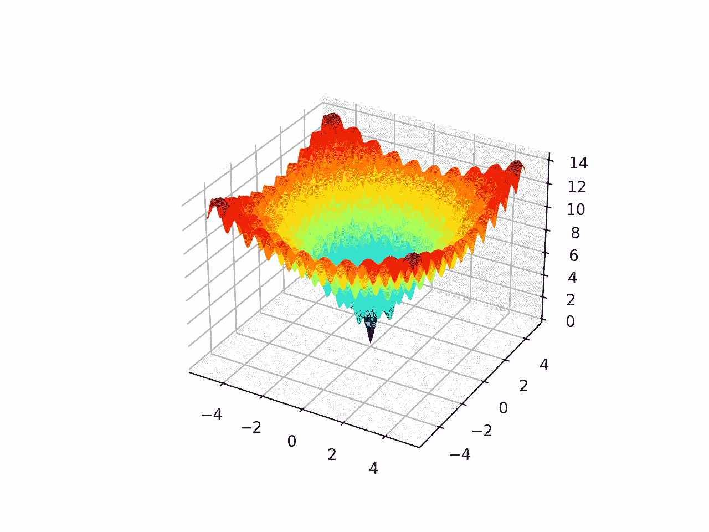

# Python 双重退火优化

> 原文：<https://machinelearningmastery.com/dual-annealing-optimization-with-python/>

最后更新于 2021 年 10 月 12 日

**双重退火**是一种随机全局优化算法。

它是广义模拟退火算法的实现，是模拟退火的扩展。此外，它与在模拟退火过程结束时自动执行的局部搜索算法配对。

这种有效的全局和局部搜索过程的结合为具有挑战性的非线性优化问题提供了一种强大的算法。

在本教程中，您将发现双重退火全局优化算法。

完成本教程后，您将知道:

*   双重退火优化是一种全局优化，是模拟退火的改进版本，也利用了局部搜索算法。
*   python 中如何使用双重退火优化算法 API？
*   用双重退火法解决多目标全局优化问题的例子。

**用我的新书[机器学习优化](https://machinelearningmastery.com/optimization-for-machine-learning/)启动你的项目**，包括*分步教程*和所有示例的 *Python 源代码*文件。

Let’s get started.

使用 Python 进行双重退火优化[苏姗娜·尼尔森](https://www.flickr.com/photos/infomastern/23764601456/)拍摄的照片，保留部分权利。

## 教程概述

本教程分为三个部分；它们是:

1.  什么是双重退火
2.  双重退火原料药
3.  双重退火示例

## 什么是双重退火

双重退火是一种[全局优化算法](https://en.wikipedia.org/wiki/Global_optimization)。

因此，它是为具有非线性响应面的目标函数设计的。这是一种随机优化算法，意味着它在搜索过程中利用了随机性，每次搜索都可能找到不同的解决方案。

双重退火基于[模拟退火](https://en.wikipedia.org/wiki/Simulated_annealing)优化算法。

模拟退火是一种随机爬山，其中候选解以随机方式被修改，并且修改的解被接受以概率性地替换当前候选解。这意味着更差的解决方案有可能取代当前的候选解决方案。这种替换的概率在搜索开始时很高，并且随着每次迭代而降低，由“温度”超参数控制。

双重退火是经典模拟退火算法的一种实现。它基于 1997 年论文“[广义模拟退火算法及其在汤姆逊模型](https://www.sciencedirect.com/science/article/abs/pii/S037596019700474X)中的应用”中描述的广义模拟退火(GSA)算法

它结合了从“*快速模拟退火*”(FSA)的退火时间表(温度随算法迭代而降低的速率)和以作者命名的“T2”查利斯统计替代统计程序的概率接受。

实验结果发现，这种广义模拟退火算法似乎比与之比较的经典或快速版本的算法表现得更好。

> GSA 不仅比 FSA 和 CSA 收敛更快，而且比 FSA 和 CSA 更容易从局部极小值中逃脱。

——[全局优化的广义模拟退火:GenSA 包](https://journal.r-project.org/archive/2013/RJ-2013-002/RJ-2013-002.pdf)，2013。

除了模拟退火的这些修改之外，局部搜索算法可以应用于通过模拟退火搜索找到的解。

这是所希望的，因为全局搜索算法通常擅长为最优解定位盆地(搜索空间中的区域)，但是通常不擅长在盆地中找到最优解。而局部搜索算法擅长寻找流域的最优解。

将局部搜索与模拟退火过程配对，可确保搜索充分利用所定位的候选解。

既然我们已经从较高的层次上熟悉了双重退火算法，那么我们就来看看 Python 中用于双重退火的 API。

## 双重退火原料药

双重退火全局优化算法可通过[双重退火()SciPy 函数](https://docs.scipy.org/doc/scipy/reference/generated/scipy.optimize.dual_annealing.html)在 Python 中获得。

该函数将目标函数的名称和每个输入变量的边界作为搜索的最小参数。

```py
...
# perform the dual annealing search
result = dual_annealing(objective, bounds)
```

有许多附加的搜索超参数具有默认值，尽管您可以配置它们来自定义搜索。

“ *maxiter* ”参数指定算法的迭代总数(不是函数求值的总数)，默认为 1000 次迭代。如果需要，可以指定“ *maxfun* ”来限制功能评估的总数，默认值为 1000 万。

搜索的初始温度由“ *initial_temp* 参数指定，默认为 5，230。一旦温度达到等于或小于(*初始温度*重启温度比*)的值，退火过程将重启。该比率默认为非常小的数字 2e-05(即 0.00002)，因此重新退火的默认触发温度为(5230 * 0.00002)或 0.1046。

该算法还提供了对其所基于的广义模拟退火所特有的超参数的控制。这包括在搜索过程中可以通过“*访问*”参数进行多远的跳转，该参数默认为 2.62(优选小于 3 的值)，以及“*接受*”参数，该参数控制接受新解决方案的可能性，该参数默认为-5。

调用[最小化()函数](https://docs.scipy.org/doc/scipy/reference/generated/scipy.optimize.minimize.html)进行默认超参数的局部搜索。可以通过向“ *local_search_options* ”参数提供超参数名称和值的字典来配置本地搜索。

通过将“ *no_local_search* ”参数设置为 True，可以禁用搜索的本地搜索组件。

搜索的结果是一个[optimizer result](https://docs.scipy.org/doc/scipy/reference/generated/scipy.optimize.OptimizeResult.html)对象，在该对象中可以像字典一样访问属性。搜索成功(或不成功)可通过“*成功*或“消息”键进入。

可通过“ *nfev* 访问功能评估的总数，可通过“ *x* 键访问为搜索找到的最佳输入。

既然我们已经熟悉了 Python 中的双重退火 API，那么让我们来看看一些工作过的例子。

## 双重退火示例

在本节中，我们将看一个在多模态目标函数上使用双重退火算法的例子。

[阿克利函数](https://en.wikipedia.org/wiki/Ackley_function)是多模态目标函数的一个例子，它有一个全局最优解和多个局部最优解，局部搜索可能会陷入其中。

因此，需要一种全局优化技术。它是一个二维目标函数，其全局最优值为[0，0]，计算结果为 0.0。

下面的示例实现了 Ackley，并创建了一个显示全局最优值和多个局部最优值的三维曲面图。

```py
# ackley multimodal function
from numpy import arange
from numpy import exp
from numpy import sqrt
from numpy import cos
from numpy import e
from numpy import pi
from numpy import meshgrid
from matplotlib import pyplot
from mpl_toolkits.mplot3d import Axes3D

# objective function
def objective(x, y):
	return -20.0 * exp(-0.2 * sqrt(0.5 * (x**2 + y**2))) - exp(0.5 * (cos(2 * pi * x) + cos(2 * pi * y))) + e + 20

# define range for input
r_min, r_max = -5.0, 5.0
# sample input range uniformly at 0.1 increments
xaxis = arange(r_min, r_max, 0.1)
yaxis = arange(r_min, r_max, 0.1)
# create a mesh from the axis
x, y = meshgrid(xaxis, yaxis)
# compute targets
results = objective(x, y)
# create a surface plot with the jet color scheme
figure = pyplot.figure()
axis = figure.gca(projection='3d')
axis.plot_surface(x, y, results, cmap='jet')
# show the plot
pyplot.show()
```

运行该示例会创建阿克利函数的曲面图，显示大量的局部最优值。



阿克利多峰函数的三维表面图

我们可以将对偶退火算法应用于阿克利目标函数。

首先，我们可以将搜索空间的边界定义为函数在每个维度上的极限。

```py
...
# define the bounds on the search
bounds = [[r_min, r_max], [r_min, r_max]]
```

然后，我们可以通过指定目标函数的名称和搜索范围来应用搜索。

在这种情况下，我们将使用默认的超参数。

```py
...
# perform the simulated annealing search
result = dual_annealing(objective, bounds)
```

搜索完成后，它将报告搜索状态和执行的迭代次数，以及通过评估找到的最佳结果。

```py
...
# summarize the result
print('Status : %s' % result['message'])
print('Total Evaluations: %d' % result['nfev'])
# evaluate solution
solution = result['x']
evaluation = objective(solution)
print('Solution: f(%s) = %.5f' % (solution, evaluation))
```

将这些联系在一起，下面列出了将双重退火应用于阿克利目标函数的完整示例。

```py
# dual annealing global optimization for the ackley multimodal objective function
from scipy.optimize import dual_annealing
from numpy.random import rand
from numpy import exp
from numpy import sqrt
from numpy import cos
from numpy import e
from numpy import pi

# objective function
def objective(v):
	x, y = v
	return -20.0 * exp(-0.2 * sqrt(0.5 * (x**2 + y**2))) - exp(0.5 * (cos(2 * pi * x) + cos(2 * pi * y))) + e + 20

# define range for input
r_min, r_max = -5.0, 5.0
# define the bounds on the search
bounds = [[r_min, r_max], [r_min, r_max]]
# perform the dual annealing search
result = dual_annealing(objective, bounds)
# summarize the result
print('Status : %s' % result['message'])
print('Total Evaluations: %d' % result['nfev'])
# evaluate solution
solution = result['x']
evaluation = objective(solution)
print('Solution: f(%s) = %.5f' % (solution, evaluation))
```

运行该示例会执行优化，然后报告结果。

**注**:考虑到算法或评估程序的随机性，或数值准确率的差异，您的[结果可能会有所不同](https://machinelearningmastery.com/different-results-each-time-in-machine-learning/)。考虑运行该示例几次，并比较平均结果。

在这种情况下，我们可以看到，该算法定位了输入非常接近零的最优值，并且目标函数评估实际上为零。

我们可以看到总共进行了 4136 次功能评估。

```py
Status : ['Maximum number of iteration reached']
Total Evaluations: 4136
Solution: f([-2.26474440e-09 -8.28465933e-09]) = 0.00000
```

## 进一步阅读

如果您想更深入地了解这个主题，本节将提供更多资源。

### 报纸

*   [广义模拟退火算法及其在汤姆逊模型中的应用](https://www.sciencedirect.com/science/article/abs/pii/S037596019700474X)，1997。
*   [广义模拟退火](https://www.sciencedirect.com/science/article/abs/pii/S0378437196002713)，1996。
*   [全局优化的广义模拟退火:GenSA 包](https://journal.r-project.org/archive/2013/RJ-2013-002/RJ-2013-002.pdf)，2013。

### 蜜蜂

*   [scipy . optimize . dual _ annealing API](https://docs.scipy.org/doc/scipy/reference/generated/scipy.optimize.dual_annealing.html)。
*   [scipy . optimize . optimizer result API](https://docs.scipy.org/doc/scipy/reference/generated/scipy.optimize.OptimizeResult.html)。

### 文章

*   [全局优化，维基百科](https://en.wikipedia.org/wiki/Global_optimization)。
*   [模拟退火，维基百科](https://en.wikipedia.org/wiki/Simulated_annealing)。
*   [阿克利函数，维基百科](https://en.wikipedia.org/wiki/Ackley_function)。

## 摘要

在本教程中，您发现了双重退火全局优化算法。

具体来说，您了解到:

*   双重退火优化是一种全局优化，是模拟退火的改进版本，也利用了局部搜索算法。
*   python 中如何使用双重退火优化算法 API？
*   用双重退火法解决多目标全局优化问题的例子。

**你有什么问题吗？**
在下面的评论中提问，我会尽力回答。