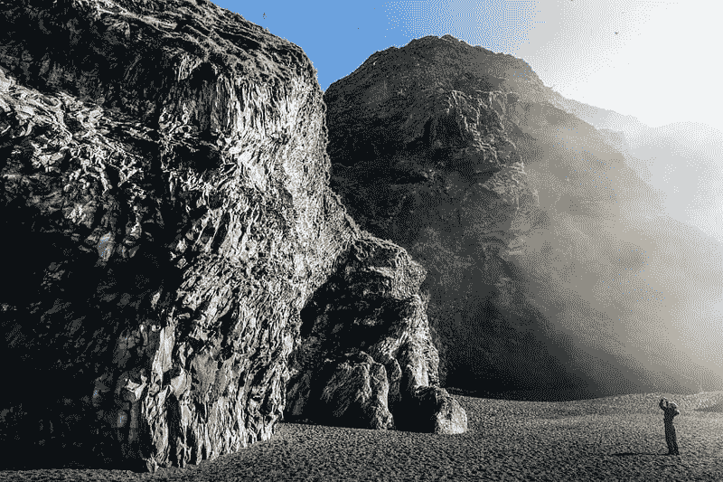
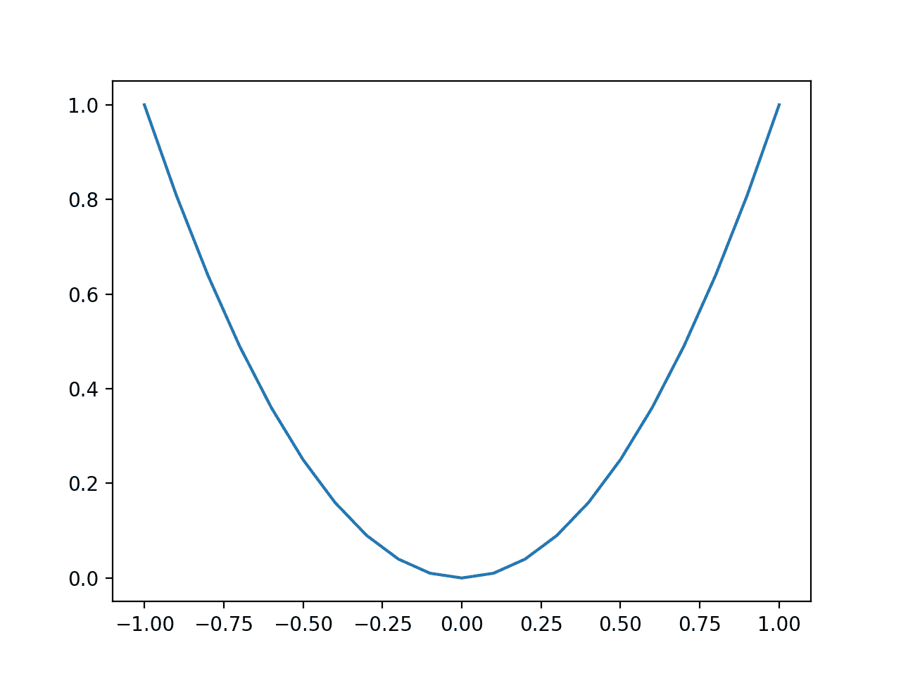

# 如何从零开始实现梯度下降优化

> 原文：<https://machinelearningmastery.com/gradient-descent-optimization-from-scratch/>

最后更新于 2021 年 10 月 12 日

**梯度下降**是一种优化算法，它遵循目标函数的负梯度，以定位函数的最小值。

这是一种简单有效的技术，只需几行代码就可以实现。它还为许多可以带来更好表现的扩展和修改提供了基础。该算法还为广泛使用的称为随机梯度下降的扩展提供了基础，用于训练深度学习神经网络。

在本教程中，您将发现如何从零开始实现梯度下降优化。

完成本教程后，您将知道:

*   梯度下降是优化可微目标函数的一般过程。
*   如何在 Python 中从头实现梯度下降算法？
*   如何将梯度下降算法应用于目标函数？

**用我的新书[机器学习优化](https://machinelearningmastery.com/optimization-for-machine-learning/)启动你的项目**，包括*分步教程*和所有示例的 *Python 源代码*文件。

Let’s get started.

如何从零开始实现梯度下降优化
图片由 [Bernd Thaller](https://www.flickr.com/photos/bernd_thaller/44802793745/) 提供，保留部分权利。

## 教程概述

本教程分为三个部分；它们是:

1.  梯度下降
2.  梯度下降算法
3.  梯度下降工作示例

## 梯度下降优化

[梯度下降](https://en.wikipedia.org/wiki/Gradient_descent)是一种优化算法。

它在技术上被称为一阶优化算法，因为它明确地利用了目标函数的一阶导数。

> 一阶方法依赖于梯度信息来帮助指导搜索最小值…

—第 69 页，[优化算法](https://amzn.to/39KZSQn)，2019。

一阶导数，或简称为“[导数”](https://en.wikipedia.org/wiki/Derivative)，是目标函数在特定点的变化率或斜率，例如对于特定输入。

如果目标函数有多个输入变量，它被称为多元函数，输入变量可以被认为是一个向量。反过来，多元目标函数的导数也可以作为向量，通常称为“[梯度](https://en.wikipedia.org/wiki/Gradient)”

*   **梯度**:多元目标函数的一阶导数。

对于输入，导数或梯度指向目标函数最陡上升的方向。

> 梯度指向切线超平面的最陡上升方向…

—第 21 页，[优化算法](https://amzn.to/39KZSQn)，2019。

具体来说，梯度的符号告诉你目标函数在那个点是增加还是减少。

*   **正梯度**:该点功能增加。
*   **负梯度**:功能在该点递减。

梯度下降是指一种最小化优化算法，它遵循目标函数梯度下降的负值来定位函数的最小值。

类似地，我们可以将梯度上升称为优化算法的最大化版本，它沿着梯度向上到达目标函数的最大值。

*   **梯度下降**:跟随梯度的负值到目标函数最小值的最小化优化。
*   **梯度上升**:跟随梯度到目标函数最大值的最大化优化。

梯度下降算法的核心是跟踪目标函数的梯度。

根据定义，优化算法仅适用于目标函数，其中导数函数可用，并且可以针对所有输入值进行计算。这并不适用于所有目标函数，仅适用于所谓的[可微函数](https://en.wikipedia.org/wiki/Differentiable_function)。

梯度下降算法的主要优点是易于实现，并且对广泛的优化问题有效。

> 梯度方法易于实现，并且通常表现良好。

—第 115 页，[优化导论](https://amzn.to/37S9WVs)，2001。

梯度下降是指使用一阶导数导航到目标函数的最优值(最小值或最大值)的一系列算法。

主要方法有许多扩展，通常以添加到算法中的特征命名，例如动量梯度下降、自适应梯度梯度下降等。

梯度下降也是用于训练深度学习神经网络的优化算法的基础，称为随机梯度下降，或 SGD。在这种变化中，目标函数是误差函数，并且函数梯度是根据来自问题域的样本上的预测误差来近似的。

现在我们已经熟悉了梯度下降优化的高级思想，让我们看看如何实现该算法。

## 梯度下降算法

在这一节中，我们将仔细研究梯度下降算法。

梯度下降算法需要一个正在优化的目标函数和该目标函数的导数函数。

目标函数 *f()* 返回给定输入集的得分，导数函数 *f'()* 给出给定输入集的目标函数的导数。

*   **目标函数**:计算一组给定输入参数的得分。
    **导数函数**:针对给定的一组输入计算目标函数的导数(梯度)。

梯度下降算法要求问题中有一个起点( *x* )，比如输入空间中随机选择的一个点。

然后计算导数，并在输入空间中采取一个步骤，该步骤预计会导致目标函数的下坡运动，假设我们正在最小化目标函数。

下坡运动是通过首先计算在输入空间中移动多远来实现的，计算方法是步长(称为*α*或学习率)乘以梯度。然后从当前点减去这一点，确保我们逆着梯度或目标函数向下移动。

*   x _ new = x–alpha * f '(x)

给定点处的目标函数越陡，梯度的幅度就越大，反过来，搜索空间中的步长就越大。

使用步长超参数来缩放所采取的步长。

*   **步长(*α*)**:超参数，控制算法每次迭代在搜索空间中逆着梯度移动多远。

如果步长太小，搜索空间中的移动将会很小，并且搜索将会花费很长时间。如果步长过大，搜索可能会绕过搜索空间并跳过 optima。

> 我们可以选择采取非常小的步骤，并在每一步重新评估梯度，或者我们可以每次采取大的步骤。第一种方法导致到达最小值的费力的方法，而第二种方法可能导致到达最小值的更曲折的路径。

—第 114 页，[优化导论](https://amzn.to/37S9WVs)，2001。

对于特定的目标函数，找到一个好的步长可能需要一些反复试验。

步长选择的困难会使寻找目标函数的精确最优值变得困难。许多扩展涉及随着时间的推移调整学习率，以在不同维度上采取更小的步骤或不同大小的步骤，等等，从而允许算法钻研函数优化。

重复计算一个点的导数和计算输入空间中新点的过程，直到满足某个停止条件。这可能是固定数量的步骤或目标函数评估，目标函数评估在一些迭代次数上缺乏改进，或者识别由零梯度表示的搜索空间的平坦(静止)区域。

*   **停止条件**:决定何时结束搜索程序。

让我们看看如何在 Python 中实现梯度下降算法。

首先，我们可以将初始点定义为由边界定义的输入空间中随机选择的点。

边界可以和目标函数一起定义为一个数组，每个维度有一个最小值和最大值。 [rand() NumPy 函数](https://numpy.org/doc/stable/reference/random/generated/numpy.random.rand.html)可用于生成 0-1 范围内的随机数向量。

```py
...
# generate an initial point
solution = bounds[:, 0] + rand(len(bounds)) * (bounds[:, 1] - bounds[:, 0])
```

然后，我们可以使用名为*导数()*的函数来计算该点的导数。

```py
...
# calculate gradient
gradient = derivative(solution)
```

并在搜索空间中迈出一步，到达当前点山下的新点。

使用计算的梯度和*步长*超参数计算新位置。

```py
...
# take a step
solution = solution - step_size * gradient
```

然后我们可以评估这一点并报告表现。

```py
...
# evaluate candidate point
solution_eval = objective(solution)
```

这个过程可以通过 *n_iter* 超参数控制重复固定次数的迭代。

```py
...
# run the gradient descent
for i in range(n_iter):
	# calculate gradient
	gradient = derivative(solution)
	# take a step
	solution = solution - step_size * gradient
	# evaluate candidate point
	solution_eval = objective(solution)
	# report progress
	print('>%d f(%s) = %.5f' % (i, solution, solution_eval))
```

我们可以将所有这些联系在一起，形成一个名为*gradient _ download()*的函数。

该函数采用目标函数和梯度函数的名称，以及目标函数的输入边界、迭代次数和步长，然后在搜索结束时返回解及其求值结果。

下面列出了作为函数实现的完整梯度下降优化算法。

```py
# gradient descent algorithm
def gradient_descent(objective, derivative, bounds, n_iter, step_size):
	# generate an initial point
	solution = bounds[:, 0] + rand(len(bounds)) * (bounds[:, 1] - bounds[:, 0])
	# run the gradient descent
	for i in range(n_iter):
		# calculate gradient
		gradient = derivative(solution)
		# take a step
		solution = solution - step_size * gradient
		# evaluate candidate point
		solution_eval = objective(solution)
		# report progress
		print('>%d f(%s) = %.5f' % (i, solution, solution_eval))
	return [solution, solution_eval]
```

现在我们已经熟悉了梯度下降算法，让我们来看一个工作的例子。

## 梯度下降工作示例

在本节中，我们将通过一个将梯度下降应用于简单测试优化函数的示例来进行工作。

首先，让我们定义一个优化函数。

我们将使用一个简单的一维函数对输入进行平方，并定义从-1.0 到 1.0 的有效输入范围。

下面的*目标()*函数实现了这个功能。

```py
# objective function
def objective(x):
	return x**2.0
```

然后，我们可以对该范围内的所有输入进行采样，并计算每个输入的目标函数值。

```py
...
# define range for input
r_min, r_max = -1.0, 1.0
# sample input range uniformly at 0.1 increments
inputs = arange(r_min, r_max+0.1, 0.1)
# compute targets
results = objective(inputs)
```

最后，我们可以创建输入(x 轴)与目标函数值(y 轴)的线图，以获得我们将搜索的目标函数形状的直觉。

```py
...
# create a line plot of input vs result
pyplot.plot(inputs, results)
# show the plot
pyplot.show()
```

下面的示例将这些联系在一起，并提供了绘制一维测试函数的示例。

```py
# plot of simple function
from numpy import arange
from matplotlib import pyplot

# objective function
def objective(x):
	return x**2.0

# define range for input
r_min, r_max = -1.0, 1.0
# sample input range uniformly at 0.1 increments
inputs = arange(r_min, r_max+0.1, 0.1)
# compute targets
results = objective(inputs)
# create a line plot of input vs result
pyplot.plot(inputs, results)
# show the plot
pyplot.show()
```

运行该示例会创建函数输入(x 轴)和函数计算输出(y 轴)的线图。

我们可以看到熟悉的 U 型叫抛物线。



简单一维函数的线图

接下来，我们可以将梯度下降算法应用于该问题。

首先，我们需要一个函数来计算这个函数的导数。

x^2 的导数是 x * 2，下面的*导数()*函数实现了这一点。

```py
# derivative of objective function
def derivative(x):
	return x * 2.0
```

然后，我们可以定义目标函数的边界、步长和算法的迭代次数。

我们将使用 0.1 和 30 次迭代的步长，这两个步长都是经过一些实验后发现的。

```py
...
# define range for input
bounds = asarray([[-1.0, 1.0]])
# define the total iterations
n_iter = 30
# define the maximum step size
step_size = 0.1
# perform the gradient descent search
best, score = gradient_descent(objective, derivative, bounds, n_iter, step_size)
```

将这些联系在一起，下面列出了将梯度下降优化应用于我们的一维测试函数的完整示例。

```py
# example of gradient descent for a one-dimensional function
from numpy import asarray
from numpy.random import rand

# objective function
def objective(x):
	return x**2.0

# derivative of objective function
def derivative(x):
	return x * 2.0

# gradient descent algorithm
def gradient_descent(objective, derivative, bounds, n_iter, step_size):
	# generate an initial point
	solution = bounds[:, 0] + rand(len(bounds)) * (bounds[:, 1] - bounds[:, 0])
	# run the gradient descent
	for i in range(n_iter):
		# calculate gradient
		gradient = derivative(solution)
		# take a step
		solution = solution - step_size * gradient
		# evaluate candidate point
		solution_eval = objective(solution)
		# report progress
		print('>%d f(%s) = %.5f' % (i, solution, solution_eval))
	return [solution, solution_eval]

# define range for input
bounds = asarray([[-1.0, 1.0]])
# define the total iterations
n_iter = 30
# define the step size
step_size = 0.1
# perform the gradient descent search
best, score = gradient_descent(objective, derivative, bounds, n_iter, step_size)
print('Done!')
print('f(%s) = %f' % (best, score))
```

运行该示例从搜索空间中的随机点开始，然后应用梯度下降算法，报告一路上的表现。

**注**:考虑到算法或评估程序的随机性，或数值准确率的差异，您的[结果可能会有所不同](https://machinelearningmastery.com/different-results-each-time-in-machine-learning/)。考虑运行该示例几次，并比较平均结果。

在这种情况下，我们可以看到算法在大约 20-30 次迭代后找到了一个好的解，函数求值约为 0.0。注意，此功能的最佳值为 f(0.0) = 0.0。

```py
>0 f([-0.36308639]) = 0.13183
>1 f([-0.29046911]) = 0.08437
>2 f([-0.23237529]) = 0.05400
>3 f([-0.18590023]) = 0.03456
>4 f([-0.14872018]) = 0.02212
>5 f([-0.11897615]) = 0.01416
>6 f([-0.09518092]) = 0.00906
>7 f([-0.07614473]) = 0.00580
>8 f([-0.06091579]) = 0.00371
>9 f([-0.04873263]) = 0.00237
>10 f([-0.0389861]) = 0.00152
>11 f([-0.03118888]) = 0.00097
>12 f([-0.02495111]) = 0.00062
>13 f([-0.01996089]) = 0.00040
>14 f([-0.01596871]) = 0.00025
>15 f([-0.01277497]) = 0.00016
>16 f([-0.01021997]) = 0.00010
>17 f([-0.00817598]) = 0.00007
>18 f([-0.00654078]) = 0.00004
>19 f([-0.00523263]) = 0.00003
>20 f([-0.0041861]) = 0.00002
>21 f([-0.00334888]) = 0.00001
>22 f([-0.0026791]) = 0.00001
>23 f([-0.00214328]) = 0.00000
>24 f([-0.00171463]) = 0.00000
>25 f([-0.0013717]) = 0.00000
>26 f([-0.00109736]) = 0.00000
>27 f([-0.00087789]) = 0.00000
>28 f([-0.00070231]) = 0.00000
>29 f([-0.00056185]) = 0.00000
Done!
f([-0.00056185]) = 0.000000
```

现在，让我们感受一下好的步长的重要性。

将步长设置为较大的值，如 1.0，然后重新运行搜索。

```py
...
# define the step size
step_size = 1.0
```

用较大的步长运行示例并检查结果。

**注**:考虑到算法或评估程序的随机性，或数值准确率的差异，您的[结果可能会有所不同](https://machinelearningmastery.com/different-results-each-time-in-machine-learning/)。考虑运行该示例几次，并比较平均结果。

我们可以看到，搜索没有找到最优解，而是在域中来回跳动，在本例中，在值 0.64820935 和-0.64820935 之间。

```py
...
>25 f([0.64820935]) = 0.42018
>26 f([-0.64820935]) = 0.42018
>27 f([0.64820935]) = 0.42018
>28 f([-0.64820935]) = 0.42018
>29 f([0.64820935]) = 0.42018
Done!
f([0.64820935]) = 0.420175
```

现在，尝试一个小得多的步长，例如 1e-8。

```py
...
# define the step size
step_size = 1e-5
```

**注**:考虑到算法或评估程序的随机性，或数值准确率的差异，您的[结果可能会有所不同](https://machinelearningmastery.com/different-results-each-time-in-machine-learning/)。考虑运行该示例几次，并比较平均结果。

重新运行搜索，我们可以看到算法从起点沿着目标函数的斜率非常缓慢地向下移动。

```py
...
>25 f([-0.87315153]) = 0.76239
>26 f([-0.87313407]) = 0.76236
>27 f([-0.8731166]) = 0.76233
>28 f([-0.87309914]) = 0.76230
>29 f([-0.87308168]) = 0.76227
Done!
f([-0.87308168]) = 0.762272
```

这两个简单的例子突出了选择过大或过小步长的问题，以及测试给定目标函数的许多不同步长值的一般重要性。

最后，我们可以将学习率改回 0.1，并在目标函数的图上可视化搜索的进度。

首先，我们可以更新*gradient _ download()*函数，将优化过程中找到的所有解及其得分存储为列表，并在搜索结束时返回，而不是找到的最佳解。

```py
# gradient descent algorithm
def gradient_descent(objective, derivative, bounds, n_iter, step_size):
	# track all solutions
	solutions, scores = list(), list()
	# generate an initial point
	solution = bounds[:, 0] + rand(len(bounds)) * (bounds[:, 1] - bounds[:, 0])
	# run the gradient descent
	for i in range(n_iter):
		# calculate gradient
		gradient = derivative(solution)
		# take a step
		solution = solution - step_size * gradient
		# evaluate candidate point
		solution_eval = objective(solution)
		# store solution
		solutions.append(solution)
		scores.append(solution_eval)
		# report progress
		print('>%d f(%s) = %.5f' % (i, solution, solution_eval))
	return [solutions, scores]
```

可以调用该函数，我们可以获得搜索过程中找到的解决方案列表及其得分。

```py
...
# perform the gradient descent search
solutions, scores = gradient_descent(objective, derivative, bounds, n_iter, step_size)
```

我们可以像以前一样创建目标函数的线图。

```py
...
# sample input range uniformly at 0.1 increments
inputs = arange(bounds[0,0], bounds[0,1]+0.1, 0.1)
# compute targets
results = objective(inputs)
# create a line plot of input vs result
pyplot.plot(inputs, results)
```

最后，我们可以将找到的每个解决方案绘制成一个红点，并用一条线连接这些点，这样我们就可以看到搜索是如何走下坡路的。

```py
...
# plot the solutions found
pyplot.plot(solutions, scores, '.-', color='red')
```

将所有这些联系在一起，下面列出了在一维测试函数上绘制梯度下降搜索结果的完整示例。

```py
# example of plotting a gradient descent search on a one-dimensional function
from numpy import asarray
from numpy import arange
from numpy.random import rand
from matplotlib import pyplot

# objective function
def objective(x):
	return x**2.0

# derivative of objective function
def derivative(x):
	return x * 2.0

# gradient descent algorithm
def gradient_descent(objective, derivative, bounds, n_iter, step_size):
	# track all solutions
	solutions, scores = list(), list()
	# generate an initial point
	solution = bounds[:, 0] + rand(len(bounds)) * (bounds[:, 1] - bounds[:, 0])
	# run the gradient descent
	for i in range(n_iter):
		# calculate gradient
		gradient = derivative(solution)
		# take a step
		solution = solution - step_size * gradient
		# evaluate candidate point
		solution_eval = objective(solution)
		# store solution
		solutions.append(solution)
		scores.append(solution_eval)
		# report progress
		print('>%d f(%s) = %.5f' % (i, solution, solution_eval))
	return [solutions, scores]

# define range for input
bounds = asarray([[-1.0, 1.0]])
# define the total iterations
n_iter = 30
# define the step size
step_size = 0.1
# perform the gradient descent search
solutions, scores = gradient_descent(objective, derivative, bounds, n_iter, step_size)
# sample input range uniformly at 0.1 increments
inputs = arange(bounds[0,0], bounds[0,1]+0.1, 0.1)
# compute targets
results = objective(inputs)
# create a line plot of input vs result
pyplot.plot(inputs, results)
# plot the solutions found
pyplot.plot(solutions, scores, '.-', color='red')
# show the plot
pyplot.show()
```

运行该示例会像以前一样对目标函数执行梯度下降搜索，但在这种情况下，搜索过程中找到的每个点都会被绘制出来。

**注**:考虑到算法或评估程序的随机性，或数值准确率的差异，您的[结果可能会有所不同](https://machinelearningmastery.com/different-results-each-time-in-machine-learning/)。考虑运行该示例几次，并比较平均结果。

在这种情况下，我们可以看到搜索大约从功能左侧的一半开始，然后向下走到盆地的底部。

我们可以看到，在目标函数中曲线较大的部分，导数(梯度)较大，反过来采取较大的步长。同样，当我们越来越接近最优值时，梯度越来越小，反过来，步长也越来越小。

这强调了步长被用作目标函数梯度(曲率)大小的比例因子。


一维目标函数的梯度下降过程图

## 进一步阅读

如果您想更深入地了解这个主题，本节将提供更多资源。

### 书

*   [优化算法](https://amzn.to/39KZSQn)，2019。
*   [优化导论](https://amzn.to/37S9WVs)，2001。

### 蜜蜂

*   num py . random . rand API。
*   num py . asar ray API。
*   [Matplotlib API](https://matplotlib.org/api/pyplot_api.html) 。

### 文章

*   [梯度下降，维基百科](https://en.wikipedia.org/wiki/Gradient_descent)。
*   [梯度，维基百科](https://en.wikipedia.org/wiki/Gradient)。
*   [衍生，维基百科](https://en.wikipedia.org/wiki/Derivative)。
*   [可微函数，维基百科](https://en.wikipedia.org/wiki/Differentiable_function)。

## 摘要

在本教程中，您发现了如何从零开始实现梯度下降优化。

具体来说，您了解到:

*   梯度下降是优化可微目标函数的一般过程。
*   如何在 Python 中从头实现梯度下降算法？
*   如何将梯度下降算法应用于目标函数？

**你有什么问题吗？**
在下面的评论中提问，我会尽力回答。