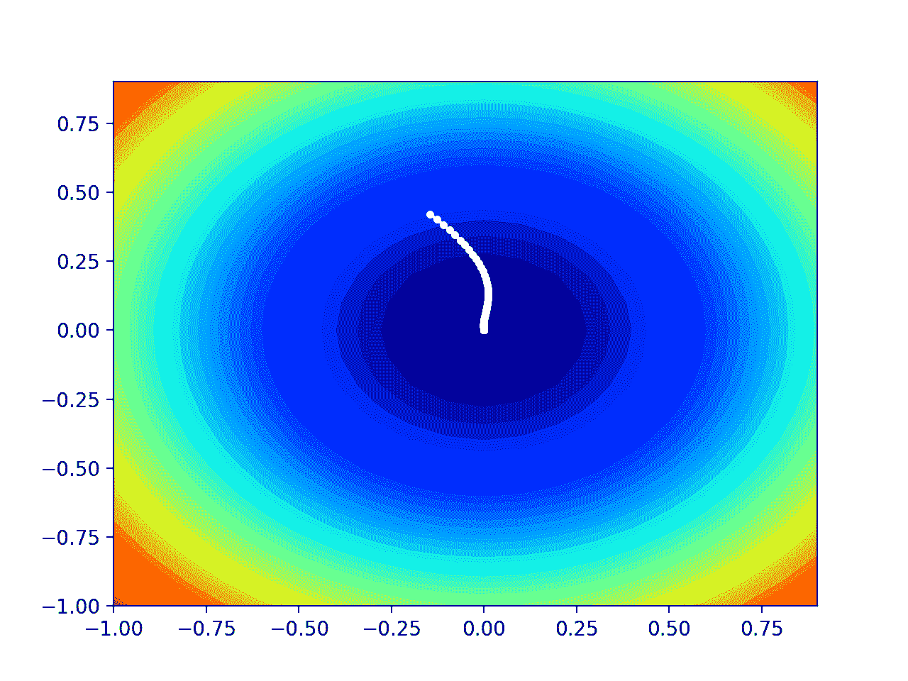

# 从零开始的 AdaMax 梯度下降优化

> 原文：<https://machinelearningmastery.com/gradient-descent-optimization-with-adamax-from-scratch/>

最后更新于 2021 年 9 月 25 日

梯度下降是一种优化算法，它遵循目标函数的负梯度来定位函数的最小值。

梯度下降的一个限制是对所有输入变量使用单一步长(学习率)。梯度下降的扩展，如自适应运动估计(Adam)算法，对每个输入变量使用单独的步长，但可能导致步长迅速减小到非常小的值。

**AdaMax** 是梯度下降的 Adam 版本的扩展，它将方法推广到无限范数(Max)，并可能导致对某些问题的更有效的优化。

在本教程中，您将发现如何使用 AdaMax 从零开始开发梯度下降优化。

完成本教程后，您将知道:

*   梯度下降是一种优化算法，它使用目标函数的梯度来导航搜索空间。
*   AdaMax 是 Adam 版本梯度下降的扩展，旨在加速优化过程。
*   如何从零开始实现 AdaMax 优化算法，并将其应用于目标函数并评估结果。

**用我的新书[机器学习优化](https://machinelearningmastery.com/optimization-for-machine-learning/)启动你的项目**，包括*分步教程*和所有示例的 *Python 源代码*文件。

Let’s get started.

梯度下降优化与 AdaMax 从零开始
图片由[唐格雷厄姆](https://www.flickr.com/photos/23155134@N06/25264818302/)，一些权利保留。

## 教程概述

本教程分为三个部分；它们是:

1.  梯度下降
2.  AdaMax 优化算法
3.  带 AdaMax 的梯度下降
    1.  二维测试问题
    2.  基于 AdaMax 的梯度下降优化
    3.  AdaMax 优化的可视化

## 梯度下降

[梯度](https://en.wikipedia.org/wiki/Gradient_descent)下降是一种优化算法。

它在技术上被称为一阶优化算法，因为它明确地利用了目标函数的一阶导数。

> 一阶方法依赖于梯度信息来帮助指导搜索最小值…

—第 69 页，[优化算法](https://amzn.to/39KZSQn)，2019。

一阶导数，或简称为“[导数”](https://en.wikipedia.org/wiki/Derivative)，是目标函数在特定点的变化率或斜率，例如对于特定输入。

如果目标函数有多个输入变量，它被称为多元函数，输入变量可以被认为是一个向量。反过来，多元目标函数的导数也可以作为向量，并且通常被称为[梯度](https://en.wikipedia.org/wiki/Gradient)。

*   **梯度**:多元目标函数的一阶导数。

对于特定输入，导数或梯度指向目标函数最陡上升的方向。

梯度下降是指一种最小化优化算法，它遵循目标函数梯度下降的负值来定位函数的最小值。

梯度下降算法需要一个正在优化的目标函数和目标函数的导数函数。目标函数 f()返回给定输入集的得分，导数函数 f '()给出给定输入集的目标函数的导数。

梯度下降算法要求问题中有一个起点(x)，例如输入空间中随机选择的一个点。

然后计算导数，并在输入空间中采取一个步骤，该步骤预计会导致目标函数的下坡运动，假设我们正在最小化目标函数。

下坡移动是通过首先计算在输入空间中移动多远来实现的，计算方法是步长(称为 alpha 或学习率)乘以梯度。然后从当前点减去这一点，确保我们逆着梯度或目标函数向下移动。

*   x(t)= x(t-1)–步长* f’(x(t))

给定点处的目标函数越陡，梯度的幅度就越大，反过来，搜索空间中的步长就越大。使用步长超参数来缩放所采取的步长。

*   **步长**:超参数，控制算法每次迭代在搜索空间中逆着梯度移动多远。

如果步长太小，搜索空间中的移动将会很小，并且搜索将会花费很长时间。如果步长过大，搜索可能会绕过搜索空间并跳过 optima。

现在我们已经熟悉了梯度下降优化算法，让我们来看看 AdaMax 算法。

## AdaMax 优化算法

AdaMax 算法是自适应运动估计优化算法的扩展。更广泛地说，是梯度下降优化算法的扩展。

Diederik Kingma 和 Jimmy 巴雷在 2014 年的论文中描述了该算法，题为“T0”Adam:一种随机优化方法

Adam 可以理解为更新与过去梯度的比例 L2 范数(平方)成反比的权重。AdaMax 将此扩展到过去梯度的所谓无限范数(Max)。

> 在 Adam 中，单个权重的更新规则是将它们的梯度缩放为与它们的单个当前和过去梯度的(缩放的)L^2 范数成反比

——[亚当:一种随机优化的方法](https://arxiv.org/abs/1412.6980)，2014。

通常，AdaMax 会为优化问题中的每个参数自动调整单独的步长(学习率)。

让我们逐步了解算法的每个元素。

首先，作为搜索的一部分，我们必须为每个被优化的参数保持一个矩向量和指数加权无穷范数，分别称为 *m* 和 *u* 。

它们在搜索开始时被初始化为 0.0。

*   m = 0
*   u = 0

该算法在时间 t 上从 t=1 开始迭代执行，并且每次迭代包括计算一组新的参数值 x，例如从 *x(t-1)* 到 *x(t)* 。

如果我们专注于更新一个参数，这可能很容易理解算法，这可以推广到通过向量运算更新所有参数。

首先，计算当前时间步长的梯度(偏导数)。

*   g(t) = f'(x(t-1))

接下来，使用梯度和超参数*β1*更新矩向量。

*   m(t)=β1 * m(t-1)+(1–β1)* g(t)

使用*β2*超参数更新指数加权无穷范数。

*   u(t)= max(β2 * u(t-1)，abs(g(t)))

其中 *max()* 选择参数的最大值， *abs()* 计算绝对值。

然后我们可以更新参数值。这可以分解成三部分；第一个计算步长参数，第二个计算梯度，第三个使用步长和梯度来计算新的参数值。

让我们从使用名为*α*的初始步长超参数和一个版本的*β1*来计算参数的步长开始，该版本随时间衰减，具有该时间步长的特定值*β1(t)*:

*   步长(t)=α/(1–β1(t))

用于更新参数的梯度计算如下:

*   δ(t)= m(t)/u(t)

最后，我们可以计算这个迭代的参数值。

*   x(t)= x(t-1)–步长(t)*δ(t)

或者完整的更新等式可以表述为:

*   x(t)= x(t-1)-(alpha/(1–beta 1(t))* m(t)/u(t)

回顾一下，该算法有三个超参数；它们是:

*   **α**:初始步长(学习率)，典型值为 0.002。
*   **β1**:第一动量衰减因子，典型值为 0.9。
*   **β2**:无穷大范数的衰减因子，典型值为 0.999。

论文中建议的β1(t)衰减时间表是使用上升到功率 t 的初始β1 值计算的，尽管也可以使用其他衰减时间表，例如保持该值不变或衰减更剧烈。

*   β1(t)= beta1^t

就这样。

关于 AdaMax 算法在 Adam 算法背景下的完整推导，我建议阅读以下论文:

*   [亚当:一种随机优化的方法](https://arxiv.org/abs/1412.6980)，2014。

接下来，让我们看看如何在 Python 中从零开始实现该算法。

## 带 AdaMax 的梯度下降

在这一节中，我们将探索如何使用 AdaMax 动量实现梯度下降优化算法。

### 二维测试问题

首先，让我们定义一个优化函数。

我们将使用一个简单的二维函数，它对每个维度的输入进行平方，并定义从-1.0 到 1.0 的有效输入范围。

下面的*目标()*函数实现了这一点。

```py
# objective function
def objective(x, y):
	return x**2.0 + y**2.0
```

我们可以创建数据集的三维图，以获得对响应表面曲率的感觉。

下面列出了绘制目标函数的完整示例。

```py
# 3d plot of the test function
from numpy import arange
from numpy import meshgrid
from matplotlib import pyplot

# objective function
def objective(x, y):
	return x**2.0 + y**2.0

# define range for input
r_min, r_max = -1.0, 1.0
# sample input range uniformly at 0.1 increments
xaxis = arange(r_min, r_max, 0.1)
yaxis = arange(r_min, r_max, 0.1)
# create a mesh from the axis
x, y = meshgrid(xaxis, yaxis)
# compute targets
results = objective(x, y)
# create a surface plot with the jet color scheme
figure = pyplot.figure()
axis = figure.gca(projection='3d')
axis.plot_surface(x, y, results, cmap='jet')
# show the plot
pyplot.show()
```

运行该示例会创建目标函数的三维表面图。

我们可以看到熟悉的碗形，全局最小值在 f(0，0) = 0。


测试目标函数的三维图

我们还可以创建函数的二维图。这将有助于我们以后绘制搜索进度。

以下示例创建了目标函数的等高线图。

```py
# contour plot of the test function
from numpy import asarray
from numpy import arange
from numpy import meshgrid
from matplotlib import pyplot

# objective function
def objective(x, y):
	return x**2.0 + y**2.0

# define range for input
bounds = asarray([[-1.0, 1.0], [-1.0, 1.0]])
# sample input range uniformly at 0.1 increments
xaxis = arange(bounds[0,0], bounds[0,1], 0.1)
yaxis = arange(bounds[1,0], bounds[1,1], 0.1)
# create a mesh from the axis
x, y = meshgrid(xaxis, yaxis)
# compute targets
results = objective(x, y)
# create a filled contour plot with 50 levels and jet color scheme
pyplot.contourf(x, y, results, levels=50, cmap='jet')
# show the plot
pyplot.show()
```

运行该示例会创建目标函数的二维等高线图。

我们可以看到碗的形状被压缩成带有颜色梯度的轮廓。我们将使用此图来绘制搜索过程中探索的具体点。


测试目标函数的二维等高线图

现在我们有了一个测试目标函数，让我们看看如何实现 AdaMax 优化算法。

### 基于 AdaMax 的梯度下降优化

我们可以将带有 AdaMax 的梯度下降应用于测试问题。

首先，我们需要一个函数来计算这个函数的导数。

x^2 的导数在每个维度上都是 x * 2。

*   f(x) = x^2
*   f'(x) = x * 2

导数()函数实现如下。

```py
# derivative of objective function
def derivative(x, y):
	return asarray([x * 2.0, y * 2.0])
```

接下来，我们可以用 AdaMax 实现梯度下降优化。

首先，我们可以在问题的边界中选择一个随机点作为搜索的起点。

这假设我们有一个定义搜索范围的数组，每个维度有一行，第一列定义维度的最小值，第二列定义维度的最大值。

```py
...
# generate an initial point
x = bounds[:, 0] + rand(len(bounds)) * (bounds[:, 1] - bounds[:, 0])
```

接下来，我们需要初始化矩向量和指数加权无穷范数。

```py
...
# initialize moment vector and weighted infinity norm
m = [0.0 for _ in range(bounds.shape[0])]
u = [0.0 for _ in range(bounds.shape[0])]
```

然后，我们运行由“ *n_iter* ”超参数定义的算法的固定迭代次数。

```py
...
# run iterations of gradient descent
for t in range(n_iter):
	...
```

第一步是计算当前参数集的导数。

```py
...
# calculate gradient g(t)
g = derivative(x[0], x[1])
```

接下来，我们需要执行 AdaMax 更新计算。为了可读性，我们将使用命令式编程风格一次一个变量地执行这些计算。

实际上，为了提高效率，我建议使用 NumPy 向量运算。

```py
...
# build a solution one variable at a time
for i in range(x.shape[0]):
	...
```

首先，我们需要计算力矩矢量。

```py
...
# m(t) = beta1 * m(t-1) + (1 - beta1) * g(t)
m[i] = beta1 * m[i] + (1.0 - beta1) * g[i]
```

接下来，我们需要计算指数加权无穷范数。

```py
...
# u(t) = max(beta2 * u(t-1), abs(g(t)))
u[i] = max(beta2 * u[i], abs(g[i]))
```

然后是更新中使用的步长。

```py
...
# step_size(t) = alpha / (1 - beta1(t))
step_size = alpha / (1.0 - beta1**(t+1))
```

以及变量的变化。

```py
...
# delta(t) = m(t) / u(t)
delta = m[i] / u[i]
```

最后，我们可以计算变量的新值。

```py
...
# x(t) = x(t-1) - step_size(t) * delta(t)
x[i] = x[i] - step_size * delta
```

然后对每个正在优化的参数重复这一过程。

迭代结束时，我们可以评估新的参数值，并报告搜索的表现。

```py
...
# evaluate candidate point
score = objective(x[0], x[1])
# report progress
print('>%d f(%s) = %.5f' % (t, x, score))
```

我们可以将所有这些联系到一个名为 *adamax()* 的函数中，该函数采用目标函数和导数函数以及算法超参数的名称，并返回在搜索及其评估结束时找到的最佳解。

```py
# gradient descent algorithm with adamax
def adamax(objective, derivative, bounds, n_iter, alpha, beta1, beta2):
	# generate an initial point
	x = bounds[:, 0] + rand(len(bounds)) * (bounds[:, 1] - bounds[:, 0])
	# initialize moment vector and weighted infinity norm
	m = [0.0 for _ in range(bounds.shape[0])]
	u = [0.0 for _ in range(bounds.shape[0])]
	# run iterations of gradient descent
	for t in range(n_iter):
		# calculate gradient g(t)
		g = derivative(x[0], x[1])
		# build a solution one variable at a time
		for i in range(x.shape[0]):
			# m(t) = beta1 * m(t-1) + (1 - beta1) * g(t)
			m[i] = beta1 * m[i] + (1.0 - beta1) * g[i]
			# u(t) = max(beta2 * u(t-1), abs(g(t)))
			u[i] = max(beta2 * u[i], abs(g[i]))
			# step_size(t) = alpha / (1 - beta1(t))
			step_size = alpha / (1.0 - beta1**(t+1))
			# delta(t) = m(t) / u(t)
			delta = m[i] / u[i]
			# x(t) = x(t-1) - step_size(t) * delta(t)
			x[i] = x[i] - step_size * delta
		# evaluate candidate point
		score = objective(x[0], x[1])
		# report progress
		print('>%d f(%s) = %.5f' % (t, x, score))
	return [x, score]
```

然后，我们可以定义函数和超参数的边界，并调用函数来执行优化。

在这种情况下，我们将运行该算法 60 次迭代，初始学习率为 0.02，beta 为 0.8，beta2 为 0.99，这是经过一点点尝试和错误后发现的。

```py
...
# seed the pseudo random number generator
seed(1)
# define range for input
bounds = asarray([[-1.0, 1.0], [-1.0, 1.0]])
# define the total iterations
n_iter = 60
# steps size
alpha = 0.02
# factor for average gradient
beta1 = 0.8
# factor for average squared gradient
beta2 = 0.99
# perform the gradient descent search with adamax
best, score = adamax(objective, derivative, bounds, n_iter, alpha, beta1, beta2)
```

运行结束时，我们将报告找到的最佳解决方案。

```py
...
# summarize the result
print('Done!')
print('f(%s) = %f' % (best, score))
```

将所有这些联系在一起，下面列出了应用于我们测试问题的完整的 AdaMax 梯度下降示例。

```py
# gradient descent optimization with adamax for a two-dimensional test function
from numpy import asarray
from numpy.random import rand
from numpy.random import seed

# objective function
def objective(x, y):
	return x**2.0 + y**2.0

# derivative of objective function
def derivative(x, y):
	return asarray([x * 2.0, y * 2.0])

# gradient descent algorithm with adamax
def adamax(objective, derivative, bounds, n_iter, alpha, beta1, beta2):
	# generate an initial point
	x = bounds[:, 0] + rand(len(bounds)) * (bounds[:, 1] - bounds[:, 0])
	# initialize moment vector and weighted infinity norm
	m = [0.0 for _ in range(bounds.shape[0])]
	u = [0.0 for _ in range(bounds.shape[0])]
	# run iterations of gradient descent
	for t in range(n_iter):
		# calculate gradient g(t)
		g = derivative(x[0], x[1])
		# build a solution one variable at a time
		for i in range(x.shape[0]):
			# m(t) = beta1 * m(t-1) + (1 - beta1) * g(t)
			m[i] = beta1 * m[i] + (1.0 - beta1) * g[i]
			# u(t) = max(beta2 * u(t-1), abs(g(t)))
			u[i] = max(beta2 * u[i], abs(g[i]))
			# step_size(t) = alpha / (1 - beta1(t))
			step_size = alpha / (1.0 - beta1**(t+1))
			# delta(t) = m(t) / u(t)
			delta = m[i] / u[i]
			# x(t) = x(t-1) - step_size(t) * delta(t)
			x[i] = x[i] - step_size * delta
		# evaluate candidate point
		score = objective(x[0], x[1])
		# report progress
		print('>%d f(%s) = %.5f' % (t, x, score))
	return [x, score]

# seed the pseudo random number generator
seed(1)
# define range for input
bounds = asarray([[-1.0, 1.0], [-1.0, 1.0]])
# define the total iterations
n_iter = 60
# steps size
alpha = 0.02
# factor for average gradient
beta1 = 0.8
# factor for average squared gradient
beta2 = 0.99
# perform the gradient descent search with adamax
best, score = adamax(objective, derivative, bounds, n_iter, alpha, beta1, beta2)
# summarize the result
print('Done!')
print('f(%s) = %f' % (best, score))
```

运行该示例将带有 AdaMax 的优化算法应用于我们的测试问题，并报告算法每次迭代的搜索表现。

**注**:考虑到算法或评估程序的随机性，或数值准确率的差异，您的[结果可能会有所不同](https://machinelearningmastery.com/different-results-each-time-in-machine-learning/)。考虑运行该示例几次，并比较平均结果。

在这种情况下，我们可以看到，在大约 35 次搜索迭代后，找到了一个接近最优的解，输入值接近 0.0 和 0.0，评估为 0.0。

```py
...
>33 f([-0.00122185 0.00427944]) = 0.00002
>34 f([-0.00045147 0.00289913]) = 0.00001
>35 f([0.00022176 0.00165754]) = 0.00000
>36 f([0.00073314 0.00058534]) = 0.00000
>37 f([ 0.00105092 -0.00030082]) = 0.00000
>38 f([ 0.00117382 -0.00099624]) = 0.00000
>39 f([ 0.00112512 -0.00150609]) = 0.00000
>40 f([ 0.00094497 -0.00184321]) = 0.00000
>41 f([ 0.00068206 -0.002026 ]) = 0.00000
>42 f([ 0.00038579 -0.00207647]) = 0.00000
>43 f([ 9.99977780e-05 -2.01849176e-03]) = 0.00000
>44 f([-0.00014145 -0.00187632]) = 0.00000
>45 f([-0.00031698 -0.00167338]) = 0.00000
>46 f([-0.00041753 -0.00143134]) = 0.00000
>47 f([-0.00044531 -0.00116942]) = 0.00000
>48 f([-0.00041125 -0.00090399]) = 0.00000
>49 f([-0.00033193 -0.00064834]) = 0.00000
Done!
f([-0.00033193 -0.00064834]) = 0.000001
```

### AdaMax 优化的可视化

我们可以在域的等高线图上绘制 AdaMax 搜索的进度。

这可以为算法迭代过程中的搜索进度提供直觉。

我们必须更新 adamax()函数，以维护搜索过程中找到的所有解决方案的列表，然后在搜索结束时返回该列表。

下面列出了带有这些更改的功能的更新版本。

```py
# gradient descent algorithm with adamax
def adamax(objective, derivative, bounds, n_iter, alpha, beta1, beta2):
	solutions = list()
	# generate an initial point
	x = bounds[:, 0] + rand(len(bounds)) * (bounds[:, 1] - bounds[:, 0])
	# initialize moment vector and weighted infinity norm
	m = [0.0 for _ in range(bounds.shape[0])]
	u = [0.0 for _ in range(bounds.shape[0])]
	# run iterations of gradient descent
	for t in range(n_iter):
		# calculate gradient g(t)
		g = derivative(x[0], x[1])
		# build a solution one variable at a time
		for i in range(x.shape[0]):
			# m(t) = beta1 * m(t-1) + (1 - beta1) * g(t)
			m[i] = beta1 * m[i] + (1.0 - beta1) * g[i]
			# u(t) = max(beta2 * u(t-1), abs(g(t)))
			u[i] = max(beta2 * u[i], abs(g[i]))
			# step_size(t) = alpha / (1 - beta1(t))
			step_size = alpha / (1.0 - beta1**(t+1))
			# delta(t) = m(t) / u(t)
			delta = m[i] / u[i]
			# x(t) = x(t-1) - step_size(t) * delta(t)
			x[i] = x[i] - step_size * delta
		# evaluate candidate point
		score = objective(x[0], x[1])
		solutions.append(x.copy())
		# report progress
		print('>%d f(%s) = %.5f' % (t, x, score))
	return solutions
```

然后，我们可以像以前一样执行搜索，这次检索解决方案列表，而不是最佳最终解决方案。

```py
...
# seed the pseudo random number generator
seed(1)
# define range for input
bounds = asarray([[-1.0, 1.0], [-1.0, 1.0]])
# define the total iterations
n_iter = 60
# steps size
alpha = 0.02
# factor for average gradient
beta1 = 0.8
# factor for average squared gradient
beta2 = 0.99
# perform the gradient descent search with adamax
solutions = adamax(objective, derivative, bounds, n_iter, alpha, beta1, beta2)
```

然后，我们可以像以前一样创建目标函数的等高线图。

```py
...
# sample input range uniformly at 0.1 increments
xaxis = arange(bounds[0,0], bounds[0,1], 0.1)
yaxis = arange(bounds[1,0], bounds[1,1], 0.1)
# create a mesh from the axis
x, y = meshgrid(xaxis, yaxis)
# compute targets
results = objective(x, y)
# create a filled contour plot with 50 levels and jet color scheme
pyplot.contourf(x, y, results, levels=50, cmap='jet')
```

最后，我们可以将搜索过程中找到的每个解决方案绘制成由一条线连接的白点。

```py
...
# plot the sample as black circles
solutions = asarray(solutions)
pyplot.plot(solutions[:, 0], solutions[:, 1], '.-', color='w')
```

将所有这些结合起来，下面列出了对测试问题执行 AdaMax 优化并将结果绘制在等高线图上的完整示例。

```py
# example of plotting the adamax search on a contour plot of the test function
from numpy import asarray
from numpy import arange
from numpy.random import rand
from numpy.random import seed
from numpy import meshgrid
from matplotlib import pyplot
from mpl_toolkits.mplot3d import Axes3D

# objective function
def objective(x, y):
	return x**2.0 + y**2.0

# derivative of objective function
def derivative(x, y):
	return asarray([x * 2.0, y * 2.0])

# gradient descent algorithm with adamax
def adamax(objective, derivative, bounds, n_iter, alpha, beta1, beta2):
	solutions = list()
	# generate an initial point
	x = bounds[:, 0] + rand(len(bounds)) * (bounds[:, 1] - bounds[:, 0])
	# initialize moment vector and weighted infinity norm
	m = [0.0 for _ in range(bounds.shape[0])]
	u = [0.0 for _ in range(bounds.shape[0])]
	# run iterations of gradient descent
	for t in range(n_iter):
		# calculate gradient g(t)
		g = derivative(x[0], x[1])
		# build a solution one variable at a time
		for i in range(x.shape[0]):
			# m(t) = beta1 * m(t-1) + (1 - beta1) * g(t)
			m[i] = beta1 * m[i] + (1.0 - beta1) * g[i]
			# u(t) = max(beta2 * u(t-1), abs(g(t)))
			u[i] = max(beta2 * u[i], abs(g[i]))
			# step_size(t) = alpha / (1 - beta1(t))
			step_size = alpha / (1.0 - beta1**(t+1))
			# delta(t) = m(t) / u(t)
			delta = m[i] / u[i]
			# x(t) = x(t-1) - step_size(t) * delta(t)
			x[i] = x[i] - step_size * delta
		# evaluate candidate point
		score = objective(x[0], x[1])
		solutions.append(x.copy())
		# report progress
		print('>%d f(%s) = %.5f' % (t, x, score))
	return solutions

# seed the pseudo random number generator
seed(1)
# define range for input
bounds = asarray([[-1.0, 1.0], [-1.0, 1.0]])
# define the total iterations
n_iter = 60
# steps size
alpha = 0.02
# factor for average gradient
beta1 = 0.8
# factor for average squared gradient
beta2 = 0.99
# perform the gradient descent search with adamax
solutions = adamax(objective, derivative, bounds, n_iter, alpha, beta1, beta2)
# sample input range uniformly at 0.1 increments
xaxis = arange(bounds[0,0], bounds[0,1], 0.1)
yaxis = arange(bounds[1,0], bounds[1,1], 0.1)
# create a mesh from the axis
x, y = meshgrid(xaxis, yaxis)
# compute targets
results = objective(x, y)
# create a filled contour plot with 50 levels and jet color scheme
pyplot.contourf(x, y, results, levels=50, cmap='jet')
# plot the sample as black circles
solutions = asarray(solutions)
pyplot.plot(solutions[:, 0], solutions[:, 1], '.-', color='w')
# show the plot
pyplot.show()
```

运行该示例会像以前一样执行搜索，只是在这种情况下，会创建目标函数的等高线图。

在这种情况下，我们可以看到，搜索过程中找到的每个解决方案都显示一个白点，从 optima 上方开始，逐渐靠近图中心的 optima。



显示 AdaMax 搜索结果的测试目标函数等高线图

## 进一步阅读

如果您想更深入地了解这个主题，本节将提供更多资源。

### 报纸

*   [亚当:一种随机优化的方法](https://arxiv.org/abs/1412.6980)，2014。
*   [梯度下降优化算法概述](https://arxiv.org/abs/1609.04747)，2016。

### 书

*   [优化算法](https://amzn.to/39KZSQn)，2019。
*   [深度学习](https://amzn.to/3qSk3C2)，2016 年。

### 蜜蜂

*   num py . random . rand API。
*   num py . asar ray API。
*   [Matplotlib API](https://matplotlib.org/api/pyplot_api.html) 。

### 文章

*   [梯度下降，维基百科](https://en.wikipedia.org/wiki/Gradient_descent)。
*   [随机梯度下降，维基百科](https://en.wikipedia.org/wiki/Stochastic_gradient_descent)。
*   [梯度下降优化算法概述](https://ruder.io/optimizing-gradient-descent/index.html)，2016。

## 摘要

在本教程中，您发现了如何使用 AdaMax 从零开始开发梯度下降优化。

具体来说，您了解到:

*   梯度下降是一种优化算法，它使用目标函数的梯度来导航搜索空间。
*   AdaMax 是 Adam 版本梯度下降的扩展，旨在加速优化过程。
*   如何从零开始实现 AdaMax 优化算法，并将其应用于目标函数并评估结果。

**你有什么问题吗？**
在下面的评论中提问，我会尽力回答。