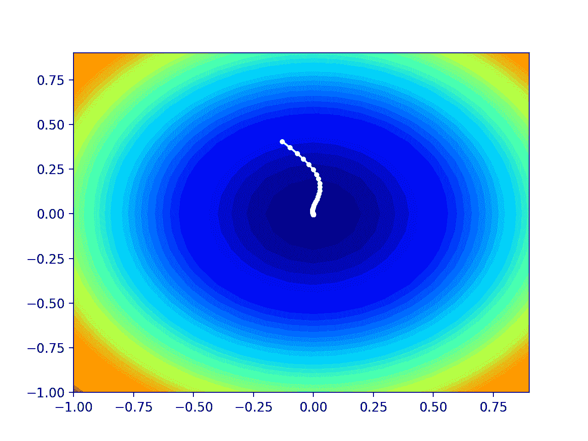

# 从零开始的 Nadam 梯度下降优化

> 原文：<https://machinelearningmastery.com/gradient-descent-optimization-with-nadam-from-scratch/>

最后更新于 2021 年 10 月 12 日

梯度下降是一种优化算法，它遵循目标函数的负梯度来定位函数的最小值。

梯度下降的一个限制是，如果梯度变得平坦或曲率变大，搜索的进度会变慢。动量可以被添加到梯度下降，这结合了一些惯性更新。这可以通过结合预测的新位置而不是当前位置的梯度来进一步改善，称为 Nesterov 加速梯度(NAG)或 Nesterov 动量。

梯度下降的另一个限制是对所有输入变量使用单一步长(学习率)。对梯度下降的扩展，如[自适应运动估计(Adam)](https://machinelearningmastery.com/adam-optimization-from-scratch/) 算法，该算法对每个输入变量使用单独的步长，但可能导致步长迅速减小到非常小的值。

**Nesterov 加速自适应矩估计**，或**纳达姆**，是亚当算法的扩展，结合了 Nesterov 动量，可以使优化算法表现更好。

在本教程中，您将发现如何用 Nadam 从零开始开发梯度下降优化。

完成本教程后，您将知道:

*   梯度下降是一种优化算法，它使用目标函数的梯度来导航搜索空间。
*   纳达姆是亚当版梯度下降的延伸，结合了 Nesterov 动量。
*   如何从头实现那达慕优化算法并将其应用于一个目标函数并评估结果。

**用我的新书[机器学习优化](https://machinelearningmastery.com/optimization-for-machine-learning/)启动你的项目**，包括*分步教程*和所有示例的 *Python 源代码*文件。

Let’s get started.

从零开始用纳达姆进行梯度下降优化
图片由 [BLM 内华达](https://www.flickr.com/photos/blmnevada/28563373823/)提供，保留部分权利。

## 教程概述

本教程分为三个部分；它们是:

1.  梯度下降
2.  纳达姆优化算法
3.  纳达姆梯度下降
    1.  二维测试问题
    2.  纳达姆梯度下降优化
    3.  那达慕优化的可视化

## 梯度下降

[梯度下降](https://en.wikipedia.org/wiki/Gradient_descent)是一种优化算法。

它在技术上被称为一阶优化算法，因为它明确地利用了目标函数的一阶导数。

> 一阶方法依赖于梯度信息来帮助指导搜索最小值…

—第 69 页，[优化算法](https://amzn.to/39KZSQn)，2019。

一阶导数，或简称为“[导数”](https://en.wikipedia.org/wiki/Derivative)，是目标函数在特定点的变化率或斜率，例如对于特定输入。

如果目标函数有多个输入变量，它被称为多元函数，输入变量可以被认为是一个向量。反过来，多元目标函数的导数也可以作为向量，并且通常被称为[梯度](https://en.wikipedia.org/wiki/Gradient)。

*   **梯度**:多元目标函数的一阶导数。

对于特定输入，导数或梯度指向目标函数最陡上升的方向。

梯度下降是指一种最小化优化算法，它遵循目标函数梯度下降的负值来定位函数的最小值。

梯度下降算法需要一个正在优化的目标函数和目标函数的导数函数。目标函数 *f()* 返回给定输入集的得分，导数函数 *f'()* 给出给定输入集的目标函数的导数。

梯度下降算法要求问题中有一个起点( *x* )，比如输入空间中随机选择的一个点。

然后计算导数，并在输入空间中采取一个步骤，该步骤预计会导致目标函数的下坡运动，假设我们正在最小化目标函数。

下坡移动是通过首先计算在输入空间中移动多远来实现的，计算方法是步长(称为 alpha 或学习率)乘以梯度。然后从当前点减去这一点，确保我们逆着梯度或目标函数向下移动。

*   x(t)= x(t-1)–步长* f'(x(t))

给定点处的目标函数越陡，梯度的幅度就越大，反过来，搜索空间中的步长就越大。使用步长超参数来缩放所采取的步长。

*   **步长**:超参数，控制算法每次迭代在搜索空间中逆着梯度移动多远。

如果步长太小，搜索空间中的移动将会很小，并且搜索将会花费很长时间。如果步长过大，搜索可能会绕过搜索空间并跳过 optima。

现在我们已经熟悉了梯度下降优化算法，让我们来看看那达慕算法。

## 纳达姆优化算法

Nesterov 加速自适应矩估计，或称**纳达姆**算法，是自适应运动估计(adam)优化算法的扩展，增加了 Nesterov 加速梯度(NAG)或 Nesterov 动量，这是一种改进的动量类型。

更广泛地说，纳达姆算法是梯度下降优化算法的扩展。

该算法在 2016 年的论文中由[蒂莫西·多扎特](https://www.linkedin.com/in/timothy-dozat-982770198/)描述，标题为“[将 Nesterov 动量并入亚当](https://openreview.net/forum?id=OM0jvwB8jIp57ZJjtNEZ)”尽管该论文的一个版本在 2015 年被写成了同名的[斯坦福项目报告](http://cs229.stanford.edu/proj2015/054_report.pdf)。

动量将梯度的指数衰减移动平均值(第一矩)添加到梯度下降算法中。这具有平滑噪声目标函数和改善收敛性的影响。

[Adam](https://machinelearningmastery.com/adam-optimization-from-scratch/) 是梯度下降的扩展，它增加了梯度的第一和第二个时刻，并自动为每个正在优化的参数调整学习率。NAG 是动量的扩展，其中使用参数的预计更新的梯度而不是实际的当前变量值来执行更新。在某些情况下，当找到 optima 时，这具有减慢搜索的效果，而不是过冲。

纳达姆是亚当的延伸，用 NAG 动量代替经典动量。

> 我们展示了如何修改亚当的动量分量，以利用来自 NAG 的见解，然后我们提出了初步证据，表明进行这种替代可以提高收敛速度和学习模型的质量。

——[将 Nesterov 动量融入亚当](https://openreview.net/forum?id=OM0jvwB8jIp57ZJjtNEZ)，2016。

让我们逐步了解算法的每个元素。

纳达姆使用衰减步长(*α*)和第一时刻(*μ*)超参数来提高表现。为了简单起见，我们将暂时忽略这一方面，并假设常量值。

首先，作为搜索的一部分，我们必须为每个被优化的参数保持梯度的第一和第二矩，分别称为 *m* 和 *n* 。它们在搜索开始时被初始化为 0.0。

*   m = 0
*   n = 0

该算法在时间 t 上迭代执行，从 *t=1* 开始，并且每次迭代包括计算一组新的参数值 *x* ，例如从 *x(t-1)* 到 *x(t)* 。

如果我们专注于更新一个参数，这可能很容易理解算法，这可以推广到通过向量运算更新所有参数。

首先，计算当前时间步长的梯度(偏导数)。

*   g(t) = f'(x(t-1))

接下来，使用梯度和超参数“*μ*”更新第一时刻。

*   m(t)=μ* m(t-1)+(1–μ)* g(t)

然后使用“ *nu* ”超参数更新第二个时刻。

*   n(t)= nu * n(t-1)+(1–nu)* g(t)^2

接下来，使用 Nesterov 动量对第一个时刻进行偏差校正。

*   mhat =(μ* m(t)/(1–μ))+((1–μ)* g(t)/(1–μ))

然后对第二个力矩进行偏差校正。

注意:偏差校正是 Adam 的一个方面，并反驳了第一和第二时刻在搜索开始时被初始化为零的事实。

*   nhat = 否 * n（t） / （1 – 否）

最后，我们可以计算这个迭代的参数值。

*   x(t)= x(t-1)-alpha/(sqrt(nhat)+EPS)* mhat

其中，α是步长(学习率)超参数， *sqrt()* 是平方根函数，*EPS*(*ε*)是类似 1e-8 的小值，添加该值是为了避免被零除的误差。

回顾一下，该算法有三个超参数；它们是:

*   **α**:初始步长(学习率)，典型值为 0.002。
*   **μ**:第一瞬间衰减因子(*β1【亚当中的 T3】，典型值为 0.975。*
*   **nu** :第二瞬间的衰减因子(*β2【亚当中的 T3】，典型值为 0.999。*

就这样。

接下来，让我们看看如何在 Python 中从零开始实现该算法。

## 纳达姆梯度下降

在这一节中，我们将探索如何用纳达姆动量实现梯度下降优化算法。

### 二维测试问题

首先，让我们定义一个优化函数。

我们将使用一个简单的二维函数，它对每个维度的输入进行平方，并定义从-1.0 到 1.0 的有效输入范围。

下面的*目标()*函数实现该功能

```py
# objective function
def objective(x, y):
	return x**2.0 + y**2.0
```

我们可以创建数据集的三维图，以获得对响应表面曲率的感觉。

下面列出了绘制目标函数的完整示例。

```py
# 3d plot of the test function
from numpy import arange
from numpy import meshgrid
from matplotlib import pyplot

# objective function
def objective(x, y):
	return x**2.0 + y**2.0

# define range for input
r_min, r_max = -1.0, 1.0
# sample input range uniformly at 0.1 increments
xaxis = arange(r_min, r_max, 0.1)
yaxis = arange(r_min, r_max, 0.1)
# create a mesh from the axis
x, y = meshgrid(xaxis, yaxis)
# compute targets
results = objective(x, y)
# create a surface plot with the jet color scheme
figure = pyplot.figure()
axis = figure.gca(projection='3d')
axis.plot_surface(x, y, results, cmap='jet')
# show the plot
pyplot.show()
```

运行该示例会创建目标函数的三维表面图。

我们可以看到熟悉的碗形，全局最小值在 f(0，0) = 0。


测试目标函数的三维图

我们还可以创建函数的二维图。这将有助于我们以后绘制搜索进度。

以下示例创建了目标函数的等高线图。

```py
# contour plot of the test function
from numpy import asarray
from numpy import arange
from numpy import meshgrid
from matplotlib import pyplot

# objective function
def objective(x, y):
	return x**2.0 + y**2.0

# define range for input
bounds = asarray([[-1.0, 1.0], [-1.0, 1.0]])
# sample input range uniformly at 0.1 increments
xaxis = arange(bounds[0,0], bounds[0,1], 0.1)
yaxis = arange(bounds[1,0], bounds[1,1], 0.1)
# create a mesh from the axis
x, y = meshgrid(xaxis, yaxis)
# compute targets
results = objective(x, y)
# create a filled contour plot with 50 levels and jet color scheme
pyplot.contourf(x, y, results, levels=50, cmap='jet')
# show the plot
pyplot.show()
```

运行该示例会创建目标函数的二维等高线图。

我们可以看到碗的形状被压缩成带有颜色梯度的轮廓。我们将使用此图来绘制搜索过程中探索的具体点。


测试目标函数的二维等高线图

现在我们有了一个测试目标函数，让我们看看如何实现那达慕优化算法。

### 纳达姆梯度下降优化

我们可以将纳达姆的梯度下降应用到测试问题中。

首先，我们需要一个函数来计算这个函数的导数。

*x^2* 的导数在每个维度上为 *x * 2* 。

*   f(x) = x^2
*   f'(x) = x * 2

导数()函数实现如下。

```py
# derivative of objective function
def derivative(x, y):
	return asarray([x * 2.0, y * 2.0])
```

接下来，我们可以用 Nadam 实现梯度下降优化。

首先，我们可以在问题的边界中选择一个随机点作为搜索的起点。

这假设我们有一个定义搜索范围的数组，每个维度有一行，第一列定义维度的最小值，第二列定义维度的最大值。

```py
...
# generate an initial point
x = bounds[:, 0] + rand(len(bounds)) * (bounds[:, 1] - bounds[:, 0])
score = objective(x[0], x[1])
```

接下来，我们需要初始化力矩矢量。

```py
...
# initialize decaying moving averages
m = [0.0 for _ in range(bounds.shape[0])]
n = [0.0 for _ in range(bounds.shape[0])]
```

然后，我们运行由“ *n_iter* ”超参数定义的算法的固定迭代次数。

```py
...
# run iterations of gradient descent
for t in range(n_iter):
	...
```

第一步是计算当前参数集的导数。

```py
...
# calculate gradient g(t)
g = derivative(x[0], x[1])
```

接下来，我们需要执行那达慕更新计算。为了可读性，我们将使用命令式编程风格一次一个变量地执行这些计算。

实际上，为了提高效率，我建议使用 NumPy 向量运算。

```py
...
# build a solution one variable at a time
for i in range(x.shape[0]):
	...
```

首先，我们需要计算力矩矢量。

```py
...
# m(t) = mu * m(t-1) + (1 - mu) * g(t)
m[i] = mu * m[i] + (1.0 - mu) * g[i]
```

然后是第二个力矩矢量。

```py
...
# n(t) = nu * n(t-1) + (1 - nu) * g(t)^2
n[i] = nu * n[i] + (1.0 - nu) * g[i]**2
```

然后是偏差修正的 Nesterov 动量。

```py
...
# mhat = (mu * m(t) / (1 - mu)) + ((1 - mu) * g(t) / (1 - mu))
mhat = (mu * m[i] / (1.0 - mu)) + ((1 - mu) * g[i] / (1.0 - mu))
```

偏差校正的第二个瞬间。

```py
...
# nhat = nu * n(t) / (1 - nu)
nhat = nu * n[i] / (1.0 - nu)
```

最后更新参数。

```py
...
# x(t) = x(t-1) - alpha / (sqrt(nhat) + eps) * mhat
x[i] = x[i] - alpha / (sqrt(nhat) + eps) * mhat
```

然后对每个正在优化的参数重复这一过程。

迭代结束时，我们可以评估新的参数值，并报告搜索的表现。

```py
...
# evaluate candidate point
score = objective(x[0], x[1])
# report progress
print('>%d f(%s) = %.5f' % (t, x, score))
```

我们可以将所有这些联系到一个名为 nadam()的函数中，该函数采用目标函数和导数函数的名称，以及算法超参数，并返回在搜索和评估结束时找到的最佳解。

```py
# gradient descent algorithm with nadam
def nadam(objective, derivative, bounds, n_iter, alpha, mu, nu, eps=1e-8):
	# generate an initial point
	x = bounds[:, 0] + rand(len(bounds)) * (bounds[:, 1] - bounds[:, 0])
	score = objective(x[0], x[1])
	# initialize decaying moving averages
	m = [0.0 for _ in range(bounds.shape[0])]
	n = [0.0 for _ in range(bounds.shape[0])]
	# run the gradient descent
	for t in range(n_iter):
		# calculate gradient g(t)
		g = derivative(x[0], x[1])
		# build a solution one variable at a time
		for i in range(bounds.shape[0]):
			# m(t) = mu * m(t-1) + (1 - mu) * g(t)
			m[i] = mu * m[i] + (1.0 - mu) * g[i]
			# n(t) = nu * n(t-1) + (1 - nu) * g(t)^2
			n[i] = nu * n[i] + (1.0 - nu) * g[i]**2
			# mhat = (mu * m(t) / (1 - mu)) + ((1 - mu) * g(t) / (1 - mu))
			mhat = (mu * m[i] / (1.0 - mu)) + ((1 - mu) * g[i] / (1.0 - mu))
			# nhat = nu * n(t) / (1 - nu)
			nhat = nu * n[i] / (1.0 - nu)
			# x(t) = x(t-1) - alpha / (sqrt(nhat) + eps) * mhat
			x[i] = x[i] - alpha / (sqrt(nhat) + eps) * mhat
		# evaluate candidate point
		score = objective(x[0], x[1])
		# report progress
		print('>%d f(%s) = %.5f' % (t, x, score))
	return [x, score]
```

然后，我们可以定义函数和超参数的边界，并调用函数来执行优化。

在这种情况下，我们将运行该算法 50 次迭代，初始α为 0.02，μ为 0.8，nu 为 0.999，这是经过一点反复试验后发现的。

```py
...
# seed the pseudo random number generator
seed(1)
# define range for input
bounds = asarray([[-1.0, 1.0], [-1.0, 1.0]])
# define the total iterations
n_iter = 50
# steps size
alpha = 0.02
# factor for average gradient
mu = 0.8
# factor for average squared gradient
nu = 0.999
# perform the gradient descent search with nadam
best, score = nadam(objective, derivative, bounds, n_iter, alpha, mu, nu)
```

运行结束时，我们将报告找到的最佳解决方案。

```py
...
# summarize the result
print('Done!')
print('f(%s) = %f' % (best, score))
```

将所有这些联系在一起，下面列出了应用于我们的测试问题的纳达姆梯度下降的完整示例。

```py
# gradient descent optimization with nadam for a two-dimensional test function
from math import sqrt
from numpy import asarray
from numpy.random import rand
from numpy.random import seed

# objective function
def objective(x, y):
	return x**2.0 + y**2.0

# derivative of objective function
def derivative(x, y):
	return asarray([x * 2.0, y * 2.0])

# gradient descent algorithm with nadam
def nadam(objective, derivative, bounds, n_iter, alpha, mu, nu, eps=1e-8):
	# generate an initial point
	x = bounds[:, 0] + rand(len(bounds)) * (bounds[:, 1] - bounds[:, 0])
	score = objective(x[0], x[1])
	# initialize decaying moving averages
	m = [0.0 for _ in range(bounds.shape[0])]
	n = [0.0 for _ in range(bounds.shape[0])]
	# run the gradient descent
	for t in range(n_iter):
		# calculate gradient g(t)
		g = derivative(x[0], x[1])
		# build a solution one variable at a time
		for i in range(bounds.shape[0]):
			# m(t) = mu * m(t-1) + (1 - mu) * g(t)
			m[i] = mu * m[i] + (1.0 - mu) * g[i]
			# n(t) = nu * n(t-1) + (1 - nu) * g(t)^2
			n[i] = nu * n[i] + (1.0 - nu) * g[i]**2
			# mhat = (mu * m(t) / (1 - mu)) + ((1 - mu) * g(t) / (1 - mu))
			mhat = (mu * m[i] / (1.0 - mu)) + ((1 - mu) * g[i] / (1.0 - mu))
			# nhat = nu * n(t) / (1 - nu)
			nhat = nu * n[i] / (1.0 - nu)
			# x(t) = x(t-1) - alpha / (sqrt(nhat) + eps) * mhat
			x[i] = x[i] - alpha / (sqrt(nhat) + eps) * mhat
		# evaluate candidate point
		score = objective(x[0], x[1])
		# report progress
		print('>%d f(%s) = %.5f' % (t, x, score))
	return [x, score]

# seed the pseudo random number generator
seed(1)
# define range for input
bounds = asarray([[-1.0, 1.0], [-1.0, 1.0]])
# define the total iterations
n_iter = 50
# steps size
alpha = 0.02
# factor for average gradient
mu = 0.8
# factor for average squared gradient
nu = 0.999
# perform the gradient descent search with nadam
best, score = nadam(objective, derivative, bounds, n_iter, alpha, mu, nu)
print('Done!')
print('f(%s) = %f' % (best, score))
```

运行该示例将带有 Nadam 的优化算法应用于我们的测试问题，并报告算法每次迭代的搜索表现。

**注**:考虑到算法或评估程序的随机性，或数值准确率的差异，您的[结果可能会有所不同](https://machinelearningmastery.com/different-results-each-time-in-machine-learning/)。考虑运行该示例几次，并比较平均结果。

在这种情况下，我们可以看到，在大约 44 次搜索迭代后，找到了一个接近最优的解，输入值接近 0.0 和 0.0，评估为 0.0。

```py
...
>40 f([ 5.07445337e-05 -3.32910019e-03]) = 0.00001
>41 f([-1.84325171e-05 -3.00939427e-03]) = 0.00001
>42 f([-6.78814472e-05 -2.69839367e-03]) = 0.00001
>43 f([-9.88339249e-05 -2.40042096e-03]) = 0.00001
>44 f([-0.00011368 -0.00211861]) = 0.00000
>45 f([-0.00011547 -0.00185511]) = 0.00000
>46 f([-0.0001075 -0.00161122]) = 0.00000
>47 f([-9.29922627e-05 -1.38760991e-03]) = 0.00000
>48 f([-7.48258406e-05 -1.18436586e-03]) = 0.00000
>49 f([-5.54299505e-05 -1.00116899e-03]) = 0.00000
Done!
f([-5.54299505e-05 -1.00116899e-03]) = 0.000001
```

### 那达慕优化的可视化

我们可以在该领域的等高线图上绘制纳达姆搜索的进度。

这可以为算法迭代过程中的搜索进度提供直觉。

我们必须更新 nadam()函数来维护搜索过程中找到的所有解决方案的列表，然后在搜索结束时返回该列表。

下面列出了带有这些更改的功能的更新版本。

```py
# gradient descent algorithm with nadam
def nadam(objective, derivative, bounds, n_iter, alpha, mu, nu, eps=1e-8):
	solutions = list()
	# generate an initial point
	x = bounds[:, 0] + rand(len(bounds)) * (bounds[:, 1] - bounds[:, 0])
	score = objective(x[0], x[1])
	# initialize decaying moving averages
	m = [0.0 for _ in range(bounds.shape[0])]
	n = [0.0 for _ in range(bounds.shape[0])]
	# run the gradient descent
	for t in range(n_iter):
		# calculate gradient g(t)
		g = derivative(x[0], x[1])
		# build a solution one variable at a time
		for i in range(bounds.shape[0]):
			# m(t) = mu * m(t-1) + (1 - mu) * g(t)
			m[i] = mu * m[i] + (1.0 - mu) * g[i]
			# n(t) = nu * n(t-1) + (1 - nu) * g(t)^2
			n[i] = nu * n[i] + (1.0 - nu) * g[i]**2
			# mhat = (mu * m(t) / (1 - mu)) + ((1 - mu) * g(t) / (1 - mu))
			mhat = (mu * m[i] / (1.0 - mu)) + ((1 - mu) * g[i] / (1.0 - mu))
			# nhat = nu * n(t) / (1 - nu)
			nhat = nu * n[i] / (1.0 - nu)
			# x(t) = x(t-1) - alpha / (sqrt(nhat) + eps) * mhat
			x[i] = x[i] - alpha / (sqrt(nhat) + eps) * mhat
		# evaluate candidate point
		score = objective(x[0], x[1])
		# store solution
		solutions.append(x.copy())
		# report progress
		print('>%d f(%s) = %.5f' % (t, x, score))
	return solutions
```

然后，我们可以像以前一样执行搜索，这次检索解决方案列表，而不是最佳最终解决方案。

```py
...
# seed the pseudo random number generator
seed(1)
# define range for input
bounds = asarray([[-1.0, 1.0], [-1.0, 1.0]])
# define the total iterations
n_iter = 50
# steps size
alpha = 0.02
# factor for average gradient
mu = 0.8
# factor for average squared gradient
nu = 0.999
# perform the gradient descent search with nadam
solutions = nadam(objective, derivative, bounds, n_iter, alpha, mu, nu)
```

然后，我们可以像以前一样创建目标函数的等高线图。

```py
...
# sample input range uniformly at 0.1 increments
xaxis = arange(bounds[0,0], bounds[0,1], 0.1)
yaxis = arange(bounds[1,0], bounds[1,1], 0.1)
# create a mesh from the axis
x, y = meshgrid(xaxis, yaxis)
# compute targets
results = objective(x, y)
# create a filled contour plot with 50 levels and jet color scheme
pyplot.contourf(x, y, results, levels=50, cmap='jet')
```

最后，我们可以将搜索过程中找到的每个解决方案绘制成由一条线连接的白点。

```py
...
# plot the sample as black circles
solutions = asarray(solutions)
pyplot.plot(solutions[:, 0], solutions[:, 1], '.-', color='w')
```

将所有这些联系在一起，下面列出了在测试问题上执行那达慕优化并在等高线图上绘制结果的完整示例。

```py
# example of plotting the nadam search on a contour plot of the test function
from math import sqrt
from numpy import asarray
from numpy import arange
from numpy import product
from numpy.random import rand
from numpy.random import seed
from numpy import meshgrid
from matplotlib import pyplot
from mpl_toolkits.mplot3d import Axes3D

# objective function
def objective(x, y):
	return x**2.0 + y**2.0

# derivative of objective function
def derivative(x, y):
	return asarray([x * 2.0, y * 2.0])

# gradient descent algorithm with nadam
def nadam(objective, derivative, bounds, n_iter, alpha, mu, nu, eps=1e-8):
	solutions = list()
	# generate an initial point
	x = bounds[:, 0] + rand(len(bounds)) * (bounds[:, 1] - bounds[:, 0])
	score = objective(x[0], x[1])
	# initialize decaying moving averages
	m = [0.0 for _ in range(bounds.shape[0])]
	n = [0.0 for _ in range(bounds.shape[0])]
	# run the gradient descent
	for t in range(n_iter):
		# calculate gradient g(t)
		g = derivative(x[0], x[1])
		# build a solution one variable at a time
		for i in range(bounds.shape[0]):
			# m(t) = mu * m(t-1) + (1 - mu) * g(t)
			m[i] = mu * m[i] + (1.0 - mu) * g[i]
			# n(t) = nu * n(t-1) + (1 - nu) * g(t)^2
			n[i] = nu * n[i] + (1.0 - nu) * g[i]**2
			# mhat = (mu * m(t) / (1 - mu)) + ((1 - mu) * g(t) / (1 - mu))
			mhat = (mu * m[i] / (1.0 - mu)) + ((1 - mu) * g[i] / (1.0 - mu))
			# nhat = nu * n(t) / (1 - nu)
			nhat = nu * n[i] / (1.0 - nu)
			# x(t) = x(t-1) - alpha / (sqrt(nhat) + eps) * mhat
			x[i] = x[i] - alpha / (sqrt(nhat) + eps) * mhat
		# evaluate candidate point
		score = objective(x[0], x[1])
		# store solution
		solutions.append(x.copy())
		# report progress
		print('>%d f(%s) = %.5f' % (t, x, score))
	return solutions

# seed the pseudo random number generator
seed(1)
# define range for input
bounds = asarray([[-1.0, 1.0], [-1.0, 1.0]])
# define the total iterations
n_iter = 50
# steps size
alpha = 0.02
# factor for average gradient
mu = 0.8
# factor for average squared gradient
nu = 0.999
# perform the gradient descent search with nadam
solutions = nadam(objective, derivative, bounds, n_iter, alpha, mu, nu)
# sample input range uniformly at 0.1 increments
xaxis = arange(bounds[0,0], bounds[0,1], 0.1)
yaxis = arange(bounds[1,0], bounds[1,1], 0.1)
# create a mesh from the axis
x, y = meshgrid(xaxis, yaxis)
# compute targets
results = objective(x, y)
# create a filled contour plot with 50 levels and jet color scheme
pyplot.contourf(x, y, results, levels=50, cmap='jet')
# plot the sample as black circles
solutions = asarray(solutions)
pyplot.plot(solutions[:, 0], solutions[:, 1], '.-', color='w')
# show the plot
pyplot.show()
```

运行该示例会像以前一样执行搜索，只是在这种情况下，会创建目标函数的等高线图。

在这种情况下，我们可以看到，搜索过程中找到的每个解决方案都显示一个白点，从 optima 上方开始，逐渐靠近图中心的 optima。



显示那达慕搜索结果的测试目标函数等高线图

## 进一步阅读

如果您想更深入地了解这个主题，本节将提供更多资源。

### 报纸

*   [将 Nesterov 动量融入亚当](https://openreview.net/forum?id=OM0jvwB8jIp57ZJjtNEZ)，2016。
*   [将 Nesterov 动量融入亚当，斯坦福报告](http://cs229.stanford.edu/proj2015/054_report.pdf)，2015。
*   [求解收敛速度为 O (1/k^2)](http://mpawankumar.info/teaching/cdt-big-data/nesterov83.pdf) 的凸规划问题的一种方法，1983。
*   [亚当:一种随机优化的方法](https://arxiv.org/abs/1412.6980)，2014。
*   [梯度下降优化算法概述](https://arxiv.org/abs/1609.04747)，2016。

### 书

*   [优化算法](https://amzn.to/39KZSQn)，2019。
*   [深度学习](https://amzn.to/3qSk3C2)，2016 年。

### 蜜蜂

*   num py . random . rand API。
*   num py . asar ray API。
*   [Matplotlib API](https://matplotlib.org/api/pyplot_api.html) 。

### 文章

*   [梯度下降，维基百科](https://en.wikipedia.org/wiki/Gradient_descent)。
*   [随机梯度下降，维基百科](https://en.wikipedia.org/wiki/Stochastic_gradient_descent)。
*   [优化，Timothy Dozat，GitHub](https://github.com/tdozat/Optimization) 。

## 摘要

在本教程中，您发现了如何从零开始使用 Nadam 开发梯度下降优化。

具体来说，您了解到:

*   梯度下降是一种优化算法，它使用目标函数的梯度来导航搜索空间。
*   纳达姆是亚当版梯度下降的延伸，结合了 Nesterov 动量。
*   如何从头实现那达慕优化算法并将其应用于一个目标函数并评估结果。

**你有什么问题吗？**
在下面的评论中提问，我会尽力回答。