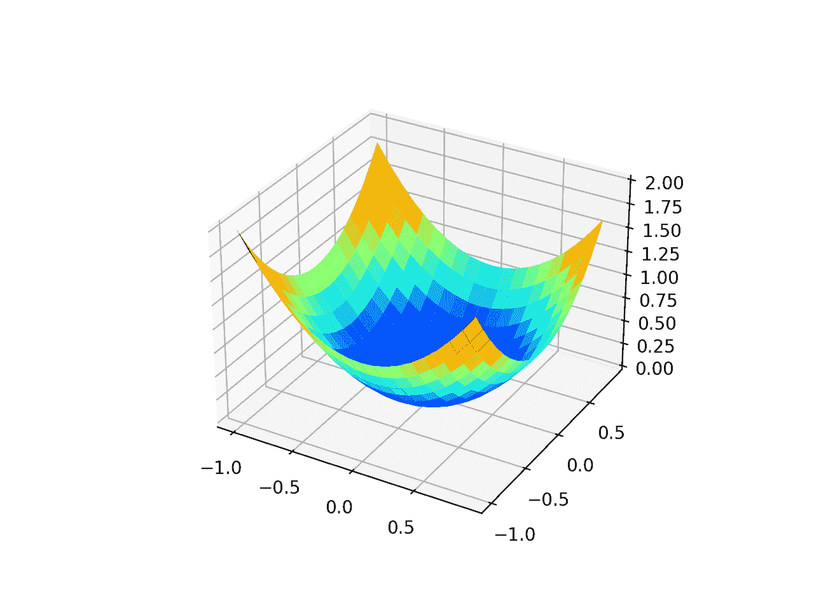
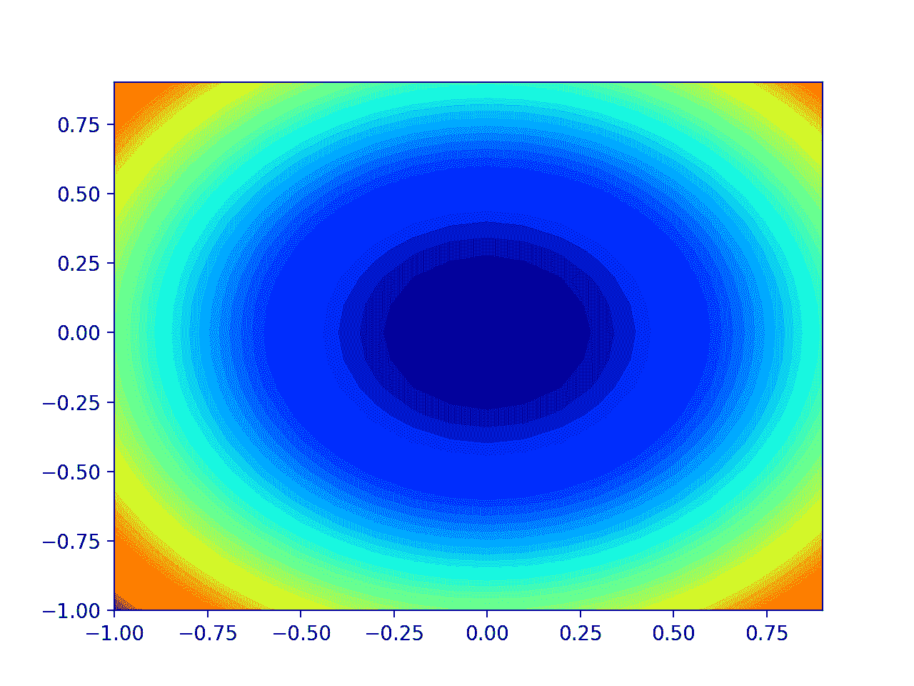
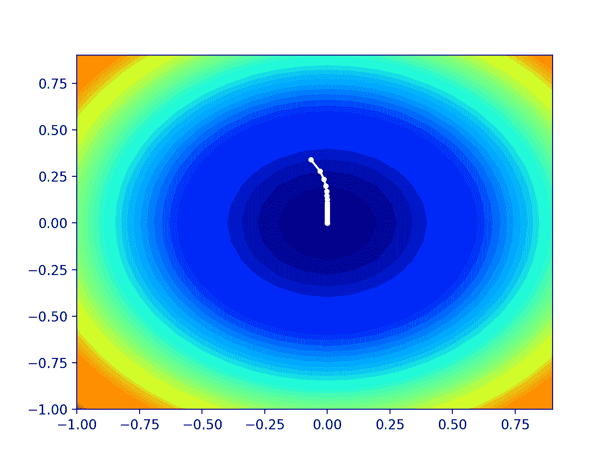

# 从零开始的 AdaGrad 梯度下降

> 原文：<https://machinelearningmastery.com/gradient-descent-with-adagrad-from-scratch/>

最后更新于 2021 年 10 月 12 日

梯度下降是一种优化算法，它遵循目标函数的负梯度来定位函数的最小值。

梯度下降的一个限制是，它对每个输入变量使用相同的步长(学习率)。这对于在不同维度上具有不同曲率的目标函数来说可能是一个问题，并且反过来可能需要不同大小的步长来到达新的点。

**自适应梯度**，简称 **AdaGrad** ，是梯度下降优化算法的扩展，允许优化算法使用的每个维度中的步长基于搜索过程中看到的变量(偏导数)的梯度自动调整。

在本教程中，您将发现如何从零开始开发带有自适应梯度优化算法的梯度下降。

完成本教程后，您将知道:

*   梯度下降是一种优化算法，它使用目标函数的梯度来导航搜索空间。
*   梯度下降可以更新，为目标函数中的每个输入变量使用自动自适应步长，称为自适应梯度或 AdaGrad。
*   如何从零开始实现 AdaGrad 优化算法，并将其应用于目标函数并评估结果。

**用我的新书[机器学习优化](https://machinelearningmastery.com/optimization-for-machine-learning/)启动你的项目**，包括*分步教程*和所有示例的 *Python 源代码*文件。

Let’s get started.

从零开始的梯度下降
图片由[毛里蒂斯·韦尔比斯特](https://www.flickr.com/photos/mauritsverbiest/27569600677/)提供，保留部分权利。

## 教程概述

本教程分为三个部分；它们是:

1.  梯度下降
2.  自适应梯度
3.  用 AdaGrad 梯度下降
    1.  二维测试问题
    2.  基于 AdaGrad 的梯度下降优化
    3.  AdaGrad 的可视化

## 梯度下降

[梯度下降](https://en.wikipedia.org/wiki/Gradient_descent)是一种优化算法。

它在技术上被称为一阶优化算法，因为它明确地利用了目标函数的一阶导数。

> 一阶方法依赖于梯度信息来帮助指导搜索最小值…

—第 69 页，[优化算法](https://amzn.to/39KZSQn)，2019。

[一阶导数](https://en.wikipedia.org/wiki/Derivative)，或简称为“*导数*，是目标函数在特定点的变化率或斜率，例如对于特定输入。

如果目标函数有多个输入变量，它被称为多元函数，输入变量可以被认为是一个向量。反过来，多元目标函数的导数也可以作为向量，通常称为“[梯度](https://en.wikipedia.org/wiki/Gradient)”

*   **梯度**:多元目标函数的一阶导数。

对于特定输入，导数或梯度指向目标函数最陡上升的方向。

梯度下降是指一种最小化优化算法，它遵循目标函数梯度下降的负值来定位函数的最小值。

梯度下降算法需要一个正在优化的目标函数和目标函数的导数函数。目标函数 *f()* 返回给定输入集的得分，导数函数 *f'()* 给出给定输入集的目标函数的导数。

梯度下降算法要求问题中有一个起点( *x* )，比如输入空间中随机选择的一个点。

然后计算导数，并在输入空间中采取一个步骤，该步骤预计会导致目标函数的下坡运动，假设我们正在最小化目标函数。

下坡移动是通过首先计算在输入空间中移动多远来实现的，计算方法是步长(称为 alpha 或学习率)乘以梯度。然后从当前点减去这一点，确保我们逆着梯度或目标函数向下移动。

*   x = x–步长* f'(x)

给定点处的目标函数越陡，梯度的幅度就越大，反过来，搜索空间中的步长就越大。使用步长超参数来缩放所采取的步长。

*   **步长**(*α*):超参数，控制算法每次迭代在搜索空间中逆着梯度移动多远。

如果步长太小，搜索空间中的移动将会很小，并且搜索将会花费很长时间。如果步长过大，搜索可能会绕过搜索空间并跳过 optima。

现在我们已经熟悉了梯度下降优化算法，让我们来看看 AdaGrad。

## 自适应梯度

自适应梯度算法，简称 AdaGrad，是梯度下降优化算法的扩展。

约翰·杜奇等人在 2011 年的论文《在线学习和随机优化的自适应次梯度方法》中描述了该算法

它旨在加速优化过程，例如减少达到最优所需的函数求值次数，或者提高优化算法的能力，例如产生更好的最终结果。

> 具有最大损失偏导数的参数的学习率相应地快速下降，而具有小偏导数的参数的学习率下降相对较小。

—第 307 页，[深度学习](https://amzn.to/3qSk3C2)，2016。

梯度下降算法的一个问题是，对于搜索空间中的每个变量或维度，步长(学习率)是相同的。有可能使用针对每个变量定制的步长来实现更好的表现，从而允许在具有一致陡峭梯度的维度上进行更大的移动，而在具有不太陡峭梯度的维度上进行更小的移动。

AdaGrad 旨在专门探索为搜索空间中的每个维度自动定制步长的想法。

> 自适应次梯度方法，或称 Adagrad，为 x 的每个分量调整一个学习率

—第 77 页，[优化算法](https://amzn.to/39KZSQn)，2019。

这是通过首先计算给定维度的步长，然后使用计算出的步长在该维度上使用偏导数进行移动来实现的。然后对搜索空间中的每个维度重复这个过程。

> Adagrad 减弱了具有持续高梯度的参数的影响，从而增加了不经常更新的参数的影响。

—第 77 页，[优化算法](https://amzn.to/39KZSQn)，2019。

AdaGrad 适用于搜索空间的曲率在不同维度上不同的目标函数，允许在每个维度上定制步长的情况下进行更有效的优化。

该算法要求您按照标准为所有输入变量设置初始步长，例如 0.1 或 0.001 或类似值。虽然，该算法的好处是它不像梯度下降算法那样对初始学习率敏感。

> Adagrad 对学习率参数α的敏感度要低得多。学习率参数通常设置为默认值 0.01。

—第 77 页，[优化算法](https://amzn.to/39KZSQn)，2019。

然后为每个输入变量维护一个内部变量，该变量是搜索过程中观察到的输入变量的平方偏导数之和。

然后，通过将初始步长值(例如，运行开始时指定的超参数值)除以平方偏导数之和的平方根，平方偏导数之和用于计算变量的步长。

*   客户步长=步长/平方

平方偏导数之和的平方根可能产生 0.0 的值，从而产生除以零的误差。因此，可以在分母上增加一个微小的值来避免这种可能性，例如 1e-8。

*   cust _ step _ size = step _ size/(1e-8+sqrt)

其中 *cust_step_size* 是搜索过程中给定点输入变量的计算步长， *step_size* 是初始步长， *sqrt()* 是平方根运算， *s* 是迄今为止搜索过程中看到的输入变量的平方偏导数之和。

然后使用自定义步长来计算搜索中下一个点或解中的变量值。

*   x(t+1)= x(t)–cust _ step _ size * f '(x(t))

然后对每个输入变量重复这个过程，直到在搜索空间中创建一个新的点并可以对其进行评估。

重要的是，当前解的偏导数(搜索的迭代)包含在偏导数的平方根之和中。

我们可以为每个输入变量维护一个偏导数或平方偏导数的数组，但这不是必需的。相反，我们只需保持偏导数的平方和，并在此过程中为该和添加新值。

现在我们已经熟悉了 AdaGrad 算法，让我们探索如何实现它并评估它的表现。

## 用 AdaGrad 梯度下降

在这一部分，我们将探索如何实现梯度下降优化算法与自适应梯度。

### 二维测试问题

首先，让我们定义一个优化函数。

我们将使用一个简单的二维函数，它对每个维度的输入进行平方，并定义从-1.0 到 1.0 的有效输入范围。

下面的*目标()*函数实现了这个功能。

```py
# objective function
def objective(x, y):
	return x**2.0 + y**2.0
```

我们可以创建数据集的三维图，以获得对响应表面曲率的感觉。

下面列出了绘制目标函数的完整示例。

```py
# 3d plot of the test function
from numpy import arange
from numpy import meshgrid
from matplotlib import pyplot

# objective function
def objective(x, y):
	return x**2.0 + y**2.0

# define range for input
r_min, r_max = -1.0, 1.0
# sample input range uniformly at 0.1 increments
xaxis = arange(r_min, r_max, 0.1)
yaxis = arange(r_min, r_max, 0.1)
# create a mesh from the axis
x, y = meshgrid(xaxis, yaxis)
# compute targets
results = objective(x, y)
# create a surface plot with the jet color scheme
figure = pyplot.figure()
axis = figure.gca(projection='3d')
axis.plot_surface(x, y, results, cmap='jet')
# show the plot
pyplot.show()
```

运行该示例会创建目标函数的三维表面图。

我们可以看到熟悉的碗形，全局最小值在 f(0，0) = 0。



测试目标函数的三维图

我们还可以创建函数的二维图。这将有助于我们以后绘制搜索进度。

以下示例创建了目标函数的等高线图。

```py
# contour plot of the test function
from numpy import asarray
from numpy import arange
from numpy import meshgrid
from matplotlib import pyplot

# objective function
def objective(x, y):
	return x**2.0 + y**2.0

# define range for input
bounds = asarray([[-1.0, 1.0], [-1.0, 1.0]])
# sample input range uniformly at 0.1 increments
xaxis = arange(bounds[0,0], bounds[0,1], 0.1)
yaxis = arange(bounds[1,0], bounds[1,1], 0.1)
# create a mesh from the axis
x, y = meshgrid(xaxis, yaxis)
# compute targets
results = objective(x, y)
# create a filled contour plot with 50 levels and jet color scheme
pyplot.contourf(x, y, results, levels=50, cmap='jet')
# show the plot
pyplot.show()
```

运行该示例会创建目标函数的二维等高线图。

我们可以看到碗的形状被压缩成带有颜色梯度的轮廓。我们将使用此图来绘制搜索过程中探索的具体点。



测试目标函数的二维等高线图

现在我们有了一个测试目标函数，让我们看看如何实现 AdaGrad 优化算法。

### 基于 AdaGrad 的梯度下降优化

我们可以将梯度下降和自适应梯度算法应用于测试问题。

首先，我们需要一个函数来计算这个函数的导数。

*   f(x) = x^2
*   f'(x) = x * 2

x^2 的导数在每个维度上都是 x * 2。

*导数()*函数实现如下。

```py
# derivative of objective function
def derivative(x, y):
	return asarray([x * 2.0, y * 2.0])
```

接下来，我们可以用自适应梯度实现梯度下降。

首先，我们可以在问题的边界中选择一个随机点作为搜索的起点。

这假设我们有一个定义搜索范围的数组，每个维度有一行，第一列定义维度的最小值，第二列定义维度的最大值。

```py
...
# generate an initial point
solution = bounds[:, 0] + rand(len(bounds)) * (bounds[:, 1] - bounds[:, 0])
```

接下来，我们需要将每个维度的平方偏导数之和初始化为 0.0。

```py
...
# list of the sum square gradients for each variable
sq_grad_sums = [0.0 for _ in range(bounds.shape[0])]
```

然后，我们可以枚举由“ *n_iter* ”超参数定义的搜索优化算法的固定迭代次数。

```py
...
# run the gradient descent
for it in range(n_iter):
	...
```

第一步是使用*导数()*函数计算当前解的梯度。

```py
...
# calculate gradient
gradient = derivative(solution[0], solution[1])
```

然后，我们需要计算每个变量偏导数的平方，并将它们加到这些值的总和中。

```py
...
# update the sum of the squared partial derivatives
for i in range(gradient.shape[0]):
	sq_grad_sums[i] += gradient[i]**2.0
```

然后，我们可以使用平方和偏导数和梯度来计算下一个点。

我们将一次处理一个变量，首先计算变量的步长，然后计算变量的新值。这些值在一个数组中建立，直到我们有一个全新的解决方案，该解决方案使用自定义步长从当前点开始以最陡的下降方向下降。

```py
...
# build a solution one variable at a time
new_solution = list()
for i in range(solution.shape[0]):
	# calculate the step size for this variable
	alpha = step_size / (1e-8 + sqrt(sq_grad_sums[i]))
	# calculate the new position in this variable
	value = solution[i] - alpha * gradient[i]
	# store this variable
	new_solution.append(value)
```

然后，可以使用*客观()*函数来评估这个新的解决方案，并且可以报告搜索的表现。

```py
...
# evaluate candidate point
solution = asarray(new_solution)
solution_eval = objective(solution[0], solution[1])
# report progress
print('>%d f(%s) = %.5f' % (it, solution, solution_eval))
```

就这样。

我们可以将所有这些联系到一个名为 *adagrad()* 的函数中，该函数取目标函数和导函数的名称，一个有定义域边界的数组，以及算法迭代总数和初始学习率的超参数值，并返回最终解及其求值。

下面列出了完整的功能。

```py
# gradient descent algorithm with adagrad
def adagrad(objective, derivative, bounds, n_iter, step_size):
	# generate an initial point
	solution = bounds[:, 0] + rand(len(bounds)) * (bounds[:, 1] - bounds[:, 0])
	# list of the sum square gradients for each variable
	sq_grad_sums = [0.0 for _ in range(bounds.shape[0])]
	# run the gradient descent
	for it in range(n_iter):
		# calculate gradient
		gradient = derivative(solution[0], solution[1])
		# update the sum of the squared partial derivatives
		for i in range(gradient.shape[0]):
			sq_grad_sums[i] += gradient[i]**2.0
		# build a solution one variable at a time
		new_solution = list()
		for i in range(solution.shape[0]):
			# calculate the step size for this variable
			alpha = step_size / (1e-8 + sqrt(sq_grad_sums[i]))
			# calculate the new position in this variable
			value = solution[i] - alpha * gradient[i]
			# store this variable
			new_solution.append(value)
		# evaluate candidate point
		solution = asarray(new_solution)
		solution_eval = objective(solution[0], solution[1])
		# report progress
		print('>%d f(%s) = %.5f' % (it, solution, solution_eval))
	return [solution, solution_eval]
```

**注**:为了可读性，我们特意使用了列表和命令式编码风格，而不是矢量化操作。请随意将实现调整为使用 NumPy 阵列的矢量化实现，以获得更好的表现。

然后我们可以定义我们的超参数，并调用 *adagrad()* 函数来优化我们的测试目标函数。

在这种情况下，我们将使用算法的 50 次迭代和 0.1 的初始学习率，这两者都是经过一点点尝试和错误后选择的。

```py
...
# seed the pseudo random number generator
seed(1)
# define range for input
bounds = asarray([[-1.0, 1.0], [-1.0, 1.0]])
# define the total iterations
n_iter = 50
# define the step size
step_size = 0.1
# perform the gradient descent search with adagrad
best, score = adagrad(objective, derivative, bounds, n_iter, step_size)
print('Done!')
print('f(%s) = %f' % (best, score))
```

将所有这些结合在一起，下面列出了具有自适应梯度的梯度下降优化的完整示例。

```py
# gradient descent optimization with adagrad for a two-dimensional test function
from math import sqrt
from numpy import asarray
from numpy.random import rand
from numpy.random import seed

# objective function
def objective(x, y):
	return x**2.0 + y**2.0

# derivative of objective function
def derivative(x, y):
	return asarray([x * 2.0, y * 2.0])

# gradient descent algorithm with adagrad
def adagrad(objective, derivative, bounds, n_iter, step_size):
	# generate an initial point
	solution = bounds[:, 0] + rand(len(bounds)) * (bounds[:, 1] - bounds[:, 0])
	# list of the sum square gradients for each variable
	sq_grad_sums = [0.0 for _ in range(bounds.shape[0])]
	# run the gradient descent
	for it in range(n_iter):
		# calculate gradient
		gradient = derivative(solution[0], solution[1])
		# update the sum of the squared partial derivatives
		for i in range(gradient.shape[0]):
			sq_grad_sums[i] += gradient[i]**2.0
		# build a solution one variable at a time
		new_solution = list()
		for i in range(solution.shape[0]):
			# calculate the step size for this variable
			alpha = step_size / (1e-8 + sqrt(sq_grad_sums[i]))
			# calculate the new position in this variable
			value = solution[i] - alpha * gradient[i]
			# store this variable
			new_solution.append(value)
		# evaluate candidate point
		solution = asarray(new_solution)
		solution_eval = objective(solution[0], solution[1])
		# report progress
		print('>%d f(%s) = %.5f' % (it, solution, solution_eval))
	return [solution, solution_eval]

# seed the pseudo random number generator
seed(1)
# define range for input
bounds = asarray([[-1.0, 1.0], [-1.0, 1.0]])
# define the total iterations
n_iter = 50
# define the step size
step_size = 0.1
# perform the gradient descent search with adagrad
best, score = adagrad(objective, derivative, bounds, n_iter, step_size)
print('Done!')
print('f(%s) = %f' % (best, score))
```

运行该示例将 AdaGrad 优化算法应用于我们的测试问题，并报告算法每次迭代的搜索表现。

**注**:考虑到算法或评估程序的随机性，或数值准确率的差异，您的[结果可能会有所不同](https://machinelearningmastery.com/different-results-each-time-in-machine-learning/)。考虑运行该示例几次，并比较平均结果。

在这种情况下，我们可以看到，在大约 35 次搜索迭代后，找到了一个接近最优的解，输入值接近 0.0 和 0.0，评估为 0.0。

```py
>0 f([-0.06595599  0.34064899]) = 0.12039
>1 f([-0.02902286  0.27948766]) = 0.07896
>2 f([-0.0129815   0.23463749]) = 0.05522
>3 f([-0.00582483  0.1993997 ]) = 0.03979
>4 f([-0.00261527  0.17071256]) = 0.02915
>5 f([-0.00117437  0.14686138]) = 0.02157
>6 f([-0.00052736  0.12676134]) = 0.01607
>7 f([-0.00023681  0.10966762]) = 0.01203
>8 f([-0.00010634  0.09503809]) = 0.00903
>9 f([-4.77542704e-05  8.24607972e-02]) = 0.00680
>10 f([-2.14444463e-05  7.16123835e-02]) = 0.00513
>11 f([-9.62980437e-06  6.22327049e-02]) = 0.00387
>12 f([-4.32434258e-06  5.41085063e-02]) = 0.00293
>13 f([-1.94188148e-06  4.70624414e-02]) = 0.00221
>14 f([-8.72017797e-07  4.09453989e-02]) = 0.00168
>15 f([-3.91586740e-07  3.56309531e-02]) = 0.00127
>16 f([-1.75845235e-07  3.10112252e-02]) = 0.00096
>17 f([-7.89647442e-08  2.69937139e-02]) = 0.00073
>18 f([-3.54597657e-08  2.34988084e-02]) = 0.00055
>19 f([-1.59234984e-08  2.04577993e-02]) = 0.00042
>20 f([-7.15057749e-09  1.78112581e-02]) = 0.00032
>21 f([-3.21102543e-09  1.55077005e-02]) = 0.00024
>22 f([-1.44193729e-09  1.35024688e-02]) = 0.00018
>23 f([-6.47513760e-10  1.17567908e-02]) = 0.00014
>24 f([-2.90771361e-10  1.02369798e-02]) = 0.00010
>25 f([-1.30573263e-10  8.91375193e-03]) = 0.00008
>26 f([-5.86349941e-11  7.76164047e-03]) = 0.00006
>27 f([-2.63305247e-11  6.75849105e-03]) = 0.00005
>28 f([-1.18239380e-11  5.88502652e-03]) = 0.00003
>29 f([-5.30963626e-12  5.12447017e-03]) = 0.00003
>30 f([-2.38433568e-12  4.46221948e-03]) = 0.00002
>31 f([-1.07070548e-12  3.88556303e-03]) = 0.00002
>32 f([-4.80809073e-13  3.38343471e-03]) = 0.00001
>33 f([-2.15911255e-13  2.94620023e-03]) = 0.00001
>34 f([-9.69567190e-14  2.56547145e-03]) = 0.00001
>35 f([-4.35392094e-14  2.23394494e-03]) = 0.00000
>36 f([-1.95516389e-14  1.94526160e-03]) = 0.00000
>37 f([-8.77982370e-15  1.69388439e-03]) = 0.00000
>38 f([-3.94265180e-15  1.47499203e-03]) = 0.00000
>39 f([-1.77048011e-15  1.28438640e-03]) = 0.00000
>40 f([-7.95048604e-16  1.11841198e-03]) = 0.00000
>41 f([-3.57023093e-16  9.73885702e-04]) = 0.00000
>42 f([-1.60324146e-16  8.48035867e-04]) = 0.00000
>43 f([-7.19948720e-17  7.38448972e-04]) = 0.00000
>44 f([-3.23298874e-17  6.43023418e-04]) = 0.00000
>45 f([-1.45180009e-17  5.59929193e-04]) = 0.00000
>46 f([-6.51942732e-18  4.87572776e-04]) = 0.00000
>47 f([-2.92760228e-18  4.24566574e-04]) = 0.00000
>48 f([-1.31466380e-18  3.69702307e-04]) = 0.00000
>49 f([-5.90360555e-19  3.21927835e-04]) = 0.00000
Done!
f([-5.90360555e-19  3.21927835e-04]) = 0.000000
```

### AdaGrad 的可视化

我们可以在域的等高线图上绘制搜索进度。

这可以为算法迭代过程中的搜索进度提供直觉。

我们必须更新 *adagrad()* 函数，以维护搜索过程中找到的所有解决方案的列表，然后在搜索结束时返回该列表。

下面列出了带有这些更改的功能的更新版本。

```py
# gradient descent algorithm with adagrad
def adagrad(objective, derivative, bounds, n_iter, step_size):
	# track all solutions
	solutions = list()
	# generate an initial point
	solution = bounds[:, 0] + rand(len(bounds)) * (bounds[:, 1] - bounds[:, 0])
	# list of the sum square gradients for each variable
	sq_grad_sums = [0.0 for _ in range(bounds.shape[0])]
	# run the gradient descent
	for it in range(n_iter):
		# calculate gradient
		gradient = derivative(solution[0], solution[1])
		# update the sum of the squared partial derivatives
		for i in range(gradient.shape[0]):
			sq_grad_sums[i] += gradient[i]**2.0
		# build solution
		new_solution = list()
		for i in range(solution.shape[0]):
			# calculate the learning rate for this variable
			alpha = step_size / (1e-8 + sqrt(sq_grad_sums[i]))
			# calculate the new position in this variable
			value = solution[i] - alpha * gradient[i]
			new_solution.append(value)
		# store the new solution
		solution = asarray(new_solution)
		solutions.append(solution)
		# evaluate candidate point
		solution_eval = objective(solution[0], solution[1])
		# report progress
		print('>%d f(%s) = %.5f' % (it, solution, solution_eval))
	return solutions
```

然后，我们可以像以前一样执行搜索，这次检索解决方案列表，而不是最佳最终解决方案。

```py
...
# seed the pseudo random number generator
seed(1)
# define range for input
bounds = asarray([[-1.0, 1.0], [-1.0, 1.0]])
# define the total iterations
n_iter = 50
# define the step size
step_size = 0.1
# perform the gradient descent search
solutions = adagrad(objective, derivative, bounds, n_iter, step_size)
```

然后，我们可以像以前一样创建目标函数的等高线图。

```py
...
# sample input range uniformly at 0.1 increments
xaxis = arange(bounds[0,0], bounds[0,1], 0.1)
yaxis = arange(bounds[1,0], bounds[1,1], 0.1)
# create a mesh from the axis
x, y = meshgrid(xaxis, yaxis)
# compute targets
results = objective(x, y)
# create a filled contour plot with 50 levels and jet color scheme
pyplot.contourf(x, y, results, levels=50, cmap='jet')
```

最后，我们可以将搜索过程中找到的每个解决方案绘制成由一条线连接的白点。

```py
...
# plot the sample as black circles
solutions = asarray(solutions)
pyplot.plot(solutions[:, 0], solutions[:, 1], '.-', color='w')
```

将所有这些结合起来，下面列出了对测试问题执行 AdaGrad 优化并将结果绘制在等高线图上的完整示例。

```py
# example of plotting the adagrad search on a contour plot of the test function
from math import sqrt
from numpy import asarray
from numpy import arange
from numpy.random import rand
from numpy.random import seed
from numpy import meshgrid
from matplotlib import pyplot
from mpl_toolkits.mplot3d import Axes3D

# objective function
def objective(x, y):
	return x**2.0 + y**2.0

# derivative of objective function
def derivative(x, y):
	return asarray([x * 2.0, y * 2.0])

# gradient descent algorithm with adagrad
def adagrad(objective, derivative, bounds, n_iter, step_size):
	# track all solutions
	solutions = list()
	# generate an initial point
	solution = bounds[:, 0] + rand(len(bounds)) * (bounds[:, 1] - bounds[:, 0])
	# list of the sum square gradients for each variable
	sq_grad_sums = [0.0 for _ in range(bounds.shape[0])]
	# run the gradient descent
	for it in range(n_iter):
		# calculate gradient
		gradient = derivative(solution[0], solution[1])
		# update the sum of the squared partial derivatives
		for i in range(gradient.shape[0]):
			sq_grad_sums[i] += gradient[i]**2.0
		# build solution
		new_solution = list()
		for i in range(solution.shape[0]):
			# calculate the learning rate for this variable
			alpha = step_size / (1e-8 + sqrt(sq_grad_sums[i]))
			# calculate the new position in this variable
			value = solution[i] - alpha * gradient[i]
			new_solution.append(value)
		# store the new solution
		solution = asarray(new_solution)
		solutions.append(solution)
		# evaluate candidate point
		solution_eval = objective(solution[0], solution[1])
		# report progress
		print('>%d f(%s) = %.5f' % (it, solution, solution_eval))
	return solutions

# seed the pseudo random number generator
seed(1)
# define range for input
bounds = asarray([[-1.0, 1.0], [-1.0, 1.0]])
# define the total iterations
n_iter = 50
# define the step size
step_size = 0.1
# perform the gradient descent search
solutions = adagrad(objective, derivative, bounds, n_iter, step_size)
# sample input range uniformly at 0.1 increments
xaxis = arange(bounds[0,0], bounds[0,1], 0.1)
yaxis = arange(bounds[1,0], bounds[1,1], 0.1)
# create a mesh from the axis
x, y = meshgrid(xaxis, yaxis)
# compute targets
results = objective(x, y)
# create a filled contour plot with 50 levels and jet color scheme
pyplot.contourf(x, y, results, levels=50, cmap='jet')
# plot the sample as black circles
solutions = asarray(solutions)
pyplot.plot(solutions[:, 0], solutions[:, 1], '.-', color='w')
# show the plot
pyplot.show()
```

运行该示例与之前一样执行搜索，只是在这种情况下，创建了目标函数的等高线图，并为搜索过程中找到的每个解显示一个白点，从 optima 上方开始，逐渐靠近图中心的 optima。



显示 AdaGrad 搜索结果的测试目标函数等高线图

## 进一步阅读

如果您想更深入地了解这个主题，本节将提供更多资源。

### 报纸

*   [在线学习和随机优化的自适应次梯度方法](https://www.jmlr.org/papers/volume12/duchi11a/duchi11a.pdf)，2011。

### 书

*   [优化算法](https://amzn.to/39KZSQn)，2019。
*   [深度学习](https://amzn.to/3qSk3C2)，2016 年。

### 蜜蜂

*   num py . random . rand API。
*   num py . asar ray API。
*   [Matplotlib API](https://matplotlib.org/api/pyplot_api.html) 。

### 文章

*   [梯度下降，维基百科](https://en.wikipedia.org/wiki/Gradient_descent)。
*   [随机梯度下降，维基百科](https://en.wikipedia.org/wiki/Stochastic_gradient_descent)。
*   [梯度下降优化算法概述](https://ruder.io/optimizing-gradient-descent/index.html)，2016。

## 摘要

在本教程中，您发现了如何从零开始开发带有自适应梯度优化算法的梯度下降。

具体来说，您了解到:

*   梯度下降是一种优化算法，它使用目标函数的梯度来导航搜索空间。
*   梯度下降可以更新，为目标函数中的每个输入变量使用自动自适应步长，称为自适应梯度或 AdaGrad。
*   如何从零开始实现 AdaGrad 优化算法，并将其应用于目标函数并评估结果。

**你有什么问题吗？**
在下面的评论中提问，我会尽力回答。