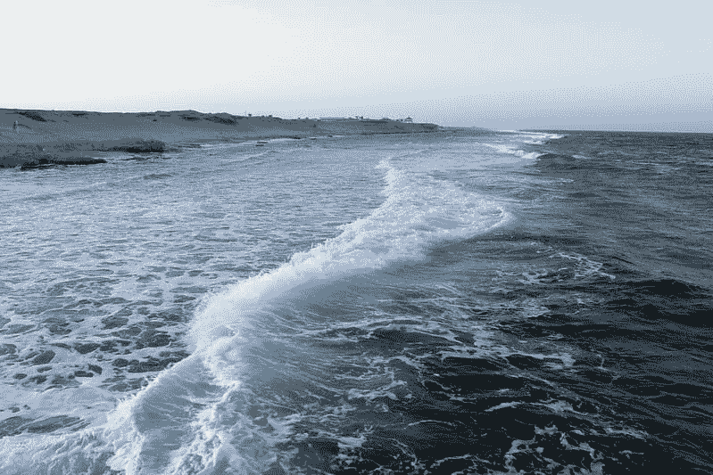
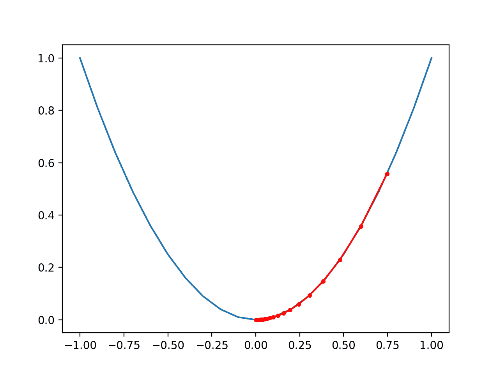

# 从零开始的动量梯度下降

> 原文：<https://machinelearningmastery.com/gradient-descent-with-momentum-from-scratch/>

最后更新于 2021 年 10 月 12 日

**梯度下降**是一种优化算法，它遵循目标函数的负梯度，以定位函数的最小值。

梯度下降的一个问题是，它可以在具有大量曲率或噪声梯度的优化问题上围绕搜索空间反弹，并且它可以卡在搜索空间中没有梯度的平坦点上。

**动量**是梯度下降优化算法的扩展，该算法允许搜索在搜索空间的一个方向上建立惯性，并克服噪声梯度的振荡和在搜索空间的平坦点上滑行。

在本教程中，您将发现动量梯度下降算法。

完成本教程后，您将知道:

*   梯度下降是一种优化算法，它使用目标函数的梯度来导航搜索空间。
*   梯度下降可以通过使用搜索位置过去更新的动量来加速。
*   如何利用动量实现梯度下降优化并对其行为产生直觉？

**用我的新书[机器学习优化](https://machinelearningmastery.com/optimization-for-machine-learning/)启动你的项目**，包括*分步教程*和所有示例的 *Python 源代码*文件。

Let’s get started.

从零开始的动量梯度下降
克里斯·巴恩斯摄，版权所有。

## 教程概述

本教程分为三个部分；它们是:

1.  梯度下降
2.  动力
3.  动量梯度下降
    1.  一维测试问题
    2.  梯度下降优化
    3.  梯度下降优化的可视化
    4.  动量梯度下降优化
    5.  动量梯度下降优化的可视化

## 梯度下降

[梯度下降](https://en.wikipedia.org/wiki/Gradient_descent)是一种优化算法。

它在技术上被称为一阶优化算法，因为它明确地利用了目标函数的一阶导数。

> 一阶方法依赖于梯度信息来帮助指导搜索最小值…

—第 69 页，[优化算法](https://amzn.to/39KZSQn)，2019。

[一阶导数](https://en.wikipedia.org/wiki/Derivative)，或简称为“*导数*，是目标函数在特定点的变化率或斜率，例如对于特定输入。

如果目标函数有多个输入变量，它被称为多元函数，输入变量可以被认为是一个向量。反过来，多元目标函数的导数也可以作为向量，通常称为“[梯度](https://en.wikipedia.org/wiki/Gradient)”

*   **梯度**:多元目标函数的一阶导数。

对于特定输入，导数或梯度指向目标函数最陡上升的方向。

梯度下降是指一种最小化优化算法，它遵循目标函数梯度下降的负值来定位函数的最小值。

梯度下降算法需要一个正在优化的目标函数和目标函数的导数函数。目标函数 *f()* 返回给定输入集的得分，导数函数 *f'()* 给出给定输入集的目标函数的导数。

梯度下降算法要求问题中有一个起点( *x* )，比如输入空间中随机选择的一个点。

然后计算导数，并在输入空间中采取一个步骤，该步骤预计会导致目标函数的下坡运动，假设我们正在最小化目标函数。

下坡运动是通过首先计算在输入空间中移动多远来实现的，计算方法是步长(称为*α*或*学习率*)乘以梯度。然后从当前点减去这一点，确保我们逆着梯度或目标函数向下移动。

*   x = x–步长* f'(x)

给定点处的目标函数越陡，梯度的幅度就越大，反过来，搜索空间中的步长也就越大。使用步长超参数来缩放所采取的步长。

*   **步长**(*α*):超参数，控制算法每次迭代在搜索空间中逆着梯度移动多远，也称为学习率。

如果步长太小，搜索空间中的移动将会很小，并且搜索将会花费很长时间。如果步长过大，搜索可能会绕过搜索空间并跳过 optima。

现在我们已经熟悉了梯度下降优化算法，让我们来看看动量。

## 动力

动量是梯度下降优化算法的延伸，通常称为**带动量的梯度下降**。

它旨在加速优化过程，例如减少达到最优所需的函数求值次数，或者提高优化算法的能力，例如产生更好的最终结果。

梯度下降算法的一个问题是，搜索的进程可以基于梯度在搜索空间中反弹。例如，搜索可以朝着最小值向下进行，但是在这个过程中，它可以根据搜索过程中遇到的特定点(参数集)的梯度向另一个方向移动，甚至上坡。

这可能会减慢搜索的进度，尤其是对于那些优化问题，在这些优化问题中，搜索空间的更广泛的趋势或形状比沿途的特定梯度更有用。

解决这个问题的一种方法是基于在先前更新中遇到的梯度向参数更新方程添加历史。

这种变化是基于物理学中动量的隐喻，一个方向的加速度可以从过去的更新中积累。

> 动量这个名字来源于一个物理类比，根据牛顿运动定律，负梯度是一种力，使粒子在参数空间中移动。

—第 296 页，[深度学习](https://amzn.to/3qSk3C2)，2016。

动量涉及添加额外的超参数，该超参数控制要包括在更新等式中的历史量(动量)，即搜索空间中新点的步长。超参数的值定义在 0.0 到 1.0 的范围内，通常具有接近 1.0 的值，例如 0.8、0.9 或 0.99。0.0 的动量等于没有动量的梯度下降。

首先，让我们将梯度下降更新方程分解为两部分:位置变化的计算和旧位置到新位置的更新。

参数的变化被计算为按步长缩放的点的梯度。

*   change_x =步长* f'(x)

通过简单地从当前点减去变化来计算新位置

*   x = x–change _ x

动量包括保持位置的变化，并在随后的位置变化计算中使用它。

如果我们考虑随时间的更新，那么当前迭代或时间(t)的更新将加上动量超参数加权的前一时间(t-1)使用的变化，如下所示:

*   change_x(t) =步长* f'(x(t-1)) +动量* change_x(t-1)

然后像以前一样更新位置。

*   x(t)= x(t-1)-change _ x(t)

位置的变化在搜索的迭代中累积变化的幅度和方向，与动量超参数的大小成比例。

例如，大的动量(例如 0.9)将意味着更新受到先前更新的强烈影响，而适度的动量(0.2)将意味着影响非常小。

> 动量算法累积过去梯度的指数衰减移动平均值，并继续向它们的方向移动。

—第 296 页，[深度学习](https://amzn.to/3qSk3C2)，2016。

动量具有抑制梯度变化的效果，进而抑制搜索空间中每个新点的步长。

> 当成本面高度非球形时，动量可以提高速度，因为它抑制了沿高曲率方向的步长，从而沿低曲率方向产生更大的有效学习率。

—第 21 页，[神经网络:交易的诀窍](https://amzn.to/3ac5S4Q)，2012 年。

动量在优化问题中最有用，在优化问题中，目标函数具有大量曲率(例如，变化很大)，这意味着梯度在搜索空间的相对小的区域上可能变化很大。

> 动量法旨在加速学习，尤其是在面对高曲率、小但一致的梯度或噪声梯度时。

—第 296 页，[深度学习](https://amzn.to/3qSk3C2)，2016。

当例如从模拟中估计梯度时，这也是有帮助的，并且可能是有噪声的，例如当梯度具有高方差时。

最后，当搜索空间平坦或接近平坦时，动量是有帮助的，例如零梯度。动量允许搜索以与平坦点之前相同的方向前进，并有助于穿过平坦区域。

现在我们已经熟悉了什么是动量，让我们来看一个成功的例子。

## 动量梯度下降

在本节中，我们将首先实现梯度下降优化算法，然后更新它以使用动量并比较结果。

### 一维测试问题

首先，让我们定义一个优化函数。

我们将使用一个简单的一维函数对输入进行平方，并定义从-1.0 到 1.0 的有效输入范围。

下面的*目标()*函数实现了这个功能。

```py
# objective function
def objective(x):
	return x**2.0
```

然后，我们可以对该范围内的所有输入进行采样，并计算每个输入的目标函数值。

```py
...
# define range for input
r_min, r_max = -1.0, 1.0
# sample input range uniformly at 0.1 increments
inputs = arange(r_min, r_max+0.1, 0.1)
# compute targets
results = objective(inputs)
```

最后，我们可以创建输入(x 轴)与目标函数值(y 轴)的线图，以获得我们将搜索的目标函数形状的直觉。

```py
...
# create a line plot of input vs result
pyplot.plot(inputs, results)
# show the plot
pyplot.show()
```

下面的示例将这些联系在一起，并提供了绘制一维测试函数的示例。

```py
# plot of simple function
from numpy import arange
from matplotlib import pyplot

# objective function
def objective(x):
	return x**2.0

# define range for input
r_min, r_max = -1.0, 1.0
# sample input range uniformly at 0.1 increments
inputs = arange(r_min, r_max+0.1, 0.1)
# compute targets
results = objective(inputs)
# create a line plot of input vs result
pyplot.plot(inputs, results)
# show the plot
pyplot.show()
```

运行该示例会创建函数输入(x 轴)和函数计算输出(y 轴)的线图。

我们可以看到熟悉的 U 形，叫做抛物线。


简单一维函数的线图

## 梯度下降优化

接下来，我们可以将梯度下降算法应用于该问题。

首先，我们需要一个函数来计算目标函数的导数。

x^2 的导数是 x * 2，下面的*导数()*函数实现了这一点。

```py
# derivative of objective function
def derivative(x):
	return x * 2.0
```

我们可以定义一个函数来实现梯度下降优化算法。

该过程包括从搜索空间中随机选择的点开始，然后计算梯度，更新搜索空间中的位置，评估新位置，并报告进度。该过程然后重复固定次数的迭代。最后一个点和它的求值然后从函数返回。

下面的函数*梯度 _ 下降()*实现了这一点，并采用目标函数和梯度函数的名称以及目标函数输入的边界、迭代次数和步长，然后在搜索结束时返回解及其评估。

```py
# gradient descent algorithm
def gradient_descent(objective, derivative, bounds, n_iter, step_size):
	# generate an initial point
	solution = bounds[:, 0] + rand(len(bounds)) * (bounds[:, 1] - bounds[:, 0])
	# run the gradient descent
	for i in range(n_iter):
		# calculate gradient
		gradient = derivative(solution)
		# take a step
		solution = solution - step_size * gradient
		# evaluate candidate point
		solution_eval = objective(solution)
		# report progress
		print('>%d f(%s) = %.5f' % (i, solution, solution_eval))
	return [solution, solution_eval]
```

然后，我们可以定义目标函数的边界、步长和算法的迭代次数。

我们将使用 0.1 和 30 次迭代的步长，这两个步长都是经过一些实验后发现的。

伪随机数发生器的种子是固定的，因此我们总是获得相同的随机数序列，在这种情况下，它确保我们每次运行代码时都获得相同的搜索起点(例如，远离 optima 的有趣的东西)。

```py
...
# seed the pseudo random number generator
seed(4)
# define range for input
bounds = asarray([[-1.0, 1.0]])
# define the total iterations
n_iter = 30
# define the maximum step size
step_size = 0.1
# perform the gradient descent search
best, score = gradient_descent(objective, derivative, bounds, n_iter, step_size)
```

将这些联系在一起，下面列出了将网格搜索应用于我们的一维测试函数的完整示例。

```py
# example of gradient descent for a one-dimensional function
from numpy import asarray
from numpy.random import rand
from numpy.random import seed

# objective function
def objective(x):
	return x**2.0

# derivative of objective function
def derivative(x):
	return x * 2.0

# gradient descent algorithm
def gradient_descent(objective, derivative, bounds, n_iter, step_size):
	# generate an initial point
	solution = bounds[:, 0] + rand(len(bounds)) * (bounds[:, 1] - bounds[:, 0])
	# run the gradient descent
	for i in range(n_iter):
		# calculate gradient
		gradient = derivative(solution)
		# take a step
		solution = solution - step_size * gradient
		# evaluate candidate point
		solution_eval = objective(solution)
		# report progress
		print('>%d f(%s) = %.5f' % (i, solution, solution_eval))
	return [solution, solution_eval]

# seed the pseudo random number generator
seed(4)
# define range for input
bounds = asarray([[-1.0, 1.0]])
# define the total iterations
n_iter = 30
# define the step size
step_size = 0.1
# perform the gradient descent search
best, score = gradient_descent(objective, derivative, bounds, n_iter, step_size)
print('Done!')
print('f(%s) = %f' % (best, score))
```

运行该示例从搜索空间中的随机点开始，然后应用梯度下降算法，报告一路上的表现。

**注**:考虑到算法或评估程序的随机性，或数值准确率的差异，您的[结果可能会有所不同](https://machinelearningmastery.com/different-results-each-time-in-machine-learning/)。考虑运行该示例几次，并比较平均结果。

在这种情况下，我们可以看到算法在大约 27 次迭代后找到了一个好的解，函数求值约为 0.0。

注意，此功能的最佳值为 f(0.0) = 0.0。

我们预计，动量梯度下降将加速优化过程，并在更少的迭代中找到类似的评估解决方案。

```py
>0 f([0.74724774]) = 0.55838
>1 f([0.59779819]) = 0.35736
>2 f([0.47823856]) = 0.22871
>3 f([0.38259084]) = 0.14638
>4 f([0.30607268]) = 0.09368
>5 f([0.24485814]) = 0.05996
>6 f([0.19588651]) = 0.03837
>7 f([0.15670921]) = 0.02456
>8 f([0.12536737]) = 0.01572
>9 f([0.10029389]) = 0.01006
>10 f([0.08023512]) = 0.00644
>11 f([0.06418809]) = 0.00412
>12 f([0.05135047]) = 0.00264
>13 f([0.04108038]) = 0.00169
>14 f([0.0328643]) = 0.00108
>15 f([0.02629144]) = 0.00069
>16 f([0.02103315]) = 0.00044
>17 f([0.01682652]) = 0.00028
>18 f([0.01346122]) = 0.00018
>19 f([0.01076897]) = 0.00012
>20 f([0.00861518]) = 0.00007
>21 f([0.00689214]) = 0.00005
>22 f([0.00551372]) = 0.00003
>23 f([0.00441097]) = 0.00002
>24 f([0.00352878]) = 0.00001
>25 f([0.00282302]) = 0.00001
>26 f([0.00225842]) = 0.00001
>27 f([0.00180673]) = 0.00000
>28 f([0.00144539]) = 0.00000
>29 f([0.00115631]) = 0.00000
Done!
f([0.00115631]) = 0.000001
```

## 梯度下降优化的可视化

接下来，我们可以在目标函数的图上可视化搜索的进度。

首先，我们可以更新*gradient _ download()*函数，将优化过程中找到的所有解及其得分存储为列表，并在搜索结束时返回，而不是找到的最佳解。

```py
# gradient descent algorithm
def gradient_descent(objective, derivative, bounds, n_iter, step_size):
	# track all solutions
	solutions, scores = list(), list()
	# generate an initial point
	solution = bounds[:, 0] + rand(len(bounds)) * (bounds[:, 1] - bounds[:, 0])
	# run the gradient descent
	for i in range(n_iter):
		# calculate gradient
		gradient = derivative(solution)
		# take a step
		solution = solution - step_size * gradient
		# evaluate candidate point
		solution_eval = objective(solution)
		# store solution
		solutions.append(solution)
		scores.append(solution_eval)
		# report progress
		print('>%d f(%s) = %.5f' % (i, solution, solution_eval))
	return [solutions, scores]
```

这个函数可以被调用，我们可以得到解的列表和搜索过程中找到的分数。

```py
...
# perform the gradient descent search
solutions, scores = gradient_descent(objective, derivative, bounds, n_iter, step_size)
```

我们可以像以前一样创建目标函数的线图。

```py
...
# sample input range uniformly at 0.1 increments
inputs = arange(bounds[0,0], bounds[0,1]+0.1, 0.1)
# compute targets
results = objective(inputs)
# create a line plot of input vs result
pyplot.plot(inputs, results)
```

最后，我们可以将找到的每个解决方案绘制成一个红点，并用一条线连接这些点，这样我们就可以看到搜索是如何走下坡路的。

```py
...
# plot the solutions found
pyplot.plot(solutions, scores, '.-', color='red')
```

将所有这些联系在一起，下面列出了在一维测试函数上绘制梯度下降搜索结果的完整示例。

```py
# example of plotting a gradient descent search on a one-dimensional function
from numpy import asarray
from numpy import arange
from numpy.random import rand
from numpy.random import seed
from matplotlib import pyplot

# objective function
def objective(x):
	return x**2.0

# derivative of objective function
def derivative(x):
	return x * 2.0

# gradient descent algorithm
def gradient_descent(objective, derivative, bounds, n_iter, step_size):
	# track all solutions
	solutions, scores = list(), list()
	# generate an initial point
	solution = bounds[:, 0] + rand(len(bounds)) * (bounds[:, 1] - bounds[:, 0])
	# run the gradient descent
	for i in range(n_iter):
		# calculate gradient
		gradient = derivative(solution)
		# take a step
		solution = solution - step_size * gradient
		# evaluate candidate point
		solution_eval = objective(solution)
		# store solution
		solutions.append(solution)
		scores.append(solution_eval)
		# report progress
		print('>%d f(%s) = %.5f' % (i, solution, solution_eval))
	return [solutions, scores]

# seed the pseudo random number generator
seed(4)
# define range for input
bounds = asarray([[-1.0, 1.0]])
# define the total iterations
n_iter = 30
# define the step size
step_size = 0.1
# perform the gradient descent search
solutions, scores = gradient_descent(objective, derivative, bounds, n_iter, step_size)
# sample input range uniformly at 0.1 increments
inputs = arange(bounds[0,0], bounds[0,1]+0.1, 0.1)
# compute targets
results = objective(inputs)
# create a line plot of input vs result
pyplot.plot(inputs, results)
# plot the solutions found
pyplot.plot(solutions, scores, '.-', color='red')
# show the plot
pyplot.show()
```

运行该示例会像以前一样对目标函数执行梯度下降搜索，但在这种情况下，搜索过程中找到的每个点都会被绘制出来。

**注**:考虑到算法或评估程序的随机性，或数值准确率的差异，您的[结果可能会有所不同](https://machinelearningmastery.com/different-results-each-time-in-machine-learning/)。考虑运行该示例几次，并比较平均结果。

在这种情况下，我们可以看到搜索从功能右侧的一半以上开始，然后向下走到盆地底部。

我们可以看到，在目标函数中曲线较大的部分，导数(梯度)较大，反过来采取较大的步长。同样，当我们越来越接近最优值时，梯度越来越小，反过来，步长也越来越小。

这强调了步长被用作目标函数梯度(曲率)大小的比例因子。



一维目标函数的梯度下降过程图

## 动量梯度下降优化

接下来，我们可以更新梯度下降优化算法来使用动量。

这可以通过更新*梯度 _ 下降()*函数来获得“*动量*”参数来实现，该参数定义了搜索过程中使用的动量。

对解决方案所做的更改必须从循环的上一次迭代中记住，初始值为 0.0。

```py
...
# keep track of the change
change = 0.0
```

然后，我们可以将更新过程分解为首先计算梯度，然后计算解的变化，计算新解的位置，然后将变化保存到下一次迭代中。

```py
...
# calculate gradient
gradient = derivative(solution)
# calculate update
new_change = step_size * gradient + momentum * change
# take a step
solution = solution - new_change
# save the change
change = new_change
```

带有这些变化的*梯度 _ 下降()*功能的更新版本如下。

```py
# gradient descent algorithm
def gradient_descent(objective, derivative, bounds, n_iter, step_size, momentum):
	# generate an initial point
	solution = bounds[:, 0] + rand(len(bounds)) * (bounds[:, 1] - bounds[:, 0])
	# keep track of the change
	change = 0.0
	# run the gradient descent
	for i in range(n_iter):
		# calculate gradient
		gradient = derivative(solution)
		# calculate update
		new_change = step_size * gradient + momentum * change
		# take a step
		solution = solution - new_change
		# save the change
		change = new_change
		# evaluate candidate point
		solution_eval = objective(solution)
		# report progress
		print('>%d f(%s) = %.5f' % (i, solution, solution_eval))
	return [solution, solution_eval]
```

然后我们可以选择一个动量值，并将其传递给*gradient _ download()*函数。

经过一点尝试和错误，动量值 0.3 被发现对这个问题是有效的，给定固定的步长 0.1。

```py
...
# define momentum
momentum = 0.3
# perform the gradient descent search with momentum
best, score = gradient_descent(objective, derivative, bounds, n_iter, step_size, momentum)
```

将这些联系在一起，下面列出了动量梯度下降优化的完整示例。

```py
# example of gradient descent with momentum for a one-dimensional function
from numpy import asarray
from numpy.random import rand
from numpy.random import seed

# objective function
def objective(x):
	return x**2.0

# derivative of objective function
def derivative(x):
	return x * 2.0

# gradient descent algorithm
def gradient_descent(objective, derivative, bounds, n_iter, step_size, momentum):
	# generate an initial point
	solution = bounds[:, 0] + rand(len(bounds)) * (bounds[:, 1] - bounds[:, 0])
	# keep track of the change
	change = 0.0
	# run the gradient descent
	for i in range(n_iter):
		# calculate gradient
		gradient = derivative(solution)
		# calculate update
		new_change = step_size * gradient + momentum * change
		# take a step
		solution = solution - new_change
		# save the change
		change = new_change
		# evaluate candidate point
		solution_eval = objective(solution)
		# report progress
		print('>%d f(%s) = %.5f' % (i, solution, solution_eval))
	return [solution, solution_eval]

# seed the pseudo random number generator
seed(4)
# define range for input
bounds = asarray([[-1.0, 1.0]])
# define the total iterations
n_iter = 30
# define the step size
step_size = 0.1
# define momentum
momentum = 0.3
# perform the gradient descent search with momentum
best, score = gradient_descent(objective, derivative, bounds, n_iter, step_size, momentum)
print('Done!')
print('f(%s) = %f' % (best, score))
```

运行该示例从搜索空间中的随机点开始，然后应用带有动量的梯度下降算法，报告一路上的表现。

**注**:考虑到算法或评估程序的随机性，或数值准确率的差异，您的[结果可能会有所不同](https://machinelearningmastery.com/different-results-each-time-in-machine-learning/)。考虑运行该示例几次，并比较平均结果。

在这种情况下，我们可以看到算法在大约 13 次迭代后找到了一个很好的解，函数求值约为 0.0。

正如预期的那样，这比没有动量的梯度下降更快(迭代更少)，使用相同的起点和步长，需要 27 次迭代。

```py
>0 f([0.74724774]) = 0.55838
>1 f([0.54175461]) = 0.29350
>2 f([0.37175575]) = 0.13820
>3 f([0.24640494]) = 0.06072
>4 f([0.15951871]) = 0.02545
>5 f([0.1015491]) = 0.01031
>6 f([0.0638484]) = 0.00408
>7 f([0.03976851]) = 0.00158
>8 f([0.02459084]) = 0.00060
>9 f([0.01511937]) = 0.00023
>10 f([0.00925406]) = 0.00009
>11 f([0.00564365]) = 0.00003
>12 f([0.0034318]) = 0.00001
>13 f([0.00208188]) = 0.00000
>14 f([0.00126053]) = 0.00000
>15 f([0.00076202]) = 0.00000
>16 f([0.00046006]) = 0.00000
>17 f([0.00027746]) = 0.00000
>18 f([0.00016719]) = 0.00000
>19 f([0.00010067]) = 0.00000
>20 f([6.05804744e-05]) = 0.00000
>21 f([3.64373635e-05]) = 0.00000
>22 f([2.19069576e-05]) = 0.00000
>23 f([1.31664443e-05]) = 0.00000
>24 f([7.91100141e-06]) = 0.00000
>25 f([4.75216828e-06]) = 0.00000
>26 f([2.85408468e-06]) = 0.00000
>27 f([1.71384267e-06]) = 0.00000
>28 f([1.02900153e-06]) = 0.00000
>29 f([6.17748881e-07]) = 0.00000
Done!
f([6.17748881e-07]) = 0.000000
```

## 动量梯度下降优化的可视化

最后，我们可以用动量可视化梯度下降优化算法的进展。

下面列出了完整的示例。

```py
# example of plotting gradient descent with momentum for a one-dimensional function
from numpy import asarray
from numpy import arange
from numpy.random import rand
from numpy.random import seed
from matplotlib import pyplot

# objective function
def objective(x):
	return x**2.0

# derivative of objective function
def derivative(x):
	return x * 2.0

# gradient descent algorithm
def gradient_descent(objective, derivative, bounds, n_iter, step_size, momentum):
	# track all solutions
	solutions, scores = list(), list()
	# generate an initial point
	solution = bounds[:, 0] + rand(len(bounds)) * (bounds[:, 1] - bounds[:, 0])
	# keep track of the change
	change = 0.0
	# run the gradient descent
	for i in range(n_iter):
		# calculate gradient
		gradient = derivative(solution)
		# calculate update
		new_change = step_size * gradient + momentum * change
		# take a step
		solution = solution - new_change
		# save the change
		change = new_change
		# evaluate candidate point
		solution_eval = objective(solution)
		# store solution
		solutions.append(solution)
		scores.append(solution_eval)
		# report progress
		print('>%d f(%s) = %.5f' % (i, solution, solution_eval))
	return [solutions, scores]

# seed the pseudo random number generator
seed(4)
# define range for input
bounds = asarray([[-1.0, 1.0]])
# define the total iterations
n_iter = 30
# define the step size
step_size = 0.1
# define momentum
momentum = 0.3
# perform the gradient descent search with momentum
solutions, scores = gradient_descent(objective, derivative, bounds, n_iter, step_size, momentum)
# sample input range uniformly at 0.1 increments
inputs = arange(bounds[0,0], bounds[0,1]+0.1, 0.1)
# compute targets
results = objective(inputs)
# create a line plot of input vs result
pyplot.plot(inputs, results)
# plot the solutions found
pyplot.plot(solutions, scores, '.-', color='red')
# show the plot
pyplot.show()
```

运行该示例执行梯度下降搜索，目标函数上的动量与之前一样，除了在这种情况下，搜索过程中找到的每个点都被绘制出来。

**注**:考虑到算法或评估程序的随机性，或数值准确率的差异，您的[结果可能会有所不同](https://machinelearningmastery.com/different-results-each-time-in-machine-learning/)。考虑运行该示例几次，并比较平均结果。

在这种情况下，如果我们将该图与之前为执行梯度下降(没有动量)而创建的图进行比较，我们可以看到搜索确实以更少的步骤到达最优值，在到达盆地底部的路径上用更少的明显红点进行标注。


一维目标函数上动量梯度下降过程图

作为扩展，尝试不同的动量值，例如 0.8，并查看结果图。
让我知道你在下面的评论中发现了什么。

## 进一步阅读

如果您想更深入地了解这个主题，本节将提供更多资源。

### 书

*   [优化算法](https://amzn.to/39KZSQn)，2019。
*   [深度学习](https://amzn.to/3qSk3C2)，2016 年。
*   [神经锻造:前馈人工神经网络中的监督学习](https://amzn.to/380Yjvd)，1999。
*   [用于模式识别的神经网络](https://amzn.to/2Wd6uze)，1996。
*   [神经网络:交易技巧](https://amzn.to/3ac5S4Q)，2012 年。

### 蜜蜂

*   num py . random . rand API。
*   num py . asar ray API。
*   [Matplotlib API](https://matplotlib.org/api/pyplot_api.html) 。

### 文章

*   [梯度下降，维基百科](https://en.wikipedia.org/wiki/Gradient_descent)。
*   [随机梯度下降，维基百科](https://en.wikipedia.org/wiki/Stochastic_gradient_descent)。
*   [梯度，维基百科](https://en.wikipedia.org/wiki/Gradient)。
*   [衍生，维基百科](https://en.wikipedia.org/wiki/Derivative)。
*   [可微函数，维基百科](https://en.wikipedia.org/wiki/Differentiable_function)。

## 摘要

在本教程中，您发现了动量梯度下降算法。

具体来说，您了解到:

*   梯度下降是一种优化算法，它使用目标函数的梯度来导航搜索空间。
*   梯度下降可以通过使用搜索位置过去更新的动量来加速。
*   如何利用动量实现梯度下降优化并对其行为产生直觉？

**你有什么问题吗？**
在下面的评论中提问，我会尽力回答。