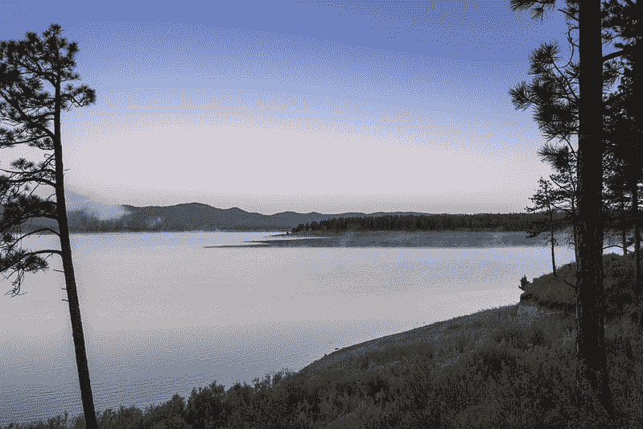
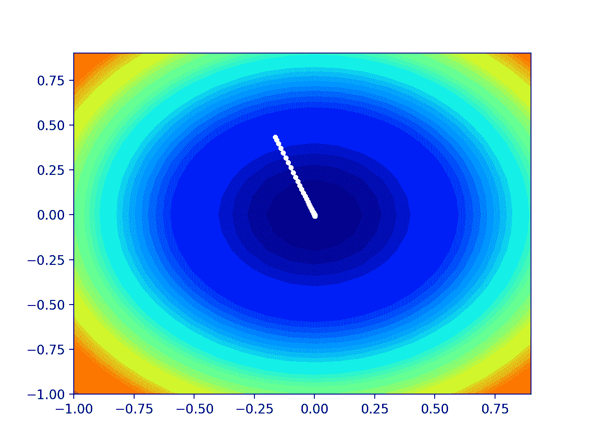

# 从零开始的 Nesterov 动量梯度下降

> 原文：<https://machinelearningmastery.com/gradient-descent-with-nesterov-momentum-from-scratch/>

最后更新于 2021 年 10 月 12 日

梯度下降是一种优化算法，它遵循目标函数的负梯度来定位函数的最小值。

梯度下降的一个限制是，如果目标函数返回有噪声的梯度，它会卡在平坦区域或反弹。动量是一种加速搜索进程的方法，可以掠过平坦区域并平滑有弹性的梯度。

在某些情况下，动量的加速会导致搜索错过或超过盆地或山谷底部的最小值。**Nesterov 动量**是动量的延伸，涉及计算搜索空间中投影位置梯度的衰减移动平均值，而不是实际位置本身。

这具有利用动量加速优势的效果，同时允许搜索在接近最优值时减慢，并降低错过或超过最优值的可能性。

在本教程中，您将发现如何从零开始使用 Nesterov 动量开发梯度下降优化算法。

完成本教程后，您将知道:

*   梯度下降是一种优化算法，它使用目标函数的梯度来导航搜索空间。
*   对梯度下降优化算法进行扩展，增加 Nesterov 动量，可以加快算法的收敛速度。
*   如何从零开始实现 Nesterov 动量优化算法，并将其应用于目标函数和评估结果。

**用我的新书[机器学习优化](https://machinelearningmastery.com/optimization-for-machine-learning/)启动你的项目**，包括*分步教程*和所有示例的 *Python 源代码*文件。

Let’s get started.

从零开始的 Nesterov 动量梯度下降
照片由[邦妮·莫兰](https://www.flickr.com/photos/icetsarina/50048053122/)拍摄，版权所有。

## 教程概述

本教程分为三个部分；它们是:

1.  梯度下降
2.  Nesterov 动量
3.  Nesterov 动量梯度下降
    1.  二维测试问题
    2.  具有 Nesterov 动量的梯度下降优化
    3.  Nesterov 动量的可视化

## 梯度下降

[梯度下降](https://en.wikipedia.org/wiki/Gradient_descent)是一种优化算法。

它在技术上被称为一阶优化算法，因为它明确地利用了目标函数的一阶导数。

> 一阶方法依赖于梯度信息来帮助指导搜索最小值…

—第 69 页，[优化算法](https://amzn.to/39KZSQn)，2019。

一阶导数，或简称为“[导数”](https://en.wikipedia.org/wiki/Derivative)，是目标函数在特定点的变化率或斜率，例如对于特定输入。

如果目标函数有多个输入变量，它被称为多元函数，输入变量可以被认为是一个向量。反过来，多元目标函数的导数也可以作为向量，通常称为“[梯度](https://en.wikipedia.org/wiki/Gradient)”

*   **梯度**:多元目标函数的一阶导数。

对于特定输入，导数或梯度指向目标函数最陡上升的方向。

梯度下降是指一种最小化优化算法，它遵循目标函数梯度下降的负值来定位函数的最小值。

梯度下降算法需要一个正在优化的目标函数和目标函数的导数函数。目标函数 f()返回给定输入集的得分，导数函数 f '()给出给定输入集的目标函数的导数。

梯度下降算法要求问题中有一个起点(x)，例如输入空间中随机选择的一个点。

然后计算导数，并在输入空间中采取一个步骤，该步骤预计会导致目标函数的下坡运动，假设我们正在最小化目标函数。

下坡移动是通过首先计算在输入空间中移动多远来实现的，计算方法是步长(称为 alpha 或学习率)乘以梯度。然后从当前点减去这一点，确保我们逆着梯度或目标函数向下移动。

*   x(t+1)= x(t)–步长* f'(x(t))

给定点处的目标函数越陡，梯度的幅度就越大，反过来，搜索空间中的步长就越大。使用步长超参数来缩放所采取的步长。

*   **步长(*α*)**:超参数，控制算法每次迭代在搜索空间中逆着梯度移动多远。

如果步长过小，搜索空间内的移动会很小，搜索时间会很长。如果步长过大，搜索可能会绕过搜索空间并跳过 optima。

现在我们已经熟悉了梯度下降优化算法，让我们来看看 Nesterov 动量。

## Nesterov 动量

Nesterov 动量是梯度下降优化算法的扩展。

Yuri nesterov 在他 1983 年发表的题为“[一种求解具有收敛速度 O(1/k^2 的凸规划问题的方法”](http://mpawankumar.info/teaching/cdt-big-data/nesterov83.pdf)的论文中描述了这种方法(并以其命名)

[Ilya Sutskever](https://en.wikipedia.org/wiki/Ilya_Sutskever) 等人负责推广 Nesterov 动量在具有随机梯度下降的神经网络的训练中的应用，这在他们 2013 年的论文“[关于初始化和动量在深度学习中的重要性](http://proceedings.mlr.press/v28/sutskever13.html)中进行了描述。”他们称这种方法为“T4”Nesterov 加速梯度“T5”，简称 NAG。

Nesterov 动量就像更传统的动量一样，只是更新是使用预测更新的偏导数而不是当前变量值的导数来执行的。

> 虽然 NAG 通常不被认为是一种动量，但它确实与经典动量密切相关，只是在速度矢量的精确更新上有所不同…

——[论深度学习中初始化和动量的重要性](http://proceedings.mlr.press/v28/sutskever13.html)，2013。

传统的动量涉及保持一个额外的变量，该变量代表对该变量执行的最后一次更新，即过去梯度的指数衰减移动平均值。

> 动量算法累积过去梯度的指数衰减移动平均值，并继续向它们的方向移动。

—第 296 页，[深度学习](https://amzn.to/3qSk3C2)，2016。

该变量的最后一次更新或最后一次更改随后被添加到由“*动量*”超参数缩放的变量中，该超参数控制最后一次更改的添加量，例如 90%为 0.9%。

按照两个步骤来考虑这个更新更容易，例如，使用偏导数计算变量的变化，然后计算变量的新值。

*   变化(t+1) =(动量*变化(t))–(步长* f'(x(t)))
*   x(t+1) = x(t) +变化(t+1)

我们可以把动量想象成一个向下滚动的球，即使在有小山丘的情况下，它也会加速并继续朝着同一个方向前进。

> 动量可以解释为一个球沿着几乎水平的斜面滚下。当重力使球加速时，球自然聚集动量，就像梯度使动量在这种下降方法中积累一样。

—第 75 页，[优化算法](https://amzn.to/39KZSQn)，2019。

动量的一个问题是，加速度有时会导致搜索超过盆地底部或谷底的最小值。

Nesterov 动量可以被认为是对动量的一种修正，以克服这个超越最小值的问题。

它包括首先使用上次迭代的变化计算变量的投影位置，并在计算变量的新位置时使用投影位置的导数。

计算投影位置的梯度就像是对已经累积的加速度的校正因子。

> 利用 Nesterov 动量，在应用当前速度之后评估梯度。因此，我们可以把 Nesterov 动量解释为试图给标准动量法增加一个修正因子。

—第 300 页，[深度学习](https://amzn.to/3qSk3C2)，2016。

Nesterov 动量很容易从四个步骤来思考这个问题:

*   1.投影解决方案的位置。
*   2.计算投影的梯度。
*   3.用偏导数计算变量的变化。
*   4.更新变量。

让我们更详细地了解这些步骤。

首先，使用在算法的最后迭代中计算的变化来计算整个解的投影位置。

*   投影(t+1) = x(t) +(动量*变化(t))

然后我们可以计算这个新位置的梯度。

*   梯度(t+1)= f’(投影(t+1))

现在我们可以使用投影的梯度计算每个变量的新位置，首先通过计算每个变量的变化。

*   变化(t+1) =(动量*变化(t))–(步长*梯度(t+1))

最后，使用计算出的变化计算每个变量的新值。

*   x(t+1) = x(t) +变化(t+1)

在更一般的凸优化领域，已知 Nesterov 动量可以提高优化算法的收敛速度(例如，减少寻找解所需的迭代次数)。

> 与动量法一样，NAG 是一种一阶优化方法，在某些情况下比梯度下降法具有更好的收敛速度保证。

——[论深度学习中初始化和动量的重要性](http://proceedings.mlr.press/v28/sutskever13.html)，2013。

尽管该技术在训练神经网络方面是有效的，但是它可能没有加速收敛的相同的一般效果。

> 不幸的是，在随机梯度的情况下，Nesterov 动量并不能提高收敛速度。

—第 300 页，[深度学习](https://amzn.to/3qSk3C2)，2016。

现在我们已经熟悉了 Nesterov 动量算法，让我们探索如何实现它并评估它的表现。

## Nesterov 动量梯度下降

在本节中，我们将探索如何利用 Nesterov 动量实现梯度下降优化算法。

### 二维测试问题

首先，让我们定义一个优化函数。

我们将使用一个简单的二维函数，它对每个维度的输入进行平方，并定义从-1.0 到 1.0 的有效输入范围。

下面的 objective()函数实现了这个功能。

```py
# objective function
def objective(x, y):
	return x**2.0 + y**2.0
```

我们可以创建数据集的三维图，以获得对响应表面曲率的感觉。

下面列出了绘制目标函数的完整示例。

```py
# 3d plot of the test function
from numpy import arange
from numpy import meshgrid
from matplotlib import pyplot

# objective function
def objective(x, y):
	return x**2.0 + y**2.0

# define range for input
r_min, r_max = -1.0, 1.0
# sample input range uniformly at 0.1 increments
xaxis = arange(r_min, r_max, 0.1)
yaxis = arange(r_min, r_max, 0.1)
# create a mesh from the axis
x, y = meshgrid(xaxis, yaxis)
# compute targets
results = objective(x, y)
# create a surface plot with the jet color scheme
figure = pyplot.figure()
axis = figure.gca(projection='3d')
axis.plot_surface(x, y, results, cmap='jet')
# show the plot
pyplot.show()
```

运行该示例会创建目标函数的三维表面图。

我们可以看到熟悉的碗形，全局最小值在 f(0，0) = 0。


测试目标函数的三维图

我们还可以创建函数的二维图。这将有助于我们以后绘制搜索进度。

以下示例创建了目标函数的等高线图。

```py
# contour plot of the test function
from numpy import asarray
from numpy import arange
from numpy import meshgrid
from matplotlib import pyplot

# objective function
def objective(x, y):
	return x**2.0 + y**2.0

# define range for input
bounds = asarray([[-1.0, 1.0], [-1.0, 1.0]])
# sample input range uniformly at 0.1 increments
xaxis = arange(bounds[0,0], bounds[0,1], 0.1)
yaxis = arange(bounds[1,0], bounds[1,1], 0.1)
# create a mesh from the axis
x, y = meshgrid(xaxis, yaxis)
# compute targets
results = objective(x, y)
# create a filled contour plot with 50 levels and jet color scheme
pyplot.contourf(x, y, results, levels=50, cmap='jet')
# show the plot
pyplot.show()
```

运行该示例会创建目标函数的二维等高线图。

我们可以看到碗的形状被压缩成带有颜色梯度的轮廓。我们将使用此图来绘制搜索过程中探索的具体点。


测试目标函数的二维等高线图

现在我们有了一个测试目标函数，让我们看看如何实现 Nesterov 动量优化算法。

### 具有 Nesterov 动量的梯度下降优化

我们可以将带有 Nesterov 动量的梯度下降应用于测试问题。

首先，我们需要一个函数来计算这个函数的导数。

x^2 的导数在每个维度上都是 x * 2，下面的*导数()*函数实现了这一点。

```py
# derivative of objective function
def derivative(x, y):
	return asarray([x * 2.0, y * 2.0])
```

接下来，我们可以实现梯度下降优化。

首先，我们可以在问题的边界中选择一个随机点作为搜索的起点。

这假设我们有一个定义搜索范围的数组，每个维度有一行，第一列定义维度的最小值，第二列定义维度的最大值。

```py
...
# generate an initial point
solution = bounds[:, 0] + rand(len(bounds)) * (bounds[:, 1] - bounds[:, 0])
```

接下来，我们需要从当前位置计算投影点，并计算其导数。

```py
...
# calculate the projected solution
projected = [solution[i] + momentum * change[i] for i in range(solution.shape[0])]
# calculate the gradient for the projection
gradient = derivative(projected[0], projected[1])
```

然后我们可以创建新的解决方案，一次一个变量。

首先，使用偏导数和学习率以及变量上一次变化的动量来计算变量的变化。该变化被存储用于算法的下一次迭代。然后，该变化用于计算变量的新值。

```py
...
# build a solution one variable at a time
new_solution = list()
for i in range(solution.shape[0]):
	# calculate the change
	change[i] = (momentum * change[i]) - step_size * gradient[i]
	# calculate the new position in this variable
	value = solution[i] + change[i]
	# store this variable
	new_solution.append(value)
```

对目标函数的每个变量重复这个过程，然后对算法的每次迭代重复这个过程。

然后，可以使用*客观()*函数来评估这个新的解决方案，并且可以报告搜索的表现。

```py
...
# evaluate candidate point
solution = asarray(new_solution)
solution_eval = objective(solution[0], solution[1])
# report progress
print('>%d f(%s) = %.5f' % (it, solution, solution_eval))
```

就这样。

我们可以将所有这些联系到一个名为 *nesterov()* 的函数中，该函数采用目标函数和导数函数的名称，一个具有域边界和超参数值的数组，用于计算算法迭代总数、学习率和动量，并返回最终解及其评估。

下面列出了完整的功能。

```py
# gradient descent algorithm with nesterov momentum
def nesterov(objective, derivative, bounds, n_iter, step_size, momentum):
	# generate an initial point
	solution = bounds[:, 0] + rand(len(bounds)) * (bounds[:, 1] - bounds[:, 0])
	# list of changes made to each variable
	change = [0.0 for _ in range(bounds.shape[0])]
	# run the gradient descent
	for it in range(n_iter):
		# calculate the projected solution
		projected = [solution[i] + momentum * change[i] for i in range(solution.shape[0])]
		# calculate the gradient for the projection
		gradient = derivative(projected[0], projected[1])
		# build a solution one variable at a time
		new_solution = list()
		for i in range(solution.shape[0]):
			# calculate the change
			change[i] = (momentum * change[i]) - step_size * gradient[i]
			# calculate the new position in this variable
			value = solution[i] + change[i]
			# store this variable
			new_solution.append(value)
		# evaluate candidate point
		solution = asarray(new_solution)
		solution_eval = objective(solution[0], solution[1])
		# report progress
		print('>%d f(%s) = %.5f' % (it, solution, solution_eval))
	return [solution, solution_eval]
```

**注意**，为了可读性，我们特意使用了列表和命令式编码风格，而不是矢量化操作。请随意将该实现调整为使用 NumPy 数组的矢量化实现，以获得更好的表现。

然后我们可以定义我们的超参数，并调用 *nesterov()* 函数来优化我们的测试目标函数。

在这种情况下，我们将使用算法的 30 次迭代，学习率为 0.1，动量为 0.3。这些超参数值是经过一点点反复试验后发现的。

```py
...
# seed the pseudo random number generator
seed(1)
# define range for input
bounds = asarray([[-1.0, 1.0], [-1.0, 1.0]])
# define the total iterations
n_iter = 30
# define the step size
step_size = 0.1
# define momentum
momentum = 0.3
# perform the gradient descent search with nesterov momentum
best, score = nesterov(objective, derivative, bounds, n_iter, step_size, momentum)
print('Done!')
print('f(%s) = %f' % (best, score))
```

将所有这些联系在一起，下面列出了使用 Nesterov 动量进行梯度下降优化的完整示例。

```py
# gradient descent optimization with nesterov momentum for a two-dimensional test function
from math import sqrt
from numpy import asarray
from numpy.random import rand
from numpy.random import seed

# objective function
def objective(x, y):
	return x**2.0 + y**2.0

# derivative of objective function
def derivative(x, y):
	return asarray([x * 2.0, y * 2.0])

# gradient descent algorithm with nesterov momentum
def nesterov(objective, derivative, bounds, n_iter, step_size, momentum):
	# generate an initial point
	solution = bounds[:, 0] + rand(len(bounds)) * (bounds[:, 1] - bounds[:, 0])
	# list of changes made to each variable
	change = [0.0 for _ in range(bounds.shape[0])]
	# run the gradient descent
	for it in range(n_iter):
		# calculate the projected solution
		projected = [solution[i] + momentum * change[i] for i in range(solution.shape[0])]
		# calculate the gradient for the projection
		gradient = derivative(projected[0], projected[1])
		# build a solution one variable at a time
		new_solution = list()
		for i in range(solution.shape[0]):
			# calculate the change
			change[i] = (momentum * change[i]) - step_size * gradient[i]
			# calculate the new position in this variable
			value = solution[i] + change[i]
			# store this variable
			new_solution.append(value)
		# evaluate candidate point
		solution = asarray(new_solution)
		solution_eval = objective(solution[0], solution[1])
		# report progress
		print('>%d f(%s) = %.5f' % (it, solution, solution_eval))
	return [solution, solution_eval]

# seed the pseudo random number generator
seed(1)
# define range for input
bounds = asarray([[-1.0, 1.0], [-1.0, 1.0]])
# define the total iterations
n_iter = 30
# define the step size
step_size = 0.1
# define momentum
momentum = 0.3
# perform the gradient descent search with nesterov momentum
best, score = nesterov(objective, derivative, bounds, n_iter, step_size, momentum)
print('Done!')
print('f(%s) = %f' % (best, score))
```

运行该示例将带有 Nesterov 动量的优化算法应用于我们的测试问题，并报告算法每次迭代的搜索表现。

**注**:考虑到算法或评估程序的随机性，或数值准确率的差异，您的[结果可能会有所不同](https://machinelearningmastery.com/different-results-each-time-in-machine-learning/)。考虑运行该示例几次，并比较平均结果。

在这种情况下，我们可以看到，在大约 15 次搜索迭代后，找到了一个接近最优的解，输入值接近 0.0 和 0.0，评估为 0.0。

```py
>0 f([-0.13276479 0.35251919]) = 0.14190
>1 f([-0.09824595 0.2608642 ]) = 0.07770
>2 f([-0.07031223 0.18669416]) = 0.03980
>3 f([-0.0495457 0.13155452]) = 0.01976
>4 f([-0.03465259 0.0920101 ]) = 0.00967
>5 f([-0.02414772 0.06411742]) = 0.00469
>6 f([-0.01679701 0.04459969]) = 0.00227
>7 f([-0.01167344 0.0309955 ]) = 0.00110
>8 f([-0.00810909 0.02153139]) = 0.00053
>9 f([-0.00563183 0.01495373]) = 0.00026
>10 f([-0.00391092 0.01038434]) = 0.00012
>11 f([-0.00271572 0.00721082]) = 0.00006
>12 f([-0.00188573 0.00500701]) = 0.00003
>13 f([-0.00130938 0.0034767 ]) = 0.00001
>14 f([-0.00090918 0.00241408]) = 0.00001
>15 f([-0.0006313 0.00167624]) = 0.00000
>16 f([-0.00043835 0.00116391]) = 0.00000
>17 f([-0.00030437 0.00080817]) = 0.00000
>18 f([-0.00021134 0.00056116]) = 0.00000
>19 f([-0.00014675 0.00038964]) = 0.00000
>20 f([-0.00010189 0.00027055]) = 0.00000
>21 f([-7.07505806e-05 1.87858067e-04]) = 0.00000
>22 f([-4.91260884e-05 1.30440372e-04]) = 0.00000
>23 f([-3.41109926e-05 9.05720503e-05]) = 0.00000
>24 f([-2.36851711e-05 6.28892431e-05]) = 0.00000
>25 f([-1.64459397e-05 4.36675208e-05]) = 0.00000
>26 f([-1.14193362e-05 3.03208033e-05]) = 0.00000
>27 f([-7.92908415e-06 2.10534304e-05]) = 0.00000
>28 f([-5.50560682e-06 1.46185748e-05]) = 0.00000
>29 f([-3.82285090e-06 1.01504945e-05]) = 0.00000
Done!
f([-3.82285090e-06 1.01504945e-05]) = 0.000000
```

### Nesterov 动量的可视化

我们可以在该域的等高线图上绘制 Nesterov 动量搜索的进度。

这可以为算法迭代过程中的搜索进度提供直觉。

我们必须更新 *nesterov()* 函数，以维护搜索过程中找到的所有解决方案的列表，然后在搜索结束时返回该列表。

下面列出了带有这些更改的功能的更新版本。

```py
# gradient descent algorithm with nesterov momentum
def nesterov(objective, derivative, bounds, n_iter, step_size, momentum):
	# track all solutions
	solutions = list()
	# generate an initial point
	solution = bounds[:, 0] + rand(len(bounds)) * (bounds[:, 1] - bounds[:, 0])
	# list of changes made to each variable
	change = [0.0 for _ in range(bounds.shape[0])]
	# run the gradient descent
	for it in range(n_iter):
		# calculate the projected solution
		projected = [solution[i] + momentum * change[i] for i in range(solution.shape[0])]
		# calculate the gradient for the projection
		gradient = derivative(projected[0], projected[1])
		# build a solution one variable at a time
		new_solution = list()
		for i in range(solution.shape[0]):
			# calculate the change
			change[i] = (momentum * change[i]) - step_size * gradient[i]
			# calculate the new position in this variable
			value = solution[i] + change[i]
			# store this variable
			new_solution.append(value)
		# store the new solution
		solution = asarray(new_solution)
		solutions.append(solution)
		# evaluate candidate point
		solution_eval = objective(solution[0], solution[1])
		# report progress
		print('>%d f(%s) = %.5f' % (it, solution, solution_eval))
	return solutions
```

然后，我们可以像以前一样执行搜索，这次检索解决方案列表，而不是最佳最终解决方案。

```py
...
# seed the pseudo random number generator
seed(1)
# define range for input
bounds = asarray([[-1.0, 1.0], [-1.0, 1.0]])
# define the total iterations
n_iter = 50
# define the step size
step_size = 0.01
# define momentum
momentum = 0.8
# perform the gradient descent search with nesterov momentum
solutions = nesterov(objective, derivative, bounds, n_iter, step_size, momentum)
```

然后，我们可以像以前一样创建目标函数的等高线图。

```py
...
# sample input range uniformly at 0.1 increments
xaxis = arange(bounds[0,0], bounds[0,1], 0.1)
yaxis = arange(bounds[1,0], bounds[1,1], 0.1)
# create a mesh from the axis
x, y = meshgrid(xaxis, yaxis)
# compute targets
results = objective(x, y)
# create a filled contour plot with 50 levels and jet color scheme
pyplot.contourf(x, y, results, levels=50, cmap='jet')
```

最后，我们可以将搜索过程中找到的每个解决方案绘制成由一条线连接的白点。

```py
...
# plot the sample as black circles
solutions = asarray(solutions)
pyplot.plot(solutions[:, 0], solutions[:, 1], '.-', color='w')
```

将所有这些联系在一起，下面列出了对测试问题执行 Nesterov 动量优化并将结果绘制在等高线图上的完整示例。

```py
# example of plotting the nesterov momentum search on a contour plot of the test function
from math import sqrt
from numpy import asarray
from numpy import arange
from numpy.random import rand
from numpy.random import seed
from numpy import meshgrid
from matplotlib import pyplot
from mpl_toolkits.mplot3d import Axes3D

# objective function
def objective(x, y):
	return x**2.0 + y**2.0

# derivative of objective function
def derivative(x, y):
	return asarray([x * 2.0, y * 2.0])

# gradient descent algorithm with nesterov momentum
def nesterov(objective, derivative, bounds, n_iter, step_size, momentum):
	# track all solutions
	solutions = list()
	# generate an initial point
	solution = bounds[:, 0] + rand(len(bounds)) * (bounds[:, 1] - bounds[:, 0])
	# list of changes made to each variable
	change = [0.0 for _ in range(bounds.shape[0])]
	# run the gradient descent
	for it in range(n_iter):
		# calculate the projected solution
		projected = [solution[i] + momentum * change[i] for i in range(solution.shape[0])]
		# calculate the gradient for the projection
		gradient = derivative(projected[0], projected[1])
		# build a solution one variable at a time
		new_solution = list()
		for i in range(solution.shape[0]):
			# calculate the change
			change[i] = (momentum * change[i]) - step_size * gradient[i]
			# calculate the new position in this variable
			value = solution[i] + change[i]
			# store this variable
			new_solution.append(value)
		# store the new solution
		solution = asarray(new_solution)
		solutions.append(solution)
		# evaluate candidate point
		solution_eval = objective(solution[0], solution[1])
		# report progress
		print('>%d f(%s) = %.5f' % (it, solution, solution_eval))
	return solutions

# seed the pseudo random number generator
seed(1)
# define range for input
bounds = asarray([[-1.0, 1.0], [-1.0, 1.0]])
# define the total iterations
n_iter = 50
# define the step size
step_size = 0.01
# define momentum
momentum = 0.8
# perform the gradient descent search with nesterov momentum
solutions = nesterov(objective, derivative, bounds, n_iter, step_size, momentum)
# sample input range uniformly at 0.1 increments
xaxis = arange(bounds[0,0], bounds[0,1], 0.1)
yaxis = arange(bounds[1,0], bounds[1,1], 0.1)
# create a mesh from the axis
x, y = meshgrid(xaxis, yaxis)
# compute targets
results = objective(x, y)
# create a filled contour plot with 50 levels and jet color scheme
pyplot.contourf(x, y, results, levels=50, cmap='jet')
# plot the sample as black circles
solutions = asarray(solutions)
pyplot.plot(solutions[:, 0], solutions[:, 1], '.-', color='w')
# show the plot
pyplot.show()
```

运行该示例会像以前一样执行搜索，只是在这种情况下，会创建目标函数的等高线图。

在这种情况下，我们可以看到，搜索过程中找到的每个解决方案都显示一个白点，从 optima 上方开始，逐渐靠近图中心的 optima。



显示 Nesterov 动量搜索结果的测试目标函数等高线图

## 进一步阅读

如果您想更深入地了解这个主题，本节将提供更多资源。

### 报纸

*   [一种求解具有收敛速度的凸规划问题的方法 O(1/k^2)](http://mpawankumar.info/teaching/cdt-big-data/nesterov83.pdf) ，1983。
*   [论深度学习中初始化和动量的重要性](http://proceedings.mlr.press/v28/sutskever13.html)，2013。

### 书

*   [优化算法](https://amzn.to/39KZSQn)，2019。
*   [深度学习](https://amzn.to/3qSk3C2)，2016 年。

### 蜜蜂

*   num py . random . rand API。
*   num py . asar ray API。
*   [Matplotlib API](https://matplotlib.org/api/pyplot_api.html) 。

### 文章

*   [梯度下降，维基百科](https://en.wikipedia.org/wiki/Gradient_descent)。
*   [随机梯度下降，维基百科](https://en.wikipedia.org/wiki/Stochastic_gradient_descent)。
*   [梯度下降优化算法概述](https://ruder.io/optimizing-gradient-descent/index.html)，2016。

## 摘要

在本教程中，您发现了如何利用 Nesterov 动量从零开始开发梯度下降优化。

具体来说，您了解到:

*   梯度下降是一种优化算法，它使用目标函数的梯度来导航搜索空间。
*   对梯度下降优化算法进行扩展，增加 Nesterov 动量，可以加快算法的收敛速度。
*   如何从零开始实现 Nesterov 动量优化算法，并将其应用于目标函数和评估结果。

**你有什么问题吗？**
在下面的评论中提问，我会尽力回答。