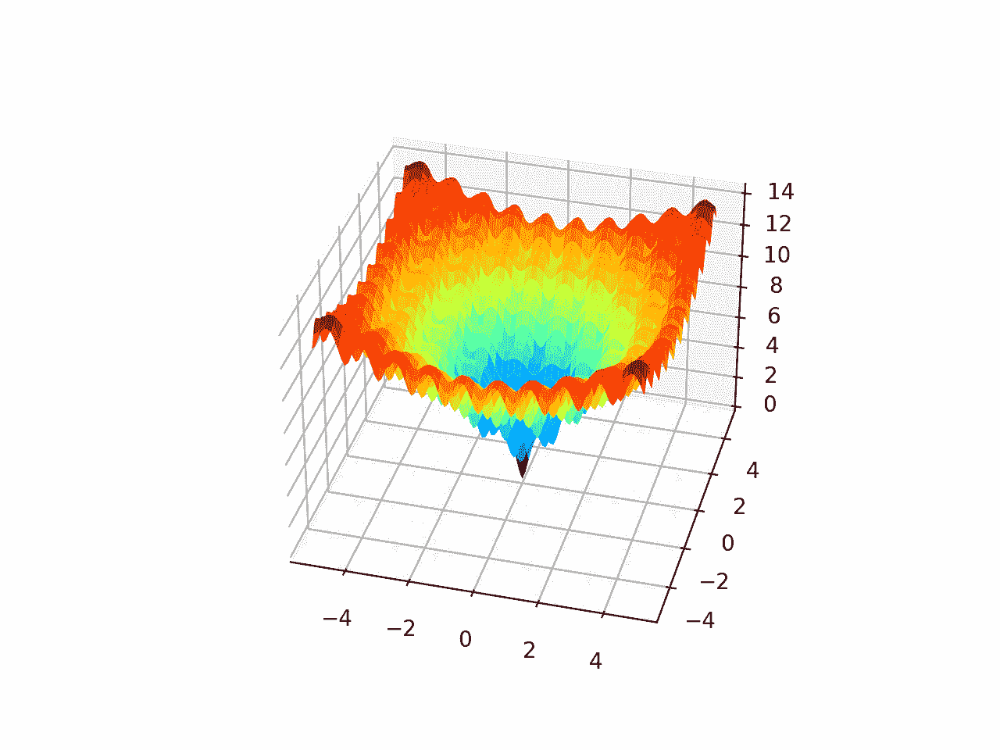

# Python 中从零开始的迭代式局部搜索

> 原文：<https://machinelearningmastery.com/iterated-local-search-from-scratch-in-python/>

最后更新于 2021 年 10 月 12 日

**迭代局部搜索**是一种随机全局优化算法。

它包括将本地搜索算法重复应用于先前找到的好解决方案的修改版本。这样，它就像一个随机爬山的聪明版本，随机重启算法。

该算法背后的直觉是，随机重启可以帮助定位问题中的许多局部最优解，并且更好的局部最优解通常接近其他局部最优解。因此，对现有局部最优值的适度扰动可以找到优化问题的更好甚至最好的解。

在本教程中，您将发现如何从零开始实现迭代局部搜索算法。

完成本教程后，您将知道:

*   迭代局部搜索是一种随机全局搜索优化算法，它是随机重新启动的随机爬山的更智能版本。
*   如何实现从零开始随机重启的随机爬山？
*   如何实现迭代局部搜索算法并将其应用于非线性目标函数？

**用我的新书[机器学习优化](https://machinelearningmastery.com/optimization-for-machine-learning/)启动你的项目**，包括*分步教程*和所有示例的 *Python 源代码*文件。

Let’s get started.

在 Python 中从零开始迭代本地搜索
图片由 [Susanne Nilsson](https://www.flickr.com/photos/infomastern/22561128652/) 提供，保留部分权利。

## 教程概述

本教程分为五个部分；它们是:

1.  什么是迭代局部搜索
2.  阿克利目标函数
3.  随机爬山算法
4.  随机重新开始的随机爬山
5.  迭代局部搜索算法

## 什么是迭代局部搜索

[迭代局部搜索](https://en.wikipedia.org/wiki/Iterated_local_search)，简称 ILS，是一种随机全局搜索优化算法。

它与随机爬坡和随机开始的随机爬坡有关，或者是随机爬坡的延伸。

> 本质上，这是一个更聪明的随机重启爬山版本。

—第 26 页，[元试探法精要](https://amzn.to/37mn7PN)，2011。

[随机爬山](https://en.wikipedia.org/wiki/Hill_climbing)是一种局部搜索算法，它涉及对现有解进行随机修改，并且只有当修改产生比当前工作解更好的结果时才接受修改。

局部搜索算法通常会陷入局部最优。解决这个问题的一种方法是从一个新的随机选择的起点重新开始搜索。重启过程可以执行多次，并且可以在固定数量的功能评估之后或者如果对于给定数量的算法迭代没有看到进一步的改进，则可以触发重启过程。这种算法被称为随机重新开始的随机爬山。

> 改进本地搜索发现的成本的最简单的可能性是从另一个起点重复搜索。

—第 132 页，[元启发式手册](https://amzn.to/2IIq0Qt)，2019 年第 3 版。

迭代局部搜索类似于随机重新开始的随机爬山，除了不是为每次重新开始选择随机起点，而是基于在更广泛的搜索期间迄今为止找到的最佳点的修改版本来选择点。

到目前为止，最佳解的扰动就像是搜索空间中一个新区域的大跳跃，而随机爬山算法产生的扰动要小得多，局限于搜索空间的特定区域。

> 这里的启发是，你经常可以在你目前所处的位置附近找到更好的局部最优解，并且以这种方式从局部最优走到局部最优通常比完全随机地尝试新的位置要好。

—第 26 页，[元试探法精要](https://amzn.to/37mn7PN)，2011。

这允许在两个级别执行搜索。爬山算法是局部搜索，以最大限度地利用搜索空间的特定候选解或区域，重启方法允许探索搜索空间的不同区域。

通过这种方式，迭代局部搜索算法探索搜索空间中的多个局部最优解，增加了定位全局最优解的可能性。

迭代局部搜索被提出用于组合优化问题，例如旅行商问题，尽管它可以通过在搜索空间中使用不同的步长应用于连续函数优化:用于爬山的较小步长和用于随机重启的较大步长。

现在我们已经熟悉了迭代局部搜索算法，让我们来探索如何从零开始实现该算法。

## 阿克利目标函数

首先，让我们定义一个通道优化问题，作为实现迭代局部搜索算法的基础。

[阿克利函数](https://en.wikipedia.org/wiki/Ackley_function)是多模态目标函数的一个例子，它有一个全局最优解和多个局部最优解，局部搜索可能会陷入其中。

因此，需要一种全局优化技术。它是一个二维目标函数，其全局最优值为[0，0]，计算结果为 0.0。

下面的示例实现了 Ackley，并创建了一个显示全局最优值和多个局部最优值的三维曲面图。

```py
# ackley multimodal function
from numpy import arange
from numpy import exp
from numpy import sqrt
from numpy import cos
from numpy import e
from numpy import pi
from numpy import meshgrid
from matplotlib import pyplot
from mpl_toolkits.mplot3d import Axes3D

# objective function
def objective(x, y):
	return -20.0 * exp(-0.2 * sqrt(0.5 * (x**2 + y**2))) - exp(0.5 * (cos(2 * pi * x) + cos(2 * pi * y))) + e + 20

# define range for input
r_min, r_max = -5.0, 5.0
# sample input range uniformly at 0.1 increments
xaxis = arange(r_min, r_max, 0.1)
yaxis = arange(r_min, r_max, 0.1)
# create a mesh from the axis
x, y = meshgrid(xaxis, yaxis)
# compute targets
results = objective(x, y)
# create a surface plot with the jet color scheme
figure = pyplot.figure()
axis = figure.gca(projection='3d')
axis.plot_surface(x, y, results, cmap='jet')
# show the plot
pyplot.show()
```

运行该示例会创建阿克利函数的曲面图，显示大量的局部最优值。



阿克利多峰函数的三维表面图

我们将以此为基础实现和比较一个简单的随机爬山算法，随机爬山与随机重启，最后迭代局部搜索。

我们预计随机爬山算法很容易陷入局部极小值。我们期望重新开始的随机爬山能够找到许多局部极小值，如果配置得当，我们期望迭代局部搜索在这个问题上比任何一种方法都表现得更好。

## 随机爬山算法

迭代局部搜索算法的核心是局部搜索，在本教程中，我们将为此目的使用随机爬山算法。

随机爬山算法包括首先生成随机起点和当前工作解，然后生成当前工作解的扰动版本，如果它们优于当前工作解，则接受它们。

假设我们正在处理一个连续优化问题，解是由目标函数评估的值的向量，在这种情况下，是二维空间中由-5 和 5 界定的点。

我们可以通过对具有均匀概率分布的搜索空间进行采样来生成随机点。例如:

```py
...
# generate a random point in the search space
solution = bounds[:, 0] + rand(len(bounds)) * (bounds[:, 1] - bounds[:, 0])
```

我们可以使用高斯概率分布生成当前工作解的扰动版本，该概率分布具有解中当前值的平均值和由超参数控制的标准偏差，该超参数控制允许搜索从当前工作解探索多远。

我们将这个超参数称为“*步长*”，例如:

```py
...
# generate a perturbed version of a current working solution
candidate = solution + randn(len(bounds)) * step_size
```

重要的是，我们必须检查生成的解决方案是否在搜索空间内。

这可以通过名为 *in_bounds()* 的自定义函数来实现，该函数获取候选解和搜索空间的边界，如果该点在搜索空间中，则返回真，否则返回假*。*

```py
# check if a point is within the bounds of the search
def in_bounds(point, bounds):
	# enumerate all dimensions of the point
	for d in range(len(bounds)):
		# check if out of bounds for this dimension
		if point[d] < bounds[d, 0] or point[d] > bounds[d, 1]:
			return False
	return True
```

然后可以在爬山过程中调用该函数，以确认新的点在搜索空间的边界内，如果不在，则可以生成新的点。

将这些联系在一起，下面的函数*爬山()*实现了随机爬山局部搜索算法。它将目标函数的名称、问题的边界、迭代次数和步长作为参数，并返回最佳解及其评估。

```py
# hill climbing local search algorithm
def hillclimbing(objective, bounds, n_iterations, step_size):
	# generate an initial point
	solution = None
	while solution is None or not in_bounds(solution, bounds):
		solution = bounds[:, 0] + rand(len(bounds)) * (bounds[:, 1] - bounds[:, 0])
	# evaluate the initial point
	solution_eval = objective(solution)
	# run the hill climb
	for i in range(n_iterations):
		# take a step
		candidate = None
		while candidate is None or not in_bounds(candidate, bounds):
			candidate = solution + randn(len(bounds)) * step_size
		# evaluate candidate point
		candidte_eval = objective(candidate)
		# check if we should keep the new point
		if candidte_eval <= solution_eval:
			# store the new point
			solution, solution_eval = candidate, candidte_eval
			# report progress
			print('>%d f(%s) = %.5f' % (i, solution, solution_eval))
	return [solution, solution_eval]
```

我们可以在阿克利函数上测试这个算法。

我们将固定伪随机数发生器的种子，以确保每次运行代码时得到相同的结果。

该算法将运行 1000 次迭代，将使用 0.05 个单位的步长；这两个超参数都是经过一点点反复试验后选择的。

运行结束时，我们将报告找到的最佳解决方案。

```py
...
# seed the pseudorandom number generator
seed(1)
# define range for input
bounds = asarray([[-5.0, 5.0], [-5.0, 5.0]])
# define the total iterations
n_iterations = 1000
# define the maximum step size
step_size = 0.05
# perform the hill climbing search
best, score = hillclimbing(objective, bounds, n_iterations, step_size)
print('Done!')
print('f(%s) = %f' % (best, score))
```

下面列出了将随机爬山算法应用于阿克利目标函数的完整示例。

```py
# hill climbing search of the ackley objective function
from numpy import asarray
from numpy import exp
from numpy import sqrt
from numpy import cos
from numpy import e
from numpy import pi
from numpy.random import randn
from numpy.random import rand
from numpy.random import seed

# objective function
def objective(v):
	x, y = v
	return -20.0 * exp(-0.2 * sqrt(0.5 * (x**2 + y**2))) - exp(0.5 * (cos(2 * pi * x) + cos(2 * pi * y))) + e + 20

# check if a point is within the bounds of the search
def in_bounds(point, bounds):
	# enumerate all dimensions of the point
	for d in range(len(bounds)):
		# check if out of bounds for this dimension
		if point[d] < bounds[d, 0] or point[d] > bounds[d, 1]:
			return False
	return True

# hill climbing local search algorithm
def hillclimbing(objective, bounds, n_iterations, step_size):
	# generate an initial point
	solution = None
	while solution is None or not in_bounds(solution, bounds):
		solution = bounds[:, 0] + rand(len(bounds)) * (bounds[:, 1] - bounds[:, 0])
	# evaluate the initial point
	solution_eval = objective(solution)
	# run the hill climb
	for i in range(n_iterations):
		# take a step
		candidate = None
		while candidate is None or not in_bounds(candidate, bounds):
			candidate = solution + randn(len(bounds)) * step_size
		# evaluate candidate point
		candidte_eval = objective(candidate)
		# check if we should keep the new point
		if candidte_eval <= solution_eval:
			# store the new point
			solution, solution_eval = candidate, candidte_eval
			# report progress
			print('>%d f(%s) = %.5f' % (i, solution, solution_eval))
	return [solution, solution_eval]

# seed the pseudorandom number generator
seed(1)
# define range for input
bounds = asarray([[-5.0, 5.0], [-5.0, 5.0]])
# define the total iterations
n_iterations = 1000
# define the maximum step size
step_size = 0.05
# perform the hill climbing search
best, score = hillclimbing(objective, bounds, n_iterations, step_size)
print('Done!')
print('f(%s) = %f' % (best, score))
```

运行示例在目标函数上执行随机爬山搜索。搜索过程中发现的每个改进都会被报告，然后在搜索结束时报告最佳解决方案。

**注**:考虑到算法或评估程序的随机性，或数值准确率的差异，您的[结果可能会有所不同](https://machinelearningmastery.com/different-results-each-time-in-machine-learning/)。考虑运行该示例几次，并比较平均结果。

在这种情况下，我们可以在搜索过程中看到大约 13 个改进，最终的解约为 f(-0.981，1.965)，得到的评估值约为 5.381，与 f(0.0，0.0) = 0 相差甚远。

```py
>0 f([-0.85618854 2.1495965 ]) = 6.46986
>1 f([-0.81291816 2.03451957]) = 6.07149
>5 f([-0.82903902 2.01531685]) = 5.93526
>7 f([-0.83766043 1.97142393]) = 5.82047
>9 f([-0.89269139 2.02866012]) = 5.68283
>12 f([-0.8988359 1.98187164]) = 5.55899
>13 f([-0.9122303 2.00838942]) = 5.55566
>14 f([-0.94681334 1.98855174]) = 5.43024
>15 f([-0.98117198 1.94629146]) = 5.39010
>23 f([-0.97516403 1.97715161]) = 5.38735
>39 f([-0.98628044 1.96711371]) = 5.38241
>362 f([-0.9808789 1.96858459]) = 5.38233
>629 f([-0.98102417 1.96555308]) = 5.38194
Done!
f([-0.98102417 1.96555308]) = 5.381939
```

接下来，我们将修改算法以执行随机重启，并看看我们是否能获得更好的结果。

## 随机重新开始的随机爬山

具有随机重启的随机爬山算法包括重复运行随机爬山算法和跟踪找到的最佳解。

首先，我们修改*爬山()*函数，取搜索的起点，而不是随机生成。这将有助于我们稍后实现迭代局部搜索算法。

```py
# hill climbing local search algorithm
def hillclimbing(objective, bounds, n_iterations, step_size, start_pt):
	# store the initial point
	solution = start_pt
	# evaluate the initial point
	solution_eval = objective(solution)
	# run the hill climb
	for i in range(n_iterations):
		# take a step
		candidate = None
		while candidate is None or not in_bounds(candidate, bounds):
			candidate = solution + randn(len(bounds)) * step_size
		# evaluate candidate point
		candidte_eval = objective(candidate)
		# check if we should keep the new point
		if candidte_eval <= solution_eval:
			# store the new point
			solution, solution_eval = candidate, candidte_eval
	return [solution, solution_eval]
```

接下来，我们可以通过重复调用*爬山()*函数固定次数来实现随机重启算法。

每次通话，我们都会为爬山搜索生成一个新的随机选择的起点。

```py
...
# generate a random initial point for the search
start_pt = None
while start_pt is None or not in_bounds(start_pt, bounds):
	start_pt = bounds[:, 0] + rand(len(bounds)) * (bounds[:, 1] - bounds[:, 0])
# perform a stochastic hill climbing search
solution, solution_eval = hillclimbing(objective, bounds, n_iter, step_size, start_pt)
```

然后，我们可以检查结果，如果它比我们迄今为止看到的任何搜索结果都好，就保留它。

```py
...
# check for new best
if solution_eval < best_eval:
	best, best_eval = solution, solution_eval
print('Restart %d, best: f(%s) = %.5f' % (n, best, best_eval))
```

将这些联系在一起，*random _ restaults()*函数实现了随机重启的随机爬山算法。

```py
# hill climbing with random restarts algorithm
def random_restarts(objective, bounds, n_iter, step_size, n_restarts):
	best, best_eval = None, 1e+10
	# enumerate restarts
	for n in range(n_restarts):
		# generate a random initial point for the search
		start_pt = None
		while start_pt is None or not in_bounds(start_pt, bounds):
			start_pt = bounds[:, 0] + rand(len(bounds)) * (bounds[:, 1] - bounds[:, 0])
		# perform a stochastic hill climbing search
		solution, solution_eval = hillclimbing(objective, bounds, n_iter, step_size, start_pt)
		# check for new best
		if solution_eval < best_eval:
			best, best_eval = solution, solution_eval
			print('Restart %d, best: f(%s) = %.5f' % (n, best, best_eval))
	return [best, best_eval]
```

然后，我们可以将该算法应用于阿克利目标函数。在这种情况下，我们将随机重启的次数限制为 30 次，可以任意选择。

下面列出了完整的示例。

```py
# hill climbing search with random restarts of the ackley objective function
from numpy import asarray
from numpy import exp
from numpy import sqrt
from numpy import cos
from numpy import e
from numpy import pi
from numpy.random import randn
from numpy.random import rand
from numpy.random import seed

# objective function
def objective(v):
	x, y = v
	return -20.0 * exp(-0.2 * sqrt(0.5 * (x**2 + y**2))) - exp(0.5 * (cos(2 * pi * x) + cos(2 * pi * y))) + e + 20

# check if a point is within the bounds of the search
def in_bounds(point, bounds):
	# enumerate all dimensions of the point
	for d in range(len(bounds)):
		# check if out of bounds for this dimension
		if point[d] < bounds[d, 0] or point[d] > bounds[d, 1]:
			return False
	return True

# hill climbing local search algorithm
def hillclimbing(objective, bounds, n_iterations, step_size, start_pt):
	# store the initial point
	solution = start_pt
	# evaluate the initial point
	solution_eval = objective(solution)
	# run the hill climb
	for i in range(n_iterations):
		# take a step
		candidate = None
		while candidate is None or not in_bounds(candidate, bounds):
			candidate = solution + randn(len(bounds)) * step_size
		# evaluate candidate point
		candidte_eval = objective(candidate)
		# check if we should keep the new point
		if candidte_eval <= solution_eval:
			# store the new point
			solution, solution_eval = candidate, candidte_eval
	return [solution, solution_eval]

# hill climbing with random restarts algorithm
def random_restarts(objective, bounds, n_iter, step_size, n_restarts):
	best, best_eval = None, 1e+10
	# enumerate restarts
	for n in range(n_restarts):
		# generate a random initial point for the search
		start_pt = None
		while start_pt is None or not in_bounds(start_pt, bounds):
			start_pt = bounds[:, 0] + rand(len(bounds)) * (bounds[:, 1] - bounds[:, 0])
		# perform a stochastic hill climbing search
		solution, solution_eval = hillclimbing(objective, bounds, n_iter, step_size, start_pt)
		# check for new best
		if solution_eval < best_eval:
			best, best_eval = solution, solution_eval
			print('Restart %d, best: f(%s) = %.5f' % (n, best, best_eval))
	return [best, best_eval]

# seed the pseudorandom number generator
seed(1)
# define range for input
bounds = asarray([[-5.0, 5.0], [-5.0, 5.0]])
# define the total iterations
n_iter = 1000
# define the maximum step size
step_size = 0.05
# total number of random restarts
n_restarts = 30
# perform the hill climbing search
best, score = random_restarts(objective, bounds, n_iter, step_size, n_restarts)
print('Done!')
print('f(%s) = %f' % (best, score))
```

运行该示例将执行随机爬山，随机重新开始搜索阿克利目标函数。每次发现改进的整体解决方案时，都会进行报告，并总结通过搜索找到的最终最佳解决方案。

**注**:考虑到算法或评估程序的随机性，或数值准确率的差异，您的[结果可能会有所不同](https://machinelearningmastery.com/different-results-each-time-in-machine-learning/)。考虑运行该示例几次，并比较平均结果。

在这种情况下，我们可以在搜索过程中看到三个改进，并且找到的最佳解决方案大约是 f(0.002，0.002)，其评估为大约 0.009，这比爬山算法的单次运行好得多。

```py
Restart 0, best: f([-0.98102417 1.96555308]) = 5.38194
Restart 2, best: f([1.96522236 0.98120013]) = 5.38191
Restart 4, best: f([0.00223194 0.00258853]) = 0.00998
Done!
f([0.00223194 0.00258853]) = 0.009978
```

接下来，让我们看看如何实现迭代局部搜索算法。

## 迭代局部搜索算法

迭代局部搜索算法是随机爬山和随机重启算法的改进版本。

重要的区别在于，随机爬山算法的每次应用的起点是迄今为止找到的最佳点的扰动版本。

我们可以使用*random _ Reuters()*函数作为起点来实现这个算法。每次重启迭代，我们可以生成一个到目前为止找到的最佳解决方案的修改版本，而不是一个随机的起点。

这可以通过使用步长超参数来实现，就像随机爬山器中使用的一样。在这种情况下，考虑到在搜索空间中需要更大的扰动，将使用更大的步长值。

```py
...
# generate an initial point as a perturbed version of the last best
start_pt = None
while start_pt is None or not in_bounds(start_pt, bounds):
	start_pt = best + randn(len(bounds)) * p_size
```

将这些联系在一起，下面定义了*迭代 _ 局部 _ 搜索()*函数。

```py
# iterated local search algorithm
def iterated_local_search(objective, bounds, n_iter, step_size, n_restarts, p_size):
	# define starting point
	best = None
	while best is None or not in_bounds(best, bounds):
		best = bounds[:, 0] + rand(len(bounds)) * (bounds[:, 1] - bounds[:, 0])
	# evaluate current best point
	best_eval = objective(best)
	# enumerate restarts
	for n in range(n_restarts):
		# generate an initial point as a perturbed version of the last best
		start_pt = None
		while start_pt is None or not in_bounds(start_pt, bounds):
			start_pt = best + randn(len(bounds)) * p_size
		# perform a stochastic hill climbing search
		solution, solution_eval = hillclimbing(objective, bounds, n_iter, step_size, start_pt)
		# check for new best
		if solution_eval < best_eval:
			best, best_eval = solution, solution_eval
			print('Restart %d, best: f(%s) = %.5f' % (n, best, best_eval))
	return [best, best_eval]
```

然后，我们可以将该算法应用于阿克利目标函数。在这种情况下，我们将使用一个更大的步长值 1.0 来进行随机重启，这是在一点点反复试验后选择的。

下面列出了完整的示例。

```py
# iterated local search of the ackley objective function
from numpy import asarray
from numpy import exp
from numpy import sqrt
from numpy import cos
from numpy import e
from numpy import pi
from numpy.random import randn
from numpy.random import rand
from numpy.random import seed

# objective function
def objective(v):
	x, y = v
	return -20.0 * exp(-0.2 * sqrt(0.5 * (x**2 + y**2))) - exp(0.5 * (cos(2 * pi * x) + cos(2 * pi * y))) + e + 20

# check if a point is within the bounds of the search
def in_bounds(point, bounds):
	# enumerate all dimensions of the point
	for d in range(len(bounds)):
		# check if out of bounds for this dimension
		if point[d] < bounds[d, 0] or point[d] > bounds[d, 1]:
			return False
	return True

# hill climbing local search algorithm
def hillclimbing(objective, bounds, n_iterations, step_size, start_pt):
	# store the initial point
	solution = start_pt
	# evaluate the initial point
	solution_eval = objective(solution)
	# run the hill climb
	for i in range(n_iterations):
		# take a step
		candidate = None
		while candidate is None or not in_bounds(candidate, bounds):
			candidate = solution + randn(len(bounds)) * step_size
		# evaluate candidate point
		candidte_eval = objective(candidate)
		# check if we should keep the new point
		if candidte_eval <= solution_eval:
			# store the new point
			solution, solution_eval = candidate, candidte_eval
	return [solution, solution_eval]

# iterated local search algorithm
def iterated_local_search(objective, bounds, n_iter, step_size, n_restarts, p_size):
	# define starting point
	best = None
	while best is None or not in_bounds(best, bounds):
		best = bounds[:, 0] + rand(len(bounds)) * (bounds[:, 1] - bounds[:, 0])
	# evaluate current best point
	best_eval = objective(best)
	# enumerate restarts
	for n in range(n_restarts):
		# generate an initial point as a perturbed version of the last best
		start_pt = None
		while start_pt is None or not in_bounds(start_pt, bounds):
			start_pt = best + randn(len(bounds)) * p_size
		# perform a stochastic hill climbing search
		solution, solution_eval = hillclimbing(objective, bounds, n_iter, step_size, start_pt)
		# check for new best
		if solution_eval < best_eval:
			best, best_eval = solution, solution_eval
			print('Restart %d, best: f(%s) = %.5f' % (n, best, best_eval))
	return [best, best_eval]

# seed the pseudorandom number generator
seed(1)
# define range for input
bounds = asarray([[-5.0, 5.0], [-5.0, 5.0]])
# define the total iterations
n_iter = 1000
# define the maximum step size
s_size = 0.05
# total number of random restarts
n_restarts = 30
# perturbation step size
p_size = 1.0
# perform the hill climbing search
best, score = iterated_local_search(objective, bounds, n_iter, s_size, n_restarts, p_size)
print('Done!')
print('f(%s) = %f' % (best, score))
```

运行该示例将执行阿克利目标函数的迭代局部搜索。

每次发现改进的整体解决方案时，都会进行报告，并在运行结束时总结通过搜索找到的最终最佳解决方案。

**注**:考虑到算法或评估程序的随机性，或数值准确率的差异，您的[结果可能会有所不同](https://machinelearningmastery.com/different-results-each-time-in-machine-learning/)。考虑运行该示例几次，并比较平均结果。

在这种情况下，我们可以在搜索过程中看到四个改进，找到的最佳解决方案是两个非常小的输入，接近于零，估计约为 0.0003，这比爬山者的单次运行或重新启动爬山者要好。

```py
Restart 0, best: f([-0.96775653 0.96853129]) = 3.57447
Restart 3, best: f([-4.50618519e-04 9.51020713e-01]) = 2.57996
Restart 5, best: f([ 0.00137423 -0.00047059]) = 0.00416
Restart 22, best: f([ 1.16431936e-04 -3.31358206e-06]) = 0.00033
Done!
f([ 1.16431936e-04 -3.31358206e-06]) = 0.000330
```

## 进一步阅读

如果您想更深入地了解这个主题，本节将提供更多资源。

### 书

*   [元试探法精要](https://amzn.to/37mn7PN)，2011。
*   [元启发式手册](https://amzn.to/2IIq0Qt)，2019 年第 3 版。

### 文章

*   [爬山，维基百科](https://en.wikipedia.org/wiki/Hill_climbing)。
*   [迭代本地搜索，维基百科](https://en.wikipedia.org/wiki/Iterated_local_search)。

## 摘要

在本教程中，您发现了如何从零开始实现迭代局部搜索算法。

具体来说，您了解到:

*   迭代局部搜索是一种随机全局搜索优化算法，它是随机重新启动的随机爬山的更智能版本。
*   如何实现从零开始随机重启的随机爬山？
*   如何实现迭代局部搜索算法并将其应用于非线性目标函数？

**你有什么问题吗？**
在下面的评论中提问，我会尽力回答。*