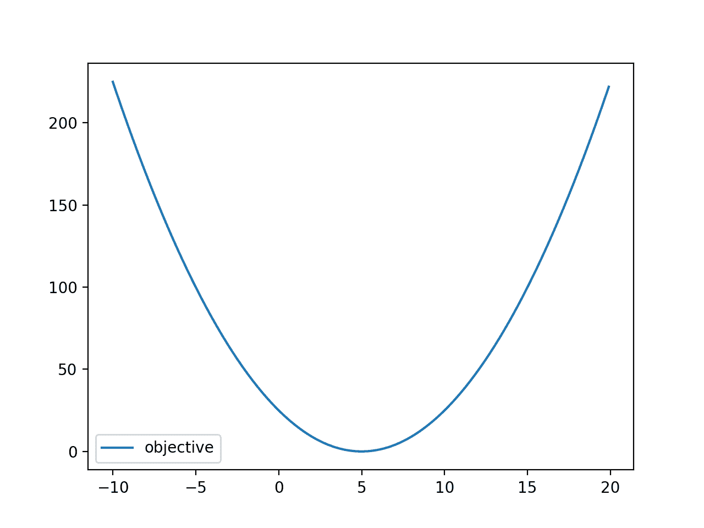
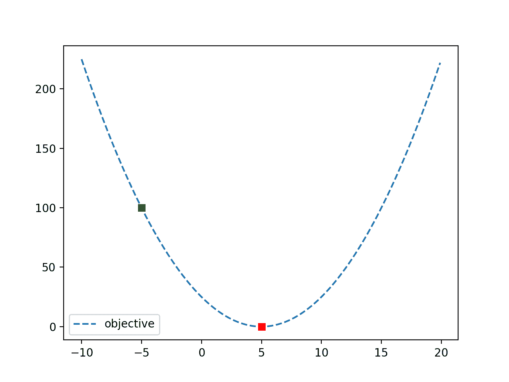

# Python 线性搜索优化

> 原文：<https://machinelearningmastery.com/line-search-optimization-with-python/>

最后更新于 2021 年 10 月 12 日

**线性搜索**是一种优化算法，可用于具有一个或多个变量的目标函数。

它提供了一种使用单变量优化算法的方法，就像对多变量目标函数的二等分搜索一样，通过使用搜索来定位从已知点到最优值的每个维度中的最佳步长。

在本教程中，您将发现如何在 Python 中执行行搜索优化。

完成本教程后，您将知道:

*   线性搜索是一种单变量和多变量优化问题的优化算法。
*   SciPy 库提供了一个执行线性搜索的应用编程接口，要求您知道如何计算目标函数的一阶导数。
*   如何对目标函数执行行搜索并使用结果？

**用我的新书[机器学习优化](https://machinelearningmastery.com/optimization-for-machine-learning/)启动你的项目**，包括*分步教程*和所有示例的 *Python 源代码*文件。

Let’s get started.

使用 Python 进行线性搜索优化
图片由 [Nathalie](https://www.flickr.com/photos/nathalie-photos/44699966974/) 提供，保留部分权利。

## 教程概述

本教程分为三个部分；它们是:

1.  什么是线性搜索
2.  Python 中的行搜索
3.  如何执行行搜索
    1.  定义目标函数
    2.  执行行搜索
    3.  处理线路搜索失败案例

## 什么是线性搜索

[线性搜索](https://en.wikipedia.org/wiki/Line_search)是一种单变量或多变量优化的优化算法。

该算法需要搜索空间中的初始位置和搜索方向。然后，它将从初始位置选择搜索空间中的下一个位置，这将导致更好或最佳的目标函数评估。

方向是一个量值，指示沿线的符号(正或负)和搜索的最大范围。因此，该方向被更好地认为是候选搜索区域，并且必须足够大以包含最佳点，或者比起点更好的点。

线性搜索将自动从当前位置为步长(方向)选择称为 alpha 的比例因子，以最小化目标函数。这包括使用另一个单变量优化算法来找到所选方向上的最佳点，以便选择合适的α。

> 一种方法是使用线性搜索，它选择最小化一维函数的步长因子[……]我们可以应用我们选择的单变量优化方法。

—第 54 页，[优化算法](https://amzn.to/31J3I8l)，2019。

Alpha 是方向的比例因子，因此在搜索中只考虑 0.0 到 1.0 之间的值。线性搜索的单个步骤解决了最小化问题，该最小化问题最小化了当前位置加上缩放方向的目标函数:

*   最小化目标(位置+α*方向)

因此，线性搜索一次在一个维度上运行，并返回在选定方向上移动的距离。

> 线性搜索方法的每次迭代计算一个搜索方向 pk，然后决定沿着该方向移动多远。

—第 30 页，[数值优化](https://amzn.to/3lCRqX9)，2006。

线性搜索可以被重复调用以在搜索空间中导航到解，并且如果所选择的方向不包含具有较低目标函数值的点，例如如果算法被引导向上搜索，则线性搜索可能失败。

该解是近似的或不精确的，并且根据搜索空间的形状可能不是全局解。该算法适用的条件称为[狼条件](https://en.wikipedia.org/wiki/Wolfe_conditions)。

现在我们已经熟悉了行搜索，让我们探索一下如何在 Python 中执行行搜索。

## Python 中的行搜索

我们可以使用 [line_search()函数](https://docs.scipy.org/doc/scipy/reference/generated/scipy.optimize.line_search.html)在 Python 中手动执行行搜索。

它支持单变量优化，以及多变量优化问题。

该函数采用目标函数的名称和目标函数的梯度名称，以及搜索空间中的当前位置和移动方向。

因此，你必须知道目标函数的一阶导数。您还必须知道从哪里开始搜索以及执行搜索的范围。回想一下，您可以使用不同的方向(符号和幅度)多次执行搜索。

```py
...
result = line_search(objective, gradient, point, direction)
```

该函数返回一个由六个元素组成的元组，其中包括称为 alpha 的方向的比例因子、已执行的函数求值次数以及其他值。

结果元组中的第一个元素包含 alpha。如果搜索未能收敛，阿尔法将具有值*无*。

```py
...
# retrieve the alpha value found as part of the line search
alpha = result[0]
```

*α*、起点和*方向*可用于构建单线性搜索的终点。

```py
...
# construct the end point of a line search
end = point + alpha * direction
```

对于具有多个输入变量的优化问题，例如多元优化， [line_search()函数](https://docs.scipy.org/doc/scipy/reference/generated/scipy.optimize.line_search.html)将为所有维度返回一个 alpha 值。

这意味着函数假设 optima 在所有维度上与起点等距，这是一个显著的限制。

现在我们已经熟悉了如何在 Python 中执行行搜索，让我们来探索一个成功的例子。

## 如何执行行搜索

我们可以用一个简单的单变量目标函数及其导数来演示如何使用线性搜索。

本部分分为多个部分，包括定义测试功能、执行线路搜索以及处理 optima 不在的故障情况。

### 定义目标函数

首先，我们可以定义目标函数。

在这种情况下，我们将使用一维目标函数，具体来说，x^2 远离零移动了少量。这是一个凸函数，选择它是因为它很容易理解和计算一阶导数。

*   目标(x) = (-5 + x)^2

注意，线性搜索不限于一维函数或凸函数。

下面列出了该功能的实现。

```py
# objective function
def objective(x):
	return (-5.0 + x)**2.0
```

该函数的一阶导数可以解析计算，如下所示:

*   梯度(x)= 2 *(5+x)

每个输入值的梯度仅指示每个点处朝向最优值的斜率。下面列出了该功能的实现。

```py
# gradient for the objective function
def gradient(x):
	return 2.0 * (-5.0 + x)
```

我们可以为 x 定义一个从-10 到 20 的输入范围，并计算每个输入的目标值。

```py
...
# define range
r_min, r_max = -10.0, 20.0
# prepare inputs
inputs = arange(r_min, r_max, 0.1)
# compute targets
targets = [objective(x) for x in inputs]
```

然后，我们可以绘制输入值与目标值的关系图，以了解函数的形状。

```py
...
# plot inputs vs objective
pyplot.plot(inputs, targets, '-', label='objective')
pyplot.legend()
pyplot.show()
```

将这些联系在一起，完整的示例如下所示。

```py
# plot a convex objective function
from numpy import arange
from matplotlib import pyplot

# objective function
def objective(x):
	return (-5.0 + x)**2.0

# gradient for the objective function
def gradient(x):
	return 2.0 * (-5.0 + x)

# define range
r_min, r_max = -10.0, 20.0
# prepare inputs
inputs = arange(r_min, r_max, 0.1)
# compute targets
targets = [objective(x) for x in inputs]
# plot inputs vs objective
pyplot.plot(inputs, targets, '-', label='objective')
pyplot.legend()
pyplot.show()
```

运行该示例评估-10 到 20 范围内的输入值(x)，并创建一个显示熟悉的抛物线 U 形的图。

函数的最佳值似乎在 x=5.0，目标值为 0.0。



凸目标函数的线图

### 执行行搜索

接下来，我们可以对函数执行行搜索。

首先，我们必须确定搜索的起点和方向。

在这种情况下，我们将使用 x=-5 的起点，距离 optima 大约 10 个单位。我们将向右迈出一大步，例如正向，在这种情况下为 100 个单位，这将大大超过最佳值。

回想方向就像步长，搜索将缩放步长以找到最优值。

```py
...
# define the starting point
point = -5.0
# define the direction to move
direction = 100.0
# print the initial conditions
print('start=%.1f, direction=%.1f' % (point, direction))
# perform the line search
result = line_search(objective, gradient, point, direction)
```

然后，搜索将找出最优值，并返回α或距离来修改方向。

我们可以从结果中检索 alpha，以及执行的函数评估的数量。

```py
...
# summarize the result
alpha = result[0]
print('Alpha: %.3f' % alpha)
print('Function evaluations: %d' % result[1])
```

我们可以使用α，以及我们的起点和步长来计算最优值的位置，并计算该点的目标函数(我们希望该值等于 0.0)。

```py
...
# define objective function minima 
end = point + alpha * direction
# evaluate objective function minima
print('f(end) = %.3f' % objective(end))
```

然后，为了好玩，我们可以再次绘制函数，并将起点显示为绿色正方形，终点显示为红色正方形。

```py
...
# define range
r_min, r_max = -10.0, 20.0
# prepare inputs
inputs = arange(r_min, r_max, 0.1)
# compute targets
targets = [objective(x) for x in inputs]
# plot inputs vs objective
pyplot.plot(inputs, targets, '--', label='objective')
# plot start and end of the search
pyplot.plot([point], [objective(point)], 's', color='g')
pyplot.plot([end], [objective(end)], 's', color='r')
pyplot.legend()
pyplot.show()
```

将这些联系在一起，下面列出了对凸目标函数执行线性搜索的完整示例。

```py
# perform a line search on a convex objective function
from numpy import arange
from scipy.optimize import line_search
from matplotlib import pyplot

# objective function
def objective(x):
	return (-5.0 + x)**2.0

# gradient for the objective function
def gradient(x):
	return 2.0 * (-5.0 + x)

# define the starting point
point = -5.0
# define the direction to move
direction = 100.0
# print the initial conditions
print('start=%.1f, direction=%.1f' % (point, direction))
# perform the line search
result = line_search(objective, gradient, point, direction)
# summarize the result
alpha = result[0]
print('Alpha: %.3f' % alpha)
print('Function evaluations: %d' % result[1])
# define objective function minima
end = point + alpha * direction
# evaluate objective function minima
print('f(end) = f(%.3f) = %.3f' % (end, objective(end)))
# define range
r_min, r_max = -10.0, 20.0
# prepare inputs
inputs = arange(r_min, r_max, 0.1)
# compute targets
targets = [objective(x) for x in inputs]
# plot inputs vs objective
pyplot.plot(inputs, targets, '--', label='objective')
# plot start and end of the search
pyplot.plot([point], [objective(point)], 's', color='g')
pyplot.plot([end], [objective(end)], 's', color='r')
pyplot.legend()
pyplot.show()
```

运行示例首先报告起点和方向。

执行搜索并定位α，α修改方向以定位最优值，在本例中为 0.1，它是在三次功能评估后找到的。

optima 的点位于 5.0，如预期的那样，评估为 0.0。

```py
start=-5.0, direction=100.0
Alpha: 0.100
Function evaluations: 3
f(end) = f(5.000) = 0.000
```

最后，创建一个函数图，显示起点(绿色)和目标(红色)。



具有搜索起点和最优值的目标函数线图

### 处理线路搜索失败案例

搜索不能保证找到函数的最优解。

如果指定的方向不够大，无法包含最佳方向，就会发生这种情况。

例如，如果我们使用三个方向，那么搜索将无法找到最优值。我们可以用下面列出的一个完整的例子来演示这一点。

```py
# perform a line search on a convex objective function with a direction that is too small
from numpy import arange
from scipy.optimize import line_search
from matplotlib import pyplot

# objective function
def objective(x):
	return (-5.0 + x)**2.0

# gradient for the objective function
def gradient(x):
	return 2.0 * (-5.0 + x)

# define the starting point
point = -5.0
# define the direction to move
direction = 3.0
# print the initial conditions
print('start=%.1f, direction=%.1f' % (point, direction))
# perform the line search
result = line_search(objective, gradient, point, direction)
# summarize the result
alpha = result[0]
print('Alpha: %.3f' % alpha)
# define objective function minima
end = point + alpha * direction
# evaluate objective function minima
print('f(end) = f(%.3f) = %.3f' % (end, objective(end)))
```

运行该示例时，搜索达到了 1.0 的α极限，这使得-2 的端点评估为 49。f(5) = 0.0 时，距离最优值很远。

```py
start=-5.0, direction=3.0
Alpha: 1.000
f(end) = f(-2.000) = 49.000
```

此外，我们可以选择错误的方向，这只会导致比起点更糟糕的评估。

在这种情况下，错误的方向将是远离最佳方向的负方向，例如从起点开始的所有上坡。

```py
...
# define the starting point
point = -5.0
# define the direction to move
direction = -3.0
```

预期搜索不会收敛，因为它无法找到比起点更好的点。

下面列出了未能收敛的搜索的完整示例。

```py
# perform a line search on a convex objective function that does not converge
from numpy import arange
from scipy.optimize import line_search
from matplotlib import pyplot

# objective function
def objective(x):
	return (-5.0 + x)**2.0

# gradient for the objective function
def gradient(x):
	return 2.0 * (-5.0 + x)

# define the starting point
point = -5.0
# define the direction to move
direction = -3.0
# print the initial conditions
print('start=%.1f, direction=%.1f' % (point, direction))
# perform the line search
result = line_search(objective, gradient, point, direction)
# summarize the result
print('Alpha: %s' % result[0])
```

运行该示例会产生一个 LineSearchWarning，表明搜索无法像预期的那样收敛。

搜索返回的 alpha 值为“无”。

```py
start=-5.0, direction=-3.0
LineSearchWarning: The line search algorithm did not converge
warn('The line search algorithm did not converge', LineSearchWarning)
Alpha: None
```

## 进一步阅读

如果您想更深入地了解这个主题，本节将提供更多资源。

### 书

*   [优化算法](https://amzn.to/31J3I8l)，2019。
*   [数值优化](https://amzn.to/3lCRqX9)，2006。

### 蜜蜂

*   [优化和寻根(scipy.optimize)](https://docs.scipy.org/doc/scipy/reference/optimize.html)
*   [优化(scipy.optimize)](https://docs.scipy.org/doc/scipy/reference/tutorial/optimize.html)
*   [scipy . optimize . line _ search API](https://docs.scipy.org/doc/scipy/reference/generated/scipy.optimize.line_search.html)。

### 文章

*   [行搜索，维基百科](https://en.wikipedia.org/wiki/Line_search)。
*   沃尔夫条件，维基百科。

## 摘要

在本教程中，您发现了如何在 Python 中执行行搜索优化。

具体来说，您了解到:

*   线性搜索是一种单变量和多变量优化问题的优化算法。
*   SciPy 库提供了一个执行线性搜索的应用编程接口，要求您知道如何计算目标函数的一阶导数。
*   如何对目标函数执行行搜索并使用结果？

**你有什么问题吗？**
在下面的评论中提问，我会尽力回答。