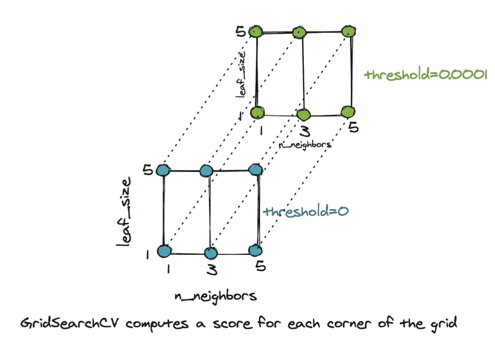
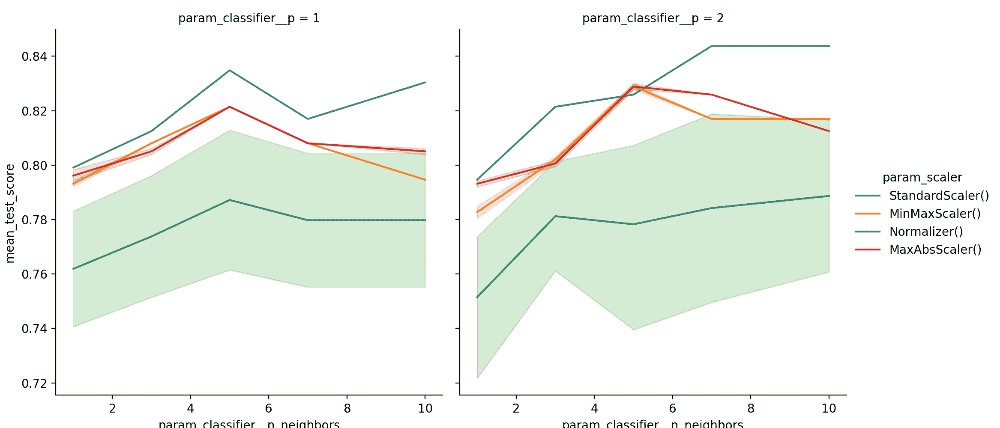
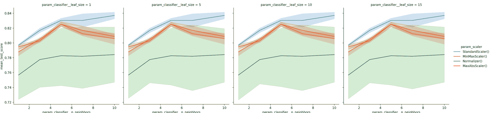

# 使用 Sklearn 建模管道优化

> 原文：<https://machinelearningmastery.com/modeling-pipeline-optimization-with-Sklearn/>

最后更新于 2021 年 10 月 22 日

本教程介绍了数据科学和自动学习中的两个基本概念。一是机器学习管道，二是其优化。这两个原则是实现任何成功的基于机器学习的智能系统的关键。

可以通过将训练机器学习模型所涉及的一系列步骤组合在一起来创建机器学习管道。它可以用来自动化机器学习工作流程。流水线可以包括预处理、特征选择、分类/回归和后处理。更复杂的应用程序可能需要在这个管道中加入其他必要的步骤。

我们所说的优化是指调整模型以获得最佳表现。任何学习模式的成功都取决于选择能给出最佳结果的最佳参数。优化可以从搜索算法的角度来看，它在一个参数空间中穿行，并从中寻找最佳的。

完成本教程后，您应该:

*   理解管道及其优化的重要性。
*   能够建立机器学习管道。
*   能够优化管道。
*   了解分析优化结果的技巧。

**用我的新书[机器学习优化](https://machinelearningmastery.com/optimization-for-machine-learning/)启动你的项目**，包括*分步教程*和所有示例的 *Python 源代码*文件。

The tutorial is simple and easy to follow. It should not take you too long to go through it. So enjoy!

## 教程概述

本教程将向您展示如何

1.  使用 sklearn.pipeline 中的 pipeline 对象设置管道
2.  使用 sklearn.model_selection 中的 GridSearchCV()执行网格搜索以获得最佳参数
3.  分析 GridSearchCV()的结果，并将其可视化

在演示以上所有内容之前，让我们编写导入部分:

```py
from pandas import read_csv # For dataframes
from pandas import DataFrame # For dataframes
from numpy import ravel # For matrices
import matplotlib.pyplot as plt # For plotting data
import seaborn as sns # For plotting data
from sklearn.model_selection import train_test_split # For train/test splits
from sklearn.neighbors import KNeighborsClassifier # The k-nearest neighbor classifier
from sklearn.feature_selection import VarianceThreshold # Feature selector
from sklearn.pipeline import Pipeline # For setting up pipeline
# Various pre-processing steps
from sklearn.preprocessing import Normalizer, StandardScaler, MinMaxScaler, PowerTransformer, MaxAbsScaler, LabelEncoder
from sklearn.model_selection import GridSearchCV # For optimization
```

## 数据集

我们将使用来自 [UCI 机器学习资源库](https://archive.ics.uci.edu/ml/datasets.php)的 [Ecoli 数据集](https://archive.ics.uci.edu/ml/datasets/Ecoli)来演示本教程的所有概念。该数据集由[中井贤三](http://www.imcb.osaka-u.ac.jp/nakai/psort.html/)维护。让我们首先将 Ecoli 数据集加载到 Pandas DataFrame 中，并查看前几行。

```py
# Read ecoli dataset from the UCI ML Repository and store in
# dataframe df
df = read_csv(
    'https://archive.ics.uci.edu/ml/machine-learning-databases/ecoli/ecoli.data',
    sep = '\s+',
    header=None)
print(df.head())
```

运行示例时，您应该会看到以下内容:

```py
            0     1     2     3    4     5     6     7   8
0   AAT_ECOLI  0.49  0.29  0.48  0.5  0.56  0.24  0.35  cp
1  ACEA_ECOLI  0.07  0.40  0.48  0.5  0.54  0.35  0.44  cp
2  ACEK_ECOLI  0.56  0.40  0.48  0.5  0.49  0.37  0.46  cp
3  ACKA_ECOLI  0.59  0.49  0.48  0.5  0.52  0.45  0.36  cp
4   ADI_ECOLI  0.23  0.32  0.48  0.5  0.55  0.25  0.35  cp
```

我们将忽略指定序列名称的第一列。最后一列是类标签。让我们将要素从类标签中分离出来，并将数据集分成 2/3 个训练实例和 1/3 个测试实例。

```py
...
# The data matrix X
X = df.iloc[:,1:-1]
# The labels
y = (df.iloc[:,-1:])

# Encode the labels into unique integers
encoder = LabelEncoder()
y = encoder.fit_transform(ravel(y))

# Split the data into test and train
X_train, X_test, y_train, y_test = train_test_split(
    X,  
    y, 
    test_size=1/3,
    random_state=0)

print(X_train.shape)
print(X_test.shape)
```

运行示例时，您应该会看到以下内容:

```py
(224, 7)
(112, 7)
```

太好了。现在我们在训练集中有 224 个样本，在测试集中有 112 个样本。我们选择了一个小数据集，这样我们就可以专注于概念，而不是数据本身。

在本教程中，我们选择了 k 近邻分类器来执行这个数据集的分类。

## 无流水线分类器及其优化

首先，让我们检查 k 最近邻在训练集和测试集上的表现。这将为我们提供一个表现基线。

```py
...
knn = KNeighborsClassifier().fit(X_train, y_train)
print('Training set score: ' + str(knn.score(X_train,y_train)))
print('Test set score: ' + str(knn.score(X_test,y_test)))
```

运行示例时，您应该会看到以下内容:

```py
Training set score: 0.9017857142857143
Test set score: 0.8482142857142857
```

我们应该记住，分类器表现的真正评判标准是测试集分数，而不是训练集分数。测试集得分反映了分类器的泛化能力。

## 设置机器学习管道

在本教程中，我们将设置一个非常基本的管道，它由以下序列组成:

1.  **定标器**:对数据进行预处理，即使用标准定标器()将数据变换为零均值和单位方差。
2.  **特征选择器**:使用方差阈值()丢弃方差小于某个定义阈值的特征。
3.  **分类器**:kneighgborcsclassifier()，实现 k 近邻分类器，选择最接近测试示例的 k 个点的大部分的类。

```py
...
pipe = Pipeline([
('scaler', StandardScaler()),
('selector', VarianceThreshold()),
('classifier', KNeighborsClassifier())
])
```

管道对象很容易理解。它说，规模第一，选择特征第二，最后分类。让我们在训练数据上调用管道对象的 fit()方法，并获得训练和测试分数。

```py
...
pipe.fit(X_train, y_train)

print('Training set score: ' + str(pipe.score(X_train,y_train)))
print('Test set score: ' + str(pipe.score(X_test,y_test)))
```

运行示例时，您应该会看到以下内容:

```py
Training set score: 0.8794642857142857
Test set score: 0.8392857142857143
```

因此，看起来这个管道的表现比原始数据上的单个分类器的表现更差。我们不仅增加了额外的处理，但这一切都是徒劳的。不要绝望，管道的真正好处来自于它的调优。下一节将解释如何做到这一点。

## 优化和调整管道

在下面的代码中，我们将显示以下内容:

1.  我们可以寻找最好的定标器。我们可以尝试 MinMaxScaler()，Normalizer()和 MaxAbsScaler()，而不仅仅是 StandardScaler()。
2.  我们可以搜索在选择器中使用的最佳方差阈值，即 variance threshold()。
3.  我们可以为 KNeighborsClassifier()搜索 k 的最佳值。

下面的参数变量是一个字典，它指定了键:值对。请注意，必须写入关键字，用双下划线 __ 分隔我们在管道()中选择的模块名称及其参数。请注意以下几点:

1.  缩放器没有双下划线，因为我们在那里指定了一个对象列表。
2.  我们将搜索选择器的最佳阈值，即变量阈值()。因此，我们指定了一个值列表[0，0.0001，0.001，0.5]供选择。
3.  为 KNeighborsClassifier()的 n_neighbors、p 和 leaf_size 参数指定了不同的值。

```py
...
parameters = {'scaler': [StandardScaler(), MinMaxScaler(),
	Normalizer(), MaxAbsScaler()],
	'selector__threshold': [0, 0.001, 0.01],
	'classifier__n_neighbors': [1, 3, 5, 7, 10],
	'classifier__p': [1, 2],
	'classifier__leaf_size': [1, 5, 10, 15]
}
```

管道和上面的参数列表随后被传递给 GridSearchCV()对象，该对象在参数空间中搜索最佳参数集，如下所示:

```py
...
grid = GridSearchCV(pipe, parameters, cv=2).fit(X_train, y_train)

print('Training set score: ' + str(grid.score(X_train, y_train)))
print('Test set score: ' + str(grid.score(X_test, y_test)))
```

运行示例时，您应该会看到以下内容:

```py
Training set score: 0.8928571428571429
Test set score: 0.8571428571428571
```

通过调整管道，我们实现了对简单分类器和非优化管道的相当大的改进。分析优化过程的结果很重要。

不要太担心通过运行上面的代码得到的警告。生成它是因为我们只有很少的训练样本，并且交叉验证对象没有足够的样本用于它的一个折叠的类。

## 分析结果

让我们看看调优后的网格对象，了解一下 GridSearchCV()对象。

该对象之所以如此命名，是因为它建立了一个多维网格，每个角代表要尝试的参数组合。这定义了一个参数空间。举个例子，如果我们有三个 n_neighbors 的值，即{1，3，5}，两个 leaf_size 的值，即{1，5}，两个 threshold 的值，即{0，0.0001}，那么我们有一个 3x2x2=12 个角的 3D 网格。每个角代表不同的组合。



GridSearchCV 计算网格每个角的分数

对于上面网格的每个角，GridSearchCV()对象计算未看到的示例的平均交叉验证分数，并选择给出最佳结果的角/参数组合。下面的代码显示了如何访问网格的最佳参数和我们任务的最佳管道。

```py
...
# Access the best set of parameters
best_params = grid.best_params_
print(best_params)
# Stores the optimum model in best_pipe
best_pipe = grid.best_estimator_
print(best_pipe)
```

运行示例时，您应该会看到以下内容:

```py
{'classifier__leaf_size': 1, 'classifier__n_neighbors': 7, 'classifier__p': 2, 'scaler': StandardScaler(), 'selector__threshold': 0}
Pipeline(steps=[('scaler', StandardScaler()),
                ('selector', VarianceThreshold(threshold=0)),
                ('classifier',
                 KNeighborsClassifier(leaf_size=1, n_neighbors=7))])
```

分析结果的另一种有用的技术是从网格中构造一个数据框架。让我们查看这个数据框的列。

```py
...
result_df = DataFrame.from_dict(grid.cv_results_, orient='columns')
print(result_df.columns)
```

运行示例时，您应该会看到以下内容:

```py
Index(['mean_fit_time', 'std_fit_time', 'mean_score_time', 'std_score_time',
       'param_classifier__leaf_size', 'param_classifier__n_neighbors',
       'param_classifier__p', 'param_scaler', 'param_selector__threshold',
       'params', 'split0_test_score', 'split1_test_score', 'mean_test_score',
       'std_test_score', 'rank_test_score'],
      dtype='object')
```

这个数据框非常有价值，因为它向我们显示了不同参数的分数。带有 mean_test_score 的列是交叉验证期间所有折叠的测试集得分的平均值。数据框可能太大，无法手动可视化，因此绘制结果总是一个好主意。让我们看看 n_neighbors 如何影响不同定标器和不同 p 值的表现。

```py
...
sns.relplot(data=result_df,
	kind='line',
	x='param_classifier__n_neighbors',
	y='mean_test_score',
	hue='param_scaler',
	col='param_classifier__p')
plt.show()
```

运行示例时，您应该会看到以下内容:



管线 GridSearchCV 结果的线图

这些图清楚地表明，使用 StandardScaler()，n_neighbors=7，p=2，会得到最好的结果。让我们再做一组叶子大小的图。

```py
...
sns.relplot(data=result_df,
            kind='line',
            x='param_classifier__n_neighbors',
            y='mean_test_score',
            hue='param_scaler',
            col='param_classifier__leaf_size')
plt.show()
```

运行示例时，您应该会看到以下内容:



## 完整示例

将这些结合在一起，下面列出了完整的代码示例。

```py
from pandas import read_csv                           # For dataframes
from pandas import DataFrame                       # For dataframes
from numpy import ravel                                  # For matrices
import matplotlib.pyplot as plt                        # For plotting data
import seaborn as sns                                     # For plotting data
from sklearn.model_selection import train_test_split    # For train/test splits
from sklearn.neighbors import KNeighborsClassifier    # The k-nearest neighbor classifier
from sklearn.feature_selection import VarianceThreshold # Feature selector
from sklearn.pipeline import Pipeline                                  # For setting up pipeline
# Various pre-processing steps
from sklearn.preprocessing import Normalizer, StandardScaler, MinMaxScaler, PowerTransformer, MaxAbsScaler, LabelEncoder
from sklearn.model_selection import GridSearchCV      # For optimization

# Read ecoli dataset from the UCI ML Repository and store in
# dataframe df
df = read_csv(
    'https://archive.ics.uci.edu/ml/machine-learning-databases/ecoli/ecoli.data',
    sep = '\s+',
    header=None)
print(df.head())

# The data matrix X
X = df.iloc[:,1:-1]
# The labels
y = (df.iloc[:,-1:])

# Encode the labels into unique integers
encoder = LabelEncoder()
y = encoder.fit_transform(ravel(y))

# Split the data into test and train
X_train, X_test, y_train, y_test = train_test_split(
    X,
    y,
    test_size=1/3,
    random_state=0)

print(X_train.shape)
print(X_test.shape)

knn = KNeighborsClassifier().fit(X_train, y_train)
print('Training set score: ' + str(knn.score(X_train,y_train)))
print('Test set score: ' + str(knn.score(X_test,y_test)))

pipe = Pipeline([
('scaler', StandardScaler()),
('selector', VarianceThreshold()),
('classifier', KNeighborsClassifier())
])

pipe.fit(X_train, y_train)

print('Training set score: ' + str(pipe.score(X_train,y_train)))
print('Test set score: ' + str(pipe.score(X_test,y_test)))

parameters = {'scaler': [StandardScaler(), MinMaxScaler(),
	Normalizer(), MaxAbsScaler()],
	'selector__threshold': [0, 0.001, 0.01],
	'classifier__n_neighbors': [1, 3, 5, 7, 10],
	'classifier__p': [1, 2],
	'classifier__leaf_size': [1, 5, 10, 15]
}

grid = GridSearchCV(pipe, parameters, cv=2).fit(X_train, y_train)

print('Training set score: ' + str(grid.score(X_train, y_train)))
print('Test set score: ' + str(grid.score(X_test, y_test)))

# Access the best set of parameters
best_params = grid.best_params_
print(best_params)
# Stores the optimum model in best_pipe
best_pipe = grid.best_estimator_
print(best_pipe)

result_df = DataFrame.from_dict(grid.cv_results_, orient='columns')
print(result_df.columns)

sns.relplot(data=result_df,
	kind='line',
	x='param_classifier__n_neighbors',
	y='mean_test_score',
	hue='param_scaler',
	col='param_classifier__p')
plt.show()

sns.relplot(data=result_df,
            kind='line',
            x='param_classifier__n_neighbors',
            y='mean_test_score',
            hue='param_scaler',
            col='param_classifier__leaf_size')
plt.show()
```

## 摘要

在本教程中，我们学习了以下内容:

1.  如何构建机器学习管道？
2.  如何利用 GridSearchCV 优化管道？
3.  如何分析和比较使用不同参数集获得的结果？

本教程使用的数据集非常小，只有几个示例点，但结果仍然比简单的分类器好。

## 进一步阅读

对于感兴趣的读者，这里有一些资源:

### 教程

*   [关于加文·考利和尼古拉·塔尔博特在绩效评估中模型选择的过拟合和随后的选择偏差](https://www.jmlr.org/papers/volume11/cawley10a/cawley10a.pdf)
*   [k 倍交叉验证的温和介绍](https://machinelearningmastery.com/k-fold-cross-validation/)
*   [型号选择](https://machinelearningmastery.com/a-gentle-introduction-to-model-selection-for-machine-learning/)
*   [k 近邻算法](https://machinelearningmastery.com/tutorial-to-implement-k-nearest-neighbors-in-python-from-scratch/)
*   [机器学习建模管道的温和介绍](https://machinelearningmastery.com/machine-learning-modeling-pipelines/)

### 蜜蜂

*   [sklearn.model_selection。参数采样器应用编程接口](https://Sklearn.org/stable/modules/generated/sklearn.model_selection.ParameterSampler.html)
*   [硬化. model_selection。randolmiedsearchv API](https://Sklearn.org/stable/modules/generated/sklearn.model_selection.RandomizedSearchCV.html)
*   [sklearn.model_selection。KFold 原料药](https://Sklearn.org/stable/modules/generated/sklearn.model_selection.KFold.html#sklearn.model_selection.KFold)
*   [sklearn.model_selection。参数网格应用编程接口](https://Sklearn.org/stable/modules/generated/sklearn.model_selection.ParameterGrid.html#sklearn.model_selection.ParameterGrid)

### 数据集

*   [由 Dua 和 Graff](https://archive.ics.uci.edu/ml) 维护的 UCI 机器学习资源库。
*   [由中井贤三维护的 Ecoli 数据集](https://archive.ics.uci.edu/ml/datasets/ecoli)。更多信息请见本文。