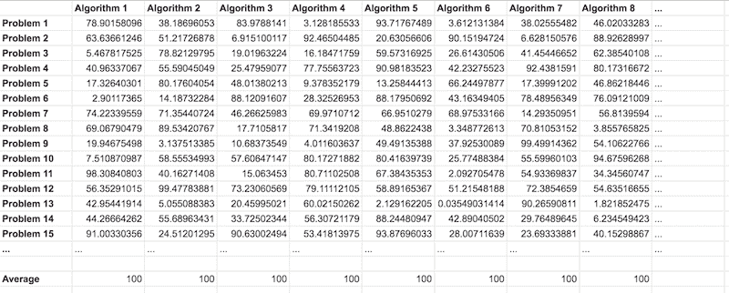

# 机器学习没有免费午餐定理

> 原文：<https://machinelearningmastery.com/no-free-lunch-theorem-for-machine-learning/>

最后更新于 2021 年 10 月 12 日

**没有免费的午餐定理**在优化和机器学习领域经常被抛来抛去，通常对它的含义或隐含意义知之甚少。

该定理指出，当所有优化算法的表现在所有可能的问题上取平均值时，它们的表现同样良好。

这意味着没有单一的最佳优化算法。由于优化、搜索和机器学习之间的紧密[关系，这也意味着对于分类和回归等预测建模问题，没有单一的最佳机器学习算法。](https://machinelearningmastery.com/applied-machine-learning-as-a-search-problem/)

在本教程中，您将发现用于优化和搜索的“没有免费午餐”定理。

完成本教程后，您将知道:

*   没有免费的午餐定理表明，在某些特定的约束条件下，所有优化算法的表现都是相同的。
*   不存在单一的最佳优化算法或机器学习算法。
*   假设我们对所有可能的目标函数的一个小子集感兴趣，这个定理的实际意义可能是有限的。

**用我的新书[机器学习优化](https://machinelearningmastery.com/optimization-for-machine-learning/)启动你的项目**，包括*分步教程*和所有示例的 *Python 源代码*文件。

Let’s get started.

机器学习没有免费午餐定理
图片由 [Francisco Anzola](https://www.flickr.com/photos/fran001/16168087427/) 提供，保留部分权利。

## 教程概述

本教程分为三个部分；它们是:

1.  什么是不免费午餐定理？
2.  优化的含义
3.  对机器学习的启示

## 什么是不免费午餐定理？

没有免费的午餐定理，通常缩写为 NFL 或 NFLT，是一个理论发现，表明当所有优化算法的表现在所有可能的目标函数上平均时，它们的表现同样好。

> 美国国家橄榄球联盟表示，在一定的限制条件下，在所有可能的问题的空间内，每种优化技术的平均表现都和其他技术一样好(包括随机搜索)

—第 203 页，[元试探法精要](https://amzn.to/3iQkCaw)，2011。

该定理一般适用于优化和搜索问题，因为优化可以被描述或框定为搜索问题。

言外之意就是你喜欢的算法的表现和完全幼稚的算法是一样的，比如随机搜索。

> 粗略地说，我们表明，对于静态和时间相关的优化问题，任何一对算法在所有可能问题上的平均表现完全相同。

——[优化没有免费的午餐定理](https://ieeexplore.ieee.org/abstract/document/585893)，1997。

思考这一发现的一个简单方法是考虑一个像 excel 中那样的大表。

在表格的顶部，每一列代表不同的优化算法。在表格的下方，每一行代表一个不同的目标函数。表中的每个单元格都是算法在目标函数上的表现，使用您喜欢的任何表现度量，只要它在整个表中是一致的。

把没有免费午餐定理描述成一张算法和问题表

你可以想象这张桌子会无限大。然而，在这个表中，我们可以从其列中的所有值计算任何算法的平均表现，并且它将与任何其他算法列的平均表现相同。

> 如果一种算法在一类问题上的表现优于另一种算法，那么它在另一类问题上的表现就会更差

—第 6 页，[优化算法](https://amzn.to/34Nb7nv)，2019。

既然我们已经熟悉了“没有免费午餐”定理，那么让我们来看看优化的具体含义。

## 优化的含义

所谓的黑盒优化算法是通用的优化算法，可以应用于许多不同的优化问题，并且对目标函数的假设很少。

黑盒算法的例子包括遗传算法、模拟退火和粒子群优化。

没有免费的午餐定理是在 20 世纪 90 年代后期的一个环境中提出的，当时人们经常声称一种黑盒优化算法比另一种优化算法更好。该定理反推了这一点，表明没有最佳优化算法，这是证明不可能的。

该定理确实指出，平均而言，没有任何优化算法比任何其他优化算法更好。

> …被称为“没有免费午餐”的定理，为学习器的能力设定了一个极限。极限很低:没有一个学习器能比随机猜测更好！

—第 63 页，[主算法](https://amzn.to/3lKKGFX)，2018 年。

问题在于，算法的应用并没有假设任何关于问题的东西。事实上，算法是在没有先验知识的情况下应用于目标函数的，甚至是目标函数是最小化还是最大化。这是定理的一个硬约束。

我们经常有一些关于优化目标函数的*知识。事实上，如果在实践中我们真的对目标函数一无所知，我们就无法选择优化算法。*

 *> 正如沃伯特和麦克瑞德的“没有免费的午餐”定理所阐述的那样，没有理由偏爱一种算法，除非我们对可能的目标函数空间上的概率分布做出假设。

—第 6 页，[优化算法](https://amzn.to/34Nb7nv)，2019。

建议优化领域的初学者尽可能多地学习和使用优化算法中的问题。

我们对问题的算法了解得越多，掌握得越多，技术就越适合问题，算法就越有可能在问题上表现良好。没有免费午餐定理支持这个建议。

> 我们不关心所有可能的世界，只关心我们生活的那个世界。如果我们对世界有所了解，并将其融入到我们的学习器中，它现在比随机猜测更有优势。

—第 63 页，[主算法](https://amzn.to/3lKKGFX)，2018 年。

此外，表现在所有可能的目标函数和所有可能的优化算法上是平均的。而在实践中，我们感兴趣的是目标函数的一个小子集，它可能具有特定的结构或形式以及为这些函数定制的算法。

> ……我们再怎么强调也不为过，本文中并未就各种搜索算法在实践中的运行情况提出任何主张。本文的重点在于无需任何假设就能先验地得出的结论，以及仅从数学原理上得出的关于搜索算法实用性的结论。

——[优化没有免费的午餐定理](https://ieeexplore.ieee.org/abstract/document/585893)，1997。

这些暗示让一些实践者注意到这个定理有限的实用价值。

> 这在理论上很有意义，但我认为实际价值有限，因为所有可能问题的空间可能包括许多极不寻常和病态的问题，这些问题在实践中很少见到。

—第 203 页，[元试探法精要](https://amzn.to/3iQkCaw)，2011。

既然我们已经回顾了没有免费午餐定理对优化的影响，那么让我们回顾一下对机器学习的影响。

## 对机器学习的启示

学习可以被描述或框架为一个优化问题，大多数机器学习算法的核心是解决一个优化问题。

用于优化和搜索的“没有免费午餐”定理被应用于机器学习，特别是监督学习，这是分类和回归预测建模任务的基础。

这意味着所有的机器学习算法对所有可能的预测问题都同样有效，例如，随机森林和随机预测一样好。

> 因此，所有的学习算法都是相同的:(1)根据“平均”的几种定义，所有的算法都具有相同的平均脱离训练集的错误分类风险，(2)因此，对于所有的学习算法，没有一种学习算法比另一种学习算法具有更低的风险

——[监督学习无免费午餐定理](https://link.springer.com/chapter/10.1007/978-1-4471-0123-9_3)，2002。

这也对评估或选择算法的方式有影响，例如通过 k 倍交叉验证测试工具选择学习算法与否。

> …使用交叉验证在一组预先设定的学习算法中进行选择的算法，平均来说并不比没有这样做的算法做得更好。

——[监督学习无免费午餐定理](https://link.springer.com/chapter/10.1007/978-1-4471-0123-9_3)，2002。

它还对构成“*好的*”机器学习模型的常见启发式方法有所启示，例如避免过拟合或选择表现良好的最简单的可能模型。

> 另一组例子是由人们为监督学习想出的所有启发式方法提供的，避免过拟合，喜欢更简单的模型而不是更复杂的模型等。[没有免费的午餐]说所有这样的试探法失败的次数和成功的次数一样多。

——[监督学习无免费午餐定理](https://link.springer.com/chapter/10.1007/978-1-4471-0123-9_3)，2002。

考虑到在所有可能的预测问题中没有最佳的单一机器学习算法，这激发了继续开发新的学习算法和更好地理解已经开发的算法的需求。

> 由于没有免费的午餐定理，我们需要开发许多不同类型的模型，以涵盖现实世界中出现的各种各样的数据。对于每个模型，可能有许多不同的算法，我们可以用来训练模型，这使得不同的速度-准确率-复杂性权衡。

—第 24-25 页，[机器学习:概率视角](https://amzn.to/3nJJe8s)，2012。

它还支持为给定的预测建模问题测试一套不同的机器学习算法。

“*没有免费的午餐*”定理认为，在没有关于建模问题的实质性信息的情况下，没有哪一个模型总是比任何其他模型做得更好。正因为如此，可以提出一个强有力的案例来尝试各种各样的技术，然后确定关注哪个模型。

—第 25-26 页，[应用预测建模](https://amzn.to/3ly7nwK)，2013 年。

然而，与优化一样，该定理的含义基于对所解决问题一无所知的学习算法的选择。

实际上，情况并非如此，我们鼓励初学机器学习的实践者查看可用的数据，以便了解一些可以纳入学习算法的问题。

我们甚至可能想更进一步，说没有一些先验知识，学习是不可能的，光有数据是不够的。

> 与此同时，“没有免费的午餐”定理的实际后果是，没有知识就没有学习。光有数据是不够的。

—第 64 页，[主算法](https://amzn.to/3lKKGFX)，2018 年。

## 进一步阅读

如果您想更深入地了解这个主题，本节将提供更多资源。

### 报纸

*   [学习算法之间缺乏先验区分](https://www.mitpressjournals.org/doi/abs/10.1162/neco.1996.8.7.1341)，1996。
*   [没有免费的午餐定理可供搜索](http://citeseerx.ist.psu.edu/viewdoc/download?doi=10.1.1.47.7505&rep=rep1&type=pdf)，1995。
*   [优化没有免费的午餐定理](https://ieeexplore.ieee.org/abstract/document/585893)，1997。
*   [监督学习无免费午餐定理](https://link.springer.com/chapter/10.1007/978-1-4471-0123-9_3)，2002。

### 书

*   [优化算法](https://amzn.to/34Nb7nv)，2019。
*   [元试探法精要](https://amzn.to/3iQkCaw)，2011。
*   [应用预测建模](https://amzn.to/3ly7nwK)，2013。
*   [机器学习:概率视角](https://amzn.to/3nJJe8s)，2012。
*   [主算法](https://amzn.to/3lKKGFX)，2018 年。

### 文章

*   [搜索优化没有免费午餐，维基百科](https://en.wikipedia.org/wiki/No_free_lunch_in_search_and_optimization)。
*   [没有免费午餐定理，维基百科](https://en.wikipedia.org/wiki/No_free_lunch_theorem)。
*   [没有免费午餐定理](http://www.no-free-lunch.org/)

## 摘要

在本教程中，您发现了优化和搜索的“没有免费午餐”定理。

具体来说，您了解到:

*   没有免费的午餐定理表明，在某些特定的约束条件下，所有优化算法的表现都是相同的。
*   不存在单一的最佳优化算法或机器学习算法。
*   假设我们对所有可能的目标函数的一个小子集感兴趣，这个定理的实际意义可能是有限的。

**你有什么问题吗？**
在下面的评论中提问，我会尽力回答。*