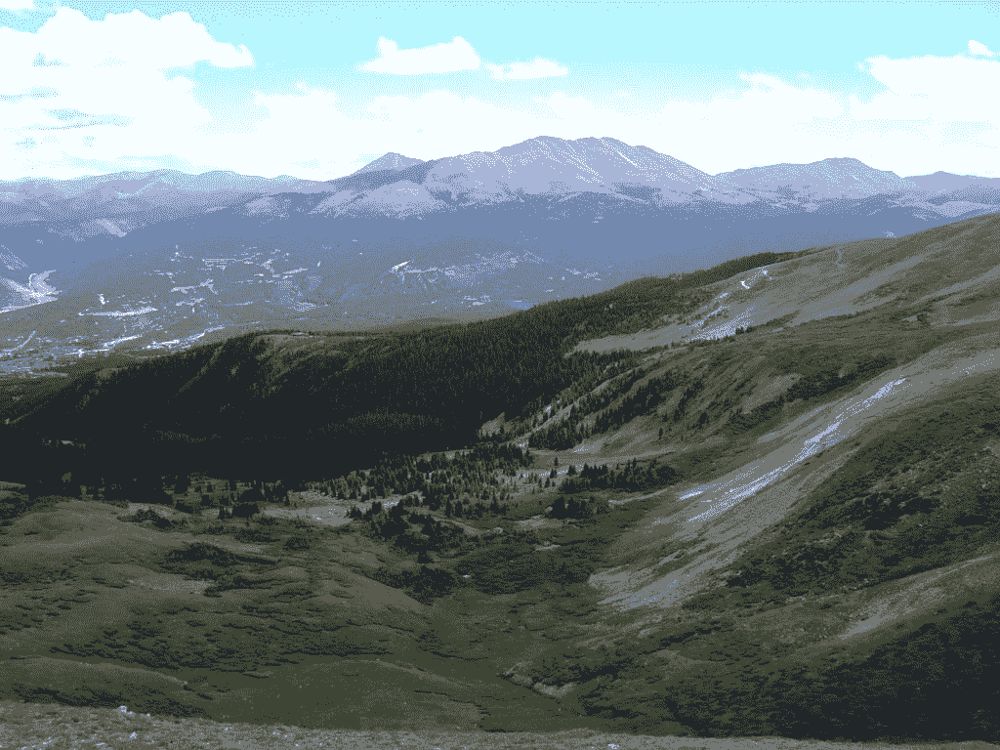

# 机器学习优化速成班

> 原文：<https://machinelearningmastery.com/optimization-for-machine-learning-crash-course/>

最后更新于 2021 年 10 月 30 日

#### 机器学习速成班的优化。
7 天内用 Python 找到函数 optima。

所有机器学习模型都涉及优化。作为从业者，我们优化最合适的超参数或特征子集。决策树算法的分割优化。权重的神经网络优化。最有可能的是，我们使用计算算法来优化。

数值优化的方法有很多。SciPy 在这方面有很多便利的功能。我们也可以尝试自己实现优化算法。

在这个速成课程中，您将发现如何在七天内开始并自信地运行算法来使用 Python 优化一个函数。

这是一个又大又重要的岗位。你可能想把它做成书签。

**用我的新书[机器学习优化](https://machinelearningmastery.com/optimization-for-machine-learning/)启动你的项目**，包括*分步教程*和所有示例的 *Python 源代码*文件。

我们开始吧。



机器学习优化(7 天迷你课程)
图片由[布鲁斯特·马列维奇](https://www.flickr.com/photos/sbmalev/4549011130/)提供，保留部分权利。

## 这个速成班是给谁的？

在我们开始之前，让我们确保你在正确的地方。

本课程面向可能了解一些应用机器学习的开发人员。也许您已经构建了一些模型，并端到端地完成了一些项目，或者从流行工具的现有示例代码中进行了修改，以解决您自己的问题。

本课程中的课程假设了您的一些情况，例如:

*   你对编程的基本 Python 很熟悉。
*   您可能知道一些用于数组操作的基本 NumPy。
*   你听说过梯度下降、模拟退火、BFGS 或其他一些优化算法，想加深你的理解。

你不需要:

*   数学天才！
*   机器学习专家！

这门速成课程将把你从一个懂一点机器学习的开发人员带到一个能有效和胜任地应用函数优化算法的开发人员。

注意:本速成课程假设您有一个至少安装了 NumPy 的工作 Python 3 SciPy 环境。如果您需要环境方面的帮助，可以遵循这里的逐步教程:

*   [如何用 Anaconda](https://machinelearningmastery.com/setup-python-environment-machine-learning-deep-learning-anaconda/) 设置机器学习的 Python 环境

## 速成班概述

这门速成课分为七节课。

您可以每天完成一节课(推荐)或一天内完成所有课程(硬核)。这真的取决于你有多少时间和你的热情程度。

下面是用 Python 进行优化的七个经验教训:

*   **第 01 课**:为什么要优化？
*   **第 02 课**:网格搜索
*   **第 03 课**:SciPy 中的优化算法
*   **第 04 课** : BFGS 算法
*   **第 05 课**:爬山算法
*   **第 06 课**:模拟退火
*   **第 07 课**:梯度下降

每节课可能需要你 60 秒或 30 分钟。慢慢来，按照自己的节奏完成课程。提问，甚至在下面的评论中发布结果。

这些课程可能期望你去发现如何做事。我会给你一些提示，但是每节课的部分要点是迫使你学习去哪里寻找关于 Python 中的算法和最佳工具的帮助。(**提示** : *我有这个博客所有的答案；使用搜索框*。)

**在评论**中发布你的结果；我会为你加油的！

坚持住。不要放弃。

## 第 01 课:为什么要优化？

在本课中，您将发现我们为什么以及何时想要进行优化。

机器学习不同于其他类型的软件项目，因为它在我们应该如何编写程序方面不那么琐碎。编程中一个有趣的例子是编写一个 for 循环来打印从 1 到 100 的数字。您确切地知道您需要一个变量来计数，并且应该有 100 次循环迭代来计数。机器学习中的一个玩具例子是使用神经网络进行回归，但是你不知道你到底需要多少次迭代来训练模型。你可能设置得太少或太多，你没有一个规则来告诉什么是正确的数字。因此，许多人认为机器学习模型是一个黑箱。结果是，虽然模型有许多我们可以调整的变量(例如超参数)，但我们不知道什么是正确的值，直到我们测试出来。

在本课中，您将发现为什么机器学习实践者应该学习优化来提高他们的技能和能力。优化在数学上也称为函数优化，旨在定位某个**函数**的最大值或最小值。对于不同性质的功能，可以应用不同的方法。

机器学习是关于开发预测模型。无论一个模型比另一个更好，我们都有一些评估指标来衡量一个模型在特定数据集下的表现。从这个意义上说，如果我们将创建模型的参数视为输入，将模型的内部算法和相关数据集视为常数，将从模型评估的度量视为输出，那么我们就构建了一个函数。

以决策树为例。我们知道它是一棵二叉树，因为每个中间节点都在问一个是或否的问题。这是不变的，我们无法改变。但是这棵树应该有多深是我们可以控制的超参数。我们允许决策树使用数据中的哪些特征和多少特征是另一回事。这些超参数的不同值将改变决策树模型，从而给出不同的度量，例如分类问题中 k 倍交叉验证的平均准确率。然后我们定义了一个函数，将超参数作为输入，准确率作为输出。

从决策树库的角度来看，一旦您提供了超参数和训练数据，它还可以将它们视为常数，并且选择每个节点上的特征和分割阈值作为输入。度量仍然是这里的输出，因为决策树库共享做出最佳预测的相同目标。因此，该库也定义了一个功能，但不同于上面提到的功能。

这里的**函数**并不意味着需要在编程语言中明确定义一个函数。概念性的就够了。我们接下来要做的是对输入进行操作，并检查输出，直到我们发现实现了最佳输出。就机器学习而言，最好的意思是

*   最高的准确度、精确度或召回率
*   中华民国最大的澳柯币
*   分类中最大的 F1 分数或回归中的 R <sup>2</sup> 分数
*   最少的错误或日志丢失

或者这一行的其他内容。我们可以通过随机方法(如采样或随机扰动)来操纵输入。我们还可以假设函数具有某些属性，并尝试一系列输入来利用这些属性。当然，我们也可以检查所有可能的输入，当我们用尽可能性时，我们将知道最佳答案。

这些是我们为什么要做优化的基础，它是关于什么的，以及我们如何做。你可能没有注意到，但是训练机器学习模型是在做优化。您也可以显式执行优化来选择特征或微调超参数。如您所见，优化在机器学习中非常有用。

### 你的任务

在本课中，您必须找到一个机器学习模型，并列出三个可能使用优化或有助于训练和使用该模型的示例。这些可能与上面的一些原因有关，也可能是你自己的个人动机。

在下面的评论中发表你的答案。我想看看你有什么想法。

在下一课中，您将发现如何对任意函数执行网格搜索。

## 第二课:网格搜索

在本课中，您将发现用于优化的网格搜索。

让我们从这个函数开始:

*f* ( *x* ，*y*)=*x*T8】2+*y*T12】2

这是一个二维输入( *x* 、 *y* )一维输出的函数。我们怎么做才能找到这个函数的最小值？换句话说，对于什么 *x* 和 *y* ，我们能有最少的 *f* ( *x* ， *y* )？

不看 *f* ( *x* 、 *y* )是什么，我们可以先假设 *x* 和 *y* 在某个有界区域，比如说-5 到+5。然后我们可以在这个范围内检查 *x* 和 *y* 的每个组合。如果我们记住 *f* ( *x* ， *y* )的值，并跟踪我们见过的最少的，那么我们可以在耗尽该区域后找到它的最小值。在 Python 代码中，它是这样的:

```py
from numpy import arange, inf

# objective function
def objective(x, y):
    return x**2.0 + y**2.0

# define range for input
r_min, r_max = -5.0, 5.0
# generate a grid sample from the domain sample = list()
step = 0.1
for x in arange(r_min, r_max+step, step):
    for y in arange(r_min, r_max+step, step):
        sample.append([x,y])
# evaluate the sample
best_eval = inf
best_x, best_y = None, None
for x,y in sample:
    eval = objective(x,y)
    if eval < best_eval:
        best_x = x
        best_y = y
        best_eval = eval
# summarize best solution
print('Best: f(%.5f,%.5f) = %.5f' % (best_x, best_y, best_eval))
```

该代码从范围-5 的下限扫描到上限+5，每一步的增量为 0.1。这个范围对于 *x* 和 *y* 都是一样的。这将创建( *x* 、 *y* 对的大量样本。这些样品是由一定范围内的 *x* 和 *y* 组合而成。如果我们把它们的坐标画在图形纸上，它们就形成了一个网格，因此我们称之为网格搜索。

用样本网格，然后我们对( *x* ， *y* 的每个样本评估目标函数 *f* ( *x* ， *y* )。我们跟踪价值，记住我们所见过的最不重要的东西。一旦我们用完了网格上的样本，我们就会想起优化后找到的最少的值。

### 你的任务

在本课中，您应该查找如何使用 numpy.meshgrid()函数，并重写示例代码。然后可以尝试将目标函数替换为 *f* ( *x* 、 *y* 、*z*)=(*x*–*y*+1)<sup>2</sup>+*z*<sup>2</sup>，这是一个 3D 输入的函数。

在下面的评论中发表你的答案。我想看看你有什么想法。

在下一课中，您将学习如何使用 scipy 优化函数。

## 第 03 课:SciPy 中的优化算法

在本课中，您将发现如何利用 SciPy 来优化您的功能。

文献中有很多优化算法。每一种都有它的优点和缺点，每一种都适合不同的情况。重用我们在上一课中介绍的相同功能，

*f* ( *x* ，*y*)=*x*T8】2+*y*T12】2

我们可以利用 SciPy 中的一些预定义算法来找到它的最小值。可能最简单的是 NelderMead 算法。该算法基于一系列规则来确定如何探索函数的表面。无需赘述，我们可以简单地调用 SciPy 并应用 Nelder-Mead 算法来寻找函数的最小值:

```py
from scipy.optimize import minimize
from numpy.random import rand

# objective function
def objective(x):
	return x[0]**2.0 + x[1]**2.0

# define range for input
r_min, r_max = -5.0, 5.0
# define the starting point as a random sample from the domain
pt = r_min + rand(2) * (r_max - r_min)
# perform the search
result = minimize(objective, pt, method='nelder-mead')
# summarize the result
print('Status : %s' % result['message'])
print('Total Evaluations: %d' % result['nfev'])
# evaluate solution
solution = result['x']
evaluation = objective(solution)
print('Solution: f(%s) = %.5f' % (solution, evaluation))
```

在上面的代码中，我们需要用一个向量参数编写我们的函数。因此，实际上该功能变得

*f*(*x*【0】，*x*【1】)=(*x*【0】)<sup>2</sup>+(*x*【1】)<sup>2</sup>

NelderMead 算法需要一个起点。我们为此选择一个在-5 到+5 范围内的随机点(rand(2)是 numpy 生成 0 到 1 之间的随机坐标对的方法)。函数 minimize()返回一个 OptimizeResult 对象，该对象包含关于可通过键访问的结果的信息。“message”键提供关于搜索成功或失败的人类可读消息，“nfev”键告知优化过程中执行的功能评估的数量。最重要的一个是“x”键，它指定达到最小值的输入值。

NelderMead 算法对于**凸函数**效果很好，其形状比较光滑，像一个盆。对于更复杂的函数，算法可能停留在**局部最优**处，但无法找到真正的全局最优。

### 你的任务

在本课中，您应该用以下内容替换上面示例代码中的目标函数:

```py
from numpy import e, pi, cos, sqrt, exp
def objective(v):
    x, y = v
    return ( -20.0 * exp(-0.2 * sqrt(0.5 * (x**2 + y**2)))
             - exp(0.5 * (cos(2*pi*x)+cos(2*pi*y))) + e + 20 )
```

这就定义了阿克利函数。全局最小值位于 v=[0，0]。然而，NelderMead 很可能找不到它，因为这个函数有许多局部极小值。试着重复你的代码几次，观察输出。每次运行程序时，您应该会得到不同的输出。

在下面的评论中发表你的答案。我想看看你有什么想法。

在下一课中，您将学习如何使用相同的 SciPy 函数来应用不同的优化算法。

## 第 04 课:BFGS 算法

在本课中，您将发现如何利用 SciPy 应用 BFGS 算法来优化您的函数。

正如我们在上一课中所看到的，我们可以使用 scipy.optimize 中的 minimize()函数来使用 Nelder-Mead 算法优化函数。这是简单的“模式搜索”算法，不需要知道函数的导数。

一阶导数是指对目标函数进行一次微分。同样，二阶导数是将一阶导数再微分一次。如果我们有目标函数的二阶导数，我们可以应用牛顿法找到它的最佳值。

还有一类优化算法可以从一阶导数逼近二阶导数，并利用逼近来优化目标函数。它们被称为**准牛顿法**。BFGS 是这个班最有名的一个。

重温我们在前面课程中使用的相同目标函数，

*f* ( *x* ，*y*)=*x*T8】2+*y*T12】2

我们可以看出，一阶导数是:

*f*=【2】*x*、2 *和*

这是两个分量的向量，因为函数 *f* ( *x* ， *y* )接收两个分量的向量值( *x* ， *y* )并返回标量值。

如果我们为一阶导数创建一个新函数，我们可以调用 SciPy 并应用 BFGS 算法:

```py
from scipy.optimize import minimize
from numpy.random import rand

# objective function
def objective(x):
	return x[0]**2.0 + x[1]**2.0

# derivative of the objective function
def derivative(x):
	return [x[0] * 2, x[1] * 2]

# define range for input
r_min, r_max = -5.0, 5.0
# define the starting point as a random sample from the domain
pt = r_min + rand(2) * (r_max - r_min)
# perform the bfgs algorithm search
result = minimize(objective, pt, method='BFGS', jac=derivative)
# summarize the result
print('Status : %s' % result['message'])
print('Total Evaluations: %d' % result['nfev'])
# evaluate solution
solution = result['x']
evaluation = objective(solution)
print('Solution: f(%s) = %.5f' % (solution, evaluation))
```

目标函数的一阶导数被提供给带有“jac”参数的最小化()函数。该自变量以**雅可比矩阵**命名，这就是我们如何称取一个向量并返回一个向量的函数的一阶导数。BFGS 算法将利用一阶导数来计算**黑森矩阵**的逆(即向量函数的二阶导数)，并利用它来寻找最优解。

除了 BFGS，还有 L-BFGS-B。它是前者的一个版本，使用较少的内存(“L”)，并且域被限制在一个区域(“B”)。要使用这个变体，我们只需替换方法的名称:

```py
...
result = minimize(objective, pt, method='L-BFGS-B', jac=derivative)
```

### 你的任务

对于本课，您应该创建一个具有更多参数的函数(即函数的向量参数远不止两个分量)，并观察 BFGS 和 L-BFGS-B 的表现。您注意到速度的差异了吗？这两种方法的结果有什么不同？如果你的函数不是凸的，但是有很多局部最优解，会发生什么？

在下面的评论中发表你的答案。我想看看你有什么想法。

## 第五课:爬山算法

在本课中，您将发现如何实现爬山算法并使用它来优化您的功能。

爬山的思想是从目标函数上的一个点开始。然后我们在随机方向上稍微移动点。万一此举让我们找到更好的解决方案，我们会保留新的职位。否则我们和老人呆在一起。在做了足够多的迭代之后，我们应该足够接近这个目标函数的最优值。这种进步之所以被命名，是因为它就像我们在爬山，只要有可能，我们就会朝任何方向向上(或向下)爬。

在 Python 中，我们可以将上面的最小化爬山算法写成一个函数:

```py
from numpy.random import randn

def in_bounds(point, bounds):
	# enumerate all dimensions of the point
	for d in range(len(bounds)):
		# check if out of bounds for this dimension
		if point[d] < bounds[d, 0] or point[d] > bounds[d, 1]:
			return False
	return True

def hillclimbing(objective, bounds, n_iterations, step_size):
	# generate an initial point
	solution = None
	while solution is None or not in_bounds(solution, bounds):
		solution = bounds[:, 0] + rand(len(bounds)) * (bounds[:, 1] - bounds[:, 0])
	# evaluate the initial point
	solution_eval = objective(solution)
	# run the hill climb
	for i in range(n_iterations):
		# take a step
		candidate = None
		while candidate is None or not in_bounds(candidate, bounds):
			candidate = solution + randn(len(bounds)) * step_size
		# evaluate candidate point
		candidte_eval = objective(candidate)
		# check if we should keep the new point
		if candidte_eval <= solution_eval:
			# store the new point
			solution, solution_eval = candidate, candidte_eval
			# report progress
			print('>%d f(%s) = %.5f' % (i, solution, solution_eval))
	return [solution, solution_eval]
```

这个函数允许传递任何目标函数，只要它接受一个向量并返回一个标量值。“界限”参数应该是 *n* ×2 维的 numpy 数组，其中 *n* 是目标函数期望的向量大小。它告诉我们应该寻找最小值的范围的下限和上限。例如，对于期望二维向量(像上一课中的向量)和向量的分量在-5 到+5 之间的目标函数，我们可以如下设置界限:

```py
bounds = np.asarray([[-5.0, 5.0], [-5.0, 5.0]])
```

这个“爬山”函数将在边界内随机选择一个初始点，然后在迭代中测试目标函数。只要它能找到目标函数产生一个较小的值，解就会被记住，下一个要测试的点会从它的邻域中生成。

### 你的任务

对于本课，您应该提供自己的目标函数(例如复制上一课的目标函数)，设置“n _ 迭代”和“步长”，并应用“爬山”函数来找到最小值。观察算法如何找到解决方案。尝试使用不同的“步长”值，并比较达到最终解的接近度所需的迭代次数。

在下面的评论中发表你的答案。我想看看你有什么想法。

## 第六课:模拟退火

在本课中，您将发现模拟退火是如何工作的以及如何使用它。

对于非凸函数，你在前几课学到的算法很容易陷入局部最优，找不到全局最优。原因是因为算法的贪婪本质:每当找到更好的解，它就不会放过。因此，如果存在更好的解决方案，但不在附近，算法将无法找到它。

模拟退火试图通过在*探索*和*开发*之间取得平衡来改善这种行为。在开始时，当算法不太了解要优化的函数时，它更喜欢探索其他解决方案，而不是停留在找到的最佳解决方案上。在后期，随着更多的解被探索，找到更好的解的机会减少了，算法将更喜欢保持在它找到的最佳解的附近。

以下是模拟退火作为 Python 函数的实现:

```py
from numpy.random import randn, rand

def simulated_annealing(objective, bounds, n_iterations, step_size, temp):
	# generate an initial point
	best = bounds[:, 0] + rand(len(bounds)) * (bounds[:, 1] - bounds[:, 0])
	# evaluate the initial point
	best_eval = objective(best)
	# current working solution
	curr, curr_eval = best, best_eval
	# run the algorithm
	for i in range(n_iterations):
		# take a step
		candidate = curr + randn(len(bounds)) * step_size
		# evaluate candidate point
		candidate_eval = objective(candidate)
		# check for new best solution
		if candidate_eval < best_eval:
			# store new best point
			best, best_eval = candidate, candidate_eval
			# report progress
			print('>%d f(%s) = %.5f' % (i, best, best_eval))
		# difference between candidate and current point evaluation
		diff = candidate_eval - curr_eval
		# calculate temperature for current epoch
		t = temp / float(i + 1)
		# calculate metropolis acceptance criterion
		metropolis = exp(-diff / t)
		# check if we should keep the new point
		if diff < 0 or rand() < metropolis:
			# store the new current point
			curr, curr_eval = candidate, candidate_eval
	return [best, best_eval]
```

类似于上一课的爬山算法，该函数从一个随机的起始点开始。同样与上一课类似，该算法在由计数“n_iterations”规定的循环中运行。在每次迭代中，选取当前点的一个随机邻域点，并在其上评估目标函数。在变量“最佳”和“最佳评估”中记住了曾经找到的最佳解决方案。爬山算法的不同之处在于，每次迭代中的当前点“curr”不一定是最佳解。该点是移动到一个邻域还是停留取决于一个概率，该概率与我们所做的迭代次数以及邻域可以做出多大的改进有关。由于这种随机性质，我们有机会走出局部极小值，获得更好的解。最后，不管我们在哪里结束，我们总是返回模拟退火算法迭代中找到的最佳解。

事实上，机器学习中遇到的大多数超参数调整或特征选择问题都不是凸的。因此，模拟退火应该比爬山更适合这些优化问题。

### 你的任务

对于本课，您应该使用上面的模拟退火代码重复上一课中的练习。试着用目标函数 *f* ( *x* ，*y*)=*x*T8】2+*y*<sup>2</sup>，这是一个凸函数。你看模拟退火还是爬山迭代少？用第 03 课中介绍的阿克利函数替换目标函数。你看模拟退火或者爬山找到的最小值小吗？

在下面的评论中发表你的答案。我想看看你有什么想法。

## 第 07 课:梯度下降

在本课中，您将发现如何实现梯度下降算法。

梯度下降算法是用来训练神经网络的*算法。虽然有很多变体，但它们都是基于函数的**梯度**或一阶导数。这个想法在于函数梯度的物理意义。如果函数取一个向量，返回一个标量值，那么函数在任意一点的梯度都会告诉你**方向**函数增长最快。因此，如果我们的目标是找到函数的最小值，我们应该探索的方向正好与梯度相反。*

 *在数学方程中，如果我们寻找 *f* ( *x* )的最小值，其中 *x* 是一个向量，而 *f* ( *x* )的梯度用∇ *f* ( *x* )(也是一个向量)表示，那么我们就知道了

*x* <sub>新</sub>=*x*–*×*(*x***

 **会比 *x* 更接近最小值。现在让我们尝试在 Python 中实现这一点。重复使用我们在第 4 天学习的样本目标函数及其导数，这是梯度下降算法及其用于寻找目标函数最小值的用法:

```py
from numpy import asarray
from numpy import arange
from numpy.random import rand

# objective function
def objective(x):
	return x[0]**2.0 + x[1]**2.0

# derivative of the objective function
def derivative(x):
	return asarray([x[0]*2, x[1]*2])

# gradient descent algorithm
def gradient_descent(objective, derivative, bounds, n_iter, step_size):
	# generate an initial point
	solution = bounds[:, 0] + rand(len(bounds)) * (bounds[:, 1] - bounds[:, 0])
	# run the gradient descent
	for i in range(n_iter):
		# calculate gradient
		gradient = derivative(solution)
		# take a step
		solution = solution - step_size * gradient
		# evaluate candidate point
		solution_eval = objective(solution)
		# report progress
		print('>%d f(%s) = %.5f' % (i, solution, solution_eval))
	return [solution, solution_eval]

# define range for input
bounds = asarray([[-5.0, 5.0], [-5.0, 5.0]])
# define the total iterations
n_iter = 40
# define the step size
step_size = 0.1
# perform the gradient descent search
solution, solution_eval = gradient_descent(objective, derivative, bounds, n_iter, step_size)
print("Solution: f(%s) = %.5f" % (solution, solution_eval))
```

该算法不仅依赖于目标函数，还依赖于其导数。因此，它可能不适合所有类型的问题。该算法对步长也很敏感，相对于目标函数过大的步长可能导致梯度下降算法无法收敛。如果发生这种情况，我们将看到进展并没有朝着更低的价值发展。

有几种变体可以使梯度下降算法更加稳健，例如:

*   在过程中加入一个**动量**，这个移动不仅是在跟随梯度，也是前几次迭代中梯度的部分平均值。
*   使向量的每个分量的步长不同 *x*
*   使步长适应进度

### 你的任务

对于本课，您应该使用不同的“步长”和“n_iter”运行上面的示例程序，并观察算法进度的差异。在什么“步长”下你会看到上面的程序不收敛？然后尝试在 gradient _ download()函数中添加一个新参数 *β* 作为*动量权重*，现在更新规则变成了

*x* <sub>【新】</sub>=***【f】**)***

 ***其中 *g* 是例如前五次迭代中∇ *f* ( *x* )的平均值。你看到这个优化有什么改进吗？是不是利用动量的合适例子？

在下面的评论中发表你的答案。我想看看你有什么想法。

这是最后一课。

## 末日！
( *看你走了多远*

你成功了。干得好！

花一点时间，回头看看你已经走了多远。

你发现了:

*   优化在应用机器学习中的重要性。
*   如何通过穷尽所有可能的解决方案来进行网格搜索优化？
*   如何用 SciPy 优化自己的功能？
*   如何实现爬山算法进行优化？
*   如何利用模拟退火算法进行优化？
*   什么是梯度下降，如何使用，以及该算法的一些变体。

## 摘要

**你觉得迷你课程怎么样？**
你喜欢这个速成班吗？

**你有什么问题吗？有什么症结吗？**
让我知道。请在下面留言。******