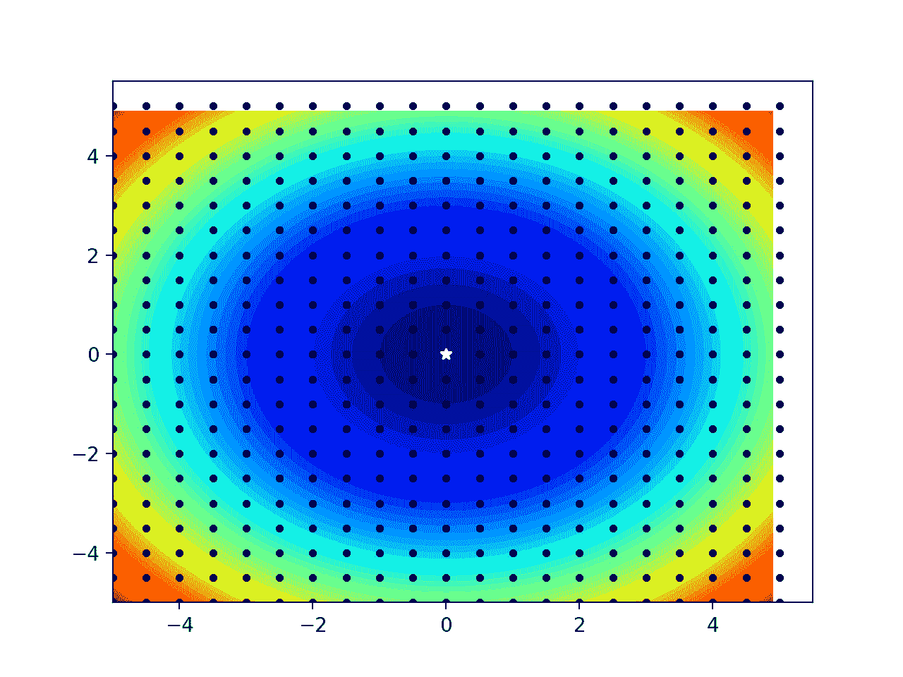

# 函数优化的随机搜索和网格搜索

> 原文：<https://machinelearningmastery.com/random-search-and-grid-search-for-function-optimization/>

最后更新于 2021 年 10 月 12 日

函数优化需要选择一种算法来有效地对搜索空间进行采样，并找到一个好的或最佳的解。

有许多算法可供选择，尽管为某个问题建立可行或可能的解决方案类型的基线很重要。这可以使用简单的优化算法来实现，例如**随机搜索**或**网格搜索**。

一个简单的优化算法所获得的结果在计算上是高效的，可以为更复杂的优化算法提供一个比较点。有时，发现简单算法可以获得最佳表现，特别是在那些有噪声或不平滑的问题上，以及那些领域专业知识通常会偏向于选择优化算法的问题上。

在本教程中，您将发现函数优化的简单算法。

完成本教程后，您将知道:

*   朴素算法在函数优化项目中的作用。
*   如何生成和评估函数优化的随机搜索？
*   如何为函数优化生成和评估网格搜索？

**用我的新书[机器学习优化](https://machinelearningmastery.com/optimization-for-machine-learning/)启动你的项目**，包括*分步教程*和所有示例的 *Python 源代码*文件。

Let’s get started.

函数优化的随机搜索和网格搜索
图片由 [Kosala Bandara](https://www.flickr.com/photos/kosalabandara/13900559649/) 提供，保留部分权利。

## 教程概述

本教程分为三个部分；它们是:

1.  朴素函数优化算法
2.  函数优化的随机搜索
3.  函数优化的网格搜索

## 朴素函数优化算法

有许多不同的算法可以用来优化，但是你怎么知道你得到的结果是否好呢？

解决这个问题的一种方法是使用简单的优化算法建立表现基线。

朴素优化算法是一种对正在优化的目标函数不做任何假设的算法。

它可以用很少的努力来应用，并且该算法获得的最佳结果可以用作比较更复杂算法的参考点。如果一个更复杂的算法平均来说不能达到比一个幼稚的算法更好的结果，那么它在你的问题上没有技巧，应该被放弃。

有两种朴素的算法可以用于函数优化；它们是:

*   随机搜索
*   Grid Search

这些算法被称为“T0”搜索“T1”算法，因为在基础上，优化可以被视为一个搜索问题。例如，找到最小化或最大化目标函数输出的输入。

还有一种可以使用的算法叫做“[穷举搜索](https://en.wikipedia.org/wiki/Brute-force_search)”，它列举了所有可能的输入。这在实践中很少使用，因为枚举所有可能的输入是不可行的，例如需要太多时间来运行。

然而，如果你发现自己正在处理一个优化问题，所有的输入都可以在合理的时间内被枚举和评估，这应该是你应该使用的默认策略。

让我们依次仔细看看每一个。

## 函数优化的随机搜索

[随机搜索](https://en.wikipedia.org/wiki/Random_search)也称为随机优化或随机采样。

随机搜索包括生成和评估目标函数的随机输入。它是有效的，因为它没有假设任何关于目标函数的结构。对于存在大量可能影响或影响优化策略的领域专业知识的问题，这可能是有益的，允许发现非直观的解决方案。

> …随机采样，使用伪随机数发生器在设计空间上简单地抽取 m 个随机样本。为了生成随机样本 x，我们可以从分布中独立地对每个变量进行采样。

—第 236 页，[优化算法](https://amzn.to/31J3I8l)，2019。

对于搜索空间中有噪声或不平滑(不连续)区域的高度复杂问题，随机搜索也可能是最佳策略，这些问题可能导致依赖可靠梯度的算法。

我们可以使用[伪随机数发生器](https://machinelearningmastery.com/how-to-generate-random-numbers-in-python/)从一个域中生成随机样本。每个变量都需要一个定义明确的界限或范围，并且可以从该范围中采样一个统一的随机值，然后进行评估。

生成随机样本在计算上是微不足道的，并且不占用太多内存，因此，生成大量输入样本，然后对它们进行评估可能是有效的。每个样本都是独立的，因此如果需要加速过程，可以并行评估样本。

下面的例子给出了一个简单的一维最小化目标函数的例子，并生成然后评估 100 个输入的随机样本。然后报告具有最佳表现的输入。

```py
# example of random search for function optimization
from numpy.random import rand

# objective function
def objective(x):
	return x**2.0

# define range for input
r_min, r_max = -5.0, 5.0
# generate a random sample from the domain
sample = r_min + rand(100) * (r_max - r_min)
# evaluate the sample
sample_eval = objective(sample)
# locate the best solution
best_ix = 0
for i in range(len(sample)):
	if sample_eval[i] < sample_eval[best_ix]:
		best_ix = i
# summarize best solution
print('Best: f(%.5f) = %.5f' % (sample[best_ix], sample_eval[best_ix]))
```

运行该示例会生成输入值的随机样本，然后对其进行评估。然后确定并报告最佳表现点。

**注**:考虑到算法或评估程序的随机性，或数值准确率的差异，您的[结果可能会有所不同](https://machinelearningmastery.com/different-results-each-time-in-machine-learning/)。考虑运行该示例几次，并比较平均结果。

在这种情况下，我们可以看到结果非常接近 0.0 的最佳输入。

```py
Best: f(-0.01762) = 0.00031
```

我们可以更新示例来绘制目标函数，并显示样本和最佳结果。下面列出了完整的示例。

```py
# example of random search for function optimization with plot
from numpy import arange
from numpy.random import rand
from matplotlib import pyplot

# objective function
def objective(x):
	return x**2.0

# define range for input
r_min, r_max = -5.0, 5.0
# generate a random sample from the domain
sample = r_min + rand(100) * (r_max - r_min)
# evaluate the sample
sample_eval = objective(sample)
# locate the best solution
best_ix = 0
for i in range(len(sample)):
	if sample_eval[i] < sample_eval[best_ix]:
		best_ix = i
# summarize best solution
print('Best: f(%.5f) = %.5f' % (sample[best_ix], sample_eval[best_ix]))
# sample input range uniformly at 0.1 increments
inputs = arange(r_min, r_max, 0.1)
# compute targets
results = objective(inputs)
# create a line plot of input vs result
pyplot.plot(inputs, results)
# plot the sample
pyplot.scatter(sample, sample_eval)
# draw a vertical line at the best input
pyplot.axvline(x=sample[best_ix], ls='--', color='red')
# show the plot
pyplot.show()
```

再次运行该示例会生成随机样本并报告最佳结果。

```py
Best: f(0.01934) = 0.00037
```

然后创建一个线图，显示目标函数、随机样本的形状，以及从样本中找到最佳结果的红线。


随机样本下一维目标函数的线图

## 函数优化的网格搜索

网格搜索也称为网格采样或全因子采样。

网格搜索包括为目标函数生成统一的网格输入。在一维中，这将是沿一条线均匀间隔的输入。在二维空间中，这将是一个由表面上均匀间隔的点组成的网格，对于更高的维度来说也是如此。

> 全因子采样计划在搜索空间上放置一个均匀间隔的点网格。这种方法易于实现，不依赖随机性，并且覆盖了空间，但是使用了大量的点。

—第 235 页，[优化算法](https://amzn.to/31J3I8l)，2019。

像随机搜索一样，网格搜索在通常使用领域专业知识来影响特定优化算法的选择的问题上特别有效。网格可以帮助快速识别搜索空间中值得更多关注的区域。

样本网格通常是均匀的，尽管并非必须如此。例如，可以使用具有统一间距的对数-10 标度，从而允许跨数量级进行采样。

缺点是网格的粗糙程度可能会跨越搜索空间中存在好的解决方案的整个区域，随着问题的输入数量(搜索空间的维度)的增加，这个问题会变得更糟。

通过选择均匀的点间距，然后依次枚举每个变量，并按所选间距递增每个变量，可以生成样本网格。

下面的示例给出了一个简单的二维最小化目标函数的示例，然后生成并评估两个输入变量间距为 0.1 的网格样本。然后报告具有最佳表现的输入。

```py
# example of grid search for function optimization
from numpy import arange
from numpy.random import rand

# objective function
def objective(x, y):
	return x**2.0 + y**2.0

# define range for input
r_min, r_max = -5.0, 5.0
# generate a grid sample from the domain
sample = list()
step = 0.1
for x in arange(r_min, r_max+step, step):
	for y in arange(r_min, r_max+step, step):
		sample.append([x,y])
# evaluate the sample
sample_eval = [objective(x,y) for x,y in sample]
# locate the best solution
best_ix = 0
for i in range(len(sample)):
	if sample_eval[i] < sample_eval[best_ix]:
		best_ix = i
# summarize best solution
print('Best: f(%.5f,%.5f) = %.5f' % (sample[best_ix][0], sample[best_ix][1], sample_eval[best_ix]))
```

运行该示例会生成一个输入值网格，然后对其进行评估。然后确定并报告最佳表现点。

**注**:考虑到算法或评估程序的随机性，或数值准确率的差异，您的[结果可能会有所不同](https://machinelearningmastery.com/different-results-each-time-in-machine-learning/)。考虑运行该示例几次，并比较平均结果。

在这种情况下，我们可以看到结果准确地找到了最优解。

```py
Best: f(-0.00000,-0.00000) = 0.00000
```

我们可以更新示例来绘制目标函数，并显示样本和最佳结果。下面列出了完整的示例。

```py
# example of grid search for function optimization with plot
from numpy import arange
from numpy import meshgrid
from numpy.random import rand
from matplotlib import pyplot

# objective function
def objective(x, y):
	return x**2.0 + y**2.0

# define range for input
r_min, r_max = -5.0, 5.0
# generate a grid sample from the domain
sample = list()
step = 0.5
for x in arange(r_min, r_max+step, step):
	for y in arange(r_min, r_max+step, step):
		sample.append([x,y])
# evaluate the sample
sample_eval = [objective(x,y) for x,y in sample]
# locate the best solution
best_ix = 0
for i in range(len(sample)):
	if sample_eval[i] < sample_eval[best_ix]:
		best_ix = i
# summarize best solution
print('Best: f(%.5f,%.5f) = %.5f' % (sample[best_ix][0], sample[best_ix][1], sample_eval[best_ix]))
# sample input range uniformly at 0.1 increments
xaxis = arange(r_min, r_max, 0.1)
yaxis = arange(r_min, r_max, 0.1)
# create a mesh from the axis
x, y = meshgrid(xaxis, yaxis)
# compute targets
results = objective(x, y)
# create a filled contour plot
pyplot.contourf(x, y, results, levels=50, cmap='jet')
# plot the sample as black circles
pyplot.plot([x for x,_ in sample], [y for _,y in sample], '.', color='black')
# draw the best result as a white star
pyplot.plot(sample[best_ix][0], sample[best_ix][1], '*', color='white')
# show the plot
pyplot.show()
```

再次运行该示例会生成网格示例并报告最佳结果。

```py
Best: f(0.00000,0.00000) = 0.00000
```

然后创建一个等高线图，显示目标函数的形状，网格样本显示为黑点，白星显示样本的最佳结果。

请注意，域边缘的一些黑点似乎不在图中；这只是我们选择如何绘制点的一个假象(例如，不以样本为中心)。



网格样本下一维目标函数的等高线图

## 进一步阅读

如果您想更深入地了解这个主题，本节将提供更多资源。

### 书

*   [优化算法](https://amzn.to/31J3I8l)，2019。

### 文章

*   [随机搜索，维基百科](https://en.wikipedia.org/wiki/Random_search)。
*   [超参数优化，维基百科](https://en.wikipedia.org/wiki/Hyperparameter_optimization)。
*   [蛮力搜索，维基百科](https://en.wikipedia.org/wiki/Brute-force_search)。

## 摘要

在本教程中，您发现了函数优化的简单算法。

具体来说，您了解到:

*   朴素算法在函数优化项目中的作用。
*   如何生成和评估函数优化的随机搜索？
*   如何为函数优化生成和评估网格搜索？

**你有什么问题吗？**
在下面的评论中提问，我会尽力回答。