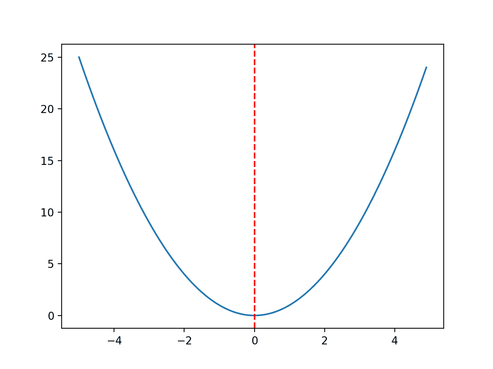
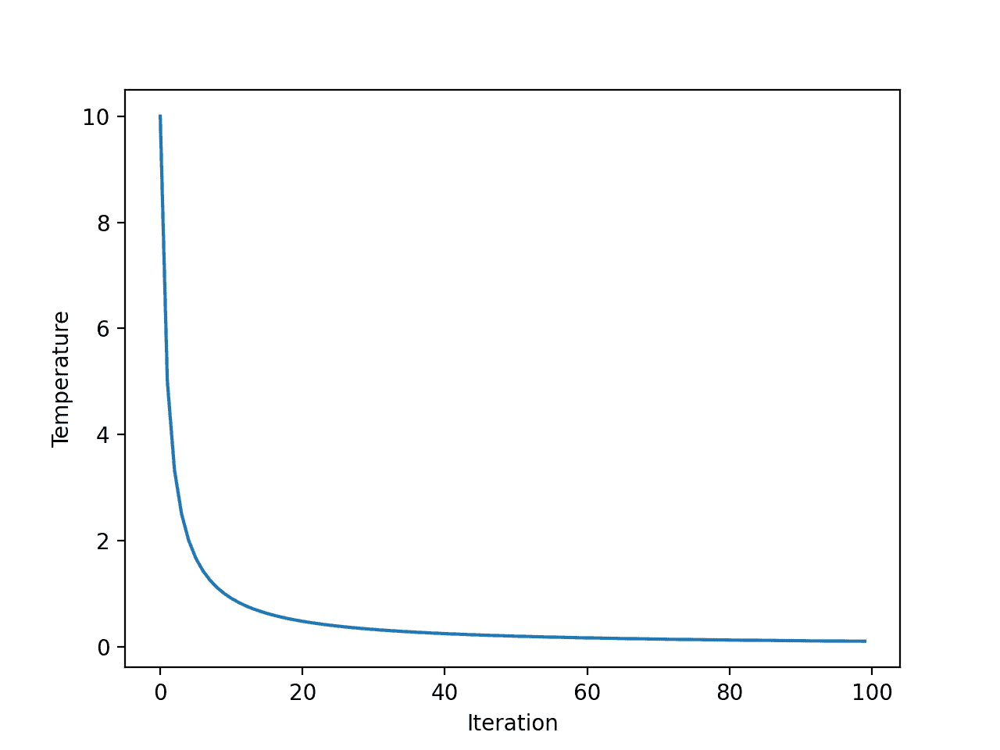
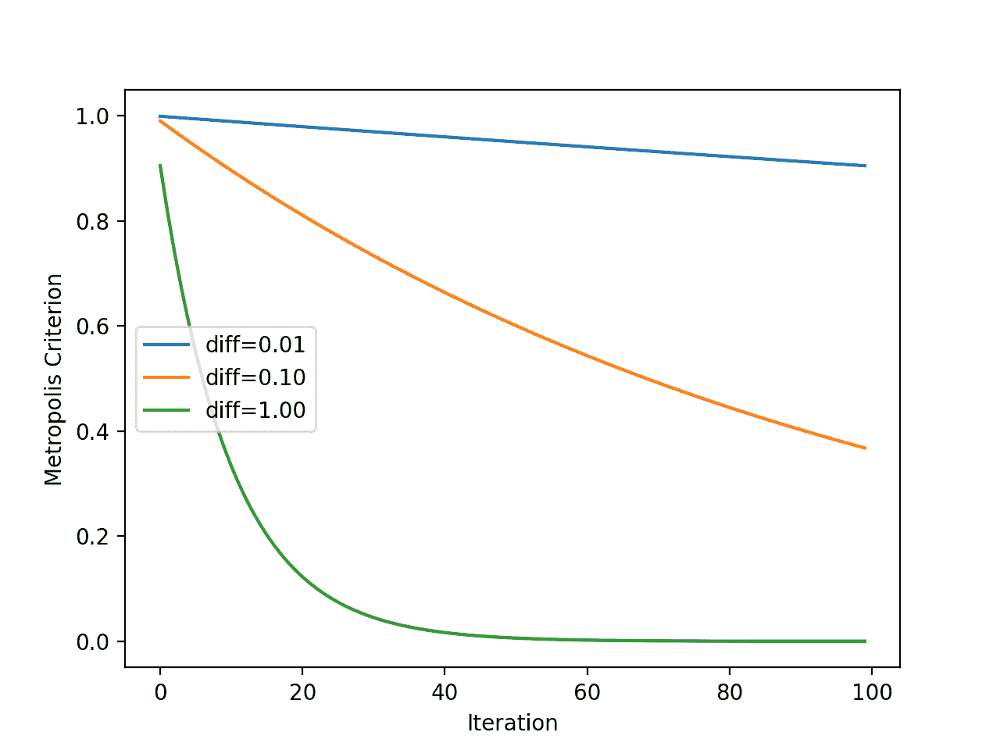
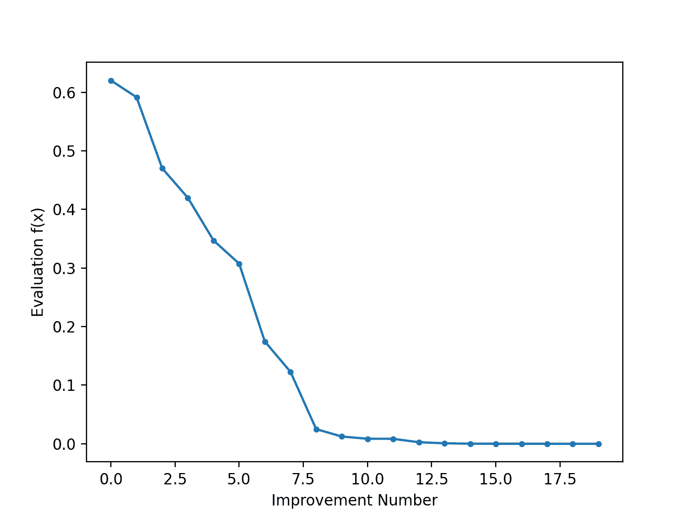

# Python 中从零开始的模拟退火

> 原文：<https://machinelearningmastery.com/simulated-annealing-from-scratch-in-python/>

最后更新于 2021 年 10 月 12 日

**模拟退火**是一种随机全局搜索优化算法。

这意味着它利用随机性作为搜索过程的一部分。这使得该算法适用于其他局部搜索算法运行不佳的非线性目标函数。

像随机爬山局部搜索算法一样，它修改单个解并搜索搜索空间的相对局部区域，直到找到局部最优解。与爬山算法不同，它可能接受更差的解作为当前的工作解。

接受更差解决方案的可能性在搜索开始时很高，并随着搜索的进行而降低，这使得算法有机会首先定位全局最优区域，避开局部最优区域，然后爬山到最优区域本身。

在本教程中，您将发现用于函数优化的模拟退火优化算法。

完成本教程后，您将知道:

*   模拟退火是一种用于函数优化的随机全局搜索算法。
*   如何在 Python 中从头实现模拟退火算法？
*   如何使用模拟退火算法并检验算法的结果？

我们开始吧。


Python 中的模拟退火从零开始
图片由 [Susanne Nilsson](https://www.flickr.com/photos/infomastern/14170987191/) 提供，保留部分权利。

## 教程概述

本教程分为三个部分；它们是:

1.  模拟退火
2.  实现模拟退火
3.  模拟退火工作示例

## 模拟退火

[模拟退火](https://en.wikipedia.org/wiki/Simulated_annealing)是一种随机全局搜索优化算法。

该算法的灵感来自冶金中的[退火，金属快速加热到高温，然后缓慢冷却，这增加了其强度，使其更容易处理。](https://en.wikipedia.org/wiki/Annealing_(metallurgy))

退火过程的工作原理是首先在高温下激发材料中的原子，让原子四处移动，然后慢慢降低它们的兴奋度，让原子落入一个新的、更稳定的构型。

> 当热的时候，材料中的原子更自由地移动，并且通过随机运动，趋向于稳定在更好的位置。缓慢冷却使材料进入有序的结晶状态。

—第 128 页，[优化算法](https://amzn.to/34Nb7nv)，2019。

模拟退火优化算法可以看作是随机爬山的一种改进形式。

随机爬山保持单个候选解，并在搜索空间中从候选中采取随机但受限大小的步骤。如果新点优于当前点，则当前点将被新点替换。这个过程持续固定的迭代次数。

模拟退火以同样的方式执行搜索。主要区别在于，有时会接受不如当前点(更差点)的新点。

从概率上来说，接受比当前解更差的解的可能性是搜索温度和该解比当前解差多少的函数。

> 该算法不同于爬山算法，它决定什么时候用新调整的子解 R 来替换原来的候选解 S。具体来说:如果 R 比 S 好，我们会一如既往地用 R 代替 S。但是如果 R 比 S 差，我们还是有一定概率用 R 代替 S

—第 23 页，[元试探法精要](https://amzn.to/3iQkCaw)，2011。

搜索的初始温度作为超参数提供，并随着搜索的进行而降低。在从初始值到非常低的值的搜索期间，可以使用许多不同的方案(退火计划)来降低温度，尽管通常将温度作为迭代次数的函数来计算。

计算温度的一个流行例子是所谓的“快速模拟退火”，计算如下

*   温度=初始温度/(迭代次数+ 1)

在迭代次数从零开始的情况下，我们给迭代次数加一，以避免被零除的错误。

较差解的接受使用温度以及较差解和当前解的目标函数评估之间的差异。使用此信息计算 0 到 1 之间的值，表示接受更差解决方案的可能性。然后使用随机数对该分布进行采样，如果小于该值，则意味着接受更差的解。

> 正是这种被称为 Metropolis 准则的接受概率，使得算法在温度较高时能够避开局部极小值。

—第 128 页，[优化算法](https://amzn.to/34Nb7nv)，2019。

这被称为大都市接受标准，最小化的计算如下:

*   标准= exp( -(目标(新)-目标(当前))/温度)

其中 *exp()* 为 [e](https://en.wikipedia.org/wiki/E_(mathematical_constant)) (数学常数)升至所提供参数的幂，而*目标(新)*、*目标(当前)*为新的(更差的)和当前候选解的目标函数评估。

结果是，糟糕的解决方案在搜索的早期被接受的可能性更大，而在搜索的后期被接受的可能性较小。其目的是，搜索开始时的高温将有助于搜索定位全局最优的盆地，而搜索后期的低温将有助于算法磨练全局最优。

> 温度开始很高，允许过程在搜索空间内自由移动，希望在这个阶段过程会找到一个具有最佳局部最小值的好区域。然后温度慢慢降低，减少随机性，迫使搜索收敛到最小值

—第 128 页，[优化算法](https://amzn.to/34Nb7nv)，2019。

现在我们已经熟悉了模拟退火算法，让我们看看如何从零开始实现它。

## 实现模拟退火

在本节中，我们将探索如何从零开始实现模拟退火优化算法。

首先，我们必须定义我们的目标函数和目标函数的每个输入变量的界限。目标函数只是一个 Python 函数，我们将其命名为*目标()*。边界将是一个 2D 数组，每个输入变量都有一个维度，定义了变量的最小值和最大值。

例如，一维目标函数和边界可以定义如下:

```py
# objective function
def objective(x):
	return 0

# define range for input
bounds = asarray([[-5.0, 5.0]])
```

接下来，我们可以将初始点生成为问题边界内的随机点，然后使用目标函数对其进行评估。

```py
...
# generate an initial point
best = bounds[:, 0] + rand(len(bounds)) * (bounds[:, 1] - bounds[:, 0])
# evaluate the initial point
best_eval = objective(best)
```

我们需要保持“*”当前的*”解决方案，这是搜索的重点，可能会被更好的解决方案所取代。

```py
...
# current working solution
curr, curr_eval = best, best_eval
```

现在，我们可以循环定义为“ *n_iterations* ”的算法的预定义迭代次数，例如 100 或 1000 次。

```py
...
# run the algorithm
for i in range(n_iterations):
	...
```

算法迭代的第一步是从当前工作解生成新的候选解，例如，采取一个步骤。

这需要一个预定义的“*步长*”参数，该参数与搜索空间的边界相关。我们将采用高斯分布的随机步长，其中平均值是当前点，标准偏差由“*步长*定义。这意味着大约 99%的步骤将在当前点的 *3 *步长*之内。

```py
...
# take a step
candidate = solution + randn(len(bounds)) * step_size
```

我们没有必要以这种方式采取措施。您可能希望在 0 和步长之间使用均匀分布。例如:

```py
...
# take a step
candidate = solution + rand(len(bounds)) * step_size
```

接下来，我们需要对其进行评估。

```py
...
# evaluate candidate point
candidate_eval = objective(candidate)
```

然后，我们需要检查这个新点的评估是否与当前最佳点一样好或更好，如果是，用这个新点替换我们当前的最佳点。

这与当前的工作解决方案是分开的，当前的工作解决方案是搜索的焦点。

```py
...
# check for new best solution
if candidate_eval < best_eval:
	# store new best point
	best, best_eval = candidate, candidate_eval
	# report progress
	print('>%d f(%s) = %.5f' % (i, best, best_eval))
```

接下来，我们需要准备替换当前的工作解决方案。

第一步是计算当前解与当前工作解的目标函数评估之差。

```py
...
# difference between candidate and current point evaluation
diff = candidate_eval - curr_eval
```

接下来，我们需要使用快速退火时间表计算当前温度，其中“ *temp* ”是作为参数提供的初始温度。

```py
...
# calculate temperature for current epoch
t = temp / float(i + 1)
```

然后，我们可以计算接受表现比当前工作解决方案更差的解决方案的可能性。

```py
...
# calculate metropolis acceptance criterion
metropolis = exp(-diff / t)
```

最后，如果新点具有更好的目标函数评估(差值为负)或者如果目标函数更差，我们可以接受新点作为当前工作解，但是我们可能决定接受它。

```py
...
# check if we should keep the new point
if diff < 0 or rand() < metropolis:
	# store the new current point
	curr, curr_eval = candidate, candidate_eval
```

就这样。

我们可以将这个模拟退火算法实现为一个可重用的函数，该函数以目标函数的名称、每个输入变量的边界、总迭代次数、步长和初始温度为参数，并返回找到的最佳解及其评估。

```py
# simulated annealing algorithm
def simulated_annealing(objective, bounds, n_iterations, step_size, temp):
	# generate an initial point
	best = bounds[:, 0] + rand(len(bounds)) * (bounds[:, 1] - bounds[:, 0])
	# evaluate the initial point
	best_eval = objective(best)
	# current working solution
	curr, curr_eval = best, best_eval
	# run the algorithm
	for i in range(n_iterations):
		# take a step
		candidate = curr + randn(len(bounds)) * step_size
		# evaluate candidate point
		candidate_eval = objective(candidate)
		# check for new best solution
		if candidate_eval < best_eval:
			# store new best point
			best, best_eval = candidate, candidate_eval
			# report progress
			print('>%d f(%s) = %.5f' % (i, best, best_eval))
		# difference between candidate and current point evaluation
		diff = candidate_eval - curr_eval
		# calculate temperature for current epoch
		t = temp / float(i + 1)
		# calculate metropolis acceptance criterion
		metropolis = exp(-diff / t)
		# check if we should keep the new point
		if diff < 0 or rand() < metropolis:
			# store the new current point
			curr, curr_eval = candidate, candidate_eval
	return [best, best_eval]
```

现在我们知道了如何在 Python 中实现模拟退火算法，让我们看看如何使用它来优化目标函数。

## 模拟退火工作示例

在本节中，我们将把模拟退火优化算法应用于目标函数。

首先，让我们定义我们的目标函数。

我们将使用一个简单的一维 x^2 目标函数，其边界为[-5，5]。

下面的示例定义了函数，然后为输入值网格创建了函数响应面的线图，并用红线标记 f(0.0) = 0.0 处的 optima

```py
# convex unimodal optimization function
from numpy import arange
from matplotlib import pyplot

# objective function
def objective(x):
	return x[0]**2.0

# define range for input
r_min, r_max = -5.0, 5.0
# sample input range uniformly at 0.1 increments
inputs = arange(r_min, r_max, 0.1)
# compute targets
results = [objective([x]) for x in inputs]
# create a line plot of input vs result
pyplot.plot(inputs, results)
# define optimal input value
x_optima = 0.0
# draw a vertical line at the optimal input
pyplot.axvline(x=x_optima, ls='--', color='red')
# show the plot
pyplot.show()
```

运行该示例会创建目标函数的线图，并清楚地标记函数最优值。



用红色虚线标记最优值的目标函数线图

在我们将优化算法应用到问题之前，让我们花点时间更好地理解接受标准。

首先，快速退火计划是迭代次数的指数函数。我们可以通过为每次算法迭代创建一个温度图来明确这一点。

我们将使用 10 和 100 次算法迭代的初始温度，两者都是任意选择的。

下面列出了完整的示例。

```py
# explore temperature vs algorithm iteration for simulated annealing
from matplotlib import pyplot
# total iterations of algorithm
iterations = 100
# initial temperature
initial_temp = 10
# array of iterations from 0 to iterations - 1
iterations = [i for i in range(iterations)]
# temperatures for each iterations
temperatures = [initial_temp/float(i + 1) for i in iterations]
# plot iterations vs temperatures
pyplot.plot(iterations, temperatures)
pyplot.xlabel('Iteration')
pyplot.ylabel('Temperature')
pyplot.show()
```

运行该示例计算每次算法迭代的温度，并创建算法迭代(x 轴)与温度(y 轴)的关系图。

我们可以看到，温度快速下降，呈指数下降，而不是线性下降，因此在 20 次迭代后，温度低于 1，并在剩余的搜索中保持较低。



快速退火温度对算法迭代的线图

接下来，我们可以更好地了解大都市的接受标准是如何随着温度的变化而变化的。

回想一下，该标准是温度的函数，但也是新点的客观评估与当前工作解决方案的差异的函数。因此，我们将绘制目标函数值中几个不同的*差异的标准，以查看其对接受概率的影响。*

下面列出了完整的示例。

```py
# explore metropolis acceptance criterion for simulated annealing
from math import exp
from matplotlib import pyplot
# total iterations of algorithm
iterations = 100
# initial temperature
initial_temp = 10
# array of iterations from 0 to iterations - 1
iterations = [i for i in range(iterations)]
# temperatures for each iterations
temperatures = [initial_temp/float(i + 1) for i in iterations]
# metropolis acceptance criterion
differences = [0.01, 0.1, 1.0]
for d in differences:
	metropolis = [exp(-d/t) for t in temperatures]
	# plot iterations vs metropolis
	label = 'diff=%.2f' % d
	pyplot.plot(iterations, metropolis, label=label)
# inalize plot
pyplot.xlabel('Iteration')
pyplot.ylabel('Metropolis Criterion')
pyplot.legend()
pyplot.show()
```

运行该示例使用每次迭代显示的温度(如前一节所示)计算每次算法迭代的大都会验收标准。

该图有三条线，表示新的更差解决方案和当前工作解决方案之间的三个差异。

我们可以看到，解越差(差异越大)，无论算法迭代如何，模型接受更差解的可能性就越小，正如我们可能预期的那样。我们还可以看到，在所有情况下，接受更差解的可能性随着算法迭代而降低。



大都市验收标准线图与模拟退火算法迭代

现在我们更熟悉温度和大都会验收标准随时间的变化，让我们将模拟退火应用于我们的测试问题。

首先，我们将播种伪随机数发生器。

一般来说，这不是必需的，但是在这种情况下，我希望确保每次运行算法时都得到相同的结果(相同的随机数序列)，这样我们就可以在以后绘制结果。

```py
...
# seed the pseudorandom number generator
seed(1)
```

接下来，我们可以定义搜索的配置。

在这种情况下，我们将搜索算法的 1000 次迭代，并使用 0.1 的步长。假设我们使用高斯函数来生成步长，这意味着大约 99%的所有步长将在给定点的(0.1 * 3)距离内，例如三个标准偏差。

我们还将使用 10.0 的初始温度。搜索过程对退火程序比对初始温度更敏感，因此，初始温度值几乎是任意的。

```py
...
n_iterations = 1000
# define the maximum step size
step_size = 0.1
# initial temperature
temp = 10
```

接下来，我们可以执行搜索并报告结果。

```py
...
# perform the simulated annealing search
best, score = simulated_annealing(objective, bounds, n_iterations, step_size, temp)
print('Done!')
print('f(%s) = %f' % (best, score))
```

将这些结合在一起，完整的示例如下所示。

```py
# simulated annealing search of a one-dimensional objective function
from numpy import asarray
from numpy import exp
from numpy.random import randn
from numpy.random import rand
from numpy.random import seed

# objective function
def objective(x):
	return x[0]**2.0

# simulated annealing algorithm
def simulated_annealing(objective, bounds, n_iterations, step_size, temp):
	# generate an initial point
	best = bounds[:, 0] + rand(len(bounds)) * (bounds[:, 1] - bounds[:, 0])
	# evaluate the initial point
	best_eval = objective(best)
	# current working solution
	curr, curr_eval = best, best_eval
	# run the algorithm
	for i in range(n_iterations):
		# take a step
		candidate = curr + randn(len(bounds)) * step_size
		# evaluate candidate point
		candidate_eval = objective(candidate)
		# check for new best solution
		if candidate_eval < best_eval:
			# store new best point
			best, best_eval = candidate, candidate_eval
			# report progress
			print('>%d f(%s) = %.5f' % (i, best, best_eval))
		# difference between candidate and current point evaluation
		diff = candidate_eval - curr_eval
		# calculate temperature for current epoch
		t = temp / float(i + 1)
		# calculate metropolis acceptance criterion
		metropolis = exp(-diff / t)
		# check if we should keep the new point
		if diff < 0 or rand() < metropolis:
			# store the new current point
			curr, curr_eval = candidate, candidate_eval
	return [best, best_eval]

# seed the pseudorandom number generator
seed(1)
# define range for input
bounds = asarray([[-5.0, 5.0]])
# define the total iterations
n_iterations = 1000
# define the maximum step size
step_size = 0.1
# initial temperature
temp = 10
# perform the simulated annealing search
best, score = simulated_annealing(objective, bounds, n_iterations, step_size, temp)
print('Done!')
print('f(%s) = %f' % (best, score))
```

运行该示例会报告搜索进度，包括迭代次数、函数输入以及每次检测到改进时目标函数的响应。

在搜索结束时，找到最佳解决方案并报告其评估。

**注**:考虑到算法或评估程序的随机性，或数值准确率的差异，您的[结果可能会有所不同](https://machinelearningmastery.com/different-results-each-time-in-machine-learning/)。考虑运行该示例几次，并比较平均结果。

在这种情况下，我们可以看到算法的 1000 次迭代中有大约 20 次改进，并且有一个非常接近最佳输入 0.0 的解，其计算结果为 f(0.0) = 0.0。

```py
>34 f([-0.78753544]) = 0.62021
>35 f([-0.76914239]) = 0.59158
>37 f([-0.68574854]) = 0.47025
>39 f([-0.64797564]) = 0.41987
>40 f([-0.58914623]) = 0.34709
>41 f([-0.55446029]) = 0.30743
>42 f([-0.41775702]) = 0.17452
>43 f([-0.35038542]) = 0.12277
>50 f([-0.15799045]) = 0.02496
>66 f([-0.11089772]) = 0.01230
>67 f([-0.09238208]) = 0.00853
>72 f([-0.09145261]) = 0.00836
>75 f([-0.05129162]) = 0.00263
>93 f([-0.02854417]) = 0.00081
>144 f([0.00864136]) = 0.00007
>149 f([0.00753953]) = 0.00006
>167 f([-0.00640394]) = 0.00004
>225 f([-0.00044965]) = 0.00000
>503 f([-0.00036261]) = 0.00000
>512 f([0.00013605]) = 0.00000
Done!
f([0.00013605]) = 0.000000
```

将搜索的进度作为一个线形图来回顾可能会很有趣，它显示了每次出现改进时最佳解决方案评估的变化。

我们可以更新*模拟退火()*来跟踪每次有改进的目标函数评估，并返回这个分数列表。

```py
# simulated annealing algorithm
def simulated_annealing(objective, bounds, n_iterations, step_size, temp):
	# generate an initial point
	best = bounds[:, 0] + rand(len(bounds)) * (bounds[:, 1] - bounds[:, 0])
	# evaluate the initial point
	best_eval = objective(best)
	# current working solution
	curr, curr_eval = best, best_eval
	# run the algorithm
	for i in range(n_iterations):
		# take a step
		candidate = curr + randn(len(bounds)) * step_size
		# evaluate candidate point
		candidate_eval = objective(candidate)
		# check for new best solution
		if candidate_eval < best_eval:
			# store new best point
			best, best_eval = candidate, candidate_eval
			# keep track of scores
			scores.append(best_eval)
			# report progress
			print('>%d f(%s) = %.5f' % (i, best, best_eval))
		# difference between candidate and current point evaluation
		diff = candidate_eval - curr_eval
		# calculate temperature for current epoch
		t = temp / float(i + 1)
		# calculate metropolis acceptance criterion
		metropolis = exp(-diff / t)
		# check if we should keep the new point
		if diff < 0 or rand() < metropolis:
			# store the new current point
			curr, curr_eval = candidate, candidate_eval
	return [best, best_eval, scores]
```

然后，我们可以创建这些分数的折线图，以查看搜索过程中发现的每个改进的目标函数的相对变化。

```py
...
# line plot of best scores
pyplot.plot(scores, '.-')
pyplot.xlabel('Improvement Number')
pyplot.ylabel('Evaluation f(x)')
pyplot.show()
```

将这些联系在一起，下面列出了在搜索过程中执行搜索并绘制改进解决方案的目标函数分数的完整示例。

```py
# simulated annealing search of a one-dimensional objective function
from numpy import asarray
from numpy import exp
from numpy.random import randn
from numpy.random import rand
from numpy.random import seed
from matplotlib import pyplot

# objective function
def objective(x):
	return x[0]**2.0

# simulated annealing algorithm
def simulated_annealing(objective, bounds, n_iterations, step_size, temp):
	# generate an initial point
	best = bounds[:, 0] + rand(len(bounds)) * (bounds[:, 1] - bounds[:, 0])
	# evaluate the initial point
	best_eval = objective(best)
	# current working solution
	curr, curr_eval = best, best_eval
	scores = list()
	# run the algorithm
	for i in range(n_iterations):
		# take a step
		candidate = curr + randn(len(bounds)) * step_size
		# evaluate candidate point
		candidate_eval = objective(candidate)
		# check for new best solution
		if candidate_eval < best_eval:
			# store new best point
			best, best_eval = candidate, candidate_eval
			# keep track of scores
			scores.append(best_eval)
			# report progress
			print('>%d f(%s) = %.5f' % (i, best, best_eval))
		# difference between candidate and current point evaluation
		diff = candidate_eval - curr_eval
		# calculate temperature for current epoch
		t = temp / float(i + 1)
		# calculate metropolis acceptance criterion
		metropolis = exp(-diff / t)
		# check if we should keep the new point
		if diff < 0 or rand() < metropolis:
			# store the new current point
			curr, curr_eval = candidate, candidate_eval
	return [best, best_eval, scores]

# seed the pseudorandom number generator
seed(1)
# define range for input
bounds = asarray([[-5.0, 5.0]])
# define the total iterations
n_iterations = 1000
# define the maximum step size
step_size = 0.1
# initial temperature
temp = 10
# perform the simulated annealing search
best, score, scores = simulated_annealing(objective, bounds, n_iterations, step_size, temp)
print('Done!')
print('f(%s) = %f' % (best, score))
# line plot of best scores
pyplot.plot(scores, '.-')
pyplot.xlabel('Improvement Number')
pyplot.ylabel('Evaluation f(x)')
pyplot.show()
```

运行该示例执行搜索并像以前一样报告结果。

创建一个线形图，显示爬山搜索过程中每项改进的目标函数评估。在搜索过程中，我们可以看到目标函数评估的大约 20 个变化，随着算法收敛到最优值，这些变化在开始时很大，在搜索结束时很小，甚至察觉不到。



模拟退火搜索过程中每次改进的目标函数评估线图

## 进一步阅读

如果您想更深入地了解这个主题，本节将提供更多资源。

### 报纸

*   [模拟退火优化](https://science.sciencemag.org/content/220/4598/671.abstract)，1983。

### 书

*   [优化算法](https://amzn.to/34Nb7nv)，2019。
*   [元试探法精要](https://amzn.to/3iQkCaw)，2011。

### 文章

*   [模拟退火，维基百科](https://en.wikipedia.org/wiki/Simulated_annealing)。
*   [退火(冶金)，维基百科](https://en.wikipedia.org/wiki/Annealing_(metallurgy))。

## 摘要

在本教程中，您发现了用于函数优化的模拟退火优化算法。

具体来说，您了解到:

*   模拟退火是一种用于函数优化的随机全局搜索算法。
*   如何在 Python 中从头实现模拟退火算法？
*   如何使用模拟退火算法并检验算法的结果？

**你有什么问题吗？**
在下面的评论中提问，我会尽力回答。