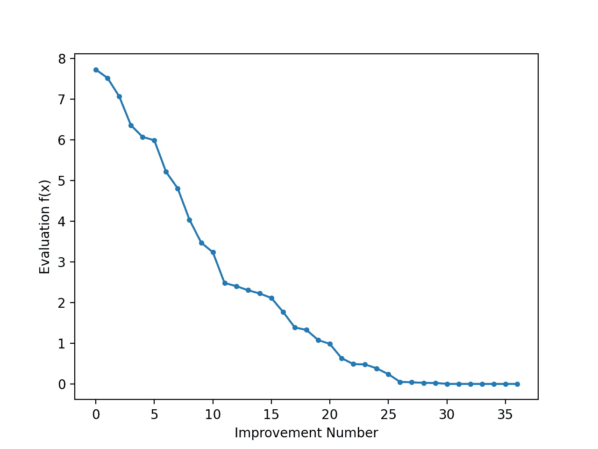
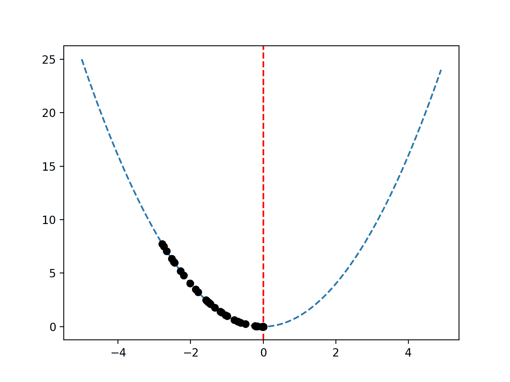

# Python 中从零开始的随机爬山

> 原文：<https://machinelearningmastery.com/stochastic-hill-climbing-in-python-from-scratch/>

最后更新于 2021 年 10 月 12 日

**随机爬山**是一种优化算法。

它利用随机性作为搜索过程的一部分。这使得该算法适用于其他局部搜索算法运行不佳的非线性目标函数。

它也是一种局部搜索算法，这意味着它修改单个解，并搜索搜索空间的相对局部区域，直到找到局部最优解。这意味着它适用于单峰优化问题或在应用全局优化算法后使用。

在本教程中，您将发现函数优化的爬山优化算法

完成本教程后，您将知道:

*   爬山是一种用于函数优化的随机局部搜索算法。
*   如何在 Python 中实现从零开始的爬山算法？
*   如何应用爬山算法并检验算法的结果？

**用我的新书[机器学习优化](https://machinelearningmastery.com/optimization-for-machine-learning/)启动你的项目**，包括*分步教程*和所有示例的 *Python 源代码*文件。

Let’s get started.

从零开始用 Python 随机爬山
图片由[约翰](https://www.flickr.com/photos/shebalso/149219486/)提供，保留部分权利。

## 教程概述

本教程分为三个部分；它们是:

1.  爬山算法
2.  爬山算法的实现
3.  应用爬山算法的示例

## 爬山算法

随机爬山算法是一种随机局部搜索优化算法。

它以一个初始点作为输入和一个步长，其中步长是搜索空间内的一个距离。

该算法将初始点作为当前最佳候选解，并在所提供点的步长距离内生成一个新点。计算生成的点，如果它等于或优于当前点，则将其作为当前点。

新点的生成使用随机性，通常称为随机爬山。这意味着，作为搜索的一部分，该算法可以跳过响应表面的颠簸、噪声、不连续或欺骗性区域。

> 随机爬山从上坡动作中随机选择；选择的概率可以随着上坡运动的陡度而变化。

—第 124 页，[人工智能:现代方法](https://amzn.to/2HYk1Xj)，2009 年。

重要的是接受具有相等评估的不同点，因为它允许算法继续探索搜索空间，例如跨越响应表面的平坦区域。限制这些所谓的“横向”*移动以避免无限循环可能也会有所帮助。*

 *> 如果我们总是在没有上坡移动时允许侧向移动，那么每当算法达到不是路肩的平坦局部最大值时，就会出现无限循环。一个常见的解决方案是限制允许的连续横向移动的次数。例如，我们可以允许多达 100 次连续的横向移动

—第 123 页，[人工智能:现代方法](https://amzn.to/2HYk1Xj)，2009 年。

该过程持续进行，直到满足停止条件，例如功能评估的最大数量或者在给定数量的功能评估内没有改善。

该算法得名于它将(随机地)爬上响应面的山丘到达局部最优解的事实。这并不意味着它只能用于目标函数最大化；这只是一个名字。事实上，通常情况下，我们将功能最小化，而不是最大化。

> 爬山搜索算法(最陡爬坡版本)[……]只是一个不断向增值方向移动的循环——即上坡。当到达没有邻居具有更高值的“峰值”时，它终止。

—第 122 页，[人工智能:现代方法](https://amzn.to/2HYk1Xj)，2009 年。

作为一种局部搜索算法，它会陷入局部最优。然而，多次重启可以允许算法定位全局最优。

> 随机重启爬山……从随机生成的初始状态开始进行一系列爬山搜索，直到找到目标。

—第 124 页，[人工智能:现代方法](https://amzn.to/2HYk1Xj)，2009 年。

步长必须足够大，以允许搜索空间中更好的邻近点被定位，但不能大到搜索跳出包含局部最优值的区域。

## 爬山算法的实现

在撰写本文时，SciPy 库没有提供随机爬山的实现。

尽管如此，我们可以自己实现。

首先，我们必须定义我们的目标函数和目标函数的每个输入变量的界限。目标函数只是一个 Python 函数，我们将其命名为*目标()*。边界将是一个 2D 数组，每个输入变量都有一个维度，定义了变量的最小值和最大值。

例如，一维目标函数和边界可以定义如下:

```py
# objective function
def objective(x):
	return 0

# define range for input
bounds = asarray([[-5.0, 5.0]])
```

接下来，我们可以将初始解生成为问题边界内的随机点，然后使用目标函数对其进行评估。

```py
...
# generate an initial point
solution = bounds[:, 0] + rand(len(bounds)) * (bounds[:, 1] - bounds[:, 0])
# evaluate the initial point
solution_eval = objective(solution)
```

现在，我们可以循环定义为“ *n_iterations* ”的算法的预定义迭代次数，例如 100 或 1000 次。

```py
...
# run the hill climb
for i in range(n_iterations):
	...
```

算法迭代的第一步是迈出一步。

这需要一个预定义的“*步长*”参数，该参数与搜索空间的边界相关。我们将采用高斯分布的随机步长，其中平均值是当前点，标准偏差由“*步长*定义。这意味着大约 99%的步骤将在当前点的(3 *步长)以内。

```py
...
# take a step
candidate = solution + randn(len(bounds)) * step_size
```

我们没有必要以这种方式采取措施。您可能希望在 0 和步长之间使用均匀分布。例如:

```py
...
# take a step
candidate = solution + rand(len(bounds)) * step_size
```

接下来我们需要用目标函数评估新的候选解。

```py
...
# evaluate candidate point
candidte_eval = objective(candidate)
```

然后，我们需要检查这个新点的评估是否与当前最佳点一样好或更好，如果是，用这个新点替换我们当前的最佳点。

```py
...
# check if we should keep the new point
if candidte_eval <= solution_eval:
	# store the new point
	solution, solution_eval = candidate, candidte_eval
	# report progress
	print('>%d f(%s) = %.5f' % (i, solution, solution_eval))
```

就这样。

我们可以将这个爬山算法实现为一个可重用的函数，该函数以目标函数的名称、每个输入变量的界限、总迭代次数和步骤作为参数，并返回找到的最佳解及其评估。

```py
# hill climbing local search algorithm
def hillclimbing(objective, bounds, n_iterations, step_size):
	# generate an initial point
	solution = bounds[:, 0] + rand(len(bounds)) * (bounds[:, 1] - bounds[:, 0])
	# evaluate the initial point
	solution_eval = objective(solution)
	# run the hill climb
	for i in range(n_iterations):
		# take a step
		candidate = solution + randn(len(bounds)) * step_size
		# evaluate candidate point
		candidte_eval = objective(candidate)
		# check if we should keep the new point
		if candidte_eval <= solution_eval:
			# store the new point
			solution, solution_eval = candidate, candidte_eval
			# report progress
			print('>%d f(%s) = %.5f' % (i, solution, solution_eval))
	return [solution, solution_eval]
```

现在我们知道了如何在 Python 中实现爬山算法，让我们看看如何使用它来优化目标函数。

## 应用爬山算法的示例

在本节中，我们将把爬山优化算法应用于目标函数。

首先，让我们定义我们的目标函数。

我们将使用一个简单的一维 x^2 目标函数，其边界为[-5，5]。

下面的示例定义了函数，然后为输入值网格创建了函数响应面的线图，并用红线标记 f(0.0) = 0.0 处的 optima。

```py
# convex unimodal optimization function
from numpy import arange
from matplotlib import pyplot

# objective function
def objective(x):
	return x[0]**2.0

# define range for input
r_min, r_max = -5.0, 5.0
# sample input range uniformly at 0.1 increments
inputs = arange(r_min, r_max, 0.1)
# compute targets
results = [objective([x]) for x in inputs]
# create a line plot of input vs result
pyplot.plot(inputs, results)
# define optimal input value
x_optima = 0.0
# draw a vertical line at the optimal input
pyplot.axvline(x=x_optima, ls='--', color='red')
# show the plot
pyplot.show()
```

运行该示例会创建目标函数的线图，并清楚地标记函数最优值。


用红色虚线标记最优值的目标函数线图

接下来，我们可以将爬山算法应用于目标函数。

首先，我们将播种伪随机数发生器。一般来说，这不是必需的，但是在这种情况下，我希望确保每次运行算法时都得到相同的结果(相同的随机数序列)，这样我们就可以在以后绘制结果。

```py
...
# seed the pseudorandom number generator
seed(5)
```

接下来，我们可以定义搜索的配置。

在这种情况下，我们将搜索算法的 1000 次迭代，并使用 0.1 的步长。假设我们使用高斯函数来生成步长，这意味着大约 99%的所有步长将在给定点的(0.1 * 3)距离内，例如三个标准偏差。

```py
...
n_iterations = 1000
# define the maximum step size
step_size = 0.1
```

接下来，我们可以执行搜索并报告结果。

```py
...
# perform the hill climbing search
best, score = hillclimbing(objective, bounds, n_iterations, step_size)
print('Done!')
print('f(%s) = %f' % (best, score))
```

将这些结合在一起，完整的示例如下所示。

```py
# hill climbing search of a one-dimensional objective function
from numpy import asarray
from numpy.random import randn
from numpy.random import rand
from numpy.random import seed

# objective function
def objective(x):
	return x[0]**2.0

# hill climbing local search algorithm
def hillclimbing(objective, bounds, n_iterations, step_size):
	# generate an initial point
	solution = bounds[:, 0] + rand(len(bounds)) * (bounds[:, 1] - bounds[:, 0])
	# evaluate the initial point
	solution_eval = objective(solution)
	# run the hill climb
	for i in range(n_iterations):
		# take a step
		candidate = solution + randn(len(bounds)) * step_size
		# evaluate candidate point
		candidte_eval = objective(candidate)
		# check if we should keep the new point
		if candidte_eval <= solution_eval:
			# store the new point
			solution, solution_eval = candidate, candidte_eval
			# report progress
			print('>%d f(%s) = %.5f' % (i, solution, solution_eval))
	return [solution, solution_eval]

# seed the pseudorandom number generator
seed(5)
# define range for input
bounds = asarray([[-5.0, 5.0]])
# define the total iterations
n_iterations = 1000
# define the maximum step size
step_size = 0.1
# perform the hill climbing search
best, score = hillclimbing(objective, bounds, n_iterations, step_size)
print('Done!')
print('f(%s) = %f' % (best, score))
```

运行该示例会报告搜索的进度，包括迭代次数、函数输入以及每次检测到改进时目标函数的响应。

在搜索结束时，找到最佳解决方案并报告其评估。

在这种情况下，我们可以看到算法的 1000 次迭代中有大约 36 次改进，并且有一个非常接近 0.0 的最优输入的解，其计算结果为 f(0.0) = 0.0。

```py
>1 f([-2.74290923]) = 7.52355
>3 f([-2.65873147]) = 7.06885
>4 f([-2.52197291]) = 6.36035
>5 f([-2.46450214]) = 6.07377
>7 f([-2.44740961]) = 5.98981
>9 f([-2.28364676]) = 5.21504
>12 f([-2.19245939]) = 4.80688
>14 f([-2.01001538]) = 4.04016
>15 f([-1.86425287]) = 3.47544
>22 f([-1.79913002]) = 3.23687
>24 f([-1.57525573]) = 2.48143
>25 f([-1.55047719]) = 2.40398
>26 f([-1.51783757]) = 2.30383
>27 f([-1.49118756]) = 2.22364
>28 f([-1.45344116]) = 2.11249
>30 f([-1.33055275]) = 1.77037
>32 f([-1.17805016]) = 1.38780
>33 f([-1.15189314]) = 1.32686
>36 f([-1.03852644]) = 1.07854
>37 f([-0.99135322]) = 0.98278
>38 f([-0.79448984]) = 0.63121
>39 f([-0.69837955]) = 0.48773
>42 f([-0.69317313]) = 0.48049
>46 f([-0.61801423]) = 0.38194
>48 f([-0.48799625]) = 0.23814
>50 f([-0.22149135]) = 0.04906
>54 f([-0.20017144]) = 0.04007
>57 f([-0.15994446]) = 0.02558
>60 f([-0.15492485]) = 0.02400
>61 f([-0.03572481]) = 0.00128
>64 f([-0.03051261]) = 0.00093
>66 f([-0.0074283]) = 0.00006
>78 f([-0.00202357]) = 0.00000
>119 f([0.00128373]) = 0.00000
>120 f([-0.00040911]) = 0.00000
>314 f([-0.00017051]) = 0.00000
Done!
f([-0.00017051]) = 0.000000
```

将搜索的进度作为一个线形图来回顾可能会很有趣，它显示了每次出现改进时最佳解决方案评估的变化。

我们可以更新*爬山()*来跟踪每次有改进的目标函数评估，并返回这个分数列表。

```py
# hill climbing local search algorithm
def hillclimbing(objective, bounds, n_iterations, step_size):
	# generate an initial point
	solution = bounds[:, 0] + rand(len(bounds)) * (bounds[:, 1] - bounds[:, 0])
	# evaluate the initial point
	solution_eval = objective(solution)
	# run the hill climb
	scores = list()
	scores.append(solution_eval)
	for i in range(n_iterations):
		# take a step
		candidate = solution + randn(len(bounds)) * step_size
		# evaluate candidate point
		candidte_eval = objective(candidate)
		# check if we should keep the new point
		if candidte_eval <= solution_eval:
			# store the new point
			solution, solution_eval = candidate, candidte_eval
			# keep track of scores
			scores.append(solution_eval)
			# report progress
			print('>%d f(%s) = %.5f' % (i, solution, solution_eval))
	return [solution, solution_eval, scores]
```

然后，我们可以创建这些分数的折线图，以查看搜索过程中发现的每个改进的目标函数的相对变化。

```py
...
# line plot of best scores
pyplot.plot(scores, '.-')
pyplot.xlabel('Improvement Number')
pyplot.ylabel('Evaluation f(x)')
pyplot.show()
```

将这些联系在一起，下面列出了在搜索过程中执行搜索并绘制改进解决方案的目标函数分数的完整示例。

```py
# hill climbing search of a one-dimensional objective function
from numpy import asarray
from numpy.random import randn
from numpy.random import rand
from numpy.random import seed
from matplotlib import pyplot

# objective function
def objective(x):
	return x[0]**2.0

# hill climbing local search algorithm
def hillclimbing(objective, bounds, n_iterations, step_size):
	# generate an initial point
	solution = bounds[:, 0] + rand(len(bounds)) * (bounds[:, 1] - bounds[:, 0])
	# evaluate the initial point
	solution_eval = objective(solution)
	# run the hill climb
	scores = list()
	scores.append(solution_eval)
	for i in range(n_iterations):
		# take a step
		candidate = solution + randn(len(bounds)) * step_size
		# evaluate candidate point
		candidte_eval = objective(candidate)
		# check if we should keep the new point
		if candidte_eval <= solution_eval:
			# store the new point
			solution, solution_eval = candidate, candidte_eval
			# keep track of scores
			scores.append(solution_eval)
			# report progress
			print('>%d f(%s) = %.5f' % (i, solution, solution_eval))
	return [solution, solution_eval, scores]

# seed the pseudorandom number generator
seed(5)
# define range for input
bounds = asarray([[-5.0, 5.0]])
# define the total iterations
n_iterations = 1000
# define the maximum step size
step_size = 0.1
# perform the hill climbing search
best, score, scores = hillclimbing(objective, bounds, n_iterations, step_size)
print('Done!')
print('f(%s) = %f' % (best, score))
# line plot of best scores
pyplot.plot(scores, '.-')
pyplot.xlabel('Improvement Number')
pyplot.ylabel('Evaluation f(x)')
pyplot.show()
```

运行该示例执行搜索并像以前一样报告结果。

创建一个线形图，显示爬山搜索过程中每项改进的目标函数评估。在搜索过程中，我们可以看到目标函数评估的大约 36 个变化，随着算法收敛到最优值，最初的变化很大，搜索结束时的变化非常小，甚至察觉不到。



爬山搜索过程中每次改进的目标函数评估线图

假设目标函数是一维的，我们可以像上面那样直接绘制响应面。

通过将搜索过程中找到的最佳候选解决方案绘制为响应面中的点来查看搜索进度可能会很有趣。我们期望一系列的点沿着响应面到达最优值。

这可以通过首先更新*爬山()*功能来跟踪每个最佳候选解在搜索过程中的位置，然后返回最佳解列表来实现。

```py
# hill climbing local search algorithm
def hillclimbing(objective, bounds, n_iterations, step_size):
	# generate an initial point
	solution = bounds[:, 0] + rand(len(bounds)) * (bounds[:, 1] - bounds[:, 0])
	# evaluate the initial point
	solution_eval = objective(solution)
	# run the hill climb
	solutions = list()
	solutions.append(solution)
	for i in range(n_iterations):
		# take a step
		candidate = solution + randn(len(bounds)) * step_size
		# evaluate candidate point
		candidte_eval = objective(candidate)
		# check if we should keep the new point
		if candidte_eval <= solution_eval:
			# store the new point
			solution, solution_eval = candidate, candidte_eval
			# keep track of solutions
			solutions.append(solution)
			# report progress
			print('>%d f(%s) = %.5f' % (i, solution, solution_eval))
	return [solution, solution_eval, solutions]
```

然后，我们可以创建目标函数响应面的图，并像以前一样标记 optima。

```py
...
# sample input range uniformly at 0.1 increments
inputs = arange(bounds[0,0], bounds[0,1], 0.1)
# create a line plot of input vs result
pyplot.plot(inputs, [objective([x]) for x in inputs], '--')
# draw a vertical line at the optimal input
pyplot.axvline(x=[0.0], ls='--', color='red')
```

最后，我们可以将通过搜索找到的候选解决方案的顺序绘制为黑点。

```py
...
# plot the sample as black circles
pyplot.plot(solutions, [objective(x) for x in solutions], 'o', color='black')
```

将这些联系在一起，下面列出了在目标函数的响应面上绘制改进解决方案序列的完整示例。

```py
# hill climbing search of a one-dimensional objective function
from numpy import asarray
from numpy import arange
from numpy.random import randn
from numpy.random import rand
from numpy.random import seed
from matplotlib import pyplot

# objective function
def objective(x):
	return x[0]**2.0

# hill climbing local search algorithm
def hillclimbing(objective, bounds, n_iterations, step_size):
	# generate an initial point
	solution = bounds[:, 0] + rand(len(bounds)) * (bounds[:, 1] - bounds[:, 0])
	# evaluate the initial point
	solution_eval = objective(solution)
	# run the hill climb
	solutions = list()
	solutions.append(solution)
	for i in range(n_iterations):
		# take a step
		candidate = solution + randn(len(bounds)) * step_size
		# evaluate candidate point
		candidte_eval = objective(candidate)
		# check if we should keep the new point
		if candidte_eval <= solution_eval:
			# store the new point
			solution, solution_eval = candidate, candidte_eval
			# keep track of solutions
			solutions.append(solution)
			# report progress
			print('>%d f(%s) = %.5f' % (i, solution, solution_eval))
	return [solution, solution_eval, solutions]

# seed the pseudorandom number generator
seed(5)
# define range for input
bounds = asarray([[-5.0, 5.0]])
# define the total iterations
n_iterations = 1000
# define the maximum step size
step_size = 0.1
# perform the hill climbing search
best, score, solutions = hillclimbing(objective, bounds, n_iterations, step_size)
print('Done!')
print('f(%s) = %f' % (best, score))
# sample input range uniformly at 0.1 increments
inputs = arange(bounds[0,0], bounds[0,1], 0.1)
# create a line plot of input vs result
pyplot.plot(inputs, [objective([x]) for x in inputs], '--')
# draw a vertical line at the optimal input
pyplot.axvline(x=[0.0], ls='--', color='red')
# plot the sample as black circles
pyplot.plot(solutions, [objective(x) for x in solutions], 'o', color='black')
pyplot.show()
```

运行该示例执行爬山搜索，并像以前一样报告结果。

如前所述，创建响应面图，显示熟悉的函数碗形，垂直红线标记函数的最佳值。

搜索过程中找到的最佳解决方案序列显示为黑点，沿碗形向下延伸至最佳位置。



目标函数的响应面，最佳解序列绘制为黑点

## 进一步阅读

如果您想更深入地了解这个主题，本节将提供更多资源。

### 教程

*   [如何爬坡机器学习测试集](https://machinelearningmastery.com/hill-climb-the-test-set-for-machine-learning/)

### 书

*   [人工智能:现代方法](https://amzn.to/2HYk1Xj)，2009。

### 蜜蜂

*   num py . random . rand API。
*   num py . random . rann API。
*   [numpy.random.seed API](https://numpy.org/doc/stable/reference/random/generated/numpy.random.seed.html) 。

### 文章

*   [爬山，维基百科](https://en.wikipedia.org/wiki/Hill_climbing)。
*   [随机爬山，维基百科](https://en.wikipedia.org/wiki/Stochastic_hill_climbing)。

## 摘要

在本教程中，您发现了函数优化的爬山优化算法

具体来说，您了解到:

*   爬山是一种用于函数优化的随机局部搜索算法。
*   如何在 Python 中实现从零开始的爬山算法？
*   如何应用爬山算法并检验算法的结果？

**你有什么问题吗？**
在下面的评论中提问，我会尽力回答。*