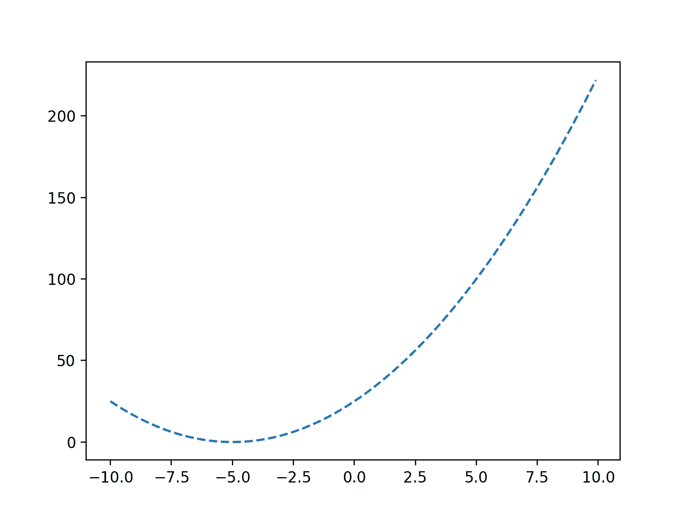
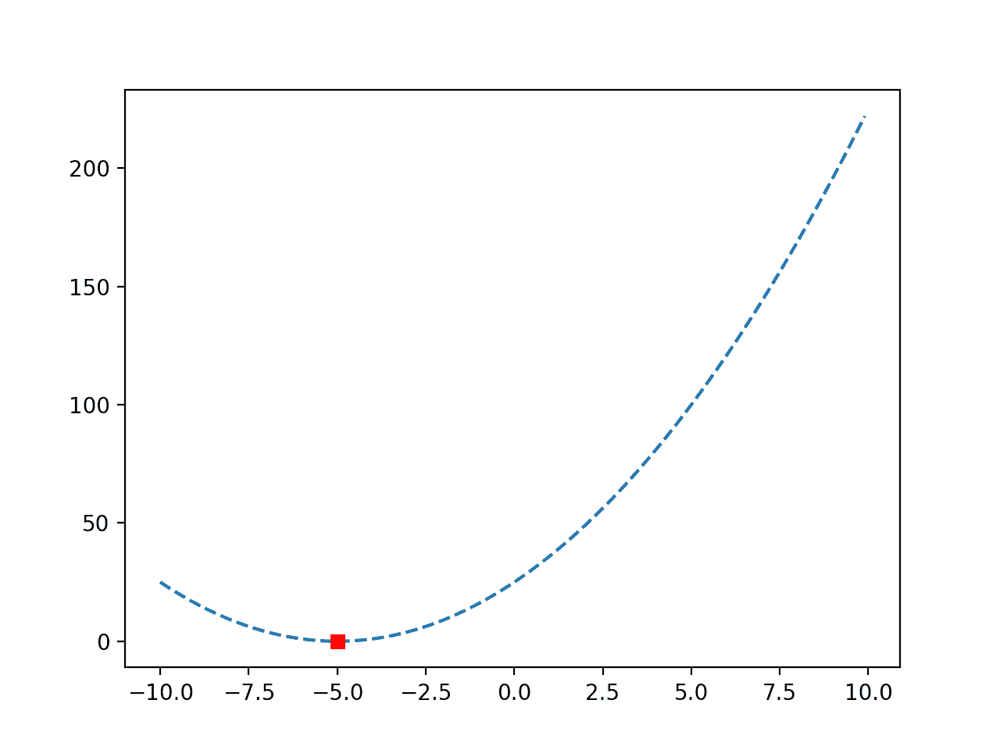
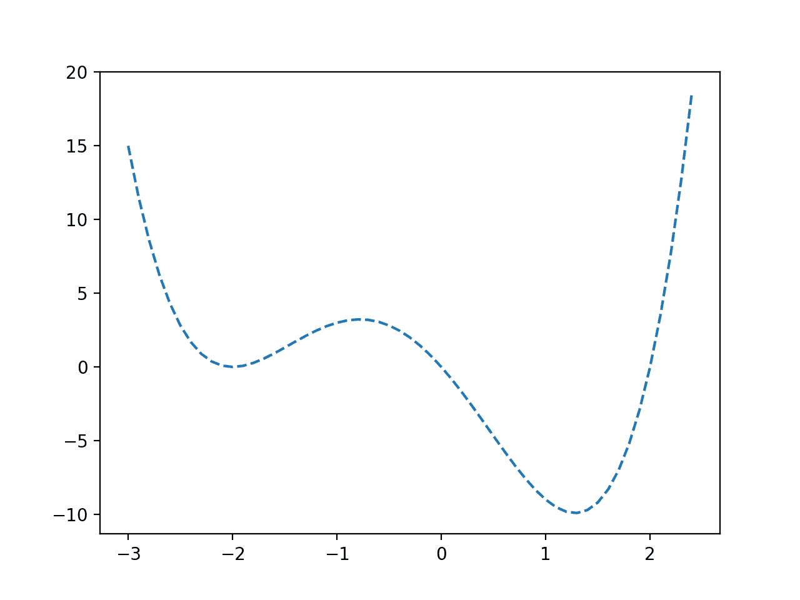

# Python 中的单变量函数优化

> 原文：<https://machinelearningmastery.com/univariate-function-optimization-in-python/>

最后更新于 2021 年 10 月 12 日

#### 如何优化一元函数？

单变量函数优化包括从目标函数中找到导致最优输出的函数的输入。

当用一个参数拟合模型或调整具有单个超参数的模型时，这是机器学习中常见的过程。

需要一种有效的算法来解决这种类型的优化问题，该算法将以目标函数的最少评估次数找到最佳解决方案，因为目标函数的每次评估可能在计算上很昂贵，例如在数据集上拟合和评估模型。

这不包括昂贵的网格搜索和随机搜索算法，而是支持像布伦特方法这样的高效算法。

在本教程中，您将发现如何在 Python 中执行单变量函数优化。

完成本教程后，您将知道:

*   单变量函数优化涉及到为一个目标函数寻找一个最佳输入，这个目标函数需要一个连续的参数。
*   如何对无约束凸函数进行单变量函数优化？
*   如何对无约束非凸函数进行单变量函数优化？

**用我的新书[机器学习优化](https://machinelearningmastery.com/optimization-for-machine-learning/)启动你的项目**，包括*分步教程*和所有示例的 *Python 源代码*文件。

Let’s get started.

Python 中的单变量函数优化
图片由 [Robert Haandrikman](https://www.flickr.com/photos/roberthaandrikman/36716679253/) 提供，保留部分权利。

## 教程概述

本教程分为三个部分；它们是:

1.  单变量函数优化
2.  凸单变量函数优化
3.  非凸单变量函数优化

## 单变量函数优化

我们可能需要找到采用单个参数的函数的最优值。

在机器学习中，这可能发生在许多情况下，例如:

*   寻找模型的系数以适合训练数据集。
*   找到导致最佳模型表现的单个超参数的值。

这被称为单变量函数优化。

我们可能对函数的最小结果或最大结果感兴趣，尽管这可以简化为最小化，因为最大化函数可以通过给函数的所有结果添加负号来最小化。

函数的输入可能有限制，也可能没有限制，即所谓的无约束或约束优化，我们假设输入的小变化对应于函数输出的小变化，例如，它是平滑的。

该功能可能有也可能没有单个 optima，尽管我们更希望它有一个 optima，并且该功能的形状看起来像一个大盆。如果是这种情况，我们知道我们可以在一个点对函数进行采样，并找到向下到达函数最小值的路径。从技术上讲，这被称为最小化的[凸函数](https://en.wikipedia.org/wiki/Convex_function)(最大化的凹函数)，不具有这种盆形的函数被称为非凸函数。

*   **凸目标函数**:有一个单一的最优值，目标函数的形状导致这个最优值。

然而，目标函数足够复杂，我们不知道导数，这意味着我们不能只使用微积分来分析计算梯度为零的函数的最小值或最大值。这被称为不可微函数。

虽然我们可能能够用候选值对函数进行采样，但我们不知道会产生最佳结果的输入。这可能是因为评估候选解决方案的成本很高。

因此，我们需要一种算法来有效地对函数的输入值进行采样。

解决单变量函数优化问题的一种方法是使用[布伦特方法](https://en.wikipedia.org/wiki/Brent%27s_method)。

Brent 的方法是一种优化算法，结合了二等分算法(Dekker 的方法)和[逆二次插值](https://en.wikipedia.org/wiki/Inverse_quadratic_interpolation)。它可用于有约束和无约束的单变量函数优化。

> 布伦特-德克尔方法是平分法的扩展。它是一种寻根算法，结合了割线法和逆二次插值的元素。它具有可靠和快速的收敛特性，是许多流行的数值优化包中首选的单变量优化算法。

—第 49-51 页，[优化算法](https://amzn.to/31J3I8l)，2019。

二等分算法使用输入值的括号(下括号和上括号)来分割输入域，将其二等分，以便定位 optima 在域中的位置，很像二分搜索法。德克尔的方法是连续域有效实现这一点的一种方法。

德克尔的方法被卡在非凸问题上。布伦特的方法修改了德克尔的方法，以避免陷入困境，并且还近似了目标函数的二阶导数(称为[割线方法](https://en.wikipedia.org/wiki/Secant_method)，以加速搜索。

因此，考虑到效率，布伦特的单变量函数优化方法通常优于大多数其他单变量函数优化算法。

Brent 的方法在 Python 中可以通过[minimum _ scalar()SciPy 函数](https://docs.scipy.org/doc/scipy/reference/generated/scipy.optimize.minimize_scalar.html)获得，该函数采用要最小化的函数的名称。如果目标函数被限制在一个范围内，可以通过“*边界*参数来指定。

它返回一个[optimizer result](https://docs.scipy.org/doc/scipy/reference/generated/scipy.optimize.OptimizeResult.html)对象，该对象是一个包含解决方案的字典。重要的是，' *x* 键总结了 optima 的输入，' *fun* 键总结了 optima 的功能输出，' *nfev* 总结了已执行的目标功能的评估数量。

```py
...
# minimize the function
result = minimize_scalar(objective, method='brent')
```

现在我们知道了如何在 Python 中执行单变量函数优化，让我们看一些例子。

## 凸单变量函数优化

在这一节中，我们将探讨如何解决一个凸的单变量函数优化问题。

首先，我们可以定义一个函数来实现我们的功能。

在这种情况下，我们将使用 x^2 函数的简单偏移版本，例如简单的[抛物线](https://en.wikipedia.org/wiki/Parabola) (u 形)函数。这是一个最小化目标函数，其最优值为-5.0。

```py
# objective function
def objective(x):
	return (5.0 + x)**2.0
```

我们可以用-10 到 10 的输入值绘制这个函数的粗网格，以了解目标函数的形状。

下面列出了完整的示例。

```py
# plot a convex target function
from numpy import arange
from matplotlib import pyplot

# objective function
def objective(x):
	return (5.0 + x)**2.0

# define range
r_min, r_max = -10.0, 10.0
# prepare inputs
inputs = arange(r_min, r_max, 0.1)
# compute targets
targets = [objective(x) for x in inputs]
# plot inputs vs target
pyplot.plot(inputs, targets, '--')
pyplot.show()
```

运行该示例使用目标函数评估指定范围内的输入值，并创建函数输入与函数输出的关系图。

我们可以看到函数的 U 形，目标是-5.0。



凸目标函数的线图

**注**:在一个真正的优化问题中，我们不可能这么容易地对目标函数进行这么多的评估。这个简单的函数用于演示目的，因此我们可以学习如何使用优化算法。

接下来，我们可以使用优化算法来寻找最优解。

```py
...
# minimize the function
result = minimize_scalar(objective, method='brent')
```

优化后，我们可以总结结果，包括 optima 的输入和评估以及定位 optima 所需的功能评估数量。

```py
...
# summarize the result
opt_x, opt_y = result['x'], result['fun']
print('Optimal Input x: %.6f' % opt_x)
print('Optimal Output f(x): %.6f' % opt_y)
print('Total Evaluations n: %d' % result['nfev'])
```

最后，我们可以再次绘制该函数，并标记 optima，以确认它位于我们期望该函数出现的位置。

```py
...
# define the range
r_min, r_max = -10.0, 10.0
# prepare inputs
inputs = arange(r_min, r_max, 0.1)
# compute targets
targets = [objective(x) for x in inputs]
# plot inputs vs target
pyplot.plot(inputs, targets, '--')
# plot the optima
pyplot.plot([opt_x], [opt_y], 's', color='r')
# show the plot
pyplot.show()
```

下面列出了优化无约束凸单变量函数的完整示例。

```py
# optimize convex objective function
from numpy import arange
from scipy.optimize import minimize_scalar
from matplotlib import pyplot

# objective function
def objective(x):
	return (5.0 + x)**2.0

# minimize the function
result = minimize_scalar(objective, method='brent')
# summarize the result
opt_x, opt_y = result['x'], result['fun']
print('Optimal Input x: %.6f' % opt_x)
print('Optimal Output f(x): %.6f' % opt_y)
print('Total Evaluations n: %d' % result['nfev'])
# define the range
r_min, r_max = -10.0, 10.0
# prepare inputs
inputs = arange(r_min, r_max, 0.1)
# compute targets
targets = [objective(x) for x in inputs]
# plot inputs vs target
pyplot.plot(inputs, targets, '--')
# plot the optima
pyplot.plot([opt_x], [opt_y], 's', color='r')
# show the plot
pyplot.show()
```

运行示例首先解决优化问题并报告结果。

**注**:考虑到算法或评估程序的随机性，或数值准确率的差异，您的[结果可能会有所不同](https://machinelearningmastery.com/different-results-each-time-in-machine-learning/)。考虑运行该示例几次，并比较平均结果。

在这种情况下，我们可以看到 optima 是在对输入为-5.0 的目标函数进行 10 次评估后找到的，目标函数值为 0.0。

```py
Optimal Input x: -5.000000
Optimal Output f(x): 0.000000
Total Evaluations n: 10
```

再次创建函数的图，这一次，optima 标记为红色方块。



带有最优标记的凸目标函数的线图

## 非凸单变量函数优化

凸函数是一个不像盆地的函数，这意味着它可能有一个以上的山或谷。

这使得定位全局最优值变得更具挑战性，因为多个山丘和山谷会导致搜索陷入停滞，并报告错误或局部最优值。

我们可以定义一个非凸单变量函数如下。

```py
# objective function
def objective(x):
	return (x - 2.0) * x * (x + 2.0)**2.0
```

我们可以对该函数进行采样，并创建输入值到目标值的线图。

下面列出了完整的示例。

```py
# plot a non-convex univariate function
from numpy import arange
from matplotlib import pyplot

# objective function
def objective(x):
	return (x - 2.0) * x * (x + 2.0)**2.0

# define range
r_min, r_max = -3.0, 2.5
# prepare inputs
inputs = arange(r_min, r_max, 0.1)
# compute targets
targets = [objective(x) for x in inputs]
# plot inputs vs target
pyplot.plot(inputs, targets, '--')
pyplot.show()
```

运行该示例使用目标函数评估指定范围内的输入值，并创建函数输入与函数输出的关系图。

我们可以看到一个函数在-2.0 左右有一个假最优值，在 1.2 左右有一个全局最优值。



非凸目标函数的线图

**注**:在一个真正的优化问题中，我们不可能这么容易地对目标函数进行这么多的评估。这个简单的函数用于演示目的，因此我们可以学习如何使用优化算法。

接下来，我们可以使用优化算法来寻找最优解。

和之前一样，我们可以调用[minimum _ scalar()函数](https://docs.scipy.org/doc/scipy/reference/generated/scipy.optimize.minimize_scalar.html)来优化函数，然后汇总结果，在线图上绘制最优值。

下面列出了无约束非凸单变量函数优化的完整例子。

```py
# optimize non-convex objective function
from numpy import arange
from scipy.optimize import minimize_scalar
from matplotlib import pyplot

# objective function
def objective(x):
	return (x - 2.0) * x * (x + 2.0)**2.0

# minimize the function
result = minimize_scalar(objective, method='brent')
# summarize the result
opt_x, opt_y = result['x'], result['fun']
print('Optimal Input x: %.6f' % opt_x)
print('Optimal Output f(x): %.6f' % opt_y)
print('Total Evaluations n: %d' % result['nfev'])
# define the range
r_min, r_max = -3.0, 2.5
# prepare inputs
inputs = arange(r_min, r_max, 0.1)
# compute targets
targets = [objective(x) for x in inputs]
# plot inputs vs target
pyplot.plot(inputs, targets, '--')
# plot the optima
pyplot.plot([opt_x], [opt_y], 's', color='r')
# show the plot
pyplot.show()
```

运行示例首先解决优化问题并报告结果。

在这种情况下，我们可以看到 optima 是在对输入约为 1.28 的目标函数进行 15 次评估后定位的，实现了约为-9.91 的目标函数值。

```py
Optimal Input x: 1.280776
Optimal Output f(x): -9.914950
Total Evaluations n: 15
```

再次创建函数的图，这一次，optima 标记为红色方块。

我们可以看到，优化没有被伪最优解欺骗，成功地找到了全局最优解。


带有最优标记的非凸目标函数的线图

## 进一步阅读

如果您想更深入地了解这个主题，本节将提供更多资源。

### 书

*   [优化算法](https://amzn.to/31J3I8l)，2019。

### 蜜蜂

*   [优化(scipy.optimize)](https://docs.scipy.org/doc/scipy/reference/tutorial/optimize.html) 。
*   [优化和寻根(scipy.optimize)](https://docs.scipy.org/doc/scipy/reference/optimize.html)
*   [scipy . optimize . minimum _ scalar API](https://docs.scipy.org/doc/scipy/reference/generated/scipy.optimize.minimize_scalar.html)。

### 文章

*   [布伦特的方法，维基百科](https://en.wikipedia.org/wiki/Brent%27s_method)。
*   [割线法，维基百科](https://en.wikipedia.org/wiki/Secant_method)。

## 摘要

在本教程中，您发现了如何在 Python 中执行单变量函数优化。

具体来说，您了解到:

*   单变量函数优化涉及到为一个目标函数寻找一个最佳输入，这个目标函数需要一个连续的参数。
*   如何对无约束凸函数进行单变量函数优化？
*   如何对无约束非凸函数进行单变量函数优化？

**你有什么问题吗？**
在下面的评论中提问，我会尽力回答。