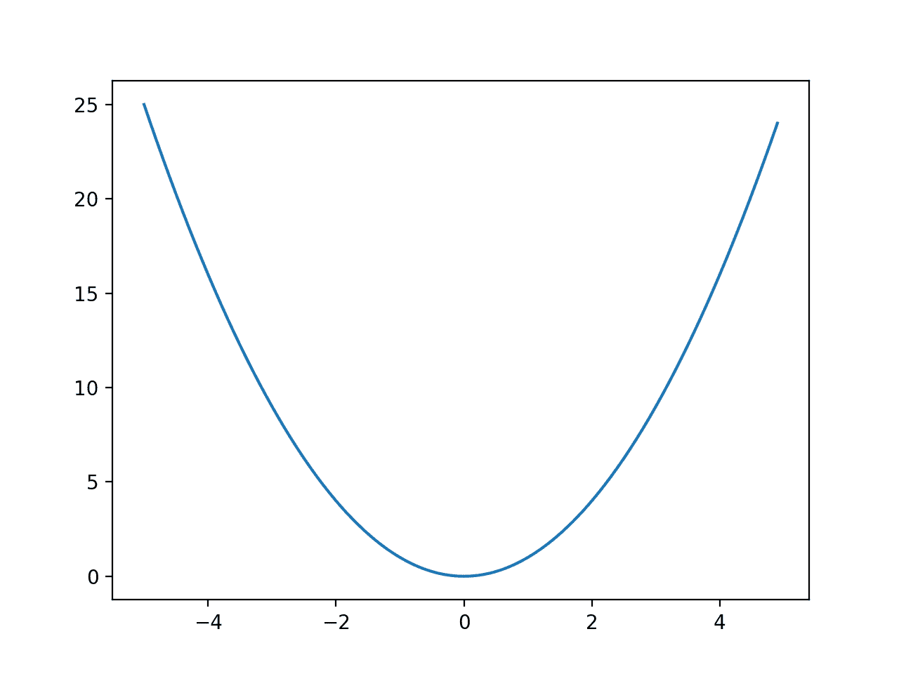
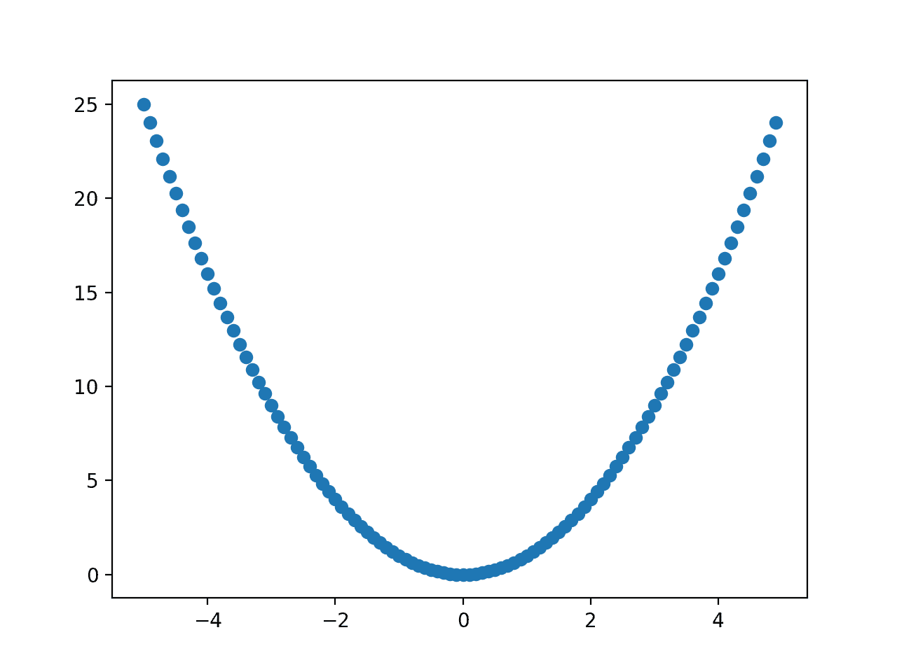
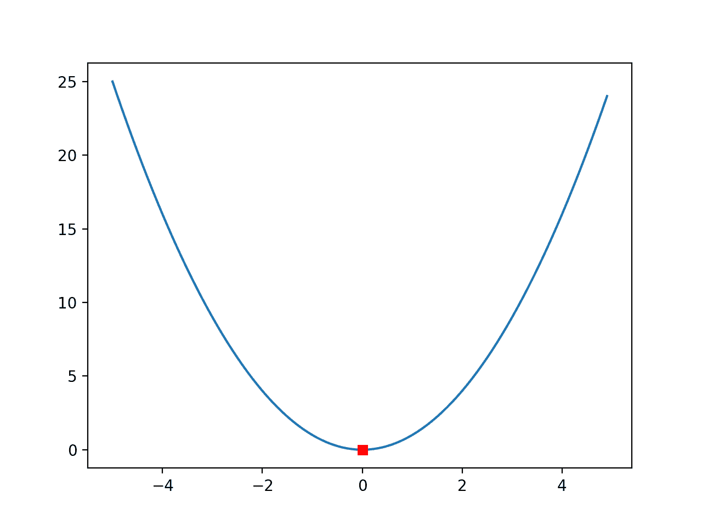
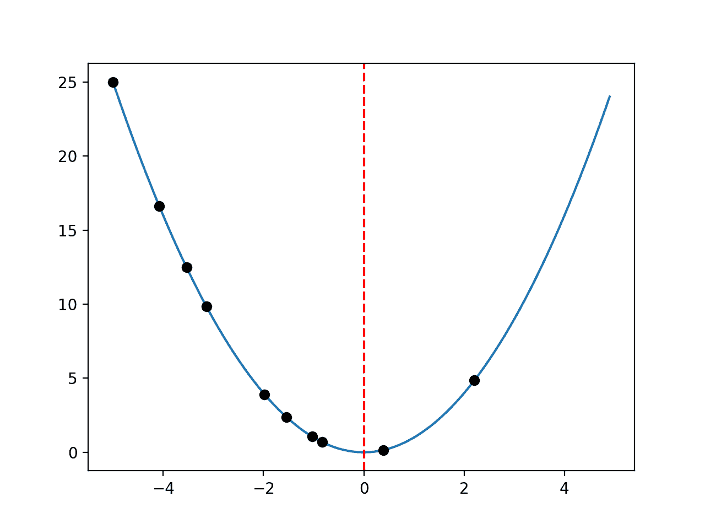
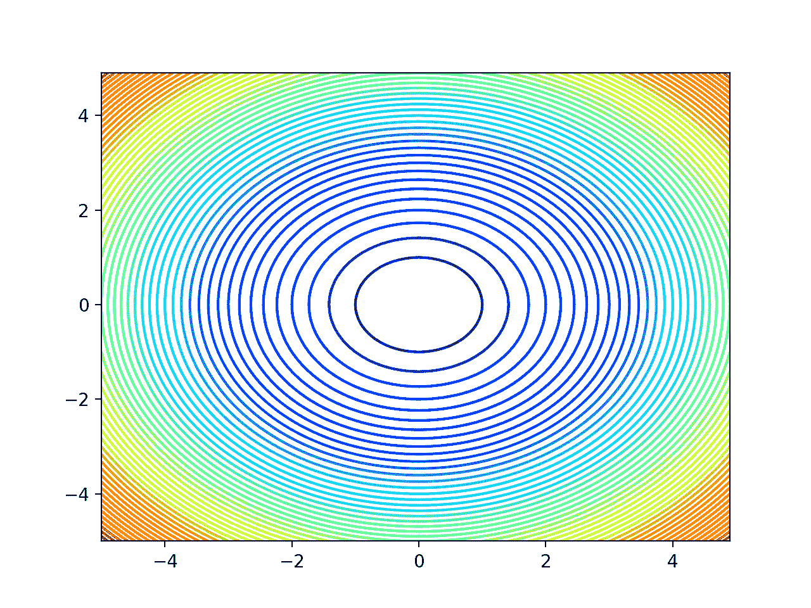
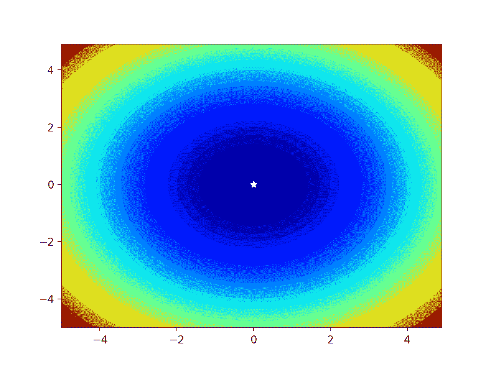
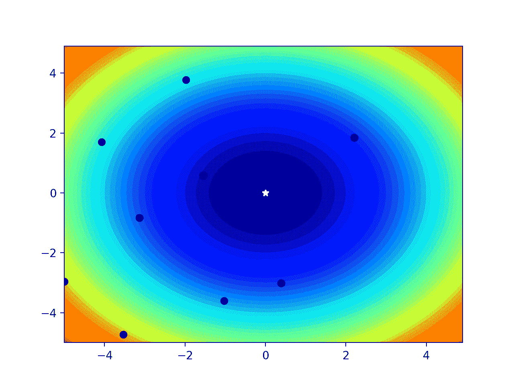
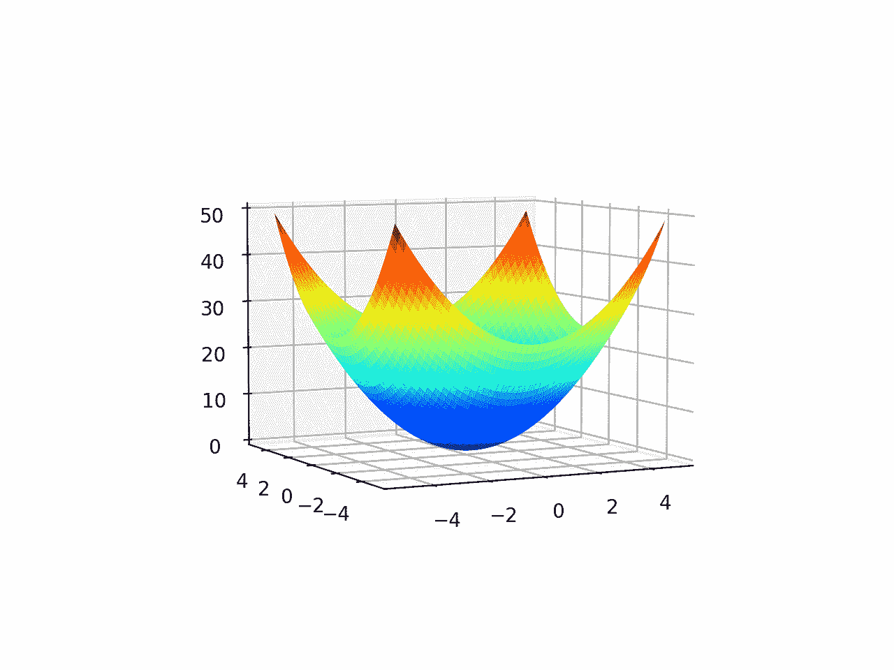

# Python 中函数优化的可视化

> 原文：<https://machinelearningmastery.com/visualization-for-function-optimization-in-python/>

最后更新于 2021 年 10 月 12 日

**函数优化**包括从目标函数中找到导致最优值的输入。

优化算法在输入变量的搜索空间中导航以定位最优解，并且目标函数的形状和算法在搜索空间中的行为在现实问题中都是不透明的。

因此，通常使用简单的低维函数来研究优化算法，这些函数可以很容易地直接可视化。此外，由优化算法产生的这些简单函数的输入空间中的样本可以用它们适当的上下文可视化。

低维函数和这些函数上的算法行为的可视化可以帮助开发直觉，这种直觉可以延续到以后更复杂的高维函数优化问题。

在本教程中，您将发现如何在 Python 中为函数优化创建可视化。

完成本教程后，您将知道:

*   可视化是研究函数优化算法的重要工具。
*   如何使用线图可视化一维函数和样本。
*   如何使用等高线和曲面图可视化二维函数和样本。

**用我的新书[机器学习优化](https://machinelearningmastery.com/optimization-for-machine-learning/)启动你的项目**，包括*分步教程*和所有示例的 *Python 源代码*文件。

Let’s get started.

Python 函数优化可视化
图片由 [Nathalie](https://www.flickr.com/photos/nathalie-photos/38815303871/) 提供，保留部分权利。

## 教程概述

本教程分为三个部分；它们是:

1.  函数优化可视化
2.  可视化 1D 函数优化
    1.  测试功能
    2.  样本测试功能
    3.  测试函数的线图
    4.  测试函数的散点图
    5.  带有标记 Optima 的线图
    6.  带有样本的线图
3.  可视化 2D 函数优化
    1.  测试功能
    2.  样本测试功能
    3.  测试函数的等高线图
    4.  测试函数的填充等高线图
    5.  用样本填充测试函数的等高线图
    6.  测试函数的曲面图

## 函数优化可视化

函数优化是一个数学领域，它涉及到寻找函数的输入，从而得到函数的最优输出，通常是最小值或最大值。

对于可以解析计算解的简单微分函数，优化可能是简单的。然而，我们在应用机器学习中感兴趣解决的大多数函数可能表现良好，也可能表现不佳，并且可能是复杂的、非线性的、多元的和不可微的。

因此，了解可用于解决函数优化问题的各种不同算法非常重要。

研究函数优化的一个重要方面是了解正在优化的目标函数，并了解优化算法随时间的行为。

开始进行函数优化时，可视化发挥了重要作用。

我们可以选择简单且易于理解的测试函数来研究优化算法。可以绘制这些简单的函数来理解目标函数的输入和目标函数的输出之间的关系，并突出显示山丘、山谷和最优区域。

此外，通过优化算法从搜索空间中选择的样本也可以绘制在目标函数图的顶部。这些算法行为图可以提供关于具体优化算法如何工作的洞察力和直觉，并在搜索空间中导航，从而可以概括未来的新问题。

通常，选择一维或二维函数来研究优化算法，因为它们很容易使用标准图来可视化，如线图和曲面图。我们将在本教程中探讨这两者。

首先，让我们探索如何可视化一维函数优化。

## 可视化 1D 函数优化

一维函数接受单个输入变量，并输出对该输入变量的评估。

输入变量通常是连续的，由实值浮点值表示。通常，输入域是不受约束的，尽管对于测试问题，我们强加了一个感兴趣的域。

### 测试功能

在这种情况下，我们将用一个简单的 x^2 目标函数来探索函数可视化:

*   f(x) = x^2

这有一个最佳值，输入 x=0.0，等于 0.0。

下面的示例实现了这个目标函数，并对单个输入进行了评估。

```py
# example of a 1d objective function

# objective function
def objective(x):
	return x**2.0

# evaluate inputs to the objective function
x = 4.0
result = objective(x)
print('f(%.3f) = %.3f' % (x, result))
```

运行该示例用目标函数计算值 4.0，等于 16.0。

```py
f(4.000) = 16.000
```

### 对测试函数进行采样

对于新函数，我们首先要做的是定义感兴趣的输入范围，并使用统一的网格对感兴趣的域进行采样。

此示例将为以后生成绘图提供基础。

在这种情况下，我们将在 x=-5.0 到 x=5.0 的最佳值周围定义一个感兴趣的域，并以 0.1 的增量对该范围内的值网格进行采样，例如-5.0、-4.9、-4.8 等。

```py
...
# define range for input
r_min, r_max = -5.0, 5.0
# sample input range uniformly at 0.1 increments
inputs = arange(r_min, r_max, 0.1)
# summarize some of the input domain
print(inputs[:5])
```

然后，我们可以评估样本中的每个 x 值。

```py
...
# compute targets
results = objective(inputs)
# summarize some of the results
print(results[:5])
```

最后，我们可以检查一些输入和它们相应的输出。

```py
...
# create a mapping of some inputs to some results
for i in range(5):
	print('f(%.3f) = %.3f' % (inputs[i], results[i]))
```

将这些联系在一起，下面列出了对输入空间进行采样并评估样本中所有点的完整示例。

```py
# sample 1d objective function
from numpy import arange

# objective function
def objective(x):
	return x**2.0

# define range for input
r_min, r_max = -5.0, 5.0
# sample input range uniformly at 0.1 increments
inputs = arange(r_min, r_max, 0.1)
# summarize some of the input domain
print(inputs[:5])
# compute targets
results = objective(inputs)
# summarize some of the results
print(results[:5])
# create a mapping of some inputs to some results
for i in range(5):
	print('f(%.3f) = %.3f' % (inputs[i], results[i]))
```

运行该示例首先生成一个输入点的统一样本，正如我们所期望的那样。

然后使用目标函数评估输入点，最后，我们可以看到目标函数的输入到输出的简单映射。

```py
[-5\.  -4.9 -4.8 -4.7 -4.6]
[25\.   24.01 23.04 22.09 21.16]
f(-5.000) = 25.000
f(-4.900) = 24.010
f(-4.800) = 23.040
f(-4.700) = 22.090
f(-4.600) = 21.160
```

既然我们对生成输入样本和用目标函数评估它们有了一些信心，我们就可以考虑生成函数的图了。

### 测试函数的线图

我们可以对输入空间进行随机采样，但是均匀的线或点网格的好处是可以用来生成平滑的图。

它是平滑的，因为输入空间中的点是从最小到最大排序的。这种排序很重要，因为我们期望(希望)目标函数的输出在值之间具有类似的平滑关系，例如，输入的微小变化导致函数输出的局部一致(平滑)变化。

在这种情况下，我们可以使用样本生成目标函数的线图，输入点(x)在图的 x 轴上，目标函数输出(结果)在图的 y 轴上。

```py
...
# create a line plot of input vs result
pyplot.plot(inputs, results)
# show the plot
pyplot.show()
```

将这些联系在一起，完整的示例如下所示。

```py
# line plot of input vs result for a 1d objective function
from numpy import arange
from matplotlib import pyplot

# objective function
def objective(x):
	return x**2.0

# define range for input
r_min, r_max = -5.0, 5.0
# sample input range uniformly at 0.1 increments
inputs = arange(r_min, r_max, 0.1)
# compute targets
results = objective(inputs)
# create a line plot of input vs result
pyplot.plot(inputs, results)
# show the plot
pyplot.show()
```

运行该示例会创建目标函数的线图。

我们可以看到函数有一个很大的 U 型，叫做[抛物线](https://en.wikipedia.org/wiki/Parabola)。这是学习曲线时常见的形状，例如学习[微积分](https://en.wikipedia.org/wiki/Calculus)。



一维函数的线图

### 测试函数的散点图

这条线是一个结构。它并不是真正的函数，只是函数的一个流畅的总结。永远记住这一点。

回想一下，事实上，我们在输入空间中生成了一个样本点，并对这些点进行了相应的评估。

因此，创建点的散点图会更准确；例如:

```py
# scatter plot of input vs result for a 1d objective function
from numpy import arange
from matplotlib import pyplot

# objective function
def objective(x):
	return x**2.0

# define range for input
r_min, r_max = -5.0, 5.0
# sample input range uniformly at 0.1 increments
inputs = arange(r_min, r_max, 0.1)
# compute targets
results = objective(inputs)
# create a scatter plot of input vs result
pyplot.scatter(inputs, results)
# show the plot
pyplot.show()
```

运行该示例会创建目标函数的散点图。

我们可以看到函数熟悉的形状，但是我们没有从直接绘制点中获得任何东西。

线和它提供的点之间的平滑插值更有用，因为我们可以在线的顶部绘制其他点，例如 optima 的位置或通过优化算法采样的点。



一维函数的散点图

### 带有标记 Optima 的线图

接下来，我们再画一次线图，这次画一个函数的已知最优值所在的点。

这在研究优化算法时很有帮助，因为我们可能想看看优化算法能多接近最优。

首先，我们必须定义 optima 的输入，然后评估该点以给出用于绘图的 x 轴和 y 轴值。

```py
...
# define the known function optima
optima_x = 0.0
optima_y = objective(optima_x)
```

然后我们可以用我们喜欢的任何形状或颜色来绘制这个点，在这个例子中，是一个红色的正方形。

```py
...
# draw the function optima as a red square
pyplot.plot([optima_x], [optima_y], 's', color='r')
```

将这些联系在一起，下面列出了用一个点突出显示的 optima 创建函数的线图的完整示例。

```py
# line plot of input vs result for a 1d objective function and show optima
from numpy import arange
from matplotlib import pyplot

# objective function
def objective(x):
	return x**2.0

# define range for input
r_min, r_max = -5.0, 5.0
# sample input range uniformly at 0.1 increments
inputs = arange(r_min, r_max, 0.1)
# compute targets
results = objective(inputs)
# create a line plot of input vs result
pyplot.plot(inputs, results)
# define the known function optima
optima_x = 0.0
optima_y = objective(optima_x)
# draw the function optima as a red square
pyplot.plot([optima_x], [optima_y], 's', color='r')
# show the plot
pyplot.show()
```

运行该示例会创建熟悉的函数线图，这一次，函数的最优值，例如导致函数最小输出的输入，用红色方块标记。



用红方标记最优值的一维函数的线图

这是一个非常简单的功能，optima 的红色方块很容易看到。

有时函数可能更复杂，有很多山丘和山谷，我们可能想让 optima 更明显。

在这种情况下，我们可以在整个情节上画一条垂直线。

```py
...
# draw a vertical line at the optimal input
pyplot.axvline(x=optima_x, ls='--', color='red')
```

将这些联系在一起，完整的示例如下所示。

```py
# line plot of input vs result for a 1d objective function and show optima as line
from numpy import arange
from matplotlib import pyplot

# objective function
def objective(x):
	return x**2.0

# define range for input
r_min, r_max = -5.0, 5.0
# sample input range uniformly at 0.1 increments
inputs = arange(r_min, r_max, 0.1)
# compute targets
results = objective(inputs)
# create a line plot of input vs result
pyplot.plot(inputs, results)
# define the known function optima
optima_x = 0.0
# draw a vertical line at the optimal input
pyplot.axvline(x=optima_x, ls='--', color='red')
# show the plot
pyplot.show()
```

运行该示例会创建相同的图，这一次绘制了一条红线，清楚地标记输入空间中标记 optima 的点。


用红线标记最优值的一维函数的线图

### 带有样本的线图

最后，我们可能想要绘制由优化算法选择的输入空间的样本。

我们将使用从输入域中抽取的随机点来模拟这些样本。

```py
...
# simulate a sample made by an optimization algorithm
seed(1)
sample = r_min + rand(10) * (r_max - r_min)
# evaluate the sample
sample_eval = objective(sample)
```

然后我们可以绘制这个样本，在这种情况下使用黑色小圆圈。

```py
...
# plot the sample as black circles
pyplot.plot(sample, sample_eval, 'o', color='black')
```

下面列出了创建函数线图的完整示例，其中 optima 用红线标记，算法示例用小黑点绘制。

```py
# line plot of domain for a 1d function with optima and algorithm sample
from numpy import arange
from numpy.random import seed
from numpy.random import rand
from matplotlib import pyplot

# objective function
def objective(x):
	return x**2.0

# define range for input
r_min, r_max = -5.0, 5.0
# sample input range uniformly at 0.1 increments
inputs = arange(r_min, r_max, 0.1)
# compute targets
results = objective(inputs)
# simulate a sample made by an optimization algorithm
seed(1)
sample = r_min + rand(10) * (r_max - r_min)
# evaluate the sample
sample_eval = objective(sample)
# create a line plot of input vs result
pyplot.plot(inputs, results)
# define the known function optima
optima_x = 0.0
# draw a vertical line at the optimal input
pyplot.axvline(x=optima_x, ls='--', color='red')
# plot the sample as black circles
pyplot.plot(sample, sample_eval, 'o', color='black')
# show the plot
pyplot.show()
```

运行该示例会创建域的线图，并像以前一样用红线标记 optima。

这一次，来自算法选择的域的样本(实际上是点的随机样本)用黑点绘制。

我们可以想象，当一个真正的优化算法从一个起点向下搜索时，它会在域中显示出缩小的点。



一维函数的线图，其中 Optima 用红线标记，样本用黑点表示

接下来，让我们看看如何为二维函数的优化执行类似的可视化。

## 可视化 2D 函数优化

二维函数是采用两个输入变量的函数，例如 *x* 和 *y* 。

### 测试功能

我们可以使用相同的 *x^2* 函数，并将其放大为二维函数；例如:

*   f(x，y) = x^2 + y^2

这有一个最佳值，输入为[x=0.0，y=0.0]，等于 0.0。

下面的示例实现了这个目标函数，并对单个输入进行了评估。

```py
# example of a 2d objective function

# objective function
def objective(x, y):
	return x**2.0 + y**2.0

# evaluate inputs to the objective function
x = 4.0
y = 4.0
result = objective(x, y)
print('f(%.3f, %.3f) = %.3f' % (x, y, result))
```

运行该示例计算点[x=4，y=4]，该点等于 32。

```py
f(4.000, 4.000) = 32.000
```

接下来，我们需要一种对域进行采样的方法，这样我们就可以依次对目标函数进行采样。

### 样本测试功能

对二维函数进行采样的一种常见方式是首先沿着每个变量 *x* 和 *y* 生成一个均匀的样本，然后使用这两个均匀的样本创建一个样本网格，称为[网格](https://www.mathworks.com/help/matlab/ref/meshgrid.html)。

这不是输入空间上的二维数组；相反，当两个二维数组一起使用时，它们定义了一个跨越两个输入变量的网格。

这是通过为每个 *y* 采样点复制整个 *x* 采样阵列，并为每个 *x* 采样点类似地复制整个 *y* 采样阵列来实现的。

这可以使用 [meshgrid() NumPy 功能](https://numpy.org/doc/stable/reference/generated/numpy.meshgrid.html)来实现；例如:

```py
...
# define range for input
r_min, r_max = -5.0, 5.0
# sample input range uniformly at 0.1 increments
xaxis = arange(r_min, r_max, 0.1)
yaxis = arange(r_min, r_max, 0.1)
# create a mesh from the axis
x, y = meshgrid(xaxis, yaxis)
# summarize some of the input domain
print(x[:5, :5])
```

然后，我们可以使用我们的目标函数来评估每对点。

```py
...
# compute targets
results = objective(x, y)
# summarize some of the results
print(results[:5, :5])
```

最后，我们可以回顾一些输入到相应输出值的映射。

```py
...
# create a mapping of some inputs to some results
for i in range(5):
	print('f(%.3f, %.3f) = %.3f' % (x[i,0], y[i,0], results[i,0]))
```

下面的例子演示了我们如何在二维输入空间和目标函数中创建一个统一的样本网格。

```py
# sample 2d objective function
from numpy import arange
from numpy import meshgrid

# objective function
def objective(x, y):
	return x**2.0 + y**2.0

# define range for input
r_min, r_max = -5.0, 5.0
# sample input range uniformly at 0.1 increments
xaxis = arange(r_min, r_max, 0.1)
yaxis = arange(r_min, r_max, 0.1)
# create a mesh from the axis
x, y = meshgrid(xaxis, yaxis)
# summarize some of the input domain
print(x[:5, :5])
# compute targets
results = objective(x, y)
# summarize some of the results
print(results[:5, :5])
# create a mapping of some inputs to some results
for i in range(5):
	print('f(%.3f, %.3f) = %.3f' % (x[i,0], y[i,0], results[i,0]))
```

运行示例首先总结网格中的一些点，然后对一些点进行目标函数评估。

最后，我们列举二维输入空间中的坐标及其相应的函数求值。

```py
[[-5\.  -4.9 -4.8 -4.7 -4.6]
 [-5\.  -4.9 -4.8 -4.7 -4.6]
 [-5\.  -4.9 -4.8 -4.7 -4.6]
 [-5\.  -4.9 -4.8 -4.7 -4.6]
 [-5\.  -4.9 -4.8 -4.7 -4.6]]
[[50\.   49.01 48.04 47.09 46.16]
 [49.01 48.02 47.05 46.1  45.17]
 [48.04 47.05 46.08 45.13 44.2 ]
 [47.09 46.1  45.13 44.18 43.25]
 [46.16 45.17 44.2  43.25 42.32]]
f(-5.000, -5.000) = 50.000
f(-5.000, -4.900) = 49.010
f(-5.000, -4.800) = 48.040
f(-5.000, -4.700) = 47.090
f(-5.000, -4.600) = 46.160
```

现在，我们已经熟悉了如何对输入空间进行采样和评估点，让我们看看如何绘制函数。

### 测试函数的等高线图

一个流行的二维函数图是[等高线图](https://en.wikipedia.org/wiki/Contour_line)。

此图为每个 x 和 y 坐标创建了目标函数输出的平面表示，其中颜色和轮廓线表示目标函数输出的相对值或高度。

这就像是一幅风景的等高线图，在这里山和谷是可以区分的。

这可以使用[轮廓()Matplotlib](https://matplotlib.org/3.1.1/api/_as_gen/matplotlib.pyplot.contour.html) 函数来实现，该函数将网格和网格的评估直接作为输入。

然后，我们可以指定要在轮廓上绘制的级别数和要使用的配色方案。在这种情况下，我们将使用 50 级和流行的“ *jet* ”配色方案，其中低级使用冷配色方案(蓝色)，高级使用热配色方案(红色)。

```py
...
# create a contour plot with 50 levels and jet color scheme
pyplot.contour(x, y, results, 50, alpha=1.0, cmap='jet')
# show the plot
pyplot.show()
```

将这些联系在一起，下面列出了创建二维目标函数等高线图的完整示例。

```py
# create a contour plot with 50 levels and jet color scheme
pyplot.contour(x, y, results, 50, alpha=1.0, cmap='jet')
# show the plot
pyplot.show()

Tying this together, the complete example of creating a contour plot of the two-dimensional objective function is listed below.

# contour plot for 2d objective function
from numpy import arange
from numpy import meshgrid
from matplotlib import pyplot

# objective function
def objective(x, y):
	return x**2.0 + y**2.0

# define range for input
r_min, r_max = -5.0, 5.0
# sample input range uniformly at 0.1 increments
xaxis = arange(r_min, r_max, 0.1)
yaxis = arange(r_min, r_max, 0.1)
# create a mesh from the axis
x, y = meshgrid(xaxis, yaxis)
# compute targets
results = objective(x, y)
# create a contour plot with 50 levels and jet color scheme
pyplot.contour(x, y, results, 50, alpha=1.0, cmap='jet')
# show the plot
pyplot.show()
```

运行该示例会创建等高线图。

我们可以看到，边缘周围曲面的弯曲部分越多，显示细节的轮廓越多，中间曲面的弯曲部分越少，轮廓越少。

我们可以看到，正如预期的那样，域的最低部分是中间。



二维目标函数的等高线图

### 测试函数的填充等高线图

这也有助于给轮廓之间的图着色，以显示更完整的表面。

同样，颜色只是简单的线性插值，不是真正的函数求值。对于更复杂的功能，这一点必须牢记在心，因为在这些功能中不会显示细节。

我们可以使用采用相同参数的函数的 [contourf()版本来填充等高线图。](https://matplotlib.org/3.1.1/api/_as_gen/matplotlib.pyplot.contourf.html)

```py
...
# create a filled contour plot with 50 levels and jet color scheme
pyplot.contourf(x, y, results, levels=50, cmap='jet')
```

我们也可以在剧情上展示 optima，在这种情况下是一颗白色的星星，它将在剧情最低部分的蓝色背景颜色中脱颖而出。

```py
...
# define the known function optima
optima_x = [0.0, 0.0]
# draw the function optima as a white star
pyplot.plot([optima_x[0]], [optima_x[1]], '*', color='white')
```

将这些联系在一起，下面列出了带有 optima 标记的填充等高线图的完整示例。

```py
# filled contour plot for 2d objective function and show the optima
from numpy import arange
from numpy import meshgrid
from matplotlib import pyplot

# objective function
def objective(x, y):
	return x**2.0 + y**2.0

# define range for input
r_min, r_max = -5.0, 5.0
# sample input range uniformly at 0.1 increments
xaxis = arange(r_min, r_max, 0.1)
yaxis = arange(r_min, r_max, 0.1)
# create a mesh from the axis
x, y = meshgrid(xaxis, yaxis)
# compute targets
results = objective(x, y)
# create a filled contour plot with 50 levels and jet color scheme
pyplot.contourf(x, y, results, levels=50, cmap='jet')
# define the known function optima
optima_x = [0.0, 0.0]
# draw the function optima as a white star
pyplot.plot([optima_x[0]], [optima_x[1]], '*', color='white')
# show the plot
pyplot.show()
```

运行该示例可以创建填充等高线图，从而更好地了解目标函数的形状。

然后，在[x=0，y=0]处的 optima 用白星清楚地标记出来。



白星标记最优值的二维目标函数的填充等高线图

### 用样本填充测试函数的等高线图

我们可能想展示一个优化算法的进展，以便在目标函数形状的上下文中了解它的行为。

在这种情况下，我们可以用输入空间中的随机坐标模拟优化算法选择的点。

```py
...
# simulate a sample made by an optimization algorithm
seed(1)
sample_x = r_min + rand(10) * (r_max - r_min)
sample_y = r_min + rand(10) * (r_max - r_min)
```

然后，这些点可以直接绘制成黑色圆圈，它们的背景颜色可以表示它们的相对质量。

```py
...
# plot the sample as black circles
pyplot.plot(sample_x, sample_y, 'o', color='black')
```

将这些联系在一起，下面列出了绘制了最优样本和输入样本的填充等高线图的完整示例。

```py
# filled contour plot for 2d objective function and show the optima and sample
from numpy import arange
from numpy import meshgrid
from numpy.random import seed
from numpy.random import rand
from matplotlib import pyplot

# objective function
def objective(x, y):
	return x**2.0 + y**2.0

# define range for input
r_min, r_max = -5.0, 5.0
# sample input range uniformly at 0.1 increments
xaxis = arange(r_min, r_max, 0.1)
yaxis = arange(r_min, r_max, 0.1)
# create a mesh from the axis
x, y = meshgrid(xaxis, yaxis)
# compute targets
results = objective(x, y)
# simulate a sample made by an optimization algorithm
seed(1)
sample_x = r_min + rand(10) * (r_max - r_min)
sample_y = r_min + rand(10) * (r_max - r_min)
# create a filled contour plot with 50 levels and jet color scheme
pyplot.contourf(x, y, results, levels=50, cmap='jet')
# define the known function optima
optima_x = [0.0, 0.0]
# draw the function optima as a white star
pyplot.plot([optima_x[0]], [optima_x[1]], '*', color='white')
# plot the sample as black circles
pyplot.plot(sample_x, sample_y, 'o', color='black')
# show the plot
pyplot.show()
```

运行该示例，我们可以看到像以前一样的填充等高线图，并标记了 optima。

我们现在可以看到绘制为黑点的样本，它们周围的颜色和相对于 optima 的距离给出了算法(在这种情况下是随机点)解决问题的接近程度。



标注最优值和输入样本的二维目标函数的填充等高线图

### 测试函数的曲面图

最后，我们可能想创建一个目标函数的三维图，以更全面地了解函数的曲率。

这可以使用 [plot_surface() Matplotlib 函数](https://matplotlib.org/mpl_toolkits/mplot3d/tutorial.html#mpl_toolkits.mplot3d.Axes3D.plot_surface)来实现，该函数与等高线图一样，直接采用网格和函数求值。

```py
...
# create a surface plot with the jet color scheme
figure = pyplot.figure()
axis = figure.gca(projection='3d')
axis.plot_surface(x, y, results, cmap='jet')
```

下面列出了创建曲面图的完整示例。

```py
# surface plot for 2d objective function
from numpy import arange
from numpy import meshgrid
from matplotlib import pyplot
from mpl_toolkits.mplot3d import Axes3D

# objective function
def objective(x, y):
	return x**2.0 + y**2.0

# define range for input
r_min, r_max = -5.0, 5.0
# sample input range uniformly at 0.1 increments
xaxis = arange(r_min, r_max, 0.1)
yaxis = arange(r_min, r_max, 0.1)
# create a mesh from the axis
x, y = meshgrid(xaxis, yaxis)
# compute targets
results = objective(x, y)
# create a surface plot with the jet color scheme
figure = pyplot.figure()
axis = figure.gca(projection='3d')
axis.plot_surface(x, y, results, cmap='jet')
# show the plot
pyplot.show()
```

运行该示例会创建目标函数的三维表面图。


二维目标函数的曲面图

此外，该图是交互式的，这意味着您可以使用鼠标拖动周围表面上的透视图，并从不同的角度查看它。



从二维目标函数的不同角度绘制曲面

## 进一步阅读

如果您想更深入地了解这个主题，本节将提供更多资源。

### 蜜蜂

*   [优化和寻根(scipy.optimize)](https://docs.scipy.org/doc/scipy/reference/optimize.html)
*   [优化(scipy.optimize)](https://docs.scipy.org/doc/scipy/reference/tutorial/optimize.html)
*   num py . mesh grid API。
*   [matplotlib . pyplot . contour API](https://matplotlib.org/3.1.1/api/_as_gen/matplotlib.pyplot.contour.html)。
*   [matplot lib . pyplot . contour API](https://matplotlib.org/3.1.1/api/_as_gen/matplotlib.pyplot.contourf.html)。
*   [mpl _ toolkits . mplot 3d . axes . plot _ surface API](https://matplotlib.org/mpl_toolkits/mplot3d/tutorial.html#mpl_toolkits.mplot3d.Axes3D.plot_surface)。

### 文章

*   [数学优化，维基百科](https://en.wikipedia.org/wiki/Mathematical_optimization)。
*   [抛物线，维基百科](https://en.wikipedia.org/wiki/Parabola)。

## 摘要

在本教程中，您发现了如何在 Python 中为函数优化创建可视化。

具体来说，您了解到:

*   可视化是研究函数优化算法的重要工具。
*   如何使用线图可视化一维函数和样本。
*   如何使用等高线和曲面图可视化二维函数和样本。

**你有什么问题吗？**
在下面的评论中提问，我会尽力回答。