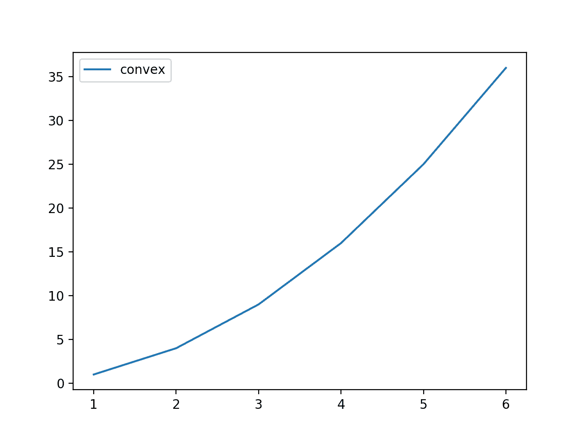
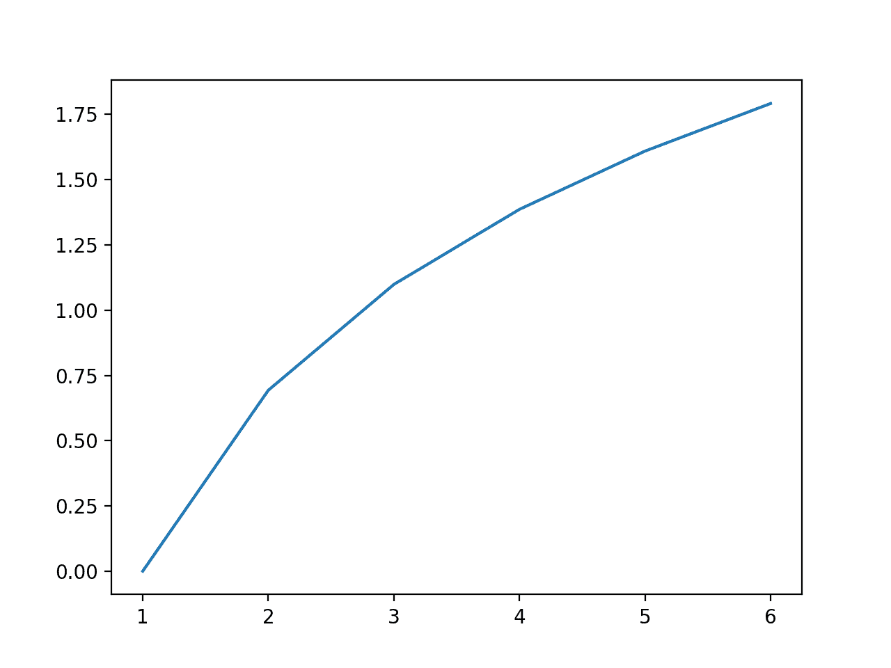

# 简评詹森不等式

> 原文：<https://machinelearningmastery.com/a-gentle-introduction-to-jensens-inequality/>

最后更新于 2020 年 7 月 31 日

在统计学和机器学习中，创建变量的线性变换或映射是很常见的。

一个例子是特征变量的线性缩放。我们有自然的直觉，即缩放值的平均值与平均原始变量值的缩放值相同。这是有道理的。

不幸的是，当使用变量的非线性变换时，当这种关系不再成立时，我们会带着这种直觉。修复这种直觉需要发现詹森不等式，它提供了一种用于函数分析、概率和统计的标准数学工具。

在本教程中，您将发现詹森不等式。

完成本教程后，您将知道:

*   线性映射的直觉不适用于非线性函数。
*   一个变量的凸函数的均值总是大于该变量的均值的函数，称为詹森不等式。
*   不等式的一个常见应用是在对一段时间间隔内的财务回报取平均值时比较算术平均值和几何平均值。

**用我的新书[机器学习概率](https://machinelearningmastery.com/probability-for-machine-learning/)启动你的项目**，包括*分步教程*和所有示例的 *Python 源代码*文件。

我们开始吧。

*   **2019 年 10 月更新**:修正小错别字(感谢安迪)。


简森不等式简介
图片由 [gérard](https://www.flickr.com/photos/35803445@N07/16265803880/) 提供，保留部分权利。

## 教程概述

本教程分为五个部分；它们是:

1.  线性映射的直觉
2.  非线性映射的不等式
3.  发展詹森不等式的直觉
4.  算术和几何平均示例
5.  其他应用

## 线性映射的直觉

我们经常使用一种叫做[线性映射](https://en.wikipedia.org/wiki/Linear_map)的线性函数来转换观测值。

常见的线性变换包括旋转、反射和缩放。

例如，我们可以将一组观察值乘以一个常数分数，以便对它们进行缩放。

然后，我们可以根据观察结果的真实价值和转变后的价值来工作和思考观察结果。这可能包括汇总统计数据的计算，如总和或平均值。

当处理原始状态和转换状态的观测值时，我们会有直觉，转换值的平均值与原始观测值的转换平均值相同。

我们可以用 *x* 表示我们的观测值， *f()* 表示我们的变换函数， *mean()* 表示计算平均值；这将是:

*   平均值(f(x)) == f(平均值(x))，对于线性 f()

我们的直觉是正确的，我们可以用一个小例子来证明。

考虑一个简单的游戏，我们掷一个公平的骰子，得到一个 1 到 6 之间的数字。我们可能每掷一次都有一个作为骰子点数 0.5 的回报。

这意味着滚动 3 将得到 3 * 0.5 或 1.5 的回报。

我们可以定义我们的支付函数如下:

```py
# transform function
def payoff(x):
	return x * 0.5
```

接下来，我们可以定义可能掷骰子的范围和每个值的变换:

```py
# each possible roll of the dice
outcomes = [1, 2, 3, 4, 5, 6]
# payoff for each roll
payoffs = [payoff(value) for value in outcomes]
```

接下来，我们可以计算支付值的平均值，例如转换后的观测值的平均值。

```py
# mean of the payoffs of the outcomes
v1 = mean(payoffs)
print(v1)
```

最后，我们可以比较平均掷骰子的收益，例如平均观测值的变换。

```py
# payoff of the mean outcome
v2 = payoff(mean(outcomes))
print(v2)
```

我们希望这两个计算值总是相同的。

将这些联系在一起，完整的示例如下所示。

```py
# example comparing mean linear transform vs linear transform for mean value
from numpy import mean

# transform function
def payoff(x):
	return x * 0.5

# each possible roll of the dice
outcomes = [1, 2, 3, 4, 5, 6]
# payoff for each roll
payoffs = [payoff(value) for value in outcomes]
# mean of the payoffs of the outcomes
v1 = mean(payoffs)
print(v1)
# payoff of the mean outcome
v2 = payoff(mean(outcomes))
print(v2)
```

运行该示例计算两个平均值(例如，线性收益的平均值和平均值的线性收益)，并确认它们在我们的示例中确实是等价的。

```py
1.75
1.75
```

问题是，当变换函数是非线性的时，这种直觉不成立。

## 非线性映射的不等式

非线性函数是指输入和输出之间不形成直线的关系。

相反，该关系是弯曲的，例如向上弯曲，称为[凸函数](https://en.wikipedia.org/wiki/Convex_function)，或者向下弯曲，称为凹函数。通过反转函数的输出，我们可以很容易地将一个凹函数转换成一个凸函数，因此，我们通常谈论的凸函数的增长速度超过了线性。

例如，将输入平方或 *f(x) == x^2* 的变换是二次凸函数。这是因为随着 *x* 的增加，变换函数 *f()* 的输出随着输入的平方而增加。

我们的直觉认为，变换后的观测值的平均值与平均观测值的变换相同，但这不适用于凸函数。

相反，如果变换函数是凸的并且观测值不是常数，观测值的平均变换*平均值(f(x))* 总是大于平均观测值的变换 *f(平均值(x))* 。我们可以这样说:

*   平均值(f(x)) >= f(平均值(x))，对于凸 f()而言，x 不是常数

这个数学规则最早是由[约翰·延森](https://en.wikipedia.org/wiki/Johan_Jensen_(mathematician))描述的，通常被称为[詹森不等式](https://en.wikipedia.org/wiki/Jensen%27s_inequality)。

自然，如果转换函数是凹的，大于号(>)将变成小于号(

*   平均值(f(x)) <= f(平均值(x))，对于凹面 f()

这一开始并不直观，有着有趣的含义。

## 发展詹森不等式的直觉

我们可以试着用一个有效的例子来证明詹森的不等式直觉。

我们的掷骰子和线性支付函数的例子可以更新为具有非线性支付。

在这种情况下，我们可以使用 *x^2* 凸函数来支付每次掷骰子的结果。例如，掷骰子三次的结果将有回报 *3^2* 或 9。更新后的*支付()*功能如下。

```py
# transform function
def payoff(x):
	return x**2
```

我们可以计算每次掷骰子的收益，并将结果绘制成结果与收益的线图。

这将使我们对所有可能结果的支付函数的非线性或凸性有一种直觉。

下面列出了完整的示例。

```py
# plot of convex payoff function
from matplotlib import pyplot

# transform function
def payoff(x):
	return x**2

# each possible roll of the dice
outcomes = [1, 2, 3, 4, 5, 6]
# payoff for each roll
payoffs = [payoff(value) for value in outcomes]
# plot convex payoff function
pyplot.plot(outcomes, payoffs, label='convex')
pyplot.legend()
pyplot.show()
```

运行该示例计算每次掷骰子的收益，并绘制掷骰子结果与收益的关系图。

该图显示了所有可能结果的支付函数的凸形。



骰子滚动结果与凸支付函数的线图

詹森不等式表明，收益的平均值总是大于或等于平均结果的收益。

回想一下，可能结果的范围是[1，2，3，4，5，6]，可能结果的平均值是 3.5，因此我们知道平均结果的回报是 3.5^2 或 12.25。我们的直觉希望我们相信收益的平均值也是 12.25 左右**，但是这种直觉是错误的**。

为了证实我们的直觉是错误的，让我们将这两个值与所有可能的结果进行比较。

下面列出了完整的示例。

```py
# example comparing mean convex transform vs convex transform for mean value
from numpy import mean

# transform function
def payoff(x):
	return x**2

# each possible roll of the dice
outcomes = [1, 2, 3, 4, 5, 6]
# payoff for each roll
payoffs = [payoff(value) for value in outcomes]
# mean of the payoffs of the outcomes
v1 = mean(payoffs)
print(v1)
# payoff of the mean outcome
v2 = payoff(mean(outcomes))
print(v2)
```

运行这个例子，我们可以看到我们对于平均结果的回报的直觉是正确的；如我们所料，该值为 12.25。

我们可以看到直觉崩溃，平均支付值略高于 12.25。

回想一下，平均值([算术平均值](https://en.wikipedia.org/wiki/Arithmetic_mean))实际上只是值的总和，由值的数量归一化。现在考虑一下，如果收益，特别是[1，4，9，16，25，36]，加起来是 91，我们对更大的值求和。这拉高了我们的平均值。

直觉告诉我们，因为函数是凸的，所以平均来说，转换后的值总是大于原始结果值，或者我们想要使用的任何其他求和类型的运算。

```py
15.166666666666666
12.25
```

还有一个步骤可能有助于直觉，那就是取样的想法。

我们看了一个计算所有可能结果的回报的例子，但这是不寻常的。相反，我们更有可能从一个领域中抽取一些结果，并计算每个结果的收益。

我们可以通过多次掷骰子来实现这一点，例如 50 次，并计算每个结果的收益，然后将平均收益与平均结果的收益进行比较。

```py
...
# roll the dice [1,6] many times (e.g. 50)
outcomes = randint(1, 7, 50)
```

直觉上，我们期望平均结果接近 3.5 的理想化值，因此平均值的回报接近 3^2 或 12.25。我们还希望收益值的平均值接近 15.1。

随机性允许许多重复的结果和每个结果的重要分布，因此每次重复这个实验，收益的均值和均值的收益会有所不同。我们将重复实验 10 次。每重复一次，我们都期望不平等会持续下去。

下面列出了完整的示例。

```py
# example of repeated trials of Jensen's Inequality
from numpy.random import randint
from numpy import mean

# transform function
def payoff(x):
	return x**2

# repeated trials
n_trials = 10
n_samples = 50
for i in range(n_trials):
	# roll the dice [1,6] many times (e.g. 50)
	outcomes = randint(1, 7, n_samples)
	# calculate the payoff for each outcome
	payoffs = [payoff(x) for x in outcomes]
	# calculate the mean of the payoffs
	v1 = mean(payoffs)
	# calculate the payoff of the mean outcome
	v2 = payoff(mean(outcomes))
	# confirm the expectation
	assert v1 >= v2
	# summarize the result
	print('>%d: %.2f >= %.2f' % (i, v1, v2))
```

运行这个例子，我们可以看到两个平均值在试验中有相当大的变化。

**注**:考虑到实验的随机性，你的具体结果会有所不同。

例如，我们看到平均支付值低至 12.20，高至 16.88。我们看到平均结果的回报低至 9.36，高至 14.29。

然而，对于任何一个实验，詹森不等式都成立。

```py
>0: 12.20 >= 9.73
>1: 14.14 >= 10.37
>2: 16.88 >= 13.84
>3: 15.68 >= 12.39
>4: 13.92 >= 11.56
>5: 15.44 >= 12.39
>6: 15.62 >= 13.10
>7: 17.50 >= 14.29
>8: 12.38 >= 9.36
>9: 15.52 >= 12.39
```

现在我们对詹森不等式有了一些直觉，让我们看看它被使用的一些情况。

## 算术和几何平均示例

詹森不等式的一个常见应用是算术平均和几何平均的比较。

回想一下，算术平均值是观察值的总和除以观察值的数量，只有当所有观察值具有相同的标度时才是合适的。

例如:

*   (10 + 20) / 2 = 15

当样本观测值具有不同的尺度时，例如涉及不同的事物，则使用[几何平均值](https://en.wikipedia.org/wiki/Geometric_mean)。

这包括首先计算观察值的乘积，然后取[的第 n 个根](https://en.wikipedia.org/wiki/Nth_root)作为结果，其中 *n* 是数值的数量。对于两个值，我们将使用平方根，对于三个值，我们将使用立方根，以此类推。

例如:

*   sqrt(10 * 20) = 14.14

第 n 个根也可以用 1/n 指数计算，使记法和计算更简单。因此，我们的几何平均值可以计算为:

*   (10 * 20)^(1/2) = 14.14

样本值是我们的结果，第 n 个根是我们的支付函数，第 n 个根是凹函数。

有关算术平均值和几何平均值之间差异的更多信息，请参见:

*   [机器学习的算术、几何和调和方法](https://machinelearningmastery.com/arithmetic-geometric-and-harmonic-means-for-machine-learning/)

乍一看，这两个函数之间的关系可能并不明显，但事实上，算术平均值也使用 n=1 的第 n 个根支付函数，这没有任何影响。

回想一下，第 n 个根和对数是彼此的反函数。如果我们首先使用第 n 个根或对数的倒数作为支付函数 *f()* ，我们可以更清楚地建立它们的关系。

在几何平均值或 GM 的情况下，我们正在计算对数结果的平均值:

*   GM =平均值(对数(结果) )

在算术平均或调幅的情况下，我们正在计算平均结果的对数。

*   AM =对数(平均值(结果) )

对数函数是凹的，因此根据我们对詹森不等式的了解，我们知道:

*   几何平均值(x) <=算术平均值(x)

在描述 AM 和 GM 的不平等时，惯例是首先列出 AM，因此，不平等可以概括为:

*   算术平均值(x) >=几何平均值(x)

或者

*   调幅> =通用

我们可以用一个小的例子来说明这一点，这个例子是我们在[1-6]中掷骰子的游戏和一个对数支付函数。

下面列出了完整的示例。

```py
# example comparing the log geometric mean and the log arithmetic mean
from numpy import mean
from numpy import log
from matplotlib import pyplot

# transform function
def payoff(x):
	return log(x)

# each possible roll of the dice
outcomes = [1, 2, 3, 4, 5, 6]
# payoff for each roll
payoffs = [payoff(value) for value in outcomes]
# mean of the payoffs of the outcomes (log gm)
gm = mean(payoffs)
# payoff of the mean outcome (log am)
am = payoff(mean(outcomes))
# print results
print('Log AM %.2f >= Log GM %.2f' % (am, gm))
# line plot of outcome vs payoff
pyplot.plot(outcomes, payoffs)
pyplot.show()
```

运行该示例证实了我们的预期，即对数算术平均值大于对数几何平均值。

```py
Log AM 1.25 >= Log GM 1.10
```

还创建了一个所有可能结果与收益的折线图，显示了 log()函数的凹性。



显示凹函数的所有骰子结果和对数支付的线图

我们现在可以从两个平均值计算中删除日志。这可以很容易地通过对每一边或第 n 个根使用对数反函数来实现。

移除对数并用几何平均值的第 n 个根替换它给出了正常的几何平均值计算:

*   几何平均值=[1 * 2 * 3 * 4 * 5 * 6]^(1/6]

回想一下，第六根也可以通过 1/6 的指数来计算。

算术平均值可以用第一个根来计算，第一个根不做任何事情，例如指数为 1/1 或升到一次幂的平均值，因此算术平均值为:

*   算术= [1 + 2 + 3 + 4 + 5 + 6]/6

平方根函数也像对数函数一样是凹的，詹森不等式仍然成立:

*   算术平均值(x) >=几何平均值(x)

这被称为算术和几何平均的[不等式](https://en.wikipedia.org/wiki/Inequality_of_arithmetic_and_geometric_means)，或简称为 **AM-GM 不等式**。

这个不等式在处理金融时间序列时很重要，比如[计算收益率](https://en.wikipedia.org/wiki/Rate_of_return)。

例如，平均回报率可以在一段时间间隔内计算，如一年内每月一次。它可以用算术平均值来计算，但是这个值是乐观的(一个更大的值)，并且将排除回报的再投资，并且将假设任何损失将在每个时期开始时被补足。

相反，必须使用几何平均值给出区间内的实际平均收益率(较小的值)，正确考虑损失、再投资和复利。

算术平均回报总是大于几何平均回报，在这种情况下，是误导。

## 其他应用

詹森不等式是数学中的一个有用的工具，特别是在应用领域，如概率和统计。

例如，它经常被用作数学证明的工具。

它也用于声明一个对分布知之甚少或需要知道的函数。一个例子是使用不等式来定义随机变量概率的下限。

詹森不等式也为纳西姆·塔勒布 2012 年出版的名为《T2》的反脆弱性一书中的[反脆弱性](https://en.wikipedia.org/wiki/Antifragility)思想提供了数学基础上面描述的掷骰子的凸支付函数的例子受到了本书(第 19 章)一节的启发。

## 进一步阅读

如果您想更深入地了解这个主题，本节将提供更多资源。

### 书

*   [真实&复杂分析](https://amzn.to/2MM72dk)，1987。
*   [不等式](https://amzn.to/2WKGLkc)，1988。
*   [反脆弱:从无序中获得的东西](https://amzn.to/2WKGH3W)，2012。

### 文章

*   [线性地图，维基百科](https://en.wikipedia.org/wiki/Linear_map)。
*   [詹森不等式，维基百科](https://en.wikipedia.org/wiki/Jensen%27s_inequality)。
*   [算术和几何平均不等式，维基百科](https://en.wikipedia.org/wiki/Inequality_of_arithmetic_and_geometric_means)。
*   [几何平均值，维基百科](https://en.wikipedia.org/wiki/Geometric_mean)。
*   [第 n 个根，维基百科](https://en.wikipedia.org/wiki/Nth_root) 。

## 摘要

在本教程中，您发现了数学和统计中的詹森不等式。

具体来说，您了解到:

*   线性映射的直觉不适用于非线性函数。
*   一个变量的凸函数的均值总是大于该变量的均值的函数，称为詹森不等式。
*   不等式的一个常见应用是在对一段时间间隔内的财务回报取平均值时比较算术平均值和几何平均值。

你有什么问题吗？
在下面的评论中提问，我会尽力回答。