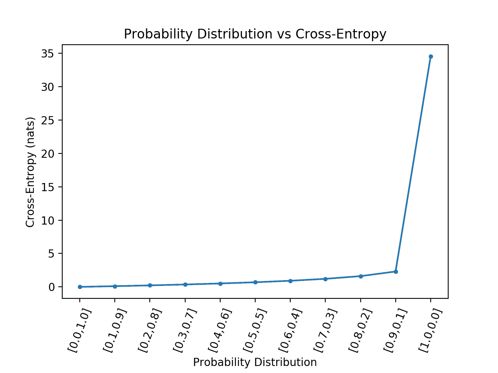

# 机器学习交叉熵的温和介绍

> 原文：<https://machinelearningmastery.com/cross-entropy-for-machine-learning/>

最后更新于 2020 年 12 月 22 日

交叉熵通常在机器学习中用作损失函数。

交叉熵是信息论领域的一个度量，建立在[熵](https://machinelearningmastery.com/what-is-information-entropy/)的基础上，一般计算两个概率分布的差值。它与计算两个概率分布之间相对熵的 [KL 散度](https://machinelearningmastery.com/divergence-between-probability-distributions/)密切相关但又不同，而交叉熵可以认为是计算分布之间的总熵。

交叉熵也与[逻辑损失有关，经常被混淆，称为对数损失](https://machinelearningmastery.com/logistic-regression-with-maximum-likelihood-estimation/)。虽然这两种度量来自不同的来源，但当用作分类模型的损失函数时，两种度量计算的数量相同，可以互换使用。

在本教程中，您将发现机器学习的交叉熵。

完成本教程后，您将知道:

*   如何从零开始使用标准机器学习库计算交叉熵？
*   交叉熵可用作优化分类模型(如逻辑回归和人工神经网络)时的损失函数。
*   交叉熵不同于 KL 散度，但可以使用 KL 散度计算，并且不同于对数损失，但在用作损失函数时计算相同的量。

**用我的新书[机器学习概率](https://machinelearningmastery.com/probability-for-machine-learning/)启动你的项目**，包括*分步教程*和所有示例的 *Python 源代码*文件。

我们开始吧。

*   **更新 2019 年 10 月**:给出了相同分布的交叉熵的例子，并更新了这种情况的描述(感谢罗恩·U)。增加了一个计算已知类标签熵的例子。
*   **2019 年 11 月更新**:结构改进，增加了更多熵的解释。增加了对预测类概率的直觉。
*   **2020 年 12 月更新**:调整了信息和熵的介绍，使之更加清晰。


机器学习交叉熵简介
图片由[杰罗姆·邦](https://www.flickr.com/photos/girolame/3819120378/)提供，版权所有。

## 教程概述

本教程分为五个部分；它们是:

1.  什么是交叉熵？
2.  交叉熵与 KL 散度
3.  如何计算交叉熵
    1.  两种离散概率分布
    2.  计算分布之间的交叉熵
    3.  计算分布与自身之间的交叉熵
    4.  用 KL 散度计算交叉熵
4.  作为损失函数的交叉熵
    1.  计算类别标签的熵
    2.  计算类别标签和概率之间的交叉熵
    3.  使用 Keras 计算交叉熵
    4.  预测概率的交叉熵直觉
5.  交叉熵与对数损失
    1.  对数损失是负的对数可能性
    2.  对数损失和交叉熵计算同样的事情

## 什么是交叉熵？

交叉熵是对给定随机变量或事件集的两个概率分布之间差异的度量。

您可能还记得**信息**量化了编码和传输事件所需的位数。低概率事件信息多，高概率事件信息少。

在信息论中，我们喜欢描述一个事件的“*惊喜*”。一个事件越不可能越令人惊讶，这意味着它包含了更多的信息。

*   **低概率事件** ( *惊喜*):更多信息。
*   **更高概率事件** ( *不出所料*):信息更少。

给定事件 *P(x)* 的概率，可以为事件 *x* 计算信息 *h(x)* 如下:

*   h(x)=-对数(P(x))

**熵**是从概率分布中传输随机选择的事件所需的位数。偏斜分布的熵较低，而事件概率相等的分布熵较大。

一个偏斜的概率分布有较少的“惊喜”，反过来低熵，因为可能的事件占主导地位。平衡分布更令人惊讶，反过来也有更高的熵，因为事件同样可能发生。

*   **偏斜概率分布** ( *不出所料*):低熵。
*   **均衡概率分布** ( *惊人*):高熵。

熵 *H(x)* 可以用一组 *X* 离散状态中的 *x* 离散状态及其概率 *P(x)* 来计算，如下所示:

*   h(X)=–X 中 X 的总和 P(x) * log(P(x))

如果您想了解更多关于计算事件信息和分布熵的信息，请参阅本教程:

*   [信息熵的温和介绍](https://machinelearningmastery.com/what-is-information-entropy/)

**交叉熵**建立在信息论中熵的概念之上，计算表示或传输一个分布的平均事件相对于另一个分布所需的比特数。

> …交叉熵是当我们使用模型 q 时，对来自分布为 p 的源的数据进行编码所需的平均位数…

—第 57 页，[机器学习:概率视角](https://amzn.to/2xKSTCP)，2012。

这个定义的直觉来自于如果我们考虑一个目标或潜在的概率分布 P 和目标分布 Q 的近似值，那么 Q 来自 P 的交叉熵就是用 Q 而不是 P 来表示一个事件的附加比特数

两个概率分布之间的交叉熵，如 P 中的 Q，可以正式表述为:

*   高(P，Q)

其中 H()是交叉熵函数，P 可能是目标分布，Q 是目标分布的近似值。

交叉熵可以使用事件概率 P 和 Q 来计算，如下所示:

*   H(P，Q)=–X 中 X 的总和 P(x) * log(Q(x))

其中 P(x)是事件 x 在 P 中的概率，Q(x)是事件 x 在 Q 中的概率，log 是以 2 为底的对数，意味着结果以比特为单位。如果用以 e 为底的对数或自然对数来代替，结果将有称为 nats 的单位。

这种计算是针对离散概率分布的，尽管类似的计算可以用于连续概率分布，使用事件的积分而不是总和。

如果两个概率分布相同，结果将是以比特为单位测量的正数，并等于分布的熵。

**注**:这个符号看起来很像 P 和 q 之间的联合概率，或者更具体地说是[联合熵](https://en.wikipedia.org/wiki/Joint_entropy)，这是误导，因为我们是在用交叉熵对概率分布之间的差异进行评分。然而，联合熵是一个不同的概念，它使用相同的符号，而是计算两个(或更多)随机变量的不确定性。

## 交叉熵与 KL 散度

交叉熵不是 KL 散度。

交叉熵与散度度量有关，例如[库勒贝克-莱布勒，或 KL，散度](https://machinelearningmastery.com/divergence-between-probability-distributions/)，它量化了一个分布与另一个分布的差异。

具体来说，KL 散度度量了一个与交叉熵非常相似的量。它测量用 Q 而不是 P 表示一条消息所需的平均额外位数，而不是总位数。

> 换句话说，KL 散度是编码数据所需的额外比特的平均数量，因为我们使用分布 q 来编码数据，而不是真正的分布 p。

—第 58 页，[机器学习:概率视角](https://amzn.to/2xKSTCP)，2012。

因此，KL 散度通常被称为“*相对熵*”

*   **交叉熵**:从 Q 而不是 p 表示事件的平均总位数
*   **相对熵** ( *KL 散度*):从 Q 而不是 p 表示事件的平均额外位数

KL 散度可以计算为以 P 为倍数的每个事件的概率的负和，乘以事件在 Q 中的概率对事件在 P 中的概率的对数。通常，对数基数为-2，因此结果以比特为单位进行测量。

*   KL(P | | Q)=–X 中 X 的和 P(x) * log(Q(x) / P(x))

总和中的值是给定事件的散度。

因此，我们可以通过将分布的熵加上由 KL 散度计算的附加熵来计算交叉熵。考虑到两种计算的定义，这是直观的；例如:

*   H(P，Q) = H(P) + KL(P || Q)

其中 H(P，Q)是 Q 与 P 的交叉熵，H(P)是 P 的熵，KL(P || Q)是 Q 与 P 的散度。

对于概率分布，熵可以计算为每个事件概率的负和乘以事件概率的对数，其中对数以 2 为基数，以确保结果以位为单位。

*   h(P)=-X P(X)* log(P(X))上的和 X

像 KL 散度一样，交叉熵也不是对称的，这意味着:

*   H(P，Q)！= H(Q，P)

正如我们将在后面看到的，当交叉熵和 KL 散度用作优化分类预测模型的损失函数时，它们计算相同的量。正是在这种背景下，你有时可能会看到交叉熵和 KL 散度是相同的。

有关 KL 散度的更多细节，请参见教程:

*   [如何计算机器学习的 KL 散度](https://machinelearningmastery.com/divergence-between-probability-distributions/)

## 如何计算交叉熵

在这一节中，我们将用一个小例子来具体计算交叉熵。

### 两种离散概率分布

考虑一个随机变量，它有三个不同颜色的离散事件:红色、绿色和蓝色。

对于这个变量，我们可能有两种不同的概率分布；例如:

```py
...
# define distributions
events = ['red', 'green', 'blue']
p = [0.10, 0.40, 0.50]
q = [0.80, 0.15, 0.05]
```

我们可以绘制这些概率的条形图，将它们直接作为概率直方图进行比较。

下面列出了完整的示例。

```py
# plot of distributions
from matplotlib import pyplot
# define distributions
events = ['red', 'green', 'blue']
p = [0.10, 0.40, 0.50]
q = [0.80, 0.15, 0.05]
print('P=%.3f Q=%.3f' % (sum(p), sum(q)))
# plot first distribution
pyplot.subplot(2,1,1)
pyplot.bar(events, p)
# plot second distribution
pyplot.subplot(2,1,2)
pyplot.bar(events, q)
# show the plot
pyplot.show()
```

运行该示例会为每个概率分布创建一个直方图，从而可以直接比较每个事件的概率。

我们可以看到，分布确实是不同的。


同一随机变量两种不同概率分布的直方图

### 计算分布之间的交叉熵

接下来，我们可以开发一个函数来计算两个分布之间的交叉熵。

我们将使用 log base-2 来确保结果以位为单位。

```py
# calculate cross entropy
def cross_entropy(p, q):
	return -sum([p[i]*log2(q[i]) for i in range(len(p))])
```

然后我们可以用这个函数从 Q 计算 P 的交叉熵，以及反过来，从 P 计算 Q。

```py
...
# calculate cross entropy H(P, Q)
ce_pq = cross_entropy(p, q)
print('H(P, Q): %.3f bits' % ce_pq)
# calculate cross entropy H(Q, P)
ce_qp = cross_entropy(q, p)
print('H(Q, P): %.3f bits' % ce_qp)
```

将这些结合在一起，完整的示例如下所示。

```py
# example of calculating cross entropy
from math import log2

# calculate cross entropy
def cross_entropy(p, q):
	return -sum([p[i]*log2(q[i]) for i in range(len(p))])

# define data
p = [0.10, 0.40, 0.50]
q = [0.80, 0.15, 0.05]
# calculate cross entropy H(P, Q)
ce_pq = cross_entropy(p, q)
print('H(P, Q): %.3f bits' % ce_pq)
# calculate cross entropy H(Q, P)
ce_qp = cross_entropy(q, p)
print('H(Q, P): %.3f bits' % ce_qp)
```

运行该示例时，首先从 P 计算 Q 的交叉熵，刚好超过 3 位，然后从 Q 计算 P，刚好低于 3 位。

```py
H(P, Q): 3.288 bits
H(Q, P): 2.906 bits
```

### 计算分布与自身之间的交叉熵

如果两个概率分布相同，那么它们之间的交叉熵就是分布的熵。

我们可以通过计算 P 对 P 和 Q 对 Q 的交叉熵来证明这一点

下面列出了完整的示例。

```py
# example of calculating cross entropy for identical distributions
from math import log2

# calculate cross entropy
def cross_entropy(p, q):
	return -sum([p[i]*log2(q[i]) for i in range(len(p))])

# define data
p = [0.10, 0.40, 0.50]
q = [0.80, 0.15, 0.05]
# calculate cross entropy H(P, P)
ce_pp = cross_entropy(p, p)
print('H(P, P): %.3f bits' % ce_pp)
# calculate cross entropy H(Q, Q)
ce_qq = cross_entropy(q, q)
print('H(Q, Q): %.3f bits' % ce_qq)
```

运行该示例首先计算 Q 对 Q 的交叉熵，它被计算为 Q 的熵，以及 P 对 P，它被计算为 P 的熵

```py
H(P, P): 1.361 bits
H(Q, Q): 0.884 bits
```

### 用 KL 散度计算交叉熵

我们也可以使用 KL 散度来计算交叉熵。

用 KL 散度计算的交叉熵应该是相同的，并且计算分布之间的 KL 散度以查看相对熵或所需的额外比特而不是由交叉熵计算的总比特可能是有趣的。

首先，我们可以定义一个函数，使用 log base-2 计算分布之间的 KL 散度，以确保结果也是以位为单位的。

```py
# calculate the kl divergence KL(P || Q)
def kl_divergence(p, q):
	return sum(p[i] * log2(p[i]/q[i]) for i in range(len(p)))
```

接下来，我们可以定义一个函数来计算给定概率分布的熵。

```py
# calculate entropy H(P)
def entropy(p):
	return -sum([p[i] * log2(p[i]) for i in range(len(p))])
```

最后，我们可以使用*熵()*和*KL _ 散度()*函数计算交叉熵。

```py
# calculate cross entropy H(P, Q)
def cross_entropy(p, q):
	return entropy(p) + kl_divergence(p, q)
```

为了简单起见，我们可以将 H(P，Q)的交叉熵与 KL 散度 KL(P || Q)和熵 H(P)进行比较。

下面列出了完整的示例。

```py
# example of calculating cross entropy with kl divergence
from math import log2

# calculate the kl divergence KL(P || Q)
def kl_divergence(p, q):
	return sum(p[i] * log2(p[i]/q[i]) for i in range(len(p)))

# calculate entropy H(P)
def entropy(p):
	return -sum([p[i] * log2(p[i]) for i in range(len(p))])

# calculate cross entropy H(P, Q)
def cross_entropy(p, q):
	return entropy(p) + kl_divergence(p, q)

# define data
p = [0.10, 0.40, 0.50]
q = [0.80, 0.15, 0.05]
# calculate H(P)
en_p = entropy(p)
print('H(P): %.3f bits' % en_p)
# calculate kl divergence KL(P || Q)
kl_pq = kl_divergence(p, q)
print('KL(P || Q): %.3f bits' % kl_pq)
# calculate cross entropy H(P, Q)
ce_pq = cross_entropy(p, q)
print('H(P, Q): %.3f bits' % ce_pq)
```

运行该示例，我们可以看到 3.288 位的交叉熵得分由 P 1.361 的熵和通过 KL 散度计算的额外的 1.927 位组成。

这是一个有用的例子，清楚地说明了所有三个计算之间的关系。

```py
H(P): 1.361 bits
KL(P || Q): 1.927 bits
H(P, Q): 3.288 bits
```

## 作为损失函数的交叉熵

在优化分类模型时，交叉熵被广泛用作损失函数。

您可能会遇到两个例子，包括逻辑回归算法(线性分类算法)和可用于分类任务的人工神经网络。

> …在分类问题中使用交叉熵误差函数而不是平方和，可以加快训练速度并提高泛化能力。

—第 235 页，[模式识别与机器学习](https://amzn.to/2JwHE7I)，2006。

分类问题是那些涉及一个或多个输入变量和类标签预测的问题。

对于输出变量只有两个标签的分类任务被称为二进制分类问题，而那些有两个以上标签的问题被称为分类或多类分类问题。

*   **二进制分类**:预测给定示例的两个类别标签之一的任务。
*   **多类分类**:预测给定示例的两个以上类标签之一的任务。

我们可以看到交叉熵的思想对于优化分类模型可能是有用的。

每个示例都有一个已知的类标签，概率为 1.0，所有其他标签的概率为 0.0。模型可以估计一个例子属于每个类别标签的概率。交叉熵然后可以用来计算两个概率分布之间的差异。

因此，我们可以将一个例子的分类映射到具有如下概率分布的随机变量的概念上:

*   **随机变量**:我们需要一个预测类标签的例子。
*   **事件**:每个可以预测的类标签。

在分类任务中，我们知道一个输入的目标概率分布 P 作为类标签 0 或 1，分别解释为“*不可能*”或“*确定*”的概率。这些概率一点也不令人惊讶，因此它们没有信息量或零熵。

我们的模型试图近似目标概率分布 q。

在分类语言中，这些是实际概率和预测概率，或 *y* 和 *yhat* 。

*   **期望概率** ( *y* ):数据集中某个示例的每个类标签的已知概率(P)。
*   **预测概率** ( *yhat* ):每个类标注一个模型预测的例子的概率(Q)。

因此，我们可以使用上述交叉熵计算来估计单个预测的交叉熵；比如说。

*   H(P，Q)=–X 中 X 的总和 P(x) * log(Q(x))

其中 *X* 中的每个 *x* 是可以分配给该示例的类别标签， *P(x)* 对于已知标签为 1，对于所有其他标签为 0。

二分类任务中单个示例的交叉熵可以通过如下展开求和操作来表示:

*   H(P，Q)=–(P(0 级)*对数(Q(0 级))+P(1 级)*对数(Q(1 级))

你可能会在教科书中看到这种计算交叉熵的形式。

如果只有两个类别标签，概率建模为正类别标签的[伯努利分布](https://machinelearningmastery.com/discrete-probability-distributions-for-machine-learning/)。这意味着类别 1 的概率由模型直接预测，而类别 0 的概率给出为 1 减去预测概率，例如:

*   **预测 P(0 级)**= 1–yhat
*   **预测 P(1 级)** = yhat

当计算分类任务的交叉熵时，使用以 e 为底的对数或自然对数。这意味着单位是 nats，而不是位。

我们通常对最小化整个训练数据集中模型的交叉熵感兴趣。这是通过计算所有训练示例的平均交叉熵来计算的。

### 计算类别标签的熵

回想一下，当两个分布相同时，它们之间的交叉熵等于概率分布的熵。

为分类任务准备数据时，使用值 0 和 1 对类标签进行编码。

例如，如果一个分类问题有三类，一个例子有第一类的标签，那么概率分布将是[1，0，0]。如果一个例子有第二类的标签，它将有两个事件的概率分布为[0，1，0]。这叫做[一个热编码](https://machinelearningmastery.com/why-one-hot-encode-data-in-machine-learning/)。

这个概率分布没有信息，因为结果是确定的。我们知道这门课。因此，这个变量的熵为零。

这是一个重要的概念，我们可以用一个成功的例子来证明。

假设有一个 3 类的分类问题，我们有一个属于每个类的例子。我们可以将每个示例表示为离散的概率分布，对于该示例所属的类，概率为 1.0，对于所有其他类，概率为 0.0。

我们可以计算出“*事件*中每个“*变量*”的概率分布熵。

下面列出了完整的示例。

```py
# entropy of examples from a classification task with 3 classes
from math import log2
from numpy import asarray

# calculate entropy
def entropy(p):
	return -sum([p[i] * log2(p[i]) for i in range(len(p))])

# class 1
p = asarray([1,0,0]) + 1e-15
print(entropy(p))
# class 2
p = asarray([0,1,0]) + 1e-15
print(entropy(p))
# class 3
p = asarray([0,0,1]) + 1e-15
print(entropy(p))
```

运行该示例计算每个随机变量的熵。

我们可以看到，在每种情况下，熵都是 0.0(实际上是一个非常接近于零的数字)。

请注意，我们必须在 0.0 值上添加一个非常小的值，以避免 *log()* 爆炸，因为我们无法计算 0.0 的 log。

```py
9.805612959471341e-14
9.805612959471341e-14
9.805612959471341e-14
```

因此，已知类别标签的熵总是 0.0。

这意味着对于一个类标签具有相同概率分布的两个分布(真实的和预测的)的交叉熵也将总是 0.0。

回想一下，在训练数据集上使用交叉熵评估模型时，我们对数据集中所有示例的交叉熵进行平均。

因此，当训练模型时交叉熵为 0.0 表明预测的类概率与训练数据集中的概率相同，例如零损失。

我们可以很容易地将 KL 散度最小化为损失函数，而不是交叉熵。

回想一下，KL 散度是传输一个变量相对于另一个变量所需的额外比特。它是没有类标签熵的交叉熵，我们知道它无论如何都是零。

因此，最小化分类任务的 KL 散度和交叉熵是相同的。

> 最小化这种 KL 散度正好对应于最小化分布之间的交叉熵。

—第 132 页，[深度学习](https://amzn.to/2lnc3vL)，2016。

在实践中，交叉熵损失为 0.0 通常表明模型过度训练了训练数据集，但这是另一回事。

### 计算类别标签和概率之间的交叉熵

使用交叉熵进行分类通常会根据类的数量给出不同的具体名称，反映了分类任务的名称；例如:

*   **二元交叉熵**:交叉熵作为二分类任务的损失函数。
*   **分类交叉熵**:交叉熵作为多类分类任务的损失函数。

我们可以用一个具体的例子来说明交叉熵作为损失函数的用途。

考虑一个包含以下 10 个实际类标签(P)和预测类标签(Q)的两类分类任务。

```py
...
# define classification data
p = [1, 1, 1, 1, 1, 0, 0, 0, 0, 0]
q = [0.8, 0.9, 0.9, 0.6, 0.8, 0.1, 0.4, 0.2, 0.1, 0.3]
```

我们可以枚举这些概率，并使用上一节中开发的交叉熵函数计算每个概率的交叉熵，使用 *log()* (自然对数)代替 *log2()* 。

```py
# calculate cross entropy
def cross_entropy(p, q):
	return -sum([p[i]*log(q[i]) for i in range(len(p))])
```

对于每个实际和预测的概率，我们必须将预测转换为每个事件的概率分布，在这种情况下，类别{0，1}为 1 减去类别 0 的概率和类别 1 的概率。

然后，我们可以计算交叉熵，并对所有示例重复该过程。

```py
...
# calculate cross entropy for each example
results = list()
for i in range(len(p)):
	# create the distribution for each event {0, 1}
	expected = [1.0 - p[i], p[i]]
	predicted = [1.0 - q[i], q[i]]
	# calculate cross entropy for the two events
	ce = cross_entropy(expected, predicted)
	print('>[y=%.1f, yhat=%.1f] ce: %.3f nats' % (p[i], q[i], ce))
	results.append(ce)
```

最后，我们可以计算整个数据集的平均交叉熵，并将其报告为数据集上模型的交叉熵损失。

```py
...
# calculate the average cross entropy
mean_ce = mean(results)
print('Average Cross Entropy: %.3f nats' % mean_ce)
```

将这些结合在一起，完整的示例如下所示。

```py
# calculate cross entropy for classification problem
from math import log
from numpy import mean

# calculate cross entropy
def cross_entropy(p, q):
	return -sum([p[i]*log(q[i]) for i in range(len(p))])

# define classification data
p = [1, 1, 1, 1, 1, 0, 0, 0, 0, 0]
q = [0.8, 0.9, 0.9, 0.6, 0.8, 0.1, 0.4, 0.2, 0.1, 0.3]
# calculate cross entropy for each example
results = list()
for i in range(len(p)):
	# create the distribution for each event {0, 1}
	expected = [1.0 - p[i], p[i]]
	predicted = [1.0 - q[i], q[i]]
	# calculate cross entropy for the two events
	ce = cross_entropy(expected, predicted)
	print('>[y=%.1f, yhat=%.1f] ce: %.3f nats' % (p[i], q[i], ce))
	results.append(ce)

# calculate the average cross entropy
mean_ce = mean(results)
print('Average Cross Entropy: %.3f nats' % mean_ce)
```

运行该示例会打印每个示例的实际概率和预测概率以及 nats 中的交叉熵。

在本例中，所有示例的最终平均交叉熵损失为 0.247 纳特。

```py
>[y=1.0, yhat=0.8] ce: 0.223 nats
>[y=1.0, yhat=0.9] ce: 0.105 nats
>[y=1.0, yhat=0.9] ce: 0.105 nats
>[y=1.0, yhat=0.6] ce: 0.511 nats
>[y=1.0, yhat=0.8] ce: 0.223 nats
>[y=0.0, yhat=0.1] ce: 0.105 nats
>[y=0.0, yhat=0.4] ce: 0.511 nats
>[y=0.0, yhat=0.2] ce: 0.223 nats
>[y=0.0, yhat=0.1] ce: 0.105 nats
>[y=0.0, yhat=0.3] ce: 0.357 nats
Average Cross Entropy: 0.247 nats
```

这是在交叉熵损失函数下优化逻辑回归模型或神经网络模型时计算交叉熵损失的方式。

### 使用 Keras 计算交叉熵

我们可以通过使用来自 [Keras 深度学习 API](https://keras.io/losses/) 的*二元 _ 交叉熵()*函数来为我们的小数据集计算交叉熵损失，从而确认相同的计算。

下面列出了完整的示例。

**注意**:本例假设您安装了 [Keras 库](https://machinelearningmastery.com/tutorial-first-neural-network-python-keras/)(例如 2.3 版或更高版本)，并配置了后端库，例如[TensorFlow](https://machinelearningmastery.com/tensorflow-tutorial-deep-learning-with-tf-keras/)(2.0 版或更高版本)。如果没有，您可以跳过运行这个示例。

```py
# calculate cross entropy with keras
from numpy import asarray
from keras import backend
from keras.losses import binary_crossentropy
# prepare classification data
p = asarray([1, 1, 1, 1, 1, 0, 0, 0, 0, 0])
q = asarray([0.8, 0.9, 0.9, 0.6, 0.8, 0.1, 0.4, 0.2, 0.1, 0.3])
# convert to keras variables
y_true = backend.variable(p)
y_pred = backend.variable(q)
# calculate the average cross-entropy
mean_ce = backend.eval(binary_crossentropy(y_true, y_pred))
print('Average Cross Entropy: %.3f nats' % mean_ce)
```

运行该示例，我们可以看到报告了相同的平均交叉熵损失 0.247 nats。

这证实了交叉熵的正确人工计算。

```py
Average Cross Entropy: 0.247 nats
```

### 预测概率的交叉熵直觉

我们可以进一步发展预测类概率的交叉熵的直觉。

例如，假设平均交叉熵损失为 0.0 是一个完美的模型，那么大于零的平均交叉熵值到底意味着什么？

我们可以探讨这个问题没有一个二进制分类问题，其中类标签为 0 和 1。这是一个离散的概率分布，有两个事件，一个事件有一定的概率，另一个事件有不可能的概率。

然后，我们可以计算从目标分布的完美匹配过渡到完全相反的概率分布的不同“*”预测的*”概率分布的交叉熵。

我们预计，随着预测的概率分布进一步偏离目标分布，计算的交叉熵将增加。

下面的示例实现了这一点，并绘制了预测概率分布的交叉熵结果与两个事件的目标[0，1]的比较，就像我们在二分类任务中看到的交叉熵一样。

```py
# cross-entropy for predicted probability distribution vs label
from math import log
from matplotlib import pyplot

# calculate cross-entropy
def cross_entropy(p, q, ets=1e-15):
	return -sum([p[i]*log(q[i]+ets) for i in range(len(p))])

# define the target distribution for two events
target = [0.0, 1.0]
# define probabilities for the first event
probs = [1.0, 0.9, 0.8, 0.7, 0.6, 0.5, 0.4, 0.3, 0.2, 0.1, 0.0]
# create probability distributions for the two events
dists = [[1.0 - p, p] for p in probs]
# calculate cross-entropy for each distribution
ents = [cross_entropy(target, d) for d in dists]
# plot probability distribution vs cross-entropy
pyplot.plot([1-p for p in probs], ents, marker='.')
pyplot.title('Probability Distribution vs Cross-Entropy')
pyplot.xticks([1-p for p in probs], ['[%.1f,%.1f]'%(d[0],d[1]) for d in dists], rotation=70)
pyplot.subplots_adjust(bottom=0.2)
pyplot.xlabel('Probability Distribution')
pyplot.ylabel('Cross-Entropy (nats)')
pyplot.show()
```

运行该示例计算每个概率分布的交叉熵得分，然后将结果绘制为线形图。

我们可以看到，正如预期的那样，当预测的概率分布与目标分布匹配时，交叉熵从 0.0(最左侧点)开始，然后随着预测的概率分布发散而稳定增加。

当预测的概率分布与目标分布完全相反时，即[1，0]与[0，1]的目标相比，我们也可以看到交叉熵的戏剧性飞跃。



二分类任务的概率分布与交叉熵的线图

我们不会有一个模型来预测二分类任务中所有情况的完全相反的概率分布。

因此，我们可以删除这个案例，重新计算情节。

下面列出了代码的更新版本。

```py
# cross-entropy for predicted probability distribution vs label
from math import log
from matplotlib import pyplot

# calculate cross-entropy
def cross_entropy(p, q, ets=1e-15):
	return -sum([p[i]*log(q[i]+ets) for i in range(len(p))])

# define the target distribution for two events
target = [0.0, 1.0]
# define probabilities for the first event
probs = [1.0, 0.9, 0.8, 0.7, 0.6, 0.5, 0.4, 0.3, 0.2, 0.1]
# create probability distributions for the two events
dists = [[1.0 - p, p] for p in probs]
# calculate cross-entropy for each distribution
ents = [cross_entropy(target, d) for d in dists]
# plot probability distribution vs cross-entropy
pyplot.plot([1-p for p in probs], ents, marker='.')
pyplot.title('Probability Distribution vs Cross-Entropy')
pyplot.xticks([1-p for p in probs], ['[%.1f,%.1f]'%(d[0],d[1]) for d in dists], rotation=70)
pyplot.subplots_adjust(bottom=0.2)
pyplot.xlabel('Probability Distribution')
pyplot.ylabel('Cross-Entropy (nats)')
pyplot.show()
```

运行该示例可以更好地了解概率分布中的散度和计算出的交叉熵之间的关系。

我们可以看到一个超线性关系，其中预测的概率分布偏离目标越多，交叉熵增加越大。


去除极端情况下二分类任务的概率分布与交叉熵的线图

像这样的图可以用作解释二元类别数据集模型的平均交叉熵报告的指南。

例如，您可以使用这些交叉熵值来解释 Keras 为二进制分类任务的神经网络模型或 Sklearn 中使用对数损失度量评估的二进制分类模型报告的平均交叉熵。

你可以用它来回答一般的问题:

> **什么是好的交叉熵得分？**

如果你在 nats 工作(你通常都是)，并且你得到的平均交叉熵小于 0.2，你就有了一个好的开始，小于 0.1 或 0.05 更好。

另一方面，如果你得到的平均交叉熵大于 0.2 或 0.3，你可能会有所改善，如果你得到的平均交叉熵大于 1.0，那么有些事情正在发生，你对数据集中的许多例子做出了糟糕的概率预测。

我们可以将平均交叉熵的这些直觉总结如下:

*   **交叉熵= 0.00** :完美概率。
*   **交叉熵< 0.02** :大概率。
*   **交叉熵< 0.05** :在正轨上。
*   **交叉熵< 0.20** :好。
*   **交叉熵> 0.30** :不大。
*   **交叉熵> 1.00** :可怕。
*   **交叉熵> 2.00** 有东西坏了。

当从逻辑回归模型或人工神经网络模型中解释交叉熵(对数损失)时，这个列表将提供有用的指导。

您还可以计算每个类的独立平均交叉熵得分，并帮助梳理出您所建模的哪些类具有良好的概率，以及哪些类可能会被搞砸。

## 交叉熵与对数损失

交叉熵不是对数损失，但是当用作分类问题的损失函数时，它们计算相同的量。

### 对数损失是负的对数可能性

[Logistic 损失](https://en.wikipedia.org/wiki/Loss_functions_for_classification#Logistic_loss)是指常用于优化一个 Logistic 回归模型的损失函数。

它也可以被称为对数损失(这是令人困惑的)或简单的对数损失。

许多模型是在一个叫做[最大似然估计](https://machinelearningmastery.com/what-is-maximum-likelihood-estimation-in-machine-learning/)的概率框架下优化的，该框架涉及到寻找一组最能解释观测数据的参数。

这包括选择一个[似然函数](https://en.wikipedia.org/wiki/Likelihood_function)，定义一组观测值(数据)被赋予模型参数的可能性。当使用对数似然函数时(这是常见的)，它通常被称为优化模型的对数似然。因为在实践中，最小化函数比最大化函数更常见，所以对数似然函数通过在前面添加负号来反转。这将其转换为负对数似然函数，简称 NLL。

在伯努利概率分布函数(两类)的最大似然估计框架下推导对数似然函数时，计算结果为:

*   负对数似然(P，Q) = -(P(类 0) *对数(Q(类 0)) + P(类 1) *对数(Q(类 1))

这个量可以通过计算似然函数的对数的平均值在所有训练例子上求平均值。

二分类问题的负对数似然通常被简称为“对数损失”，作为逻辑回归的损失函数。

*   对数损失=负对数似然，在伯努利概率分布下

我们可以看到负对数似然与伯努利概率分布函数(两个事件或类别)的交叉熵计算相同。事实上，多欧拉分布(多类分类)的负对数似然性也与交叉熵的计算相匹配。

有关日志丢失和负日志可能性的更多信息，请参见教程:

*   [带最大似然估计的逻辑回归入门](https://machinelearningmastery.com/logistic-regression-with-maximum-likelihood-estimation/)

### 对数损失和交叉熵计算同样的事情

对于分类问题，“*对数损失*”、“*交叉熵*”和“*负对数似然*”可互换使用。

更一般地，术语“*交叉熵*”和“*负对数似然*”在分类模型的损失函数的上下文中可互换使用。

> 逻辑回归的负对数似然由[…]给出，这也称为交叉熵误差函数。

—第 246 页，[机器学习:概率视角](https://amzn.to/2xKSTCP)，2012。

因此，计算对数损失将给出与计算伯努利概率分布的交叉熵相同的量。我们可以通过使用 Sklearn API 中的 [log_loss()函数](https://Sklearn.org/stable/modules/generated/sklearn.metrics.log_loss.html)计算 log loss 来确认这一点。

计算上一节中同一组实际和预测概率的平均测井损失应给出与计算平均交叉熵相同的结果。

下面列出了完整的示例。

```py
# calculate log loss for classification problem with Sklearn
from sklearn.metrics import log_loss
from numpy import asarray
# define classification data
p = [1, 1, 1, 1, 1, 0, 0, 0, 0, 0]
q = [0.8, 0.9, 0.9, 0.6, 0.8, 0.1, 0.4, 0.2, 0.1, 0.3]
# define data as expected, e.g. probability for each event {0, 1}
y_true = asarray([[1-v, v] for v in p])
y_pred = asarray([[1-v, v] for v in q])
# calculate the average log loss
ll = log_loss(y_true, y_pred)
print('Average Log Loss: %.3f' % ll)
```

运行该示例给出了 0.247 个日志丢失的预期结果，当使用平均交叉熵计算时，该结果与 0.247 个 nats 匹配。

```py
Average Log Loss: 0.247
```

这并不意味着对数损失计算交叉熵或交叉熵计算对数损失。

相反，它们是不同的量，来自不同的研究领域，在为分类任务计算损失函数的条件下，导致等价的计算和结果。具体而言，交叉熵损失函数相当于[伯努利或多努里概率分布](https://machinelearningmastery.com/discrete-probability-distributions-for-machine-learning/)下的最大似然函数。

这证明了[最大似然估计](https://machinelearningmastery.com/what-is-maximum-likelihood-estimation-in-machine-learning/)的研究和离散概率分布的信息论之间的联系。

它不限于离散的概率分布，这个事实让许多第一次听到的从业者感到惊讶。

具体而言，在最大似然估计框架下优化的[线性回归假设目标变量的高斯连续概率分布，并且涉及最小化均方误差函数。这相当于高斯概率分布随机变量的交叉熵。](https://machinelearningmastery.com/linear-regression-with-maximum-likelihood-estimation/)

> 由负对数似然构成的任何损失都是训练集定义的经验分布和模型定义的概率分布之间的交叉熵。例如，均方误差是经验分布和高斯模型之间的交叉熵。

—第 132 页，[深度学习](https://amzn.to/2lnc3vL)，2016。

这有点令人瞠目结舌，来源于连续随机变量的[微分熵](https://en.wikipedia.org/wiki/Differential_entropy)领域。

这意味着，如果你计算覆盖相同事件的两个高斯随机变量之间的均方误差(具有相同的均值和标准差)，那么你就是在计算变量之间的交叉熵。

这也意味着，如果你使用均方误差损失来优化回归问题的神经网络模型，你实际上是在使用交叉熵损失。

## 进一步阅读

如果您想更深入地了解这个主题，本节将提供更多资源。

### 教程

*   [信息熵的温和介绍](https://machinelearningmastery.com/what-is-information-entropy/)
*   [如何计算机器学习的 KL 散度](https://machinelearningmastery.com/divergence-between-probability-distributions/)
*   [带最大似然估计的逻辑回归入门](https://machinelearningmastery.com/logistic-regression-with-maximum-likelihood-estimation/)
*   [训练深度学习神经网络时如何选择损失函数](https://machinelearningmastery.com/how-to-choose-loss-functions-when-training-deep-learning-neural-networks/)
*   [用于训练深度学习神经网络的损失和损失函数](https://machinelearningmastery.com/loss-and-loss-functions-for-training-deep-learning-neural-networks/)

### 书

*   [机器学习:概率视角](https://amzn.to/2xKSTCP)，2012。
*   [模式识别与机器学习](https://amzn.to/2JwHE7I)，2006。
*   [深度学习](https://amzn.to/2lnc3vL)，2016 年。

### 应用程序接口

*   [损耗函数的使用，Keras API](https://keras.io/losses/) 。
*   [sklearn . metrics . log _ loss API](https://Sklearn.org/stable/modules/generated/sklearn.metrics.log_loss.html)。

### 文章

*   [kul LBA-leilbler 分歧，维基百科](https://en.wikipedia.org/wiki/Kullback%E2%80%93Leibler_divergence)。
*   [交叉熵，维基百科](https://en.wikipedia.org/wiki/Cross_entropy)。
*   [联合熵，维基百科](https://en.wikipedia.org/wiki/Joint_entropy)。
*   [分类损失函数，维基百科。](https://en.wikipedia.org/wiki/Loss_functions_for_classification)
*   [微分熵，维基百科](https://en.wikipedia.org/wiki/Differential_entropy)。

## 摘要

在本教程中，您发现了机器学习的交叉熵。

具体来说，您了解到:

*   如何从零开始使用标准机器学习库计算交叉熵？
*   交叉熵可用作优化分类模型(如逻辑回归和人工神经网络)时的损失函数。
*   交叉熵不同于 KL 散度，但可以使用 KL 散度计算，并且不同于对数损失，但在用作损失函数时计算相同的量。

你有什么问题吗？
在下面的评论中提问，我会尽力回答。