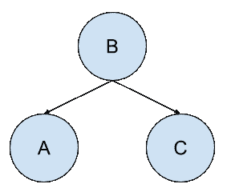

# 贝叶斯信念网络的温和介绍

> 原文：<https://machinelearningmastery.com/introduction-to-bayesian-belief-networks/>

概率模型可以定义变量之间的关系，并用于计算概率。

例如，完全条件模型可能需要大量的数据来涵盖所有可能的情况，而概率在实践中可能难以计算。简化假设，如所有随机变量的条件独立性，可能是有效的，例如在朴素贝叶斯的情况下，尽管这是一个彻底简化的步骤。

另一种方法是开发一个模型，在所有其他情况下保持随机变量之间已知的条件相关性和条件独立性。贝叶斯网络是一种概率图形模型，它明确地捕捉图形模型中已知的有向边的条件依赖。所有缺失的连接定义了模型中的条件独立性。

因此，贝叶斯网络提供了一个有用的工具来可视化一个领域的概率模型，回顾随机变量之间的所有关系，并根据现有证据推断场景的因果概率。

在这篇文章中，你会发现一个温和的贝叶斯网络介绍。

看完这篇文章，你会知道:

*   贝叶斯网络是一种由节点和有向边组成的概率图形模型。
*   贝叶斯网络模型捕捉随机变量之间的条件相关和条件独立关系。
*   模型可以由专家准备或从数据中学习，然后用于推断，以估计因果或后续事件的概率。

**用我的新书[机器学习概率](https://machinelearningmastery.com/probability-for-machine-learning/)启动你的项目**，包括*分步教程*和所有示例的 *Python 源代码*文件。

我们开始吧。

阿明·科瓦尔斯基拍摄的贝叶斯信仰网络简介，版权所有。

## 概观

本教程分为五个部分；它们是:

1.  概率建模的挑战
2.  作为概率模型的贝叶斯信念网络
3.  如何开发和使用贝叶斯网络
4.  贝叶斯网络示例
5.  Python 中的贝叶斯网络

## 概率建模的挑战

概率模型在设计和使用上具有挑战性。

大多数情况下，问题是缺少关于完全指定随机变量之间的条件相关性所需的域的信息。如果有的话，计算一个事件的全条件概率是不切实际的。

应对这一挑战的常见方法是添加一些简化的假设，例如假设模型中的所有随机变量都是条件独立的。这是一个极端的假设，尽管它在实践中被证明是有用的，为朴素贝叶斯分类算法提供了基础。

另一种方法是开发一个带有一些条件独立性假设的问题的概率模型。这提供了完全条件模型和完全条件独立模型之间的中间方法。

贝叶斯信念网络是概率模型的一个例子，其中一些变量是条件独立的。

> 因此，贝叶斯信念网络提供了一种中间方法，它比朴素贝叶斯分类器对条件独立性的全局假设约束更少，但比完全避免条件独立性假设更容易处理。

—第 184 页，[机器学习](https://amzn.to/2jWd51p)，1997。

## 作为概率模型的贝叶斯信念网络

贝叶斯信念网络是一种概率图形模型。

### 概率图形模型

一个[概率图形模型](https://en.wikipedia.org/wiki/Graphical_model) (PGM)，简称“*图形模型*，是一种用图结构表示概率模型的方式。

图中的节点代表随机变量，连接节点的边代表随机变量之间的关系。

> 图由通过链接(也称为边或弧)连接的节点(也称为顶点)组成。在概率图形模型中，每个节点代表一个随机变量(或一组随机变量)，链接表示这些变量之间的概率关系。

—第 360 页，[模式识别与机器学习](https://amzn.to/2JwHE7I)，2006。

*   **节点**:图形模型中的随机变量。
*   **边**:图形模型中随机变量之间的关系。

有许多不同类型的图形模型，尽管最常用的两种是隐马尔可夫模型和贝叶斯网络。

[隐马尔可夫模型](https://en.wikipedia.org/wiki/Hidden_Markov_model) (HMM)是一个图形模型，其中图的边是无方向的，这意味着图包含循环。贝叶斯网络的限制性更强，图的边是有方向的，这意味着它们只能在一个方向上导航。这意味着循环是不可能的，该结构可以更一般地称为有向无环图(DAG)。

> 有向图对于表达随机变量之间的因果关系很有用，而无向图更适合表达随机变量之间的软约束。

——[第 360 页，模式识别与机器学习](https://amzn.to/2JwHE7I)，2006。

### 贝叶斯信念网络

一个[贝叶斯信念网络](https://en.wikipedia.org/wiki/Bayesian_network)，或者简称为“*贝叶斯网络*”，提供了一种将贝叶斯定理应用于复杂问题的简单方法。

根据定义，网络并不完全是贝叶斯的，尽管假设随机变量(节点)的概率分布和随机变量(边)之间的关系都是主观指定的，该模型可以被认为捕捉了关于复杂域的“*信念*”。

贝叶斯概率是对一个结果的主观概率或信念的研究，相比之下，频率论方法的概率完全基于事件过去的发生。

贝叶斯网络捕获由模型表示的事件的联合概率。

> 贝叶斯信念网络描述了一组变量的联合概率分布。

—第 185 页，[机器学习](https://amzn.to/2jWd51p)，1997。

贝叶斯网络的核心是[条件独立](https://en.wikipedia.org/wiki/Conditional_independence)的概念。

独立性是指不受所有其他变量影响的随机变量。因变量是一个随机变量，其概率取决于一个或多个其他随机变量。

条件独立性描述多个随机变量之间的关系，其中给定的变量可以有条件地独立于一个或多个其他随机变量。这并不意味着变量本身是独立的；相反，这是一个明确的定义，即变量独立于其他特定的已知随机变量。

概率图形模型，如贝叶斯网络，通过陈述已知变量的所有条件独立性假设，同时允许未知(潜在)变量的存在，提供了一种为复杂问题定义概率模型的方法。

因此，图形模型中边缘的存在和不存在在模型的解释中都很重要。

> 图形模型是通过做出[条件独立性]配置项假设来表示联合分布的一种方式。特别是，图中的节点代表随机变量，而(缺少)边代表 CI 假设。(这些模型的一个更好的名称实际上是“独立图”……

—第 308 页，[机器学习:概率视角](https://amzn.to/2xKSTCP)，2012 年。

贝叶斯网络作为一种概率模型提供了有用的好处。

例如:

*   **可视化**。该模型提供了一种直接的方式来可视化模型的结构并激励新模型的设计。
*   **关系**。提供对随机变量之间存在和不存在关系的见解。
*   **计算**。提供了一种构造复杂概率计算的方法。

## 如何开发和使用贝叶斯网络

设计贝叶斯网络需要定义至少三件事:

*   **随机变量**。问题中的随机变量是什么？
*   **条件关系**。变量之间有什么条件关系？
*   **概率分布**。每个变量的概率分布是什么？

问题领域的专家可能会在模型设计中指定这些方面中的一些或全部。

在许多情况下，图形模型的架构或拓扑可以由专家指定，但是概率分布必须根据来自领域的数据来估计。

概率分布和图结构本身都可以从数据中估计出来，尽管这可能是一个具有挑战性的过程。因此，为此目的使用学习算法是常见的；例如，假设连续随机变量梯度上升的高斯分布用于估计分布参数。

一旦为某个领域准备好了贝叶斯网络，它就可以用于推理，例如决策。

推理是通过对给定情况的模型进行推理来实现的。例如，一些事件的结果是已知的，并插入随机变量中。该模型可用于估计事件原因的概率或可能的进一步结果。

> 然后，通过引入将变量设置为已知状态的证据来执行推理，并随后根据该证据计算感兴趣的概率。

—第 13 页，[贝叶斯推理与机器学习](https://amzn.to/2YoHbgV)，2012。

在实践中使用贝叶斯网络的实际例子包括医学(症状和疾病)、生物信息学(特征和基因)和语音识别(话语和时间)。

## 贝叶斯网络示例

我们可以用一个小例子来具体说明贝叶斯网络。

考虑一个有三个随机变量的问题:A，B 和 C。A 依赖于 B，C 依赖于 B。

我们可以将条件依赖陈述如下:

*   甲有条件地依赖乙，例如甲
*   C 有条件地依赖 B，例如 P(C|B)

我们知道 C 和 A 对彼此没有影响。

我们还可以将条件独立性陈述如下:

*   A 有条件地独立于 C: P(A|B，C)
*   C 有条件独立于 A: P(C|B，A)

请注意，条件依赖是在条件独立的情况下声明的。也就是说，A 有条件地独立于 C，或者 A 在 C 存在的情况下有条件地依赖于 B

我们也可以把给定 C 的条件独立性表述为给定 B 的条件依赖性，因为 A 不受 C 的影响，可以由给定 B 单独计算。

*   P(A|C，B) = P(A|B)

我们可以看到 B 不受 A 和 C 的影响，没有父母；我们可以简单地把 B 与 A 和 C 的条件独立性表述为 P(B，P(A|B)，P(C|B))或 P(B)。

我们也可以把给定 B 或以 B 为条件的 A 和 C 的联合概率写成两个条件概率的乘积；例如:

*   P(A，C | B) = P(A|B) * P(C|B)

该模型总结了 P(A，B，C)的联合概率，计算如下:

*   P(A，B，C) = P(A|B) * P(C|B) * P(B)

我们可以绘制如下图:

简单贝叶斯网络示例

请注意，每个随机变量都被分配了一个节点，条件概率被表示为节点之间的有向连接。还要注意，不可能在一个循环中导航图形，例如，当通过边从一个节点导航到另一个节点时，不可能有循环。

还要注意，即使在我们不知道变量的概率分布的时候，这个图也是有用的。

您可能希望通过对每个随机变量的离散事件使用人为概率来扩展这个示例，并对不同的场景进行一些简单的推断。

## Python 中的贝叶斯网络

贝叶斯网络可以在 Python 中开发并用于推理。

一个流行的库叫做 [PyMC](https://en.wikipedia.org/wiki/PyMC3) ，它提供了一系列贝叶斯建模工具，包括像贝叶斯网络这样的图形模型。

该库的最新版本被称为 [PyMC3](https://github.com/pymc-devs/pymc3) ，以 Python 版本 3 命名，是在提供快速自动微分的[安诺](http://deeplearning.net/software/theano/)数学计算库的基础上开发的。

> PyMC3 是一个用 Python 编写的新的开源概率编程框架，它使用 Anano 通过自动微分来计算梯度，并动态编译概率程序以提高速度。

——[Python 中使用 PyMC3](https://peerj.com/articles/cs-55/) 的概率编程，2016。

更一般地，在用于推理的计算机软件中概率图形模型的使用被称为“*概率编程*”。

> 这种类型的编程被称为概率编程，[……]它是概率性的，即我们使用编程变量作为模型的组成部分来创建概率模型。模型组件是 PyMC 框架中的一流原语。

——[黑客的贝叶斯方法:概率编程和贝叶斯推理](https://amzn.to/2Khk3bq)，2015。

关于 PyMC 贝叶斯方法的优秀入门，请参见卡梅隆·戴维森-皮隆的免费书籍《黑客的 T2 贝叶斯方法》

## 进一步阅读

如果您想更深入地了解这个主题，本节将提供更多资源。

### 书

*   [贝叶斯推理与机器学习](https://amzn.to/2YoHbgV)，2012。
*   [黑客的贝叶斯方法:概率编程和贝叶斯推理](https://amzn.to/2Khk3bq)，2015。

### 书籍章节

*   第六章:贝叶斯学习，[机器学习](https://amzn.to/2jWd51p)，1997。
*   第八章:图形模型，[模式识别与机器学习](https://amzn.to/2JwHE7I)，2006。
*   第 10 章:有向图模型(贝叶斯网)，[机器学习:概率视角](https://amzn.to/2xKSTCP)，2012。
*   第 14 章:概率推理，[人工智能:现代方法](https://amzn.to/2Y7yCpO)，第 3 版，2009。

### 报纸

*   [Python 中使用 PyMC3 的概率编程](https://peerj.com/articles/cs-55/)，2016。

### 密码

*   [PyMC3，Python 中的概率编程](https://docs.pymc.io/)。
*   [变分推理:贝叶斯神经网络](https://docs.pymc.io/notebooks/bayesian_neural_network_advi.html)

### 文章

*   [图形模型，维基百科](https://en.wikipedia.org/wiki/Graphical_model)。
*   [隐马尔可夫模型，维基百科](https://en.wikipedia.org/wiki/Hidden_Markov_model)。
*   [贝叶斯网络，维基百科](https://en.wikipedia.org/wiki/Bayesian_network)。
*   [条件独立，维基百科](https://en.wikipedia.org/wiki/Conditional_independence)。
*   [概率编程&黑客贝叶斯方法](https://camdavidsonpilon.github.io/Probabilistic-Programming-and-Bayesian-Methods-for-Hackers/)

## 摘要

在这篇文章中，你发现了贝叶斯网络的温和介绍。

具体来说，您了解到:

*   贝叶斯网络是一种由节点和有向边组成的概率图形模型。
*   贝叶斯网络模型捕捉随机变量之间的条件相关和条件独立关系。
*   模型可以由专家准备或从数据中学习，然后用于推断，以估计因果或后续事件的概率。

你有什么问题吗？
在下面的评论中提问，我会尽力回答。