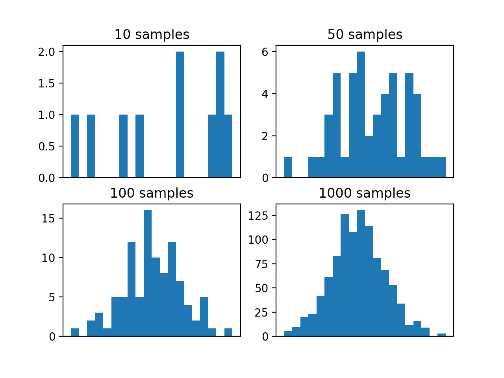

# 蒙特卡罗采样的温和介绍

> 原文：<https://machinelearningmastery.com/monte-carlo-sampling-for-probability/>

蒙特卡罗方法是随机采样概率分布的一类技术。

在许多问题领域中，描述或估计概率分布是相对简单的，但是计算一个期望的量是困难的。这可能是由于许多原因，如域的随机性质或随机变量的指数数量。

相反，期望的量可以通过使用随机采样来近似，称为蒙特卡罗方法。这些方法最初是在第一台计算机被创造出来的时候使用的，并且在科学和工程的所有领域，包括人工智能和机器学习，都很普遍。

在这篇文章中，你将发现采样概率分布的蒙特卡罗方法。

看完这篇文章，你会知道:

*   通常，我们不能用概率来计算期望的量，但是我们可以直接或间接地定义随机变量的概率分布。
*   蒙特卡罗采样从概率分布中随机采样的一类方法。
*   蒙特卡罗采样为许多机器学习方法提供了基础，例如重采样、超参数调整和集成学习。

**用我的新书[机器学习概率](https://machinelearningmastery.com/probability-for-machine-learning/)启动你的项目**，包括*分步教程*和所有示例的 *Python 源代码*文件。

我们开始吧。


概率蒙特卡罗采样的温和介绍[地中海巡航指南](https://www.flickr.com/photos/150594450@N07/36165241890/)拍摄的照片，保留部分权利。

## 概观

本教程分为三个部分；它们是:

1.  取样的需要
2.  什么是蒙特卡罗方法？
3.  蒙特卡罗方法的例子

## 取样的需要

概率中有许多问题，更广泛地说，在机器学习中，我们不能直接计算解析解。

事实上，可能有一种观点认为，对于大多数实际的概率模型来说，精确的推断可能是难以处理的。

> 对于大多数实际感兴趣的概率模型，精确的推断是难以处理的，因此我们不得不求助于某种形式的近似。

—第 523 页，[模式识别与机器学习](https://amzn.to/2JwHE7I)，2006。

期望的计算通常是离散分布的和或连续分布的积分，并且难以计算。由于许多原因，计算可能是难以处理的，例如大量的随机变量、域的随机性质、观测中的噪声、缺少观测等等。

在这类问题中，通常可以直接或通过计算模拟间接定义或估计随机变量的概率分布。

可以使用[采样](https://en.wikipedia.org/wiki/Sampling_(statistics))代替直接计算数量。

> 采样提供了一种灵活的方法，可以以更低的成本逼近许多和和积分。

—第 590 页，[深度学习](https://amzn.to/2lnc3vL)，2016。

可以从概率分布中随机抽取样本，用于近似期望的数量。

这种从概率分布中随机采样的一般技术被称为蒙特卡罗方法。

## 什么是蒙特卡罗方法？

[蒙特卡罗方法](https://en.wikipedia.org/wiki/Monte_Carlo_method)，简称 MC，是一类随机采样概率分布的技术。

使用蒙特卡罗方法随机采样概率分布有三个主要原因；它们是:

*   **估计密度**，采集样本以近似目标函数的分布。
*   **近似一个量**，如一个分布的平均值或方差。
*   **优化一个功能**，定位一个最大化或最小化目标功能的样本。

蒙特卡罗方法是以摩纳哥赌场的名字命名的，大约在第一台计算机和曼哈顿计划开发第一颗原子弹的时候，它首先被开发出来解决粒子物理问题。

> 这被称为蒙特卡罗近似法，以欧洲一座以豪华赌场闻名的城市命名。蒙特卡罗技术最早是在统计物理领域发展起来的——尤其是在原子弹研发期间——但现在也被广泛应用于统计和机器学习。

—第 52 页，[机器学习:概率视角](https://amzn.to/2xKSTCP)，2012 年。

绘制样本可能像计算随机选择事件的概率一样简单，也可能像运行计算模拟一样复杂，后者通常被称为蒙特卡罗模拟。

收集多个样本并用于近似所需的数量。

根据统计学给出的[大数定律](https://machinelearningmastery.com/a-gentle-introduction-to-the-law-of-large-numbers-in-machine-learning/)，进行的随机试验越多，近似量就越精确。

> …大数定律指出，如果样本 x(i)是 i.i.d，那么平均值几乎肯定会收敛到期望值

—第 591 页，[深度学习](https://amzn.to/2lnc3vL)，2016。

因此，样本的数量提供了对被近似的量的准确率的控制，通常受到绘制样本的计算复杂性的限制。

> 通过生成足够的样本，我们可以达到任何我们喜欢的准确率水平。主要问题是:我们如何有效地从概率分布中生成样本，尤其是在高维情况下？

—第 815 页，[机器学习:概率视角](https://amzn.to/2xKSTCP)，2012 年。

另外，给定[中心极限定理](https://machinelearningmastery.com/a-gentle-introduction-to-the-central-limit-theorem-for-machine-learning/)，样本的分布将形成正态分布，其平均值可以作为近似量，方差用于提供该量的置信区间。

> 中心极限定理告诉我们，平均值的分布[…]收敛于正态分布[…]这使得我们可以利用正态密度的累积分布来估计估计值[…]周围的置信区间。

—第 592 页，[深度学习](https://amzn.to/2lnc3vL)，2016。

蒙特卡罗方法是根据抽取样本的方式或对采样过程施加的约束来定义的。

蒙特卡罗采样方法的一些例子包括:直接采样、[重要性采样](https://en.wikipedia.org/wiki/Importance_sampling)和[拒绝采样](https://en.wikipedia.org/wiki/Rejection_sampling)。

*   **直接采样**。在没有先验信息的情况下直接对分布进行采样。
*   **重要性采样**。从目标分布的更简单近似中取样。
*   **剔除取样**。从更广泛的分布中采样，并且只考虑采样分布区域内的样本。

这是一个巨大的话题，有许多书专门讨论这个话题。接下来，让我们用一些熟悉的例子来具体说明蒙特卡罗采样的思想。

## 蒙特卡罗采样的例子

我们无时无刻不在使用蒙特卡罗方法而不去考虑它。

例如，当我们定义硬币翻转的伯努利分布，并通过从该分布中取样来模拟硬币翻转时，我们正在执行蒙特卡罗模拟。此外，当我们从整数{1，2，3，4，5，6}的均匀分布中取样来模拟骰子的滚动时，我们正在执行蒙特卡罗模拟。

当我们从域中收集随机数据样本并使用直方图或密度估计方法估计数据的概率分布时，我们也使用蒙特卡罗方法。

在一系列科学学科中，有许多使用蒙特卡罗方法的例子。

例如，蒙特卡罗方法可用于:

*   计算复杂游戏中对手移动的概率。
*   计算未来天气事件的概率。
*   计算特定条件下车辆碰撞的概率。

这些方法用于解决应用概率问题中难以推断的问题，例如从概率图形模型中取样。

与此相关的是贝叶斯模型中使用的顺序蒙特卡罗方法的思想，这些方法通常被称为[粒子滤波器](https://en.wikipedia.org/wiki/Particle_filter)。

> 粒子滤波是一种基于蒙特卡罗或模拟的递归贝叶斯推理算法。

—第 823 页，[机器学习:概率视角](https://amzn.to/2xKSTCP)，2012。

蒙特卡罗方法在人工智能和机器学习中也很普遍。

> 许多用于实现机器学习目标的重要技术都是基于从一些概率分布中抽取样本，并使用这些样本来形成一些期望量的蒙特卡罗估计。

—第 590 页，[深度学习](https://amzn.to/2lnc3vL)，2016。

它们为通过模拟(如机器人)估计人工智能问题的结果可能性提供了基础。更简单地说，蒙特卡罗方法用于解决棘手的集成问题，例如在渲染计算机生成的场景时，在计算机图形的[路径跟踪](https://en.wikipedia.org/wiki/Path_tracing)中发射随机光线。

在机器学习中，蒙特卡罗方法为重采样技术提供了基础，如用于估计数量的[自举方法](https://machinelearningmastery.com/a-gentle-introduction-to-the-bootstrap-method/)，例如有限数据集上模型的准确率。

> bootstrap 是一种简单的蒙特卡罗技术，用于近似采样分布。这在估计量是真实参数的复函数的情况下特别有用。

—第 192 页，[机器学习:概率视角](https://amzn.to/2xKSTCP)，2012。

当调整模型时，模型超参数的随机采样是一种蒙特卡罗方法，用于克服诸如小数据样本中的有限大小和噪声以及学习算法中的随机方差等挑战的集成模型也是如此。

*   重采样算法。
*   随机超参数调谐。
*   集成学习算法。

蒙特卡罗方法也为随机或随机优化算法提供了基础，例如流行的[模拟退火优化技术](https://en.wikipedia.org/wiki/Simulated_annealing)。

> 蒙特卡罗算法，其中模拟退火是一个例子，被用于许多科学分支，以估计难以准确计算的数量。

—第 530 页，[人工智能:现代方法](https://amzn.to/2Y7yCpO)，第 3 版，2009 年。

*   随机优化算法

## 蒙特卡罗采样的实例

我们可以用一个实例来制作蒙特卡罗采样混凝土。

在这种情况下，我们将有一个定义随机变量概率分布的函数。我们将使用均值为 50、标准差为 5 的高斯分布，并从该分布中抽取随机样本。

假设我们不知道这个随机变量的概率分布形式，我们想对函数进行采样，得到概率密度的概念。我们可以绘制一个给定大小的样本，并绘制一个直方图来估计密度。

[normal() NumPy 函数](https://docs.scipy.org/doc/numpy-1.15.0/reference/generated/numpy.random.normal.html)可用于从具有指定平均值(*μ*)、标准偏差(*σ*)和样本大小的高斯分布中随机抽取样本。

为了让这个例子更有趣，我们将用不同大小的样本重复这个实验四次。我们预计，随着样本大小的增加，概率密度将更好地逼近目标函数的真实密度，给定大数定律。

下面列出了完整的示例。

```py
# example of effect of size on monte carlo sample
from numpy.random import normal
from matplotlib import pyplot
# define the distribution
mu = 50
sigma = 5
# generate monte carlo samples of differing size
sizes = [10, 50, 100, 1000]
for i in range(len(sizes)):
	# generate sample
	sample = normal(mu, sigma, sizes[i])
	# plot histogram of sample
	pyplot.subplot(2, 2, i+1)
	pyplot.hist(sample, bins=20)
	pyplot.title('%d samples' % sizes[i])
	pyplot.xticks([])
# show the plot
pyplot.show()
```

运行该示例会创建四个不同大小的样本，并为每个样本绘制直方图。

我们可以看到，10 和 50 的小样本量并不能有效地捕捉目标函数的密度。我们可以看到 100 个样本更好，但是直到 1000 个样本，我们才清楚地看到熟悉的高斯概率分布的钟形。

这突出了需要绘制许多样本，甚至对于简单的随机变量，以及随着绘制的样本数量增加近似准确率的好处。



来自目标函数的不同大小蒙特卡罗样本的直方图

## 进一步阅读

如果您想更深入地了解这个主题，本节将提供更多资源。

### 书

*   第 29 章蒙特卡罗方法，[信息论，推理和学习算法](https://amzn.to/31PXl0b)，2003。
*   第 27 章采样，[贝叶斯推理与机器学习](https://amzn.to/2Hgc4d5)，2011。
*   第 14.5 节贝叶斯网络中的近似推理，[人工智能:现代方法](https://amzn.to/2Y7yCpO)，第 3 版，2009。
*   第 23 章蒙特卡洛推断，[机器学习:概率视角](https://amzn.to/2xKSTCP)，2012。
*   第十一章采样方法，[模式识别与机器学习](https://amzn.to/2JwHE7I)，2006。
*   第十七章蒙特卡罗方法，[深度学习](https://amzn.to/2lnc3vL)，2016。

### 文章

*   [采样(统计)，维基百科](https://en.wikipedia.org/wiki/Sampling_(statistics))。
*   [蒙特卡罗方法，维基百科](https://en.wikipedia.org/wiki/Monte_Carlo_method)。
*   [蒙特卡洛集成，维基百科](https://en.wikipedia.org/wiki/Monte_Carlo_integration)。
*   [重要性采样，维基百科](https://en.wikipedia.org/wiki/Importance_sampling)。
*   [拒绝采样，维基百科](https://en.wikipedia.org/wiki/Rejection_sampling)。

## 摘要

在这篇文章中，你发现了采样概率分布的蒙特卡罗方法。

具体来说，您了解到:

*   通常，我们不能用概率来计算期望的量，但是我们可以直接或间接地定义随机变量的概率分布。
*   蒙特卡罗采样从概率分布中随机采样的一类方法。
*   蒙特卡罗采样为许多机器学习方法提供了基础，例如重采样、超参数调整和集成学习。

你有什么问题吗？
在下面的评论中提问，我会尽力回答。