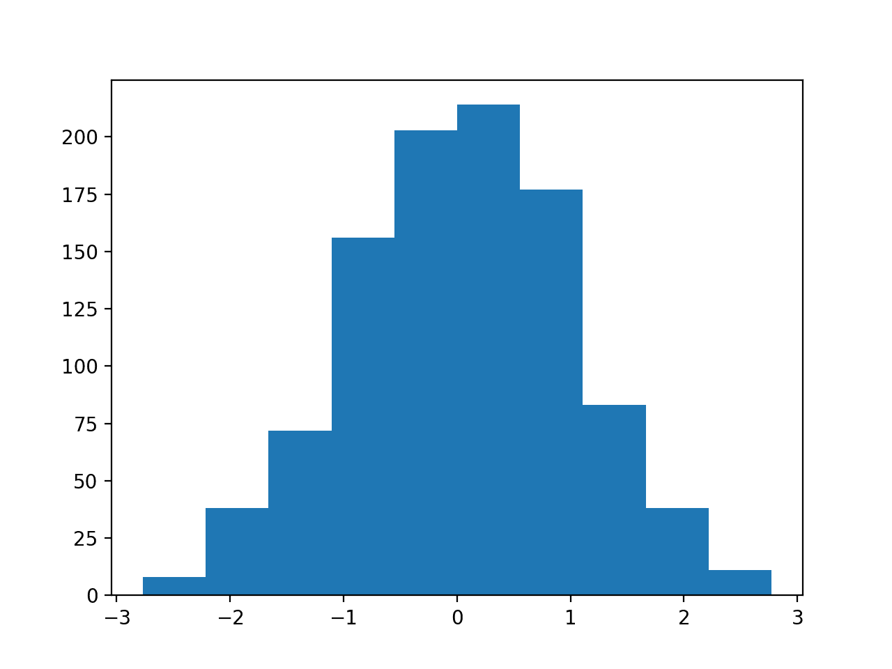
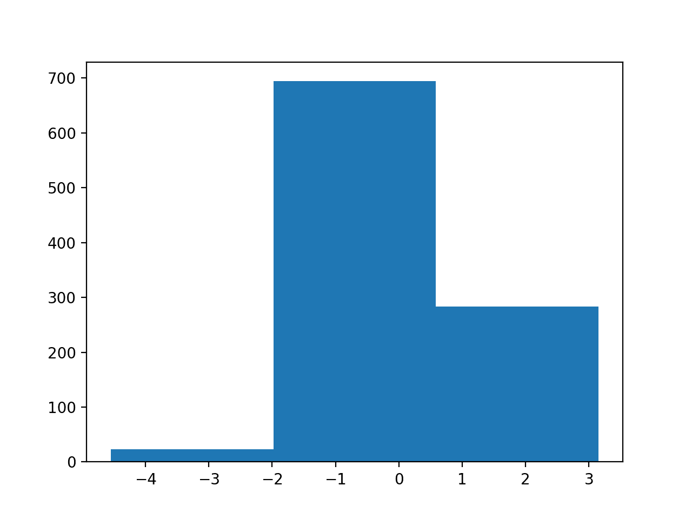
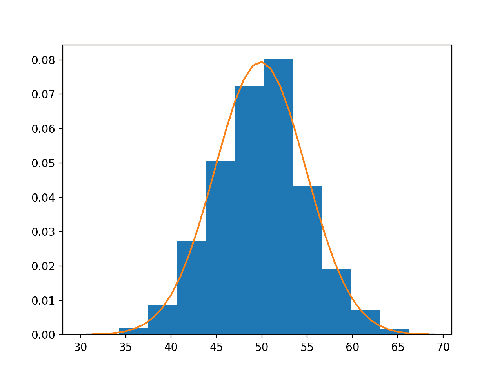
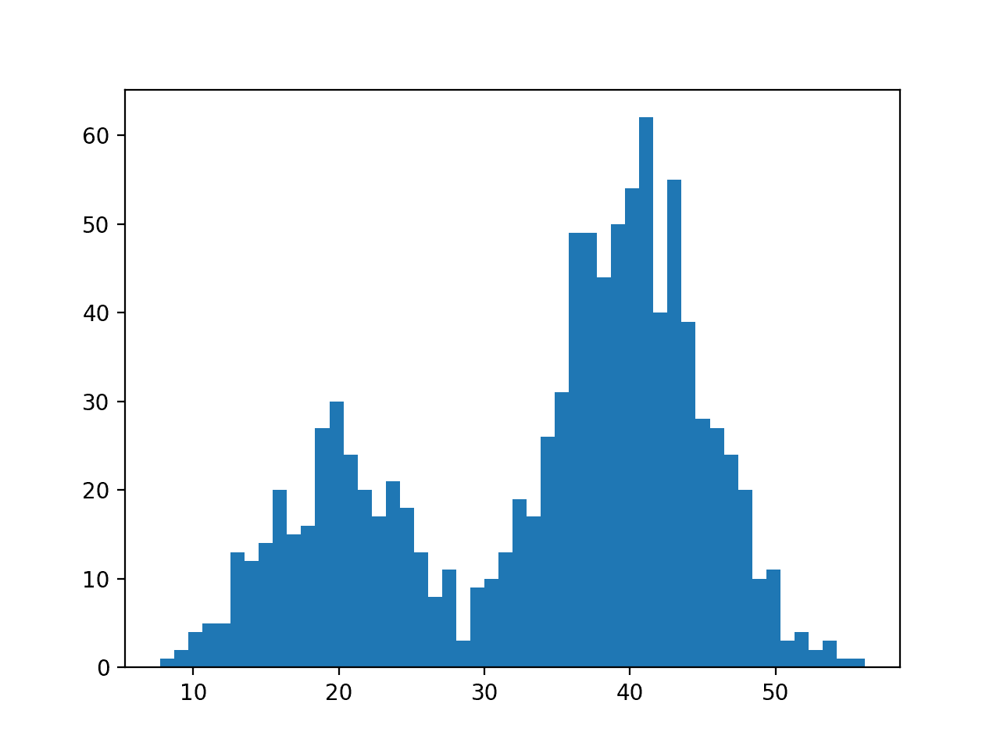

# 概率密度估计的简单介绍

> 原文：<https://machinelearningmastery.com/probability-density-estimation/>

最后更新于 2020 年 7 月 24 日

概率密度是观测值和它们的概率之间的关系。

随机变量的一些结果具有低概率密度，而其他结果具有高概率密度。

概率密度的整体形状称为概率分布，随机变量特定结果的概率计算由概率密度函数(简称 PDF)执行。

知道数据样本的概率密度函数是有用的，以便知道给定的观测值是否不太可能，或者不太可能被认为是异常值或异常值，以及是否应该将其删除。为了选择需要输入数据具有特定概率分布的适当学习方法，这也是有帮助的。

随机数据样本的概率密度函数不太可能是已知的。因此，概率密度必须使用称为概率密度估计的过程来近似。

在本教程中，您将发现概率密度估计的温和介绍。

完成本教程后，您将知道:

*   直方图提供了一种快速可靠的方法来可视化数据样本的概率密度。
*   参数概率密度估计包括选择一个公共分布，并从数据样本中估计密度函数的参数。
*   非参数概率密度估计包括使用一种技术来使模型适合数据的任意分布，如核密度估计。

**用我的新书[机器学习概率](https://machinelearningmastery.com/probability-for-machine-learning/)启动你的项目**，包括*分步教程*和所有示例的 *Python 源代码*文件。

我们开始吧。


概率密度估计简介[阿利斯泰尔·帕特森](https://www.flickr.com/photos/alpat/5644087614/)摄，版权所有。

## 教程概述

本教程分为四个部分；它们是:

1.  概率密度
2.  用直方图总结密度
3.  参数密度估计
4.  非参数密度估计

## 概率密度

随机变量 *x* 具有概率分布 *p(x)* 。

随机变量的结果与其概率之间的关系被称为概率密度，或简称为“*密度*”

如果随机变量是连续的，那么概率可以通过概率密度函数计算，简称 PDF。随机变量的概率密度函数在整个域中的形状称为概率分布，常见的概率分布有一些名称，如均匀分布、正态分布、指数分布等等。

给定一个随机变量，我们对它的概率密度感兴趣。

例如，给定一个变量的随机样本，我们可能想知道概率分布的形状、最可能的值、值的分布以及其他属性。

了解随机变量的概率分布有助于计算分布的矩，如均值和方差，但也有助于其他更一般的考虑，如确定某个观测值是不太可能还是非常不可能，以及可能是异常值或异常值。

问题是，我们可能不知道随机变量的概率分布。我们很少知道分布情况，因为我们无法获得随机变量的所有可能结果。事实上，我们所能得到的只是一个观察样本。因此，我们必须选择一个概率分布。

这个问题被称为概率密度估计，或简称为“*密度估计*”，因为我们使用随机样本中的观测值来估计概率的一般密度，而不仅仅是我们现有的数据样本。

随机变量的密度估计过程有几个步骤。

第一步是用简单的直方图检查随机样本中的观察密度。从直方图中，我们可能能够识别出一个可以使用的常见且易于理解的概率分布，例如正态分布。如果没有，我们可能需要拟合一个模型来估计分布。

在接下来的几节中，我们将依次仔细研究这些步骤。

为了简单起见，我们将在这篇文章中关注单变量数据，例如一个随机变量。虽然这些步骤适用于多变量数据，但随着变量数量的增加，它们可能会变得更具挑战性。

## 用直方图总结密度

密度估计的第一步是创建随机样本中观察值的[直方图](https://en.wikipedia.org/wiki/Histogram)。

直方图是一种绘图，它首先将观察值分组到不同的箱中，并计算落入每个箱中的事件数量。然后将每个面元中的计数或观察频率绘制成条形图，其中面元位于 x 轴，频率位于 y 轴。

面元数量的选择很重要，因为它控制着分布的粗糙度(条形的数量)，进而控制着观测值的密度的绘制。对于给定的数据样本，尝试不同的容器大小是一个好主意，这样可以获得同一数据的多个视角或视图。

例如，1 到 100 之间的观测值可以分成 3 个可能太粗糙的面元(1-33，34-66，67-100)，或者 10 个面元(1-10，11-20，… 91-100)，它们可以更好地捕捉密度。

可以使用 Matplotlib 库和 [hist()函数](https://matplotlib.org/3.1.1/api/_as_gen/matplotlib.pyplot.hist.html)创建直方图。数据作为第一个参数提供，箱的数量通过“*箱*”参数指定为整数(例如 10)或每个箱的边界序列(例如[1，34，67，100])。

下面的代码片段为一个数据样本创建了一个包含 10 个面元的直方图。

```py
...
# plot a histogram of the sample
pyplot.hist(sample, bins=10)
pyplot.show()
```

我们可以创建一个从正态分布中抽取的随机样本，假装我们不知道该分布，然后创建一个数据直方图。 [normal() NumPy 函数](https://docs.scipy.org/doc/numpy/reference/generated/numpy.random.normal.html)将实现这一点，我们将生成 1000 个样本，平均值为 0，标准偏差为 1，例如标准高斯。

下面列出了完整的示例。

```py
# example of plotting a histogram of a random sample
from matplotlib import pyplot
from numpy.random import normal
# generate a sample
sample = normal(size=1000)
# plot a histogram of the sample
pyplot.hist(sample, bins=10)
pyplot.show()
```

运行该示例绘制了一个随机观察的样本，并创建了具有 10 个面元的直方图。我们可以清楚地看到正态分布的形状。

请注意，由于数据样本的随机性，您的结果会有所不同。试着运行这个例子几次。



随机数据样本的 10 格直方图

运行将箱设置为 3 的示例会使正态分布不太明显。



随机数据样本的 3 个面元直方图

查看具有一系列不同箱数的数据样本的直方图将有助于识别密度是否看起来像共同的概率分布。

在大多数情况下，您会看到单峰分布，例如常见的正态分布的钟形、均匀分布的扁平形状，或者指数或帕累托分布的下降或上升形状。

您可能还会看到复杂的分布，例如多个峰值不会随着不同的箱数而消失，称为双峰分布，或者多个峰值称为多峰分布。对于给定值或指示异常值的小范围值，您可能还会看到密度的大峰值，通常出现在远离密度其余部分的分布尾部。

## 参数密度估计

大多数随机样本的直方图形状将与众所周知的概率分布相匹配。

常见的分布是常见的，因为它们一次又一次地出现在不同的、有时是意想不到的领域。

熟悉常见的概率分布，因为它将帮助您从直方图中识别给定的分布。

一旦识别出来，你可以尝试用选择的概率分布来估计随机变量的密度。这可以通过从随机数据样本中估计分布参数来实现。

例如，正态分布有两个参数:平均值和标准差。给定这两个参数，我们现在知道概率分布函数。这些参数可以通过计算样本平均值和样本标准偏差从数据中估计出来。

我们称这个过程为参数密度估计。

原因是我们使用预定义的函数来总结观测值和它们的概率之间的关系，这些概率可以用参数来控制或配置，因此出现了“*参数化*”。

一旦我们估计了密度，我们就可以检查它是否合适。这可以通过多种方式实现，例如:

*   绘制密度函数并将形状与直方图进行比较。
*   对密度函数进行采样，并将生成的样本与真实样本进行比较。
*   使用统计测试来确认数据符合分布。

我们可以用一个例子来证明。

我们可以从均值为 50、标准差为 5 的正态分布中生成 1000 个观测值的随机样本。

```py
...
# generate a sample
sample = normal(loc=50, scale=5, size=1000)
```

然后，我们可以假装不知道概率分布，也许看直方图，猜测它是正常的。假设它是正态的，那么我们就可以计算出分布的参数，具体来说就是均值和标准差。

考虑到采样过程中的小样本量和噪声，我们不会期望均值和标准差分别为 50 和 5。

```py
...
# calculate parameters
sample_mean = mean(sample)
sample_std = std(sample)
print('Mean=%.3f, Standard Deviation=%.3f' % (sample_mean, sample_std))
```

然后用这些参数拟合分布，即我们的数据样本的参数密度估计。

在这种情况下，我们可以使用 [norm() SciPy 函数](https://docs.scipy.org/doc/scipy/reference/generated/scipy.stats.norm.html)。

```py
...
# define the distribution
dist = norm(sample_mean, sample_std)
```

然后，我们可以从这个分布中为我们领域中的一系列值采样概率，在本例中为 30 到 70。

```py
...
# sample probabilities for a range of outcomes
values = [value for value in range(30, 70)]
probabilities = [dist.pdf(value) for value in values]
```

最后，我们可以绘制数据样本的直方图，并覆盖为 PDF 值范围计算的概率线图。

重要的是，我们可以将直方图每个面元中的计数或频率转换为归一化概率，以确保直方图的 y 轴与线图的 y 轴相匹配。这可以通过在对 [hist()](https://matplotlib.org/3.1.1/api/_as_gen/matplotlib.pyplot.hist.html) 的调用中将“*密度*参数设置为“*真*来实现。

```py
...
# plot the histogram and pdf
pyplot.hist(sample, bins=10, density=True)
pyplot.plot(values, probabilities)
```

将这些片段连接在一起，参数密度估计的完整示例如下所示。

```py
# example of parametric probability density estimation
from matplotlib import pyplot
from numpy.random import normal
from numpy import mean
from numpy import std
from scipy.stats import norm
# generate a sample
sample = normal(loc=50, scale=5, size=1000)
# calculate parameters
sample_mean = mean(sample)
sample_std = std(sample)
print('Mean=%.3f, Standard Deviation=%.3f' % (sample_mean, sample_std))
# define the distribution
dist = norm(sample_mean, sample_std)
# sample probabilities for a range of outcomes
values = [value for value in range(30, 70)]
probabilities = [dist.pdf(value) for value in values]
# plot the histogram and pdf
pyplot.hist(sample, bins=10, density=True)
pyplot.plot(values, probabilities)
pyplot.show()
```

运行该示例首先生成数据样本，然后估计正态概率分布的参数。

请注意，由于数据样本的随机性，您的结果会有所不同。试着运行这个例子几次。

在这种情况下，我们可以看到均值和标准差有一些噪声，分别与期望值 50 和 5 略有不同。噪音很小，分布预计仍然很合适。

```py
Mean=49.852, Standard Deviation=5.023
```

接下来，使用估计的参数拟合 PDF，并且将具有 10 个面元的数据的直方图与从 PDF 采样的一系列值的概率进行比较。

我们可以看到，PDF 与我们的数据非常匹配。



正态分布的概率密度函数叠加数据样本直方图

有可能数据确实符合常见的概率分布，但需要在参数密度估计之前进行转换。

例如，您可能有远离分布的平均值或质心的异常值。这可能会导致对分布参数的估计不正确，进而导致数据拟合不良。在估计分布参数之前，应该去除这些异常值。

另一个例子是数据可能有偏差或向左或向右移动。在这种情况下，您可能需要在估计参数之前转换数据，例如取对数或平方根，或者更一般地，使用[幂变换，如 Box-Cox 变换](https://machinelearningmastery.com/power-transform-time-series-forecast-data-python/)。

这些类型的数据修改可能并不明显，有效的参数密度估计可能需要以下迭代过程:

*   循环，直到分布与数据的匹配足够好:
    *   1.估计分布参数
    *   2.对照数据检查生成的 PDF
    *   3.转换数据以更好地适应分布

## 非参数密度估计

在某些情况下，数据样本可能不像常见的概率分布，或者不容易适应该分布。

当数据具有两个峰值(双峰分布)或多个峰值(多峰分布)时，通常会出现这种情况。

在这种情况下，参数密度估计是不可行的，可以使用不使用共同分布的替代方法。取而代之的是，使用一种算法来近似没有预定义分布的数据的概率分布，称为非参数方法。

这些分布仍然会有参数，但不能像简单的概率分布那样直接控制。例如，非参数方法可能使用随机样本中的所有观测值来估计密度，实际上是使样本中的所有观测值成为“*参数*”

估计连续随机变量概率密度函数的最常见的非参数方法可能被称为核平滑，或简称为 KDE 核密度估计。

*   **核密度估计**:使用数据集估计新点概率的非参数方法。

在这种情况下，核是一个数学函数，它返回随机变量给定值的概率。内核有效地平滑或插值随机变量结果范围内的概率，使得概率之和等于 1，这是行为良好的概率的要求。

内核函数根据数据样本与请求概率的给定查询样本的关系或距离，对来自数据样本的观测值的贡献进行加权。

称为*平滑参数*或*带宽*的参数控制数据样本中有助于估计给定样本概率的观察范围或窗口。因此，内核密度估计有时被称为 Parzen-Rosenblatt 窗口，或简称为 Parzen 窗口，在方法的开发者之后。

*   **平滑参数(*带宽* )** :控制用于估计新点概率的样本数或样本窗口的参数。

大窗口可能导致粗略的密度和很少的细节，而小窗口可能有太多的细节，并且不够平滑或通用，不能正确地覆盖新的或看不见的示例。可以使用不同的函数，有时称为*基函数*，例如均匀法线等，来对窗口内样本的贡献进行整形。，对所得密度函数的平滑度有不同的影响。

*   **基函数(*核* )** :选择的函数用于控制数据集中样本对估计新点概率的贡献。

因此，用不同的窗口大小和不同的贡献函数进行实验并根据数据的直方图评估结果可能是有用的。

我们可以用一个例子来证明。

首先，我们可以通过组合来自两个不同正态分布的样本来构建双峰分布。具体而言，300 个实例的平均值为 20，标准偏差为 5(较小的峰值)，700 个实例的平均值为 40，标准偏差为 5(较大的峰值)。平均值选择得很接近，以确保组合样本中的分布重叠。

下面列出了创建具有双峰概率分布的样本并绘制直方图的完整示例。

```py
# example of a bimodal data sample
from matplotlib import pyplot
from numpy.random import normal
from numpy import hstack
# generate a sample
sample1 = normal(loc=20, scale=5, size=300)
sample2 = normal(loc=40, scale=5, size=700)
sample = hstack((sample1, sample2))
# plot the histogram
pyplot.hist(sample, bins=50)
pyplot.show()
```

运行该示例会创建数据样本并绘制直方图。

请注意，由于数据样本的随机性，您的结果会有所不同。试着运行这个例子几次。

平均值为 20 的样本比平均值为 40 的样本要少，这可以在直方图中看到，40 左右的样本密度大于 20 左右的样本密度。

根据设计，具有这种分布的数据不能很好地符合普通的概率分布。这是使用非参数核密度估计方法的一个很好的例子。



双峰概率分布数据样本的直方图

Sklearn 机器学习库提供了实现内核密度估计的[内核密度类](https://Sklearn.org/stable/modules/generated/sklearn.neighbors.KernelDensity.html)。

首先，这个类是用期望的带宽(窗口大小)和内核(基函数)参数构造的。在数据上测试不同的配置是个好主意。在这种情况下，我们将尝试带宽为 2 和高斯核。

然后通过*拟合()*函数将该类拟合到数据样本上。该函数希望数据具有 2D 形状，其形式为[行，列]，因此我们可以将数据样本重新整形为 1，000 行 1 列。

```py
...
# fit density
model = KernelDensity(bandwidth=2, kernel='gaussian')
sample = sample.reshape((len(sample), 1))
model.fit(sample)
```

然后，我们可以通过计算一系列观察值的概率，并将形状与直方图进行比较，来评估密度估计值与我们的数据的匹配程度，就像我们在上一节中对参数情况所做的那样。

*核密度*上的 *score_samples()* 函数将计算样本数组的对数概率。我们可以创建一个从 1 到 60 的样本范围，大约是我们的域的范围，计算对数概率，然后通过计算指数或 *exp()* 来反转对数操作，以将值返回到正常概率的范围 0-1。

```py
...
# sample probabilities for a range of outcomes
values = asarray([value for value in range(1, 60)])
values = values.reshape((len(values), 1))
probabilities = model.score_samples(values)
probabilities = exp(probabilities)
```

最后，我们可以创建一个归一化频率的直方图和一个估计概率值的覆盖线图。

```py
...
# plot the histogram and pdf
pyplot.hist(sample, bins=50, density=True)
pyplot.plot(values[:], probabilities)
pyplot.show()
```

将这些联系在一起，下面列出了双峰数据样本的核密度估计的完整示例。

```py
# example of kernel density estimation for a bimodal data sample
from matplotlib import pyplot
from numpy.random import normal
from numpy import hstack
from numpy import asarray
from numpy import exp
from sklearn.neighbors import KernelDensity
# generate a sample
sample1 = normal(loc=20, scale=5, size=300)
sample2 = normal(loc=40, scale=5, size=700)
sample = hstack((sample1, sample2))
# fit density
model = KernelDensity(bandwidth=2, kernel='gaussian')
sample = sample.reshape((len(sample), 1))
model.fit(sample)
# sample probabilities for a range of outcomes
values = asarray([value for value in range(1, 60)])
values = values.reshape((len(values), 1))
probabilities = model.score_samples(values)
probabilities = exp(probabilities)
# plot the histogram and pdf
pyplot.hist(sample, bins=50, density=True)
pyplot.plot(values[:], probabilities)
pyplot.show()
```

运行该示例创建数据分布，拟合核密度估计模型，然后绘制数据样本的直方图和来自 KDE 模型的 PDF。

请注意，由于数据样本的随机性，您的结果会有所不同。试着运行这个例子几次。

在这种情况下，我们可以看到 PDF 非常适合直方图。它不是很平滑，可以通过将“*带宽*”参数设置为 3 个样本或更高来使其更加平滑。用不同的带宽值和内核函数进行实验。


通过双峰数据样本的核密度估计估计的直方图和概率密度函数图

KernelDensity 类功能强大，并支持多维数据的 PDF 估计。

## 进一步阅读

如果您想更深入地了解这个主题，本节将提供更多资源。

### 书

*   [模式识别与机器学习](https://amzn.to/2JwHE7I)，2006。
*   [机器学习:概率视角](https://amzn.to/2xKSTCP)，2012。
*   [统计学习的要素:数据挖掘、推理和预测](https://amzn.to/2LDuLLE)，2009。

### 应用程序接口

*   [scipy . stats . Gaussian _ kde API](https://docs.scipy.org/doc/scipy/reference/generated/scipy.stats.gaussian_kde.html)。
*   [非参数方法非参数，Statsmodels API](https://www.statsmodels.org/stable/nonparametric.html) 。
*   [核密度估计统计模型示例](https://www.statsmodels.org/stable/examples/notebooks/generated/kernel_density.html)。
*   [密度估计，Sklearn API](https://Sklearn.org/stable/modules/density.html) 。

### 文章

*   [密度估计，维基百科](https://en.wikipedia.org/wiki/Density_estimation)。
*   [直方图，维基百科](https://en.wikipedia.org/wiki/Histogram)。
*   [核密度估计，维基百科](https://en.wikipedia.org/wiki/Kernel_density_estimation)。
*   [多元核密度估计，维基百科](https://en.wikipedia.org/wiki/Multivariate_kernel_density_estimation)。
*   [通过帕尔森-罗森布拉特窗口法估计核密度](https://sebastianraschka.com/Articles/2014_kernel_density_est.html)，2014 年。
*   [深度:核密度估计](https://jakevdp.github.io/PythonDataScienceHandbook/05.13-kernel-density-estimation.html)。

## 摘要

在本教程中，您发现了概率密度估计的温和介绍。

具体来说，您了解到:

*   直方图提供了一种快速可靠的方法来可视化数据样本的概率密度。
*   参数概率密度估计包括选择一个公共分布，并从数据样本中估计密度函数的参数。
*   非参数概率密度估计包括使用一种技术来使模型适合数据的任意分布，如核密度估计。

你有什么问题吗？
在下面的评论中提问，我会尽力回答。