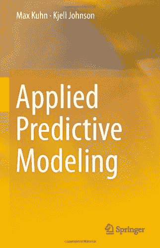
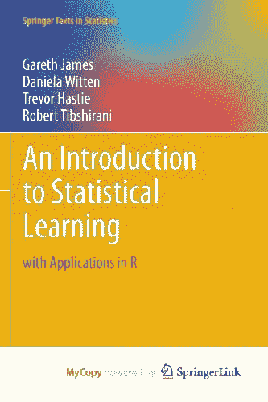
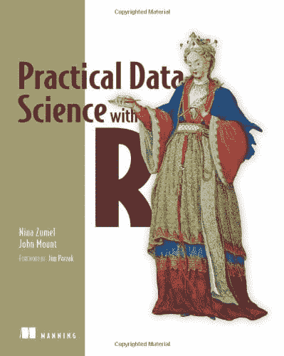
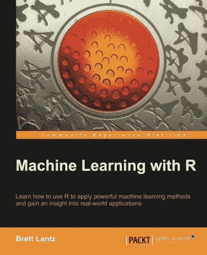
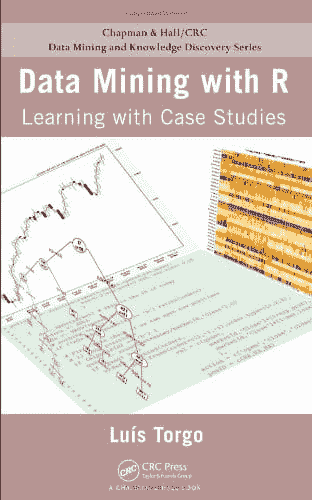
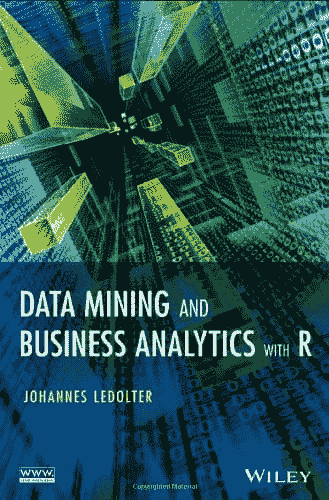
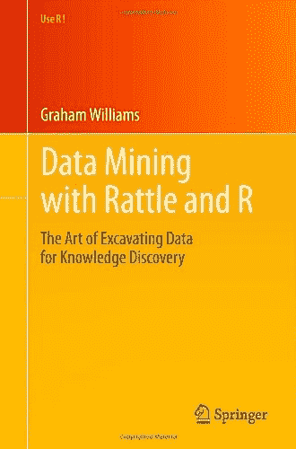

# R 机器学习书籍

> 原文：<https://machinelearningmastery.com/books-for-machine-learning-with-r/>

最后更新于 2020 年 8 月 16 日

r 是一个强大的数据分析和机器学习平台。

它是我在竞赛和咨询工作等方面的主要工作。原因是大量强大的算法可用，都在一个平台上。

在这篇文章中，我想指出一些你可以用来开始机器学习的资源。

**用我的新书[用 R](https://machinelearningmastery.com/machine-learning-with-r/) 启动你的项目**，包括*一步一步的教程*和所有例子的 *R 源代码*文件。

我们开始吧。

## R 简介

在开始解决机器学习的问题之前，您可能需要熟悉平台和语言。

我认为熟悉自己的最好方法是开始解决问题。真正工作的考验会迫使你去学习你必须学习的东西来解决你的问题。一个好的参考可以帮助你回答你的“*我怎么……*”问题。

### [R 简单来说](https://amzn.to/31UAr9J)

简而言之

刚开始读 R 的时候，我从头到尾读的书是 [R 简写为](https://amzn.to/31UAr9J)。它会带你从安装、基本操作、数据分析，甚至一些机器学习算法，一路走过平台。我强烈推荐它。

我选择它是因为它是一个广泛的参考。我想稍微了解一下平台上的一切，这样当我有具体的问题时，我就知道去哪里找了。

## 机器学习

在 R 语言中实现了大量的机器学习算法，其中许多算法是由学者和他们的团队首先开发的。仅这一点就是在 r .中开始的一个令人信服的理由。此外，数据处理/操作和绘图工具非常强大(尽管 Python 的 SciPy 堆栈正在迎头赶上)。

### 机器学习和统计学习

不是一本书，但你可以从 Torsten Hothorn 维护的 CRAN 上的[机器学习和统计学习](https://cran.r-project.org/web/views/MachineLearning.html)视图开始。它列出了大多数可以用于机器学习的 R 包，按算法和算法类型分组。

这是一个很好的起点，但我认为它可以做得更好的一件事是指出规范包，并详细说明一些可用的包装包，如 caret。

### [应用预测建模](https://amzn.to/3iFPHhq)

应用预测建模

这本书的作者马克斯·库恩是著名的[caret 包](http://caret.r-forge.r-project.org/)的创造者。[应用预测建模](https://amzn.to/3iFPHhq)非常实用，在第一部分首先描述了预测分析流程和案例研究。第 2 部分和第 3 部分研究回归和分类算法，最后一部分涵盖更高级的主题，如特征选择。

这是一本厚厚的书，也是一本很好的参考书，我是这本书的粉丝。也可以查看[的配套网站](http://appliedpredictivemodeling.com/)获取相关资源。

### [统计学习导论:在 R 中的应用](https://amzn.to/3gYt0V9)

统计学习导论——及其在 R

这是经典的“[《统计学习的要素:数据挖掘、推理和预测》](https://amzn.to/31SA3bt)”的更容易理解的版本，包括两位相同的作者。

[统计学习入门](https://amzn.to/3gYt0V9)首先介绍了统计学习以及模型准确率和偏差-方差权衡等问题。第 3 章和第 4 章着眼于线性回归和一些更简单的分类算法。接下来的几章将讨论交叉验证、非线性回归前的模型选择、决策树、SVM 和非监督方法。

这本书也可以从[作者网页](http://www-bcf.usc.edu/~gareth/ISL/)免费在线获得。

### [带 R 的实用数据科学](https://amzn.to/3h0yy1j)

实用数据科学

[带 R 的实用数据科学](https://amzn.to/3h0yy1j)比机器学习更有数据科学的旋转。第 1 部分是将数据加载到 r 中的介绍性内容。第 2 部分从模型评估开始，通过 k-NN、朴素贝叶斯、线性回归、聚类、关联规则和 SVM，逐步增加模型的复杂性。第 3 部分解决了一些高级问题，如自我记录脚本和呈现结果。

提供了一个很好的介绍和切实可行的建议。

### [带 R 的机器学习](https://amzn.to/2CtJ8yV)

带 R 的机器学习

[带 R 的机器学习](https://amzn.to/2CtJ8yV)提供了 R 中机器学习的概述，不涉及细节或理论。它还大量使用案例研究来演示每种算法。它首先简要介绍了机器学习和 R 以及 R 中的数据管理。它在后续章节中涵盖了 k-NN、朴素贝叶斯、决策树、回归、神经网络、Apriori 和聚类。

它以关于模型评估、算法调整和其他高级主题的章节结束。本文的一个很好的特点是每章提供的一步一步的顺序，围绕案例研究提供了一个可操作的框架。

### [R 数据挖掘:案例学习](https://amzn.to/2Y57rL6)

基于案例研究的 R 学习数据挖掘

在第一章快速介绍了 R 之后，[用 R 进行数据挖掘](https://amzn.to/2Y57rL6)给出了一个又一个案例研究。这些包括:预测藻类大量繁殖，股票市场回报，欺诈交易和分类微阵列样本。每项研究都探索了各种不同的数据准备、模型构建和模型评估方法。

如果你想找到解决实际问题的方法，这是一本非常有价值的书。

### [带 R 的数据挖掘和业务分析](https://amzn.to/3fW4J0x)

数据挖掘和业务分析

[使用 R 的数据挖掘和商业分析](https://amzn.to/3fW4J0x)提供了使用 R 的工作示例，但是这些示例更侧重于商业而不是科学，就像在其他一些书中一样。这些章节通过使用 R 的关键机器学习方法和较小的案例研究贯穿始终。这本书以一些关于文本情感分析和网络数据建模的大型案例研究结束。

### [带拨浪鼓和 R 的数据挖掘:挖掘数据进行知识发现的艺术(用 R！)](https://amzn.to/2FtrrAN)

带拨浪鼓和 R 的数据挖掘——为知识发现挖掘数据的艺术

[带拨浪鼓和 R 的数据挖掘](https://amzn.to/2FtrrAN)提供了机器学习算法的介绍，尽管难点在于使用了拨浪鼓图形环境。在第 1 部分关于加载和处理数据的介绍材料之后，第 2 部分将介绍标准的机器学习算法。

关于算法的介绍，我喜欢的是标准化的描述，包括教程、参数调整和命令摘要。我非常喜欢算法的一致结构化表示。

## 摘要

我们已经收集了 7 本关于使用 R 平台的热门机器学习书籍。

我能给的最好的建议就是挑一个读一读。从头到尾读一遍，做笔记，做练习。和编程一样，使用 R 是一项只有通过练习才能建立起来的实用技能。练习机器学习 r。

我错过了一本关于机器学习的书吗？留言告诉我。