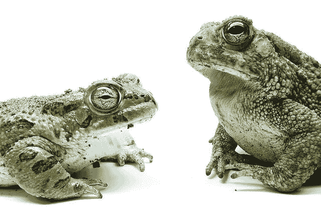
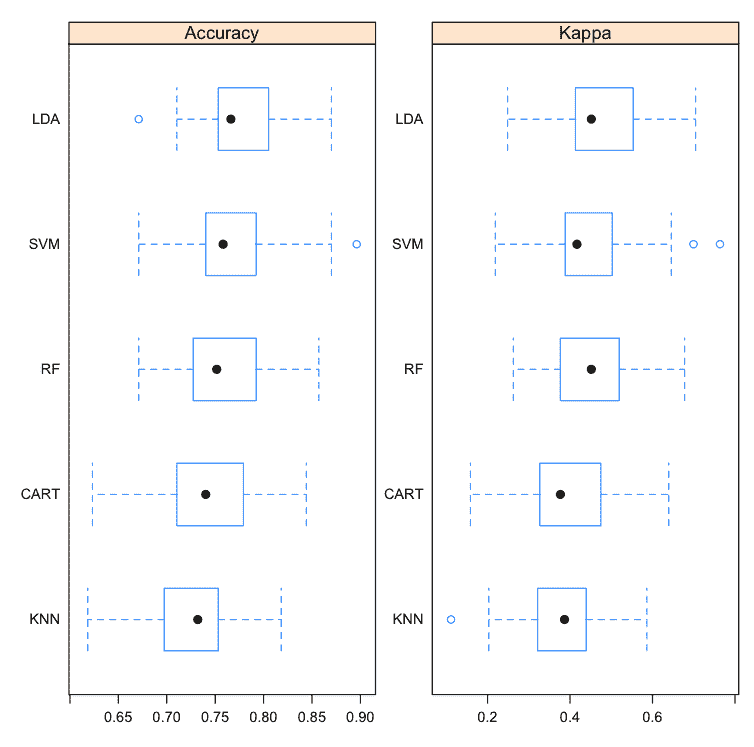
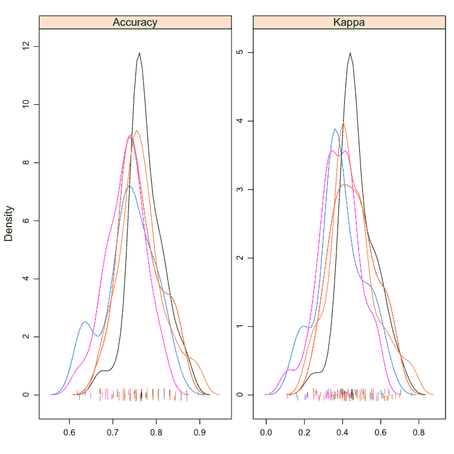
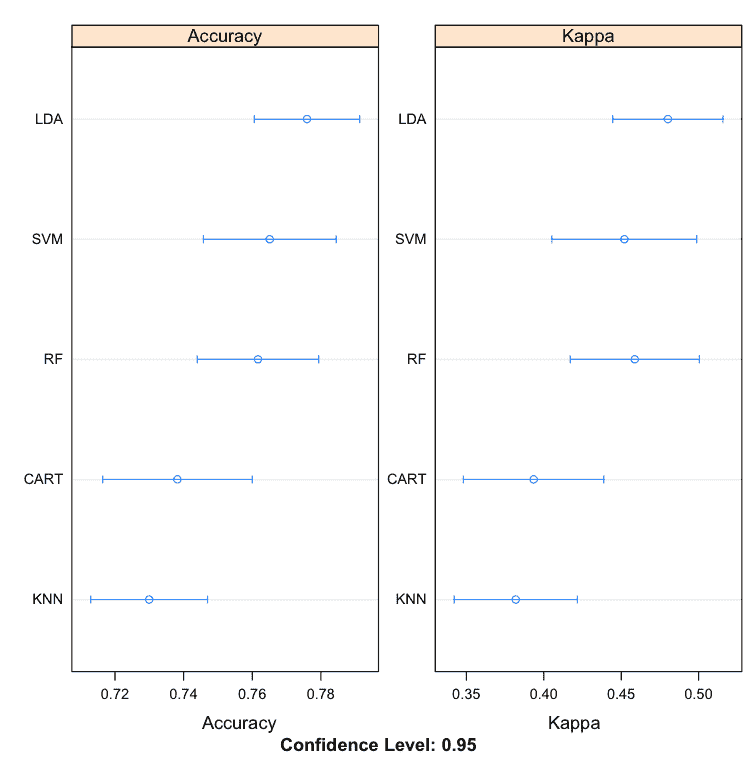
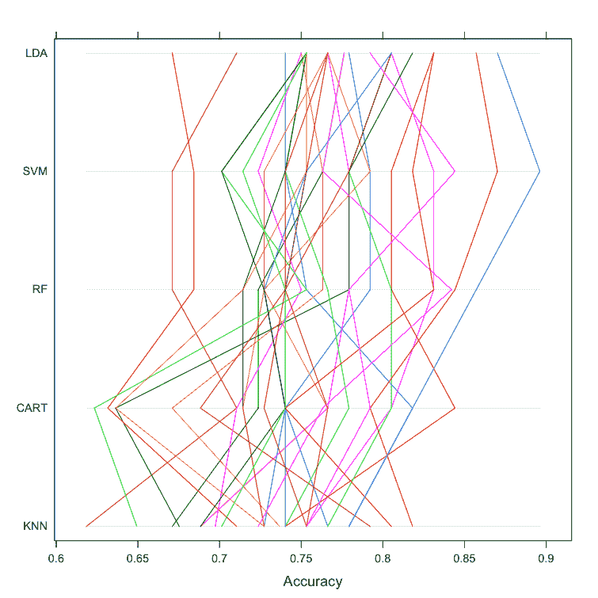
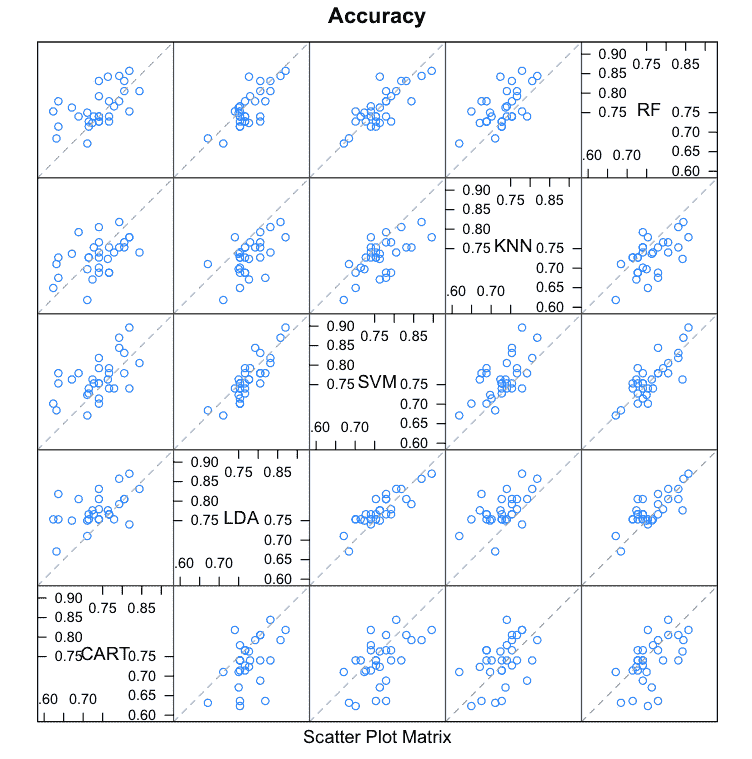
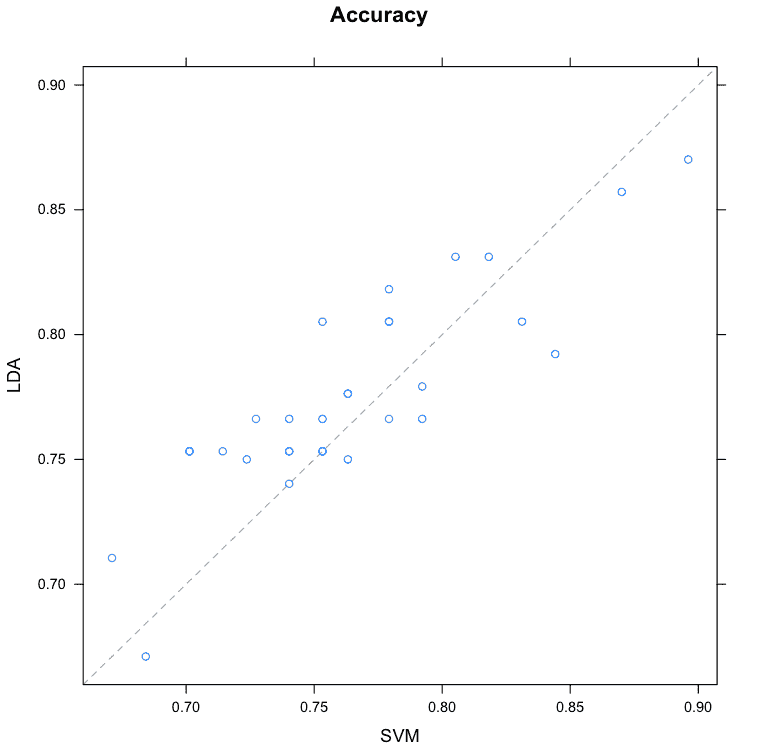

# 在 R 中比较机器学习算法

中的表现

> 原文：<https://machinelearningmastery.com/compare-the-performance-of-machine-learning-algorithms-in-r/>

最后更新于 2019 年 8 月 22 日

如何有效比较不同机器学习算法的估计准确率？

在这篇文章中，你将发现 8 种技术，可以用来比较 r。

你可以使用这些技术来选择最准确的模型，并能够评论它击败其他算法的统计意义和绝对数量。

**用我的新书[用 R](https://machinelearningmastery.com/machine-learning-with-r/) 启动你的项目**，包括*一步一步的教程*和所有例子的 *R 源代码*文件。

我们开始吧。



比较机器学习算法在 R
中的表现。

## 选择最佳机器学习模型

你如何为你的问题选择最好的模型？

当你在一个机器学习项目中工作时，你经常会有多个好的模型可供选择。每个型号将有不同的表现特征。

使用像交叉验证这样的重采样方法，您可以估计每个模型在未看到的数据上的准确性。您需要能够使用估计值从您创建的模型套件中选择一个或两个最佳模型。

## 仔细比较机器学习模型

当您有一个新的数据集时，最好使用多种不同的绘图技术来可视化数据，以便从不同的角度查看数据。

同样的想法也适用于模型选择。您应该使用多种不同的方法来查看机器学习算法的估计准确率，以便选择一个或两个来最终确定。

您可以使用不同的可视化方法来显示模型准确率分布的平均准确率、方差和其他属性。

在下一节中，您将会发现如何在 r

## 比较和选择机器学习模型

在本节中，您将发现如何客观地比较 r

通过本节的案例研究，您将为皮马印第安人糖尿病数据集创建许多机器学习模型。然后，您将使用一套不同的可视化技术来比较模型的估计准确率。

本案例研究分为三个部分:

1.  **准备数据集**。加载库和数据集，准备训练模型。
2.  **列车模型**。在准备评估的数据集上训练标准机器学习模型。
3.  **比较型号**。使用 8 种不同的技术比较训练好的模型。

### 1.准备数据集

本案例研究中使用的数据集是皮马印第安人糖尿病数据集，可在 UCI 机器学习存储库中获得。它也可以在 r。

关于患者是否会在未来 5 年内出现糖尿病，这是一个二分类问题。输入的属性是数字，描述女性患者的医疗细节。

让我们为这个案例研究加载库和数据集。

```py
# load libraries
library(mlbench)
library(caret)
# load the dataset
data(PimaIndiansDiabetes)
```

### 2.火车模型

在本节中，我们将训练 5 个机器学习模型，我们将在下一节中进行比较。

我们将使用 10 次折叠和 3 次重复的重复交叉验证，这是比较模型的常见标准配置。评估指标是准确性和 kappa，因为它们很容易解释。

这些算法是半随机选择的，因为它们的表现形式和学习风格不同。它们包括:

*   分类和回归树
*   线性判别分析
*   径向基函数支持向量机
*   k-最近邻
*   随机森林

在模型被训练之后，它们被添加到列表中，并且在模型列表中调用重采样()。该功能检查模型是否具有可比性，以及它们是否使用了相同的训练方案(训练控制配置)。该对象包含要评估的每个算法的每个折叠和每个重复的评估指标。

我们在下一节中使用的函数都期望有一个包含这些数据的对象。

```py
# prepare training scheme
control <- trainControl(method="repeatedcv", number=10, repeats=3)
# CART
set.seed(7)
fit.cart <- train(diabetes~., data=PimaIndiansDiabetes, method="rpart", trControl=control)
# LDA
set.seed(7)
fit.lda <- train(diabetes~., data=PimaIndiansDiabetes, method="lda", trControl=control)
# SVM
set.seed(7)
fit.svm <- train(diabetes~., data=PimaIndiansDiabetes, method="svmRadial", trControl=control)
# kNN
set.seed(7)
fit.knn <- train(diabetes~., data=PimaIndiansDiabetes, method="knn", trControl=control)
# Random Forest
set.seed(7)
fit.rf <- train(diabetes~., data=PimaIndiansDiabetes, method="rf", trControl=control)
# collect resamples
results <- resamples(list(CART=fit.cart, LDA=fit.lda, SVM=fit.svm, KNN=fit.knn, RF=fit.rf))
```

### 3.比较模型

在本节中，我们将研究 8 种不同的技术来比较构建模型的估计准确率。

### 表摘要

这是您能做的最简单的比较，只需调用 summary 函数()并将重新采样结果传递给它。它将创建一个表，每行一个算法，每列一个评估指标。在这种情况下，我们已经排序。

```py
# summarize differences between modes
summary(results)
```

我发现查看平均值和最大值列很有用。

```py
Accuracy 
       Min. 1st Qu. Median   Mean 3rd Qu.   Max. NA's
CART 0.6234  0.7115 0.7403 0.7382  0.7760 0.8442    0
LDA  0.6711  0.7532 0.7662 0.7759  0.8052 0.8701    0
SVM  0.6711  0.7403 0.7582 0.7651  0.7890 0.8961    0
KNN  0.6184  0.6984 0.7321 0.7299  0.7532 0.8182    0
RF   0.6711  0.7273 0.7516 0.7617  0.7890 0.8571    0

Kappa 
       Min. 1st Qu. Median   Mean 3rd Qu.   Max. NA's
CART 0.1585  0.3296 0.3765 0.3934  0.4685 0.6393    0
LDA  0.2484  0.4196 0.4516 0.4801  0.5512 0.7048    0
SVM  0.2187  0.3889 0.4167 0.4520  0.5003 0.7638    0
KNN  0.1113  0.3228 0.3867 0.3819  0.4382 0.5867    0
RF   0.2624  0.3787 0.4516 0.4588  0.5193 0.6781    0
```

### 方框图和触须图

这是查看不同方法的估计准确率的分布及其相互关系的有用方法。

```py
# box and whisker plots to compare models
scales <- list(x=list(relation="free"), y=list(relation="free"))
bwplot(results, scales=scales)
```

请注意，箱子是从最高到最低平均准确率排序的。我发现查看平均值(点)和方框的重叠(结果的中间 50%)很有用。



R 盒图和须图中机器学习算法的比较

### 密度图

您可以将模型准确率的分布显示为密度图。这是评估计法的估计行为中的重叠的有用方法。

```py
# density plots of accuracy
scales <- list(x=list(relation="free"), y=list(relation="free"))
densityplot(results, scales=scales, pch = "|")
```

我喜欢看峰值的差异以及分布的范围或基数。



R 密度图中机器学习算法的比较

### 点图

这些是有用的图，因为它们既显示了平均估计准确率，也显示了 95%的置信区间(例如，95%的观察得分下降的范围)。

```py
# dot plots of accuracy
scales <- list(x=list(relation="free"), y=list(relation="free"))
dotplot(results, scales=scales)
```

我发现比较算法之间的平均值和重叠值是很有用的。



R 点图中机器学习算法的比较

### 平行图

这是另一种看待数据的方式。它显示了每个交叉验证折叠的每个试验对于每个测试算法的表现。它可以帮助你看到那些对一种算法来说困难的坚持子集如何对其他算法公平。

```py
# parallel plots to compare models
parallelplot(results)
```

这可能是一个需要解释的技巧。我喜欢认为这有助于思考如何在以后的集合预测(例如叠加)中结合不同的方法，尤其是如果你看到相反方向的相关运动。



R 平行图中机器学习算法的比较

### 散点图矩阵

与所有其他算法的相同折叠试验结果相比，这创建了算法的所有折叠试验结果的散点图矩阵。所有配对都进行了比较。

```py
# pair-wise scatterplots of predictions to compare models
splom(results)
```

当考虑来自两种不同算法的预测是否相关时，这是非常宝贵的。如果弱相关，它们是在集合预测中组合的良好候选对象。

例如，用眼睛扫视这些图，它看起来像是 LDA 和 SVM，SVM 和 RF 也是如此。SVM 和卡特看起来每周都有关联。



R 散点图矩阵中机器学习算法的比较

### 成对 xyPlots

您可以使用 xyplot 对两种机器学习算法的试折叠准确率进行成对比较。

```py
# xyplot plots to compare models
xyplot(results, models=c("LDA", "SVM"))
```

在这种情况下，我们可以看到 LDA 和 SVM 模型看似相关的准确性。



R 对散点图中机器学习算法的比较

### 统计显著性检验

您可以计算不同机器学习算法的度量分布之间差异的显著性。我们可以通过调用 summary()函数直接汇总结果。

```py
# difference in model predictions
diffs <- diff(results)
# summarize p-values for pair-wise comparisons
summary(diffs)
```

我们可以看到成对统计显著性得分的表格。表格的下对角线显示了零假设的 p 值(分布相同)，越小越好。我们看不到 CART 和 kNN 之间的差异，我们也看不到 LDA 和 SVM 的分布之间的差异。

表格的上对角线显示了分布之间的估计差异。如果我们从前面的图表中认为 LDA 是最准确的模型，我们可以得到一个估计，在绝对准确性方面比其他特定模型好多少。

这些分数可以帮助您在特定算法之间做出任何准确性声明。

```py
p-value adjustment: bonferroni 
Upper diagonal: estimates of the difference
Lower diagonal: p-value for H0: difference = 0

Accuracy 
     CART      LDA       SVM       KNN       RF       
CART           -0.037759 -0.026908  0.008248 -0.023473
LDA  0.0050068            0.010851  0.046007  0.014286
SVM  0.0919580 0.3390336            0.035156  0.003435
KNN  1.0000000 1.218e-05 0.0007092           -0.031721
RF   0.1722106 0.1349151 1.0000000 0.0034441
```

一个很好的建议是增加试验的次数，以增加群体的规模，也许还能获得更精确的 p 值。你也可以画出差异，但我发现这些图比上面的汇总表用处要小得多。

## 摘要

在这篇文章中，你发现了 8 种不同的技术，可以用来比较机器学习模型在 r

你发现的 8 种技术是:

*   表摘要
*   方框图和触须图
*   密度图
*   点图
*   平行图
*   散点图矩阵
*   成对 xyPlots
*   统计显著性检验

我是不是错过了你最喜欢的一个比较 R 中机器学习算法估计准确率的方法？留言评论，我很想听听！

## 下一步

你试过这些秘籍吗？

1.  开始你的互动环境。
2.  键入或复制粘贴上面的秘籍并试用。
3.  使用 R 中的内置帮助来了解有关所用函数的更多信息。

你有问题吗？在评论里问，我会尽力回答。