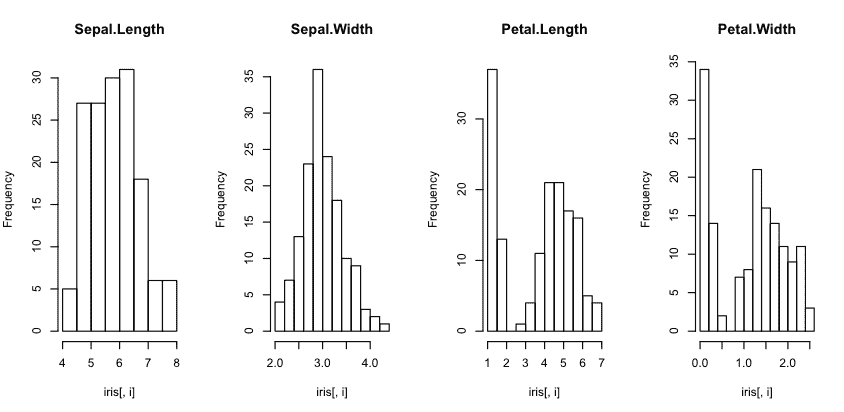
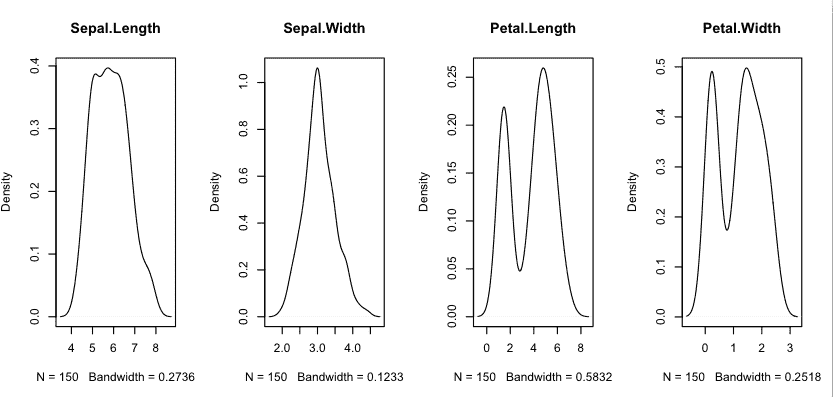
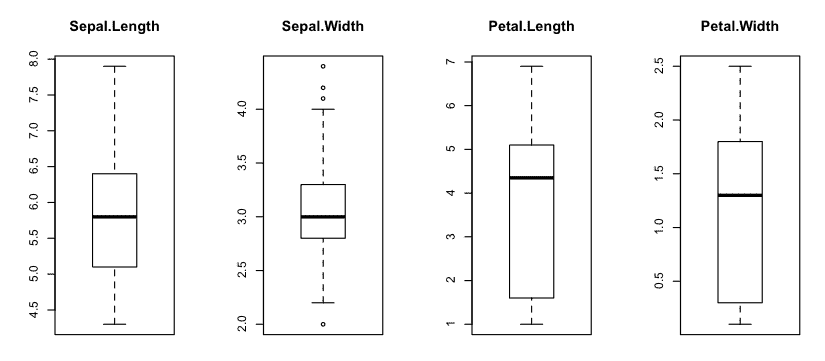
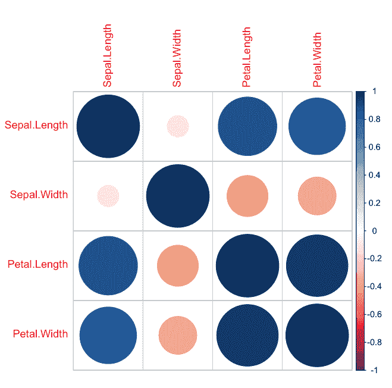
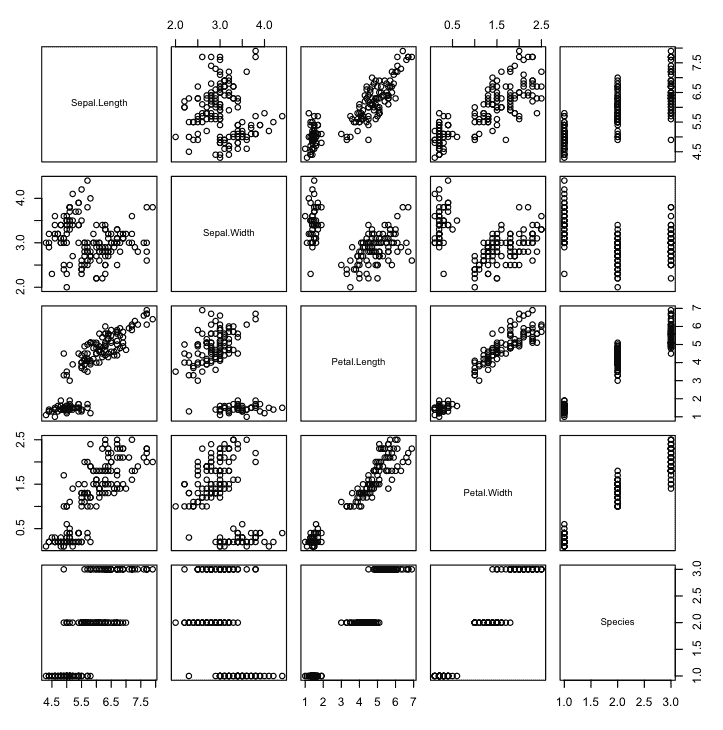
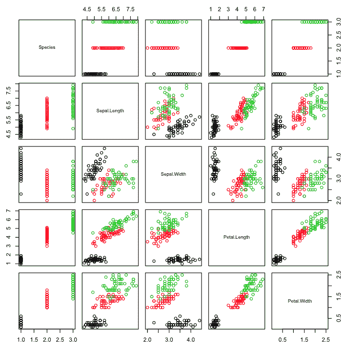
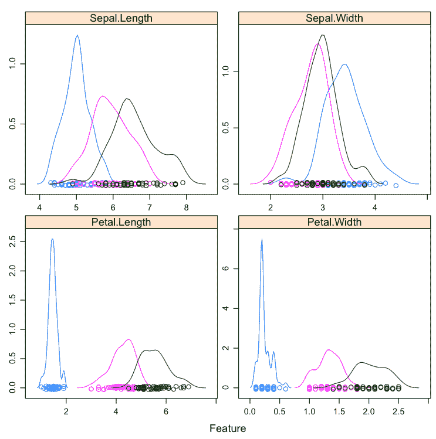
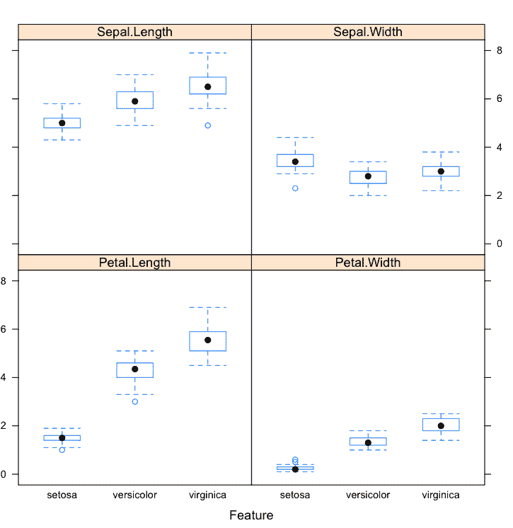

# 使用可视化更好地理解你在 R 中的数据（今天你可以使用的 10 个秘籍）

> 原文：<https://machinelearningmastery.com/data-visualization-in-r/>

最后更新于 2019 年 8 月 22 日

您必须了解您的数据，才能从机器学习算法中获得最佳结果。

数据可视化可能是总结和了解更多数据的最快和最有用的方法。

在这篇文章中，你将发现如何使用数据可视化来更好地理解机器学习的数据。

如果你是一名开发人员，并且刚刚开始使用 R 进行机器学习，或者希望开始使用，这篇文章是完美的。

在你当前或下一个项目中遵循或使用这篇文章中的秘籍。

**用我的新书[用 R](https://machinelearningmastery.com/machine-learning-with-r/) 启动你的项目**，包括*一步一步的教程*和所有例子的 *R 源代码*文件。

我们开始吧。


使用可视化更好地理解 R 中的数据
图片由[科里·m·格雷尼尔](https://www.flickr.com/photos/26087974@N05/9595272759/)提供，保留部分权利。

## 了解您的数据以获得最佳结果

更好地理解您的数据将从机器学习算法中产生更好的结果。

您将能够清理、转换和最好地展示您所拥有的数据。数据越好地将问题的结构暴露给机器学习算法，你的模型就越精确。

此外，对数据更深入的理解甚至可能会建议使用特定的机器学习算法来尝试你的数据。

### 可视化您的数据以便更快地理解

提高对数据集理解的最快方法是将其可视化。

可视化意味着从原始数据创建图表和图表。

属性的分布或扩散图可以帮助您发现异常值、奇怪或无效的数据，并让您了解可以应用的可能数据转换。

属性之间的关系图可以让您了解哪些属性可能是多余的，可能需要哪些重采样方法，以及预测问题最终会有多难。

现在，让我们看看如何使用 r 创建数据图

## 在 R 中可视化您的数据

在本节中，您将发现如何在 r

本节分为三个部分:

1.  **可视化包**:关于可视化的 R 包的选项的快速说明。
2.  **单变量可视化**:可用于单独理解每个属性的图。
3.  **多元可视化**:可以帮助你更好地理解属性之间相互作用的图。

我们开始吧。

### 1.可视化包

有许多方法可以可视化 R 中的数据，但是一些包可能是最有用的。

*   **图形**:非常适合快速和基本的数据绘图。
*   **格子**:比较好看的剧情，在实践中往往比较有用。
*   **ggplot2** :想要呈现结果时想要生成的漂亮的图。

我经常坚持使用图形包中的简单图来实现快速而肮脏的可视化，并使用点阵周围的包装器(通过 Caret 包)来实现更有用的多元图。

我认为 ggplot2 的情节很好，看起来很可爱，但是对于快速和肮脏的数据可视化来说有些矫枉过正。

### 2.单变量可视化

单变量图是没有交互作用的单个属性的图。目标是了解每个属性的分布、中心趋势和传播。

#### 直方图

直方图提供了一个数值属性的柱状图，该数值属性被拆分为多个箱，高度显示了每个箱中的实例数量。

它们对于获得属性分布的指示很有用。

```py
# load the data
data(iris)
# create histograms for each attribute
par(mfrow=c(1,4))
for(i in 1:4) {
	hist(iris[,i], main=names(iris)[i])
}
```

您可以看到大多数属性显示高斯或双高斯分布。您可以在花瓣宽度和长度栏中看到非常小的花朵的尺寸。



R 中的直方图

#### 密度图

我们可以使用密度图将直方图平滑成线条。这些对于更抽象地描述每个变量的分布是有用的。

```py
# load libraries
library(lattice)
# load dataset
data(iris)
# create a panel of simpler density plots by attribute
par(mfrow=c(1,4))
for(i in 1:4) {
	plot(density(iris[,i]), main=names(iris)[i])
}
```

使用与上例相同的数据集和直方图，我们可以看到花瓣测量的双高斯分布。我们还可以看到萼片宽度可能呈指数分布。



R 中的密度图

#### 方框图和触须图

我们可以使用方框图和触须图以不同的方式观察数据的分布。方框捕捉了中间 50%的数据，线条显示了中间值，图中的胡须显示了数据的合理范围。胡须外的任何点都是异常值的良好候选点。

```py
# load dataset
data(iris)
# Create separate boxplots for each attribute
par(mfrow=c(1,4))
for(i in 1:4) {
	boxplot(iris[,i], main=names(iris)[i])
}
```

我们可以看到数据都有一个相似的范围(和相同的厘米单位)。我们还可以看到，对于这个样本，Sepal 宽度可能有一些异常值。



R 中的方框图和触须图

#### Barplots

在具有分类属性而不是数字属性的数据集中，我们可以创建条形图，给出属于每个类别的实例的比例。

```py
# load the library
library(mlbench)
# load the dataset
data(BreastCancer)
# create a bar plot of each categorical attribute
par(mfrow=c(2,4))
for(i in 2:9) {
	counts <- table(BreastCancer[,i])
	name <- names(BreastCancer)[i]
	barplot(counts, main=name)
}
```

我们可以看到，一些地块具有良好的混合分布，而另一些地块则以压倒性的数量展示了一些标签。


R 中的条形图

#### 缺失的情节

缺失的数据对建模有很大影响。有些技术忽略了丢失的数据，有些则打破了。

您可以使用缺失图快速了解数据集中缺失的数据量。x 轴显示属性，y 轴显示实例。水平线表示实例缺少数据，垂直块表示属性缺少数据。

```py
# load libraries
library(Amelia)
library(mlbench)
# load dataset
data(Soybean)
# create a missing map
missmap(Soybean, col=c("black", "grey"), legend=FALSE)
```

我们可以看到，一些实例在一些或大部分属性中缺少大量数据。


R 中缺少地图

### 3.多元可视化

多元图是属性之间的关系或相互作用的图。目标是了解一些关于分布、中心趋势和分布在数据组(通常是属性对)上的信息。

#### 相关图

我们可以计算每对数字属性之间的相关性。这些成对的相关性可以绘制在相关性矩阵图中，以给出哪些属性一起改变的想法。

```py
# load library
library(corrplot)
# load the data
data(iris)
# calculate correlations
correlations <- cor(iris[,1:4])
# create correlation plot
corrplot(correlations, method="circle")
```

使用点表示，其中蓝色表示正相关，红色表示负相关。点越大，相关性越大。我们可以看到矩阵是对称的，对角线是完全正相关的，因为它显示了每个属性与其自身的相关性。我们可以看到一些属性是高度相关的。



相关矩阵图

#### 散点图矩阵

散点图将两个变量绘制在一起，x 轴和 y 轴各有一个，各点表示相互作用。点的分布表示属性之间的关系。您可以为数据集中的所有属性对创建散点图，称为散点图矩阵。

```py
# load the data
data(iris)
# pair-wise scatterplots of all 4 attributes
pairs(iris)
```

请注意，矩阵是对称的，显示了轴反转的相同图。这有助于从多个角度查看您的数据。注意花瓣长度和宽度之间的线性(对角线)关系。



R 中的散点图矩阵

#### 按类别划分的散点图矩阵

在分类问题中，散点图矩阵中的点可以通过类标签来着色。这有助于发现清晰(或不清晰)的类分离，并可能给出问题有多难的想法。

```py
# load the data
data(iris)
# pair-wise scatterplots colored by class
pairs(Species~., data=iris, col=iris$Species)
```

请注意，在大多数成对图中，点是按类别标签明确分开的。



R 中按类别划分的散点图矩阵

#### 按类别划分的密度

我们可以查看按类值细分的每个属性的密度分布。像散点图矩阵一样，按类的密度图可以帮助看到类的分离。这也有助于理解属性类值的重叠。

```py
# load the library
library(caret)
# load the data
data(iris)
# density plots for each attribute by class value
x <- iris[,1:4]
y <- iris[,5]
scales <- list(x=list(relation="free"), y=list(relation="free"))
featurePlot(x=x, y=y, plot="density", scales=scales)
```

我们可以看到，有些类根本不重叠(例如花瓣长度)，而其他属性很难分开(萼片宽度)。



R 中按类别划分的密度图

#### 按类别划分的方框图和触须图

我们还可以按类值查看每个属性的箱线图分布。这也有助于理解每个属性与类值的关系，但是从不同的角度来看密度图。

```py
# load the caret library
library(caret)
# load the iris dataset
data(iris)
# box and whisker plots for each attribute by class value
x <- iris[,1:4]
y <- iris[,5]
featurePlot(x=x, y=y, plot="box")
```

这些图有助于理解属性类组的重叠和分离。我们可以看到花瓣长度属性的 Setosa 类的一些很好的分离。



按类别划分的方框图和触须图

### 其他可视化

您可能会发现有用的另一种可视化类型是数据集的投影。

有时使用主成分分析或自组织映射的预测可以提供对数据的洞察。

你有没有最喜欢的数据可视化方法，这篇文章没有涉及到？留下评论，我很想听听。

## 数据可视化技巧

*   **查看地块**。实际上，花点时间看看你已经生成的情节，并思考它们。尝试将您看到的内容与一般问题领域以及数据中的特定记录联系起来。目标是了解你的数据，而不是生成一个图表。
*   **剧情难看，不好看**。你的目标是了解你的数据，而不是创建漂亮的可视化。不要担心图表是否难看。你不会给任何人看的。
*   **写下想法**。当你查看数据的可视化时，你会得到很多想法。像数据分割这样的想法需要考虑，转换需要应用，技术需要测试。把它们都写下来。当你努力想出更多的事情来获得更好的结果时，它们将是无价的。

## 您可以在 R 中可视化数据

**不需要做 R 程序员**。提供的秘籍是完整的，并提供了获得结果所需的一切。您可以立即运行它们，或者在自己的项目中将其用作模板。慢慢来，研究用来了解更多关于 R 编程的函数。

**不需要数据可视化专家**。数据可视化是一个很大的领域，已经写了很多书。专注于了解你的数据，而不是创建大量花哨的图表。这些图表真的会在你学会之后被扔掉。

**不需要自己准备数据集**。R 中有许多数据集可供您使用。你不需要等到你收集自己的。你也可以从 UCI 机器学习储存库中下载数据集，有数百个来自一系列有趣的研究领域可供选择。

**你不需要很多时间**。可视化要快。从可视化中了解您的数据应该需要几分钟或几小时，而不是几天或几周。如果你花了几个小时以上的时间，你可能是想让剧情变得好看。把他们变丑，专注于学习。

## 摘要

在这篇文章中，你发现了数据可视化的重要性，以便更好地理解你的数据。

您发现了许多方法，可以使用这些方法来可视化和提高您对使用单变量图的独立属性以及使用多变量图的相互作用的理解:

*   单变量图
    *   直方图
    *   密度图
    *   方框图和触须图
    *   Barplots
    *   缺失的情节
*   多元图
    *   相关图
    *   散点图矩阵
    *   按类别划分的散点图矩阵
    *   按类别划分的密度
    *   按类别划分的方框图和触须图

## 行动步骤

你研究过秘籍了吗？

1.  开始你的互动环境。
2.  将每个配方键入或复制粘贴到您的环境中。
3.  花一点时间了解每个秘籍是如何工作的，并使用帮助来了解更多关于使用的功能。

在你当前或下一个机器学习项目中使用这篇文章中的可视化秘籍。如果你知道，我很想听听。

你对这篇文章有什么问题吗？留言问一问。