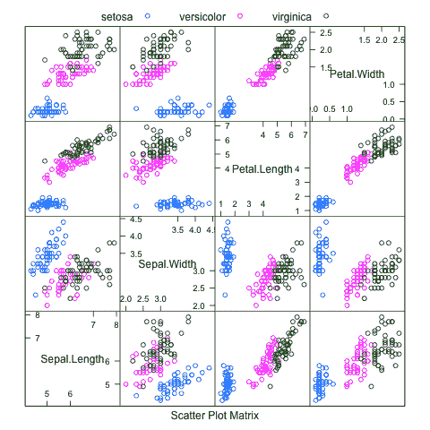
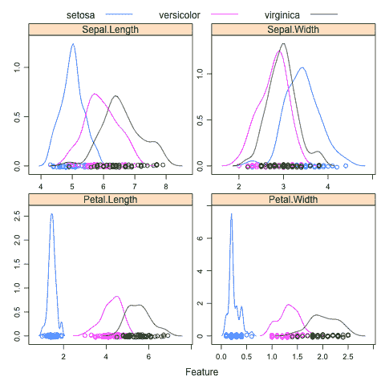
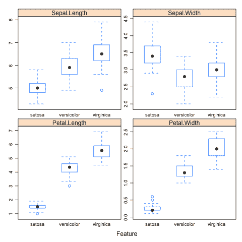

# 将 Caret R 包用于数据可视化

> 原文：<https://machinelearningmastery.com/data-visualization-with-the-caret-r-package/>

最后更新于 2019 年 8 月 22 日

R 中的 caret 包旨在简化应用机器学习的过程。

解决数据问题的一个关键部分是理解你现有的数据。通过用数据可视化总结属性，您可以非常快速地做到这一点。

R 中有很多用于汇总数据的包和函数，可以感觉到势不可挡。出于应用机器学习的目的，caret 包提供了一些关键工具，可以让您快速总结数据。

在这篇文章中，你会发现数据可视化工具可用的 caret R 包。

**用我的新书[用 R](https://machinelearningmastery.com/machine-learning-with-r/) 启动你的项目**，包括*一步一步的教程*和所有例子的 *R 源代码*文件。

我们开始吧。

## Caret 包

caret 包主要用于简化模型训练、估计模型表现和调优。它还有许多方便的数据可视化工具，可以快速让您了解正在处理的数据。

在这篇文章中，我们将看到以下 4 个数据可视化:

*   **散点图矩阵**:用于比较成对图中实值属性的分布。
*   **密度图**:用于比较属性的概率密度函数。
*   **方块和触须图**:用于总结和避免属性扩散

每个示例都是独立的，因此您可以将其复制并粘贴到您自己的项目中，并根据您的需要进行调整。所有的例子都将利用鸢尾花的数据集，这个类别数据集提供了三种鸢尾花的 150 个观察值，以及它们花瓣和萼片的厘米测量值。

## 散点图矩阵

散点图矩阵显示散点图的网格，其中每个属性相对于所有其他属性绘制。它可以按列或行阅读，每个图出现两次，允许您从两个角度考虑空间关系。

仅仅绘制散点图的一个改进是进一步包括类别信息。这通常是通过按类值给每个散点图中的点着色来实现的。

下面的示例显示了虹膜数据集的散点图矩阵，所有四个属性都有成对散点图，散点图中的点由类属性着色。

```py
# load the library
library(caret)
# load the data
data(iris)
# pair-wise plots of all 4 attributes, dots colored by class
featurePlot(x=iris[,1:4], y=iris[,5], plot="pairs", auto.key=list(columns=3))
```

[](https://machinelearningmastery.com/wp-content/uploads/2014/09/scatterplot_matrix.png)

使用 Caret 包的虹膜数据集散点图矩阵

## 密度图

[密度估计](https://en.wikipedia.org/wiki/Density_estimation)图(简称密度图)总结了数据的分布情况。像直方图一样，属性值和观察次数之间的关系被总结，但是这种关系被总结为连续的概率密度函数(PDF)，而不是频率。这是给定观测值具有给定值的概率。

密度图可以通过将每个属性按照观察的类值分开来进一步改进。这有助于理解单属性与类值的关系，并突出有用的结构，如属性值到类的线性可分性。

下面的示例显示了 iris 数据集的密度图，显示了每个属性如何与每个类值相关的 pdf。

```py
# load the library
library(caret)
# load the data
data(iris)
# density plots for each attribute by class value
featurePlot(x=iris[,1:4], y=iris[,5], plot="density", scales=list(x=list(relation="free"), y=list(relation="free")), auto.key=list(columns=3))
```

[](https://machinelearningmastery.com/wp-content/uploads/2014/09/density_plots.png)

使用 Caret 包绘制虹膜数据集的密度图

## 方框图和触须图

[方框图和触须图](https://en.wikipedia.org/wiki/Box_plot)(或简称方框图)通过显示第 25 和 75 百分位的方框、第 50 百分位(中间值)方框中的一条线和平均值的一个点来总结给定属性的分布。络腮胡显示 1.5 *框的高度(称为四分位数范围)，表示数据的预期范围，超出这些络腮胡的任何数据都被认为是异常值，并用点标记。

同样，每个属性都可以根据它们观察到的类值进行总结，让您了解属性值和类值之间的关系，就像密度图一样。

下面的示例显示了 iris 数据集的方框图和触须图，为给定属性的每个类值显示了一个单独的方框。

```py
# load the library
library(caret)
# load the data
data(iris)
# box and whisker plots for each attribute by class value
featurePlot(x=iris[,1:4], y=iris[,5], plot="box", scales=list(x=list(relation="free"), y=list(relation="free")), auto.key=list(columns=3))
```

[](https://machinelearningmastery.com/wp-content/uploads/2014/09/boxplots.png)

使用 Caret 包绘制虹膜数据集的方框图

## 摘要

在这篇文章中，您发现了三种使用 caret R 包的快速数据可视化，可以帮助您理解您的类别数据集。

每个示例都是独立的，可以复制粘贴到您自己的项目中并适应您的问题。