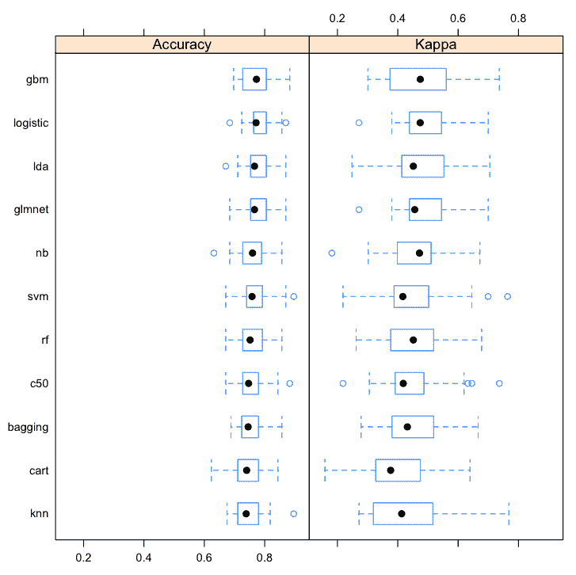
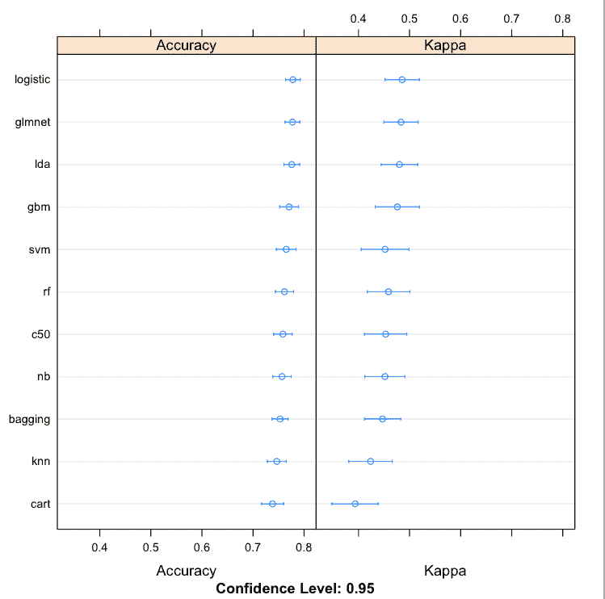

# 如何用 R 评估机器学习算法

> 原文：<https://machinelearningmastery.com/evaluate-machine-learning-algorithms-with-r/>

最后更新于 2019 年 12 月 13 日

您应该在数据集上使用什么算法？

这是应用机器学习中最常见的问题。这是一个只能通过反复试验才能回答的问题，或者我所说的:抽查算法。

在这篇文章中，你将发现如何使用 r 在数据集上抽查算法。包括测试选项、评估指标和算法的选择。

你可以使用这篇文章中的代码作为模板，根据你自己的问题抽查机器学习算法。

**用我的新书[用 R](https://machinelearningmastery.com/machine-learning-with-r/) 启动你的项目**，包括*一步一步的教程*和所有例子的 *R 源代码*文件。

我们开始吧。


布莱恩·汤斯利用 R
评估机器学习算法，保留部分权利。

## 一个问题的最佳算法

您需要数据集的最精确模型。这就是预测建模的目标。

没有人能告诉你在数据集上使用什么算法来得到最好的结果。如果你或任何人知道什么算法对特定数据集给出了最好的结果，那么你可能不需要首先使用机器学习，因为你对这个问题有很深的了解。

我们无法事先知道最佳算法表示或该表示使用的学习算法。我们甚至不知道我们可以尝试的算法的最佳参数。

我们需要一个策略来为我们的数据集找到最佳算法。

### 使用过去的经验选择算法

你可以选择一个问题的算法的一个方法是根据经验来回答。

这可能是你过去处理类似问题的经验。这也可能是该领域的集体经验，你可以参考论文、书籍和其他类似问题的资源，了解哪些算法在过去运行良好。

这是一个好的开始，但这不应该是你停止的地方。

### 使用试错法选择算法

为数据集发现好的甚至最好的算法的最可靠的方法是反复试验。在数据集上评估一组不同的算法，看看哪些可行，哪些不可行。

我称这个过程为抽查算法。

一旦你有了一个你知道擅长挑选问题结构的算法的简短列表，你就可以把精力集中在那些算法上。

您可以通过调整算法参数或使用集成方法组合多个模型的预测来改进候选算法的结果。

接下来，让我们看看如何在 r 中评估数据集上的多种机器算法。

## R 中的抽查算法

在本节中，您将通过一个案例研究来评估 r

本例中使用的测试问题是一个称为 Pima Indians 数据集的二进制类别数据集。这些数据描述了女性患者的医疗细节和布尔输出变量，即她们在接受医疗评估的五年内是否出现糖尿病。

你可以在这里了解更多关于这个数据集的信息:皮马印第安人糖尿病数据集。

您可以在此了解有关此数据集的更多信息:

*   [数据集文件](https://raw.githubusercontent.com/jbrownlee/Datasets/master/pima-indians-diabetes.csv)。
*   [数据集详细信息](https://raw.githubusercontent.com/jbrownlee/Datasets/master/pima-indians-diabetes.names)

本案例研究分为 3 个部分:

1.  定义测试线束。
2.  从数据中构建多个预测模型。
3.  比较模型并选择一个简短的列表。

我们将在 R 中使用 Caret 包，因为它提供了一个进入数百种不同机器学习算法的优秀界面，以及评估和比较模型的有用工具。

有关 Caret 的更多信息，请参阅文章:

*   [用于应用预测建模的 caret 包](https://machinelearningmastery.com/caret-r-package-for-applied-predictive-modeling/)

让我们定义测试工具

### 1.试验用接线

测试线束由三个关键要素组成:

1.  我们将用来训练模型的数据集。
2.  用于评估模型的测试选项(例如重采样方法)。
3.  我们感兴趣的度量和比较。

#### 测试数据集

我们用来抽查算法的数据集应该代表我们的问题，但它不一定是我们所有的数据。

抽查算法必须快速。如果我们有一个大数据集，它可能会导致一些我们想要检查的计算量更大的算法需要很长时间来训练。

当抽查时，我使用的一个好的经验法则是每个算法应该在 1 到 2 分钟内训练。(最好在 30 秒内)。我发现少于 10，000 个实例(行)通常是一个很好的大小，但这将因数据集而异。

如果你有一个大数据集，取一些不同的随机样本和一个简单模型(glm)，看看训练需要多长时间。选择一个合适的样本量。

我们可以稍后研究样本大小对我们的表现良好的算法的简短列表的影响。

此外，您可以稍后用更大的数据集重复这个实验，一旦您有了看起来有希望的更小的算法子集。

让我们加载库和我们的糖尿病数据集。它与 *mlbench* 包一起分发，所以我们可以直接加载它。

```py
# load libraries
library(mlbench)
library(caret)

# load data
data(PimaIndiansDiabetes)
# rename dataset to keep code below generic
dataset <- PimaIndiansDiabetes
```

只有 768 个实例，因此在本案例研究中，我们将使用所有这些数据来抽查我们的算法。

请注意，在一个完整的端到端项目中，我建议保留一个验证数据集，以便对表现最好的模型进行客观的最终评估。

#### 测试选项

测试选项指的是根据看不见的数据评估模型准确性的技术。它们通常被称为统计学中的重采样方法。

我通常推荐的测试选项有:

*   **Train/Test split** :如果你有很多数据，并且确定你需要很多数据来构建精确的模型
*   **交叉验证** : 5 倍或 10 倍提供了计算速度和广义误差估计的常用折衷。
*   **重复交叉验证** : 5 倍或 10 倍的交叉验证和 3 倍或 3 倍以上的重复，以给出更稳健的估计，前提是你的数据集很小，并且有时间。

在本案例研究中，我们将使用 3 次重复的 10 倍交叉验证。

```py
control <- trainControl(method="repeatedcv", number=10, repeats=3)
seed <- 7
```

请注意，我们为变量分配了一个随机数种子，这样我们就可以在训练每个算法之前重新设置随机数生成器。

这对于确保在完全相同的数据分割上评估每个算法非常重要，以便以后进行真正的苹果对苹果的比较。

有关测试选项的更多信息，请参见文章:

*   [评估机器学习算法时如何选择正确的测试选项](https://machinelearningmastery.com/how-to-choose-the-right-test-options-when-evaluating-machine-learning-algorithms/)

有关在 caret 中使用所有三个推荐测试选项的示例，请参见文章:

*   [如何使用 caret 包](https://machinelearningmastery.com/how-to-estimate-model-accuracy-in-r-using-the-caret-package/)估计 R 中的模型准确率

#### 测试度量

有许多可能的评估指标可供选择。Caret 提供了一个很好的选择，如果需要，您可以使用自己的选择。

用于不同问题类型的一些好的测试指标包括:

分类:

*   **准确率** : x 正确除以 y 总实例。通俗易懂，应用广泛。
*   **Kappa** :容易理解为考虑了类的基数分布的准确率。

回归:

*   **RMSE** :均方根误差。再次，易于理解和广泛使用。
*   **Rsquared** :拟合优度或确定系数。

其他流行的衡量标准包括 ROC 和 LogLoss。

评估指标是通过调用给定模型的 *train()* 函数来指定的，因此我们现在将定义指标，供以后所有的模型训练使用。

```py
metric <- "Accuracy"
```

在帖子中了解更多关于测试指标的信息:

*   [分类准确率不够:可以使用更多表现指标](https://machinelearningmastery.com/classification-accuracy-is-not-enough-more-performance-measures-you-can-use/)

### 2.模型结构

选择要抽查的型号时，有三个注意事项:

1.  实际选择什么型号。
2.  如何配置它们的参数。
3.  算法的数据预处理。

#### 算法

算法表示(线、树、实例等)的良好混合很重要。)以及用于学习这些表示的算法。

我使用的一个很好的经验法则是“各几个”，例如在二分类的情况下:

*   **线性方法**:线性判别分析和逻辑回归。
*   **非线性方法**:神经网络、SVM、kNN 和朴素贝叶斯
*   **树和规则** : CART、J48 和 PART
*   **树木集合** : C5.0，袋装车，随机森林，随机梯度提升

你想要一些低复杂度的易于解释的方法(比如 LDA 和 kNN)，如果它们做得好，你可以采用它们。你还需要一些复杂的方法(比如随机森林)来看看这个问题是否可以学习，并开始建立对准确性的期望。

有多少算法？至少有 10 到 20 种不同的算法。

#### 算法配置

几乎所有的机器学习算法都是参数化的，要求您指定它们的参数。

好的一点是，大多数算法参数都有试探法，您可以使用它来提供算法的第一个过去的配置，以使球滚动。

当我们进行抽查时，我们不想尝试算法参数的许多变化，这些变化会在以后改进结果时出现。我们也想给每个算法一个展示自己的机会。

R 中 caret 包的一个方面是它有助于调整算法参数。它还可以估计良好的默认值(通过自动调谐功能和*列车()*功能的*调谐长度*参数)。

我建议在抽查时，如果不是所有算法，也是大多数算法都使用默认值，除非您查找一些合理的默认值，或者对给定的算法有一些经验。

#### 数据预处理

一些算法在一些基本的数据预处理中表现得更好。

你想给每一个算法一个很好的发光的机会，所以重要的是在那些需要的算法的训练中包括任何需要的预处理。

例如，如果所有输入变量具有相同的规模，许多基于实例的算法会工作得更好。

幸运的是，Caret 中的 *train()* 函数允许您指定在训练之前要执行的数据预处理。您需要的转换以列表的形式提供给 preference 参数，并按顺序对数据执行

最有用的转换是通过以下方式扩展和集中数据。例如:

```py
preProcess=c("center", "scale")
```

#### 算法抽查

下面是我们将抽查的糖尿病病例研究模型。

```py
# Linear Discriminant Analysis
set.seed(seed)
fit.lda <- train(diabetes~., data=dataset, method="lda", metric=metric, preProc=c("center", "scale"), trControl=control)
# Logistic Regression
set.seed(seed)
fit.glm <- train(diabetes~., data=dataset, method="glm", metric=metric, trControl=control)
# GLMNET
set.seed(seed)
fit.glmnet <- train(diabetes~., data=dataset, method="glmnet", metric=metric, preProc=c("center", "scale"), trControl=control)
# SVM Radial
set.seed(seed)
fit.svmRadial <- train(diabetes~., data=dataset, method="svmRadial", metric=metric, preProc=c("center", "scale"), trControl=control, fit=FALSE)
# kNN
set.seed(seed)
fit.knn <- train(diabetes~., data=dataset, method="knn", metric=metric, preProc=c("center", "scale"), trControl=control)
# Naive Bayes
set.seed(seed)
fit.nb <- train(diabetes~., data=dataset, method="nb", metric=metric, trControl=control)
# CART
set.seed(seed)
fit.cart <- train(diabetes~., data=dataset, method="rpart", metric=metric, trControl=control)
# C5.0
set.seed(seed)
fit.c50 <- train(diabetes~., data=dataset, method="C5.0", metric=metric, trControl=control)
# Bagged CART
set.seed(seed)
fit.treebag <- train(diabetes~., data=dataset, method="treebag", metric=metric, trControl=control)
# Random Forest
set.seed(seed)
fit.rf <- train(diabetes~., data=dataset, method="rf", metric=metric, trControl=control)
# Stochastic Gradient Boosting (Generalized Boosted Modeling)
set.seed(seed)
fit.gbm <- train(diabetes~., data=dataset, method="gbm", metric=metric, trControl=control, verbose=FALSE)
```

您可以看到算法类型的良好混合。

您可以看到所有算法都使用默认的(自动估计的)算法参数，没有优化网格(Caret 如何优化算法)。

您还可以看到，那些从重新缩放的数据中受益的算法都有 PRofile 参数集。

有关抽查算法的更多信息，请参阅帖子:

*   [为什么你应该在你的机器学习问题上抽查算法](https://machinelearningmastery.com/why-you-should-be-spot-checking-algorithms-on-your-machine-learning-problems/)

### 3.型号选择

现在，我们已经训练了大量不同的模型，我们需要对它们进行评估和比较。

现阶段我们并不寻求最佳模式。算法还没有调整，可能比你现在看到的结果做得更好。

现在的目标是选择几个，也许是 2 到 5 个多样且表现良好的算法来进一步研究。

```py
results <- resamples(list(lda=fit.lda, logistic=fit.glm, glmnet=fit.glmnet,
	svm=fit.svmRadial, knn=fit.knn, nb=fit.nb, cart=fit.cart, c50=fit.c50,
	bagging=fit.treebag, rf=fit.rf, gbm=fit.gbm))
# Table comparison
summary(results)
```

您可以看到，我们已经将算法的结果总结为表格。

```py
Models: lda, logistic, glmnet, svm, knn, nb, cart, c50, bagging, rf, gbm 
Number of resamples: 30 

Accuracy 
           Min. 1st Qu. Median   Mean 3rd Qu.   Max. NA's
lda      0.6711  0.7532 0.7662 0.7759  0.8052 0.8701    0
logistic 0.6842  0.7639 0.7713 0.7781  0.8019 0.8701    0
glmnet   0.6842  0.7557 0.7662 0.7773  0.8019 0.8701    0
svm      0.6711  0.7403 0.7582 0.7651  0.7890 0.8961    0
knn      0.6753  0.7115 0.7386 0.7465  0.7785 0.8961    0
nb       0.6316  0.7305 0.7597 0.7569  0.7869 0.8571    0
cart     0.6234  0.7115 0.7403 0.7382  0.7760 0.8442    0
c50      0.6711  0.7273 0.7468 0.7586  0.7785 0.8831    0
bagging  0.6883  0.7246 0.7451 0.7530  0.7792 0.8571    0
rf       0.6711  0.7273 0.7516 0.7617  0.7890 0.8571    0
gbm      0.6974  0.7273 0.7727 0.7708  0.8052 0.8831    0
```

使用几种不同的可视化技术来查看结果也很有用，这样可以了解精确度的平均值和分布情况。

```py
# boxplot comparison
bwplot(results)
# Dot-plot comparison
dotplot(results)
```

从这些结果来看，线性方法似乎在这个问题上做得很好。我可能会进一步调查*物流*、 *lda* 、 *glmnet* 和 *gbm* 。



在 R 盒和须图中比较机器学习算法



在 r 点图中比较机器学习算法

如果我有更多的数据，我可能会用一个大样本重复这个实验，看看这个大数据集是否提高了任何树方法的表现(这种情况经常发生)。

## 优秀算法抽查技巧

下面是一些小技巧，你可以用它们来评估机器学习算法。

*   **速度**。快速获得结果。使用数据的小样本和算法参数的简单估计。转身应该是几分钟到一个小时。
*   **多样性**。使用不同的算法选择，包括表示法和针对同一类型表示法的不同学习算法。
*   **放大**。不要害怕用更大的数据样本安排后续抽查实验。这些算法可以通宵运行，也可以在更大的计算机上运行，并且可以很好地清除那些只在更大样本(例如树)上运行良好的算法。
*   **短名单**。你的目标是创建一个算法的候选列表来进一步研究，而不是优化准确性(还没有)。
*   **试探法**。最佳实践算法配置和已知适合您这样的问题的算法是一个很好的起点。用它们来播种你的抽查实验。有些算法只是在特定的参数配置下才开始显示出它们的准确性。

## 你可以在 R 中抽查算法

**不需要成为机器学习专家**。您可以从运行上述案例研究并查看结果开始。你可以通过阅读案例研究中使用的 R 函数和机器学习算法来深入研究。

**不需要做 R 程序员**。这篇文章中的案例研究已经完成，并将产生一个结果。您可以复制它，在工作站上运行它，并将其用作当前或下一个项目的模板。

**不需要知道如何配置算法**。R 中的*列车()*功能可以自动估计合理的默认值作为起点。您还不需要指定算法参数。您可能需要稍后在调优期间，R 中特定机器学习功能的帮助通常还会提供您可以使用的示例参数，以及关于算法本身的研究论文。

**不需要自己收集数据**。有许多 R 包提供了小的、标准的、内存中的数据集，您可以使用这些数据集来练习分类和回归机器学习问题。在本例中，我们使用了 *mlbench* 包。

**不需要很多数据**。数据的小样本有利于抽查算法。您希望快速得到结果，而小数据样本是实现这一目标的最佳方式。

## 摘要

在这篇文章中，你发现了抽查机器学习算法对你的问题的重要性。

您发现抽查是为给定数据集找到好的甚至最好的机器学习算法的最佳方式。

您使用 caret 包在 R 中完成了一个案例研究，并对一个二进制分类问题评估了 10 多种不同的算法。

您现在有了一个抽查算法的模板，可以在当前或下一个机器学习项目中使用。

## 下一步

你完成案例研究了吗？

1.  开始你的互动环境。
2.  键入或复制粘贴每个代码段。
3.  花点时间去了解正在发生的事情，并详细阅读所使用的功能。

你有什么问题吗？在评论中提问，我会尽力回答。