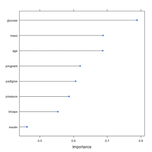
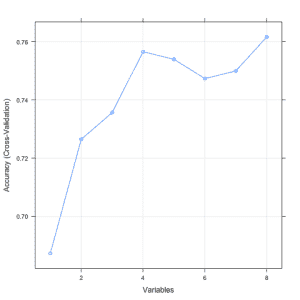

# 使用 caret 包选择特征

> 原文：<https://machinelearningmastery.com/feature-selection-with-the-caret-r-package/>

最后更新于 2019 年 8 月 22 日

在数据中选择正确的特征意味着训练时间长时表现平平和训练时间短时表现出色之间的区别。

caret R 包提供了自动报告数据中属性的相关性和重要性的工具，甚至可以为您选择最重要的特性。

在这篇文章中，你会发现 caret R 包中的[功能选择](https://machinelearningmastery.com/an-introduction-to-feature-selection/)工具在 R 中有独立的配方。

看完这篇文章你会知道:

*   如何从数据集中移除冗余要素？
*   如何根据要素的重要性对数据集中的要素进行排序。
*   如何使用递归要素消除方法从数据集中选择要素。

**用我的新书[用 R](https://machinelearningmastery.com/machine-learning-with-r/) 启动你的项目**，包括*一步一步的教程*和所有例子的 *R 源代码*文件。

我们开始吧。


机器学习的置信区间
保罗·巴尔夫摄，版权所有。

## 删除冗余特征

数据可以包含彼此高度相关的属性。如果删除高度相关的属性，许多方法的表现会更好。

Caret R 包提供了 findCorrelation，它将分析数据属性的[相关性](https://machinelearningmastery.com/how-to-use-correlation-to-understand-the-relationship-between-variables/)矩阵，报告可以删除的属性。

以下示例加载了皮马印第安人糖尿病数据集，该数据集包含医疗报告中的许多生物属性。从这些属性创建相关矩阵，并识别高度相关的属性，在这种情况下，年龄属性被移除，因为它与怀孕属性高度相关。

通常，您希望删除绝对相关性为 0.75 或更高的属性。

```py
# ensure the results are repeatable
set.seed(7)
# load the library
library(mlbench)
library(caret)
# load the data
data(PimaIndiansDiabetes)
# calculate correlation matrix
correlationMatrix <- cor(PimaIndiansDiabetes[,1:8])
# summarize the correlation matrix
print(correlationMatrix)
# find attributes that are highly corrected (ideally >0.75)
highlyCorrelated <- findCorrelation(correlationMatrix, cutoff=0.5)
# print indexes of highly correlated attributes
print(highlyCorrelated)
```

## 按重要性排列特征

特征的重要性可以通过建立模型从数据中估计出来。像决策树这样的方法有一个内置的机制来报告可变的重要性。对于其他算法，可以使用针对每个属性进行的 ROC 曲线分析来估计重要性。

以下示例加载了皮马印第安人糖尿病数据集，并构建了一个[学习矢量量化](https://machinelearningmastery.com/learning-vector-quantization-for-machine-learning/) (LVQ)模型。变量随后被用来估计变量的重要性，并被打印和绘制出来。它显示葡萄糖、质量和年龄属性是数据集中最重要的前 3 个属性，胰岛素属性是最不重要的。

```py
# ensure results are repeatable
set.seed(7)
# load the library
library(mlbench)
library(caret)
# load the dataset
data(PimaIndiansDiabetes)
# prepare training scheme
control <- trainControl(method="repeatedcv", number=10, repeats=3)
# train the model
model <- train(diabetes~., data=PimaIndiansDiabetes, method="lvq", preProcess="scale", trControl=control)
# estimate variable importance
importance <- varImp(model, scale=FALSE)
# summarize importance
print(importance)
# plot importance
plot(importance)
```

[](https://machinelearningmastery.com/wp-content/uploads/2014/09/variable_importance.png)

使用 Caret R 包按重要性排列特征

## 特征选择

自动特征选择方法可用于构建具有不同数据集子集的许多模型，并识别构建精确模型所需的和不需要的属性。

caret R 包提供的一种流行的自动特征选择方法叫做[递归特征消除](https://en.wikipedia.org/wiki/Feature_selection)或 RFE。

以下示例提供了皮马印第安人糖尿病数据集的 RFE 方法示例。每次迭代都使用随机森林算法来评估模型。该算法被配置为探索所有可能的属性子集。本例中选择了所有 8 个属性，尽管在显示不同属性子集大小的准确性的图中，我们可以看到只有 4 个属性给出了几乎相当的结果。

```py
# ensure the results are repeatable
set.seed(7)
# load the library
library(mlbench)
library(caret)
# load the data
data(PimaIndiansDiabetes)
# define the control using a random forest selection function
control <- rfeControl(functions=rfFuncs, method="cv", number=10)
# run the RFE algorithm
results <- rfe(PimaIndiansDiabetes[,1:8], PimaIndiansDiabetes[,9], sizes=c(1:8), rfeControl=control)
# summarize the results
print(results)
# list the chosen features
predictors(results)
# plot the results
plot(results, type=c("g", "o"))
```

[](https://machinelearningmastery.com/wp-content/uploads/2014/09/feature-selection.png)

使用 Caret 包选择功能

## 摘要

在这篇文章中，您发现了 caret R 包提供的 3 种特性选择方法。具体而言，搜索和移除冗余特征、按重要性对特征进行排序以及自动选择最具预测性的特征的子集。

R 中提供了三个独立的方法，您可以将其复制并粘贴到自己的项目中，并根据您的具体问题进行调整。