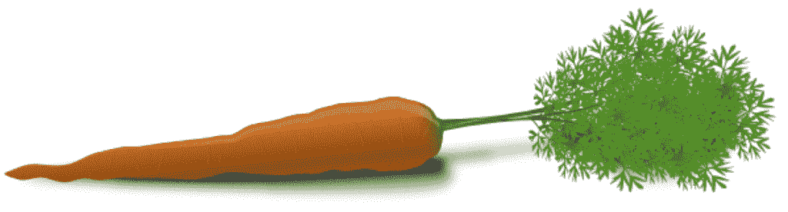

# 如何使用 Caret 包估计 R 中的模型准确率

> 原文：<https://machinelearningmastery.com/how-to-estimate-model-accuracy-in-r-using-the-caret-package/>

最后更新于 2020 年 8 月 15 日

当您构建预测模型时，您需要一种方法来评估模型在看不见的数据上的能力。

这通常是通过使用未用于训练模型的数据(如测试集)或使用交叉验证来估计准确性。R 中的[Caret 包提供了许多方法来估计机器学习算法的准确性。](http://caret.r-forge.r-project.org/)

在这篇文章中，你发现了 5 种基于未知数据评估模型表现的方法。您还可以使用每种方法的 Caret 包来访问 R 中的配方，您可以立即将其复制并粘贴到自己的项目中。

**用我的新书[用 R](https://machinelearningmastery.com/machine-learning-with-r/) 启动你的项目**，包括*一步一步的教程*和所有例子的 *R 源代码*文件。

我们开始吧。

[](https://machinelearningmastery.com/wp-content/uploads/2014/09/Caret-package-in-R.png)

从 caret 主页将 caret 包放入 R，

## 估计模型准确率

我们以前在测试线束的测试选项配置中考虑过模型准确率。你可以在帖子里读到更多:[评估机器学习算法时如何选择正确的测试选项](https://machinelearningmastery.com/how-to-choose-the-right-test-options-when-evaluating-machine-learning-algorithms/ "How To Choose The Right Test Options When Evaluating Machine Learning Algorithms")。

在这篇文章中，你可以发现 5 种不同的方法，你可以用来估计模型的准确性。

它们如下，并将依次描述:

*   数据分割
*   引导程序
*   k 倍交叉验证
*   重复 k 倍交叉验证
*   省去交叉验证

一般来说，我会推荐重复的 k 倍交叉验证，但每种方法都有其特点和优势，尤其是当考虑到数据量或空间和时间复杂性时。考虑哪种方法最适合你的问题。

## 数据分割

数据分割包括将数据划分为用于准备模型的显式训练数据集和用于评估模型在不可见数据上的表现的不可见测试数据集。

当您有一个非常大的数据集，以便测试数据集可以提供有意义的表现估计时，或者当您使用缓慢的方法并且需要表现的快速近似时，它非常有用。

以下示例分割虹膜数据集，以便 80%用于训练朴素贝叶斯模型，20%用于评估模型表现。

```py
# load the libraries
library(caret)
library(klaR)
# load the iris dataset
data(iris)
# define an 80%/20% train/test split of the dataset
split=0.80
trainIndex <- createDataPartition(iris$Species, p=split, list=FALSE)
data_train <- iris[ trainIndex,]
data_test <- iris[-trainIndex,]
# train a naive bayes model
model <- NaiveBayes(Species~., data=data_train)
# make predictions
x_test <- data_test[,1:4]
y_test <- data_test[,5]
predictions <- predict(model, x_test)
# summarize results
confusionMatrix(predictions$class, y_test)
```

## 引导程序

[Bootstrap 重采样](https://en.wikipedia.org/wiki/Bootstrapping_(statistics))包括从数据集中随机抽取样本(重新选择)以评估模型。总的来说，结果提供了模型表现变化的指示。通常，会执行大量的重采样迭代(数千次或趋于数千次)。

以下示例使用带有 10 个重采样的引导程序来准备朴素贝叶斯模型。

```py
# load the library
library(caret)
# load the iris dataset
data(iris)
# define training control
train_control <- trainControl(method="boot", number=100)
# train the model
model <- train(Species~., data=iris, trControl=train_control, method="nb")
# summarize results
print(model)
```

## k 倍交叉验证

[K 折交叉验证](https://en.wikipedia.org/wiki/Cross-validation_(statistics))方法包括将数据集分割成 k 个子集。对于每个子集，在模型在所有其他子集上训练的同时，保持不变。此过程一直持续到确定数据集中每个实例的准确率，并提供总体准确率估计值。

这是一种稳健的方法，用于估计准确率和 k 的大小，并调整估计中的偏差量，常用值设置为 3、5、7 和 10。

以下示例使用 10 倍交叉验证来估计虹膜数据集上的朴素贝叶斯。

```py
# load the library
library(caret)
# load the iris dataset
data(iris)
# define training control
train_control <- trainControl(method="cv", number=10)
# fix the parameters of the algorithm
grid <- expand.grid(.fL=c(0), .usekernel=c(FALSE))
# train the model
model <- train(Species~., data=iris, trControl=train_control, method="nb", tuneGrid=grid)
# summarize results
print(model)
```

## 重复 k 倍交叉验证

将数据拆分为 k 折叠的过程可以重复多次，这称为重复 k 折叠交叉验证。最终的模型准确率作为重复次数的平均值。

以下示例使用具有 3 次重复的 10 倍交叉验证来估计虹膜数据集上的朴素贝叶斯。

```py
# load the library
library(caret)
# load the iris dataset
data(iris)
# define training control
train_control <- trainControl(method="repeatedcv", number=10, repeats=3)
# train the model
model <- train(Species~., data=iris, trControl=train_control, method="nb")
# summarize results
print(model)
```

## 省去交叉验证

在[遗漏交叉验证](https://en.wikipedia.org/wiki/Cross-validation_(statistics)) (LOOCV)中，遗漏了一个数据实例，并在训练集中的所有其他数据实例上构建了一个模型。对所有数据实例重复这一过程。

以下示例演示了 LOOCV 如何在虹膜数据集上估计朴素贝叶斯。

```py
# load the library
library(caret)
# load the iris dataset
data(iris)
# define training control
train_control <- trainControl(method="LOOCV")
# train the model
model <- train(Species~., data=iris, trControl=train_control, method="nb")
# summarize results
print(model)
```

## 摘要

在这篇文章中，你发现了 5 种不同的方法，可以用来评估你的模型在看不见的数据上的准确性。

这些方法是:数据分割、自举、k 倍交叉验证、重复 k 倍交叉验证和遗漏交叉验证。

您可以在[caret 包主页](http://caret.r-forge.r-project.org/)和[caret 包 CRAN 页面](https://cran.r-project.org/web/packages/caret/index.html)了解更多关于 R caret 包的信息。如果你想掌握 caret 包，我会推荐包的作者写的书，书名是:[应用预测建模](https://amzn.to/3iFPHhq)，特别是关于过拟合模型的第 4 章。