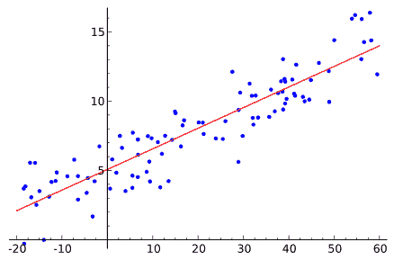

# R 中的线性回归

> 原文：<https://machinelearningmastery.com/linear-regression-in-r/>

最后更新于 2020 年 8 月 15 日

在这篇文章中，你将发现 R 平台线性回归的 4 个方法。

你可以复制粘贴这篇文章中的秘籍，在自己的问题上做一个跳跃性的开始，或者用 r 中的线性回归来学习和练习。

**用我的新书[用 R](https://machinelearningmastery.com/machine-learning-with-r/) 启动你的项目**，包括*一步一步的教程*和所有例子的 *R 源代码*文件。

我们开始吧。

[](https://machinelearningmastery.com/wp-content/uploads/2014/07/ordinary-least-squares-regression.png)

普通最小二乘回归
[版权所有](https://en.wikipedia.org/wiki/File:Linear_regression.svg)

本文中的每个示例都使用了 r 附带的[数据集包](http://stat.ethz.ch/R-manual/R-devel/library/datasets/html/00Index.html)中提供的 [longley](http://stat.ethz.ch/R-manual/R-devel/library/datasets/html/longley.html) 数据集。longley 数据集描述了从 1947 年到 1962 年观察到的 7 个经济变量，用于预测每年的就业人数。

## 普通最小二乘回归

普通最小二乘(OLS)回归是一种线性模型，它寻求为直线/超平面找到一组系数，使平方误差之和最小。

```py
# load data
data(longley)
# fit model
fit <- lm(Employed~., longley)
# summarize the fit
summary(fit)
# make predictions
predictions <- predict(fit, longley)
# summarize accuracy
mse <- mean((longley$Employed - predictions)^2)
print(mse)
```

了解更多关于 **lm** 功能和[统计包](http://stat.ethz.ch/R-manual/R-devel/library/stats/html/00Index.html)的信息。

## 逐步线性回归

逐步线性回归是一种利用线性回归来发现数据集中哪个属性子集导致最佳表现模型的方法。这是逐步的，因为方法的每次迭代都会对属性集进行更改，并创建一个模型来评估属性集的表现。

```py
# load data
data(longley)
# fit model
base <- lm(Employed~., longley)
# summarize the fit
summary(base)
# perform step-wise feature selection
fit <- step(base)
# summarize the selected model
summary(fit)
# make predictions
predictions <- predict(fit, longley)
# summarize accuracy
mse <- mean((longley$Employed - predictions)^2)
print(mse)
```

了解更多关于**步骤**功能和[统计包](http://stat.ethz.ch/R-manual/R-devel/library/stats/html/00Index.html)的信息。

## 主成分回归

主成分回归(PCR)使用主成分分析(PCA)的输出来估计模型的系数，从而创建线性回归模型。当数据具有高度相关的预测因子时，聚合酶链反应是有用的。

```py
# load the package
library(pls)
# load data
data(longley)
# fit model
fit <- pcr(Employed~., data=longley, validation="CV")
# summarize the fit
summary(fit)
# make predictions
predictions <- predict(fit, longley, ncomp=6)
# summarize accuracy
mse <- mean((longley$Employed - predictions)^2)
print(mse)
```

了解更多关于 **pcr** 功能和 [pls 包](https://cran.r-project.org/web/packages/pls/index.html)的信息。

## 偏最小二乘回归

偏最小二乘回归在问题空间的变换投影中创建了数据的线性模型。像聚合酶链反应一样，偏最小二乘法适用于预测因子高度相关的数据。

```py
# load the package
library(pls)
# load data
data(longley)
# fit model
fit <- plsr(Employed~., data=longley, validation="CV")
# summarize the fit
summary(fit)
# make predictions
predictions <- predict(fit, longley, ncomp=6)
# summarize accuracy
mse <- mean((longley$Employed - predictions)^2)
print(mse)
```

了解更多关于 **plsr** 功能和 [pls 包](https://cran.r-project.org/web/packages/pls/index.html)的信息。

## 摘要

在这篇文章中，你发现了在 R 中创建线性回归模型并使用这些模型进行预测的 4 个方法。

库恩和约翰逊的[应用预测建模](https://amzn.to/3iFPHhq)的第 6 章为初学者提供了一个关于 R 线性回归的极好的介绍。[实用回归和方差分析使用 R](https://cran.r-project.org/doc/contrib/Faraway-PRA.pdf) (PDF)由遥远提供了一个更深入的治疗。