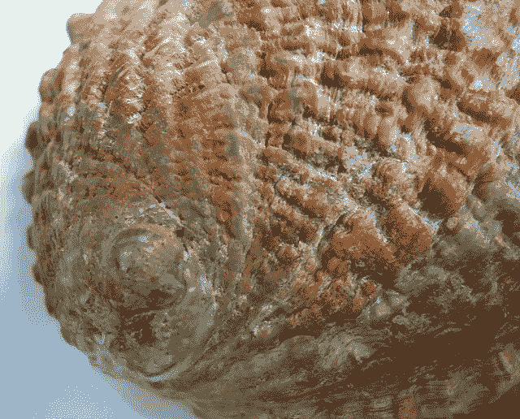

# R 中的机器学习数据集（你现在可以使用的 10 个数据集）

> 原文：<https://machinelearningmastery.com/machine-learning-datasets-in-r/>

最后更新于 2020 年 8 月 15 日

你需要标准数据集来练习机器学习。

在这篇短文中，你将发现如何在 r 中加载标准分类和回归数据集。

这篇文章将向你展示 3 个可以用来加载标准数据集的 R 库，以及 10 个可以在 R 中用于机器学习的特定数据集。

在 R 中加载标准数据集是非常宝贵的，这样您就可以使用机器学习技术进行测试、实践和实验，并通过该平台提高您的技能。

**用我的新书[用 R](https://machinelearningmastery.com/machine-learning-with-r/) 启动你的项目**，包括*一步一步的教程*和所有例子的 *R 源代码*文件。

我们开始吧。

## 在理解良好的小数据集上练习

有数百个标准测试数据集，你可以用来练习和更好地进行机器学习。

其中大部分是免费托管在 UCI 机器学习资源库。这些数据集很有用，因为它们被很好地理解，表现良好，而且很小。

最后一点在练习机器学习时至关重要，因为:

*   你可以快速下载。
*   你可以很容易地记忆它们。
*   你可以在上面快速运行算法。

在帖子中了解更多关于使用 UCI 机器学习存储库中的数据集练习机器学习的信息:

*   [使用 UCI 机器学习存储库中的小内存数据集练习机器学习](https://machinelearningmastery.com/practice-machine-learning-with-small-in-memory-datasets-from-the-uci-machine-learning-repository/)

### 访问标准数据集

您可以将标准数据集作为 CSV 文件加载到 R 中。

有一种更方便的方法来加载标准数据集。它们已经打包，可以从第三方 R 库获得，您可以从[综合 R 档案网络](https://cran.r-project.org/) (CRAN)下载。

您应该使用哪些库，哪些数据集是好的开始。

## 如何加载标准数据集

在本节中，您将发现可以用来访问标准机器学习数据集的库。

您还将发现特定的分类和回归，您可以加载并使用它们在 r 中练习机器学习。

### 库:数据集


鸢尾花数据集
图片作者[里克·利瑟姆](https://www.flickr.com/photos/ligthelm/8675226902)，版权所有。

数据集库带有基本的 R，这意味着您不需要显式加载该库。它包括大量您可以使用的数据集。

您可以通过键入以下命令从此库中加载数据集:

```py
data(DataSetName)
```

例如，要加载非常常用的虹膜数据集:

```py
data(iris)
```

要查看此库中可用数据集的列表，您可以键入:

```py
# list all datasets in the package
library(help = "datasets")
```

下面是这个包中您可以使用的一些重点数据集。

#### 鸢尾花数据集

*   描述:从花的测量来预测鸢尾花的种类。
*   类型:多类分类
*   尺寸:150 个实例，5 个属性
*   输入:数字
*   输出:分类，3 类标签
*   UCI 机器学习知识库:[描述](https://archive.ics.uci.edu/ml/datasets/Iris)
*   公布的准确度结果:[汇总](http://www.is.umk.pl/projects/rules.html#Iris)

```py
# iris flowers datasets
data(iris)
dim(iris)
levels(iris$Species)
head(iris)
```

您将看到:

```py
  Sepal.Length Sepal.Width Petal.Length Petal.Width Species
1          5.1         3.5          1.4         0.2  setosa
2          4.9         3.0          1.4         0.2  setosa
3          4.7         3.2          1.3         0.2  setosa
4          4.6         3.1          1.5         0.2  setosa
5          5.0         3.6          1.4         0.2  setosa
6          5.4         3.9          1.7         0.4  setosa
```

#### 朗利经济回归数据

*   描述:根据经济变量预测就业人数
*   类型:回归
*   尺寸:16 个实例，7 个属性
*   输入:数字
*   输出:数字

```py
# Longley's Economic Regression Data
data(longley)
dim(longley)
head(longley)
```

您将看到:

```py
     GNP.deflator     GNP Unemployed Armed.Forces Population Year Employed
1947         83.0 234.289      235.6        159.0    107.608 1947   60.323
1948         88.5 259.426      232.5        145.6    108.632 1948   61.122
1949         88.2 258.054      368.2        161.6    109.773 1949   60.171
1950         89.5 284.599      335.1        165.0    110.929 1950   61.187
1951         96.2 328.975      209.9        309.9    112.075 1951   63.221
1952         98.1 346.999      193.2        359.4    113.270 1952   63.639
```

### 图书馆:mlbench


大豆数据集
图片由[联合大豆委员会](https://www.flickr.com/photos/unitedsoybean/10059910446/)提供，保留部分权利。

直接从图书馆手册中获得:

> 人工和真实世界机器学习基准问题的集合，包括，例如，来自 UCI 知识库的几个数据集。

您可以在 [mlbench CRAN 页面](https://cran.r-project.org/web/packages/mlbench/index.html)上了解更多关于 *mlbench* 库的信息。

如果未安装，您可以按如下方式安装此库:

```py
install.packages("mlbench")
```

您可以按如下方式加载库:

```py
# load the library
library(mlbench)
```

要查看此库中可用数据集的列表，您可以键入:

```py
# list the contents of the library
library(help = "mlbench")
```

您可以使用该库中的一些亮点数据集:

#### 波士顿住房数据

*   描述:从房屋细节预测波士顿的房价
*   类型:回归
*   尺寸:506 个实例，14 个属性
*   输入:数字
*   输出:数字
*   UCI 机器学习知识库:[描述](https://archive.ics.uci.edu/ml/datasets/Housing)

```py
# Boston Housing Data
data(BostonHousing)
dim(BostonHousing)
head(BostonHousing)
```

您将看到:

```py
     crim zn indus chas   nox    rm  age    dis rad tax ptratio      b lstat medv
1 0.00632 18  2.31    0 0.538 6.575 65.2 4.0900   1 296    15.3 396.90  4.98 24.0
2 0.02731  0  7.07    0 0.469 6.421 78.9 4.9671   2 242    17.8 396.90  9.14 21.6
3 0.02729  0  7.07    0 0.469 7.185 61.1 4.9671   2 242    17.8 392.83  4.03 34.7
4 0.03237  0  2.18    0 0.458 6.998 45.8 6.0622   3 222    18.7 394.63  2.94 33.4
5 0.06905  0  2.18    0 0.458 7.147 54.2 6.0622   3 222    18.7 396.90  5.33 36.2
6 0.02985  0  2.18    0 0.458 6.430 58.7 6.0622   3 222    18.7 394.12  5.21 28.7
```

#### 威斯康星乳腺癌数据库

*   描述:根据活检细节预测癌症是恶性还是良性。
*   类型:二分类
    维度:699 个实例，11 个属性
*   输入:整数(标称)
*   输出:分类，2 类标签
*   UCI 机器学习知识库:[描述](https://archive.ics.uci.edu/ml/datasets/Breast+Cancer+Wisconsin+(Original))
*   公布的准确度结果:[汇总](http://www.is.umk.pl/projects/datasets.html#Wisconsin)

```py
# Wisconsin Breast Cancer Database
data(BreastCancer)
dim(BreastCancer)
levels(BreastCancer$Class)
head(BreastCancer)
```

您将看到:

```py
       Id Cl.thickness Cell.size Cell.shape Marg.adhesion Epith.c.size Bare.nuclei Bl.cromatin Normal.nucleoli Mitoses     Class
1 1000025            5         1          1             1            2           1           3               1       1    benign
2 1002945            5         4          4             5            7          10           3               2       1    benign
3 1015425            3         1          1             1            2           2           3               1       1    benign
4 1016277            6         8          8             1            3           4           3               7       1    benign
5 1017023            4         1          1             3            2           1           3               1       1    benign
6 1017122            8        10         10             8            7          10           9               7       1 malignant
```

#### 玻璃鉴定数据库

*   描述:从化学性质预测玻璃类型。
*   类型:分类
*   尺寸:214 个实例，10 个属性
*   输入:数字
*   输出:分类，7 类标签
*   UCI 机器学习知识库:[描述](https://archive.ics.uci.edu/ml/datasets/Glass+Identification)
*   公布的准确度结果:[汇总](http://www.is.umk.pl/projects/datasets.html#Other)

```py
# Glass Identification Database
data(Glass)
dim(Glass)
levels(Glass$Type)
head(Glass)
```

您将看到:

```py
       RI    Na   Mg   Al    Si    K   Ca Ba   Fe Type
1 1.52101 13.64 4.49 1.10 71.78 0.06 8.75  0 0.00    1
2 1.51761 13.89 3.60 1.36 72.73 0.48 7.83  0 0.00    1
3 1.51618 13.53 3.55 1.54 72.99 0.39 7.78  0 0.00    1
4 1.51766 13.21 3.69 1.29 72.61 0.57 8.22  0 0.00    1
5 1.51742 13.27 3.62 1.24 73.08 0.55 8.07  0 0.00    1
6 1.51596 12.79 3.61 1.62 72.97 0.64 8.07  0 0.26    1
```

#### 约翰·霍普金斯大学电离层数据库

*   描述:根据天线数据预测大气中的高能结构。
*   类型:分类
*   尺寸:351 个实例，35 个属性
*   输入:数字
*   输出:分类，2 类标签
*   UCI 机器学习知识库:[描述](https://archive.ics.uci.edu/ml/datasets/Ionosphere)
*   公布的准确度结果:[汇总](http://www.is.umk.pl/projects/datasets.html#Ionosphere)

```py
# Johns Hopkins University Ionosphere database
data(Ionosphere)
dim(Ionosphere)
levels(Ionosphere$Class)
head(Ionosphere)
```

您将看到:

```py
  V1 V2      V3       V4       V5       V6       V7       V8      V9      V10     V11      V12     V13      V14      V15      V16      V17      V18      V19
1  1  0 0.99539 -0.05889  0.85243  0.02306  0.83398 -0.37708 1.00000  0.03760 0.85243 -0.17755 0.59755 -0.44945  0.60536 -0.38223  0.84356 -0.38542  0.58212
2  1  0 1.00000 -0.18829  0.93035 -0.36156 -0.10868 -0.93597 1.00000 -0.04549 0.50874 -0.67743 0.34432 -0.69707 -0.51685 -0.97515  0.05499 -0.62237  0.33109
3  1  0 1.00000 -0.03365  1.00000  0.00485  1.00000 -0.12062 0.88965  0.01198 0.73082  0.05346 0.85443  0.00827  0.54591  0.00299  0.83775 -0.13644  0.75535
4  1  0 1.00000 -0.45161  1.00000  1.00000  0.71216 -1.00000 0.00000  0.00000 0.00000  0.00000 0.00000  0.00000 -1.00000  0.14516  0.54094 -0.39330 -1.00000
5  1  0 1.00000 -0.02401  0.94140  0.06531  0.92106 -0.23255 0.77152 -0.16399 0.52798 -0.20275 0.56409 -0.00712  0.34395 -0.27457  0.52940 -0.21780  0.45107
6  1  0 0.02337 -0.00592 -0.09924 -0.11949 -0.00763 -0.11824 0.14706  0.06637 0.03786 -0.06302 0.00000  0.00000 -0.04572 -0.15540 -0.00343 -0.10196 -0.11575
       V20      V21      V22      V23      V24      V25      V26      V27      V28      V29      V30      V31      V32      V33      V34 Class
1 -0.32192  0.56971 -0.29674  0.36946 -0.47357  0.56811 -0.51171  0.41078 -0.46168  0.21266 -0.34090  0.42267 -0.54487  0.18641 -0.45300  good
2 -1.00000 -0.13151 -0.45300 -0.18056 -0.35734 -0.20332 -0.26569 -0.20468 -0.18401 -0.19040 -0.11593 -0.16626 -0.06288 -0.13738 -0.02447   bad
3 -0.08540  0.70887 -0.27502  0.43385 -0.12062  0.57528 -0.40220  0.58984 -0.22145  0.43100 -0.17365  0.60436 -0.24180  0.56045 -0.38238  good
4 -0.54467 -0.69975  1.00000  0.00000  0.00000  1.00000  0.90695  0.51613  1.00000  1.00000 -0.20099  0.25682  1.00000 -0.32382  1.00000   bad
5 -0.17813  0.05982 -0.35575  0.02309 -0.52879  0.03286 -0.65158  0.13290 -0.53206  0.02431 -0.62197 -0.05707 -0.59573 -0.04608 -0.65697  good
6 -0.05414  0.01838  0.03669  0.01519  0.00888  0.03513 -0.01535 -0.03240  0.09223 -0.07859  0.00732  0.00000  0.00000 -0.00039  0.12011   bad
```

#### 皮马印第安人糖尿病数据库

*   描述:根据病历数据预测女性皮马印第安人糖尿病的发病。
*   类型:二分类
*   尺寸:768 个实例，9 个属性
*   输入:数字
*   输出:分类，2 类标签
*   数据集详情:[描述](https://raw.githubusercontent.com/jbrownlee/Datasets/master/pima-indians-diabetes.names)
*   公布的准确度结果:[汇总](http://www.is.umk.pl/projects/datasets.html#Diabetes)

```py
# Pima Indians Diabetes Database
data(PimaIndiansDiabetes)
dim(PimaIndiansDiabetes)
levels(PimaIndiansDiabetes$diabetes)
head(PimaIndiansDiabetes)
```

您将看到:

```py
  pregnant glucose pressure triceps insulin mass pedigree age diabetes
1        6     148       72      35       0 33.6    0.627  50      pos
2        1      85       66      29       0 26.6    0.351  31      neg
3        8     183       64       0       0 23.3    0.672  32      pos
4        1      89       66      23      94 28.1    0.167  21      neg
5        0     137       40      35     168 43.1    2.288  33      pos
6        5     116       74       0       0 25.6    0.201  30      neg
```

#### 声纳、地雷与岩石

*   描述:根据声纳回波数据预测金属或岩石回波。
*   类型:二分类
*   尺寸:208 个实例，61 个属性
*   输入:数字
*   输出:分类，2 类标签
*   UCI 机器学习知识库:[描述](https://archive.ics.uci.edu/ml/datasets/Connectionist+Bench+(Sonar,+Mines+vs.+Rocks))
*   公布的准确度结果:[汇总](http://www.is.umk.pl/projects/datasets.html#Sonar)

```py
# Sonar, Mines vs. Rocks
data(Sonar)
dim(Sonar)
levels(Sonar$Class)
head(Sonar)
```

您将看到:

```py
      V1     V2     V3     V4     V5     V6     V7     V8     V9    V10    V11    V12    V13    V14    V15    V16    V17    V18    V19    V20    V21    V22
1 0.0200 0.0371 0.0428 0.0207 0.0954 0.0986 0.1539 0.1601 0.3109 0.2111 0.1609 0.1582 0.2238 0.0645 0.0660 0.2273 0.3100 0.2999 0.5078 0.4797 0.5783 0.5071
2 0.0453 0.0523 0.0843 0.0689 0.1183 0.2583 0.2156 0.3481 0.3337 0.2872 0.4918 0.6552 0.6919 0.7797 0.7464 0.9444 1.0000 0.8874 0.8024 0.7818 0.5212 0.4052
3 0.0262 0.0582 0.1099 0.1083 0.0974 0.2280 0.2431 0.3771 0.5598 0.6194 0.6333 0.7060 0.5544 0.5320 0.6479 0.6931 0.6759 0.7551 0.8929 0.8619 0.7974 0.6737
4 0.0100 0.0171 0.0623 0.0205 0.0205 0.0368 0.1098 0.1276 0.0598 0.1264 0.0881 0.1992 0.0184 0.2261 0.1729 0.2131 0.0693 0.2281 0.4060 0.3973 0.2741 0.3690
5 0.0762 0.0666 0.0481 0.0394 0.0590 0.0649 0.1209 0.2467 0.3564 0.4459 0.4152 0.3952 0.4256 0.4135 0.4528 0.5326 0.7306 0.6193 0.2032 0.4636 0.4148 0.4292
6 0.0286 0.0453 0.0277 0.0174 0.0384 0.0990 0.1201 0.1833 0.2105 0.3039 0.2988 0.4250 0.6343 0.8198 1.0000 0.9988 0.9508 0.9025 0.7234 0.5122 0.2074 0.3985
     V23    V24    V25    V26    V27    V28    V29    V30    V31    V32    V33    V34    V35    V36    V37    V38    V39    V40    V41    V42    V43    V44
1 0.4328 0.5550 0.6711 0.6415 0.7104 0.8080 0.6791 0.3857 0.1307 0.2604 0.5121 0.7547 0.8537 0.8507 0.6692 0.6097 0.4943 0.2744 0.0510 0.2834 0.2825 0.4256
2 0.3957 0.3914 0.3250 0.3200 0.3271 0.2767 0.4423 0.2028 0.3788 0.2947 0.1984 0.2341 0.1306 0.4182 0.3835 0.1057 0.1840 0.1970 0.1674 0.0583 0.1401 0.1628
3 0.4293 0.3648 0.5331 0.2413 0.5070 0.8533 0.6036 0.8514 0.8512 0.5045 0.1862 0.2709 0.4232 0.3043 0.6116 0.6756 0.5375 0.4719 0.4647 0.2587 0.2129 0.2222
4 0.5556 0.4846 0.3140 0.5334 0.5256 0.2520 0.2090 0.3559 0.6260 0.7340 0.6120 0.3497 0.3953 0.3012 0.5408 0.8814 0.9857 0.9167 0.6121 0.5006 0.3210 0.3202
5 0.5730 0.5399 0.3161 0.2285 0.6995 1.0000 0.7262 0.4724 0.5103 0.5459 0.2881 0.0981 0.1951 0.4181 0.4604 0.3217 0.2828 0.2430 0.1979 0.2444 0.1847 0.0841
6 0.5890 0.2872 0.2043 0.5782 0.5389 0.3750 0.3411 0.5067 0.5580 0.4778 0.3299 0.2198 0.1407 0.2856 0.3807 0.4158 0.4054 0.3296 0.2707 0.2650 0.0723 0.1238
     V45    V46    V47    V48    V49    V50    V51    V52    V53    V54    V55    V56    V57    V58    V59    V60 Class
1 0.2641 0.1386 0.1051 0.1343 0.0383 0.0324 0.0232 0.0027 0.0065 0.0159 0.0072 0.0167 0.0180 0.0084 0.0090 0.0032     R
2 0.0621 0.0203 0.0530 0.0742 0.0409 0.0061 0.0125 0.0084 0.0089 0.0048 0.0094 0.0191 0.0140 0.0049 0.0052 0.0044     R
3 0.2111 0.0176 0.1348 0.0744 0.0130 0.0106 0.0033 0.0232 0.0166 0.0095 0.0180 0.0244 0.0316 0.0164 0.0095 0.0078     R
4 0.4295 0.3654 0.2655 0.1576 0.0681 0.0294 0.0241 0.0121 0.0036 0.0150 0.0085 0.0073 0.0050 0.0044 0.0040 0.0117     R
5 0.0692 0.0528 0.0357 0.0085 0.0230 0.0046 0.0156 0.0031 0.0054 0.0105 0.0110 0.0015 0.0072 0.0048 0.0107 0.0094     R
6 0.1192 0.1089 0.0623 0.0494 0.0264 0.0081 0.0104 0.0045 0.0014 0.0038 0.0013 0.0089 0.0057 0.0027 0.0051 0.0062     R
```

#### 大豆数据库

*   描述:根据作物数据预测大豆作物的问题。
*   类型:多类分类
*   尺寸:683 个实例，26 个属性
*   输入:整数(标称)
*   输出:分类，19 个类别标签
*   UCI 机器学习知识库:[描述](https://archive.ics.uci.edu/ml/datasets/Soybean+%28Large%29)

```py
# Soybean Database
data(Soybean)
dim(Soybean)
levels(Soybean$Class)
head(Soybean)
```

您将看到:

```py
                  Class date plant.stand precip temp hail crop.hist area.dam sever seed.tmt germ plant.growth leaves leaf.halo leaf.marg leaf.size leaf.shread
1 diaporthe-stem-canker    6           0      2    1    0         1        1     1        0    0            1      1         0         2         2           0
2 diaporthe-stem-canker    4           0      2    1    0         2        0     2        1    1            1      1         0         2         2           0
3 diaporthe-stem-canker    3           0      2    1    0         1        0     2        1    2            1      1         0         2         2           0
4 diaporthe-stem-canker    3           0      2    1    0         1        0     2        0    1            1      1         0         2         2           0
5 diaporthe-stem-canker    6           0      2    1    0         2        0     1        0    2            1      1         0         2         2           0
6 diaporthe-stem-canker    5           0      2    1    0         3        0     1        0    1            1      1         0         2         2           0
  leaf.malf leaf.mild stem lodging stem.cankers canker.lesion fruiting.bodies ext.decay mycelium int.discolor sclerotia fruit.pods fruit.spots seed mold.growth
1         0         0    1       1            3             1               1         1        0            0         0          0           4    0           0
2         0         0    1       0            3             1               1         1        0            0         0          0           4    0           0
3         0         0    1       0            3             0               1         1        0            0         0          0           4    0           0
4         0         0    1       0            3             0               1         1        0            0         0          0           4    0           0
5         0         0    1       0            3             1               1         1        0            0         0          0           4    0           0
6         0         0    1       0            3             0               1         1        0            0         0          0           4    0           0
  seed.discolor seed.size shriveling roots
1             0         0          0     0
2             0         0          0     0
3             0         0          0     0
4             0         0          0     0
5             0         0          0     0
6             0         0          0     0
```

### 库:应用预测建模



鲍鱼数据集
图片由 [MAURO CATEB](https://www.flickr.com/photos/mauroescritor/7292060966/) 提供，保留部分权利。

许多使用 R 的书籍还包括他们自己的 R 库，该库提供了书中使用的所有代码和数据集。

优秀的书籍[应用预测建模](https://amzn.to/3iFPHhq)有自己的名为*应用预测建模*的图书馆。

如果未安装，您可以按如下方式安装此库:

```py
install.packages("AppliedPredictiveModeling")
```

您可以按如下方式加载库:

```py
# load the library
library(AppliedPredictiveModeling)
```

要查看此库中可用数据集的列表，您可以键入:

```py
# list the contents of the library
library(help = "AppliedPredictiveModeling")
```

您可以使用该库中的一个突出显示的数据集是:

#### 鲍鱼数据

*   描述:根据鲍鱼测量数据预测鲍鱼年龄。
*   类型:回归或分类
*   尺寸:4177 个实例，9 个属性
*   输入:数字和分类
*   输出:整数
*   UCI 机器学习知识库:[描述](https://archive.ics.uci.edu/ml/datasets/Abalone)

```py
# Abalone Data
data(abalone)
dim(abalone)
head(abalone)
```

您将看到:

```py
  Type LongestShell Diameter Height WholeWeight ShuckedWeight VisceraWeight ShellWeight Rings
1    M        0.455    0.365  0.095      0.5140        0.2245        0.1010       0.150    15
2    M        0.350    0.265  0.090      0.2255        0.0995        0.0485       0.070     7
3    F        0.530    0.420  0.135      0.6770        0.2565        0.1415       0.210     9
4    M        0.440    0.365  0.125      0.5160        0.2155        0.1140       0.155    10
5    I        0.330    0.255  0.080      0.2050        0.0895        0.0395       0.055     7
6    I        0.425    0.300  0.095      0.3515        0.1410        0.0775       0.120     8
```

## 摘要

在这篇文章中，你发现你不需要收集或加载自己的数据来练习机器学习。

您已经了解了 3 个不同的库，它们提供了您可以使用的示例机器学习数据集:

*   *数据集*库
*   *mlbench* 库
*   *应用预测建模*库

您还发现了 10 个特定的标准机器学习数据集，可以用来练习分类和回归机器学习技术。

*   鸢尾花数据集(多类分类)
*   朗利经济回归数据(回归)
*   波士顿住房数据(回归)
*   威斯康星乳腺癌数据库(二分类)
*   玻璃鉴定数据库(多级分类)
*   约翰·霍普金斯大学电离层数据库(二进制分类)
*   皮马印第安人糖尿病数据库(二分类)
*   声纳、地雷与岩石(二分类)
*   大豆数据库(多分类)
*   鲍鱼数据(回归或分类)

## 下一步

你试过这些秘籍吗？

1.  开始你的互动环境。
2.  键入或复制粘贴上面的秘籍，并尝试它们。
3.  使用 R 中的内置帮助来了解有关所用函数的更多信息。

你有问题吗？在评论里问，我会尽力回答。