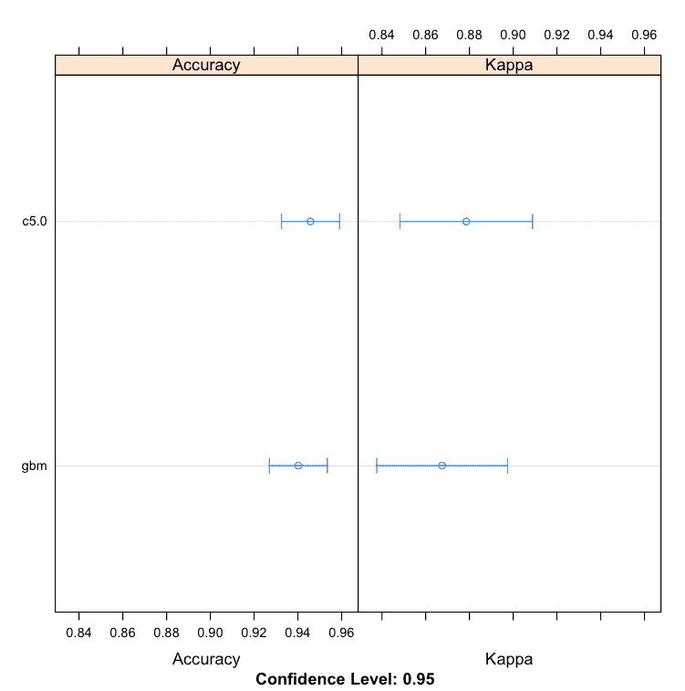
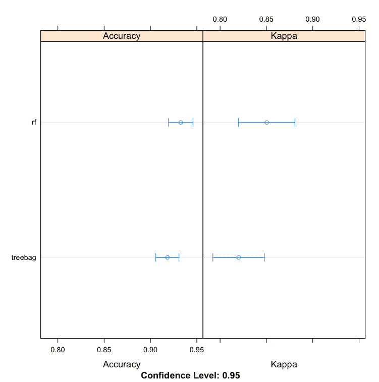
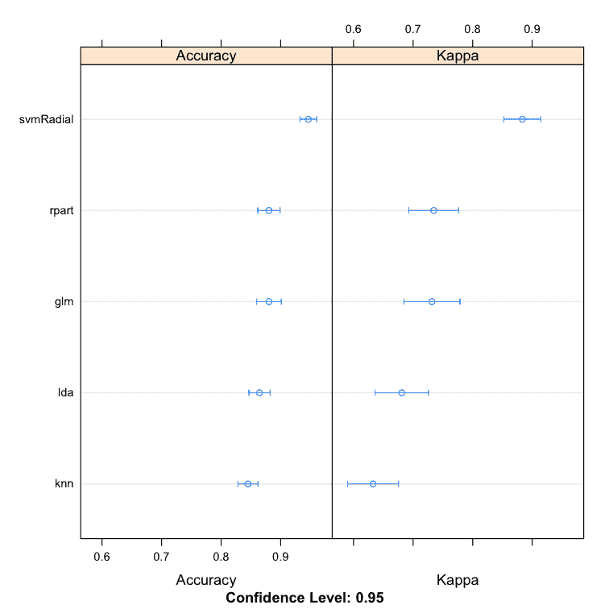
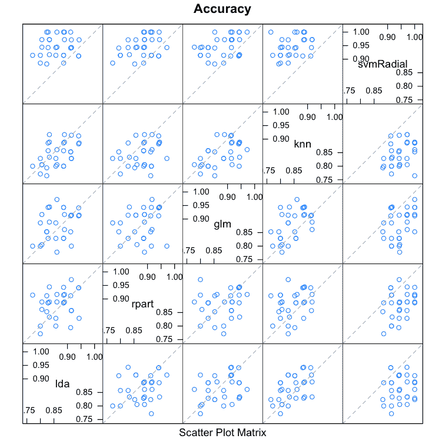

# 如何在 R 中构建机器学习算法的集成

> 原文：<https://machinelearningmastery.com/machine-learning-ensembles-with-r/>

最后更新于 2019 年 8 月 22 日

集成可以提高数据集的准确性。

在这篇文章中，你将发现如何在 r。

本案例研究将引导您完成增强、装袋和堆叠，并向您展示如何在您自己的数据集上继续提升模型的准确性。

**用我的新书[用 R](https://machinelearningmastery.com/machine-learning-with-r/) 启动你的项目**，包括*一步一步的教程*和所有例子的 *R 源代码*文件。

我们开始吧。


在 R
中构建一个机器学习算法的集成。

## 提高模型的准确性

为数据集找到表现良好的机器学习算法可能需要时间。这是因为应用机器学习的反复试验性质。

一旦你有了一个精确模型的候选列表，你就可以使用算法调整来从每个算法中获得最大的收益。

另一种可以用来提高数据集准确率的方法是将多个不同模型的预测组合在一起。

这被称为[集合预测](https://machinelearningmastery.com/ensemble-methods-for-deep-learning-neural-networks/)。

### 将模型预测合并到集合预测中

结合不同模型预测的三种最流行的方法是:

*   **装袋**。从训练数据集的不同子样本构建多个模型(通常是同一类型)。
*   **升压**。构建多个模型(通常是同一类型的)，每个模型学习修正链中先前模型的预测误差。
*   **堆叠**。构建多个模型(通常类型不同)和主管模型，学习如何最好地组合主要模型的预测。

这篇文章不会解释每一种方法。它假设您通常熟悉机器学习算法和集成方法，并且您正在寻找如何使用 r 创建集成的信息。

## R 语言中的集成机器学习

你可以在 r

有三种主要技术可以在 R 中创建机器学习算法的集成:Boosting、Bagging 和[堆叠](https://machinelearningmastery.com/stacking-ensemble-for-deep-learning-neural-networks/)。在这一节中，我们将依次看每一个。

在我们开始构建集合之前，让我们定义我们的测试设置。

### 测试数据集

本案例研究中的所有集合预测示例都将使用电离层数据集。

这是可从 [UCI 机器学习资源库](https://machinelearningmastery.com/practice-machine-learning-with-small-in-memory-datasets-from-the-uci-machine-learning-repository/)获得的数据集。该数据集描述了来自大气中高能粒子的高频天线回波，以及回波是否显示结构。这个问题是一个二分类，包含 351 个实例和 35 个数字属性。

让我们加载库和数据集。

```py
# Load libraries
library(mlbench)
library(caret)
library(caretEnsemble)

# Load the dataset
data(Ionosphere)
dataset <- Ionosphere
dataset <- dataset[,-2]
dataset$V1 <- as.numeric(as.character(dataset$V1))
```

请注意，第一个属性是一个因子(0，1)，并且已经被转换为数字，以便与所有其他数字属性保持一致。还要注意，第二个属性是一个常量，已经被移除。

这里是电离层数据集的前几行的一个预览。

```py
> head(dataset)
  V1      V3       V4       V5       V6       V7       V8      V9      V10     V11      V12     V13      V14      V15
1  1 0.99539 -0.05889  0.85243  0.02306  0.83398 -0.37708 1.00000  0.03760 0.85243 -0.17755 0.59755 -0.44945  0.60536
2  1 1.00000 -0.18829  0.93035 -0.36156 -0.10868 -0.93597 1.00000 -0.04549 0.50874 -0.67743 0.34432 -0.69707 -0.51685
3  1 1.00000 -0.03365  1.00000  0.00485  1.00000 -0.12062 0.88965  0.01198 0.73082  0.05346 0.85443  0.00827  0.54591
4  1 1.00000 -0.45161  1.00000  1.00000  0.71216 -1.00000 0.00000  0.00000 0.00000  0.00000 0.00000  0.00000 -1.00000
5  1 1.00000 -0.02401  0.94140  0.06531  0.92106 -0.23255 0.77152 -0.16399 0.52798 -0.20275 0.56409 -0.00712  0.34395
6  1 0.02337 -0.00592 -0.09924 -0.11949 -0.00763 -0.11824 0.14706  0.06637 0.03786 -0.06302 0.00000  0.00000 -0.04572
       V16      V17      V18      V19      V20      V21      V22      V23      V24      V25      V26      V27      V28
1 -0.38223  0.84356 -0.38542  0.58212 -0.32192  0.56971 -0.29674  0.36946 -0.47357  0.56811 -0.51171  0.41078 -0.46168
2 -0.97515  0.05499 -0.62237  0.33109 -1.00000 -0.13151 -0.45300 -0.18056 -0.35734 -0.20332 -0.26569 -0.20468 -0.18401
3  0.00299  0.83775 -0.13644  0.75535 -0.08540  0.70887 -0.27502  0.43385 -0.12062  0.57528 -0.40220  0.58984 -0.22145
4  0.14516  0.54094 -0.39330 -1.00000 -0.54467 -0.69975  1.00000  0.00000  0.00000  1.00000  0.90695  0.51613  1.00000
5 -0.27457  0.52940 -0.21780  0.45107 -0.17813  0.05982 -0.35575  0.02309 -0.52879  0.03286 -0.65158  0.13290 -0.53206
6 -0.15540 -0.00343 -0.10196 -0.11575 -0.05414  0.01838  0.03669  0.01519  0.00888  0.03513 -0.01535 -0.03240  0.09223
       V29      V30      V31      V32      V33      V34 Class
1  0.21266 -0.34090  0.42267 -0.54487  0.18641 -0.45300  good
2 -0.19040 -0.11593 -0.16626 -0.06288 -0.13738 -0.02447   bad
3  0.43100 -0.17365  0.60436 -0.24180  0.56045 -0.38238  good
4  1.00000 -0.20099  0.25682  1.00000 -0.32382  1.00000   bad
5  0.02431 -0.62197 -0.05707 -0.59573 -0.04608 -0.65697  good
6 -0.07859  0.00732  0.00000  0.00000 -0.00039  0.12011   bad
```

有关更多信息，请参见 UCI 机器学习存储库中电离层数据集的[描述。](https://archive.ics.uci.edu/ml/datasets/Ionosphere)

数据集上已发布的世界级结果见本[摘要。](http://www.is.umk.pl/projects/datasets.html#Ionosphere)

### 1.增强算法

我们可以看看两种最流行的增强机器学习算法:

*   C5.0
*   随机梯度升压

以下是 r 中的 C5.0 和随机梯度提升(使用梯度提升建模实现)算法的示例。这两种算法都包含本示例中未调整的参数。

```py
# Example of Boosting Algorithms
control <- trainControl(method="repeatedcv", number=10, repeats=3)
seed <- 7
metric <- "Accuracy"
# C5.0
set.seed(seed)
fit.c50 <- train(Class~., data=dataset, method="C5.0", metric=metric, trControl=control)
# Stochastic Gradient Boosting
set.seed(seed)
fit.gbm <- train(Class~., data=dataset, method="gbm", metric=metric, trControl=control, verbose=FALSE)
# summarize results
boosting_results <- resamples(list(c5.0=fit.c50, gbm=fit.gbm))
summary(boosting_results)
dotplot(boosting_results)
```

我们可以看到 C5.0 算法产生了一个更精确的模型，准确率为 94.58%。

```py
Models: c5.0, gbm 
Number of resamples: 30 

Accuracy 
       Min. 1st Qu. Median   Mean 3rd Qu. Max. NA's
c5.0 0.8824  0.9143 0.9437 0.9458  0.9714    1    0
gbm  0.8824  0.9143 0.9429 0.9402  0.9641    1    0
```



增强机器学习算法

了解有关 Caret 增强模型树的更多信息:[增强模型](https://topepo.github.io/caret/Boosting.html)。

### 2.装袋算法

让我们看看两种最流行的装袋机器学习算法:

*   袋装 CART
*   随机森林

下面是 r 中的袋装 CART 和随机森林算法的示例。这两种算法都包含本示例中未调整的参数。

```py
# Example of Bagging algorithms
control <- trainControl(method="repeatedcv", number=10, repeats=3)
seed <- 7
metric <- "Accuracy"
# Bagged CART
set.seed(seed)
fit.treebag <- train(Class~., data=dataset, method="treebag", metric=metric, trControl=control)
# Random Forest
set.seed(seed)
fit.rf <- train(Class~., data=dataset, method="rf", metric=metric, trControl=control)
# summarize results
bagging_results <- resamples(list(treebag=fit.treebag, rf=fit.rf))
summary(bagging_results)
dotplot(bagging_results)
```

我们可以看到，随机森林产生了一个更准确的模型，准确率为 93.25%。

```py
Models: treebag, rf 
Number of resamples: 30 

Accuracy 
          Min. 1st Qu. Median   Mean 3rd Qu. Max. NA's
treebag 0.8529  0.8946 0.9143 0.9183  0.9440    1    0
rf      0.8571  0.9143 0.9420 0.9325  0.9444    1    0
```



R

点击此处了解更多关于脱字号装袋模型的信息:[装袋模型](https://topepo.github.io/caret/Bagging.html)。

### 3.堆叠算法

您可以使用*carestensemble*包组合多个*脱字符*模型的预测。

给定 Caret 模型列表， *caretStack()* 函数可用于指定更高阶的模型，以学习如何最好地将子模型的预测组合在一起。

让我们首先看一下为电离层数据集创建 5 个子模型，具体来说:

*   线性判别分析
*   分类和回归树
*   逻辑回归(通过广义线性模型或 GLM)
*   k 近邻
*   具有径向基核函数的支持向量机(SVM)

下面是创建这 5 个子模型的示例。注意由*carestenmble*包提供的新的有用的 *caretList()* 功能，用于创建标准 Caret 模型的列表。

```py
# Example of Stacking algorithms
# create submodels
control <- trainControl(method="repeatedcv", number=10, repeats=3, savePredictions=TRUE, classProbs=TRUE)
algorithmList <- c('lda', 'rpart', 'glm', 'knn', 'svmRadial')
set.seed(seed)
models <- caretList(Class~., data=dataset, trControl=control, methodList=algorithmList)
results <- resamples(models)
summary(results)
dotplot(results)
```

我们可以看到，SVM 以 94.66%的准确率创建了最准确的模型。

```py
Models: lda, rpart, glm, knn, svmRadial 
Number of resamples: 30 

Accuracy 
            Min. 1st Qu. Median   Mean 3rd Qu.   Max. NA's
lda       0.7714  0.8286 0.8611 0.8645  0.9060 0.9429    0
rpart     0.7714  0.8540 0.8873 0.8803  0.9143 0.9714    0
glm       0.7778  0.8286 0.8873 0.8803  0.9167 0.9722    0
knn       0.7647  0.8056 0.8431 0.8451  0.8857 0.9167    0
svmRadial 0.8824  0.9143 0.9429 0.9466  0.9722 1.0000    0
```



R 中叠加集成子模型的比较

当我们使用叠加组合不同模型的预测时，希望子模型做出的预测具有低相关性。这将表明这些模型是有技巧的，但在不同的方面，允许一个新的分类器来找出如何从每个模型中获得最佳的改进分数。

如果子模型的预测被高度修正(> 0.75)，那么它们大部分时间会做出相同或非常相似的预测，从而降低了组合预测的好处。

```py
# correlation between results
modelCor(results)
splom(results)
```

我们可以看到，所有的预测对都具有普遍较低的相关性。预测之间相关性最高的两种方法是逻辑回归(GLM)和 kNN，相关系数为 0.517，这并不算高(> 0.75)。

```py
                lda     rpart       glm       knn svmRadial
lda       1.0000000 0.2515454 0.2970731 0.5013524 0.1126050
rpart     0.2515454 1.0000000 0.1749923 0.2823324 0.3465532
glm       0.2970731 0.1749923 1.0000000 0.5172239 0.3788275
knn       0.5013524 0.2823324 0.5172239 1.0000000 0.3512242
svmRadial 0.1126050 0.3465532 0.3788275 0.3512242 1.0000000
```



叠加集合中子模型预测的相关性

让我们使用一个简单的线性模型来组合分类器的预测。

```py
# stack using glm
stackControl <- trainControl(method="repeatedcv", number=10, repeats=3, savePredictions=TRUE, classProbs=TRUE)
set.seed(seed)
stack.glm <- caretStack(models, method="glm", metric="Accuracy", trControl=stackControl)
print(stack.glm)
```

我们可以看到，我们已经将准确率提升到了 94.99%，这比单独使用 SVM 有一点点改进。如上所述，这也是对在数据集上单独使用随机森林的改进。

```py
A glm ensemble of 2 base models: lda, rpart, glm, knn, svmRadial

Ensemble results:
Generalized Linear Model 

1053 samples
   5 predictor
   2 classes: 'bad', 'good' 

No pre-processing
Resampling: Cross-Validated (10 fold, repeated 3 times) 
Summary of sample sizes: 948, 947, 948, 947, 949, 948, ... 
Resampling results

  Accuracy  Kappa     Accuracy SD  Kappa SD  
  0.949996  0.891494  0.02121303   0.04600482
```

我们还可以使用更复杂的算法来组合预测，努力梳理出何时最好使用不同的方法。在这种情况下，我们可以使用随机森林算法来组合预测。

```py
# stack using random forest
set.seed(seed)
stack.rf <- caretStack(models, method="rf", metric="Accuracy", trControl=stackControl)
print(stack.rf)
```

我们可以看到，这已经将准确率提升到了 96.26%，仅在 SVM 就有了令人印象深刻的提高。

```py
A rf ensemble of 2 base models: lda, rpart, glm, knn, svmRadial

Ensemble results:
Random Forest 

1053 samples
   5 predictor
   2 classes: 'bad', 'good' 

No pre-processing
Resampling: Cross-Validated (10 fold, repeated 3 times) 
Summary of sample sizes: 948, 947, 948, 947, 949, 948, ... 
Resampling results across tuning parameters:

  mtry  Accuracy   Kappa      Accuracy SD  Kappa SD  
  2     0.9626439  0.9179410  0.01777927   0.03936882
  3     0.9623205  0.9172689  0.01858314   0.04115226
  5     0.9591459  0.9106736  0.01938769   0.04260672

Accuracy was used to select the optimal model using  the largest value.
The final value used for the model was mtry = 2.
```

## 你可以在 R

**不需要做 R 程序员**。您可以从这篇博文中复制并粘贴示例代码来开始。使用 r 中的内置帮助研究示例中使用的函数

**不需要成为机器学习专家**。如果你从零开始做，创造集成会非常复杂。*caret*和*carestensemble*包允许您开始创建和尝试集成，即使您对它们的工作原理没有深入的了解。仔细阅读每种类型的集成，以便以后从中获得更多的东西。

**不需要自己收集数据**。本案例研究中使用的数据来自 *mlbench* 包。您可以像这样使用标准机器学习数据集来学习、使用和实验机器学习算法。

**不需要自己编写集成代码**。R 提供了一些最强大的算法来创建集成，随时可以运行。使用这篇文章中的例子立即开始。您可以随时根据您的具体情况进行调整，或者稍后使用自定义代码尝试新的想法。

## 摘要

在这篇文章中，你发现你可以使用机器学习算法的集成来提高模型的准确性。

您发现了可以在 R 中构建的三种类型的机器学习算法集成:

*   提升
*   制袋材料
*   堆垛

您可以将本案例研究中的代码用作 r 中当前或下一个机器学习项目的模板

## 下一步

你完成案例研究了吗？

1.  开始你的互动环境。
2.  键入或复制粘贴本案例研究中的所有代码。
3.  利用 R 函数的帮助，花时间了解案例研究的每个部分。

你对这个案例研究或在 R 中使用集成有什么问题吗？留言提问，我会尽力回答。