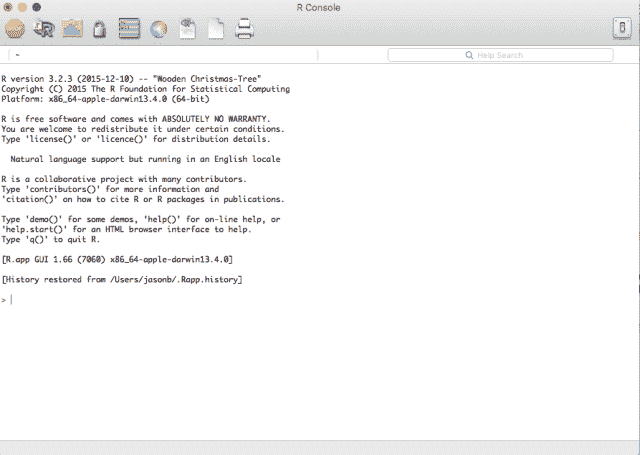
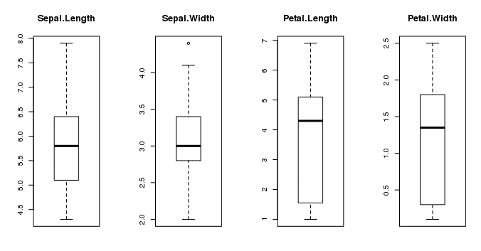
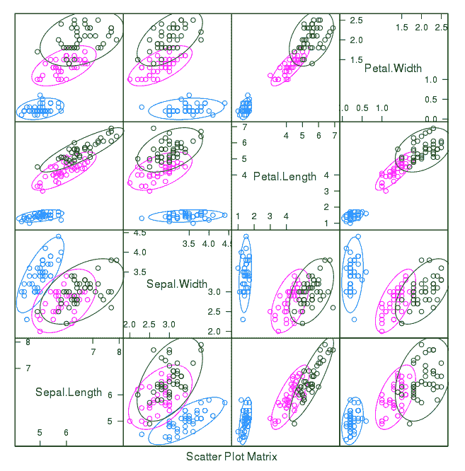
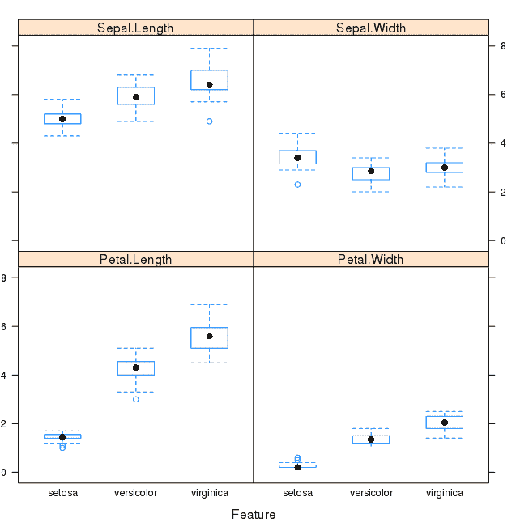
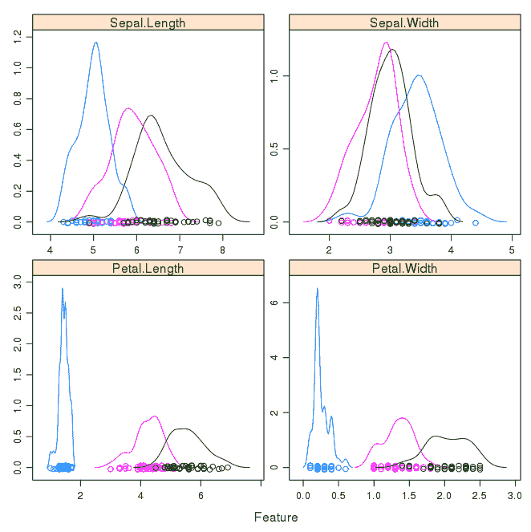
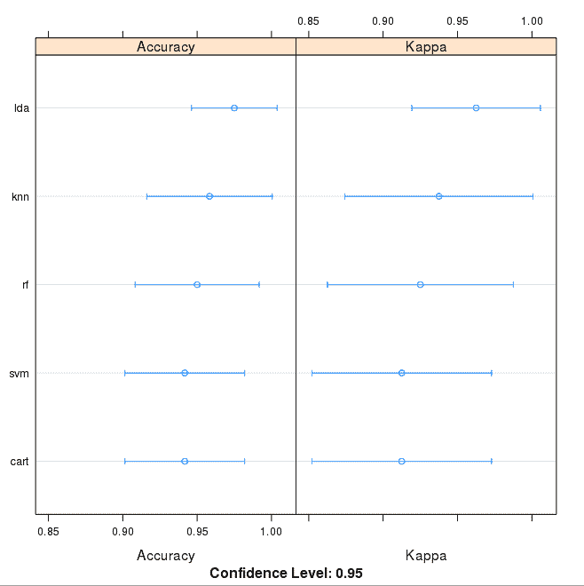

# R 中的第一个机器学习逐步项目

> 原文：<https://machinelearningmastery.com/machine-learning-in-r-step-by-step/>

最后更新于 2019 年 10 月 8 日

你想用 R 做机器学习，但是入门有困难吗？

在这篇文章中，你将使用 r 完成你的第一个机器学习项目。

在本逐步教程中，您将:

1.  下载并安装 R，获得 R 中最有用的机器学习包。
2.  使用统计摘要和数据可视化加载数据集并了解其结构。
3.  创建 5 个机器学习模型，选择最佳模型，并建立准确性可靠的信心。

如果你是一个机器学习初学者，并希望最终开始使用 R，本教程是为你设计的。

**用我的新书[用 R](https://machinelearningmastery.com/machine-learning-with-r/) 启动你的项目**，包括*一步一步的教程*和所有例子的 *R 源代码*文件。

我们开始吧！


你的第一个机器学习项目在 R-Step-Step
照片由[亨利·布伦斯](https://www.flickr.com/photos/foilman/7172269778)拍摄，版权所有。

## 如何在 R 中开始机器学习？

学习机器学习的最好方法是通过设计和完成小项目。

#### 开始时，r 可能会令人生畏

r 提供了一种具有奇怪语法的脚本语言。还有数百个包和数千个函数可供选择，提供了多种方式来完成每项任务。这种感觉让人无法抗拒。

开始使用 R 进行机器学习的最好方法是完成一个项目。

*   它会强迫你安装并启动 R(至少)。
*   它会让你鸟瞰如何完成一个小项目。
*   它会给你信心，也许继续你自己的小项目。

### 初学者需要一个小型的端到端项目

书籍和课程令人沮丧。他们会给你很多秘籍和片段，但你永远看不到它们是如何结合在一起的。

当您将机器学习应用到自己的数据集时，您正在进行一个项目。

机器学习项目的过程可能不是线性的，但是有许多众所周知的步骤:

1.  定义问题。
2.  准备数据。
3.  评估计法。
4.  改善结果。
5.  呈现结果。

有关机器学习项目步骤的更多信息，请参见本[清单](https://machinelearningmastery.com/machine-learning-checklist/)和更多关于流程的[。](https://machinelearningmastery.com/process-for-working-through-machine-learning-problems/)

真正接受新平台或工具的最佳方式是端到端地完成机器学习项目，并涵盖关键步骤。也就是说，从加载数据，总结你的数据，评估计法和做一些预测。

如果可以做到这一点，您就有了一个可以在一个又一个数据集上使用的模板。一旦你有了更多的信心，你就可以填补空白，比如进一步的数据准备和以后改进结果任务。

### 你好机器学习的世界

在新工具上开始的最好的小项目是鸢尾花的分类(例如鸢尾数据集)。

这是一个很好的项目，因为它很好理解。

*   属性是数字的，所以你必须弄清楚如何加载和处理数据。
*   这是一个分类问题，允许你用一种更简单的监督学习算法来练习。
*   这是一个多类分类问题(多标称)，可能需要一些专门的处理。
*   它只有 4 个属性和 150 行，这意味着它很小，很容易放入内存(和一个屏幕或 A4 页面)。
*   所有的数字属性都是以相同的单位和相同的比例表示的，不需要任何特殊的缩放或转换来开始。

让我们从你在 r 的 hello world 机器学习项目开始。

## R 中的机器学习:逐步教程(从这里开始)

在本节中，我们将从头到尾完成一个小型机器学习项目。

下面是我们将要讲述的内容的概述:

1.  安装 R 平台。
2.  正在加载数据集。
3.  汇总数据集。
4.  可视化数据集。
5.  评估一些算法。
6.  做一些预测。

慢慢来。完成每一步。

尝试自己键入命令或复制粘贴命令来加快速度。

有任何问题，请在帖子底部留言。

### 1.下载安装和启动 R

如果系统上还没有安装 R 平台，请将其安装到系统上。

**更新**:本教程是用 R 版本 3.2.3 编写和测试的。建议您使用这个版本的 R 或更高版本。

我不想详细讨论这个问题，因为其他人已经讨论过了。这已经很简单了，尤其是如果你是一个开发人员。如果您确实需要帮助，请在评论中提问。

以下是我们在这一步中要介绍的内容:

1.  下载器
2.  安装程序
3.  开头的人
4.  安装 R 包。

#### 1.1 下载 R

可以从[R 项目网页](https://www.r-project.org/)下载 R。

当你点击下载链接时，你必须选择一个镜像。然后，您可以为您的操作系统选择 R，例如 Windows、OS X 或 Linux。

#### 1.2 安装拆装

R is 很容易安装，我相信你能处理好。没有特殊要求。如果您有问题或需要安装帮助，请参见 [R 安装和管理](https://cran.r-project.org/doc/manuals/r-release/R-admin.html)。

#### 1.3 起动电阻

您可以从操作系统上使用的任何菜单系统启动 R。

对我来说，我更喜欢命令行。

打开您的命令行，更改(或创建)到您的项目目录，并通过键入以下命令启动 R:

```py
R
```

您应该会在新窗口或终端中看到类似下面截图的内容。



互动环境

#### 1.4 安装包

安装我们今天要使用的软件包。包是我们可以在 r 中使用的第三方插件或库。

```py
install.packages("caret")
```

**UPDATE** :我们可能需要其他的包，但是 caret 应该会问我们要不要加载。如果程序包有问题，您可以通过键入以下命令来安装 caret 程序包和所有可能需要的程序包:

```py
install.packages("caret", dependencies=c("Depends", "Suggests"))
```

现在，让我们加载我们将在本教程中使用的包，Caret 包。

```py
library(caret)
```

caret 包为数百种机器学习算法提供了一致的接口，并为数据可视化、数据重采样、模型调整和模型比较等功能提供了有用的便利方法。这是 r 中机器学习项目的必备工具。

有关 Caret 包的更多信息，请参见[Caret 包主页](https://topepo.github.io/caret/index.html)。

### 2.加载数据

我们将使用鸢尾花数据集。这个数据集之所以出名，是因为它被几乎所有人用作机器学习和统计中的“你好世界”数据集。

该数据集包含 150 个鸢尾花的观察结果。有四列以厘米为单位的花朵尺寸。第五栏是观察到的花的种类。所有观察到的花都属于三种中的一种。
[你可以在维基百科](https://en.wikipedia.org/wiki/Iris_flower_data_set)上了解更多关于这个数据集的信息。

以下是我们在这一步要做的事情:

1.  以简单的方式加载虹膜数据。
2.  从 CSV 加载 iris 数据(可选，对于纯粹主义者)。
3.  将数据分为训练数据集和验证数据集。

选择您喜欢的数据加载方式，或者尝试两种方法。

#### 2.1 轻松加载数据

幸运的是，R 平台为我们提供了虹膜数据集。按如下方式加载数据集:

```py
# attach the iris dataset to the environment
data(iris)
# rename the dataset
dataset <- iris
```

现在您已经将虹膜数据加载到 R 中，并且可以通过*数据集*变量进行访问。

我喜欢将加载的数据命名为“数据集”。如果您想要在项目之间复制粘贴代码，并且数据集总是具有相同的名称，这将很有帮助。

#### 2.2 从 CSV 加载

也许你是一个纯粹主义者，你想像在自己的机器学习项目中一样，从 CSV 文件中加载数据。

1.  从 [UCI 机器学习资源库](https://archive.ics.uci.edu/ml/datasets/Iris)下载虹膜数据集(这里是[直接链接](https://archive.ics.uci.edu/ml/machine-learning-databases/iris/iris.data))。
2.  将文件保存为 *iris.csv* 您的项目目录。

从 CSV 文件加载数据集，如下所示:

```py
# define the filename
filename <- "iris.csv"
# load the CSV file from the local directory
dataset <- read.csv(filename, header=FALSE)
# set the column names in the dataset
colnames(dataset) <- c("Sepal.Length","Sepal.Width","Petal.Length","Petal.Width","Species")
```

现在您已经将虹膜数据加载到 R 中，并且可以通过*数据集*变量进行访问。

#### 2.3.创建验证数据集

我们需要知道我们创造的模型是不是好的。

稍后，我们将使用统计方法来估计我们在看不见的数据上创建的模型的准确性。我们还希望通过在实际未看到的数据上评估最佳模型，对其准确性进行更具体的评估。
也就是说，我们将保留一些算法看不到的数据，我们将使用这些数据来获得最佳模型实际上有多准确的第二个独立想法。

我们将把加载的数据集分成两部分，其中 80%用于训练模型，20%作为验证数据集保留下来。

```py
# create a list of 80% of the rows in the original dataset we can use for training
validation_index <- createDataPartition(dataset$Species, p=0.80, list=FALSE)
# select 20% of the data for validation
validation <- dataset[-validation_index,]
# use the remaining 80% of data to training and testing the models
dataset <- dataset[validation_index,]
```

现在在*数据集*变量中有了训练数据，我们稍后将在*验证*变量中使用一个验证集。

注意，我们用数据集的 80%样本替换了数据集变量。这是为了让代码的其余部分更简单易读。

### 3.汇总数据集

现在是时候看看数据了。

在这一步中，我们将以几种不同的方式查看数据:

1.  数据集的维度。
2.  属性的类型。
3.  偷看数据本身。
4.  类属性的级别。
5.  每个类中实例的细分。
6.  所有属性的统计摘要。

别担心，每次看数据都是一个命令。这些是有用的命令，您可以在未来的项目中反复使用。

#### 3.1 数据集的维度

我们可以通过 dim 函数快速了解数据包含多少实例(行)和多少属性(列)。

```py
# dimensions of dataset
dim(dataset)
```

您应该会看到 120 个实例和 5 个属性:

```py
[1] 120 5
```

#### 3.2 属性的类型

了解属性的类型是个好主意。它们可以是双准确率、整数、字符串、因子和其他类型。

了解类型很重要，因为这将让您了解如何更好地总结您所拥有的数据，以及在建模之前可能需要使用哪些类型的转换来准备数据。

```py
# list types for each attribute
sapply(dataset, class)
```

您应该看到所有的输入都是双准确率的，类值是一个因素:

```py
Sepal.Length Sepal.Width Petal.Length Petal.Width Species 
 "numeric" "numeric" "numeric" "numeric" "factor"
```

#### 3.3 查看数据

事实上，关注你的数据也是一个好主意。

```py
# take a peek at the first 5 rows of the data
head(dataset)
```

您应该会看到前 5 行数据:

```py
 Sepal.Length Sepal.Width Petal.Length Petal.Width Species
1 5.1 3.5 1.4 0.2 setosa
2 4.9 3.0 1.4 0.2 setosa
3 4.7 3.2 1.3 0.2 setosa
5 5.0 3.6 1.4 0.2 setosa
6 5.4 3.9 1.7 0.4 setosa
7 4.6 3.4 1.4 0.3 setosa
```

#### 3.4 班级级别

类变量是一个因素。因子是具有多个类别标签或级别的类别。让我们看看级别:

```py
# list the levels for the class
levels(dataset$Species)
```

请注意上面我们如何通过名称将属性称为数据集的属性。在结果中，我们可以看到该类有 3 个不同的标签:

```py
[1] "setosa" "versicolor" "virginica"
```

这是一个多类或多项分类问题。如果有两个层次，那就是一个二分类问题。

#### 3.5 等级分布

现在让我们看看属于每个类的实例(行)的数量。我们可以将此视为绝对计数和百分比。

```py
# summarize the class distribution
percentage <- prop.table(table(dataset$Species)) * 100
cbind(freq=table(dataset$Species), percentage=percentage)
```

我们可以看到，每个类都有相同数量的实例(数据集的 40%或 33%)

```py
 freq percentage
setosa     40 33.33333
versicolor 40 33.33333
virginica  40 33.33333
```

#### 3.6 统计汇总

最后，我们可以看一下每个属性的摘要。

这包括平均值、最小值和最大值以及一些百分位数(第 25 位、第 50 位或第 50 位或第 75 位，例如，如果我们对一个属性的所有值进行排序，则为此时的值)。

```py
# summarize attribute distributions
summary(dataset)
```

我们可以看到所有的数值都有相同的刻度(厘米)和相似的范围[0，8]厘米。

```py
 Sepal.Length  Sepal.Width  Petal.Length  Petal.Width   Species 
 Min.   :4.300 Min.   :2.00 Min.   :1.000 Min.   :0.100 setosa    :40 
 1st Qu.:5.100 1st Qu.:2.80 1st Qu.:1.575 1st Qu.:0.300 versicolor:40 
 Median :5.800 Median :3.00 Median :4.300 Median :1.350 virginica :40 
 Mean   :5.834 Mean   :3.07 Mean   :3.748 Mean   :1.213 
 3rd Qu.:6.400 3rd Qu.:3.40 3rd Qu.:5.100 3rd Qu.:1.800 
 Max.   :7.900 Max.   :4.40 Max.   :6.900 Max.   :2.500
```

### 4.可视化数据集

我们现在对数据有了一个基本的概念。我们需要用一些可视化来扩展它。

我们将看两种类型的图:

1.  单变量图，以更好地理解每个属性。
2.  多元图，以更好地理解属性之间的关系。

#### 4.1 单变量图

我们从一些单变量图开始，也就是每个单独变量的图。

有一种方法可以只引用输入属性和输出属性，这对可视化很有帮助。让我们设置它，并调用输入属性 x 和输出属性(或类)y。

```py
# split input and output
x <- dataset[,1:4]
y <- dataset[,5]
```

假设输入变量是数字，我们可以创建每个变量的方框图和触须图。

```py
# boxplot for each attribute on one image
par(mfrow=c(1,4))
  for(i in 1:4) {
  boxplot(x[,i], main=names(iris)[i])
}
```

这让我们对输入属性的分布有了更清晰的了解:



R 中的方框图和触须图

我们还可以创建一个物种类变量的条形图来获得类分布的图形表示(在这种情况下通常不感兴趣，因为它们是均匀的)。

```py
# barplot for class breakdown
plot(y)
```

这证实了我们在上一节中学到的，实例平均分布在三个类中:


鸢尾属花卉的条形图

#### 4.2 多元图

现在我们可以看看变量之间的相互作用。

首先，让我们看看所有属性对的散点图，并按类给点着色。此外，因为散点图显示每个类的点通常是分开的，所以我们可以在它们周围画椭圆。

```py
# scatterplot matrix
featurePlot(x=x, y=y, plot="ellipse")
```

我们可以看到输入属性(趋势)和属性与类值(省略号)之间的一些明确关系:



虹膜数据的散点图矩阵

我们还可以再次查看每个输入变量的方框图和触须图，但这次为每个类细分为单独的图。这有助于梳理出类别之间明显的线性分离。

```py
# box and whisker plots for each attribute
featurePlot(x=x, y=y, plot="box")
```

看到每个类值的属性有明显不同的分布是很有用的。



按类别值列出的虹膜数据的方框图和触须图

接下来，我们可以了解每个属性的分布，同样像方框图和触须图，按类值细分。有时直方图对此很有用，但在这种情况下，我们将使用一些概率密度图来为每个分布给出漂亮的平滑线条。

```py
# density plots for each attribute by class value
scales <- list(x=list(relation="free"), y=list(relation="free"))
featurePlot(x=x, y=y, plot="density", scales=scales)
```

像箱线图一样，我们可以看到每个属性按类值分布的差异。我们还可以看到每个属性的类高斯分布(钟形曲线)。



按类别值划分的虹膜数据密度图

### 5.评估一些算法

现在是时候创建一些数据模型，并根据看不见的数据估计它们的准确性了。

以下是我们在这一步中要介绍的内容:

1.  设置测试线束以使用 10 倍交叉验证。
2.  建立 5 个不同的模型，通过花卉测量来预测物种
3.  选择最佳型号。

#### 5.1 测试线束

我们将进行 10 倍交叉验证来评估准确性。

这将把我们的数据集分成 10 个部分，在 9 个部分中训练，在 1 个部分中测试，并发布所有组合的训练-测试分割。我们还将对每个算法重复该过程 3 次，将不同的数据分成 10 组，以获得更准确的估计。

```py
# Run algorithms using 10-fold cross validation
control <- trainControl(method="cv", number=10)
metric <- "Accuracy"
```

我们使用“准确性”这一指标来评估模型。这是正确预测的实例数除以数据集中的实例总数乘以 100 得出的百分比(例如，95%准确)。接下来，当我们运行构建并评估每个模型时，我们将使用*度量*变量。

#### 5.2 构建模型

我们不知道在这个问题上哪些算法是好的，或者使用什么配置。我们从图中得到一个想法，一些类在某些维度上是部分线性可分的，所以我们通常期待好的结果。

让我们评估 5 种不同的算法:

*   线性判别分析
*   分类和回归树。
*   k-最近邻。
*   具有线性核的支持向量机(SVM)。
*   随机森林

这是简单线性(LDA)、非线性(CART、kNN)和复杂非线性方法(SVM、射频)的良好混合。我们在到达运行之前重置随机数种子，以确保使用完全相同的数据分割来执行每个算法的评估。它确保结果具有直接可比性。

让我们构建五个模型:

```py
# a) linear algorithms
set.seed(7)
fit.lda <- train(Species~., data=dataset, method="lda", metric=metric, trControl=control)
# b) nonlinear algorithms
# CART
set.seed(7)
fit.cart <- train(Species~., data=dataset, method="rpart", metric=metric, trControl=control)
# kNN
set.seed(7)
fit.knn <- train(Species~., data=dataset, method="knn", metric=metric, trControl=control)
# c) advanced algorithms
# SVM
set.seed(7)
fit.svm <- train(Species~., data=dataset, method="svmRadial", metric=metric, trControl=control)
# Random Forest
set.seed(7)
fit.rf <- train(Species~., data=dataset, method="rf", metric=metric, trControl=control)
```

Caret 确实支持每个模型的配置和配置调优，但是我们不会在本教程中介绍这一点。

#### 5.3 选择最佳型号

我们现在有 5 个模型，每个模型都有准确率估计。我们需要相互比较模型，选择最准确的。

我们可以通过首先创建一个已创建模型的列表并使用 summary 函数来报告每个模型的准确性。

```py
# summarize accuracy of models
results <- resamples(list(lda=fit.lda, cart=fit.cart, knn=fit.knn, svm=fit.svm, rf=fit.rf))
summary(results)
```

我们可以看到每个分类器的准确性，以及其他指标，如卡帕:

```py
Models: lda, cart, knn, svm, rf 
Number of resamples: 10 

Accuracy 
       Min. 1st Qu. Median   Mean 3rd Qu. Max. NA's
lda  0.9167  0.9375 1.0000 0.9750       1    1    0
cart 0.8333  0.9167 0.9167 0.9417       1    1    0
knn  0.8333  0.9167 1.0000 0.9583       1    1    0
svm  0.8333  0.9167 0.9167 0.9417       1    1    0
rf   0.8333  0.9167 0.9583 0.9500       1    1    0

Kappa 
      Min. 1st Qu. Median   Mean 3rd Qu. Max. NA's
lda  0.875  0.9062 1.0000 0.9625       1    1    0
cart 0.750  0.8750 0.8750 0.9125       1    1    0
knn  0.750  0.8750 1.0000 0.9375       1    1    0
svm  0.750  0.8750 0.8750 0.9125       1    1    0
rf   0.750  0.8750 0.9375 0.9250       1    1    0
```

我们还可以创建模型评估结果的图表，并比较每个模型的分布和平均准确率。每种算法都有一组准确率度量，因为每种算法都被评估了 10 次(10 倍交叉验证)。

```py
# compare accuracy of models
dotplot(results)
```

我们可以看到，这种情况下最准确的模型是 LDA:



虹膜数据集上机器学习算法的比较

仅 LDA 模型的结果就可以概括。

```py
# summarize Best Model
print(fit.lda)
```

这很好地总结了用于训练模型的内容以及达到的平均和标准偏差(SD)准确率，特别是 97.5%的准确率+/- 4%

```py
Linear Discriminant Analysis 

120 samples
  4 predictor
  3 classes: 'setosa', 'versicolor', 'virginica' 

No pre-processing
Resampling: Cross-Validated (10 fold) 
Summary of sample sizes: 108, 108, 108, 108, 108, 108, ... 
Resampling results

  Accuracy  Kappa   Accuracy SD  Kappa SD  
  0.975     0.9625  0.04025382   0.06038074
```

### 6.做预测

线性判别分析是最准确的模型。现在我们想了解一下我们的验证集上模型的准确性。

这将使我们对最佳模型的准确性进行独立的最终检查。保留一个验证集是很有价值的，以防在过程中出现失误，如过拟合训练集或数据泄漏。两者都会导致过于乐观的结果。

我们可以直接在验证集上运行 LDA 模型，并在[混淆矩阵](https://machinelearningmastery.com/confusion-matrix-machine-learning/)中总结结果。

```py
# estimate skill of LDA on the validation dataset
predictions <- predict(fit.lda, validation)
confusionMatrix(predictions, validation$Species)
```

我们可以看到准确率是 100%。这是一个小的验证数据集(20%)，但这个结果在我们预期的 97% +/-4%的范围内，表明我们可能有一个准确可靠的精确模型。

```py
Confusion Matrix and Statistics

            Reference
Prediction   setosa versicolor virginica
  setosa         10          0         0
  versicolor      0         10         0
  virginica       0          0        10

Overall Statistics

               Accuracy : 1          
                 95% CI : (0.8843, 1)
    No Information Rate : 0.3333     
    P-Value [Acc > NIR] : 4.857e-15  

                  Kappa : 1          
 Mcnemar's Test P-Value : NA         

Statistics by Class:

                     Class: setosa Class: versicolor Class: virginica
Sensitivity                 1.0000            1.0000           1.0000
Specificity                 1.0000            1.0000           1.0000
Pos Pred Value              1.0000            1.0000           1.0000
Neg Pred Value              1.0000            1.0000           1.0000
Prevalence                  0.3333            0.3333           0.3333
Detection Rate              0.3333            0.3333           0.3333
Detection Prevalence        0.3333            0.3333           0.3333
Balanced Accuracy           1.0000            1.0000           1.0000
```

## 你可以用 R 做机器学习

完成上面的教程。最多需要 5 到 10 分钟！

**不需要什么都懂**。(至少现在不是)你的目标是把教程从头到尾跑一遍，得到一个结果。你不需要第一遍就明白所有的事情。边走边列出你的问题。大量使用*？函数名*帮助语法在 R 中学习你正在使用的所有函数。

**你不需要知道算法是如何工作的**。了解这些限制以及如何配置机器学习算法非常重要。但是关于算法的学习可以在以后进行。你需要长时间慢慢积累这些算法知识。今天，从适应平台开始。

**不需要做 R 程序员**。R 语言的语法可能会令人困惑。就像其他语言一样，关注函数调用(如*函数()*)和赋值(如*a<-【b】*)。这会让你大受鼓舞。你是一名开发人员，你知道如何快速掌握一门语言的基础知识。开始吧，稍后再深入细节。

**不需要成为机器学习专家**。你可以在后面学习各种算法的好处和局限性，有很多帖子可以在后面阅读，以复习机器学习项目的步骤，以及使用交叉验证评估准确性的重要性。

**那么机器学习项目中的其他步骤呢**。我们没有涵盖机器学习项目的所有步骤，因为这是您的第一个项目，我们需要关注关键步骤。也就是加载数据，查看数据，评估一些算法，做一些预测。在后面的教程中，我们可以查看其他数据准备和结果改进任务。

## 摘要

在这篇文章中，你逐步发现了如何完成你在 r。

你发现完成一个从加载数据到做出预测的小型端到端项目是熟悉一个新平台的最佳方式。

## 你的下一步

你完成教程了吗？

1.  完成以上教程。
2.  列出你有任何问题。
3.  搜索或研究答案。

记住，你可以使用*？R 中的函数名*可以获得任何函数的帮助。

你有问题吗？在下面的评论中发布它。