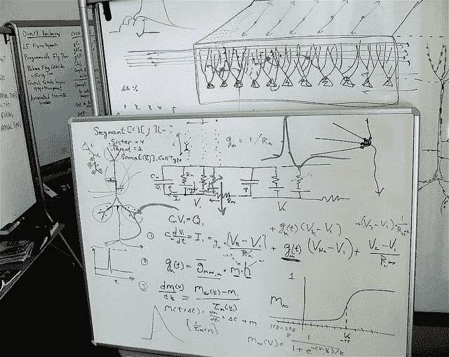

# R 中的非线性回归

> 原文：<https://machinelearningmastery.com/non-linear-regression-in-r/>

最后更新于 2020 年 8 月 15 日

在这篇文章中，你将发现 r 中非线性回归的 4 个方法。

有许多高级方法可以用于非线性回归，这些方法只是您可以使用的方法的一个示例。

**用我的新书[用 R](https://machinelearningmastery.com/machine-learning-with-r/) 启动你的项目**，包括*一步一步的教程*和所有例子的 *R 源代码*文件。

我们开始吧。

[](https://machinelearningmastery.com/wp-content/uploads/2014/07/non-linear-regression.jpg)

非线性回归
史蒂夫·朱韦森摄，版权所有

本文中的每个示例都使用了 r 附带的[数据集包](http://stat.ethz.ch/R-manual/R-devel/library/datasets/html/00Index.html)中提供的 [longley](http://stat.ethz.ch/R-manual/R-devel/library/datasets/html/longley.html) 数据集。longley 数据集描述了从 1947 年到 1962 年观察到的 7 个经济变量，用于预测每年的就业人数。

## 多元自适应回归样条

多元自适应回归样条(MARS)是一种非参数回归方法，它使用铰链函数(其中带有扭结的函数)对数据中的多种非线性进行建模。

```py
# load the package
library(earth)
# load data
data(longley)
# fit model
fit <- earth(Employed~., longley)
# summarize the fit
summary(fit)
# summarize the importance of input variables
evimp(fit)
# make predictions
predictions <- predict(fit, longley)
# summarize accuracy
mse <- mean((longley$Employed - predictions)^2)
print(mse)
```

了解更多关于**接地**功能和[接地包](https://cran.r-project.org/web/packages/earth/index.html)的信息。

## 支持向量机

[支持向量机(SVM)](https://machinelearningmastery.com/support-vector-machines-for-machine-learning/) 是一类方法，最初是为分类而开发的，它可以找到最好地分离类别的支持点。用于回归的 SVM 称为支持向量回归(SVM)。

```py
# load the package
library(kernlab)
# load data
data(longley)
# fit model
fit <- ksvm(Employed~., longley)
# summarize the fit
summary(fit)
# make predictions
predictions <- predict(fit, longley)
# summarize accuracy
mse <- mean((longley$Employed - predictions)^2)
print(mse)
```

了解更多关于 **ksvm** 功能和 [kernlab 软件包](https://cran.r-project.org/web/packages/kernlab/index.html)的信息。

## k-最近邻

k-近邻(kNN)并不创建模型，而是在需要预测时，根据需要从接近的数据创建预测。相似性度量(如欧几里德距离)用于定位接近的数据，以便进行预测。

```py
# load the package
library(caret)
# load data
data(longley)
# fit model
fit <- knnreg(longley[,1:6], longley[,7], k=3)
# summarize the fit
summary(fit)
# make predictions
predictions <- predict(fit, longley[,1:6])
# summarize accuracy
mse <- mean((longley$Employed - predictions)^2)
print(mse)
```

了解更多关于 **knnreg** 功能和[caret 包](https://cran.r-project.org/web/packages/caret/index.html)的信息。

## 神经网络

神经网络(NN)是一个计算单元的图形，它接收输入并将结果转换成输出并传递出去。这些单元被排序成层，以将输入向量的特征连接到输出向量的特征。通过训练，例如反向传播算法，可以设计和训练神经网络来模拟数据中的潜在关系。

```py
# load the package
library(nnet)
# load data
data(longley)
x <- longley[,1:6]
y <- longley[,7]
# fit model
fit <- nnet(Employed~., longley, size=12, maxit=500, linout=T, decay=0.01)
# summarize the fit
summary(fit)
# make predictions
predictions <- predict(fit, x, type="raw")
# summarize accuracy
mse <- mean((y - predictions)^2)
print(mse)
```

了解更多关于**连接**功能和[连接包](https://cran.r-project.org/web/packages/nnet/index.html)的信息。

## 摘要

在这篇文章中，你发现了 4 种非线性回归方法，你可以复制粘贴它们来解决你自己的问题。

有关更多信息，请参见库恩和约翰逊的[应用预测建模](https://amzn.to/3iFPHhq)第 7 章，该章为初学者提供了非线性回归的优秀介绍。