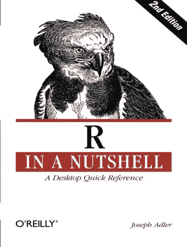

# R 的超快速成班（面向开发者）

> 原文：<https://machinelearningmastery.com/r-crash-course-for-developers/>

最后更新于 2020 年 8 月 15 日

作为一名开发人员，你可以超快地获得 R。

如果你已经是一名开发人员，你不需要对一门新语言有太多的了解，就能阅读和理解代码片段，并编写自己的小脚本和程序。

在这篇文章中，您将发现开始读写 R 脚本所需了解的基本语法、数据结构和控制结构。

**用我的新书[用 R](https://machinelearningmastery.com/machine-learning-with-r/) 启动你的项目**，包括*一步一步的教程*和所有例子的 *R 源代码*文件。

我们开始吧。


r 开发者速成班
图片由[hackNY.org](https://www.flickr.com/photos/hackny/10165019225)提供，保留部分权利。

## 语法不同，但相同

R 中的语法看起来很混乱，但仅仅是开始。

这是一种更古老的 LISP 风格的语言，灵感来自一种更古老的语言。赋值语法可能是你会看到的最奇怪的东西。赋值使用箭头 *(* *< -* *)* 而不是单个等号(=)。

r 拥有所有你熟悉的控制流结构，比如 if-else，for-loops 和 while 循环。

您可以为脚本创建自己的函数和助手函数库。

如果你以前做过任何脚本，比如 JavaScript、Python、Ruby、BASH 或类似的，那么你会很快学会 R。

## 你已经可以编程了，只需要学习 R 语法

作为开发人员，你已经知道如何编程了。

你可以解决一个问题，想出你需要的过程和数据结构的类型。你使用的语言只是一个细节。您只需要将您对解决方案的想法映射到您正在使用的语言的细节上。

这就是如何快速开始使用 R 的方法。

要开始，你需要知道绝对的基础知识。基础知识，例如:

*   我们如何将数据分配给变量？
*   我们如何处理不同的数据类型？
*   我们如何使用数据结构来处理数据？
*   我们如何使用标准的流量控制结构？
*   如何使用函数和第三方包？

您可以通过查看代码示例来了解这些问题的答案。然后，您可以:

*   将您正在阅读的第三方代码映射到这些示例上，以便更好地理解它们。
*   根据示例对您从零开始编写的代码进行模式化。

让我们快速浏览一下 R 的基本语法

## 开发者速成班(从这里开始)

在本节中，我们将快速了解 r 中使用的基本语法

在阅读完(并且理想情况下是通读)本节中的示例后，作为开发人员，您将有足够的背景来开始阅读和理解其他人的 R 代码。

你也会有信心开始写自己的小 R 脚本。

本节中的示例分为以下几个部分:

1.  分配
2.  数据结构
3.  流控制
4.  功能
5.  包装

启动 R 交互环境(在命令行上键入 R)，让我们开始吧。

### 1.分配

R 中赋值的关键是赋值的箭头运算符(

下面是分配一个整数、双准确率、字符串和一个布尔值，并依次打印到控制台的例子。

```py
> # integer
> i <- 23
> i
[1] 23

> # double
> d <- 2.3
> d
[1] 2.3

> # string
> s <- 'hello world'
> s
[1] "hello world"

> # boolean
> b <- TRUE
> b
[1] TRUE
```

记住，不要用等号(=)赋值。这是新 R 程序员犯的最大错误。

### 2.数据结构

有三种数据结构是你在 R 中最常用的:

1.  向量
2.  列表
3.  矩阵
4.  数据帧

#### 列表

列表提供了一组命名项，这与地图并无不同。

```py
# create a list of named items
a <- list(aa=1, bb=2, cc=3)
a
a$aa

# add a named item to a list
a$dd=4
a
```

您可以使用 list()函数定义一个新列表。列表可以用值初始化，也可以为空。请注意，可以使用美元运算符($)访问列表中的命名值。一旦被引用，它们就可以被读取或写入。这也是新项目可以添加到列表中的方式。

#### 向量

向量是相同或不同类型的数据列表:

```py
> # create a vector using the c() function
> v <- c(98, 99, 100)
> v
[1]  98  99 100
> v[1:2]
[1] 98 99

> # create a vector from a range of integers
> r <- (1:10)
> r
 [1]  1  2  3  4  5  6  7  8  9 10
> r[5:10]
[1]  5  6  7  8  9 10

> # add a new item to the end of a vector
> v <- c(1, 2, 3)
> v[4] <- 4
> v
[1] 1 2 3 4
```

请注意，向量是 1 索引(索引从 1 开始，而不是从 0 开始)。

您将经常使用 *c()* 函数将变量连接成一个向量。

#### 矩阵

矩阵是一个数据表。它有维度(行和列)，列可以命名。

```py
# Create a 2-row, 3-column matrix with named headings
> data <- c(1, 2, 3, 4, 5, 6)
> headings <- list(NULL, c("a","b","c"))
> m <- matrix(data, nrow=2, ncol=3, byrow=TRUE, dimnames=headings)
> m
     a b c
[1,] 1 2 3
[2,] 4 5 6

> m[1,]
a b c 
1 2 3 

> m[,1]
[1] 1 4
```

许多有用的绘图和机器学习算法要求数据以矩阵形式提供。

请注意索引矩阵的行[1]和列[1]的语法。

#### 数据帧

数据框对于在 r 中实际表示数据表非常有用

```py
# create a new data frame
years <- c(1980, 1985, 1990)
scores <- c(34, 44, 83)
df <- data.frame(years, scores)
df[,1]
df$years
```

矩阵是更简单的结构，用于数学运算。数据帧更适合于表示数据表，并且是机器学习算法在 r

请注意，您可以像对矩阵一样对数据框的行和列进行索引。还要注意，您可以使用列名引用列( *df$years* )

其他一些你可以继续学习的数据结构是列表和数组。

### 3.流控制

r 支持所有你已经习惯的流量控制结构。

1.  如果-那么-否则
2.  用于循环
3.  当循环

作为开发者，这些都是不言自明的。

#### 如果-那么-否则

```py
# if then else
a <- 66
if (a > 55) {
	print("a is more than 55")
} else {
	print("A is less than or equal to 55")
}

[1] "a is more than 55"
```

#### 用于循环

```py
# for loop
mylist <- c(55, 66, 77, 88, 99)
for (value in mylist) {
	print(value)
}

[1] 55
[1] 66
[1] 77
[1] 88
[1] 99
```

#### 当循环

```py
# while loop
a <- 100
while (a < 500) {
	a <- a + 100
}
a

[1] 500
```

### 4.功能

函数允许您对代码进行分组，并使用参数重复调用该代码。

关于功能的两个主要问题是:

1.  调用函数
2.  函数帮助
3.  编写自定义函数

#### 调用函数

您已经使用了一个函数，c()函数将对象连接成一个向量。

r 有很多内置功能，可以通过安装和加载第三方包来提供额外的功能。

下面是一个使用统计函数计算数字向量平均值的例子:

```py
# call function to calculate the mean on a vector of integers
numbers <- c(1, 2, 3, 4, 5, 6)
mean(numbers)

[1] 3.5
```

#### 函数帮助

您可以使用问号运算符(？)后跟函数名。

```py
# help with the mean() function
?mean
help(mean)
```

或者，您可以调用 *help()* 函数，并将需要帮助的函数名作为参数传递(例如 *help(mean)* )。

您可以通过调用 example()函数并将函数的名称作为参数传递来获取函数的用法示例。

```py
# example usage of the mean function
example(mean)
```

#### 自定义函数

您可以定义自己的函数，这些函数可以接受也可以不接受参数或返回结果。

下面是一个计算和返回三个数字之和的自定义函数示例:

```py
# define custom function
mysum <- function(a, b, c) {
	sum <- a + b + c
	return(sum)
}
# call custom function
mysum(1,2,3)

[1] 6
```

### 5.包装

包是第三方代码分发的方式。[综合 R 档案网](https://cran.r-project.org/) (CRAN)提供托管和列表的第三方 R 包，你可以下载。

#### 安装软件包

您可以通过调用一个函数来安装一个托管在 CRAN 上的包。然后，它会弹出一个对话框，询问您希望从哪个镜像下载软件包。

例如，下面是如何安装在机器学习中非常有用的 caret 包:

```py
# install the caret package
install.packages("caret")
# load the package
library(caret)
```

#### 软件包帮助

一个包可以提供很多新功能。你可以在一个包的 CRAN 页面上阅读它，但是你也可以使用库函数在 R 中获得这个包的帮助。

```py
# help for the caret package
library(help="caret")
```

## 需要记住的 5 件事

以下是开始使用 R 时需要记住的五个快速提示:

*   **分配**。r 使用箭头运算符(< -)，而不是一个等号(=)。
*   **区分大小写**。R 语言区分大小写，这意味着 C()和 C()是两个不同的函数调用。
*   **帮助**。您可以使用 help()函数或？运算符和使用双问号运算符(？？).
*   **如何退出**。可以通过调用 q()函数退出 R 交互环境。
*   **文件**。r 安装有很多有用的文档。您可以在浏览器中通过键入: *help.start()* 进行查看

## 拿一本参考书

网上有很多很好的资源可以学习更多关于如何使用 r。

我建议抓住一个好的参考文本，并把它放在附近。我用推荐 [R 简单说](https://amzn.to/2FrJ83J)。

[](https://amzn.to/2FrJ83J)

简而言之

## 摘要

在这篇文章中，你参加了一个基本的 R 语法速成班。

作为一名开发人员，你现在已经足够了解阅读其他人的 R 脚本了。

您还拥有在 R 交互环境中开始编写自己的小脚本的工具。

## 下一步

你看完所有的例子了吗？

1.  开头的人
2.  完成教程。
3.  让我知道你怎么样了(留下评论)

你有什么问题吗？你还想吃点什么吗？

留言告诉我。