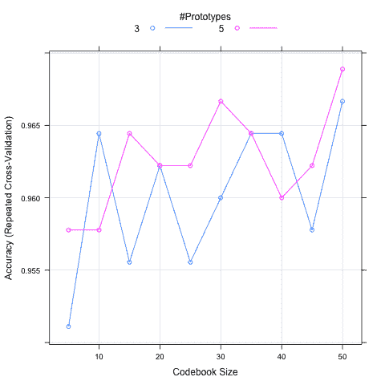

# 使用 Caret 包调整机器学习模型

> 原文：<https://machinelearningmastery.com/tuning-machine-learning-models-using-the-caret-r-package/>

最后更新于 2019 年 8 月 22 日

机器学习算法是参数化的，因此它们可以最好地适应给定的问题。一个困难是，为给定问题配置算法本身可能是一个项目。

就像为一个问题选择“最佳”算法一样，你不可能事先知道哪个算法参数最适合一个问题。最好的办法是用对照实验进行实证研究。

caret R 包旨在使寻找算法的最佳参数变得非常容易。它提供了搜索参数的网格搜索方法，并结合了各种方法来估计给定模型的表现。

在这篇文章中，你将发现 5 个方法，你可以用它来调整机器学习算法，使用 caret 包为你的问题找到最佳参数。

**用我的新书[用 R](https://machinelearningmastery.com/machine-learning-with-r/) 启动你的项目**，包括*一步一步的教程*和所有例子的 *R 源代码*文件。

我们开始吧。

## 模型调整

caret 包提供了一个网格搜索，您可以在其中指定参数来解决您的问题。它将尝试所有组合，并找到一个给出最佳结果的组合。

这篇文章中的例子将演示如何使用 Caret R 包来调整机器学习算法。

[学习矢量量化(LVQ)](https://machinelearningmastery.com/learning-vector-quantization-for-machine-learning/) 因其简单性将用于所有示例。它就像 k 近邻，只是样本数据库更小，并基于训练数据进行调整。它有两个要调整的参数，模型中被称为*大小*的实例数量(代码本)，以及进行预测时要检查的被称为 *k* 的实例数量。

每一个例子也将使用鸢尾花数据集，该类别数据集为三种鸢尾花及其花瓣和萼片提供了 150 个观察值，单位为厘米。

每个示例还假设我们对分类准确率感兴趣，因为我们正在优化度量，尽管这是可以改变的。此外，每个示例使用重复的 *n* 折叠交叉验证来估计给定模型(大小和 k 参数组合)的表现，重复 10 次和 3 次。如果你愿意，这也可以改变。

## 网格搜索:自动网格

在 Caret R 包中有两种方法来调整算法，第一种是允许系统自动进行。这可以通过设置 tuneLength 来完成，以指示每个算法参数要尝试的不同值的数量。

这仅支持整数和分类算法参数，并且它粗略地猜测要尝试什么值，但是它可以让您非常快地启动和运行。

下面的方法演示了 LVQ 的大小和 k 属性的自动网格搜索，每个(总共 25 个模型)有 5 个(*tunelement = 5*)值。

```py
# ensure results are repeatable
set.seed(7)
# load the library
library(caret)
# load the dataset
data(iris)
# prepare training scheme
control <- trainControl(method="repeatedcv", number=10, repeats=3)
# train the model
model <- train(Species~., data=iris, method="lvq", trControl=control, tuneLength=5)
# summarize the model
print(model)
```

模型使用的最终值是 size = 10 和 k = 1。

## 网格搜索:手动网格

搜索算法参数的第二种方法是手动指定优化网格。在网格中，每个算法参数可以被指定为可能值的向量。这些向量组合在一起，定义了所有可能尝试的组合。

下面的配方演示了手动调谐网格的搜索，其中大小参数有 4 个值，k 参数有 5 个值(20 种组合)。

```py
# ensure results are repeatable
set.seed(7)
# load the library
library(caret)
# load the dataset
data(iris)
# prepare training scheme
control <- trainControl(method="repeatedcv", number=10, repeats=3)
# design the parameter tuning grid
grid <- expand.grid(size=c(5,10,20,50), k=c(1,2,3,4,5))
# train the model
model <- train(Species~., data=iris, method="lvq", trControl=control, tuneGrid=grid)
# summarize the model
print(model)
```

模型使用的最终值是 size = 50 和 k = 5。

## 数据预处理

数据集可以作为参数调整的一部分进行预处理。重要的是在用于评估每个模型的样本中这样做，以确保结果考虑到测试中的所有可变性。如果数据集在调优过程之前被规范化或标准化，它将获得额外的知识(偏差)，而不会给出对未看到的数据的表现的准确估计。

虹膜数据集中的属性都是以相同的单位表示的，并且通常具有相同的比例，因此规范化和标准化并不是真正必要的。然而，下面的例子演示了调整 LVQ 的大小和 k 参数，同时使用*prepare = " scale "*归一化数据集。

```py
# ensure results are repeatable
set.seed(7)
# load the library
library(caret)
# load the dataset
data(iris)
# prepare training scheme
control <- trainControl(method="repeatedcv", number=10, repeats=3)
# train the model
model <- train(Species~., data=iris, method="lvq", preProcess="scale", trControl=control, tuneLength=5)
# summarize the model
print(model)
```

模型使用的最终值是 size = 8 和 k = 6。

## 并行处理

caret 包支持并行处理，以减少给定实验的计算时间。只要进行了配置，就会自动支持。在这个例子中，我们加载了 doMC 包，并将核心数设置为 4，这样在调优模型时就可以为 Caret 提供 4 个工作线程。这用于每个参数组合的重复交叉验证循环。

```py
# ensure results are repeatable
set.seed(7)
# configure multicore
library(doMC)
registerDoMC(cores=4)
# load the library
library(caret)
# load the dataset
data(iris)
# prepare training scheme
control <- trainControl(method="repeatedcv", number=10, repeats=3)
# train the model
model <- train(Species~., data=iris, method="lvq", trControl=control, tuneLength=5)
# summarize the model
print(model)
```

结果和第一个例子一样，只是完成得更快。

## 绩效可视化

绘制不同算法参数组合的表现图以寻找趋势和模型的灵敏度可能是有用的。Caret 支持直接绘制模型，这将比较不同算法组合的准确性。

在下面的配方中，定义了一个更大的算法参数手动网格，并绘制了结果。该图显示了 x 轴上的尺寸和 y 轴上的模型准确率。画了两条线，一条对应一个 k 值。该图显示了表现随大小增加的一般趋势，较大的 k 值可能是首选。

```py
# ensure results are repeatable
set.seed(7)
# load the library
library(caret)
# load the dataset
data(iris)
# prepare training scheme
control <- trainControl(method="repeatedcv", number=10, repeats=3)
# design the parameter tuning grid
grid <- expand.grid(size=c(5,10,15,20,25,30,35,40,45,50), k=c(3,5))
# train the model
model <- train(Species~., data=iris, method="lvq", trControl=control, tuneGrid=grid)
# summarize the model
print(model)
# plot the effect of parameters on accuracy
plot(model)
```

模型使用的最终值是 size = 35 和 k = 5。

[](https://machinelearningmastery.com/wp-content/uploads/2014/09/size-vs-k.png)

使用 Caret R 包的网格搜索
显示了 LVQ 的大小和 k 与模型准确率的关系

## 摘要

在这篇文章中，您发现了 caret R 包中通过使用网格搜索来调整算法参数的支持。

您已经看到了 5 个使用脱字号 R 包为 LVQ 算法调整大小和 k 参数的方法。

这篇文章中的每一个配方都是独立的，可以复制粘贴到你自己的项目中，并适应你的问题。