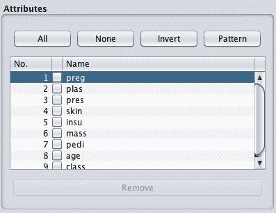
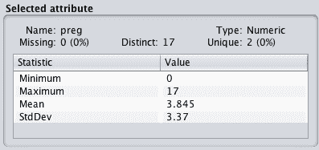
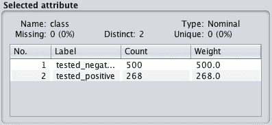
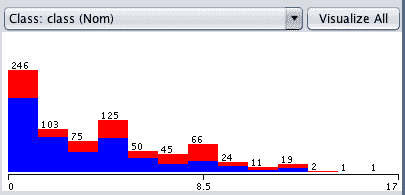
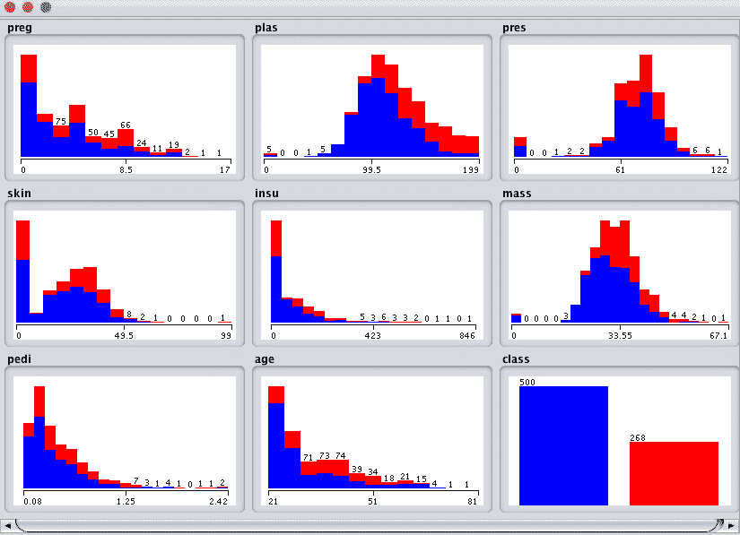
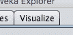
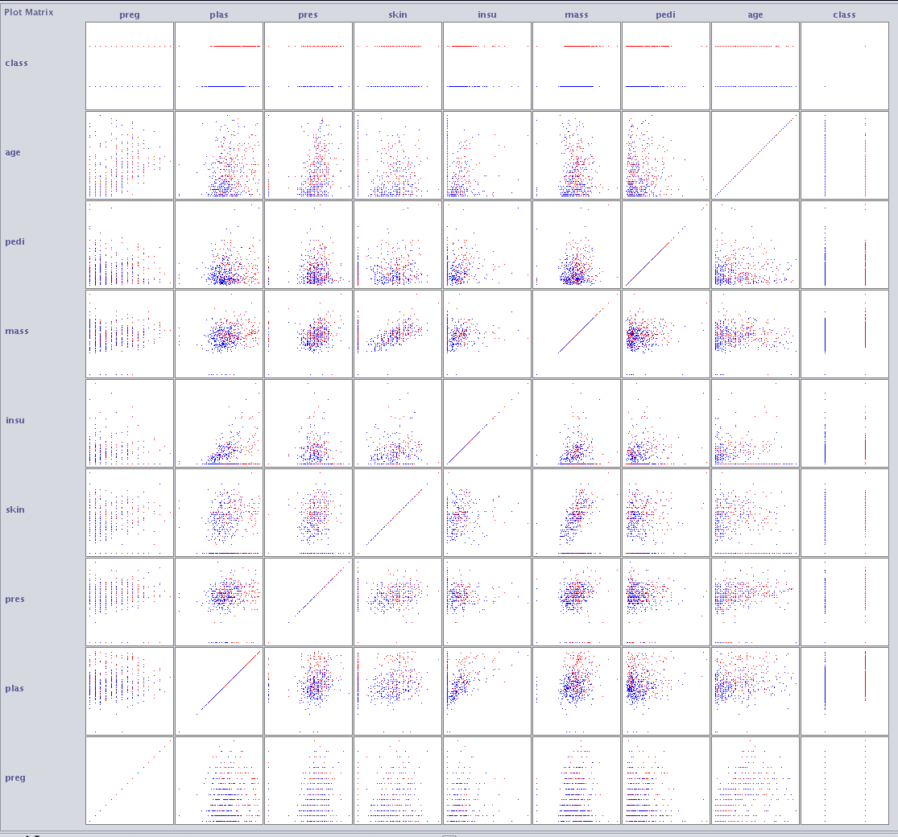
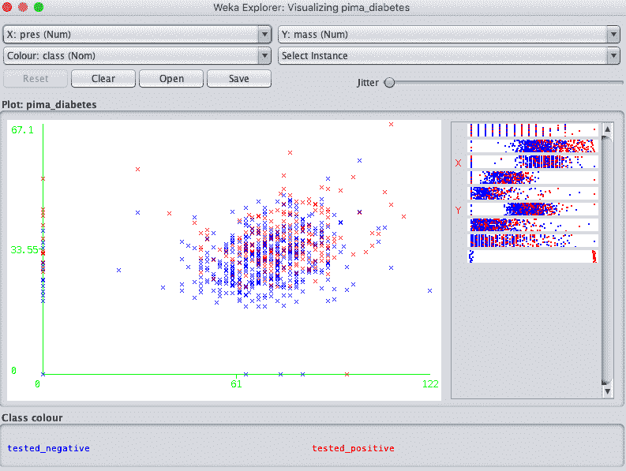
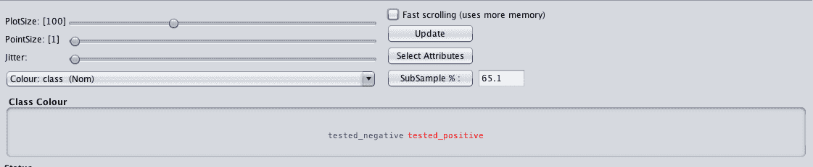
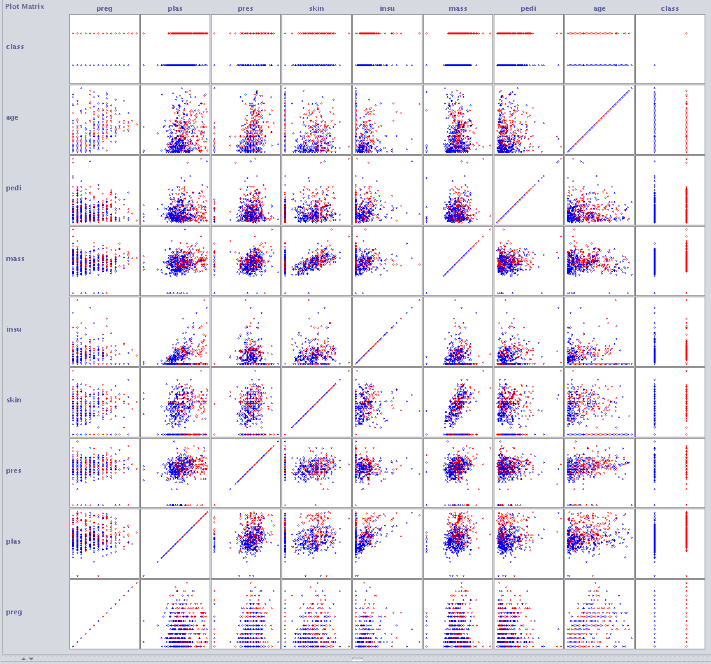

# 如何在 Weka 中更好地理解你的机器学习数据

> 原文：<https://machinelearningmastery.com/better-understand-machine-learning-data-weka/>

最后更新于 2019 年 8 月 22 日

当开始一个新的机器学习问题时，花时间了解你的数据是很重要的。

您可以查看一些关键的东西来快速了解更多关于数据集的信息，例如描述性统计和数据可视化。

在这篇文章中，你将发现如何在 Weka 机器学习工作台中了解更多关于你的数据。

看完这篇文章，你会知道:

*   回顾统计概要的属性分布。
*   回顾单变量图的属性分布。
*   从多元图看属性之间的关系。

**用我的新书[用 Weka](https://machinelearningmastery.com/machine-learning-mastery-weka/) 启动你的项目**，包括*的分步教程*和清晰的*截图*所有示例。

我们开始吧

## 使用描述性统计更好地理解您的数据

Weka 浏览器将自动计算数字属性的描述性统计。

1.  打开 Weka 图形用户界面选择器。
2.  点击“浏览器”打开 Weka 浏览器。
3.  从*数据/diabetes.arff* 加载皮马印第安人数据集

皮马印第安人数据集包含数字输入变量，我们可以使用这些变量来演示描述性统计的计算。

首先，请注意“当前关系”部分中的数据集摘要。此面板总结了有关已加载数据集的以下详细信息:

*   数据集名称(关系)。
*   行数(实例)。
*   列(属性)的数量。

数据集的 Weka 摘要

在“属性”面板中单击数据集中的第一个属性。

Weka 属性列表

请注意“选定属性”面板中的详细信息。它列出了关于所选属性的许多信息，例如:

*   属性的名称。
*   整个数据集中缺失值的数量和缺失值的比率。
*   不同值的数量。
*   数据类型。

Weka 属性摘要

下表列出了一些描述性统计数据及其值。为数字属性提供了一个有用的四位数摘要，包括:

*   最小值。
*   最大值。
*   平均值。
*   标准差。

你可以从这些信息中学到很多。例如:

*   缺失数据的存在和比率可以指示您是否需要移除或估计值。
*   平均值和标准偏差为您提供了每个属性的数据分布的量化概念。
*   不同值的数量可以让您了解属性分布的粒度。

单击类属性。此属性具有名义类型。查看“选定的属性面板”。

类属性的 Weka 摘要

我们现在可以看到，对于标称属性，我们获得了每个类别的列表以及属于每个类别的实例数。还有权重的问题，我们现在可以忽略。如果我们想要为数据集中的特定属性值或实例分配更多或更少的权重，则使用这种方法。

## 单变量属性分布

可以绘制每个属性的分布，以给出分布的直观定性理解。

当您在“预处理”选项卡中选择属性时，Weka 会自动提供这些图。

我们可以从上一节开始，我们已经加载了皮马印第安人数据集。

单击“属性面板”中的“预设”属性，并注意“选定属性”面板下方的图。您将看到 0 到 17 之间的 preg 值沿 x 轴的分布。y 轴显示每个 preg 值的计数或频率。

Weka 单变量属性分布

注意红色和蓝色分别指的是正类和负类。颜色会自动分配给每个分类值。如果类值有三个类别，我们会看到 preg 分布的细分是三种颜色，而不是两种颜色。

这有助于快速了解问题对于给定属性是否容易分离，例如，对于单个属性，所有的红色和蓝色都是完全分离的。单击属性列表中的每个属性并查看图，我们可以看到类之间并没有如此简单的分离。

通过单击单变量图上方的“全部可视化”按钮，我们可以快速获得数据集中所有属性的分布概况和按类别的分布细分。

Weka 所有单变量属性分布

看看这些图，我们可以看到一些关于这个数据集的有趣的事情。

*   看起来 plas、pres 和 mass 属性具有近似高斯分布。
*   它看起来像压力，皮肤，胰岛素和质量在 0 值看起来不合适。

看着这样的图，记下脑海中出现的东西，可以让你对可以应用的进一步数据准备操作有所了解(比如将 0 值标记为损坏)，甚至是可能有用的技术(比如假设输入变量为高斯分布的线性判别分析和逻辑回归)。

## 可视化属性交互

到目前为止，我们只关注了单个特征的属性，接下来我们将关注属性组合中的模式。

当属性是数字时，我们可以创建一个属性相对于另一个属性的散点图。这很有用，因为它可以突出显示属性之间关系的任何模式，例如正或负[相关性](https://machinelearningmastery.com/how-to-use-correlation-to-understand-the-relationship-between-variables/)。

我们可以为所有输入属性对创建散点图。这被称为散点图矩阵，在对数据建模之前对其进行审查，可以更好地了解可以研究的进一步预处理技术。

默认情况下，Weka 在“可视化”选项卡中提供散点图矩阵供查看。

Weka 可视化选项卡

继续上一节，加载 Pima Indians 数据集，单击“可视化”选项卡，并使窗口足够大，以查看所有单个散点图。

Weka 散点图矩阵

您可以看到所有属性的组合都是以系统的方式绘制的。您还可以看到每个图出现两次，第一次出现在左上方的三角形中，第二次出现在右下方的三角形中，轴翻转。您还可以看到从左下角开始，一直到右上角的一系列绘图，其中每个属性都是相对于自身绘制的。这些都可以忽略。

最后，请注意散点图中的点是根据它们的类值着色的。在点中寻找趋势或图案是很好的，例如颜色的清晰分离。

点击一个情节会给你一个新的窗口，你可以进一步玩这个情节。

Weka 个人散点图

请注意屏幕底部的控件。它们可以让你增加图的大小，增加点的大小和增加抖动。

关于抖动的最后一点是有用的，当你有很多点相互重叠，很难看到发生了什么。抖动会给图中的数据添加一些随机噪声，将点分散一点，并帮助您了解发生了什么。

当您对这些控件进行更改时，单击“更新”按钮应用更改。

散点图矩阵的 Weka 控制

例如，下面是相同的图，具有更大的点尺寸，使得更容易看到数据中的任何趋势。

Weka 改进的散点图矩阵

## 摘要

在这篇文章中，您发现了如何通过查看描述性统计数据和数据可视化来了解更多关于机器学习数据的信息。

具体来说，您了解到:

*   Weka 会自动计算每个属性的描述性统计数据。
*   Weka 可以让你轻松查看每个属性的分布。
*   Weka 提供了散点图可视化来查看属性之间的成对关系。

关于 Weka 中的描述性统计和数据可视化，或者这个帖子，你有什么问题吗？在下面的评论中提出你的问题，我会尽力回答。