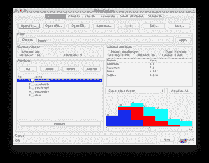

# 我开始机器学习时犯的最大错误，以及如何避免

> 原文：<https://machinelearningmastery.com/biggest-mistake-i-made-when-starting-machine-learning-and-how-to-avoid-it/>

最后更新于 2019 年 8 月 22 日

当我第一次开始机器学习时，我用手实现了算法。进展非常缓慢。

我当时是个糟糕的程序员。我试图从书中找出算法，如何在问题中使用它们，以及如何编写代码——所有这些都是同时进行的。这是我入门时犯的最大的错误。它让一切变得困难 3 倍，扼杀了我的动力。

我的一个朋友建议我去看看 Weka。我反抗了。我是一名学生和 C 程序员，我不想进入 Java。

后来，我在研究决策树算法，我了解到 Weka 有一个 C4.5 的实现(一个非常强大的方法)。

我下载了 Weka，发现除了 Java API 之外，Weka 还有一个完全交互式的图形界面，用于加载数据、运行算法和查看结果。基本上，所有我试图弄清楚如何做和实现自己的事情，但是在一个图形用户界面中。

**用我的新书[用 Weka](https://machinelearningmastery.com/machine-learning-mastery-weka/) 启动你的项目**，包括*的分步教程*和清晰的*截图*所有示例。

加载虹膜数据集的 Weka 浏览器界面

我被迷住了。我开始把它用于课堂作业和我自己的实验。后来在研究生院，我开始了自己的研究，为 Weka ( [LVQ 算法和其他](http://wekaclassalgos.sourceforge.net/))编写第三方插件。

我现在向刚刚入门的程序员推荐它，因为它可以很快在数据集上获得有意义的结果。它还灌输了最佳实践，如用于比较结果的可重复实验和统计方法。

如果你还没有，看看[Weka](https://machinelearningmastery.com/what-is-the-weka-machine-learning-workbench/ "What is the Weka Machine Learning Workbench")。

我有一个简短的教程，在其中你[发现如何在 5 分钟内运行一个分类器](https://machinelearningmastery.com/how-to-run-your-first-classifier-in-weka/ "How to Run Your First Classifier in Weka")。

祝机器学习好运！