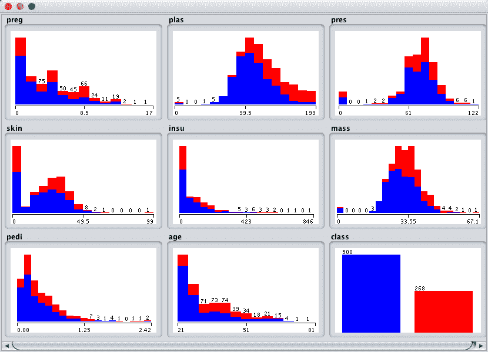
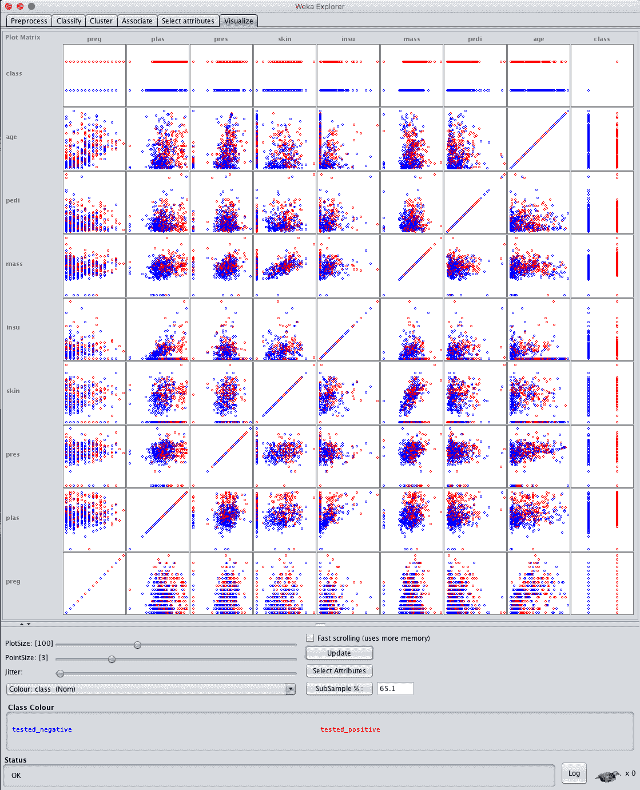
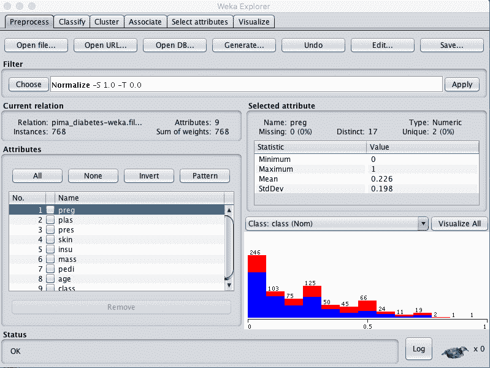
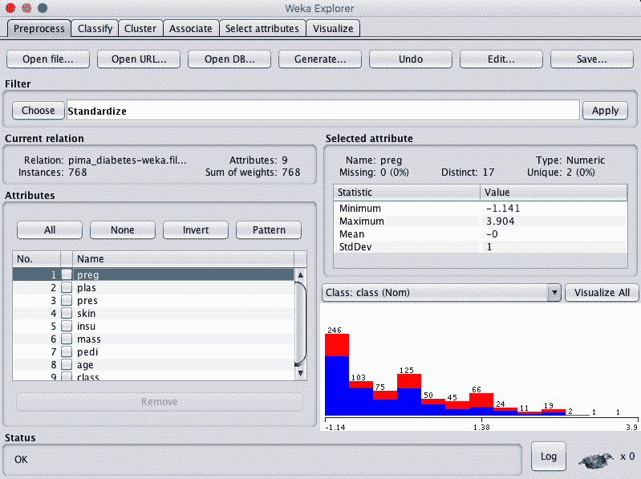
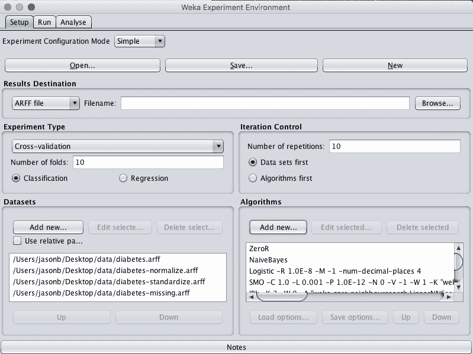
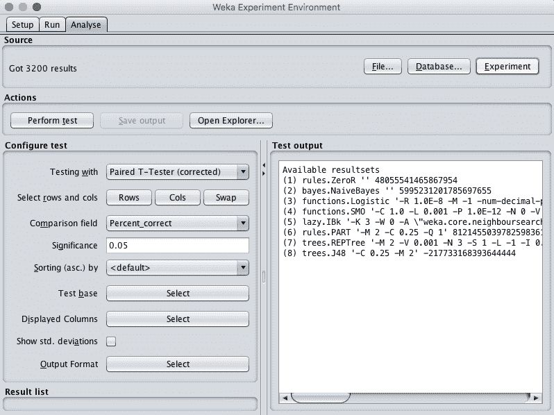

# 如何在 Weka 中逐步完成二分类项目

> 原文：<https://machinelearningmastery.com/binary-classification-tutorial-weka/>

最后更新于 2019 年 12 月 11 日

擅长应用机器学习的最快方法是在端到端项目上练习。

在这篇文章中，你将发现如何在 Weka 中端到端地解决二分类问题。看完这篇文章你会知道:

*   如何加载数据集并分析加载的数据？
*   如何创建多个不同的数据转换视图，并对每个视图评估一套算法。
*   如何最终确定并呈现模型的结果，以便对新数据进行预测。

**用我的新书[用 Weka](https://machinelearningmastery.com/machine-learning-mastery-weka/) 启动你的项目**，包括*的分步教程*和清晰的*截图*所有示例。

我们开始吧。


Weka 分步二进制分类教程
图片由[安妮塔·里特尔](https://www.flickr.com/photos/puliarfanita/5085710794/)提供，保留部分权利。

## 教程概述

本教程将指导您完成机器学习项目所需的关键步骤。

我们将通过以下流程开展工作:

1.  加载数据集。
2.  分析数据集。
3.  准备数据集的视图。
4.  评估计法。
5.  最终确定模型并展示结果。

## 1.加载数据集

本教程中使用的问题是皮马印第安人糖尿病发病数据集。

在这个数据集中，每个实例代表一个患者的医疗细节，任务是预测该患者是否会在未来五年内出现糖尿病。有 8 个数值输入变量，它们都有不同的标度。

*   [数据集文件](https://raw.githubusercontent.com/jbrownlee/Datasets/master/pima-indians-diabetes.csv)。
*   [数据集详细信息](https://raw.githubusercontent.com/jbrownlee/Datasets/master/pima-indians-diabetes.names)。

最高结果在 77%准确率的[级。](http://www.is.umk.pl/projects/datasets.html#Diabetes)

1.打开 Weka 图形用户界面选择器。

2.单击“浏览器”按钮打开 Weka 浏览器。

3.点击“打开文件…”按钮，导航至*数据/* 目录，选择*糖尿病患者*。单击“打开”按钮。

数据集现在被加载到 Weka 中。


Weka 负荷皮马印度人糖尿病发病数据集

## 2.分析数据集

在开始建模之前，查看您的数据非常重要。

回顾每个属性的分布和属性之间的交互可能会对我们可以使用的特定数据转换和特定建模技术有所启发。

### 汇总统计

在“当前关系”窗格中查看数据集的详细信息。我们可以注意到一些事情:

*   数据集的名称为 pima_diabetes。
*   数据集中有 768 个实例。如果我们使用 10 倍交叉验证来评估模型，那么每一倍将有大约 76 个实例，这很好。
*   共有 9 个属性，8 个输入和一个输出属性。

单击“属性”窗格中的每个属性，并查看“选定属性”窗格中的汇总统计信息。

我们可以注意到一些关于数据的事实:

*   输入属性都是数字，并且具有不同的比例。我们可能会从数据的规范化或标准化中看到一些好处。
*   没有标记缺失的值。
*   有些属性的值似乎不太合理，特别是:plas、pres、skin、insu 和 mass 的值为 0。这些可能是可以标记的缺失数据。
*   类属性是名义的，有两个输出值，这意味着这是一个两类或二进制分类问题。
*   阶级属性是不平衡的，1 个“积极”结局到 1.8 个“消极”结局，几乎是消极病例数的两倍。我们可以从平衡阶级价值观中受益。

### 属性分布

单击“全部可视化”按钮，查看每个属性的图形分布。



Weka·皮马印第安人单变量属性分布

我们可以注意到一些关于数据形状的事情:

*   一些属性具有类似高斯的分布，如 plas、pres、皮肤和质量，这表明做出这种假设的方法可以获得良好的结果，如逻辑回归和朴素贝叶斯。
*   我们看到属性值中的类之间有很多重叠。这些类似乎不容易分开。
*   我们可以清楚地看到阶级不平衡的图形描绘。

### 属性交互

单击“可视化”选项卡，让我们查看属性之间的一些交互。

1.  增加窗口大小，以便所有图都可见。
2.  将“点大小”增加到 3，使点更容易看到。
3.  单击“更新”按钮应用更改。



Weka·皮马印第安人散点图矩阵

纵观输入变量的图表，我们通常可以看到散点图上的类之间的不良分离。这个数据集不是在公园散步。

这表明我们可以从一些好的数据转换和创建数据集的多个视图中受益。这也表明我们可以从使用集合方法中获益。

## 3.准备数据集视图

我们在上一节中指出，这可能是一个困难的问题，我们可能会从数据的多个视图中受益。

在本节中，我们将创建数据的各种视图，这样当我们在下一节中评估计法时，我们就可以了解通常更善于将分类问题的结构暴露给模型的视图。

我们将创建 3 个额外的数据视图，这样除了原始数据之外，我们总共将有 4 个不同的数据集副本。我们将从原始数据集创建数据集的每个视图，并将其保存到一个新文件中，供以后在实验中使用。

### 标准化视图

我们将创建的第一个视图是将所有输入属性规范化为 0 到 1 的范围。这可能有利于多种算法，这些算法会受到属性规模的影响，比如回归和基于实例的方法。

1.  在浏览器中加载了*数据/diabetes.arff* 文件。
2.  点按“过滤器”面板中的“选择”按钮，然后选择“无监督.属性.规范化”过滤器。
3.  单击“应用”按钮应用过滤器。
4.  单击“属性”窗格中的每个属性，并查看“选定属性”窗格中的最小值和最大值，以确认它们是 0 和 1。
5.  单击“保存...”按钮，导航到合适的目录，并为此转换后的数据集键入合适的名称，例如“diabetes-normalize.arff”。
6.  关闭资源管理器界面，以避免污染我们要创建的其他视图。



Weka 标准化皮马印第安数据集

### 标准化视图

我们在前一节中注意到，一些属性具有类似高斯的分布。我们可以重新缩放数据，并通过使用标准化过滤器将这种分布考虑在内。

这将创建一个数据集副本，其中每个属性的平均值为 0，标准差(平均方差)为 1。这可能有利于下一节中假设输入属性为高斯分布的算法，如逻辑回归和朴素贝叶斯。

1.  打开 Weka 浏览器。
2.  加载皮马印第安人糖尿病发病数据集。
3.  点按“过滤器”面板中的“选择”按钮，然后选择“无监督.属性.标准化”过滤器。
4.  单击“应用”按钮应用过滤器。
5.  单击“属性”窗格中的每个属性，并查看“选定属性”窗格中的平均值和标准偏差值，以确认它们分别为 0 和 1。
6.  单击“保存...”按钮，导航到合适的目录，并为此转换后的数据集键入合适的名称，如“*糖尿病-标准化. arff* ”。
7.  关闭浏览器界面。



Weka 标准化皮马印第安人数据集

### 缺失数据

在前面的部分中，我们怀疑一些属性有标记为 0 值的错误或缺失数据。

我们可以创建数据集的新副本，标记缺失的数据，然后用每个属性的平均值进行估计。这可能有助于假设属性分布平稳变化的方法，如逻辑回归和基于实例的方法。

首先，让我们将一些属性的 0 值标记为缺失。

1.  打开 Weka 浏览器。
2.  加载皮马印第安人糖尿病发病数据集。
3.  单击过滤器的“选择”按钮，选择非监督属性数字过滤器。
4.  单击过滤器进行配置。
5.  将属性索引设置为 2-6
6.  将 minThreshold 设置为 0.1E-8(接近零)，这是每个属性允许的最小值。
7.  将 minDefault 设置为 NaN，它是未知的，将替换阈值以下的值。
8.  单击过滤器配置上的“确定”按钮。
9.  单击“应用”按钮应用过滤器。
10.  单击“属性”窗格中的每个属性，查看每个属性缺少的值的数量。您应该会看到属性 2 到 6 的非零计数。


皮马印第安人数据集的 Weka 数字清洁器数据过滤器

现在，让我们把缺失的值作为平均值。

1.  单击“过滤器”窗格中的“选择”按钮，并选择“无监督的. attribute . replacementsingvalues”过滤器。
2.  单击“应用”按钮将过滤器应用到数据集。
3.  单击“属性”窗格中的每个属性，查看每个属性缺少的值的数量。您应该看到所有属性都应该没有缺失值，并且属性 2 到 6 的分布应该略有变化。
4.  单击“保存...”按钮，导航到合适的目录，并为此转换后的数据集键入合适的名称，例如“diabetes-missing.arff”。
5.  关闭 Weka 浏览器。

您可能要考虑调查的其他数据视图是通过要素选择方法选择的要素子集，以及重新平衡类属性的视图。

## 4.评估计法

让我们设计一个实验，根据我们创建的问题的不同观点来评估一套标准的分类算法。

1.单击 Weka 图形用户界面选择器上的“实验者”按钮，启动 Weka 实验环境。

2.点击“新建”开始新的实验。

3.在“数据集”窗格中，单击“添加新的…”并选择以下 4 个数据集:

*   data/diabetes.arff(原始数据集)
*   糖尿病-正常化
*   糖尿病-标准化。arff
*   糖尿病-失踪

4.在“算法”窗格中，单击“添加新的…”并添加以下 8 种多类分类算法:

*   规则。零
*   贝叶斯。天真的贝叶斯
*   功能。物流的
*   功能。高年资军医(senior medical officer)
*   放松，IBk
*   规则。部分
*   树木。REPTree
*   树木。J48

5.在算法列表中选择 IBK，然后单击“编辑所选...”按钮。

6.将“KNN”从“1”更改为“3”，然后单击“确定”按钮保存设置。



皮马印第安人数据集的 Weka 算法比较实验

7.点击“运行”打开“运行”标签，点击“开始”按钮运行实验。实验应该在几秒钟内完成。

8.点击“分析”打开“分析”标签。单击“实验”按钮加载实验结果。



皮马印第安人数据集 Weka 负载算法对比实验结果

9.单击“执行测试”按钮来执行成对测试-将所有结果与 ZeroR 的结果进行比较的测试。

```py
Tester:     weka.experiment.PairedCorrectedTTester -G 4,5,6 -D 1 -R 2 -S 0.05 -result-matrix "weka.experiment.ResultMatrixPlainText -mean-prec 2 -stddev-prec 2 -col-name-width 0 -row-name-width 25 -mean-width 0 -stddev-width 0 -sig-width 0 -count-width 5 -print-col-names -print-row-names -enum-col-names"
Analysing:  Percent_correct
Datasets:   4
Resultsets: 8
Confidence: 0.05 (two tailed)
Sorted by:  -
Date:       10/06/16 9:37 AM

Dataset                   (1) rules.Ze | (2) bayes (3) funct (4) funct (5) lazy. (6) rules (7) trees (8) trees
--------------------------------------------------------------------------------------------------------------
pima_diabetes            (100)   65.11 |   75.75 v   77.47 v   76.80 v   73.86 v   73.45 v   74.46 v   74.49 v
pima_diabetes-weka.filter(100)   65.11 |   75.77 v   77.47 v   76.80 v   73.86 v   73.45 v   74.42 v   74.49 v
pima_diabetes-weka.filter(100)   65.11 |   75.65 v   77.47 v   76.81 v   73.86 v   73.45 v   74.39 v   74.49 v
pima_diabetes-weka.filter(100)   65.11 |   74.81 v   76.86 v   76.30 v   73.54 v   73.03 v   73.70 v   74.69 v
--------------------------------------------------------------------------------------------------------------
                               (v/ /*) |   (4/0/0)   (4/0/0)   (4/0/0)   (4/0/0)   (4/0/0)   (4/0/0)   (4/0/0)

Key:
(1) rules.ZeroR '' 48055541465867954
(2) bayes.NaiveBayes '' 5995231201785697655
(3) functions.Logistic '-R 1.0E-8 -M -1 -num-decimal-places 4' 3932117032546553727
(4) functions.SMO '-C 1.0 -L 0.001 -P 1.0E-12 -N 0 -V -1 -W 1 -K \"functions.supportVector.PolyKernel -E 1.0 -C 250007\" -calibrator \"functions.Logistic -R 1.0E-8 -M -1 -num-decimal-places 4\"' -6585883636378691736
(5) lazy.IBk '-K 3 -W 0 -A \"weka.core.neighboursearch.LinearNNSearch -A \\\"weka.core.EuclideanDistance -R first-last\\\"\"' -3080186098777067172
(6) rules.PART '-M 2 -C 0.25 -Q 1' 8121455039782598361
(7) trees.REPTree '-M 2 -V 0.001 -N 3 -S 1 -L -1 -I 0.0' -9216785998198681299
(8) trees.J48 '-C 0.25 -M 2' -217733168393644444
```

我们可以看到，与 ZeroR 相比，所有的算法在数据集的所有视图上都很熟练。我们还可以看到，我们的技能基线是 65.11%的准确率。

只看原始分类准确率，我们可以看到数据集视图中缺失的估计值似乎导致了模型准确率的降低。与原始结果相比，标准化和规范化结果之间除了几个百分点的分数之外，似乎没有什么区别。这表明我们可能会坚持使用原始数据集。

最后，看起来逻辑回归可能比其他算法获得了更高的准确率结果，让我们检查一下差异是否显著。

10.单击“测试基础”的“选择”按钮，然后选择“功能”。后勤”。单击“执行测试”按钮重新运行分析。

```py
Tester:     weka.experiment.PairedCorrectedTTester -G 4,5,6 -D 1 -R 2 -S 0.05 -result-matrix "weka.experiment.ResultMatrixPlainText -mean-prec 2 -stddev-prec 2 -col-name-width 0 -row-name-width 25 -mean-width 2 -stddev-width 2 -sig-width 1 -count-width 5 -print-col-names -print-row-names -enum-col-names"
Analysing:  Percent_correct
Datasets:   4
Resultsets: 8
Confidence: 0.05 (two tailed)
Sorted by:  -
Date:       10/06/16 9:45 AM

Dataset                   (3) function | (1) rules (2) bayes (4) funct (5) lazy. (6) rules (7) trees (8) trees
--------------------------------------------------------------------------------------------------------------
pima_diabetes            (100)   77.47 |   65.11 *   75.75     76.80     73.86 *   73.45 *   74.46 *   74.49
pima_diabetes-weka.filter(100)   77.47 |   65.11 *   75.77     76.80     73.86 *   73.45 *   74.42 *   74.49
pima_diabetes-weka.filter(100)   77.47 |   65.11 *   75.65     76.81     73.86 *   73.45 *   74.39 *   74.49
pima_diabetes-weka.filter(100)   76.86 |   65.11 *   74.81     76.30     73.54 *   73.03 *   73.70 *   74.69
--------------------------------------------------------------------------------------------------------------
                               (v/ /*) |   (0/0/4)   (0/4/0)   (0/4/0)   (0/0/4)   (0/0/4)   (0/0/4)   (0/4/0)

Key:
(1) rules.ZeroR '' 48055541465867954
(2) bayes.NaiveBayes '' 5995231201785697655
(3) functions.Logistic '-R 1.0E-8 -M -1 -num-decimal-places 4' 3932117032546553727
(4) functions.SMO '-C 1.0 -L 0.001 -P 1.0E-12 -N 0 -V -1 -W 1 -K \"functions.supportVector.PolyKernel -E 1.0 -C 250007\" -calibrator \"functions.Logistic -R 1.0E-8 -M -1 -num-decimal-places 4\"' -6585883636378691736
(5) lazy.IBk '-K 3 -W 0 -A \"weka.core.neighboursearch.LinearNNSearch -A \\\"weka.core.EuclideanDistance -R first-last\\\"\"' -3080186098777067172
(6) rules.PART '-M 2 -C 0.25 -Q 1' 8121455039782598361
(7) trees.REPTree '-M 2 -V 0.001 -N 3 -S 1 -L -1 -I 0.0' -9216785998198681299
(8) trees.J48 '-C 0.25 -M 2' -217733168393644444
```

看起来逻辑回归的结果确实比其他一些结果更好，比如 IBk、PART、REPTree 和 ZeroR，但在统计上与朴素贝叶斯、SMO 或 J48 没有显著差异。

11.选中“显示标准”。偏差”来表示标准偏差。

12.单击“显示的列”的“选择”按钮，然后选择“功能”。物流”，点击“选择”接受选择。这将只显示逻辑回归算法的结果。

13.单击“执行测试”重新运行分析。

我们现在有了一个可以用来描述我们模型的最终结果。

```py
Tester:     weka.experiment.PairedCorrectedTTester -G 4,5,6 -D 1 -R 2 -S 0.05 -V -result-matrix "weka.experiment.ResultMatrixPlainText -mean-prec 2 -stddev-prec 2 -col-name-width 0 -row-name-width 25 -mean-width 2 -stddev-width 2 -sig-width 1 -count-width 5 -show-stddev -print-col-names -print-row-names -enum-col-names"
Analysing:  Percent_correct
Datasets:   4
Resultsets: 8
Confidence: 0.05 (two tailed)
Sorted by:  -
Date:       10/06/16 9:48 AM

Dataset                   (3) functions.Logist
----------------------------------------------
pima_diabetes            (100)   77.47(4.39) |
pima_diabetes-weka.filter(100)   77.47(4.39) |
pima_diabetes-weka.filter(100)   77.47(4.39) |
pima_diabetes-weka.filter(100)   76.86(4.90) |
----------------------------------------------
(v/ /*) |

Key:
(3) functions.Logistic '-R 1.0E-8 -M -1 -num-decimal-places 4' 3932117032546553727
```

我们可以看到，该模型对未知数据的估计准确率为 77.47%，标准差为 4.39%。

14.关闭 Weka 实验环境。

## 5.最终确定模型并展示结果

我们可以根据所有训练数据创建模型的最终版本，并将其保存到文件中。

1.  打开 Weka 浏览器，加载*数据/diabetes.arff* 数据集。
2.  点击分类。
3.  选择功能。逻辑算法。
4.  将“测试选项”从“交叉验证”更改为“使用训练集”。
5.  单击“开始”按钮创建最终模型。
6.  右键单击“结果列表”中的结果项，然后选择“保存模型”。选择一个合适的位置并输入一个合适的名称，例如您的模型的“糖尿病-后勤”。

该模型可以在以后加载，并用于对新数据进行预测。

我们可以使用上一节中收集的模型准确率的平均值和标准偏差来帮助量化模型在未知数据上的估计准确率的预期可变性。

我们一般可以预计，模型在看不见的数据上的表现将为 77.47%±2 * 4.39%或 8.78%。我们可以重申这一点，准确率在 68.96%到 86.25%之间。

关于模型准确性的这一最终陈述令人惊讶的是，在低端，该模型仅比零利率模型好一点，零利率模型通过预测所有预测的负面结果达到了 65.11%的准确性。

## 摘要

在这篇文章中，您使用 Weka 机器学习工作台端到端地完成了一个二进制分类机器学习项目。

具体来说，您了解到:

*   如何分析数据集，并建议可能有用的特定数据转换和建模技术。
*   如何设计和保存数据的多个视图，并在这些视图上抽查多种算法。
*   如何最终确定模型，以便对新数据进行预测，并根据看不见的数据显示模型的估计准确率。

你对在 Weka 运行机器学习项目或这篇文章有什么问题吗？在评论中提出你的问题，我会尽力回答。