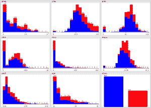
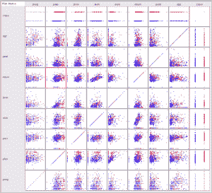

# 案例研究：预测五年内糖尿病的发作（第 1 部分，共 3 部分）

> 原文：<https://machinelearningmastery.com/case-study-predicting-the-onset-of-diabetes-within-five-years-part-1-of-3/>

最后更新于 2019 年 8 月 22 日

这是我一直在辅导的聪明的年轻学生伊戈尔·什瓦尔策尔的客座博文。

这篇文章是关于著名的皮马印第安人糖尿病数据集建模的 3 部分系列文章的第 1 部分，将介绍问题和数据。第 2 部分将研究特征选择和抽查算法，本系列的第 3 部分将研究分类准确率的改进和结果的最终呈现。

**用我的新书[用 Weka](https://machinelearningmastery.com/machine-learning-mastery-weka/) 启动你的项目**，包括*的分步教程*和清晰的*截图*所有示例。

## 预测糖尿病的发作

数据挖掘和机器学习正在帮助医学专业人员通过弥合巨大数据集和人类知识之间的差距来简化诊断。我们可以开始应用机器学习技术在描述糖尿病高发病风险人群的数据集中进行分类。

[糖尿病](https://en.wikipedia.org/wiki/Diabetes_mellitus)影响全球 3.82 亿人，每个国家的 2 型糖尿病患者人数都在增加。未经治疗，糖尿病会引起许多并发症。

糖尿病测试
图片由[维克托](https://www.flickr.com/photos/v1ctor/10871254373/)提供，版权所有。

这项研究的人群是亚利桑那州凤凰城附近的皮马印第安人。由于糖尿病发病率高，自 1965 年以来，该人群一直在接受[国家糖尿病和消化及肾脏疾病研究所](http://www.niddk.nih.gov/Pages/default.aspx)的持续研究。

就本数据集而言，糖尿病是根据[世界卫生组织](http://www.who.int/diabetes/publications/en/)标准诊断的，该标准规定，如果在任何调查检查中，2 小时负荷后葡萄糖至少为 200 毫克/分升，或者如果为社区服务的印度卫生服务医院在常规医疗护理过程中发现葡萄糖浓度至少为 200 毫克/分升。

鉴于我们可以收集到的关于人的医学数据，我们应该能够更好地预测一个人患糖尿病的可能性，并因此采取适当的行动来提供帮助。我们可以开始分析数据和实验算法，这将有助于我们研究皮马印第安人糖尿病的发病情况。

## 相关著作

我们的研究从深入研究使用相同数据集的研究人员如何处理相同的问题开始。这帮助我了解了数据，为我的研究铺平了道路，特别是因为作者提出了值得研究的替代方法。

1988 年，史密斯、埃弗哈特、迪克森、诺勒和约翰尼斯对使用早期神经网络模型 ADAP 来预测皮马印第安人高风险人群中糖尿病的发病进行了评估。他们认为，当“*样本量小，潜在功能关系的形式未知，并且潜在功能关系涉及多个变量*之间复杂的相互作用和相互关联时，神经网络方法将提供强有力的结果，参见[使用 ADAP 学习算法预测糖尿病的发作](https://scholar.google.com/scholar?hl=en&q=Using+the+ADAP+Learning+Algorithm+to+Forecast+the+Onset+of+Diabetes+Mellitus)。

他们将 ADAP 描述为“一个自适应学习例程，它生成并执行类似感知机的设备的数字模拟(T1)”，参见控制和模式识别系统中的学习(T2)。该算法将根据输入变量的函数进行预测，如果预测不正确，将进行内部调整。网络分为 3 个主要层:

1.  **输入，分为“传感器”**:代表离散值。这些被组织成分区，并由输入“激发”。
2.  **关联单位**:使用阈值函数激活特定的应答者值。连接到基于所述功能而改变的可调权重。
3.  **应答器**:应答器值相加，构成具体的预测。

该网络定义了一个“固定矩阵”，其中包含每个属性的分区、一系列可能的值，以及通过“变量数组”识别数据中的连接的能力矩阵中的行对应于传感器，而列对应于关联单元。变量数组提供了一种容易识别传感器和关联单元之间的连接的方法。

## 768 名皮马印第安人女性

我们可以从 [UCI 机器学习知识库](https://archive.ics.uci.edu/ml/datasets/Pima+Indians+Diabetes)上找到的数据中了解到，该知识库包含了皮马印第安人遗产中至少 21 岁女性患者的数据(更新:[从这里下载](https://raw.githubusercontent.com/jbrownlee/Datasets/master/pima-indians-diabetes.data.csv))。

我们有 768 个实例和以下 8 个属性:

*   怀孕次数
*   口服葡萄糖耐量试验(plas)中 2 小时的血浆葡萄糖浓度
*   舒张压(毫米汞柱)
*   三头肌皮肤褶皱厚度，单位为毫米(皮肤)
*   2 小时血清胰岛素(单位:微克/毫升)
*   体重指数以千克为单位(m)^2 的身高(质量))
*   糖尿病谱系功能
*   年龄(年龄)

研究中使用的一个特别有趣的属性是糖尿病谱系功能。它提供了一些关于亲属中糖尿病史以及这些亲属与患者的遗传关系的数据。这种对遗传影响的测量让我们了解了糖尿病发病时可能存在的遗传风险。根据前面部分的观察，尚不清楚这一功能对糖尿病发病的预测有多好。

## 数据观察

首先，我检查了每个属性，并回顾了 Weka Explorer 准备的分布参数。我注意到:

*   孕龄和年龄属性是整数。
*   人口普遍年轻，不到 50 岁。
*   存在零值的一些属性似乎是数据中的错误(例如 plas、pres、skin、insu 和 mass)。

在检查类值的分布时，我注意到有 500 个负实例(65.1%)和 258 个正实例(34.9%)。

显示类别分布的属性直方图，截图来自 Weka

查看数据集中所有属性的直方图表明:

*   一些属性看起来呈正态分布(plas、pres、skin 和 mass)。
*   有些属性看起来可能呈指数分布(孕、因苏、足浴、年龄)。
*   年龄可能应该有一个正态分布，对数据收集的约束可能已经偏斜了分布。
*   对正态性的测试(正态图)可能是有意义的。我们可以考虑将数据拟合成正态分布。

查看数据集中所有属性的散点图显示:

*   年龄与糖尿病发病无明显关系。
*   pedi 功能与糖尿病发病无明显关系。
*   这可能表明糖尿病不是遗传的，或者糖尿病谱系功能需要发挥作用。
*   较大的 plas 值与较大的年龄、pedi、体重、胰岛素、皮肤、压力和妊娠值相结合，倾向于显示糖尿病检测阳性的可能性较大。

糖尿病数据散点图，截图来自 Weka

重要的是要考虑数据的所有可能限制，可能包括以下内容:

*   结果可能仅限于皮马印第安人，但给我们提供了一个如何开始诊断其他糖尿病人群的良好开端。
*   结果可能受限于收集数据的时间(60 年代至 80 年代)。今天诊断糖尿病的医疗程序包括尿检和血红蛋白 A1c 检测，它显示了过去 3 个月的平均血糖水平。
*   数据集相当小，这可能会限制某些算法的表现。

伊戈尔·施瓦辛格

## 关于伊戈尔·什瓦尔策尔

嘿！我叫伊戈尔·什瓦尔策尔，在圣克鲁斯的加州大学学习数学和计算机科学。我一直对机器学习非常感兴趣，最近在我的学校完成了一门名为机器学习和数据挖掘的课程后，我受到了启发，想学习更多的东西。

我发现了机器学习掌握网站，发现它真的很有帮助，尤其是补充了我课程中的材料。不久之后，我很兴奋地看到杰森通过电子邮件联系了我，并给了我一个为他的网站做贡献的机会。我们能够设计一个机器学习项目，我将在接下来的几周内使用 Weka 进行研究，Weka 是怀卡托大学编写的一套机器学习软件。我希望更多地了解机器学习算法、应用程序和数据分析，每当我可能陷入困境时，我都会接受杰森的指导。

当我不学习机器学习的时候，我要么骑山地自行车，要么和一个团队一起开发开源软件，让科学家分析和收集分子聚合物图像的数据。在此之前，我能够在圣克鲁斯的一家小型初创公司内帮助改变公司管理和了解其可持续发展数据的方式。

### 第二部分

敬请关注[第 2 部分关于特征选择和算法抽查](https://machinelearningmastery.com/case-study-predicting-the-onset-of-diabetes-within-five-years-part-2-of-3/ "Case Study: Predicting the Onset of Diabetes Within Five Years (part 2 of 3)")。