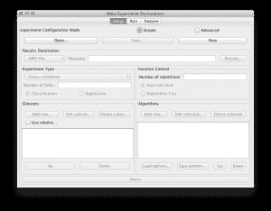
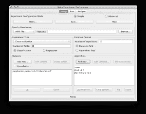
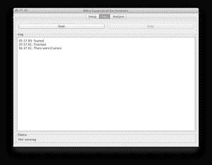
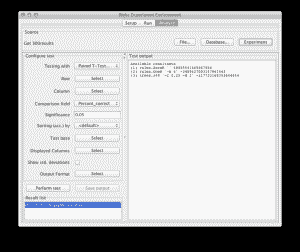
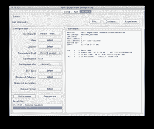
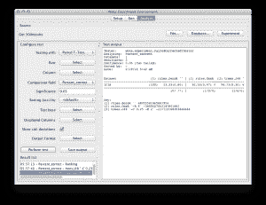
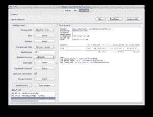

# 设计并运行你在 Weka 的第一个实验

> 原文：<https://machinelearningmastery.com/design-and-run-your-first-experiment-in-weka/>

最后更新于 2020 年 12 月 10 日

[Weka](https://machinelearningmastery.com/what-is-the-weka-machine-learning-workbench/ "What is the Weka Machine Learning Workbench") 是学习机器学习的完美平台。它提供了一个图形用户界面，用于在数据集上探索和实验机器学习算法，而您不必担心数学或编程。

Weka 的一个强大功能是 Weka 实验员界面。与用于过滤数据和尝试不同算法的 Weka 探索者不同，实验者用于设计和运行实验。它产生的实验结果是健壮的，并且足够好，可以发表(如果你知道你在做什么)。

在之前的一篇文章中，你学习了如何在 Weka 探索者中运行你的第一个分类器。

在这篇文章中，你将发现 Weka 实验者的力量。如果你按照一步一步的指示去做，你将在五分钟内为安润设计你的第一个机器学习实验。

**用我的新书[用 Weka](https://machinelearningmastery.com/machine-learning-mastery-weka/) 启动你的项目**，包括*的分步教程*和清晰的*截图*所有示例。

第一次实验
图片由 [mhofstrand](https://www.flickr.com/photos/mhofstrand/25972084/sizes/o/) 提供，保留部分权利

## 1。下载并安装 Weka

访问 [Weka 下载页面](https://waikato.github.io/weka-wiki/downloading_weka/)找到适合你电脑的 Weka 版本(Windows、Mac 或 Linux)。

Weka 需要 Java。您可能已经安装了 Java，如果没有，下载页面上列出的 Weka 版本(适用于 Windows)包含 Java，并将为您安装。我自己也在苹果电脑上，就像苹果电脑上的其他东西一样，Weka 开箱即用。

如果你对机器学习感兴趣，那么我知道你可以想出如何将软件下载并安装到自己的计算机中。

## 2.启动 Weka

启动 Weka。这可能需要在程序启动器中找到它，或者双击 weka.jar 文件。这将启动 Weka 图形用户界面选择器。

Weka 图形用户界面选择器

Weka 图形用户界面选择器允许您选择资源管理器、实验器、知识管理器和简单命令行界面(命令行界面)之一。

点击 ***实验者*** 按钮，启动 Weka 实验者。

Weka Experimenter 允许您设计自己的在数据集上运行算法的实验，运行实验并分析结果。这是一个强大的工具。

## 3.设计实验

点击 ***新建*** 按钮创建新的实验配置。

Weka 实验者
开始新的实验

### 测试选项

实验者用合理的默认值为你配置测试选项。实验配置为使用 10 倍的[交叉验证。这是一个“分类”类型的问题，每个算法+数据集组合运行 10 次(迭代控制)。](https://machinelearningmastery.com/how-to-choose-the-right-test-options-when-evaluating-machine-learning-algorithms/ "How To Choose The Right Test Options When Evaluating Machine Learning Algorithms")

### 鸢尾花数据集

让我们从选择数据集开始。

1.  在 ***数据集*** 中选择点击【添加新…】按钮。
2.  打开 ***数据*** 目录，选择 ***鸢尾*** 数据集。

鸢尾花数据集是一个著名的统计数据集，被机器学习领域的研究人员大量借用。它包含 150 个实例(行)和 4 个属性(列)以及一个鸢尾花物种的类属性(刚毛藻、云芝、弗吉尼亚之一)。你可以在维基百科上阅读更多关于[鸢尾花数据集的信息。](https://en.wikipedia.org/wiki/Iris_flower_data_set)

让我们选择 3 种算法来运行我们的数据集。

### 零号

1.  点击“算法”部分的“ ***”添加新的……***”。
2.  点击 ***选择*** 按钮。
3.  点击“ ***”下的 ZeroR******规则*** ”选择。

ZeroR 是我们能运行的最简单的算法。它选择数据集中占大多数的类值，并为所有预测给出该值。假设所有三个类值具有相等的份额(50 个实例)，它选择第一个类值“setosa”，并将其作为所有预测的答案。不出所料，我们知道 ZeroR 能给出的最好结果是 33.33% (50/150)。这是一个很好的基线，我们要求算法的表现超过它。

### 无比的人

1.  点击“算法”部分的“ ***”添加新的……***”。
2.  点击 ***选择*** 按钮。
3.  点击“ ***OneR*** ”下的“ ***规则*** ”选择。

OneR 就像是我们第二简单的算法。它选择一个与类值最相关的属性，并将其拆分，以获得最佳的预测准确率。像 ZeroR 算法一样，该算法非常简单，您可以手动实现它，我们希望更复杂的算法能够执行它。

### J48

1.  点击“算法”部分的“ ***”添加新的……***”。
2.  点击 ***选择*** 按钮。
3.  点击 ***J48*** 下的 ***树木*** 选择。

J48 是决策树算法。它是 C4.8 算法在 Java 中的实现(“J”代表 Java，48 代表 C4.8)。C4.8 算法是著名的 C4.5 算法的一个小扩展，是一个非常强大的预测算法。

Weka 实验者
配置实验

我们准备进行实验。

## 4.运行实验

单击屏幕顶部的“**”选项卡。**

 **该选项卡是运行当前配置实验的控制面板。

点击大的“ ***【开始】*** ”按钮开始实验，观看“日志”和“状态”部分，关注实验进展。

Weka 实验者
运行实验

假设数据集很小，算法很快，实验应该在几秒钟内完成。

## 5.查看结果

单击屏幕顶部的“**”选项卡。**

 **这将打开实验结果分析面板。

Weka 实验者
加载实验结果

点击 ***来源*** 部分中的 ***实验*** 按钮，加载当前实验的结果。

### 算法等级

我们首先想知道的是哪种算法是最好的。我们可以通过给定算法击败其他算法的次数来对算法进行排名。

1.  点击“ ***”选择*** ”按钮为“ ***【测试基地】*** ”并选择“ ***【排名】*** ”。
2.  现在点击 ***执行测试*** 按钮。

Weka 实验者
对实验结果中的算法进行排序

排名表显示了每种算法相对于数据集中所有其他算法的[统计显著](https://machinelearningmastery.com/how-to-choose-the-right-test-options-when-evaluating-machine-learning-algorithms/ "How To Choose The Right Test Options When Evaluating Machine Learning Algorithms")获胜次数。一次胜利意味着比另一种算法的准确率更高的准确率，并且差异具有统计学意义。

我们可以看到，J48 和 OneR 都各有一胜，ZeroR 有两负。这很好，这意味着 OneR 和 J48 都是潜在的竞争者，其表现超过了 ZeroR 的基线。

### 算法准确率

接下来我们想知道算法取得了什么表现。

1.  单击“ ***”选择“*** ”按钮选择“ ***【测试基地】*** ”并在列表中选择“***【ZeroR】***”算法，然后单击“ ***”选择*** ”按钮。
2.  单击“ ***【显示标准】旁边的复选框。偏差*** ”。
3.  现在点击 ***执行测试*** 按钮。

Weka 实验者
算法准确率与零相比

在“测试输出”中，我们可以看到一个包含 3 种算法结果的表格。每个算法在数据集上运行 10 次，报告的准确率是这 10 次运行的平均值和标准差。

我们可以看到 OneR 和 J48 算法的结果旁边都有一个小“v”。这意味着这些算法的准确率与 ZeroR 相比有显著的统计学差异。我们还可以看到，与 ZeroR 相比，这些算法的准确性很高，因此我们可以说，这两种算法在统计上取得了明显优于 ZeroR 基线的结果。

J48 的分数高于 OneR 的分数，所以接下来我们想看看这两个准确度分数之间的差异是否显著。

1.  点击 ***【测试基地】*** 的 ***选择*** 按钮，在列表中选择 ***J48*** 算法，点击 ***选择*** 按钮。
2.  现在点击 ***执行测试*** 按钮。

Weka 实验者
算法准确率对比 J48

我们可以看到，ZeroR 的结果旁边有一个“*”，这表明它的结果与 J48 相比在统计上有所不同。但我们已经知道了。我们在 OneR 算法的结果旁边看不到“*”。这告诉我们，尽管 J48 和 OneR 之间的平均准确率不同，但差异在统计上并不显著。

在所有条件相同的情况下，我们会选择 OneR 算法来预测这个问题，因为它是两种算法中较简单的一种。

如果我们想要报告结果，我们会说 OneR 算法实现了 92.53% (+/- 5.47%)的分类准确率，这在统计上显著优于 ZeroR，为 33.33% (+/- 5.47%)。

## 摘要

您发现了如何在 Weka 中用一个数据集和三个算法配置机器学习实验。您还学习了如何分析实验结果，以及解释结果时统计意义的重要性。

现在，您有能力在自己选择的数据集上使用 Weka 提供的任何算法设计和运行实验，并有意义和自信地报告您获得的结果。****