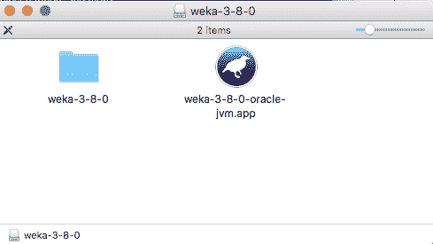
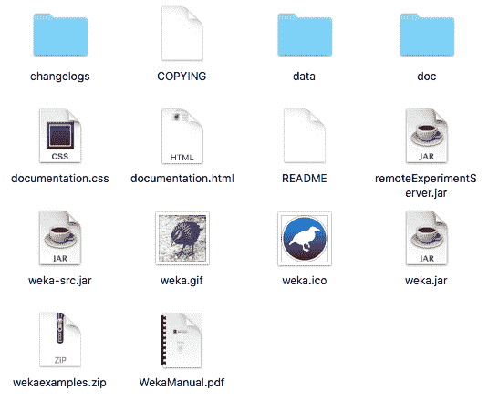
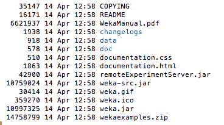

# 如何下载安装 Weka 机器学习工作台

> 原文：<https://machinelearningmastery.com/download-install-weka-machine-learning-workbench/>

最后更新于 2020 年 12 月 10 日

Weka 机器学习工作台是一个功能强大但易于使用的预测建模平台。

在这篇文章中，你将发现如何在你的工作站上快速安装 Weka，并开始机器学习。

看完这篇文章你会知道:

*   如何为 Windows 或 Mac 安装 Weka 的一体机版本？
*   如何在 Windows 或 Mac 上分别安装 Java 和 Weka？
*   如何在 Linux 等平台安装 Weka？

**用我的新书[用 Weka](https://machinelearningmastery.com/machine-learning-mastery-weka/) 启动你的项目**，包括*的分步教程*和清晰的*截图*所有示例。

我们开始吧。


如何下载和安装 Weka 机器学习工作台
图片由[尼古拉斯 a .托内利](https://www.flickr.com/photos/nicholas_t/14038975921/in/photolist-nozqqZ-9dNLiL-8NRyC2-cjkSq1-oztTua-bTzd5B-7nDJWP-ouUzkQ-nqxL2T-rzdr4S-787EzG-2vVkpu-nMS6rx-4Lbxc6-nqxnj7-7girE8-oMsVVE-p3Jour-kLSBV6-edpSpH-dFKdRv-6Y1J98-pWMCXe-5PA3Cu-72u6S-8gLyR8-7tZ3i8-nEZtZJ-8NP1ku-iKrUr5-zHeev-aAoHjH-8vBVVr-8vEXcj-p8QCH2-dQacqK-qivn3a-sas694-Bw5Muj-azVNVK-fEz8c9-nGR321-s8snXL-bA2jbR-83hhmH-7GPr1X-bZCWfG-mHTDBt-HLoQpb-8DRfA5)提供，版权所有。

## 下载 Weka

所有版本的 Weka 都可以从[Weka 下载网页](https://waikato.github.io/weka-wiki/downloading_weka/)下载。

选择您想要安装的 Weka 版本，然后访问 Weka 下载页面，找到并下载您喜欢的 Weka 版本。

您的选择包括:

*   为 Windows 或 Mac OS X 安装 Weka 的一体机版本。
*   分别为 Windows 或 Mac OS X 安装 Java 和 Weka。
*   为 Linux 和其他平台安装独立版本的 Weka。

## 安装 Weka 的一体化版本

Weka 为 Windows 和 Mac OS X 提供了一体化的安装版本。

该安装包括可用于预测建模的 Weka 平台，以及运行 Weka 平台所需的 Java 版本。

### Windows 操作系统

在 windows 上，Weka 的一体化版本是作为自解压可执行文件提供的。

您必须选择是喜欢 32 位版本的软件包还是 64 位版本的软件包。如果您有现代版本的 Windows，您应该选择 64 位版本。

在 Weka 下载网页上，这些软件包被称为:

*   64 位窗口的自解压可执行文件，包括甲骨文的 64 位 Java。
*   32 位窗口的自解压可执行文件，包括甲骨文的 32 位 Java。

下载量约为 100 兆字节。下载软件包后，双击图标开始安装过程。

按照提示进行安装，Weka 将被添加到您的程序菜单中。

点击小鸟图标开始 Weka。

### Mac OS X

在 OS X，Weka 的一体化版本以磁盘映像的形式提供。

在 Weka 下载网页上，该软件包被称为:

*   OS X 的磁盘映像，包含一个苹果应用程序，包括甲骨文的 Java。

下载量约为 120 兆字节。磁盘映像包括两个版本的 Weka，一个捆绑了 Java 版本，另一个是独立版本。我建议两者都安装。

将文件夹和图标拖到应用程序文件夹中。



OS X 的扩展 Weka 磁盘映像

点击小鸟图标开始 Weka。

## 分别安装 Java 和 Weka

您可能已经在工作站上安装了 Java 运行时环境或 Java 开发工具包，或者您可能希望将 Java 与 Weka 分开安装，以便您可以将 Java 与其他应用程序一起使用。

Weka 提供了一个不包含 Java 运行时环境的版本，您可以下载。

如果您想访问 Weka 安装提供的数据文件和文档，我建议您安装 Weka。

Weka 要求至少安装 Java 1.7。

如果您没有安装 Java，想从 Weka 单独安装 Java，可以从 [Java 下载网页](https://java.com/en/download/)下载 Java。该网页将自动确定您的工作站所需的 Java 版本，并下载最新版本。Java 下载量约为 60 兆字节。

### Windows 操作系统

Weka 为 Windows 提供了一个不包含 Java 的版本。

您必须选择是喜欢 32 位版本的软件包还是 64 位版本的软件包。如果您有现代版本的 Windows，您应该选择 64 位版本。

在 Weka 下载页面上，该版本的名称如下:

*   无需 Java 虚拟机的 64 位窗口自解压可执行文件。
*   无需 Java 虚拟机的 32 位 Windows 自解压可执行文件。

下载量约为 50 兆字节。下载软件包后，双击开始安装过程。按照提示进行安装，Weka 将被添加到您的程序菜单中。

点击小鸟图标开始 Weka。

### Mac OS X

操作系统 x 只有一个下载版本的 Weka。

它是一个磁盘映像，包括与 Java 捆绑的 Weka 版本以及独立版本。

在 Weka 下载网页上，该软件包被称为:

*   OS X 的磁盘映像，包含一个苹果应用程序，包括甲骨文的 Java。

下载量约为 120 兆字节。打开磁盘映像，将独立版本的 Weka(文件夹)拖到应用程序文件夹中。



Weka 安装目录

双击 *weka.jar* 文件启动 Weka。

假设 Java 在您的路径中，您也可以在命令行上启动 Weka。

1.将目录更改为您的 weka 安装目录。例如

```py
cd /Applications/weka-3-8-0
```

2.用 *weka.jar* 文件启动 Java 虚拟机。例如:

```py
java -jar weka.jar
```

## 在 Linux 和其他平台上安装 Weka

Weka 还提供了一个独立版本，您可以在 Linux 和其他平台上安装。

Weka 运行在 Java 上，可以在所有支持 Java 的平台上使用。

它是一个 zip 文件，具有以下 Weka 下载网页的名称:

*   包含 Weka 的 Zip 存档。

下载 zip 文件并解压缩。

假设 Java 在您的路径中，您也可以在命令行上启动 Weka。



Weka 安装文件

1.将目录更改为您的 Weka 安装目录。例如

```py
cd /Applications/weka-3-8-0
```

2.用 *weka 启动 Java 虚拟机。* jar 文件，例如:

```py
java -jar weka.jar
```

## 摘要

在这篇文章中，你发现了如何下载和安装 Weka 机器学习工作台。

具体来说，您了解到:

*   如何在 Windows 和 Mac OS X 上使用一体机版本安装 Weka？
*   如何在 Windows 和 Mac OS X 上使用独立版本安装 Weka
*   如何在 Linux 和其他平台上使用独立版本安装 Weka。

关于下载安装 Weka 或者这个帖子有什么问题吗？在下面的评论中提问，我会尽力回答。