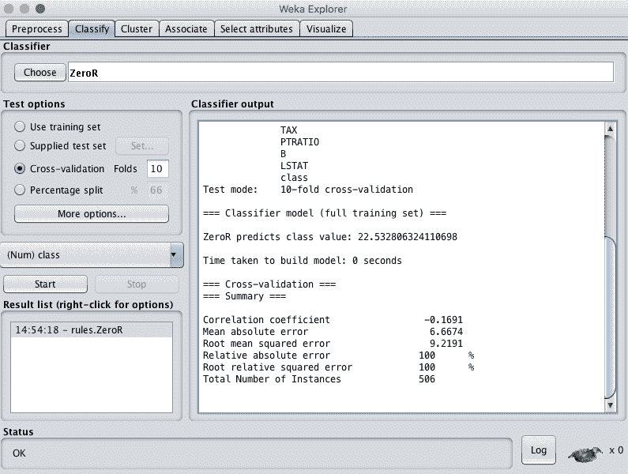
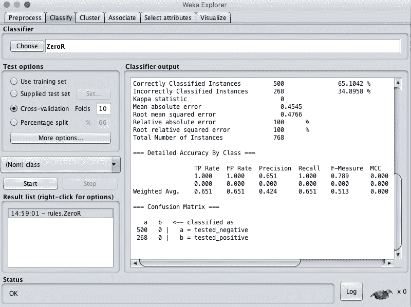

# 如何在 Weka 中评估机器学习模型的基线表现

> 原文：<https://machinelearningmastery.com/estimate-baseline-performance-machine-learning-models-weka/>

最后更新于 2020 年 12 月 10 日

有一个机器学习问题的表现基线真的很重要。

它会给你一个参考点，你可以用来比较你构建的所有其他模型。

在这篇文章中，您将发现如何使用 Weka 为机器学习问题开发表现基线。

看完这篇文章你会知道:

*   为机器学习问题建立表现基线的重要性。
*   如何在回归问题上使用零规则方法计算基线表现。
*   如何在分类问题上使用零规则方法计算基线表现。

**用我的新书[用 Weka](https://machinelearningmastery.com/machine-learning-mastery-weka/) 启动你的项目**，包括*的分步教程*和清晰的*截图*所有示例。

我们开始吧。

如何在 Weka 中评估机器学习模型的基线表现[彼得·史蒂文斯](https://www.flickr.com/photos/nordique/14016458420/)摄，版权所有。

## 基线结果的重要性

在手之前，你无法知道哪种算法对你的问题表现最好，所以你必须尝试一套算法，看看哪种算法效果最好，然后加倍努力。

因此，在处理机器学习问题时，开发一个表现基线是至关重要的。

基线为比较其他机器学习算法提供了一个参考点。

您可以了解在基线上可以实现的绝对表现提升，以及相对来说显示您做得有多好的升力比。

没有底线，你就不知道你在问题上做得有多好。你没有参考点来考虑你是否已经或正在继续增加价值。基线定义了所有其他机器学习算法必须跨越的障碍，以展示对问题的“技能”。

## 基线表现的零规则

分类和回归问题的基线称为零规则算法。也称为零或 0-R。

让我们通过一些例子来仔细看看零规则算法如何用于分类和回归问题。

### 回归问题的基线表现

对于预测数值的回归预测建模问题，零规则算法预测训练数据集的平均值。

例如，让我们在[波士顿房价预测问题](https://archive.ics.uci.edu/ml/datasets/Housing)上演示零规则算法。您可以从[Weka 数据集网页](https://sourceforge.net/projects/weka/files/datasets/)下载 ARFF 的波士顿房价预测数据集。它位于文件 *housing.arff* 中的*数据集-numeric.jar* 包中。

1.  启动 Weka 图形用户界面选择器。
2.  点击“浏览器”按钮，打开 Weka 浏览器界面。
3.  加载波士顿房价数据集 *housing.arff* 文件。
4.  单击“分类”选项卡打开分类选项卡。
5.  选择 ZeroR 算法(默认情况下应选择该算法)。
6.  选择“交叉验证”测试选项(应默认选择)。
7.  单击“开始”按钮评估数据集上的算法。

回归问题的 Weka 基线表现

ZeroR 算法预测平均波士顿房价为 22.5(以千美元计)，RMSE 为 9.21。

任何机器学习算法要证明它在这个问题上有技巧，它必须达到比这个值更好的 RMSE。

### 分类问题的基线表现

对于预测分类值的分类预测建模问题，零规则算法预测训练数据集中观察值最多的类值。

例如，让我们演示关于皮马印第安人糖尿病发病问题的零规则算法。该数据集应位于您的 Weka 安装的*数据/* 目录中。如果没有，可以从 [Weka 下载网页](https://waikato.github.io/weka-wiki/downloading_weka/)下载默认的 Weka 安装，目标是扩展名为. zip 的“其他平台”，解压后找到 *diabetes.arff* 文件。

1.  启动 Weka 图形用户界面选择器。
2.  点击“浏览器”按钮，打开 Weka 浏览器界面。
3.  加载皮马印第安人数据集 *diabetes.arff* 文件。
4.  单击“分类”选项卡打开分类选项卡。
5.  选择 ZeroR 算法(默认情况下应选择该算法)。
6.  选择“交叉验证”测试选项(应默认选择)。
7.  单击“开始”按钮评估数据集上的算法。

分类问题的基线表现

ZeroR 算法预测所有实例的 *tested_negative* 值，因为它是多数类，并且达到 65.1%的准确率。

任何机器学习算法要证明它在这个问题上有技巧，它必须达到比这个值更好的准确率。

## 摘要

在这篇文章中，您已经发现了如何使用 Weka 计算机器学习问题的基线表现。

具体来说，您了解到:

*   计算问题表现基线的重要性。
*   如何使用零规则算法计算回归问题的基线表现。
*   如何使用零规则算法计算分类问题的基线表现。

你对计算绩效基线或这篇文章有什么问题吗？在评论中提出你的问题，我会尽力回答。