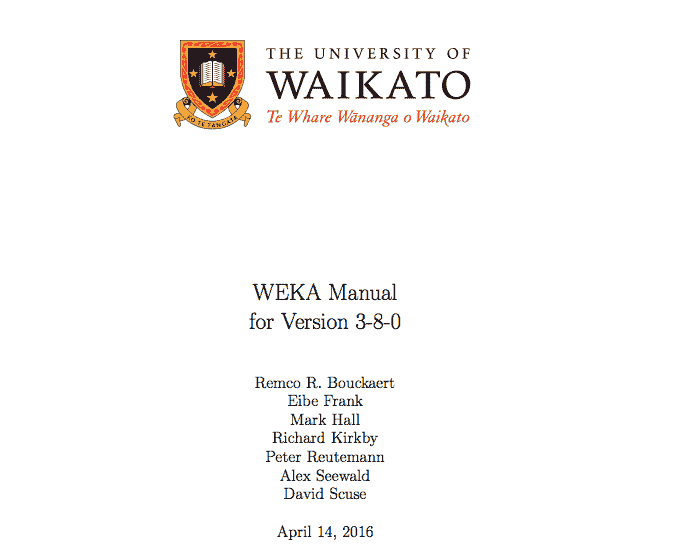
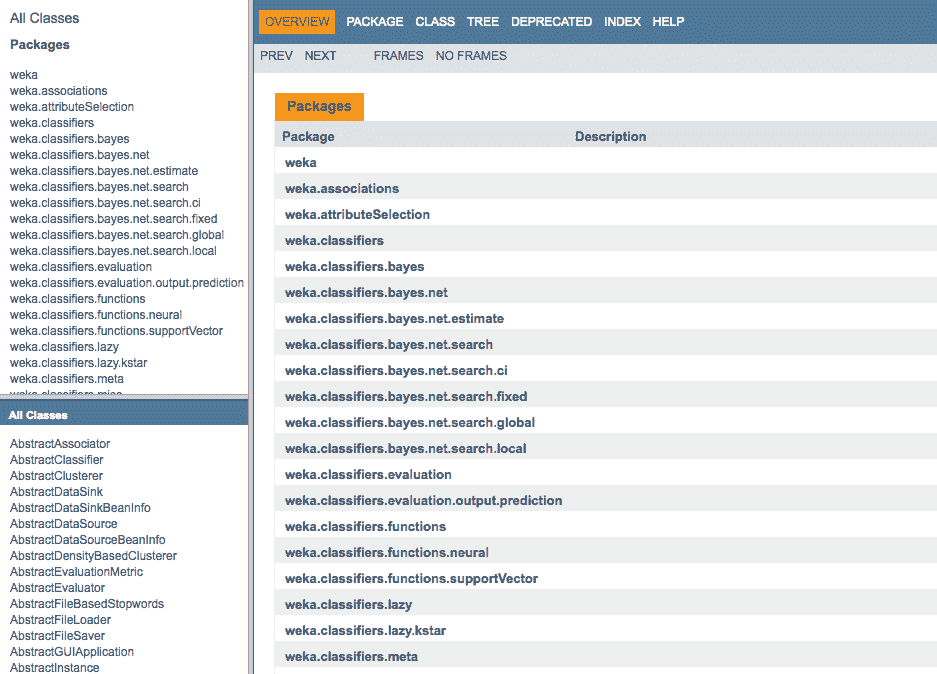

# 如何获得更多 Weka 机器学习工作台的帮助

> 原文：<https://machinelearningmastery.com/help-with-weka/>

最后更新于 2020 年 12 月 10 日

Weka 机器学习工作台是一个易于使用且功能强大的应用机器学习平台。

即使它很容易使用，当你在自己的问题上使用它时，你可能仍然需要一些帮助或建议。

在这篇文章中，你会发现一些资源，你可以用它们来获得更多关于 Weka 的帮助。

看完这篇文章你会知道:

*   关于工作站上安装的 Weka 文档。
*   您可以参考的在线资源，以获得有关您对 Weka 的技术问题的帮助。
*   在那里你可以问自己关于 Weka 的未回答的问题。

**用我的新书[用 Weka](https://machinelearningmastery.com/machine-learning-mastery-weka/) 启动你的项目**，包括*的分步教程*和清晰的*截图*所有示例。

我们开始吧。

如何获得更多帮助 Weka 机器学习工作台
图片由[苏珊·尼尔森](https://www.flickr.com/photos/infomastern/15977095819/)提供，版权所有。

## Weka 离线文档

您安装的 Weka 提供了文档，您可以参考这些文档来了解有关如何使用该平台的更简单的问题。

您的安装目录包含一个名为*documentation.html*的 HTML 文件，该文件链接到您的安装所提供的所有文档，包括:

*   Weka 用户手册。
*   Weka API 文档。

Weka 文件

### 微卡手册

Weka 手册提供了如何使用 Weka 软件的信息。

这包括:

*   如何使用 Weka 命令行界面？
*   如何使用 Weka 图形用户界面？
*   关于 Weka 数据文件格式。
*   和附加技术文档。

文档非常好，如果您对 Weka 软件的使用有疑问，这是您应该首先检查的地方。

微卡手册

### Weka Java 应用编程接口文档

这是 Java 应用程序编程接口的文档。

它是为希望编写利用 Weka Java 接口的程序的开发人员准备的。

文档的结构和风格对于 Java 程序员来说是熟悉的，因为它使用标准的 Javadoc 格式。

Weka Java 应用程序编程接口文档

## Weka 在线文档

Weka 提供了一些在线文档来源，包括:

*   设置周
*   Weka 邮件列表
*   其他官方资源

### 设置周

[Weka 维基](https://waikato.github.io/weka-wiki/)提供了关于一系列 Weka 主题的实用文章。

以下是一些 wiki 页面，如果您想解决某个特定问题，这些页面可能会很有价值:

*   [Weka 常见问题](https://waikato.github.io/weka-wiki/faq/)
*   [Weka 故障排除](https://waikato.github.io/weka-wiki/troubleshooting/)

有很多维基页面，使用搜索功能来定位特定主题的页面。

### Weka 邮件列表

[Weka 邮件列表](https://list.waikato.ac.nz/mailman/listinfo/wekalist)是一个可以加入与核心 Weka 社区互动的邮件列表。

这既包括回答关于 Weka 的技术问题，也包括获得您自己的技术问题的答案。

一般来说，电子邮件列表是有礼节的，尤其是在这个电子邮件列表上。这种礼仪的很大一部分是检查你的问题以前是否被问过和回答过。您可以通过使用搜索功能查看 Weka 电子邮件列表档案来做到这一点。档案很丰富，我建议花些时间通读历史。

### 其他官方资源

您可能会发现有用的其他在线资源包括:

*   微卡主页
*   [Pentaho 数据挖掘社区文档](http://wiki.pentaho.com/display/DATAMINING/Pentaho+Data+Mining+Community+Documentation)
*   [数据挖掘:实用机器学习工具和技术](https://amzn.to/340LRLA)

## 堆栈溢出

stackoverflow 网站是一个面向开发者的技术问答社区。

就像 Weka 邮件列表一样，检查你的问题之前是否已经被问过和回答过是一种很好的礼仪。阅读给定问答页面时，使用搜索功能并密切关注页面右侧的“相关”帖子。

关于 Weka 的问题都标有“Weka”关键词。通过此标签过滤问题，您可以[查看所有与 Weka 相关的问题](https://stackoverflow.com/questions/tagged/weka)。

## 摘要

在这篇文章中，你发现了可以用来帮助 Weka 的资源。

你学会了:

*   您的 Weka 安装包括一个手册，其中包含关于如何使用 Weka 界面的更多信息。
*   Weka Wiki 是关于如何使用 Weka 的其他技术问题的首选。
*   邮件列表和堆栈溢出是在 Weka 上询问未回答的技术问题的好地方。

关于获得更多关于 Weka 或这篇文章的帮助，你有什么问题吗？在下面的评论中提问，我会尽力回答。