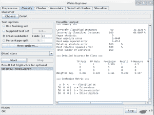
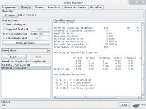
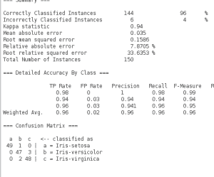

# 如何在 Weka 中运行你的第一个分类器

> 原文：<https://machinelearningmastery.com/how-to-run-your-first-classifier-in-weka/>

最后更新于 2020 年 12 月 10 日

[Weka](https://machinelearningmastery.com/what-is-the-weka-machine-learning-workbench/ "What is the Weka Machine Learning Workbench") 让学习应用机器学习变得轻松、高效、有趣。它是一个图形用户界面工具，允许您加载数据集、运行算法以及设计和运行实验，其结果在统计上足够健壮，可以发布。

我向机器学习的初学者推荐 Weka，因为它让他们专注于学习应用机器学习的[过程，而不是被](https://machinelearningmastery.com/process-for-working-through-machine-learning-problems/ "5-Part Process for working through Machine Learning Problems")[数学](https://machinelearningmastery.com/what-if-im-not-good-at-mathematics/ "What if I’m Not Good at Mathematics")和[编程](https://machinelearningmastery.com/what-if-im-not-a-good-programmer/ "What if I’m Not a Good Programmer")所拖累——这些都可以在后面实现。

在这篇文章中，我想向您展示加载数据集、运行高级分类算法和查看结果是多么容易。

如果你坚持下去，你将在不到 5 分钟的时间内获得**机器学习结果**，并有知识和信心继续尝试更多的数据集和算法。

**用我的新书[用 Weka](https://machinelearningmastery.com/machine-learning-mastery-weka/) 启动你的项目**，包括*的分步教程*和清晰的*截图*所有示例。

## 1.下载 Weka 并安装

访问 [Weka 下载页面](https://waikato.github.io/weka-wiki/downloading_weka/)找到适合你电脑(Windows、Mac 或 Linux)的 Weka 版本。

Weka 需要 Java。您可能已经安装了 [Java](https://java.com) ，如果没有，下载页面上列出的 Weka 版本(适用于 Windows)包含 Java，并将为您安装。我自己也在苹果电脑上，就像苹果电脑上的其他东西一样，Weka 开箱即用。

如果你对机器学习感兴趣，那么我知道你可以想出如何将软件下载并安装到自己的计算机中。如果您需要安装 Weka 的帮助，请参阅以下提供逐步说明的帖子:

*   [如何下载安装 Weka 机器学习工作台](https://machinelearningmastery.com/download-install-weka-machine-learning-workbench/)

## 2.启动 Weka

启动 Weka。这可能需要在程序启动器中找到它，或者双击 weka.jar 文件。这将启动 Weka 图形用户界面选择器。

Weka 图形用户界面选择器允许您选择资源管理器、实验器、知识管理器和简单命令行界面(命令行界面)之一。

Weka 图形用户界面选择器

点击 ***探索者*** 按钮，启动 Weka 探索者。

该图形用户界面允许您加载数据集和运行分类算法。它还提供了其他功能，如数据过滤、聚类、关联规则提取和可视化，但我们现在不会使用这些功能。

## 3.打开数据/iris.arff 数据集

点击 ***打开文件……***按钮打开数据集，双击 ***数据*** 目录。

Weka 提供了许多小的通用机器学习数据集，你可以用来练习。

选择“**”文件加载虹膜数据集。**

**

加载虹膜数据集的 Weka 浏览器界面

鸢尾花数据集是统计学中著名的数据集，被机器学习领域的研究者大量借用。它包含 150 个实例(行)和 4 个属性(列)以及一个鸢尾花物种的类属性(刚毛藻、云芝和弗吉尼亚之一)。你可以在维基百科上阅读更多关于[鸢尾花数据集的信息。](https://en.wikipedia.org/wiki/Iris_flower_data_set)

## 4.选择并运行算法

现在您已经加载了一个数据集，是时候选择一个机器学习算法来建模问题并进行预测了。

点击“**”选项卡。这是针对 Weka 中加载的数据集运行算法的区域。**

 **您会注意到，默认情况下选择了“***【ZeroR】***”算法。

点击 ***开始*** 按钮运行该算法。

鸢尾花数据集上零陷算法的 Weka 结果

ZeroR 算法选择数据集中的多数类(所有三种虹膜在数据中都同样存在，所以它选择第一种:setosa)，并使用它来进行所有预测。这是数据集的基线，也是可以用来比较所有算法的度量。结果是 33%，正如预期的那样(3 个类，每个类代表相等，为每个预测结果分配三个中的一个，分类准确率为 33%)。

您还会注意到，默认情况下，测试选项选择 10 倍交叉验证。这意味着数据集被分成 10 部分:前 9 部分用于训练算法，第 10 部分用于评估计法。重复这一过程，允许分割数据集的 10 个部分中的每个部分都有机会成为保留的测试集。你可以[在这里](https://en.wikipedia.org/wiki/Cross-validation_(statistics))阅读更多关于交叉验证的内容。

ZeroR 算法很重要，但很无聊。

单击“分类器”部分的“选择”按钮，然后单击“树”并单击“J48”算法。

这是 C4.8 算法在 Java 中的一个实现(“J”代表 Java，48 代表 C4.8，因此得名 J48)，是著名的 C4.5 算法的一个小扩展。您可以[在这里](https://en.wikipedia.org/wiki/C4.5_algorithm)阅读更多关于 C4.5 算法的内容。

点击 ***开始*** 按钮运行算法。

Weka J48 算法在鸢尾花数据集上的结果

## 5.查看结果

运行 J48 算法后，您可以在“分类器输出”部分记录结果。

该算法以 10 倍交叉验证运行:这意味着它有机会对数据集的每个实例进行预测(使用不同的训练折叠)，并且呈现的结果是这些预测的总结。

只是在 Weka 的鸢尾花数据集上的 J48 算法的结果

首先注意[分类准确率](https://en.wikipedia.org/wiki/Accuracy_and_precision)。您可以看到，该模型获得了 144/150 正确率或 96%的结果，这似乎比 33%的基线好得多。

其次，看[混淆矩阵](https://machinelearningmastery.com/confusion-matrix-machine-learning/)。您可以看到一个实际类别与预测类别的比较表，您可以看到有 1 个错误将鸢尾分类为鸢尾色，2 个案例将鸢尾色分类为鸢尾色，3 个案例将鸢尾色分类为鸢尾色(总共 6 个错误)。此表有助于解释算法所达到的准确率。

## 摘要

在这篇文章中，您加载了第一个数据集，并在 Weka 中运行了第一个机器学习算法(C4.8 算法的实现)。ZeroR 算法并不算数:它只是一个有用的基线。

你现在知道如何加载 Weka 提供的数据集，以及如何运行算法:继续尝试不同的算法，看看你会得到什么。

如果你能在 Iris 数据集上达到 96%以上的准确率，请在评论中留下注释。****