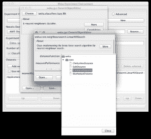
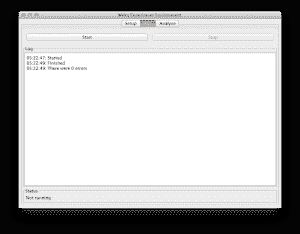
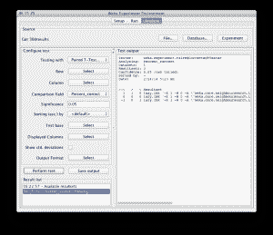
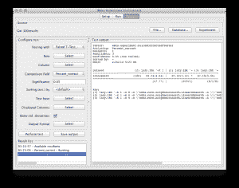

# 如何在 Weka 中调整机器学习算法

> 原文：<https://machinelearningmastery.com/how-to-tune-a-machine-learning-algorithm-in-weka/>

最后更新于 2020 年 12 月 10 日

[Weka](https://machinelearningmastery.com/what-is-the-weka-machine-learning-workbench/ "What is the Weka Machine Learning Workbench") 是学习机器学习的完美平台。

它提供了一个图形用户界面，用于在数据集上探索和实验机器学习算法，而您不必担心数学或编程。

在之前的一篇文章中，我们研究了如何在数据集上用 3 种算法设计和运行一个实验，以及如何分析和报告结果。

曼哈顿天际线，因为我们将使用曼哈顿距离和 k 近邻算法。
蒂姆·皮尔斯摄，洛斯加托斯，版权所有。

在这篇文章中，你将发现如何使用 Weka 实验者来提高你的结果，并充分利用机器学习算法。如果你按照一步一步的指导，你将在五分钟内设计并运行你的算法调优机器学习实验。

**用我的新书[用 Weka](https://machinelearningmastery.com/machine-learning-mastery-weka/) 启动你的项目**，包括*的分步教程*和清晰的*截图*所有示例。

## 1.下载 Weka 并安装

访问 [Weka 下载页面](https://waikato.github.io/weka-wiki/downloading_weka/)找到适合你电脑的 Weka 版本(Windows、Mac 或 Linux)。

Weka 需要 Java。您可能已经安装了 Java，如果没有，下载页面上列出的 Weka 版本(适用于 Windows)包含 Java，并将为您安装。我自己也在苹果电脑上，就像苹果电脑上的其他东西一样，Weka 开箱即用。

如果你对机器学习感兴趣，那么我知道你可以想出如何将软件下载并安装到自己的计算机中。

## 2.启动 Weka

启动 Weka。这可能需要在程序启动器中找到它，或者双击 weka.jar 文件。这将启动 Weka 图形用户界面选择器。

Weka 图形用户界面选择器

Weka 图形用户界面选择器允许您选择资源管理器、实验器、知识管理器和简单命令行界面(命令行界面)之一。

点击“实验者”按钮，启动 Weka 实验者。

Weka Experimenter 允许您设计自己的在数据集上运行算法的实验，运行实验并分析结果。这是一个强大的工具。

## 3.设计实验

点击*新建*按钮，创建新的实验配置。

### 测试选项

实验者用合理的默认值为你配置测试选项。实验配置为使用 10 倍的[交叉验证。这是一个“分类”类型的问题，每个算法+数据集组合运行 10 次(迭代控制)。](https://machinelearningmastery.com/how-to-choose-the-right-test-options-when-evaluating-machine-learning-algorithms/ "How To Choose The Right Test Options When Evaluating Machine Learning Algorithms")

### 电离层数据集

让我们从选择数据集开始。

1.  在*数据集*中，选择点击*添加新…* 按钮。
2.  打开*数据*目录，选择*电离层*数据集。

[电离层数据集](https://archive.ics.uci.edu/ml/datasets/Ionosphere)是一个经典的机器学习数据集。问题是在给定雷达信号的情况下，预测电离层中自由电子结构的存在与否。它由 16 对实值雷达信号(34 个属性)和一个具有两个值的单一类别属性组成:好的和坏的雷达回波。

您可以在电离层数据集的 [UCI 机器学习知识库页面上了解更多关于此问题的信息。](https://archive.ics.uci.edu/ml/datasets/Ionosphere)

### 调整 k 近邻

在这个实验中，我们对调整数据集上的 [k 最近邻算法](https://en.wikipedia.org/wiki/K-nearest_neighbors_algorithm) (kNN)感兴趣。在 Weka 中，这种算法被称为 IBk(基于实例的学习器)。

IBk 算法并不构建模型，而是及时为测试实例生成预测。IBk 算法使用距离度量在每个测试实例的训练数据中定位 *k* “接近”实例，并使用这些选择的实例进行预测。

在这个实验中，我们感兴趣的是在电离层数据集上定位 IBk 算法中使用的距离度量。我们将在实验中添加该算法的 3 个版本:

### 欧几里得距离

1.  在*算法*部分点击*添加新的……*。
2.  点击*选择*按钮。
3.  点击*懒*选择下的 *IBk* 。
4.  点击 *IBk* 配置上的*确定*按钮。

这将添加带有默认距离度量[欧几里德距离](https://en.wikipedia.org/wiki/Euclidean_distance)的 IBk 算法。

### 曼哈顿距离

1.  在*算法*部分点击*添加新的……*。
2.  点击*选择*按钮。
3.  点击*懒*选择下的 *IBk* 。
4.  在 IBk 的配置中点击“*近邻搜索算法*”的名称。
5.  点击*距离功能*的*选择*按钮，选择*曼哈顿态势*。
6.  点击*近邻搜索算法*配置中的*确定*按钮。
7.  点击 *IBk* 配置上的*确定*按钮。

为 IBk 选择距离度量

这将添加带有[曼哈顿距离](https://en.wikipedia.org/wiki/Manhattan_distance)的 IBk 算法，也称为城市街区距离。

### 切比雪夫距离

1.  在*算法*部分点击*添加新的……*。
2.  点击*选择*按钮。
3.  点击*懒*选择下的 *IBk* 。
4.  在 IBk 的配置中点击“*近邻搜索算法*”的名称。
5.  点击*距离功能*的*选择*按钮，选择*切比雪夫距离*。
6.  点击*近邻搜索算法*配置中的*确定*按钮。
7.  点击 *IBk* 配置上的*确定*按钮。

这将添加带有[切比雪夫距离](https://en.wikipedia.org/wiki/Chebyshev_distance)的 IBk 算法，也称为城市棋盘距离。

## 4.运行实验

点击屏幕顶部的“*运行*”标签。

该选项卡是运行当前配置实验的控制面板。

点击大的*开始*按钮开始实验，观看*日志*和*状态*部分，关注进展情况。

## 5.查看结果

点击屏幕顶部的“*分析*”标签。

这将打开实验结果分析面板。

### 算法等级

我们首先想知道的是哪种算法是最好的。我们可以通过给定算法击败其他算法的次数来对算法进行排名。

1.  点击*测试基地*的*选择*按钮，选择*排名*。
2.  现在点击*执行测试*按钮。

排名表显示了每种算法相对于数据集中所有其他算法的统计显著优势。一次胜利意味着比另一种算法的准确率更高的准确率，并且差异具有统计学意义。

电离层数据集在 Weka 浏览器中的算法排名

我们可以看到曼哈顿距离变化被排在顶部，欧几里德距离变化被排在底部。这是令人鼓舞的，看起来我们已经找到了一个比这个问题的默认算法更好的配置。

### 算法准确率

接下来我们想知道算法取得了什么表现。

1.  点击*测试基地*的*选择*按钮，在列表中选择带有【曼哈顿距离】的 *IBk* 算法，点击*选择*按钮。
2.  单击“显示标准”旁边的复选框。偏差”。
3.  现在点击*执行测试*按钮。

在“测试输出”中，我们可以看到一个表格，上面有三种 IBk 算法的结果。每个算法在数据集上运行 10 次，报告的准确率是这 10 次运行的平均值和标准差。

Weka 探索者电离层数据集算法分类准确率表

我们可以看到，带有曼哈顿距离的 IBk 达到了 90.74% (+/- 4.57%)的准确率，优于默认的准确率为 87.10% (+/- 5.12%)的欧氏距离。

带有欧几里德距离的 IBk 的结果旁边的小*”告诉我们，IBk 的曼哈顿距离和欧几里德距离变化的准确率结果是从不同的人群中得出的，结果的差异在统计上是显著的。

我们还可以看到，带有切比雪夫距离的 IBk 的结果没有“*”，这表明 IBk 的曼哈顿距离和切比雪夫距离变化之间的结果差异在统计上不显著。

## 摘要

在这篇文章中，你发现了如何在 Weka 中用一个数据集和一个算法的三个变体来配置机器学习实验。您发现了如何使用 Weka 实验者在数据集上调整机器学习算法的参数并分析结果。

如果你已经走了这么远，为什么不呢:

*   看看你能否进一步调优 IBk，得到更好的结果(并留下评论告诉我们)
*   设计并运行一个实验来调整 IBk 的 k 参数。