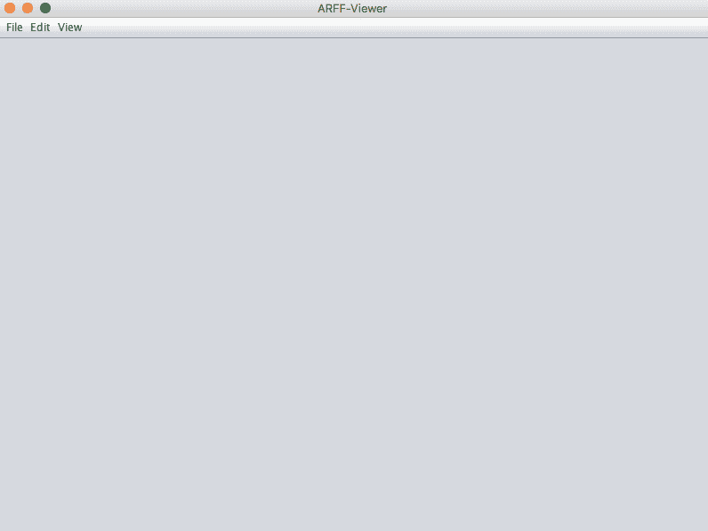
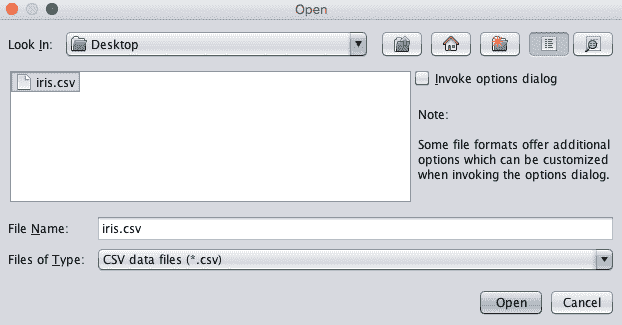
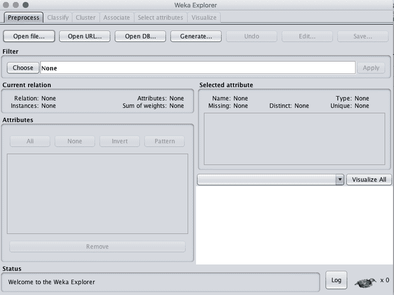

# 如何在 Weka 中加载 CSV 机器学习数据

> 原文：<https://machinelearningmastery.com/load-csv-machine-learning-data-weka/>

最后更新于 2020 年 12 月 10 日

在开始建模之前，您必须能够加载数据。

在这篇文章中，您将发现如何在 Weka 中加载您的 CSV 数据集。看完这篇文章，你会知道:

*   关于 ARFF 文件格式以及它是如何用 Weka 表示数据的默认方式。
*   如何在 Weka 浏览器中加载 CSV 文件并将其保存为 ARFF 格式。
*   如何在 ArffViewer 工具中加载 CSV 文件并将其保存为 ARFF 格式。

本教程假设您已经安装了 Weka。

**用我的新书[用 Weka](https://machinelearningmastery.com/machine-learning-mastery-weka/) 启动你的项目**，包括*的分步教程*和清晰的*截图*所有示例。

我们开始吧。


如何在 Weka 加载 CSV 机器学习数据
图片由[泰利斯](https://www.flickr.com/photos/thales/9371458918/)提供，保留部分权利。

## 如何谈论 Weka 中的数据

机器学习算法主要设计用于数字阵列。

这被称为表格或结构化数据，因为它是数据在电子表格中的外观，由行和列组成。

Weka 在描述数据时有一个特定的以计算机科学为中心的词汇:

*   **实例**:一行数据被称为实例，就像问题域中的实例或观察一样。
*   **属性**:一列数据被称为特征或属性，就像观测的特征一样。

每个属性可以有不同的类型，例如:

*   **实数**为 1.2 这样的数值。
*   **整数**表示没有小数部分的数值，如 5。
*   **名词性**表示“狗”和“猫”等类别数据。
*   **字符串**为单词列表，如这句话。

在分类问题上，输出变量必须是标称的。对于回归问题，输出变量必须是真实的。

## Weka 的数据

Weka 更喜欢以 ARFF 格式加载数据。

ARFF 是代表属性关系文件格式的缩写。它是 CSV 文件格式的扩展，其中使用了一个标题，提供了有关列中数据类型的元数据。

例如，CSV 格式的经典鸢尾花数据集的前几行如下所示:

```py
5.1,3.5,1.4,0.2,Iris-setosa
4.9,3.0,1.4,0.2,Iris-setosa
4.7,3.2,1.3,0.2,Iris-setosa
4.6,3.1,1.5,0.2,Iris-setosa
5.0,3.6,1.4,0.2,Iris-setosa
```

ARFF 格式的相同文件如下所示:

```py
@RELATION iris

@ATTRIBUTE sepallength REAL
@ATTRIBUTE sepalwidth REAL
@ATTRIBUTE petallength REAL
@ATTRIBUTE petalwidth REAL
@ATTRIBUTE class {Iris-setosa,Iris-versicolor,Iris-virginica}

@DATA
5.1,3.5,1.4,0.2,Iris-setosa
4.9,3.0,1.4,0.2,Iris-setosa
4.7,3.2,1.3,0.2,Iris-setosa
4.6,3.1,1.5,0.2,Iris-setosa
5.0,3.6,1.4,0.2,Iris-setosa
```

您可以看到指令以 at 符号(@)开始，并且有一个用于数据集名称的指令(例如@RELATION iris)，有一个用于定义每个属性的名称和数据类型的指令(例如@ATTRIBUTE sepallength REAL)，还有一个用于指示原始数据开始的指令(例如@DATA)。

ARFF 文件中以百分比符号(%)开头的行表示注释。

原始数据部分中带有问号符号(？)表示未知或缺失的值。该格式支持数字和分类值，如上面的 iris 示例，但也支持日期和字符串值。

根据您安装的 Weka，您的 Weka 安装目录中的 *data/* 子目录下可能有也可能没有一些默认数据集。这些与 Weka 一起分发的默认数据集是 ARFF 格式的，并且具有。arff 文件扩展名。

## 在 ARFF 浏览器中加载 CSV 文件

您的数据不太可能是 ARFF 格式。

事实上，它更有可能是逗号分隔值(CSV)格式。这是一种简单的格式，其中数据以行和列的形式排列，逗号用于分隔行中的值。引号也可以用于包围值，尤其是当数据包含带空格的文本字符串时。

CSV 格式很容易从微软 Excel 导出，所以一旦您可以将数据导入 Excel，就可以轻松地将其转换为 CSV 格式。

Weka 提供了一个方便的工具来加载 CSV 文件并保存在 ARFF。您只需要对数据集执行一次此操作。

使用下面的步骤，您可以将数据集从 CSV 格式转换为 ARFF 格式，并与 Weka 工作台一起使用。如果手边没有 CSV 文件，可以使用鸢尾花数据集。从 [UCI 机器学习资源库](https://archive.ics.uci.edu/ml/datasets/Iris) ( [直接链接](https://archive.ics.uci.edu/ml/machine-learning-databases/iris/iris.data))下载文件，保存到当前工作目录为 *iris.csv* 。

1.启动 Weka 选择器。


Weka 图形用户界面选择器截图

2.单击菜单中的“工具”打开 ARFF 查看器，并选择“自动查看器”。

3.您将看到一个空的 ARFF 查看器窗口。



Weka·ARFF 观众

4.通过单击“文件”菜单并选择“打开”，在 ARFF 查看器中打开您的 CSV 文件。导航到当前工作目录。将“文件类型:”过滤器更改为“CSV 数据文件(*。csv)"。选择您的文件，然后单击“打开”按钮。



在 ARFF 浏览器中加载 CSV

5.您应该会看到一个加载到 ARFF 查看器中的 CSV 文件示例。

6.通过单击“文件”菜单并选择“另存为...”，以 ARFF 格式保存数据集。输入扩展名为. arff 的文件名，然后单击“保存”按钮。

您现在可以加载已保存的。arff 文件直接进入 Weka。

注意，ARFF 查看器提供了在保存之前修改数据集的选项。例如，您可以更改值、更改属性的名称以及更改它们的数据类型。

强烈建议您指定每个属性的名称，因为这将有助于以后的数据分析。此外，确保每个属性的数据类型都是正确的。

## 在 Weka 浏览器中加载 CSV 文件

您也可以直接在 Weka Explorer 界面中加载您的 CSV 文件。

如果你赶时间，想快速测试一个想法，这很方便。

本节向您展示了如何在 Weka 资源管理器界面中加载您的 CSV 文件。如果没有要加载的 CSV 数据集，您可以再次使用 iris 数据集进行练习。

1.启动 Weka 图形用户界面选择器。

2.通过单击“浏览器”按钮启动 Weka 浏览器。



Weka 探险家的截图

3.单击“打开文件...”按钮。

4.导航到当前工作目录。将“文件类型”更改为“CSV 数据文件(*)。csv)"。选择您的文件，然后单击“打开”按钮。

您可以直接处理数据。您也可以通过单击“保存”按钮并键入文件名，将数据集保存为 ARFF 格式。

## 将 Excel 用于其他文件格式

如果您有其他格式的数据，请先将其加载到 Microsoft Excel 中。

使用不同的分隔符或固定宽度字段以另一种格式(如 CSV)获取数据是很常见的。Excel 有强大的工具来加载各种格式的表格数据。使用这些工具，首先将数据加载到 Excel 中。

将数据加载到 Excel 后，可以将其导出为 CSV 格式。然后，您可以在 Weka 中使用它，或者直接使用，或者首先将其转换为 ARFF 格式。

## 资源

以下是一些额外的资源，当您在 Weka 中处理 CSV 数据时，这些资源可能会很有用。

*   [属性-关系文件格式](https://waikato.github.io/weka-wiki/formats_and_processing/arff/)
*   [可以使用 CSV 文件吗？](https://waikato.github.io/weka-wiki/formats_and_processing/converting_csv_to_arff/)
*   [CSV 文件格式](https://en.wikipedia.org/wiki/Comma-separated_values)

## 摘要

在这篇文章中，你发现了如何将你的 CSV 数据加载到 Weka 中进行机器学习。

具体来说，您了解到:

*   关于 ARFF 文件格式以及 Weka 如何使用它来表示机器学习的数据集。
*   如何使用 ARFF 查看器加载您的 CSV 数据并将其保存为 ARFF 格式。
*   如何在 Weka Explorer 中直接加载你的 CSV 数据并用于建模。

你对在 Weka 加载数据或这篇文章有什么问题吗？在评论中提问，我会尽力回答。