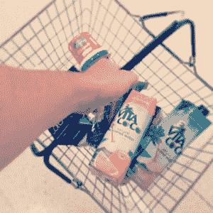
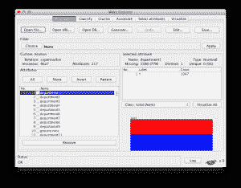

# 使用关联规则学习的菜篮子分析

> 原文：<https://machinelearningmastery.com/market-basket-analysis-with-association-rule-learning/>

最后更新于 2021 年 9 月 15 日

[数据挖掘](https://machinelearningmastery.com/what-is-data-mining-and-kdd/ "What is Data Mining and KDD")的承诺是算法将处理数据，并找到您可以在业务中利用的有趣模式。

这个承诺的范例是市场篮子分析(维基百科称之为[亲和力分析](https://en.wikipedia.org/wiki/Market_basket_analysis))。给定一堆交易记录，发现可以在商店中利用的有趣的购买模式，例如优惠和产品布局。

在这篇文章中，你将在 [Weka](https://machinelearningmastery.com/what-is-the-weka-machine-learning-workbench/ "What is the Weka Machine Learning Workbench") 中使用关联规则学习来学习一个市场篮子分析教程。如果您按照逐步说明进行操作，您将在不到 5 分钟的时间内对销售点数据进行市场篮子分析。

**用我的新书[用 Weka](https://machinelearningmastery.com/machine-learning-mastery-weka/) 启动你的项目**，包括*的分步教程*和清晰的*截图*所有示例。

我们开始吧。

菜篮子分析
图片由[健康量表](https://www.flickr.com/photos/healthgauge/9669593604/sizes/o/)提供，保留部分权利。

## 关联规则学习

我曾经为一家初创公司做过咨询工作，调查 SaaS 应用程序中的客户行为。我们对表明从免费账户到付费账户的流失或转换的行为模式感兴趣。

我花了几周的时间浏览数据，寻找相关性和图表。我想出了一堆规则，指出了结果，并提出了可能的干预措施的想法，以影响这些结果。

我想出了这样的规则:“*用户在 y 天内创建 x 个小部件并登录 n 次，然后他们将转换*”。我将数字归因于规则，例如支持(所有记录中与规则匹配的记录数量)和提升(使用规则预测转换时预测准确性的%增长)。

直到我发表了报告之后，我才意识到我犯了一个多么巨大的错误。我曾经手工执行过[关联规则学习](https://en.wikipedia.org/wiki/Association_rule_learning)，当时有现成的算法可以帮我完成这项工作。

我分享这个故事是为了让它留在你的脑海里。如果您正在筛选大型数据集以寻找感兴趣的模式，那么关联规则学习是您应该使用的一套方法。

## 1.启动 Weka 浏览器

在之前的教程中，我们已经学习了[运行分类器](https://machinelearningmastery.com/how-to-run-your-first-classifier-in-weka/ "How to Run Your First Classifier in Weka")、[设计和运行实验](https://machinelearningmastery.com/design-and-run-your-first-experiment-in-weka/ "Design and Run your First Experiment in Weka")、[算法调整](https://machinelearningmastery.com/how-to-tune-a-machine-learning-algorithm-in-weka/ "How to Tune a Machine Learning Algorithm in Weka")和[集成方法](https://machinelearningmastery.com/improve-machine-learning-results-with-boosting-bagging-and-blending-ensemble-methods-in-weka/ "Improve Machine Learning Results with Boosting, Bagging and Blending Ensemble Methods in Weka")。如果你需要下载和安装 Weka 的帮助，请参考这些以前的帖子。

Weka 图形用户界面选择器

启动 Weka 探索者。

## 2.加载超市数据集

在 Weka 安装的“*数据*”目录中，Weka 附带了许多真实数据集。这非常方便，因为您可以探索和实验这些众所周知的问题，并了解 Weka 中供您使用的各种方法。

加载超市数据集(*数据/超市. arff* )。这是一个销售点信息数据集。数据是名义上的，每个实例代表一个超市的客户交易、购买的产品和涉及的部门。网上关于这个数据集的信息不多，不过你可以从收集数据的个人看到[这个评论(“使用 supermarket.arff 进行学术研究的问题”)](https://list.waikato.ac.nz/hyperkitty/list/wekalist@list.waikato.ac.nz/thread/M5Y6F2ZMYQFBWJTUHJNRHHRS27RWSNQL/)。

在 Weka 浏览器中加载的超市数据集

数据包含 4，627 个实例和 217 个属性。数据被反规格化。每个属性都是二进制的，要么有值(“ *t* ”为真)，要么没有值(“*？*“为失踪”)。有一个名为“total”的名义类属性，它指示事务是小于\$100(低)还是大于\$100(高)。

我们对为 total 创建预测模型不感兴趣。相反，我们感兴趣的是哪些商品是一起购买的。我们有兴趣在这些数据中找到有用的模式，这些模式可能与预测的属性相关，也可能不相关。

## 3.发现关联规则

单击 Weka 浏览器中的“关联”选项卡。已经选择了[先验](https://en.wikipedia.org/wiki/Apriori_algorithm)算法。这是最广为人知的关联规则学习方法，因为它可能是第一种( [Agrawal 和 Srikant 在 1994 年](http://rakesh.agrawal-family.com/papers/vldb94apriori.pdf))并且非常高效。

原则上，算法很简单。它建立属性值(项目)集，最大化可以解释的实例数量(数据集的覆盖范围)。通过项目空间的搜索与属性选择和子集搜索面临的问题非常相似。

点击*开始*按钮，在数据集上运行 Apriori。

## 4.分析结果

关联规则学习的真正工作是解释结果。

Weka 先验关联规则学习的结果

从 *Associator 输出*窗口可以看到，算法呈现了从超市数据集学习到的 10 条规则。默认情况下，该算法被配置为停止在 10 个规则，您可以单击算法名称，并通过更改“*规则数*”值来配置它，以查找和报告更多规则。

这些规则发现了:

1.  饼干=t 冷冻食品=t 水果=t 总量=高 788 == >面包和蛋糕=t 723 conf:(0.92)
2.  烘焙需求=t 饼干=t 水果=t 总量=高 760 == >面包和蛋糕=t 696 conf:(0.92)
3.  烘焙需求=t 冷冻食品=t 水果=t 总量=高 770 == >面包和蛋糕=t 705 conf:(0.92)
4.  饼干=t 水果=t 蔬菜=t 总数=高 815 == >面包和蛋糕=t 746 conf:(0.92)
5.  派对零食=t 水果=t 总数=高 854 == >面包和蛋糕=t 779 conf:(0.91)
6.  饼干=t 冷冻食品=t 蔬菜=t 总量=高 797 == >面包和蛋糕=t 725 conf:(0.91)
7.  烘焙需求=t 饼干=t 蔬菜=t 总量=高 772 == >面包和蛋糕=t 701 conf:(0.91)
8.  饼干=t 水果=t 总数=高 954 == >面包和蛋糕=t 866 conf:(0.91)
9.  冷冻食品=t 水果=t 蔬菜=t 总量=高 834 == >面包和蛋糕=t 757 conf:(0.91)
10.  冷冻食品=t 水果=t 总量=高 969 == >面包和蛋糕=t 877 conf:(0.91)

很酷，对吧！

您可以看到规则以先行= >后续格式呈现。与先行词相关联的数字是数据集中的绝对覆盖范围(在本例中是 4，627 个可能总数中的一个数字)。结果旁边的数字是匹配前因和结果的实例的绝对数量。末尾括号中的数字是对规则的支持(先行数除以匹配的结果数)。您可以看到，在选择规则时使用了 91%的截止值，在“关联者输出”窗口中提到了这一点，并在中指出没有任何规则的覆盖率小于 0.91。

我不想把 10 条规则都过一遍，那太麻烦了。以下是一些观察结果:

*   我们可以看到，所有呈现的规则都有一个“面包和蛋糕”的结果。
*   所有提交的规则都表明交易总额很高。
*   “饼干”和“冷冻食品”出现在许多规定中。

你必须非常小心地解释关联规则。它们是关联(认为相互关联)，不是必然的因果关系。此外，短先行词可能比长先行词更健壮，长先行词更脆弱。

增加篮筐尺寸
图片由 [goosmurf](https://www.flickr.com/photos/goosmurf/2488276329/sizes/l/) 提供，保留部分权利。

例如，如果我们对总额感兴趣，我们可能想说服购买饼干、冷冻食品和水果的人购买面包和蛋糕，这样他们就可以获得较高的交易总额(规则#1)。这听起来似乎有道理，但却是有缺陷的推理。产品组合不会导致高总额，它只与高总额相关联。除了规则中的项目外，这 723 笔交易可能还有大量随机项目。

测试可能有趣的是对收集相关商品所需的商店路径进行建模，并查看对该路径的更改(更短、更长、显示的优惠等)是否对交易规模或购物篮规模有影响。

## 摘要

在这篇文章中，你发现了从大型数据集中自动学习关联规则的能力。您了解到使用像 Apriori 这样的算法比手工推导规则要有效得多。

您在 Weka 执行了第一次市场篮子分析，并了解到真正的工作是在结果分析中。你发现在解释规则时需要仔细注意细节，关联(相关性)与因果关系不同。