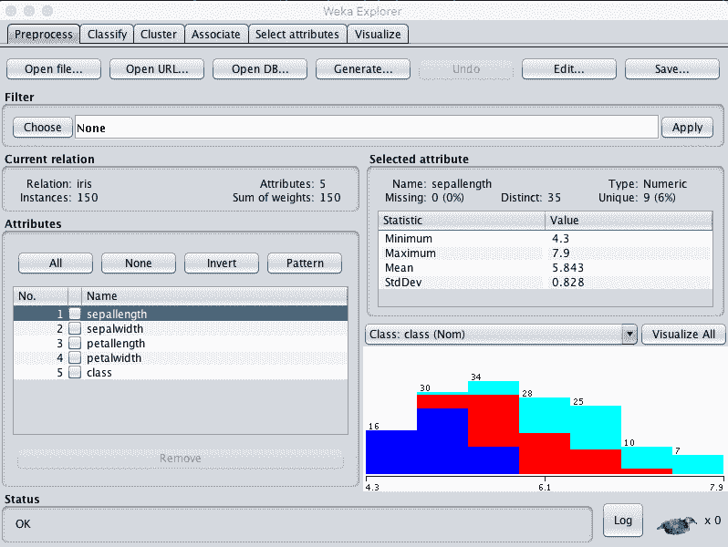
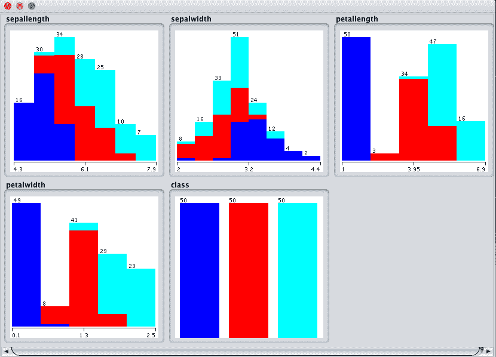
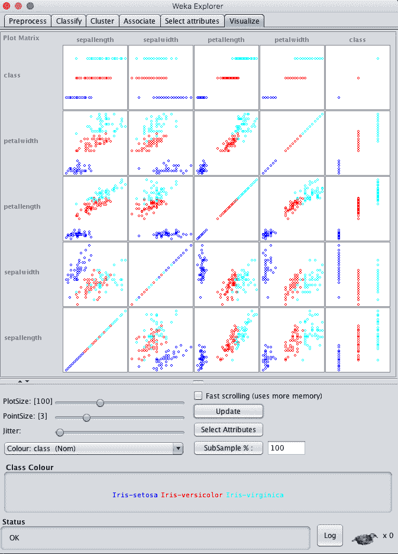
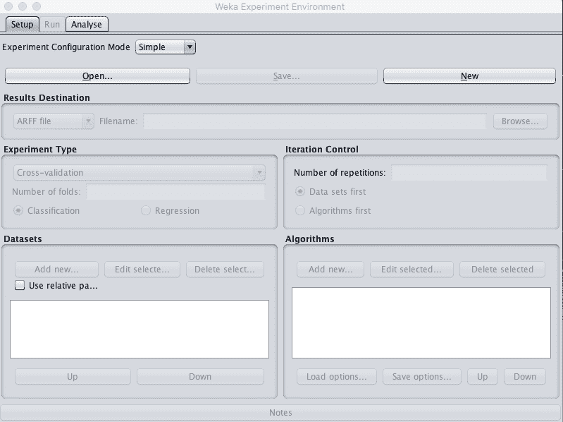
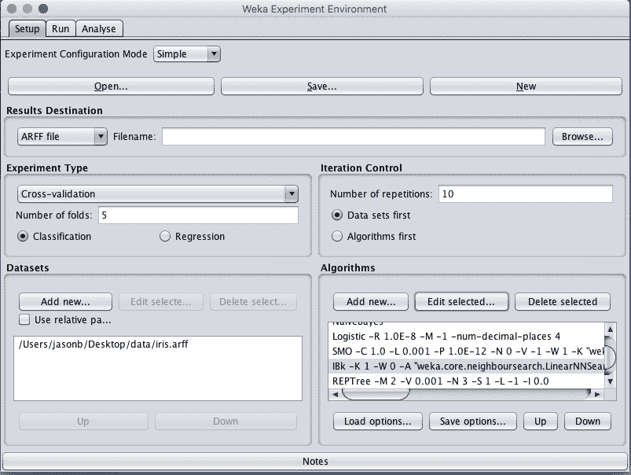
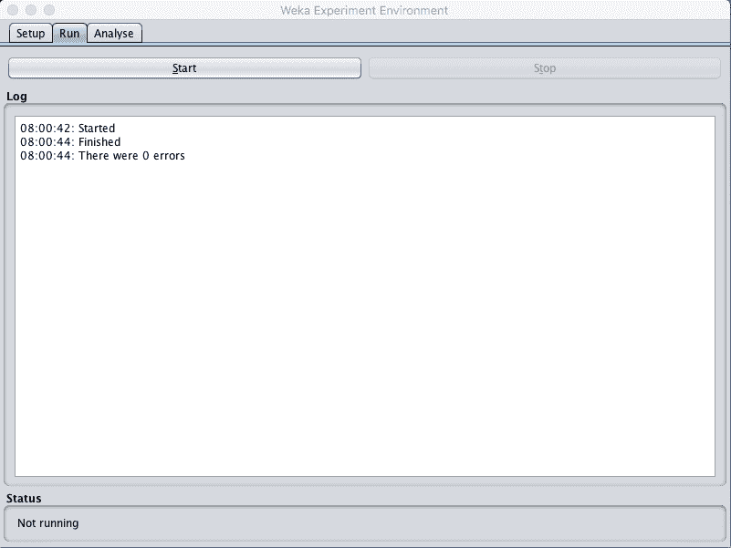
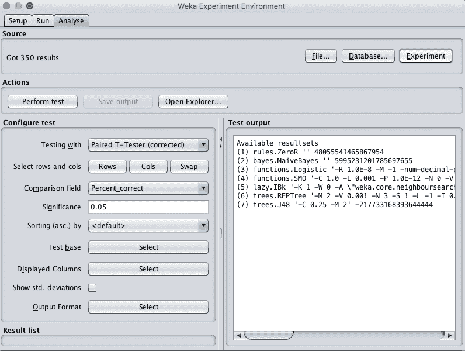
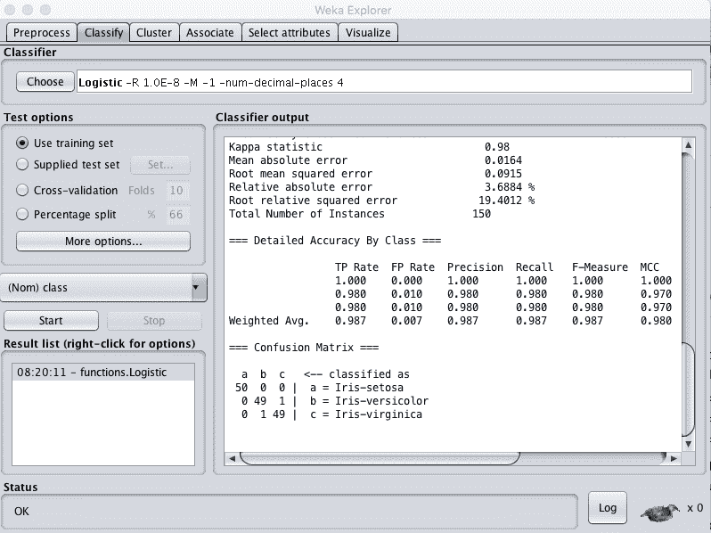

# 如何在 Weka 完成多类分类项目

> 原文：<https://machinelearningmastery.com/multi-class-classification-tutorial-weka/>

最后更新于 2019 年 8 月 22 日

Weka 机器学习工作台非常容易使用，通过机器学习项目工作会非常有趣。

在这篇文章中，你将使用 Weka 端到端地完成你的第一个机器学习项目。这个温和的项目工作入门将把你在 Weka 完成机器学习项目时需要完成的关键步骤联系在一起。

完成本项目后，您将知道:

*   如何分析数据集并假设可以使用的数据准备和建模算法。
*   如何在一个问题上抽查一套标准的机器学习算法
*   如何呈现最终结果？

**用我的新书[用 Weka](https://machinelearningmastery.com/machine-learning-mastery-weka/) 启动你的项目**，包括*的分步教程*和清晰的*截图*所有示例。

我们开始吧。


Weka
多类分类教程 [Johan Neven](https://www.flickr.com/photos/enneafive/14324446578/) 摄，保留部分权利。

## 教程概述

本教程将逐步指导您完成机器学习项目所需的关键步骤。

我们将通过以下流程开展工作:

1.  加载数据集。
2.  分析数据集。
3.  评估计法。
4.  展示结果。

您可以将此作为流程中最少步骤的模板，使用 Weka 完成您自己的机器学习项目。

## 1.加载数据集

在本教程中，我们将使用鸢尾花类别数据集。

虹膜数据集中的每个实例都描述了鸢尾花的测量值，任务是预测观察属于哪 3 种鸢尾花。有 4 个数值输入变量，单位相同，尺度一般相同。您可以在 [UCI 机器学习资源库](https://archive.ics.uci.edu/ml/datasets/Iris)中了解更多数据集。最高的结果大约是 96%的准确率。

1.打开 Weka 图形用户界面选择器。


Weka 图形用户界面选择器

2.单击“浏览器”按钮打开 Weka 浏览器。

3.点击“打开文件…”按钮，导航至*数据/* 目录，选择 *iris.arff* 。单击“打开”按钮。

数据集现在被加载到 Weka 中。



Weka 加载鸢尾花数据集

## 2.分析数据集

在开始建模之前，查看您的数据非常重要。

回顾每个属性的分布和属性之间的交互可能会对我们可以使用的特定数据转换和特定建模技术有所启发。

### 汇总统计

在“当前关系”窗格中查看数据集的详细信息。我们可以注意到一些事情:

*   数据集被称为 iris。
*   有 150 个例子。如果我们稍后使用 10 倍交叉验证来评估计法，那么每个折叠将由 15 个实例组成，这是相当小的。我们可能想考虑使用 30 个实例的 5 倍来代替。
*   有 5 个属性，4 个输入和 1 个输出变量。

有少量属性，我们可以使用特征选择方法进一步研究。

单击“属性”窗格中的每个属性，并查看“选定属性”窗格中的汇总统计信息。

我们可以注意到一些关于数据的事实:

*   任何属性都没有缺失值。
*   所有输入都是数字，其值在大约 0 到大约 8 之间的相同范围内。
*   最后一个属性是名为 class 的输出变量，它是标称的，有三个值。
*   这些类是平衡的，这意味着每个类中有相同数量的实例。如果它们不平衡，我们可能要考虑平衡它们。

我们可能会从数据的规范化或标准化中看到一些好处。

### 属性分布

单击“全部可视化”按钮，查看每个属性的图形分布。



Weka 单变量属性分布图

我们可以注意到一些关于数据形状的事情:

*   我们可以看到每个属性上每个类值的重叠但不同的分布。这是一个好的迹象，因为我们可能可以分开上课。
*   看起来 sepalwidth 有一个类似高斯的分布。如果我们有更多的数据，也许它会更高斯。
*   看起来其他 3 个输入属性具有近似高斯分布，在分布的低端有偏斜或大量观察值。同样，这让我认为，如果我们有更多数量级的例子，数据可能是高斯的。
*   我们还获得了一个视觉指示，表明这些类是平衡的。

### 属性交互

单击“可视化”选项卡，让我们查看属性之间的一些交互。

*   增加窗口大小，以便所有图都可见。
*   将“点大小”增加到 3，使点更容易看到。
*   单击“更新”按钮应用更改。



Weka 属性散点图矩阵

查看输入变量的图表，我们可以看到散点图上的类之间有很好的分离。例如，花瓣宽度对分离强度和花瓣宽度对分离强度就是很好的例子。

这表明线性方法，可能还有决策树和基于实例的方法可以很好地解决这个问题。它还建议我们可能不需要花太多时间调整或使用先进的建模技术和集成。这可能是一个简单的建模问题。

## 3.评估计法

让我们设计一个小实验来评估这个问题的一套标准分类算法。

1.关闭 Weka 浏览器。

2.单击 Weka 图形用户界面选择器上的“实验者”按钮，启动 Weka 实验环境。



Weka 实验环境

3.点击“新建”开始新的实验。

4.在“实验类型”窗格中，将“折叠数”从“10”更改为“5”。

5.在“数据集”窗格中，单击“添加新的…”并在您的 Weka 安装目录中选择 *data/iris.arff* 。

6.在“算法”窗格中，单击“添加新的…”并添加以下 8 种多类分类算法:

*   规则。零
*   贝叶斯。天真的贝叶斯
*   功能。物流的
*   功能。高年资军医(senior medical officer)
*   放松，IBk
*   规则。部分
*   树木。REPTree
*   树木。J48

7.在算法列表中选择 IBK，然后单击“编辑所选...”按钮。

8.将“KNN”从“1”更改为“3”，然后单击“确定”按钮保存设置。



Weka 设计算法比较实验

9.点击“运行”打开“运行”标签，点击“开始”按钮运行实验。实验应该在几秒钟内完成。



Weka 执行 Weka 算法比较实验

10.点击“分析”打开“分析”标签。单击“实验”按钮加载实验结果。



Weka 负载算法对比实验结果

11.单击“执行测试”按钮执行成对测试，将所有结果与 ZeroR 的结果进行比较。

```py
Tester:     weka.experiment.PairedCorrectedTTester -G 4,5,6 -D 1 -R 2 -S 0.05 -result-matrix "weka.experiment.ResultMatrixPlainText -mean-prec 2 -stddev-prec 2 -col-name-width 0 -row-name-width 25 -mean-width 0 -stddev-width 0 -sig-width 0 -count-width 5 -print-col-names -print-row-names -enum-col-names"
Analysing:  Percent_correct
Datasets:   1
Resultsets: 7
Confidence: 0.05 (two tailed)
Sorted by:  -
Date:       10/06/16 8:02 AM

Dataset                   (1) rules.Ze | (2) bayes (3) funct (4) funct (5) lazy. (6) trees (7) trees
----------------------------------------------------------------------------------------------------
iris                      (50)   33.33 |   95.47 v   96.33 v   96.33 v   95.20 v   94.27 v   94.53 v
----------------------------------------------------------------------------------------------------
                               (v/ /*) |   (1/0/0)   (1/0/0)   (1/0/0)   (1/0/0)   (1/0/0)   (1/0/0)

Key:
(1) rules.ZeroR '' 48055541465867954
(2) bayes.NaiveBayes '' 5995231201785697655
(3) functions.Logistic '-R 1.0E-8 -M -1 -num-decimal-places 4' 3932117032546553727
(4) functions.SMO '-C 1.0 -L 0.001 -P 1.0E-12 -N 0 -V -1 -W 1 -K \"functions.supportVector.PolyKernel -E 1.0 -C 250007\" -calibrator \"functions.Logistic -R 1.0E-8 -M -1 -num-decimal-places 4\"' -6585883636378691736
(5) lazy.IBk '-K 1 -W 0 -A \"weka.core.neighboursearch.LinearNNSearch -A \\\"weka.core.EuclideanDistance -R first-last\\\"\"' -3080186098777067172
(6) trees.REPTree '-M 2 -V 0.001 -N 3 -S 1 -L -1 -I 0.0' -9216785998198681299
(7) trees.J48 '-C 0.25 -M 2' -217733168393644444
```

我们可以看到所有的模特都有技巧。每个模型的得分都优于零，差异具有统计学意义。

结果表明，逻辑回归和 SVM 达到最高的准确性。如果我们要在两者之间进行选择，我们会选择逻辑回归，如果没有其他原因，这是一个简单得多的模型。让我们将所有结果与作为测试基础的逻辑回归结果进行比较。

12.单击“测试基地”的“选择”，选择“功能”。逻辑”并单击“选择”按钮选择新的测试基地。再次单击“执行测试”按钮执行新的分析。

```py
Tester:     weka.experiment.PairedCorrectedTTester -G 4,5,6 -D 1 -R 2 -S 0.05 -result-matrix "weka.experiment.ResultMatrixPlainText -mean-prec 2 -stddev-prec 2 -col-name-width 0 -row-name-width 25 -mean-width 2 -stddev-width 2 -sig-width 1 -count-width 5 -print-col-names -print-row-names -enum-col-names"
Analysing:  Percent_correct
Datasets:   1
Resultsets: 7
Confidence: 0.05 (two tailed)
Sorted by:  -
Date:       10/06/16 8:05 AM

Dataset                   (3) function | (1) rules (2) bayes (4) funct (5) lazy. (6) trees (7) trees
----------------------------------------------------------------------------------------------------
iris                      (50)   96.33 |   33.33 *   95.47     96.33     95.20     94.27     94.53
----------------------------------------------------------------------------------------------------
                               (v/ /*) |   (0/0/1)   (0/1/0)   (0/1/0)   (0/1/0)   (0/1/0)   (0/1/0)

Key:
(1) rules.ZeroR '' 48055541465867954
(2) bayes.NaiveBayes '' 5995231201785697655
(3) functions.Logistic '-R 1.0E-8 -M -1 -num-decimal-places 4' 3932117032546553727
(4) functions.SMO '-C 1.0 -L 0.001 -P 1.0E-12 -N 0 -V -1 -W 1 -K \"functions.supportVector.PolyKernel -E 1.0 -C 250007\" -calibrator \"functions.Logistic -R 1.0E-8 -M -1 -num-decimal-places 4\"' -6585883636378691736
(5) lazy.IBk '-K 1 -W 0 -A \"weka.core.neighboursearch.LinearNNSearch -A \\\"weka.core.EuclideanDistance -R first-last\\\"\"' -3080186098777067172
(6) trees.REPTree '-M 2 -V 0.001 -N 3 -S 1 -L -1 -I 0.0' -9216785998198681299
(7) trees.J48 '-C 0.25 -M 2' -217733168393644444
```

我们现在看到了一个非常不同的故事。虽然逻辑分析的结果看起来更好，但分析表明，这些结果与所有其他算法的结果之间的差异在统计上并不显著。

从这里，我们可以选择一个基于其他标准的算法，如可理解性或复杂性。从这个角度来看，逻辑回归和朴素贝叶斯是很好的选择。

我们还可以寻求进一步改进这些算法中的一个或多个的结果，并看看我们是否能够实现显著的改进。如果我们将“显著性”更改为 0.50 的较小约束值，我们可以看到树和 KNN 算法开始消失。这表明我们可以花更多的时间在剩下的方法上。将“显著性”改回“0.05”。

让我们选择坚持逻辑回归。我们可以收集一些数字，用来描述模型在看不见的数据上的表现。

13.选中“显示标准”。偏差”来表示准确度分数的标准偏差。

14.单击“显示的列”的“选择”按钮，然后选择“功能”。物流”，点击“选择”接受选择。这将只显示逻辑回归算法的结果。

15.单击“执行测试”重新运行分析。

我们现在有了一个可以用来描述我们模型的最终结果。

```py
Tester:     weka.experiment.PairedCorrectedTTester -G 4,5,6 -D 1 -R 2 -S 0.05 -V -result-matrix "weka.experiment.ResultMatrixPlainText -mean-prec 2 -stddev-prec 2 -col-name-width 0 -row-name-width 25 -mean-width 2 -stddev-width 2 -sig-width 1 -count-width 5 -show-stddev -print-col-names -print-row-names -enum-col-names"
Analysing:  Percent_correct
Datasets:   1
Resultsets: 7
Confidence: 0.05 (two tailed)
Sorted by:  -
Date:       10/06/16 8:12 AM

Dataset                   (3) functions.Logist
----------------------------------------------
iris                      (50)   96.33(3.38) |
----------------------------------------------
(v/ /*) |

Key:
(3) functions.Logistic '-R 1.0E-8 -M -1 -num-decimal-places 4' 3932117032546553727
```

我们可以看到，模型对未知数据的估计准确率为 96.33%，标准偏差为 3.38%。

## 4.最终确定模型并展示结果

我们可以根据所有训练数据创建模型的最终版本，并将其保存到文件中。

1.关闭 Weka 实验环境。

2.打开 Weka Explorer，加载*数据/iris.arff* 数据集。

3.单击分类选项卡。

4.选择功能。逻辑算法。

5.将“测试选项”从“交叉验证”更改为“使用训练集”。

6.单击“开始”按钮创建最终模型。



基于整个训练数据集的 Weka 训练最终模型

7.右键单击“结果列表”中的结果项，然后选择“保存模型”。选择一个合适的位置，并输入一个合适的名称，如“iris-logistics”为您的模型。

这个模型可以在以后加载，并用于预测新的花朵尺寸。

我们可以使用上一节中收集的模型准确率的平均值和标准偏差来帮助量化模型在未知数据上的估计准确率的预期可变性。

例如，我们知道 95%的模型准确率将落在平均模型准确率的两个标准偏差内。或者，以我们可以向其他人解释的方式重述，我们通常可以预期模型在未看到的数据上的表现将为 96.33%±2 * 3.38 或 6.76，或者在 87.57%和 100%之间准确。

你可以在维基百科名为[68–95–99.7 规则](https://en.wikipedia.org/wiki/68%E2%80%9395%E2%80%9399.7_rule)的页面中了解更多关于使用高斯分布的平均值和标准差的信息。

## 摘要

在这篇文章中，您使用 Weka 机器学习工作台端到端地完成了您的第一个机器学习项目。

具体来说，您了解到:

*   如何分析数据集，并建议可能有用的特定数据转换和建模技术。
*   如何抽查问题上的一套算法并分析其结果？
*   如何最终确定模型，以便对新数据进行预测，并根据看不见的数据显示模型的估计准确率。

你对在 Weka 运行机器学习项目或这篇文章有什么问题吗？在评论中提出你的问题，我会尽力回答。