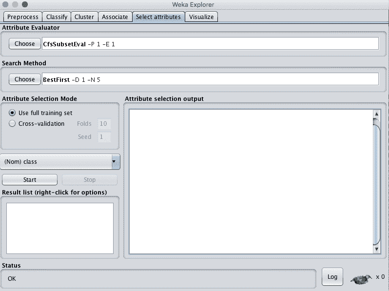
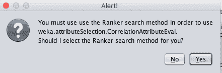
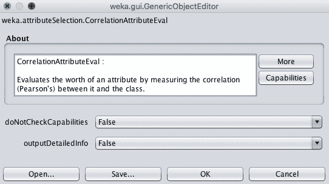
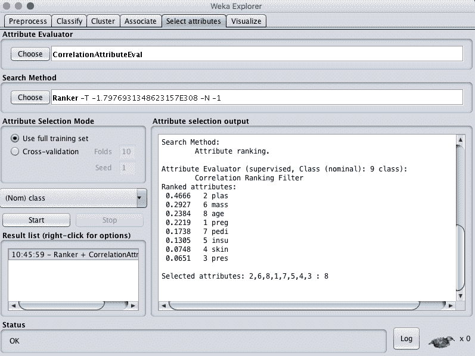
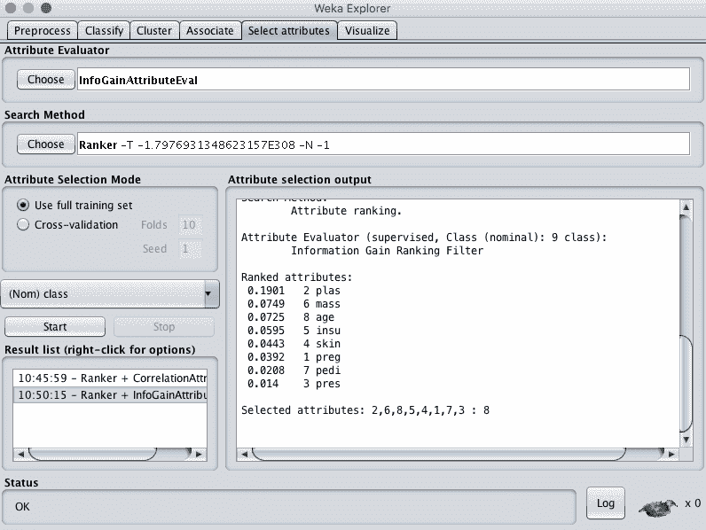
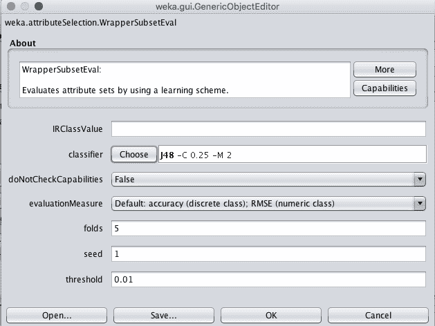
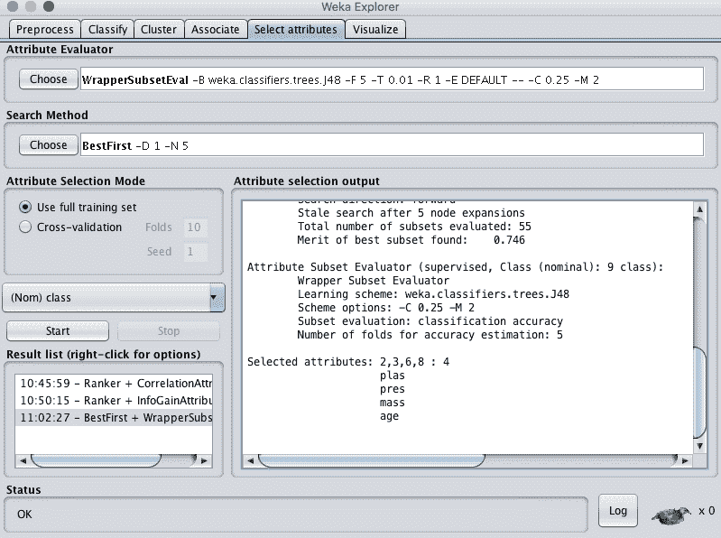
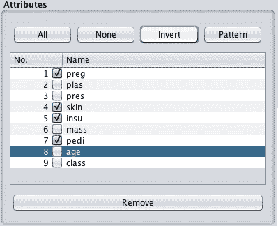

# 如何在 Weka 中用机器学习数据执行特征选择

> 原文：<https://machinelearningmastery.com/perform-feature-selection-machine-learning-data-weka/>

最后更新于 2019 年 12 月 13 日

原始机器学习数据包含多种属性，其中一些与做出预测相关。

您如何知道使用哪些功能和删除哪些功能？在数据中选择特征来模拟问题的过程称为[特征选择](https://machinelearningmastery.com/an-introduction-to-feature-selection/)。

在这篇文章中，你将发现如何在 Weka 中用你的机器学习数据进行特征选择。

看完这篇文章你会知道:

*   关于处理机器学习问题时特征选择的重要性。
*   Weka 平台如何支持功能选择。
*   如何在数据集上使用 Weka 中各种不同的特征选择技术。

**用我的新书[用 Weka](https://machinelearningmastery.com/machine-learning-mastery-weka/) 启动你的项目**，包括*的分步教程*和清晰的*截图*所有示例。

我们开始吧。

*   **2018 年 3 月更新**:增加了下载数据集的替代链接，因为原件似乎已经被取下来。

如何使用 Weka
中的机器学习数据执行特征选择图片作者: [Peter Gronemann](https://www.flickr.com/photos/39463459@N08/7620843202/) ，版权所有。

## 预测糖尿病的发作

本例中使用的数据集是皮马印第安人糖尿病发病数据集。

这是一个分类问题，其中每个实例代表一个患者的医疗细节，任务是预测该患者是否会在未来五年内出现糖尿病。

您可以在此了解有关数据集的更多信息:

*   [数据集文件](https://raw.githubusercontent.com/jbrownlee/Datasets/master/pima-indians-diabetes.csv)。
*   [数据集详细信息](https://raw.githubusercontent.com/jbrownlee/Datasets/master/pima-indians-diabetes.names)

您也可以在您的 Weka 安装中，在名为 *diabetes.arff* 的文件中的 *data/* 目录下访问该数据集。

## Weka 的特色选择

Weka 支持许多功能选择技术。

开始探索 Weka 功能选择的一个好地方是在 Weka 浏览器中。

1.  打开 Weka 图形用户界面选择器。
2.  单击“资源管理器”按钮启动资源管理器。
3.  打开皮马印第安人数据集。
4.  单击“选择属性”选项卡访问功能选择方法。

Weka 功能选择

特征选择分为两部分:

*   属性求值器
*   搜索方法。

每个部分都有多种技术可供选择。

属性赋值器是一种在输出变量(例如类)的上下文中对数据集中的每个属性(也称为列或要素)进行求值的技术。搜索方法是一种尝试或导航数据集中不同属性组合的技术，目的是获得所选要素的简短列表。

一些属性评估技术需要使用特定的搜索方法。例如，下一节中使用的相关性属性评估技术只能与排名搜索方法一起使用，该方法评估每个属性并按排名顺序列出结果。选择不同的属性赋值器时，界面可能会要求您将搜索方法更改为与所选技术兼容的方法。

Weka 功能选择警报

属性评估器和搜索方法技术都可以配置。选择后，单击该技术的名称以获取其配置详细信息。

Weka 功能选择配置

单击“更多”按钮，获取有关功能选择技术和配置参数的更多文档。将鼠标光标悬停在配置参数上可获得包含更多详细信息的工具提示。

Weka 功能选择更多信息

现在我们知道了如何在 Weka 中访问特征选择技术，让我们看看如何在我们选择的标准数据集上使用一些流行的方法。

## 基于相关性的特征选择

选择数据集中最相关属性的一种流行技术是使用相关性。

相关性在统计学中更正式地称为[皮尔逊相关系数](https://machinelearningmastery.com/how-to-use-correlation-to-understand-the-relationship-between-variables/)。

您可以计算每个属性和输出变量之间的相关性，并只选择那些具有中到高正相关性或负相关性(接近-1 或 1)的属性，并删除那些低相关性(值接近零)的属性。

Weka 通过要求使用 Ranker 搜索方法的 CorrelationAttributeEval 技术支持基于相关性的特征选择。

在我们的皮马印第安人数据集上运行这一结果表明，一个属性(plas)与输出类的相关性最高。它也暗示了一系列具有适度相关性的属性(体重、年龄、孕龄)。如果我们使用 0.2 作为相关属性的截止值，那么剩下的属性可能会被移除(pedi、insu、skin 和 pres)。

基于 Weka 相关性的特征选择方法

## 基于信息增益的特征选择

另一种流行的特征选择技术是计算信息增益。

您可以为输出变量的每个属性计算信息增益(也称为[熵](https://en.wikipedia.org/wiki/Entropy_(information_theory)))。条目值从 0(无信息)到 1(最大信息)不等。那些贡献更多信息的属性将具有更高的信息增益值，并且可以被选择，而那些没有添加太多信息的属性将具有更低的分数，并且可以被移除。

Weka 支持使用信息增益属性评估器通过信息增益选择特征。像上面的相关技术一样，必须使用 Ranker 搜索方法。

在我们的皮马印第安人身上运行这项技术，我们可以看到一个属性比所有其他属性贡献更多的信息。如果我们使用 0.05 的任意截止值，那么我们也将选择质量、年龄和 insu 属性，并从我们的数据集中删除其余的属性。

基于 Weka 信息增益的特征选择方法

## 基于学习器的特征选择

一种流行的特征选择技术是使用通用但强大的学习算法，并在选择了不同属性子集的数据集上评估计法的表现。

产生最佳表现的子集被视为所选子集。用于评估子集的算法不一定是您打算用来建模您的问题的算法，但是它通常应该快速训练并且功能强大，就像决策树方法一样。

在 Weka 中，这种类型的功能选择受 WrapperSubsetEval 技术支持，并且必须使用 GreedyStepwise 或 BestFirst 搜索方法。如果你能抽出计算时间，最好选择后者。

1.首先选择“WrapperSubsetEval”技术。

2.单击名称“WrapperSubsetEval”打开该方法的配置。

3.单击“分类器”的“选择”按钮，并将其更改为“树”下的 J48。

Weka 包装器功能选择配置

4.单击“确定”接受配置。

5.将“搜索方法”更改为“最佳优先”。

6.单击“开始”按钮评估功能。

在皮马印第安人数据集上运行这种特征选择技术可以从 8 个输入变量中选择 4 个:plas、pres、mass 和 age。

Weka 包装器特征选择方法

## 在 Weka 中选择属性

回顾这三种技术，我们可以看到所选特征(例如 plas)有一些重叠，但也有差异。

评估机器学习数据集的多个不同“视图”是一个好主意。数据集视图只不过是由给定要素选择技术选择的要素子集。这是你的数据集的副本，你可以很容易地在 Weka。

例如，从上一个特征选择技术的结果来看，假设我们想要创建一个只有以下属性的皮马印第安人数据集视图:plas、pres、mass 和 age:

1.单击“预处理”选项卡。

2.在“属性”选项中，勾选除塑料、压力、质量、年龄和等级属性之外的所有属性。

Weka 选择要从数据集中移除的属性

3.单击“删除”按钮。

4.单击“保存”按钮并输入文件名。

现在，您有了一个新的数据集视图要探索。

从数据集中移除的 Weka 属性

## 使用什么特征选择技术

您无法知道哪些数据视图将产生最准确的模型。

因此，在您的数据上尝试多种不同的要素选择技术，进而创建数据的多种不同视图是一个好主意。

选择一种好的通用技术，比如决策树，为数据的每个视图建立一个模型。

比较结果，了解哪种数据视图的表现最好。这将给你一个视图的概念，或者更具体地说，给你的学习算法提供最好的问题结构的特性。

## 摘要

在这篇文章中，您发现了特征选择的重要性，以及如何使用 Weka 对数据进行特征选择。

具体来说，您了解到:

*   如何利用相关性进行特征选择？
*   如何利用信息增益进行特征选择？
*   如何通过在不同的特征子集上训练模型来执行特征选择。

你对 Weka 的功能选择或这篇文章有什么问题吗？在评论中提问，我会尽力回答。